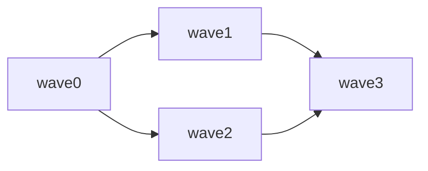

# <任务标题> — 执行计划 (Execution Plan)

> **来源**: issue #<N> · 故障分析: tmp/<date>/<topic>/failure.md
> **当前 wave**: wave0 · **上次执行**: — · **下一步**: 完成 wave0 验收项

<!-- 头部元信息块：来源指向卡与故障分析（plan 的来源）；「当前 wave」是状态指针——新 session 的 agent 读这里恢复执行。 -->

## 1. 目标与完成判定 (Goal & Completion)

<一句话目标。完成判定：外部可验证的标准，与各 wave 的验收 checkbox 对应。>

## 2. 动因与证据 (Motivation & Evidence)

<为什么做，限 2–5 行。只写结论与证据指针，不重复分析过程（过程在故障分析 / spec 里）。证据: tmp/<date>/<topic>/evidence.md>

## 3. 范围与拆分方案 (Scope & Decomposition)

### 子目标 (Sub-goals)
- **子目标 1**: <目标> — 方案: <怎么做>
- **子目标 2**: <目标> — 方案: <怎么做>（取舍: 候选 X 因 <理由> 未被选 —— 仅多方案并存或选择有争议时写）

### 非目标 (Non-goals)
- <明确不做、但容易被误以为要做的项>；没有则写「无」

### 授权 (Authority)
- 可自主: <执行中 agent 可自行决定的边界>
- 必须请示: 新增依赖 / 变更契约 → 停下列出选项，等人工确认

## 4. 影响与依赖 (Impact & Dependencies)

### 4.1 依赖 DAG（文本边列表为事实源）
- wave0 -> wave1
- wave0 -> wave2
- wave1 -> wave3
- wave2 -> wave3

### 4.2 影响（结论表，只写结论）
| 受影响对象 | 契约影响 | 传播路径 | 风险（概率×严重度 1–3） | 验证方式 |
|---|---|---|---|---|
| component:execution | none | wave2 → wave3 | 2×2 | 回归 1 |
| component:contracts | contract-change | wave1 → wave3 | 2×3 | 契约评审 |

## 5. 执行计划 (Execution Plan, wave0..N)

### wave0 — 验证假设（有假设必填；无假设写「无」）
- [ ] 假设 A 已核实（证据: <路径>）
- [ ] 复现故障（证据: <路径>）
- 退出条件: 假设 A 证伪 → 中断，等人工

### wave1 — <目标>
- [ ] 验收项 1-1（外部可验证）
- [ ] 验收项 1-2（外部可验证）
- 退出条件: 无

### wave2 — <目标>
- [ ] 验收项 2-1（外部可验证）
- 退出条件: 无

### wave3 — <目标>
- [ ] 验收项 3-1（外部可验证）
- 退出条件: 无

<!-- 进度 = checkbox 勾选状态（人看）；位置 = 头部「当前 wave」指针（agent 读）；wave 非完成态停下时加注记行：> 注记: <中断原因> -->

## 权威来源与上下文索引 (Sources & Context Index)

- 来源卡: https://github.com/<owner>/<repo>/issues/<N>
- 故障分析: tmp/<date>/<topic>/failure.md
- spec / 设计: <链接>
- 证据与工件: tmp/<date>/<topic>/<...>
- 协议: .project/requirements/ · .project/plans/plan-rules.md
