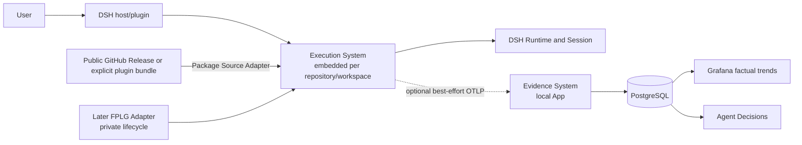

<a id="ee-concept"></a>
# Agent Ops Ledger: Conceptual Architecture

<a id="ee-concept-1"></a>
## 1. Metadata and Authority

| Field | Value |
| --- | --- |
| Document identity | `EE-CONCEPT-001` |
| Publication status | `WORKING_REVIEW_CANDIDATE`; prior bounded review, translation, and fresh-reader closure apply to earlier bytes only. These changed bytes require fresh deterministic parity/publication binding and user or reader review before exact publication |
| Authority after promotion | Sole versionless conceptual authority for Agent Ops Ledger |
| Normative language | English |
| Translation | [`agent-architecture.zh-CN.md`](agent-architecture.zh-CN.md) is a non-normative tracking translation. English is the sole semantic authority. Whenever an English section changes, its Chinese counterpart is retranslated from the current English section and replaced as a whole; Chinese maintenance does not preserve or incrementally evolve prior Chinese wording. |
| Confirmed intent | `EE-BRIEF`, SHA-256 `52773b19a4ca112d0fb8699c14885b30d0b5fdc1c61b6747e426b568175a4ba9` |
| Confirmed direction | `EE-SKELETON`, SHA-256 `73b3481a099983b57ee9e1dd512c6ed23823f0d045085f9ef585db70be13949a` |
| Feasibility | SD-06 aggregate, SHA-256 `c70303892e2d68f95e83b12c84940d9f3e41dad6f7a1e269b376da69e4adbf6e`; `FEASIBILITY_CONFIRMED` |
| Workflow Package import intent and direction | `EE-WORKFLOW-IMPORT-BRIEF` SHA-256 `7c9b1064084cf5f256f27bc5efd021bed0374910e1430586eebeb695344d4c6d`; `EE-WORKFLOW-IMPORT-SKELETON` SHA-256 `86a2a61a324d9bb7ca90108b433ded2f883bc91d9f60dadee87ac7d11feb8e46` |
| Workflow Package import feasibility | `EE-WORKFLOW-IMPORT-SD06-APPLICATION`; SHA-256 `c6714b9c850536273a00b929559f6d71b8ff2c8aeb1f2aaf8054c14c53ca5795`; `FEASIBILITY_CONFIRMED` within recorded environments and limitations |
| Targeted simplification authority | `EE-WORKFLOW-IMPORT-MVP-SIMPLIFICATION-RR`; removes mechanisms only, adds no feasibility question, and authorizes bounded affected review |
| Historical large-workflow review lineage | Problem–Solution, Architecture, and Quality review results from the larger Workflow-import design remain historical evidence for unchanged content only. |
| Historical large-workflow Finding accounting | `EE-WORKFLOW-IMPORT-SD10-AGGREGATION` is historical and is not the Finding account for this targeted simplification. |
| Historical design-parameter and handoff closure | `EE-WORKFLOW-IMPORT-SD12-CLOSURE-HANDOFF`; SHA-256 `60f24178d3a2f8991d6af2f974e4ed03d35aedc0064d9d253b3773e732e18ea7`; `SUCCEEDED` |
| Historical large-workflow Fresh Reader lineage | `EE-WORKFLOW-IMPORT-SD13-FRESH-READER-RESULT` applies to prior bytes and remains historical. |
| Historical controlled integration authority | `EE-WORKFLOW-IMPORT-SD14-REVISION-REQUEST`; SHA-256 `135ab9647fc6e30318735eff3cef858853cec75f47704e6eaaabd13ecbc59b2e`; deterministic report SHA-256 `1eda28b1c73a8b7d931ab58207d34796173a06bf20cdfae0e17accb2a3a3dc18`; applies to the prior large Workflow-import integration |
| Bounded affected reviews | Problem–Solution SHA-256 `807863cb6c7887eccdb2720df5ace0afd8e4833f763a029928f44ed1e30e92ae`; Architecture SHA-256 `b220e1114d166cc5a55e34635f847ac2c1af0cf1777bb9c6a6c08dbadf5cdf98`; Quality SHA-256 `b64927087758a987a1f5a4d461035c379970ad84af57133714462ea19ac22f77`; converged on two treatment groups |
| Unified bounded treatment | `EE-WORKFLOW-IMPORT-MVP-SIMPLIFICATION-SD10-TREATMENT`; SHA-256 `da22b3356aa34c3bcf6e3977a3277ef5b0d9c1e8beef35f4fe0db7dd5e72caf6` |
| Prior focused bounded recheck | `EE-WORKFLOW-IMPORT-MVP-SIMPLIFICATION-SD10-BOUNDED-RECHECK`; SHA-256 `1b5664afd796910beb8b505bbaadd889fbb7fb098b02c141abb27cdba4e74955`; `CLOSED_FIXED`; open Findings `0`; applies to earlier bytes only |
| Prior translation and fresh-reader closure | Whole-section translation parity SHA-256 `3c236a404392e1d496e33d4adcdd70000d0db2a2453dcbd7df40813612f77c20`; fresh-reader result SHA-256 `1062561d35422bfacfa7e430f381e5fb25a5a2a911fe8daa5e3499eac5fc2a75`; translation treatment SHA-256 `927a02c6d88eba3571e39c010681b8b47dc956e9a8bafea6812aa9cda91c5d14`; focused recheck SHA-256 `6777175a4e78e363d24ddc3f6bc657b66e9f5a6c2e9fd0042dd210705035c18e`; applies to earlier bytes only. Current changed bytes are pending fresh deterministic parity and user or reader review |
| Exact publication binding | The external publication set/application record must bind this byte stream and the companion canonical Execution byte stream by SHA-256, record the applicable fresh-reader and deterministic-verification evidence, and prove exact installation. This document intentionally declares no self-digest or companion digest. |

This document owns product purpose, the product-System split, stable concepts, dependency direction, and cross-System invariants. It does not own System Module internals, Observation fact semantics, wire profile, interaction flow, metric reading rules, or physical representation. Those are owned by the [Execution System Design](systems/execution/project-execution-system.md), [Evidence System Design](systems/evidence/evidence-system.md), [Observation Catalog](contracts/observation/observation-catalog.md), [OTel Observation Profile](contracts/observation/otel-observation-profile.md), [Execution–Evidence Interaction Contract](contracts/execution-evidence/interaction-contract.md), and [Metric Catalog](contracts/evaluation/metric-catalog.md) within their stated scopes.
<a id="ee-concept-2"></a>
## 2. Product Purpose and Context

Agent Ops Ledger exists to run valuable agent Workflows through a small host-neutral execution seam and make what actually happened inspectable. The first release is a trusted, local, first-party, free/open-source preview for an individual or small team. Its immediate target is two logical Workflows—Implementation and System Design—hosted first by DeepSeek Harness (DSH). The deployment does not accept hostile tenants or untrusted operators, and the initial GitHub Workflow repository is public.

The product has two Systems:

- **Execution** resolves and prepares one exact open-standard Workflow Package, creates an immutable Delivery Manifest from that resolved Package, coordinates one current DSH Delivery per canonical worktree, and emits bounded facts without depending on Evidence.
- **Evidence** is an optional, separately deployable local application that accepts supported OTLP facts, projects truthful causal and factual views, and serves human inspection.

The Runtime is not a third product System. It is an execution provider behind a Core-owned seam. DSH is the first Adapter. A later first-party LangGraph Adapter may retain private pause/resume and custody-reacquisition behavior without making those capabilities public Execution semantics.



Execution and Evidence share no database. Evidence never reads a worktree, Runtime checkpoint, or hidden Workflow state. Execution never reads Evidence to decide progress or outcome.

A host-neutral selector such as `name@version`, `name@latest`, or bare `name` enters Execution directly or through Intake. Runtime Interaction first canonicalizes the worktree and attempts the existing exclusive admission. `CONTENDED` returns immediately, and `RECOVERY` follows the stored Manifest; neither path resolves or downloads the new selector. Only `NEW` calls Delivery Binding to resolve a local `ResolvedWorkflowPackage`. A valid local exact or sticky-latest hit avoids the network; a miss fetches one Package from the configured public GitHub source, while an explicitly selected plugin bundle uses the same Package Source seam. The Package is staged, checked for format, required resources, declared relationships, exact version/digest, and DSH compatibility, then published as `READY`. Any failure releases the ordinary Delivery holder and returns before Delivery creation. Success supplies the exact Package value used to construct and persist the Delivery Manifest before DSH effect.

GitHub and plugin bundle are private Adapters, not product Systems or alternate semantic paths. There is no automatic source/version fallback, ambient resource completion, authentication/authorization subsystem, hostile-Package defense, or production download/recovery platform in the preview.

<a id="ee-concept-3"></a>
## 3. Stable Concepts

| Concept | Meaning | Semantic owner |
| --- | --- | --- |
| Delivery | One attempt to fulfill one task-level instruction; a DSH retry after valid closure is a new Delivery | Concept; lifecycle detail in Execution |
| Task | Grouping identity across related Deliveries; never a retry/correlation authority | Concept |
| Logical Workflow | Versioned business/control meaning independent of a Runtime implementation | Concept and its Workflow Contract |
| Workflow implementation | Exact Runtime-specific realization of one logical Workflow | Execution binding |
| Runtime | Exact execution provider identity and version | Execution binding; native state remains Runtime-owned |
| Workflow Package | Versioned owner-declared closure of Workflow Definition, Actions, routes/Roles, Prompts, Skills, model/tool/Driver/session bindings, schemas, validators, conformance, identities, and authority under the Agent Ops open Workflow model | Workflow composition authority and Package owner; validated by Execution |
| Workflow Package Snapshot | Composition-level meaning of one immutable exact Package closure and its required relationships/resources; the preview may represent this directly by the resolved Package value rather than a separate proof or capability identity chain | Workflow composition authority; resolved by Execution |
| Workflow selector | Generic user input naming a Package and optional version; bare name and `latest` request sticky-local latest, while an exact version requests that version only | Host/Intake supplies; Execution interprets |
| Resolved Workflow Package | Simple immutable value containing `name`, `exactVersion`, `packageDigest`, `localPath`, and `workflowId` after local resolution, ordinary validation, and DSH compatibility checks | Delivery Binding |
| Delivery Manifest | Immutable binding of Delivery/task, exact resolved Workflow Package, logical Workflow/implementation, Runtime/configuration, intent, and bounded source context | Execution |
| Runtime result | Runtime-owned bounded terminal truth; distinct from launch disposition and telemetry status | Runtime, validated by Execution |
| Observation | Versioned, allow-listed, content-minimized fact represented through standard-first OTel/OTLP | Producer side in Execution; admission side in Evidence |
| Accepted observation | Immutable first accepted identity and provenance after atomic initial projection | Evidence |
| Factual projection | Causal Trace relations and compatible, completeness-bearing contributions/aggregates | Evidence |
| Span identity | Exact `(trace_id, span_id)` tuple; neither component alone identifies a Span globally | Evidence Admission/Projection; transported by OTel |
| Objective review graph | Distinct Review, Finding, Artifact, Fix, Recheck, Invocation, iteration and Role identities joined only by typed endpoints | Workflow owners; mapped by Execution and admitted/projected by Evidence |
| Finding assertion | One bounded, non-empty, privacy-safe human-readable factual summary plus a Finding-specific scope identity | Source review lens; mapped verbatim by Execution and admitted/projected without inference by Evidence |
| Finding affected target | Exactly one typed `ARTIFACT`, `SECTION`, `COMPONENT`, or `REQUIREMENT` target per Finding observation; multi-target Findings repeat the complete assertion once per target edge | Source review lens; target identity owned by its source authority |
| Version-local Role identity | Role identity within one Workflow/family version; display name is not identity | Workflow Contract; transported by Execution |
| Role lineage identity | Owner-defined family-scoped identity relating Role versions across Workflow versions; distinct from local Role identity | Workflow Contract; admitted/projected by Evidence |

Identity axes remain distinct. A Delivery ID is not a Trace ID; a logical Workflow ID is not an implementation ID; a task ID is not a retry token; an opaque Runtime correlation is not public Workflow state. A selector or configured source is not Package identity; sticky latest is not an exact binding; a GitHub Release, asset, tag, or commit is not Core canonical identity; a resolved Package is not Delivery identity; and DSH Session identity is not public Workflow state.

<a id="ee-concept-4"></a>
## 4. Cross-System Invariants

1. **Admit, then prepare before Delivery creation.** Execution first canonicalizes the worktree and attempts existing exclusive Delivery admission. Only `NEW` resolves one exact, locally `READY` Workflow Package and performs ordinary Package and selected-Runtime validation before Delivery Manifest persistence, Runtime, Session, or worktree effect. A preparation failure releases the holder and is a typed pre-Delivery result, not a Delivery outcome.
2. **One DSH current Delivery per canonical worktree, with immediate rejection.** `CONTENDED` returns without waiting, queueing, preemption, Package Store/source access, or creating a Delivery. `RECOVERY` follows only the stored Manifest and ignores the new selector.
3. **No Execution history.** Execution stores only the current DSH slot. After valid clear, history belongs only to DSH Session and accepted Evidence.
4. **Runtime truth stays authoritative.** Execution validates identity and shape but does not reinterpret Workflow outcome. Evidence records; it does not adjudicate.
5. **Observation is optional and non-controlling.** Disablement, refusal, sampling, or tail loss cannot change execution.
6. **Missing is never zero.** Final, lower-bound, unavailable, and not-applicable states remain distinct through admission, projection, and query.
7. **Accepted facts are immutable.** Event ID and Span `(trace_id, span_id)` identities deduplicate; conflicting content does not overwrite; required initial projection and acceptance are atomic.
8. **Only compatible facts aggregate.** Kind, unit, source, source identity, currency, semantic version, and eligibility must agree.
9. **Content is minimized.** Prompt, message, tool argument/result, source, credential, and error bodies do not cross the Observation seam.
10. **Human inspection is factual.** The preview does not grade, rank, recommend, infer causality, or automatically modify Workflow behavior.
11. **Systems remain independently usable.** Execution works without Evidence; Evidence accepts any conforming producer and does not become Execution storage.
12. **Native lifecycle stays private.** DSH Session state and later FPLG pause/resume/checkpoint details remain behind Runtime Adapters.
13. **Local-first exact resolution.** A valid local exact or sticky-latest hit makes no remote call. A miss may use only the configured source; no source/version fallback or ambient completion is allowed.
14. **No binding drift.** `latest` or bare-name selection is resolved to `exactVersion` before the Manifest is created. Later alias or Release changes affect only later Deliveries.
15. **Simple Store visibility.** `STAGING` content is never a cache hit. Initial-fill failure returns to `MISSING`; refresh staging is private side state that leaves the prior `READY` Package and sticky alias visible until a validated replacement is ready. The preview performs no automatic eviction.
16. **Trusted-preview restraint.** Authentication, authorization, signing, sandboxing, hostile-input defense, multi-user coordination, concurrent Package correctness, distributed locking, HA, failover, and production-grade Package recovery are outside the current design. They reopen design only when deployment trust, exposure, scale, or DSH capability changes.

<a id="ee-concept-5"></a>
## 5. Authority and Dependency Direction

```text
Concept
  ├── Execution: selector resolution, Package validation, Delivery binding,
  │              current-slot lifecycle, Runtime Adapter, Observation producer
  ├── Evidence: admission, factual projection, presentation
  └── Contract: physical cross-System representation only

Host/Intake → Execution Core
Execution Core → Delivery Binding → private Source/Store Adapters
Execution Core → Runtime Interaction → private Runtime Adapter
Execution Core → Delivery Observation → OTel/OTLP → Evidence Admission
Evidence Admission → Factual Projection → Presentation
```

The Workflow Package owner owns Package content and relationships. Installation or user configuration supplies the public GitHub URL or explicit bundle input. Delivery Binding alone interprets selectors, resolves and validates Packages, owns the local Package Store, and constructs Manifest content. Runtime Interaction alone writes canonical custody and current-slot state. DSH alone writes native Session/Workflow State. Delivery Observation alone maps outbound facts; Evidence Admission alone decides acceptance.

Dependencies point toward owner-defined meaning. Source Adapters transport Package bytes but do not define Package identity or construct Manifests. The Store never chooses another source/version. DSH cannot repair an incomplete Package from ambient defaults. Evidence cannot command Execution. No Contract or downstream implementation may add a second semantic writer.

<a id="ee-concept-6"></a>
## 6. Scope and Non-goals

The preview includes generic Workflow selection, exact/sticky-latest local-first resolution, one configured public GitHub download path, explicit plugin-bundle input, ordinary Package format/required-file/relationship/version/digest validation, DSH compatibility validation, `MISSING/STAGING/READY` local storage, exact Manifest creation before DSH effect, immediate exclusive Delivery admission, current-slot recovery, truthful terminal results, and optional factual Observation.

The preview assumes trusted local deployment for an individual or small team, public first-party Workflow hosting, and no concurrent Package-management correctness requirement. Its concurrency defense is limited to existing one-current-Delivery exclusivity: inability to acquire it returns `CONTENDED` immediately.

Non-goals are authentication, authorization, RBAC, credentials for the public Package path, signing, supply-chain assurance, malicious-Package or prompt-injection defense, sandboxing, multi-user coordination, concurrent cache writers, fairness, waiting/queueing, distributed locking, Package transaction or proof protocols, automated eviction, mirrors, retry orchestration, HA, automatic failover/upgrade, registry federation, marketplace, ranking, recommendation, grading, causal inference, remote multi-user deployment, Evidence control feedback, repository naming/layout, physical schema, DSH resume, and FPLG redesign.

Format, required-resource, relationship, version, and digest checks defend against ordinary faults and configuration mistakes; they are not a security subsystem. Any future move to an untrusted source, shared remote service, credential-bearing private repository, hostile tenant, concurrent Package writer, or stronger DSH security capability requires a new Concept/System Design decision before adding those mechanisms.

<a id="ee-concept-7"></a>
## 7. Evolution, Publication, and Legacy Isolation

The active semantic authority is the versionless English Concept, the two in-place English System Designs, and the English split draft companions for Observation meaning, OTel wire profile, Execution–Evidence interaction, and human metric reading. Chinese files are complete, faithful, non-normative tracking translations published as companions where they exist; they never become independent semantic authorities. Each changed English section replaces its corresponding Chinese section as a whole. Versioned legacy Concept files and obsolete target-design documents are removed; Git history owns provenance.

Legacy material is an explicitly imperfect dependency graph, not a self-consistent bundle. Exact A machine artifacts remain byte-preserved; sixteen B-legacy prose/entrypoint successors identify the material as legacy and keep A-to-B test reads executable. The frozen six-suite Python baseline is 67 tests with two known EFCR digest-mismatch failures: expected `bb216407325e10cebd2e3a1de7b69b77d0fe9246a5b28a48d3825d0229818226`, actual `5feb18f414b8f87a2cf72ccd239e43f80a4c45201e9b2da5b84633699221525c`; the Node Execution baseline is 158/0. These results are quarantined legacy evidence, never a Contract or conformance proof. The publication Gate permits only those two named baseline failures and rejects any additional or different failure. A downstream authorized physical cutover must replace/remove or repair the complete graph and establish a new baseline.

The split companions are deliberately drafts. System semantics and draft human/wire/interaction meanings can be authoritative before physical representation exists, but no implementation or physical artifact may claim conformance until the schema, registry, fixtures, and validation evidence are published.

Evidence is planned to move to its own public repository and return as a submodule. The exact repository, commit, release process, and MIT-versus-Apache-2.0 choice remain downstream product/repository decisions; they do not change the two-System boundary.

<a id="ee-concept-8"></a>
## 8. Quality and Acceptance

| Quality | Required outcome | Design mechanism | Evidence state |
| --- | --- | --- | --- |
| Reliability | Evidence outage cannot affect Delivery outcome | one-way best-effort seam, no receipt/outbox | feasibility confirmed; production fixtures downstream |
| Recovery | unknown Runtime start remains blocking; no blind retry | existing durable launch disposition and exact recovery | AF-001 rebinding |
| Consistency | no accepted/projection half-state or double contribution | one PostgreSQL transaction and stable identity | AF-003 rebinding |
| Privacy | prohibited bodies never cross the Observation seam | producer allow-list/redaction plus admission validation | AF-002 rebinding; production proof downstream |
| Portability | DSH and FPLG differ behind one Core-owned seam | Adapter-private lifecycle, opaque projections | design fixed; later FPLG implementation downstream |
| Authority singularity | one active graph, no co-active legacy authority | versionless root, in-place Systems, quarantine | deterministic publication proof required |
| Translation fidelity | Chinese conveys the complete English meaning | stable anchors and whole-section retranslation from English | review and deterministic proof required |
| Honest lifecycle | draft/legacy artifacts cannot masquerade as conformance | draft banner, fixed/open matrix, conformance gate | deterministic now; physical publication downstream |
| Workflow Package exactness | a Delivery uses one validated exact Package and does not drift | `ResolvedWorkflowPackage` copied into immutable Manifest | implementation plan |
| Workflow import responsiveness | contention/recovery avoid Package work; valid `NEW` local exact/latest hit makes zero remote call | M02-first admission, then local-first Store; no wait/queue | implementation plan |
| Workflow import fault containment | invalid selector, download, validation, cache, compatibility, or Manifest failure creates no Delivery | typed early return at the owning phase | implementation plan |
| Package evolvability | contributed Package and bundle use the common Package Source seam without Core name changes | open Package model and private Source Adapters | paired fixture feasibility confirmed |
| Resource efficiency | preview uses one asset and retains `READY` Packages without automated eviction | `MISSING/STAGING/READY` Store | implementation plan |
| Trusted-preview security | no production security mechanism is required inside the confirmed trusted/public-source context | format and identity checks only; explicit reopen triggers | accepted product boundary |

### Owner-complete acceptance register

The Concept owns this cross-document trace metadata; linked System anchors remain the sole semantic owners. `evidence_state` is restricted to `DESIGN_EVIDENCE_AVAILABLE | IMPLEMENTATION_PLAN | SPIKE_REQUIRED | RUNTIME_HANDOFF`; planned work is never presented as passed evidence and none of these states proves physical conformance.

| acceptance_id | problem_or_goal_ids | scenario_ids | design_driver_ids | decision_or_mechanism_ids | expected_outcome | threshold | verification_method | evidence_state | evidence_reference | owner | return_location | reopen_condition |
| --- | --- | --- | --- | --- | --- | --- | --- | --- | --- | --- | --- | --- |
| `EE-AC-001` | `BR-PROBLEM` | `SC-01` | `BR-CONSTRAINTS` | `EE-EX-M01`, `EE-EX-M02`, `EE-SD-004` | exact valid binding runs once; after `NEW` admission, Package preparation may affect only Source/Store before Manifest persistence; invalid binding has no Runtime/worktree/Delivery effect | zero Runtime, Session, worktree, Manifest, Delivery-outcome, or Observation effect before successful Manifest persistence; no fallback | positive/negative binding fixture with Source/Store and Runtime/worktree spies | `DESIGN_EVIDENCE_AVAILABLE` | AF-001 rebinding plus Workflow-import ordering plan | Execution Core validation owner | `docs/systems/execution/project-execution-system.md#ee-execution-7` | fallback, late binding, Package work on `CONTENDED`/`RECOVERY`, or Runtime/worktree/Delivery effect before Manifest persistence |
| `EE-AC-002` | `BR-PROBLEM` | `SC-01` | `BR-CONSTRAINTS` | `EE-EX-M02`, `PATH-02A` | a second host receives `CONTENDED` | zero Delivery/Manifest/start/slot/worktree effect | two-process fixture | `DESIGN_EVIDENCE_AVAILABLE` | AF-001 rebinding | Runtime Interaction validation owner | `docs/systems/execution/project-execution-system.md#ee-execution-7` | multiple writers or admission bypass |
| `EE-AC-003` | `BR-PROBLEM` | `SC-04`, `SC-09` | `BR-RISKS`, `BR-CONSTRAINTS` | `EE-EX-M02`, `START_UNCERTAIN`, `RESULT_UNRESOLVED`, `reconcileOrClose` | unresolved state remains occupied until conclusive inspection reconciles it or exact administrative authorization abandons/clears it; abandonment creates no Runtime outcome/history and only a new Delivery may retry | no timeout/steal, fabricated outcome/history, same-Delivery retry, or clear-before-inspection | crash/lost-handle/malformed-result/stale-current authorization fixtures | `IMPLEMENTATION_PLAN` | `EE-OBL-002` | Runtime Interaction implementation owner | `docs/systems/execution/project-execution-system.md#ee-execution-14` | any unresolved state clears without conclusive inspection and current authorization |
| `EE-AC-004` | `BR-PROBLEM` | `SC-01`, `SC-04` | `BR-ACCEPTANCE`, `BR-CONSTRAINTS` | `CT-003`, `EE-EX-M01`, `EE-EX-M02` | outcomes are exactly `COMPLETED`, `INCOMPLETE`, `FAILED`, `CANCELLED`; conclusive non-start is distinct `START_FAILED` | five mutually distinct categories; no fabricated Runtime outcome | five-category and mismatch fixtures | `RUNTIME_HANDOFF` | `EE-OBL-001`, `EE-OBL-002` | current interaction/profile publication owner | `docs/contracts/observation/otel-observation-profile.md#otel-profile-3` | launch disposition, Runtime outcome, or OTel status collapses |
| `EE-AC-005` | `BR-PROBLEM` | `SC-02` | `BR-ACCEPTANCE`, `BR-QUALITY` | `CT-002`, `CT-012`, `EE-EX-M03`, `EE-EV-M01`, `EE-EV-M02` | both closed Workflow-family profiles represent tests/coverage/review/Fresh Reader/verification/activity and objective review/artifact/invocation/recheck relations; Review summary, Finding, Fix, and Recheck use complete base-plus-variant shapes; every Finding includes one bounded privacy-safe factual summary, one Finding-specific scope and one typed artifact/section/component/requirement target; distinct local Role/lineage identity is preserved and scores/inferences are omitted | every confirmed family fact/edge maps once; every Review-family observation satisfies exactly one complete named shape; every Finding target edge has the complete assertion and typed endpoints; zero body/map escape hatch, prohibited inference, partial projection, or name/order-derived relation | both-family semantic and complete-shape matrices, ordinary Finding/Fix/Recheck/Recheck-summary/multi-target examples, endpoint-requiredness, bounded-content/privacy, lineage, idempotency/conflict, and prohibited-field fixtures | `IMPLEMENTATION_PLAN` | `EE-OBL-001`, `EE-OBL-003`, `EE-OBL-004` | Delivery Observation implementation owner | `docs/systems/execution/project-execution-system.md#ee-execution-14` | a family fact/edge or complete Review variant is unrepresentable, Finding content/target is lost or inferred, lineage conflates, or any RED-to-GREEN/scenario/design/reviewer-effectiveness inference appears |
| `EE-AC-006` | `BR-PROBLEM` | `SC-03` | `BR-CONSTRAINTS`, `BR-QUALITY` | `EE-EX-M03`, `PATH-03` | disabled/refused/timed-out/tail-loss Evidence leaves outcome and slot path unchanged | zero receipt/outbox/control dependency | loss/refusal fixtures | `DESIGN_EVIDENCE_AVAILABLE` | AF-002 rebinding | Delivery Observation validation owner | `docs/systems/execution/project-execution-system.md#ee-execution-10` | any receipt, durable retry/outbox, or control dependency appears |
| `EE-AC-007` | `BR-PROBLEM` | `SC-03`, `SC-05` | `BR-QUALITY`, `BR-RISKS` | `CT-006`, `EE-EX-M03`, `EE-EV-M01` | prohibited bodies never enter exported or accepted facts | zero prompt/message/tool/source/credential/error bodies | marker scans and negative fixtures | `DESIGN_EVIDENCE_AVAILABLE` | AF-002/003 rebinding; production proof remains `EE-OBL-003/004` | Evidence privacy validation owner | `docs/systems/evidence/evidence-system.md#ee-evidence-10` | arbitrary envelope/body or unsafe diagnostic is admitted |
| `EE-AC-008` | `BR-PROBLEM` | `SC-05`, `SC-07` | `BR-QUALITY`, `BR-CONSTRAINTS` | `CT-009`, `CT-010`, `EE-EV-M02` | final zero, lower bound, unavailable, and not-applicable remain distinct; incompatible groups never sum | no missing-as-zero or implicit conversion | truth/grouping fixtures | `DESIGN_EVIDENCE_AVAILABLE` | AF-003 rebinding | Factual Projection validation owner | `docs/systems/evidence/evidence-system.md#ee-evidence-8` | inference, implicit conversion, or state collapse |
| `EE-AC-009` | `BR-PROBLEM` | `SC-06` | `BR-CONSTRAINTS`, `BR-QUALITY` | `CT-008`, `EE-EV-M01`, `EE-EV-M02` | Event identity is `agentops.event.id`; Span identity is exactly `(trace_id, span_id)`; same-identity/same-digest repeat is a no-op, conflict rejects without overwrite, and accepted identity plus initial projection are atomic | zero duplicate contribution, overwrite, cross-Trace Span-ID collision, or half-state | Event and Span new/identical/conflicting duplicate plus ambiguity fixtures | `DESIGN_EVIDENCE_AVAILABLE` | AF-003 rebinding plus affected deterministic Span-identity check; implementation proof downstream | Evidence Admission validation owner | `docs/systems/evidence/evidence-system.md#ee-evidence-7` | `span_id` or Trace ID alone becomes Span key, duplicate contributes twice, conflict overwrites, or accepted/projection half-state appears |
| `EE-AC-010` | `BR-PROBLEM` | `SC-08` | `BR-QUALITY` | `EE-EV-M02`, `EE-EV-M03` | curated views show recorded facts and provenance only | zero score, rank, recommendation, or causal inference | query/dashboard golden fixtures | `IMPLEMENTATION_PLAN` | `EE-OBL-004` | Evidence App implementation owner | `docs/systems/evidence/evidence-system.md#ee-evidence-14` | presentation introduces a formula or inference |
| `EE-AC-011` | `BR-PROBLEM` | `SC-05`, `SC-08` | `BR-CONSTRAINTS`, `BR-QUALITY` | `CT-011`, `EE-EV-M01`, `EE-EV-M02`, `EE-EV-M03` | Raw, accepted identity/provenance, Trace, and factual projection expire independently; expired Trace becomes explicit unavailable detail | four independently testable lifecycle classes | retention/expiry fixtures | `RUNTIME_HANDOFF` | `EE-OBL-006` | Evidence lifecycle validation owner | `docs/systems/evidence/evidence-system.md#ee-evidence-14` | coupled deletion, reconstruction, or history rewrite |
| `EE-AC-012` | `BR-PROBLEM` | `SC-10` | `BR-CONSTRAINTS`, `BR-QUALITY` | `EE-EX-M02`, `PATH-06` | no native DSH/FPLG type crosses the Core Interface; FPLG privately retains resume and DSH remains no-resume | zero public resume/native-type leak | type scan and contrasting lifecycle fixture | `IMPLEMENTATION_PLAN` | `EE-OBL-002` | Execution Core implementation owner | `docs/systems/execution/project-execution-system.md#ee-execution-14` | public resume or native type crosses the Core Interface |
| `EE-AC-013` | `BR-PROBLEM` | `SC-08` | `BR-CONTEXT`, `BR-QUALITY` | `EE-EV-M01`, `EE-EV-M03` | loopback ingest needs no app-level auth; same-origin anonymous Viewer reads curated views only; database/raw/write routes remain unreachable | loopback and same-origin local-only; Viewer is read-only | listener/origin/role/negative reachability fixtures | `IMPLEMENTATION_PLAN` | `EE-OBL-004` | Evidence App implementation owner | `docs/systems/evidence/evidence-system.md#ee-evidence-14` | remote/multi-user exposure or Viewer gains raw/write/database access |
| `EE-AC-014` | `BR-PROBLEM` | `BR-SCENARIOS` | `BR-ACCEPTANCE` | `EE-D-005`, `EE-SD-015`, `EE-SD-032`, `EE-SD-033` | 34 exact writes and 2 deletions publish atomically; A bytes stay unchanged; Python remains exactly 67/2 named baseline failures and Node 158/0; legacy is not co-active authority | zero post-review byte drift, new/different failure, active legacy edge, or retained legacy Concept path | SD-08 overlay/link/parity/baseline verification | `DESIGN_EVIDENCE_AVAILABLE` | external publication set/application record and affected SD-08 result | publication verification owner | `docs/agent-architecture.md#ee-concept-7` | any threshold condition is violated before publication |
| `EE-AC-015` | `BR-SCOPE` | `BR-SCENARIOS` | `EE-D-003` | `EE-U-007`, `EE-DO-001`, `EE-OBL-007` | public Evidence has one repository authority and the parent pins one reviewed submodule commit | one repository authority and one pinned commit; no cross-repository transaction | repository identity/release/commit/submodule-link proof | `RUNTIME_HANDOFF` | `EE-OBL-007` | Evidence repository release owner | `docs/systems/evidence/evidence-system.md#ee-evidence-14` | duplicate authority, unpinned code, or a cross-repository transaction becomes necessary |
| `EE-AC-016` | `BR-OPEN` | `BR-SCENARIOS` | `EE-U-006` | `EE-DO-002`, `EE-OBL-008` | the public Evidence release uses one approved MIT or Apache-2.0 license with matching notices | one approved license and matching LICENSE/NOTICE bytes | recorded decision plus exact LICENSE/NOTICE review | `RUNTIME_HANDOFF` | `EE-OBL-008` | Product license decision owner | `docs/agent-architecture.md#ee-concept-7` | neither allowed license is compatible or multiple conflicting licenses are required |
| `EE-AC-017` | `BR-PROBLEM` | `SC-02`, `SC-03`, `SC-05`–`SC-08` | `BR-CONSTRAINTS`, `BR-QUALITY`, `BR-ACCEPTANCE` | `CT-002`, `CT-006`–`012`, `EE-SD-005`, `EE-SD-034` | independent Execution and Evidence implementers derive exact pins/carriers, ten EventNames, 54 common + 10 Implementation + 6 System Design fields, complete Review-family base-plus-variant requiredness, bounded Finding assertion and typed affected-target relations, local/lineage pairing, native usage and Span identity without re-deciding them | exact 10 EventNames and 54/10/6/70 unique counts; every registry row has nine columns; every Review-family record matches one complete named shape and every multi-target Finding yields one complete assertion per typed target edge; zero sibling-family/fixture/prohibited fields, disposition Event, partial projection, or inferred target; exact endpoint/usage/Span/target-edge duplicate rules | deterministic registry/table/parity/link/semantic-coverage and complete-shape scan plus ordinary Finding/Fix/Recheck/Recheck-summary/multi-target positive and malformed/privacy/duplicate negative fixtures, AF-002 binding, and preserved Span/usage examples | `DESIGN_EVIDENCE_AVAILABLE` | AF-002 PASS and rebinding, with rebuilt green lineage assertions under corrected threshold, `RR-OTEL-CONTRACT-003`, affected/full SD-08 result | Observation-profile Design validation owner | `docs/contracts/observation/otel-observation-profile.md#otel-profile-11` | implementation needs another carrier/EventName/field meaning, cannot preserve a complete variant/typed edge/identity, or changes usage/missingness/privacy |
| `EE-AC-WI-001` | `BR-PROBLEM` | `SC-WI-00`, `SC-WI-11` | host neutrality | generic Core operation; private source/Runtime Adapters | one selector/task call contains no host/DSH/source-native type | zero native-field leak | schema/type scan and contrasting Adapter fixture | `IMPLEMENTATION_PLAN` | `EE-OBL-010`, `011` | Execution implementation owner | Execution Design acceptance | native type or host choreography crosses Core |
| `EE-AC-WI-002` | `BR-PROBLEM` | `SC-WI-01`, `SC-WI-03`, `SC-WI-09` | exactness/local-first | resolved exact Package and sticky alias | local hit makes no remote call; later alias movement cannot alter a Delivery | zero source calls and binding drift | source spy and alias-movement fixture | `IMPLEMENTATION_PLAN` | `EE-OBL-011`, `013` | Delivery Binding implementation owner | Execution Design acceptance | remote access on valid hit, re-resolution, or drift |
| `EE-AC-WI-003` | `BR-PROBLEM` | `SC-WI-02`, `SC-WI-04`, `SC-WI-12` | one source/no fallback | one public GitHub fetch, private `STAGING`, publish `READY` | failure preserves prior `READY` truth and creates no Delivery | zero fallback; `STAGING` never resolves | Adapter and failed-fetch/publish fixtures | `IMPLEMENTATION_PLAN` | `EE-OBL-012`, `013` | Source/Store owners | Execution Design acceptance | fallback, partial hit, or prior-ready loss |
| `EE-AC-WI-004` | `BR-PROBLEM` | `SC-WI-05`, `SC-WI-08` | common open path | GitHub/bundle private Adapters at one seam | protected, contributed, and bundled conforming Packages use one validation path | zero allow-list, bypass, hidden fallback, or native leak | paired Adapter/contribution fixture | `DESIGN_EVIDENCE_AVAILABLE` | AF-WI-04; `EE-OBL-012` | Package/release owners | Execution Design acceptance | second semantic path, rewrite, allow-list, or fallback |
| `EE-AC-WI-005` | `BR-PROBLEM` | `SC-WI-06`, `SC-WI-07` | pre-Delivery early return | M02-first admission, ordinary M01 validation, and simple Manifest construction | only `NEW` performs selector/Package/version/digest/compatibility/cache validation; failure releases the ordinary holder and creates no Manifest, Delivery, Runtime effect, or Observation | zero M01/Source/Store call on `CONTENDED`/`RECOVERY`; zero Delivery outcome before Manifest creation | admission/M01/Source/Store spies plus typed M01/Core negative fixtures | `IMPLEMENTATION_PLAN` | `EE-OBL-010`, `011` | Execution Core owner | Execution Design acceptance | validation precedes `NEW`, holder is not released, or pre-Delivery failure becomes a Delivery outcome/Observation or transaction/proof lifecycle |
| `EE-AC-WI-006` | `BR-PROBLEM` | all `SC-WI-*` | simple exclusive admission | Runtime Interaction admission before Delivery Binding | occupied worktree returns `CONTENDED` and recovery follows the stored binding, both with zero new-selector Package work | zero wait, preemption, Source/Store/M01 call, or new-Delivery effect on `CONTENDED`/`RECOVERY` | admission spies and stored-Manifest recovery fixtures | `IMPLEMENTATION_PLAN` | `EE-OBL-011` | Runtime Interaction owner | Execution Design acceptance | preparation precedes admission, multiple current Deliveries, waiting, or recovery uses new selector |
| `EE-AC-WI-007` | `BR-PROBLEM` | `SC-WI-09`, `SC-WI-10` | exact DSH/no ambient | Manifest-bound Package and Adapter-first validation | DSH uses only bound local Package; missing/unsupported resources reject before native effect | zero ambient completion or pre-validation effect | production projection/no-default negatives | `IMPLEMENTATION_PLAN` | AF-WI-01; `EE-OBL-014` | DSH Adapter owner | Execution Design acceptance | rewrite, ambient substitution, post-effect reject, or native leak |
| `EE-AC-WI-008` | `BR-PROBLEM` | `SC-WI-07`, `SC-WI-12` | Observation non-control | Package preparation remains pre-Delivery | preparation/Manifest rejection is never a Delivery outcome or Observation | zero pre-Delivery telemetry | telemetry-exclusion/exporter fixtures | `IMPLEMENTATION_PLAN` | `EE-OBL-011` | Delivery Observation owner | Execution Design acceptance | Observation controls or reclassifies pre-Delivery result |

Lifecycle-specific acceptance refinements below are normative parts of the named existing acceptance identities, not new acceptance IDs:

| acceptance_id | Required deterministic refinement | Verification refinement | Reopen refinement |
| --- | --- | --- | --- |
| `EE-AC-005` | C17 field presence is the record-observable selector on ordinary/Recheck summary: `0` is recorded zero, a positive value is recorded count, and omission is no count fact; Event, assertion `(C18,C51)`, target edge, status `(C18,C51,C12)`, target-specific Fix and Recheck remain separate domains with unchanged atomic reuse/append semantics | OTel Profile §7.6 bilingual ordinary/Recheck zero, positive, absence and exact-retry positives; invalid type/range, Finding carrier and partial-state negatives; no impossible “reported but missing” Admission fixture | any zero/absence collapse, consumer inference of producer intent, invalid C17 partial landing, C27/lifecycle identity regression, or assertion/status mutation |
| `EE-AC-017` | independent implementers derive C17 counted/no-count form from field presence alone, plus the unchanged identities, invariant/allowed-change matrix, compatible-reuse effects and distinct Evidence landings | deterministic EN/ZH C17 registry/shape/example/Admission/query parity plus unchanged lifecycle and C09/assertion/target/endpoint conflict scans | any C17 presence outcome or identity/conflict/no-op effect remains implementation-defined |

### Downstream obligation register

| obligation_id | owner | affected_design_identities | semantic_dependency | required_evidence | current_evidence_state | suggested_consumer | return_location | design_reopen_condition |
| --- | --- | --- | --- | --- | --- | --- | --- | --- |
| `EE-OBL-001` | current Observation/interaction publication owner | `CT-001..012`, `EE-AC-004`, `EE-AC-005`, `EE-AC-009`, `EE-AC-017` | physically encode the adopted exact pins/carriers, ten EventNames, 54+10+6 registries, complete Review-family base-plus-variant shapes, bounded Finding assertion and typed target relations, lineage pair, native usage, Span identity, interaction, and truth/privacy rules without creating a second semantic owner | machine schema/package, physical limits/budgets including the Finding-summary bound, encoded registries, complete-shape/relationship/multi-target/privacy/usage/Span fixture groups, validators, version policy and publication record | split draft mapping exists; physical publication and conformance are unproven | Contract implementation workflow | `docs/contracts/observation/otel-observation-profile.md#otel-profile-11` | physical representation cannot preserve the adopted complete shapes, bounded Finding fact, target/owner/identity meaning, interaction semantics, or any claimant lacks applicable proof |
| `EE-OBL-002` | Execution Core implementation owner | `EE-EX-M01`, `EE-EX-M02`, `EE-SD-004`, `PATH-02A..D`, `PATH-06`, `EE-AC-001..004`, `EE-AC-012` | one Core Interface; per-worktree custody; exact unresolved-state path; Adapter-private Runtime lifecycle | code plus binding/contention/crash/unresolved/inspection/authorization/no-history/native-isolation fixtures | AF-001 proves the pinned feasibility scope only; implementation is absent | Execution implementation workflow | `docs/systems/execution/project-execution-system.md#ee-execution-14` | bypass, multiple writers, auto-clear, fabricated history/outcome, public resume, or native leak |
| `EE-OBL-003` | Delivery Observation implementation owner | `EE-EX-M03`, `CT-006`, `CT-007`, `EE-AC-005..007`, `EE-AC-009`, `EE-AC-017` | implement the adopted Core-owned, allow-listed, one-way best-effort profile by selecting one exact complete shape before emission and copying the bounded Finding assertion, Finding-specific scope and one typed target edge without reselecting family fields, usage truth or identity | production code/exact lock plus complete-shape mapping, ordinary Finding/Fix/Recheck/Recheck-summary/multi-target relationship, bounded-content/privacy, lineage/usage/Span-identity, allow-list, sampling, disable/loss/refusal and dual-emitter-absence fixtures | draft logical mapping is adopted; carrier feasibility is Spike-validated; production implementation/conformance are absent | Execution observation implementation workflow | `docs/systems/execution/project-execution-system.md#ee-execution-14` | mapping deviation, incomplete variant, missing/mutated Finding fact or typed edge, unit conflation, dual emitter, privacy leak, identity conflation, receipt/outbox or control coupling |
| `EE-OBL-004` | Evidence App implementation owner | `EE-EV-M01..M03`, `CT-008..012`, `EE-AC-005`, `EE-AC-007..010`, `EE-AC-013`, `EE-AC-017` | atomic Event/Span first-write admission validates one exact complete shape and atomically projects the verbatim bounded Finding assertion and typed target edge, compatible native usage, curated presentation, and local-only anonymous Viewer boundary | code/migrations plus Event/Span/target-edge atomicity and idempotency, complete-shape/relationship/multi-target/privacy/usage/truth/query conflict fixtures, origin, role, negative reachability, and backup fixtures | AF-003 proves the pinned transaction/truth prototype only; application is absent | Evidence implementation workflow | `docs/systems/evidence/evidence-system.md#ee-evidence-14` | partial projection, mutable accepted fact, duplicate Span or target contribution, conflict overwrite, missing/mutated Finding assertion or edge, unit conflation, inference, database/raw/write exposure, or topology change |
| `EE-OBL-005` | Execution performance validation owner | `EE-EX-M02`, `EE-EX-M03`, `PATH-03`, `EE-AC-001`, `EE-AC-006`, `EE-SD-004`, `EE-SD-005` | serial custody and best-effort Observation must remain operationally bounded without changing semantics | bounded workload measurements for admission/start/finalize latency, exporter queue/drop, and resource use | no numeric SLO/default is fixed; no production measurement exists | Execution validation workflow | `docs/systems/execution/project-execution-system.md#ee-execution-14` | measured bounds require another writer, durable outbox, new Module, or semantic threshold change |
| `EE-OBL-006` | Evidence lifecycle validation owner | `EE-EV-M01..M03`, `CT-011`, `EE-AC-011` | four Evidence lifecycle classes stay independently addressable and factual truth is not rewritten | bounded ingest/growth/query/expiry/retention/backup measurements and expiry fixtures | no numeric capacity/retention default is fixed; no production measurement exists | Evidence validation workflow | `docs/systems/evidence/evidence-system.md#ee-evidence-14` | measurements require coupled deletion, history rewrite, new Module, or topology change |
| `EE-OBL-007` | Evidence repository release owner | `EE-EV-M01..M03`, `EE-AC-015`, `EE-D-003`, `EE-U-007`, `EE-DO-001` | one public Evidence authority; parent repository pins one reviewed submodule commit; no cross-repository transaction | repository identity, initial commit, CI/release proof, and parent submodule-link proof | public repository/submodule does not yet exist | Evidence repository release workflow | `docs/systems/evidence/evidence-system.md#ee-evidence-14` | duplicate authority, unpinned code, or cross-repository transaction becomes necessary |
| `EE-OBL-008` | Product license decision owner | `EE-AC-016`, `EE-U-006`, `EE-DO-002` | the public Evidence release uses one approved MIT or Apache-2.0 license with matching notices | recorded license decision plus exact LICENSE/NOTICE review | license family is constrained but selection/approval is open | product release workflow | `docs/agent-architecture.md#ee-concept-7` | neither allowed license is legally compatible or multiple conflicting licenses are required |
| `EE-OBL-009` | Legacy physical cutover owner | `EE-SD-019`, `EE-SD-020`, `EE-SD-032`, `EE-SD-033`, `EE-AC-014` | quarantined legacy machine evidence stays non-authoritative until an atomic downstream physical cutover | exact A 257-member byte subset and 16 B-legacy successors; complete inventory and atomic replacement/removal or authorized repair; new digests; fresh Python/Node test baseline | quarantined known-red legacy evidence: Python 67/2 named baseline failures and Node 158/0; not conformance | legacy Contract implementation workflow | legacy physical cutover packet, pending downstream rebinding | partial cutover, hidden active edge, any new/different failure, or known failure mislabeled PASS |
| `EE-OBL-010` | Workflow/Execution representation owner | resolved Package and simple Manifest; `EE-AC-WI-001`, `005`, `007` | preserve exact Package fields, phase-correct errors, and exact activation without proof/capability/transaction state | physical fields, validators, valid/invalid binding fixtures | representation absent | Contract/implementation guidance | Concept register and Execution Design | reopen on re-resolution, ambient completion, native leak, or pre-Delivery failure becoming Delivery outcome |
| `EE-OBL-011` | Execution Core implementation owner | `EE-EX-M01..M03` and all `SC-WI-*` | one prepare operation, simple Store, Manifest-before-DSH, immediate contention, unchanged Observation/FPLG | Interface-level import/contention/Manifest/DSH/result/privacy fixtures | implementation absent | Execution implementation guidance | Execution Design | reopen on bypass, drift, wait/queue, pre-Delivery outcome/Observation, ambient completion, or FPLG/public change |
| `EE-OBL-012` | product/repository/plugin/Package release owners | GitHub first host, bundle common path, contribution | choose repository/layout, publish one complete versioned asset, govern contributions, protect initial corpus | repository, Release/asset, contribution, bundle evidence | publication absent | repository/plugin release guidance | Concept and Execution Designs | reopen on mutable/ambiguous/incomplete asset, allow-list, rewrite, bypass, or fallback |
| `EE-OBL-013` | Local Store implementation owner | exact/latest and `MISSING/STAGING/READY` | local-first, non-addressable candidate staging, initial failure→`MISSING`, refresh failure preserves prior `READY`+alias, alias-after-new-ready, no eviction | Store Interface initial-fill and refresh hit/miss/staging/ready/conflict/failure fixtures | implementation absent | Store implementation guidance | Execution Design | reopen on partial visibility, prior-ready/alias loss, required concurrent writers, or required eviction |
| `EE-OBL-014` | DSH Adapter/provider qualification owner | exact activation/no ambient; `EE-AC-WI-007` | select production bindings and project complete Packages before effect | protected/contributed behavior and provider/no-default/result evidence | representative rc.6 evidence only | Runtime Adapter guidance | Execution Design | reopen on rewrite, ambient substitution, post-effect rejection, missing capability, or native leak |
| `EE-OBL-015` | operations validation owner | source/cache resource use | choose bounded fetch/cache settings without fallback, queueing, eviction, auth, or production recovery semantics | ordinary-fault/resource observations | no numeric defaults fixed | validation/operations guidance | Execution Design | return only if measured facts require changed ownership/Interface or trust/scale context |

Normative obligation refinements: `EE-OBL-001` must physically encode C17 presence/absence as counted/no-count form, preserve C27 and the six identity domains, and package bilingual zero/positive/absence/retry and type/range/carrier/atomic negatives; reopen if absence needs an out-of-band discriminator or zero cannot remain distinct. `EE-OBL-003` must prove typed owner count→exact C17 and no fact→omission without malformed emission; reopen on another selector or assertion mutation. `EE-OBL-004` must prove presence-only Admission, exact count/no-count landing/query, no partial Review/count effect, and all unchanged lifecycle no-op/append semantics; reopen on producer-intent inference, synthesized zero/`UNAVAILABLE`, partial effect or conflated storage.

Design acceptance requires every row above to have one semantic owner, an evidence state, a durable return and an explicit reopen condition; each System must remain independently usable, the cross-System seam must agree, all owner links must resolve, and the active authority graph must exclude removed or quarantined material as co-active authority. Implementation acceptance remains owned by downstream Contract, implementation, operations, repository, and license owners.

<a id="ee-concept-9"></a>
## 9. Decision Register

| ID | Decision |
| --- | --- |
| `EE-SD-001` | Embeddable Execution plus separately deployed optional Evidence |
| `EE-SD-002` | Three deep Modules per System |
| `EE-SD-003` | Runtime owns Workflow outcome; Adapter hides native lifecycle |
| `EE-SD-004` | Custody first; one current slot; exact NEW/RECOVERY split; no Execution history |
| `EE-SD-005` | Standard-first, allow-listed, best-effort Observation |
| `EE-SD-006` | Evidence Projection owns completeness and compatibility eligibility |
| `EE-SD-007` | First accepted write wins; no correction/recompute platform |
| `EE-SD-009` | Accepted identity and required initial projections commit atomically |
| `EE-SD-010` | Bounded Adapter protobuf is the sole designed current factual emitter |
| `EE-SD-011` | Canonical worktree identity is derived/revalidated before custody/effect |
| `EE-SD-012` | Raw, accepted identity, Trace, and factual projections have independent lifecycles |
| `EE-SD-013` | Evidence App is the sole loopback presentation proxy; PostgreSQL is not externally exposed |
| `EE-SD-014` | Persisted pre-start state closes only with conclusive non-start or exact authorized abandonment |
| `EE-SD-015` | Publish exactly seven bilingual authority pairs with one semantic owner each |
| `EE-SD-019` | Preserve exact A machine bytes and revise exact B-legacy successors as one honestly quarantined dependency graph; do not call it closed or passing |
| `EE-SD-020` | physical conformance requires published schema, registry, fixtures, and validation |
| `EE-SD-032` | Publication uses the frozen 67/2 Python and 158/0 Node baseline-result/delta Gate; only the two named legacy failures are permitted |
| `EE-SD-033` | The EFCR digest mismatch and two frozen historical authority literals remain quarantined legacy/non-conformance evidence |
| `EE-SD-034` | Adopt Observation Profile `0.2.0` with exact OTel/OTLP/semconv pins, ten EventNames and closed 54-common/10-Implementation/6-System-Design registries; Review summary, Finding, Fix and Recheck use complete named base-plus-variant shapes; every Finding carries a bounded privacy-safe factual summary, a Finding-specific scope and one typed artifact/section/component/requirement target, with one complete record per multi-target edge; the typed review graph, source-scoped native usage and Span tuple identity are fixed; `agentops.role.lineage.id` pairs with local Role ID on existing `role.lineage`, while administrative disposition stays outside the first wire profile |
| `EE-SD-035` | Workflow Packages conform to one open Agent Ops composition model; admission is based on exact closure and selected Runtime compatibility, not Package ownership/name. |
| `EE-SD-036` | Canonical worktree admission occurs first. `CONTENDED` and `RECOVERY` perform no new-selector Package work; only `NEW` resolves and validates the Package before Delivery Manifest creation. Any preparation failure releases the ordinary holder and returns before a Delivery exists. |
| `EE-SD-037` | Bare name means sticky-local latest; exact/latest local hits avoid remote access; every successful result freezes `name`, `exactVersion`, `packageDigest`, `localPath`, and `workflowId` for the new Delivery. |
| `EE-SD-038` | Installation/user configuration selects one public GitHub source or an explicit bundle input. Resolution uses no source/version fallback or ambient resource completion; source choice is configuration, not an authorization/capability protocol. |
| `EE-SD-039` | GitHub is the first host using one versioned Release asset; plugin bundle is an explicit Adapter at the same Package Source seam; native source types stay private. |
| `EE-SD-040` | The preview Store exposes only `MISSING` and `READY` to resolution while candidate `STAGING` stays private/non-addressable. Initial failure leaves `MISSING`; refresh failure leaves the prior `READY` Package and alias unchanged; refresh success publishes the new exact Package before changing the alias. There is no automatic eviction, Package transaction lifecycle, Prepared hold, proof identity, or commit-resolution subsystem. DSH state remains Adapter-owned and FPLG remains unchanged. |

The detailed behavior and verification obligations follow in the three owned documents linked above.
