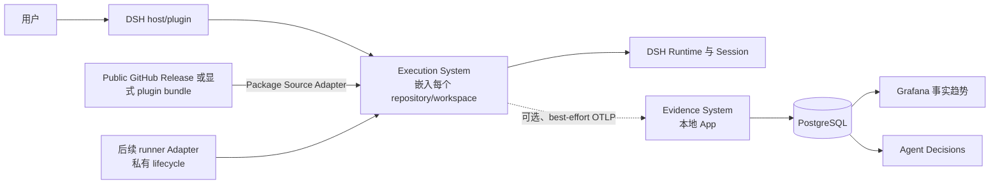

<a id="ee-concept"></a>
# workflow-self-recursive：概念架构

<a id="ee-concept-1"></a>
## 1. 元数据与权威

| 字段 | 值 |
| --- | --- |
| 文档身份 | `concept.identity.001` |
| 发布状态 | `WORKING_REVIEW_CANDIDATE`；先前的受限审查、翻译与 fresh-reader closure 只适用于更早字节。这些已变更字节在精确发布前需要新的确定性 parity/publication binding 以及用户或 reader review |
| 提升后的权威 | workflow-self-recursive 唯一的无版本概念权威 |
| 规范语言 | 英文 |
| 翻译 | [`agent-architecture.zh-CN.md`](agent-architecture.zh-CN.md) 是非规范跟踪翻译。英文是唯一语义权威。每当英文某一节变更，其中文对应章节都从当前英文重新翻译并整章替换；中文维护不保留、也不增量演进旧中文措辞。 |
| 已确认意图 | `EE-BRIEF`，SHA-256 `52773b19a4ca112d0fb8699c14885b30d0b5fdc1c61b6747e426b568175a4ba9` |
| 已确认方向 | `EE-SKELETON`，SHA-256 `73b3481a099983b57ee9e1dd512c6ed23823f0d045085f9ef585db70be13949a` |
| 可行性 | SD-06 aggregate，SHA-256 `c70303892e2d68f95e83b12c84940d9f3e41dad6f7a1e269b376da69e4adbf6e`；`FEASIBILITY_CONFIRMED` |
| Workflow Package 导入意图与方向 | `EE-WORKFLOW-IMPORT-BRIEF` SHA-256 `7c9b1064084cf5f256f27bc5efd021bed0374910e1430586eebeb695344d4c6d`；`EE-WORKFLOW-IMPORT-SKELETON` SHA-256 `86a2a61a324d9bb7ca90108b433ded2f883bc91d9f60dadee87ac7d11feb8e46` |
| Workflow Package 导入可行性 | `EE-WORKFLOW-IMPORT-SD06-APPLICATION`；SHA-256 `c6714b9c850536273a00b929559f6d71b8ff2c8aeb1f2aaf8054c14c53ca5795`；在已记录环境和限制内 `FEASIBILITY_CONFIRMED` |
| 定向简化权威 | `EE-WORKFLOW-IMPORT-MVP-SIMPLIFICATION-RR`；只删除机制，不增加可行性问题，并授权受影响范围的受限审查 |
| 历史大型 Workflow 审查 lineage | 较大型 Workflow-import 设计的 Problem–Solution、Architecture 与 Quality 审查结果，仅作为未变内容的历史证据保留。 |
| 历史大型 Workflow Finding 统计 | `EE-WORKFLOW-IMPORT-SD10-AGGREGATION` 属于历史记录，不是本次定向简化的 Finding 统计。 |
| 历史设计参数与 handoff 关闭 | `EE-WORKFLOW-IMPORT-SD12-CLOSURE-HANDOFF`；SHA-256 `60f24178d3a2f8991d6af2f974e4ed03d35aedc0064d9d253b3773e732e18ea7`；`SUCCEEDED` |
| 历史大型 Workflow Fresh Reader lineage | `EE-WORKFLOW-IMPORT-SD13-FRESH-READER-RESULT` 适用于旧字节，保持为历史记录。 |
| 历史受控集成权威 | `EE-WORKFLOW-IMPORT-SD14-REVISION-REQUEST`；SHA-256 `135ab9647fc6e30318735eff3cef858853cec75f47704e6eaaabd13ecbc59b2e`；deterministic report SHA-256 `1eda28b1c73a8b7d931ab58207d34796173a06bf20cdfae0e17accb2a3a3dc18`；适用于先前的大型 Workflow-import 集成 |
| 受影响范围的受限审查 | Problem–Solution SHA-256 `807863cb6c7887eccdb2720df5ace0afd8e4833f763a029928f44ed1e30e92ae`；Architecture SHA-256 `b220e1114d166cc5a55e34635f847ac2c1af0cf1777bb9c6a6c08dbadf5cdf98`；Quality SHA-256 `b64927087758a987a1f5a4d461035c379970ad84af57133714462ea19ac22f77`；三者收敛为两个 treatment group |
| 统一受限处理 | `EE-WORKFLOW-IMPORT-MVP-SIMPLIFICATION-SD10-TREATMENT`；SHA-256 `da22b3356aa34c3bcf6e3977a3277ef5b0d9c1e8beef35f4fe0db7dd5e72caf6` |
| 先前聚焦受限复查 | `EE-WORKFLOW-IMPORT-MVP-SIMPLIFICATION-SD10-BOUNDED-RECHECK`；SHA-256 `1b5664afd796910beb8b505bbaadd889fbb7fb098b02c141abb27cdba4e74955`；`CLOSED_FIXED`；open Findings `0`；仅适用于更早字节 |
| 先前翻译与 fresh-reader closure | 整节翻译 parity SHA-256 `3c236a404392e1d496e33d4adcdd70000d0db2a2453dcbd7df40813612f77c20`；fresh-reader result SHA-256 `1062561d35422bfacfa7e430f381e5fb25a5a2a911fe8daa5e3499eac5fc2a75`；translation treatment SHA-256 `927a02c6d88eba3571e39c010681b8b47dc956e9a8bafea6812aa9cda91c5d14`；focused recheck SHA-256 `6777175a4e78e363d24ddc3f6bc657b66e9f5a6c2e9fd0042dd210705035c18e`；仅适用于更早字节。当前已变更字节 pending fresh deterministic parity 与用户或 reader review |
| 精确发布绑定 | 外部 publication set/application record 必须用 SHA-256 绑定本字节流及配套 canonical Execution 字节流，记录适用的 fresh-reader 和 deterministic-verification 证据，并证明精确安装。本文件有意不声明自身 digest 或配套文件 digest。 |

本文拥有产品目的、产品—System 划分、稳定概念、依赖方向和跨 System 不变量。它不拥有 System Module 内部设计、Observation fact semantics、wire profile、interaction flow、metric reading rule 或 physical representation；这些分别由 [Execution System Design](systems/execution/project-execution-system.md)、[Evidence System Design](systems/evidence/evidence-system.md)、[Observation Catalog](contracts/observation/observation-catalog.md)、[OTel Observation Profile](contracts/observation/otel-observation-profile.md)、[Execution–Evidence Interaction Contract](contracts/execution-evidence/interaction-contract.md) 与 [Metric Catalog](contracts/evaluation/metric-catalog.md) 在各自声明范围内拥有。
<a id="ee-concept-2"></a>
## 2. 产品目的与上下文

workflow-self-recursive 通过小型、host-neutral 的执行 seam 运行有价值的 agent Workflow，并使实际发生的事实可检查。首个版本是面向个人或小团队、部署在可信本地环境中的第一方自由/开源 preview。当前直接目标是 Implementation 与 System Design 两个逻辑 Workflow，首先由 DeepSeek Harness（DSH）承载。部署不接收恶意租户或不可信操作者，初始 GitHub Workflow 仓库是 public。

产品包含两个 System：

- **Execution** 解析并准备一个符合开放标准的精确 Workflow Package，从该 resolved Package 创建不可变 Delivery Manifest，按 canonical worktree 协调一个 current DSH Delivery，并在不依赖 Evidence 的前提下发出有界事实。
- **Evidence** 是可选、独立部署的本地应用；它接收受支持的 OTLP 事实，投影忠实的因果与事实视图，并供人检查。

Runtime 不是第三个产品 System，而是 Core-owned seam 后的执行提供者。DSH 是第一个 Adapter。后续第一方 LangGraph Adapter 可以私有保留 pause/resume 和 custody reacquisition 行为，但不能把这些能力变成 public Execution 语义。



Execution 与 Evidence 不共享数据库。Evidence 从不读取 worktree、Runtime checkpoint 或隐藏的 Workflow state；Execution 从不读取 Evidence 来决定进度或 outcome。

`name@version`、`name@latest` 或裸 `name` 等 host-neutral selector 可直接或经 Intake 进入 Execution。Runtime Interaction 首先 canonicalize worktree，并尝试既有的独占 admission。`CONTENDED` 立即返回；`RECOVERY` 遵循已存储 Manifest；两者都不解析或下载新 selector。只有 `NEW` 才调用 Delivery Binding 解析本地 `ResolvedWorkflowPackage`。有效的本地 exact 或 sticky-latest hit 不访问网络；miss 从已配置的 public GitHub source 获取一个 Package，显式选择的 plugin bundle 则使用同一个 Package Source seam。Package 先进入 staging，检查格式、必需资源、声明关系、精确 version/digest 和 DSH compatibility，再发布为 `READY`。任何失败都释放普通 Delivery holder，并在创建 Delivery 前返回。成功结果提供构造和持久化 Delivery Manifest 所需的精确 Package 值，且这一切发生在 DSH effect 之前。

GitHub 与 plugin bundle 是 private Adapter，不是产品 System 或另一条语义路径。Preview 不包含自动 source/version fallback、ambient resource completion、authentication/authorization 子系统、hostile-Package 防御或生产级下载/恢复平台。

<a id="ee-concept-3"></a>
## 3. 稳定概念

| 概念 | 含义 | 语义 owner |
| --- | --- | --- |
| Delivery | 尝试完成一个 task-level instruction 的一次执行；有效关闭后的 DSH retry 是新 Delivery | Concept；lifecycle 细节在 Execution |
| Task | 相关 Delivery 的分组身份；绝不是 retry/correlation authority | Concept |
| Logical Workflow | 独立于 Runtime implementation 的版本化业务/控制含义 | Concept 及其 Workflow Contract |
| Workflow implementation | 一个 logical Workflow 针对特定 Runtime 的精确实现 | Execution binding |
| Runtime | 精确的执行提供者身份和版本 | Execution binding；native state 仍由 Runtime 拥有 |
| Workflow Package | 在 Agent Ops 开放 Workflow 模型下，由 owner 声明并版本化的闭包；包含 Workflow Definition、Actions、routes/Roles、Prompts、Skills、model/tool/Driver/session bindings、schemas、validators、conformance、identities 和 authority | Workflow composition authority 与 Package owner；由 Execution 校验 |
| Workflow Package Snapshot | 一个不可变精确 Package 闭包及其必需关系/资源在 composition 层的含义；preview 可直接用 resolved Package 值表示，无需独立 proof 或 capability identity chain | Workflow composition authority；由 Execution 解析 |
| Workflow selector | 指定 Package 和可选版本的通用用户输入；裸 name 与 `latest` 请求 sticky-local latest，精确版本只请求该版本 | Host/Intake 提供；Execution 解释 |
| Resolved Workflow Package | 完成本地解析、普通校验和 DSH compatibility 检查后，包含 `name`、`exactVersion`、`packageDigest`、`localPath` 与 `workflowId` 的简单不可变值 | Delivery Binding |
| Delivery Manifest | Delivery/task、精确 resolved Workflow Package、logical Workflow/implementation、Runtime/configuration、intent 与有界 source context 的不可变绑定 | Execution |
| Runtime result | Runtime-owned 的有界 terminal truth；区别于 launch disposition 与 telemetry status | Runtime；由 Execution 校验 |
| Observation | 以 standard-first OTel/OTLP 表示的版本化、allow-listed、content-minimized 事实 | producer 侧在 Execution；admission 侧在 Evidence |
| Accepted observation | atomic initial projection 后首次接受且不可变的 identity 与 provenance | Evidence |
| Factual projection | causal Trace 关系，以及 compatible、带 completeness 的 contribution/aggregate | Evidence |
| Span identity | 精确的 `(trace_id, span_id)` tuple；任一单独字段都不能全局标识 Span | Evidence Admission/Projection；由 OTel 传输 |
| Objective review graph | 独立的 Review、Finding、Artifact、Fix、Recheck、Invocation、iteration 和 Role identity，只通过 typed endpoint 连接 | Workflow owner；由 Execution 映射并由 Evidence admission/projection |
| Finding assertion | 一个有界、非空、privacy-safe、可读的事实摘要，加上 Finding-specific scope identity | source review lens；Execution 原样映射，Evidence 无推断地 admission/projection |
| Finding affected target | 每条 Finding observation 恰有一个 typed `ARTIFACT`、`SECTION`、`COMPONENT` 或 `REQUIREMENT` target；多 target Finding 对每个 target edge 重复完整 assertion | source review lens；target identity 由其 source authority 拥有 |
| Version-local Role identity | 一个 Workflow/family version 内的 Role identity；display name 不是 identity | Workflow Contract；由 Execution 传输 |
| Role lineage identity | owner 定义、family-scoped、用于关联不同 Workflow version 中 Role 的 identity；与 local Role identity 不同 | Workflow Contract；由 Evidence admission/projection |

各 identity axis 保持分离。Delivery ID 不是 Trace ID；logical Workflow ID 不是 implementation ID；task ID 不是 retry token；opaque Runtime correlation 不是 public Workflow state。Selector 或 configured source 不是 Package identity；sticky latest 不是 exact binding；GitHub Release、asset、tag 或 commit 不是 Core canonical identity；resolved Package 不是 Delivery identity；DSH Session identity 不是 public Workflow state。

<a id="ee-concept-4"></a>
## 4. 跨 System 不变量

1. **先 admission，再在创建 Delivery 前完成 preparation。** Execution 首先 canonicalize worktree 并尝试既有的 exclusive Delivery admission。只有 `NEW` 才解析一个精确、本地 `READY` 的 Workflow Package，并在 Delivery Manifest 持久化、Runtime、Session 或 worktree effect 之前完成普通 Package 与 selected-Runtime 校验。Preparation 失败释放 holder，是 typed pre-Delivery result，不是 Delivery outcome。
2. **每个 canonical worktree 最多一个 current DSH Delivery，并立即拒绝。** `CONTENDED` 不等待、不排队、不抢占、不访问 Package Store/source，也不创建 Delivery，直接返回。`RECOVERY` 只遵循 stored Manifest 并忽略新 selector。
3. **Execution 不保存历史。** Execution 只存 current DSH slot。有效 clear 后，历史只属于 DSH Session 与 accepted Evidence。
4. **Runtime truth 保持权威。** Execution 校验 identity 与 shape，但不重新解释 Workflow outcome。Evidence 记录，不裁决。
5. **Observation 可选且不控制执行。** 禁用、拒绝、sampling 或 tail loss 都不能改变 execution。
6. **Missing 绝不等于 zero。** final、lower-bound、unavailable 和 not-applicable 状态在 admission、projection 和 query 中保持不同。
7. **Accepted fact 不可变。** Event ID 与 Span `(trace_id, span_id)` identity 用于去重；冲突内容不覆盖；必需 initial projection 与 acceptance 是 atomic。
8. **只有 compatible fact 才聚合。** kind、unit、source、source identity、currency、semantic version 与 eligibility 必须一致。
9. **内容最小化。** Prompt、message、tool argument/result、source、credential 和 error body 不跨越 Observation seam。
10. **人工检查只呈现事实。** Preview 不评分、不排名、不推荐、不推断因果，也不自动修改 Workflow 行为。
11. **System 可独立使用。** Execution 不依赖 Evidence 也能工作；Evidence 接收任何 conforming producer，且不成为 Execution storage。
12. **Native lifecycle 保持私有。** DSH Session state 与后续 runner pause/resume/checkpoint 细节留在 Runtime Adapter 后。
13. **Local-first exact resolution。** 有效的本地 exact 或 sticky-latest hit 不发远程请求。Miss 只能使用 configured source；不允许 source/version fallback 或 ambient completion。
14. **Binding 不漂移。** `latest` 或裸 name 在创建 Manifest 前解析成 `exactVersion`。后续 alias 或 Release 变化只影响后续 Delivery。
15. **简单 Store 可见性。** `STAGING` 内容绝不是 cache hit。Initial-fill 失败回到 `MISSING`；refresh staging 是 private side state，在已校验 replacement 就绪之前仍保持原 `READY` Package 与 sticky alias 可见。Preview 不自动 eviction。
16. **可信 preview 的克制。** Authentication、authorization、signing、sandboxing、hostile-input defense、multi-user coordination、concurrent Package correctness、distributed locking、HA、failover 和 production-grade Package recovery 不在当前设计内。只有部署信任、暴露面、规模或 DSH capability 变化时才重开设计。

<a id="ee-concept-5"></a>
## 5. 权威与依赖方向

```text
Concept
  ├── Execution：selector resolution、Package validation、Delivery binding、
  │              current-slot lifecycle、Runtime Adapter、Observation producer
  ├── Evidence：admission、factual projection、presentation
  └── Contract：仅跨 System 的物理表示

Host/Intake → Execution Core
Execution Core → Delivery Binding → private Source/Store Adapters
Execution Core → Runtime Interaction → private Runtime Adapter
Execution Core → Delivery Observation → OTel/OTLP → Evidence Admission
Evidence Admission → Factual Projection → Presentation
```

Workflow Package owner 拥有 Package 内容与关系。安装或用户配置提供 public GitHub URL 或显式 bundle input。只有 Delivery Binding 解释 selector、解析并校验 Package、拥有 Local Package Store 并构造 Manifest 内容。只有 Runtime Interaction 写 canonical custody 和 current-slot state。只有 DSH 写 native Session/Workflow State。只有 Delivery Observation 映射 outbound fact；只有 Evidence Admission 决定 acceptance。

依赖指向 owner 定义的含义。Source Adapter 传输 Package bytes，但不定义 Package identity 或构造 Manifest。Store 从不选择其他 source/version。DSH 不能用 ambient default 修补不完整 Package。Evidence 不能命令 Execution。任何 Contract 或下游 implementation 都不得增加第二个 semantic writer。

<a id="ee-concept-6"></a>
## 6. 范围与非目标

Preview 包含 generic Workflow selection、exact/sticky-latest local-first resolution、一个 configured public GitHub 下载路径、显式 plugin-bundle input、普通 Package format/required-file/relationship/version/digest validation、DSH compatibility validation、`MISSING/STAGING/READY` local storage、DSH effect 前创建 exact Manifest、immediate exclusive Delivery admission、current-slot recovery、truthful terminal result，以及可选 factual Observation。

Preview 假设个人或小团队在可信本地环境部署，第一方 Workflow 托管在 public 仓库，且不要求 concurrent Package-management correctness。并发防御仅限既有的 one-current-Delivery exclusivity：无法获得时立即返回 `CONTENDED`。

非目标包括 authentication、authorization、RBAC、public Package path 的 credentials、signing、supply-chain assurance、malicious-Package 或 prompt-injection defense、sandboxing、multi-user coordination、concurrent cache writers、fairness、waiting/queueing、distributed locking、Package transaction 或 proof protocol、automated eviction、mirror、retry orchestration、HA、automatic failover/upgrade、registry federation、marketplace、ranking、recommendation、grading、causal inference、remote multi-user deployment、Evidence control feedback、repository naming/layout、physical schema、DSH resume 与 runner redesign。

Format、required-resource、relationship、version 与 digest 检查用于防御普通故障和配置错误，不是 security subsystem。未来若转向 untrusted source、shared remote service、携带 credential 的 private repository、hostile tenant、concurrent Package writer 或更强 DSH security capability，必须先作出新的 Concept/System Design 决策再增加相关机制。

<a id="ee-concept-7"></a>
## 7. 演进、发布与 Legacy 隔离

Active semantic authority 是无版本英文 Concept、两份原位英文 System Design，以及 Observation meaning、OTel wire profile、Execution–Evidence interaction 与 human metric reading 的英文 split draft companion。中文文件在存在时作为完整、忠实、非规范的跟踪翻译随同发布；绝不成为独立语义权威。每个发生变更的英文 section 都整体替换对应中文 section。Versioned legacy Concept 文件和 obsolete target-design 文档被删除；Git history 拥有 provenance。

Legacy material 是一个明确不完美的 dependency graph，而非 self-consistent bundle。精确 A machine artifact 保持 byte-preserved；16 个 B-legacy prose/entrypoint successor 将这些 material 标识为 legacy，并使 A-to-B test read 保持可执行。冻结的六套件 Python baseline 是 67 个 test，其中有两个已知 EFCR digest-mismatch failure：expected `bb216407325e10cebd2e3a1de7b69b77d0fe9246a5b28a48d3825d0229818226`，actual `5feb18f414b8f87a2cf72ccd239e43f80a4c45201e9b2da5b84633699221525c`；Node Execution baseline 是 158/0。这些结果是被隔离的 legacy evidence，绝不是 Contract 或 conformance proof。Publication Gate 只允许这两个具名 baseline failure，并拒绝任何新增或不同 failure。下游获授权的 physical cutover 必须替换/删除或修复完整 graph，并建立新 baseline。

Split companion 有意保持 draft。System semantics 与 draft human/wire/interaction meaning 可以在 physical representation 出现前成为 authority，但在发布 schema、registry、fixture 和 validation evidence 之前，任何 implementation 或 physical artifact 都不得声称 conformance。

Evidence 计划迁移到独立的 public repository，再以 submodule 形式接回。确切 repository、commit、release process，以及 MIT 与 Apache-2.0 之间的选择，仍属于下游 product/repository decision；它们不改变 two-System boundary。

<a id="ee-concept-8"></a>
## 8. 质量与验收

| 质量 | 要求结果 | 设计机制 | 证据状态 |
| --- | --- | --- | --- |
| Reliability | Evidence outage 不影响 Delivery outcome | 单向 best-effort seam，无 receipt/outbox | feasibility confirmed；production fixture downstream |
| Recovery | unknown Runtime start 保持 blocking；不 blind retry | 既有 durable launch disposition 与 exact recovery | concept.fixture.001 rebinding |
| Consistency | 无 accepted/projection half-state 或 double contribution | 一个 PostgreSQL transaction 与 stable identity | concept.fixture.003 rebinding |
| Privacy | prohibited body 不跨 Observation seam | producer allow-list/redaction 加 admission validation | concept.fixture.002 rebinding；production proof downstream |
| Portability | DSH 与 runner 的差异留在一个 Core-owned seam 后 | Adapter-private lifecycle、opaque projection | design fixed；later runner implementation downstream |
| Authority singularity | 一个 active graph，不存在 co-active legacy authority | versionless root、in-place Systems、quarantine | 需要 deterministic publication proof |
| Translation fidelity | 中文传达完整英文含义 | stable anchor，按英文整章重译 | 需要 review 与 deterministic proof |
| Honest lifecycle | draft/legacy artifact 不伪装成 conformance | draft banner、fixed/open matrix、conformance gate | deterministic now；physical publication downstream |
| Workflow Package exactness | 创建的 Delivery 使用一个已校验 exact Package 且不漂移 | 将 `ResolvedWorkflowPackage` 复制进 immutable Manifest | implementation plan |
| Workflow import responsiveness | contention/recovery 避免 Package work；有效 `NEW` 本地 exact/latest hit 不发远程请求 | M02-first admission，再 local-first Store；不 wait/queue | implementation plan |
| Workflow import fault containment | invalid selector、download、validation、cache、compatibility 或 Manifest failure 不创建 Delivery | 在所属 phase typed early return | implementation plan |
| Package evolvability | contributed Package 与 bundle 使用共同 Package Source seam，无需改 Core name | open Package model 与 private Source Adapter | paired fixture feasibility confirmed |
| Resource efficiency | preview 使用一个 asset，并保留 `READY` Package，不自动 eviction | `MISSING/STAGING/READY` Store | implementation plan |
| Trusted-preview security | confirmed trusted/public-source context 内不需要 production security mechanism | 只做 format 与 identity 检查；显式 reopen trigger | accepted product boundary |

### Owner-complete 验收登记

Concept 拥有该跨文档 trace metadata；链接的 System anchor 仍是唯一 semantic owner。`evidence_state` 仅允许 `DESIGN_EVIDENCE_AVAILABLE | IMPLEMENTATION_PLAN | SPIKE_REQUIRED | RUNTIME_HANDOFF`；planned work 绝不表示 passed evidence，任何状态都不证明 physical conformance。

| acceptance_id | problem_or_goal_ids | scenario_ids | design_driver_ids | decision_or_mechanism_ids | expected_outcome | threshold | verification_method | evidence_state | evidence_reference | owner | return_location | reopen_condition |
| --- | --- | --- | --- | --- | --- | --- | --- | --- | --- | --- | --- | --- |
| `concept.acceptance.001` | `BR-PROBLEM` | `SC-01` | `BR-CONSTRAINTS` | `execution.milestone.01`, `execution.milestone.02`, `concept.decision.004` | exact valid binding 运行一次；`NEW` admission 后 Package preparation 只可在 Manifest persistence 前产生 Source/Store effect；invalid binding 无 Runtime/worktree/Delivery effect | Manifest 成功持久化前，Runtime、Session、worktree、Manifest、Delivery-outcome 或 Observation effect 均为零；无 fallback | positive/negative binding fixture，加 Source/Store 与 Runtime/worktree spy | `DESIGN_EVIDENCE_AVAILABLE` | concept.fixture.001 rebinding 加 Workflow-import ordering plan | Execution Core validation owner | `docs/systems/execution/project-execution-system.md#ee-execution-7` | fallback、late binding、`CONTENDED`/`RECOVERY` 出现 Package work，或 Manifest 前出现 Runtime/worktree/Delivery effect |
| `concept.acceptance.002` | `BR-PROBLEM` | `SC-01` | `BR-CONSTRAINTS` | `execution.milestone.02`, `PATH-02A` | 第二个 host 收到 `CONTENDED` | Delivery/Manifest/start/slot/worktree effect 为零 | two-process fixture | `DESIGN_EVIDENCE_AVAILABLE` | concept.fixture.001 rebinding | Runtime Interaction validation owner | `docs/systems/execution/project-execution-system.md#ee-execution-7` | multiple writer 或 admission bypass |
| `concept.acceptance.003` | `BR-PROBLEM` | `SC-04`, `SC-09` | `BR-RISKS`, `BR-CONSTRAINTS` | `execution.milestone.02`, `START_UNCERTAIN`, `RESULT_UNRESOLVED`, `reconcileOrClose` | unresolved state 持续 occupied，直至 conclusive inspection 完成 reconciliation，或 exact administrative authorization abandon/clear；abandonment 不产生 Runtime outcome/history，只有新 Delivery 可 retry | 无 timeout/steal、fabricated outcome/history、same-Delivery retry 或 clear-before-inspection | crash/lost-handle/malformed-result/stale-current authorization fixture | `IMPLEMENTATION_PLAN` | `concept.obligation.002` | Runtime Interaction implementation owner | `docs/systems/execution/project-execution-system.md#ee-execution-14` | unresolved state 未经 conclusive inspection 与 current authorization 即 clear |
| `concept.acceptance.004` | `BR-PROBLEM` | `SC-01`, `SC-04` | `BR-ACCEPTANCE`, `BR-CONSTRAINTS` | `observation.contract.003`, `execution.milestone.01`, `execution.milestone.02` | outcome 恰为 `COMPLETED`、`INCOMPLETE`、`FAILED`、`CANCELLED`；conclusive non-start 是独立 `START_FAILED` | 五个互不相同的 category；无 fabricated Runtime outcome | five-category 与 mismatch fixture | `RUNTIME_HANDOFF` | `concept.obligation.001`, `concept.obligation.002` | current interaction/profile publication owner | `docs/contracts/observation/otel-observation-profile.md#otel-profile-3` | launch disposition、Runtime outcome 或 OTel status collapse |
| `concept.acceptance.005` | `BR-PROBLEM` | `SC-02` | `BR-ACCEPTANCE`, `BR-QUALITY` | `observation.contract.002`, `observation.contract.012`, `execution.milestone.03`, `evidence.milestone.01`, `evidence.milestone.02` | 两个 closed Workflow-family profile 表示 tests/coverage/review/Fresh Reader/verification/activity 和 objective review/artifact/invocation/recheck 关系；Review summary、Finding、Fix、Recheck 使用完整 base-plus-variant shape；每个 Finding 含一个 bounded privacy-safe factual summary、一个 Finding-specific scope 与一个 typed target；local Role/lineage identity 分离且省略 score/inference | 每个 confirmed family fact/edge 映射一次；每条 Review-family observation 恰好满足一个完整 named shape；每个 Finding target edge 含完整 assertion 与 typed endpoint；无 body/map escape hatch、prohibited inference、partial projection 或 name/order-derived relation | 两个 family 的 semantic/complete-shape matrix；ordinary Finding/Fix/Recheck/Recheck-summary/multi-target 示例；endpoint requiredness、bounded-content/privacy、lineage、idempotency/conflict 与 prohibited-field fixture | `IMPLEMENTATION_PLAN` | `concept.obligation.001`, `concept.obligation.003`, `concept.obligation.004` | Delivery Observation implementation owner | `docs/systems/execution/project-execution-system.md#ee-execution-14` | family fact/edge 或完整 Review variant 不可表示，Finding content/target 丢失或被推断，lineage conflates，或出现 RED-to-GREEN/scenario/design/reviewer-effectiveness inference |
| `concept.acceptance.006` | `BR-PROBLEM` | `SC-03` | `BR-CONSTRAINTS`, `BR-QUALITY` | `execution.milestone.03`, `PATH-03` | Evidence disabled/refused/timed-out/tail-loss 时 outcome 与 slot path 不变 | receipt/outbox/control dependency 为零 | loss/refusal fixture | `DESIGN_EVIDENCE_AVAILABLE` | concept.fixture.002 rebinding | Delivery Observation validation owner | `docs/systems/execution/project-execution-system.md#ee-execution-10` | 出现任何 receipt、durable retry/outbox 或 control dependency |
| `concept.acceptance.007` | `BR-PROBLEM` | `SC-03`, `SC-05` | `BR-QUALITY`, `BR-RISKS` | `observation.contract.006`, `execution.milestone.03`, `evidence.milestone.01` | prohibited body 从不进入 exported 或 accepted fact | prompt/message/tool/source/credential/error body 为零 | marker scan 与 negative fixture | `DESIGN_EVIDENCE_AVAILABLE` | concept.fixture.002/003 rebinding；production proof 仍为 `concept.obligation.003/004` | Evidence privacy validation owner | `docs/systems/evidence/evidence-system.md#ee-evidence-10` | arbitrary envelope/body 或 unsafe diagnostic 被 admission |
| `concept.acceptance.008` | `BR-PROBLEM` | `SC-05`, `SC-07` | `BR-QUALITY`, `BR-CONSTRAINTS` | `observation.contract.009`, `observation.contract.010`, `evidence.milestone.02` | final zero、lower bound、unavailable、not-applicable 保持不同；incompatible group 不求和 | 无 missing-as-zero 或 implicit conversion | truth/grouping fixture | `DESIGN_EVIDENCE_AVAILABLE` | concept.fixture.003 rebinding | Factual Projection validation owner | `docs/systems/evidence/evidence-system.md#ee-evidence-8` | inference、implicit conversion 或 state collapse |
| `concept.acceptance.009` | `BR-PROBLEM` | `SC-06` | `BR-CONSTRAINTS`, `BR-QUALITY` | `observation.contract.008`, `evidence.milestone.01`, `evidence.milestone.02` | Event identity 为 `agentops.event.id`；Span identity 恰为 `(trace_id, span_id)`；同 identity/同 digest repeat 为 no-op，conflict 不覆盖地 reject，accepted identity 与 initial projection atomic | 无 duplicate contribution、overwrite、cross-Trace Span-ID collision 或 half-state | Event/Span new/identical/conflicting duplicate 与 ambiguity fixture | `DESIGN_EVIDENCE_AVAILABLE` | concept.fixture.003 rebinding 加受影响 deterministic Span-identity check；implementation proof downstream | Evidence Admission validation owner | `docs/systems/evidence/evidence-system.md#ee-evidence-7` | `span_id` 或 Trace ID 单独成为 Span key、duplicate 双计、conflict overwrite 或 accepted/projection half-state |
| `concept.acceptance.010` | `BR-PROBLEM` | `SC-08` | `BR-QUALITY` | `evidence.milestone.02`, `evidence.milestone.03` | curated view 只展示 recorded fact 与 provenance | score、rank、recommendation 或 causal inference 为零 | query/dashboard golden fixture | `IMPLEMENTATION_PLAN` | `concept.obligation.004` | Evidence App implementation owner | `docs/systems/evidence/evidence-system.md#ee-evidence-14` | presentation 引入 formula 或 inference |
| `concept.acceptance.011` | `BR-PROBLEM` | `SC-05`, `SC-08` | `BR-CONSTRAINTS`, `BR-QUALITY` | `observation.contract.011`, `evidence.milestone.01`, `evidence.milestone.02`, `evidence.milestone.03` | Raw、accepted identity/provenance、Trace、factual projection 独立过期；过期 Trace 成为显式 unavailable detail | 四个可独立测试的 lifecycle class | retention/expiry fixture | `RUNTIME_HANDOFF` | `concept.obligation.006` | Evidence lifecycle validation owner | `docs/systems/evidence/evidence-system.md#ee-evidence-14` | coupled deletion、reconstruction 或 history rewrite |
| `concept.acceptance.012` | `BR-PROBLEM` | `SC-10` | `BR-CONSTRAINTS`, `BR-QUALITY` | `execution.milestone.02`, `PATH-06` | native DSH/runner type 不跨 Core Interface；runner 私有保留 resume，DSH 仍无 resume | public resume/native-type leak 为零 | type scan 与 contrasting lifecycle fixture | `IMPLEMENTATION_PLAN` | `concept.obligation.002` | Execution Core implementation owner | `docs/systems/execution/project-execution-system.md#ee-execution-14` | public resume 或 native type 跨越 Core Interface |
| `concept.acceptance.013` | `BR-PROBLEM` | `SC-08` | `BR-CONTEXT`, `BR-QUALITY` | `evidence.milestone.01`, `evidence.milestone.03` | loopback ingest 无需 app-level auth；same-origin anonymous Viewer 只读 curated view；database/raw/write route 不可达 | loopback 与 same-origin local-only；Viewer read-only | listener/origin/role/negative reachability fixture | `IMPLEMENTATION_PLAN` | `concept.obligation.004` | Evidence App implementation owner | `docs/systems/evidence/evidence-system.md#ee-evidence-14` | remote/multi-user exposure 或 Viewer 获得 raw/write/database access |
| `concept.acceptance.014` | `BR-PROBLEM` | `BR-SCENARIOS` | `BR-ACCEPTANCE` | `concept.decision.014`, `concept.decision.017`, `concept.decision.018` | 34 个精确 write 与 2 个 delete 原子发布；A bytes 不变；Python 恰为 67/2 named baseline failure，Node 158/0；legacy 不成为 co-active authority | 无 post-review byte drift、新/不同 failure、active legacy edge 或保留 legacy Concept path | SD-08 overlay/link/parity/baseline verification | `DESIGN_EVIDENCE_AVAILABLE` | external publication set/application record 与受影响 SD-08 result | publication verification owner | `docs/agent-architecture.md#ee-concept-7` | 发布前违反任一 threshold condition |
| `concept.acceptance.015` | `BR-SCOPE` | `BR-SCENARIOS` |  | `concept.obligation.007` | public Evidence 有一个 repository authority，parent pin 一个 reviewed submodule commit | 一个 repository authority 与一个 pinned commit；无 cross-repository transaction | repository identity/release/commit/submodule-link proof | `RUNTIME_HANDOFF` | `concept.obligation.007` | Evidence repository release owner | `docs/systems/evidence/evidence-system.md#ee-evidence-14` | duplicate authority、unpinned code 或需要 cross-repository transaction |
| `concept.acceptance.016` | `BR-OPEN` | `BR-SCENARIOS` |  | `concept.obligation.008` | public Evidence release 使用一个批准的 MIT 或 Apache-2.0 license，并有 matching notice | 一个 approved license 与 matching LICENSE/NOTICE bytes | recorded decision 加 exact LICENSE/NOTICE review | `RUNTIME_HANDOFF` | `concept.obligation.008` | Product license decision owner | `docs/agent-architecture.md#ee-concept-7` | 两种 allowed license 都不兼容或需要多个 conflicting license |
| `concept.acceptance.017` | `BR-PROBLEM` | `SC-02`, `SC-03`, `SC-05`–`SC-08` | `BR-CONSTRAINTS`, `BR-QUALITY`, `BR-ACCEPTANCE` | `observation.contract.002`, `observation.contract.006`–`012`, `concept.decision.005`, `concept.decision.019` | 独立 Execution/Evidence implementer 无需重新决定即可推出精确 pins/carriers、10 EventName、54 common + 10 Implementation + 6 System Design fields、完整 Review-family base-plus-variant requiredness、bounded Finding assertion/typed affected-target relation、local/lineage pairing、native usage 与 Span identity | 恰为 10 EventName 与 54/10/6/70 unique count；每个 registry row 九列；每条 Review-family record 匹配一个完整 named shape，每个 multi-target Finding 为每个 typed target edge 生成完整 assertion；无 sibling-family/fixture/prohibited field、disposition Event、partial projection 或 inferred target；endpoint/usage/Span/target-edge duplicate rule 精确 | deterministic registry/table/parity/link/semantic-coverage/complete-shape scan，加 ordinary Finding/Fix/Recheck/Recheck-summary/multi-target positive 与 malformed/privacy/duplicate negative fixture、concept.fixture.002 binding、保留 Span/usage example | `DESIGN_EVIDENCE_AVAILABLE` | concept.fixture.002 PASS 与 rebinding、在 corrected threshold 下 rebuilt green lineage assertion、`RR-OTEL-CONTRACT-003`、affected/full SD-08 result | Observation-profile Design validation owner | `docs/contracts/observation/otel-observation-profile.md#otel-profile-11` | implementation 需要另一 carrier/EventName/field meaning，无法保持完整 variant/typed edge/identity，或改变 usage/missingness/privacy |
| `concept.acceptance.item.001` | `BR-PROBLEM` | `SC-WI-00`, `SC-WI-11` | host neutrality | generic Core operation；private source/Runtime Adapter | 一个 selector/task call 不含 host/DSH/source-native type | native-field leak 为零 | schema/type scan 与 contrasting Adapter fixture | `IMPLEMENTATION_PLAN` | `concept.obligation.010`, `011` | Execution implementation owner | Execution Design acceptance | native type 或 host choreography 跨 Core |
| `concept.acceptance.item.002` | `BR-PROBLEM` | `SC-WI-01`, `SC-WI-03`, `SC-WI-09` | exactness/local-first | resolved exact Package 与 sticky alias | local hit 不发 remote call；后续 alias movement 不影响 Delivery | source call 与 binding drift 为零 | source spy 与 alias-movement fixture | `IMPLEMENTATION_PLAN` | `concept.obligation.011`, `013` | Delivery Binding implementation owner | Execution Design acceptance | valid hit 仍 remote access、re-resolution 或 drift |
| `concept.acceptance.item.003` | `BR-PROBLEM` | `SC-WI-02`, `SC-WI-04`, `SC-WI-12` | one source/no fallback | 一个 public GitHub fetch、private `STAGING`、publish `READY` | failure 保留 prior `READY` truth 且不创建 Delivery | 无 fallback；`STAGING` 不 resolve | Adapter 与 failed-fetch/publish fixture | `IMPLEMENTATION_PLAN` | `concept.obligation.012`, `013` | Source/Store owner | Execution Design acceptance | fallback、partial hit 或 prior-ready loss |
| `concept.acceptance.item.004` | `BR-PROBLEM` | `SC-WI-05`, `SC-WI-08` | common open path | GitHub/bundle private Adapter 位于一个 seam | protected、contributed、bundled conforming Package 走同一 validation path | 无 allow-list、bypass、hidden fallback 或 native leak | paired Adapter/contribution fixture | `DESIGN_EVIDENCE_AVAILABLE` | AF-WI-04；`concept.obligation.012` | Package/release owner | Execution Design acceptance | second semantic path、rewrite、allow-list 或 fallback |
| `concept.acceptance.item.005` | `BR-PROBLEM` | `SC-WI-06`, `SC-WI-07` | pre-Delivery early return | M02-first admission、ordinary M01 validation、simple Manifest construction | 只有 `NEW` 执行 selector/Package/version/digest/compatibility/cache validation；failure 释放 ordinary holder，且不创建 Manifest、Delivery、Runtime effect 或 Observation | `CONTENDED`/`RECOVERY` 的 M01/Source/Store call 为零；Manifest 前 Delivery outcome 为零 | admission/M01/Source/Store spy 加 typed M01/Core negative fixture | `IMPLEMENTATION_PLAN` | `concept.obligation.010`, `011` | Execution Core owner | Execution Design acceptance | validation 先于 `NEW`、holder 未释放、pre-Delivery failure 变成 Delivery outcome/Observation 或 transaction/proof lifecycle |
| `concept.acceptance.item.006` | `BR-PROBLEM` | all `SC-WI-*` | simple exclusive admission | Runtime Interaction admission 在 Delivery Binding 前 | occupied worktree 返回 `CONTENDED`，recovery 遵循 stored binding；两者的新 selector Package work 为零 | `CONTENDED`/`RECOVERY` 无 wait、preemption、Source/Store/M01 call 或 new-Delivery effect | admission spy 与 stored-Manifest recovery fixture | `IMPLEMENTATION_PLAN` | `concept.obligation.011` | Runtime Interaction owner | Execution Design acceptance | preparation 先于 admission、multiple current Delivery、waiting 或 recovery 使用新 selector |
| `concept.acceptance.item.007` | `BR-PROBLEM` | `SC-WI-09`, `SC-WI-10` | exact DSH/no ambient | Manifest-bound Package 与 Adapter-first validation | DSH 只使用 bound local Package；missing/unsupported resource 在 native effect 前 reject | ambient completion 与 pre-validation effect 为零 | production projection/no-default negative | `IMPLEMENTATION_PLAN` | AF-WI-01；`concept.obligation.014` | DSH Adapter owner | Execution Design acceptance | rewrite、ambient substitution、post-effect reject 或 native leak |
| `concept.acceptance.item.008` | `BR-PROBLEM` | `SC-WI-07`, `SC-WI-12` | Observation non-control | Package preparation 保持 pre-Delivery | preparation/Manifest rejection 从不成为 Delivery outcome 或 Observation | pre-Delivery telemetry 为零 | telemetry-exclusion/exporter fixture | `IMPLEMENTATION_PLAN` | `concept.obligation.011` | Delivery Observation owner | Execution Design acceptance | Observation 控制或重分类 pre-Delivery result |

下列 lifecycle-specific acceptance refinement 是已有 acceptance identity 的规范组成部分，不是新 acceptance ID：

| acceptance_id | 必需 deterministic refinement | verification refinement | reopen refinement |
| --- | --- | --- | --- |
| `concept.acceptance.005` | C17 field presence 是 ordinary/Recheck summary 的 record-observable selector：`0` 是 recorded zero，positive value 是 recorded count，omission 表示无 count fact；Event、assertion `(C18,C51)`、target edge、status `(C18,C51,C12)`、target-specific Fix 与 Recheck 仍是不同 domain，atomic reuse/append 语义不变 | OTel Profile §7.6 双语 ordinary/Recheck zero、positive、absence、exact-retry positive；invalid type/range、Finding carrier、partial-state negative；不包含不可能的“reported but missing” Admission fixture | zero/absence collapse、consumer 推断 producer intent、invalid C17 partial landing、C27/lifecycle identity regression 或 assertion/status mutation |
| `concept.acceptance.017` | 独立 implementer 仅凭 field presence 推导 C17 counted/no-count form，并保留未变 identity、invariant/allowed-change matrix、compatible-reuse effect 与不同 Evidence landing | deterministic EN/ZH C17 registry/shape/example/Admission/query parity，加未变 lifecycle 与 C09/assertion/target/endpoint conflict scan | 任一 C17 presence outcome 或 identity/conflict/no-op effect 仍由 implementation 自行决定 |

### 下游义务登记

| obligation_id | owner | affected_design_identities | semantic_dependency | required_evidence | current_evidence_state | suggested_consumer | return_location | design_reopen_condition |
| --- | --- | --- | --- | --- | --- | --- | --- | --- |
| `concept.obligation.001` | current Observation/interaction publication owner | `observation.contract.001..012`, `concept.acceptance.004`, `concept.acceptance.005`, `concept.acceptance.009`, `concept.acceptance.017` | 物理编码 adopted exact pins/carriers、10 EventName、54+10+6 registry、完整 Review-family base-plus-variant shape、bounded Finding assertion/typed target relation、lineage pair、native usage、Span identity、interaction 与 truth/privacy rule，且不创建第二 semantic owner | machine schema/package、含 Finding-summary bound 的 physical limit/budget、encoded registry、complete-shape/relationship/multi-target/privacy/usage/Span fixture group、validator、version policy、publication record | split draft mapping 已存在；physical publication/conformance 未证明 | Contract implementation workflow | `docs/contracts/observation/otel-observation-profile.md#otel-profile-11` | physical representation 无法保持 adopted complete shape、bounded Finding fact、target/owner/identity meaning、interaction semantics，或 claimant 缺少适用 proof |
| `concept.obligation.002` | Execution Core implementation owner | `execution.milestone.01`, `execution.milestone.02`, `concept.decision.004`, `PATH-02A..D`, `PATH-06`, `concept.acceptance.001..004`, `concept.acceptance.012` | 一个 Core Interface；per-worktree custody；exact unresolved-state path；Adapter-private Runtime lifecycle | code 加 binding/contention/crash/unresolved/inspection/authorization/no-history/native-isolation fixture | concept.fixture.001 只证明 pinned feasibility scope；implementation 不存在 | Execution implementation workflow | `docs/systems/execution/project-execution-system.md#ee-execution-14` | bypass、multiple writer、auto-clear、fabricated history/outcome、public resume 或 native leak |
| `concept.obligation.003` | Delivery Observation implementation owner | `execution.milestone.03`, `observation.contract.006`, `observation.contract.007`, `concept.acceptance.005..007`, `concept.acceptance.009`, `concept.acceptance.017` | 实现 adopted Core-owned allow-listed one-way best-effort profile：emission 前选择一个完整 shape，并复制 bounded Finding assertion、Finding-specific scope 和一个 typed target edge，不重新选择 family field、usage truth 或 identity | production code/exact lock，加 complete-shape mapping、ordinary Finding/Fix/Recheck/Recheck-summary/multi-target relationship、bounded-content/privacy、lineage/usage/Span-identity、allow-list、sampling、disable/loss/refusal 与 dual-emitter-absence fixture | draft logical mapping adopted；carrier feasibility 由 Spike 验证；production implementation/conformance 不存在 | Execution observation implementation workflow | `docs/systems/execution/project-execution-system.md#ee-execution-14` | mapping deviation、incomplete variant、Finding fact/typed edge 缺失或 mutation、unit conflation、dual emitter、privacy leak、identity conflation、receipt/outbox 或 control coupling |
| `concept.obligation.004` | Evidence App implementation owner | `evidence.milestone.01..03`, `observation.contract.008..012`, `concept.acceptance.005`, `concept.acceptance.007..010`, `concept.acceptance.013`, `concept.acceptance.017` | atomic Event/Span first-write admission 校验一个完整 shape，并 atomic project 原样 bounded Finding assertion 与 typed target edge、compatible native usage、curated presentation、local-only anonymous Viewer boundary | code/migration 加 Event/Span/target-edge atomicity/idempotency、complete-shape/relationship/multi-target/privacy/usage/truth/query conflict、origin、role、negative reachability、backup fixture | concept.fixture.003 只证明 pinned transaction/truth prototype；application 不存在 | Evidence implementation workflow | `docs/systems/evidence/evidence-system.md#ee-evidence-14` | partial projection、mutable accepted fact、duplicate Span/target contribution、conflict overwrite、Finding assertion/edge 缺失或 mutation、unit conflation、inference、database/raw/write exposure 或 topology change |
| `concept.obligation.005` | Execution performance validation owner | `execution.milestone.02`, `execution.milestone.03`, `PATH-03`, `concept.acceptance.001`, `concept.acceptance.006`, `concept.decision.004`, `concept.decision.005` | serial custody 与 best-effort Observation 在不改变语义下保持 operationally bounded | admission/start/finalize latency、exporter queue/drop、resource use 的 bounded workload measurement | 未固定 numeric SLO/default；无 production measurement | Execution validation workflow | `docs/systems/execution/project-execution-system.md#ee-execution-14` | measured bound 需要另一 writer、durable outbox、新 Module 或 semantic threshold change |
| `concept.obligation.006` | Evidence lifecycle validation owner | `evidence.milestone.01..03`, `observation.contract.011`, `concept.acceptance.011` | 四类 Evidence lifecycle 独立 addressable，且 factual truth 不 rewrite | bounded ingest/growth/query/expiry/retention/backup measurement 与 expiry fixture | 未固定 numeric capacity/retention default；无 production measurement | Evidence validation workflow | `docs/systems/evidence/evidence-system.md#ee-evidence-14` | measurement 需要 coupled deletion、history rewrite、新 Module 或 topology change |
| `concept.obligation.007` | Evidence repository release owner | `evidence.milestone.01..03`, `concept.acceptance.015` | 一个 public Evidence authority；parent repository pin 一个 reviewed submodule commit；无 cross-repository transaction | repository identity、initial commit、CI/release proof、parent submodule-link proof | public repository/submodule 不存在 | Evidence repository release workflow | `docs/systems/evidence/evidence-system.md#ee-evidence-14` | duplicate authority、unpinned code 或必须使用 cross-repository transaction |
| `concept.obligation.008` | Product license decision owner | `concept.acceptance.016` | public Evidence release 使用一个 approved MIT 或 Apache-2.0 license 与 matching notice | recorded license decision 加 exact LICENSE/NOTICE review | license family 已限制，但 selection/approval 未完成 | product release workflow | `docs/agent-architecture.md#ee-concept-7` | 两种 allowed license 都不 legally compatible，或需要多个 conflicting license |
| `concept.obligation.009` | Legacy physical cutover owner | `concept.decision.015`, `concept.decision.016`, `concept.decision.017`, `concept.decision.018`, `concept.acceptance.014` | quarantined legacy machine evidence 在 atomic downstream physical cutover 前保持 non-authoritative | exact A 257-member byte subset 与 16 B-legacy successor；complete inventory 与 atomic replacement/removal 或 authorized repair；新 digest；fresh Python/Node test baseline | quarantined known-red legacy evidence：Python 67/2 named baseline failure 与 Node 158/0；不是 conformance | legacy Contract implementation workflow | legacy physical cutover packet，pending downstream rebinding | partial cutover、hidden active edge、任何新/不同 failure 或 known failure 被错标 PASS |
| `concept.obligation.010` | Workflow/Execution representation owner | resolved Package 与 simple Manifest；`concept.acceptance.item.001`, `005`, `007` | 保持 exact Package field、phase-correct error 与 exact activation，不增加 proof/capability/transaction state | physical field、validator、valid/invalid binding fixture | representation 不存在 | Contract/implementation guidance | Concept register 与 Execution Design | re-resolution、ambient completion、native leak 或 pre-Delivery failure 变成 Delivery outcome |
| `concept.obligation.011` | Execution Core implementation owner | `execution.milestone.01..03` 与所有 `SC-WI-*` | 一个 prepare operation、simple Store、Manifest-before-DSH、immediate contention、unchanged Observation/runner | Interface-level import/contention/Manifest/DSH/result/privacy fixture | implementation 不存在 | Execution implementation guidance | Execution Design | bypass、drift、wait/queue、pre-Delivery outcome/Observation、ambient completion 或 runner/public change |
| `concept.obligation.012` | product/repository/plugin/Package release owner | GitHub first host、bundle common path、contribution | 选择 repository/layout，发布一个完整 versioned asset，治理 contribution，保护 initial corpus | repository、Release/asset、contribution、bundle evidence | publication 不存在 | repository/plugin release guidance | Concept 与 Execution Design | mutable/ambiguous/incomplete asset、allow-list、rewrite、bypass 或 fallback |
| `concept.obligation.013` | Local Store implementation owner | exact/latest 与 `MISSING/STAGING/READY` | local-first、non-addressable candidate staging、initial failure→`MISSING`、refresh failure 保留 prior `READY`+alias、new-ready 后更新 alias、无 eviction | Store Interface initial-fill/refresh hit/miss/staging/ready/conflict/failure fixture | implementation 不存在 | Store implementation guidance | Execution Design | partial visibility、prior-ready/alias loss、需要 concurrent writer 或 eviction |
| `concept.obligation.014` | DSH Adapter/provider qualification owner | exact activation/no ambient；`concept.acceptance.item.007` | 选择 production binding，并在 effect 前 project complete Package | protected/contributed behavior 与 provider/no-default/result evidence | 只有 representative rc.6 evidence | Runtime Adapter guidance | Execution Design | rewrite、ambient substitution、post-effect rejection、missing capability 或 native leak |
| `concept.obligation.015` | operations validation owner | source/cache resource use | 选择 bounded fetch/cache setting，不增加 fallback、queueing、eviction、auth 或 production recovery semantics | ordinary-fault/resource observation | 未固定 numeric default | validation/operations guidance | Execution Design | measured fact 要求改变 ownership/Interface 或 trust/scale context |

规范性义务 refinement：`concept.obligation.001` 必须把 C17 presence/absence 物理编码为 counted/no-count form，保持 C27 与六个 identity domain，并打包双语 zero/positive/absence/retry 及 type/range/carrier/atomic negative；若 absence 需要 out-of-band discriminator 或 zero 无法保持不同则 reopen。`concept.obligation.003` 必须证明 typed owner count→exact C17、no fact→omission，且无 malformed emission；出现另一 selector 或 assertion mutation 时 reopen。`concept.obligation.004` 必须证明 presence-only Admission、exact count/no-count landing/query、无 partial Review/count effect，以及所有未变 lifecycle no-op/append semantics；出现 producer-intent inference、synthesized zero/`UNAVAILABLE`、partial effect 或 conflated storage 时 reopen。

Design acceptance 要求上表每行都有一个 semantic owner、evidence state、durable return 与 explicit reopen condition；每个 System 必须可独立使用，cross-System seam 必须一致，所有 owner link 必须可解析，active authority graph 必须排除 removed/quarantined material 成为 co-active authority。Implementation acceptance 仍由下游 Contract、implementation、operations、repository 和 license owner 拥有。

<a id="ee-concept-9"></a>
## 9. 决策登记

| ID | 决策 |
| --- | --- |
| `concept.decision.001` | Embeddable Execution，加独立部署的 optional Evidence |
| `concept.decision.002` | 每个 System 三个 deep Module |
| `concept.decision.003` | Runtime 拥有 Workflow outcome；Adapter 隐藏 native lifecycle |
| `concept.decision.004` | Custody first；一个 current slot；精确 NEW/RECOVERY split；无 Execution history |
| `concept.decision.005` | Standard-first、allow-listed、best-effort Observation |
| `concept.decision.006` | Evidence Projection 拥有 completeness 与 compatibility eligibility |
| `concept.decision.007` | First accepted write wins；无 correction/recompute platform |
| `concept.decision.008` | Accepted identity 与 required initial projection atomic commit |
| `concept.decision.009` | Bounded Adapter protobuf 是唯一设计的 current factual emitter |
| `concept.decision.010` | 在 custody/effect 前 derive/revalidate canonical worktree identity |
| `concept.decision.011` | Raw、accepted identity、Trace、factual projection 有独立 lifecycle |
| `concept.decision.012` | Evidence App 是唯一 loopback presentation proxy；PostgreSQL 不对外暴露 |
| `concept.decision.013` | Persisted pre-start state 只有在 conclusive non-start 或 exact authorized abandonment 后关闭 |
| `concept.decision.014` | 精确发布七组双语 authority pair，每组一个 semantic owner |
| `concept.decision.015` | 保留精确 A machine bytes，将精确 B-legacy successor 修订为一个诚实隔离的 dependency graph；不得称其 closed 或 passing |
| `concept.decision.016` | physical conformance 需要 published schema、registry、fixture 与 validation |
| `concept.decision.017` | Publication 使用冻结的 Python 67/2 与 Node 158/0 baseline-result/delta Gate；只允许两个具名 legacy failure |
| `concept.decision.018` | EFCR digest mismatch 与两个 frozen historical authority literal 保持 quarantined legacy/non-conformance evidence |
| `concept.decision.019` | 采用 Observation Profile `0.2.0`，固定精确 OTel/OTLP/semconv pin、10 EventName 与 closed 54-common/10-Implementation/6-System-Design registry；Review summary、Finding、Fix、Recheck 使用完整 named base-plus-variant shape；每个 Finding 携带 bounded privacy-safe factual summary、Finding-specific scope 与一个 typed artifact/section/component/requirement target，multi-target 每个 edge 一条完整 record；固定 typed review graph、source-scoped native usage 与 Span tuple identity；`agentops.role.lineage.id` 在既有 `role.lineage` 上与 local Role ID 配对，administrative disposition 留在首个 wire profile 外 |
| `concept.decision.020` | Workflow Package 遵循一个开放 Agent Ops composition model；admission 基于 exact closure 与 selected Runtime compatibility，而非 Package ownership/name |
| `concept.decision.021` | Canonical worktree admission 先执行。`CONTENDED` 与 `RECOVERY` 不执行新 selector Package work；只有 `NEW` 在创建 Delivery Manifest 前解析并校验 Package。任何 preparation failure 都释放 ordinary holder，并在 Delivery 存在前返回 |
| `concept.decision.022` | 裸 name 表示 sticky-local latest；exact/latest local hit 不访问 remote；每个成功结果为新 Delivery 冻结 `name`、`exactVersion`、`packageDigest`、`localPath`、`workflowId` |
| `concept.decision.023` | 安装/用户配置选择一个 public GitHub source 或 explicit bundle input。Resolution 不 source/version fallback 或 ambient resource completion；source choice 是配置，不是 authorization/capability protocol |
| `concept.decision.024` | GitHub 是第一个 host，使用一个 versioned Release asset；plugin bundle 是同一 Package Source seam 的 explicit Adapter；native source type 保持私有 |
| `concept.decision.025` | Preview Store 只向 resolution 暴露 `MISSING` 与 `READY`，candidate `STAGING` 私有且不可 address。Initial failure 保持 `MISSING`；refresh failure 保持 prior `READY` Package 与 alias 不变；refresh success 在改变 alias 前发布新 exact Package。没有 automatic eviction、Package transaction lifecycle、Prepared hold、proof identity 或 commit-resolution subsystem。DSH state 仍由 Adapter 拥有，runner 不变 |

详细行为与验证义务见上方链接的三份 owner 文档。
