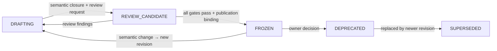

# Contract Lifecycle Management

> **Status: ADOPTED project process specification.** This document manages the lifecycle of every Contract under `docs/contracts/` and its machine representation under `system-contracts/`. It is a project process specification at the same level as `workflow-composition-model.md`; it is **not** a business Contract and does not apply its own state machine to itself. Revision of this specification follows the ordinary document review process of the repository.
>
> **Normative language: English.** The Chinese file [`contract-lifecycle.zh-CN.md`](contract-lifecycle.zh-CN.md) is a non-normative tracking translation. Whenever an English section changes, its Chinese counterpart is retranslated from the current English section and replaced as a whole.

## 1. Purpose and Scope

Every Contract in workflow-self-recursive — Observation Catalog, OTel Observation Profile, Execution–Evidence Interaction Contract, Metric Catalog, Workflow Definition DSL, and future ones — follows one lifecycle so that:

- the state of every Contract is readable from its document header alone;
- the transition from draft to published is gated by evidence, not by assertion;
- no implementation claims conformance before physical publication;
- obsolete versions are isolated, never co-active.

This specification applies to:

1. the semantic specification documents under `docs/contracts/<contract>/`;
2. the machine representation under `system-contracts/<contract>/` (schemas, encoded registries, fixtures, validators, version policy);
3. consumption obligations and downstream gap tracking that reference a Contract revision.

It does not apply to Concept or System Design documents (`docs/agent-architecture.md`, `docs/systems/*`), which own their own lifecycles, nor to Workflow Packages under `workflow-package/`, which are consumers of Contracts.

## 2. Contract Anatomy

A Contract is published as **two paired halves**; either half alone is insufficient for a conformance claim:

| Half | Location | Content |
| --- | --- | --- |
| Semantic specification | `docs/contracts/<contract>/<name>.md` | technology-neutral meaning, final fields/semantics, closed vocabularies, version compatibility, conformance requirements |
| Machine representation | `system-contracts/<contract>/` | normative schemas, encoded registries, fixtures (positive/negative/recovery), validators, version policy, publication record |

Authority direction: a Contract is a **representation and closure** of semantics owned upstream (Concept, System Designs, Workflow composition model). The Contract never becomes the sole semantic authority; when upstream semantics change, the Contract must be revised, not silently reinterpreted. The semantic document and the machine representation must stay in lockstep: a change to either one without the other keeps the Contract unreleased or invalidates its release.

## 3. Lifecycle States

Every Contract document header carries one `Lifecycle status` from this closed enumeration:

| State | Meaning | Implementations may claim conformance? |
| --- | --- | --- |
| `DRAFTING` | Semantics being written; fields, vocabularies, and rules may change without notice. Document header must state the draft revision and a `DRAFTING` status. | No |
| `REVIEW_CANDIDATE` | Semantics are frozen as a candidate; the Contract is under independent review, fresh-reader test, translation parity, and deterministic verification. Machine representation may be present as candidate material but is not released. | No (design evidence / spike only) |
| `FROZEN` | All transition gates passed; publication binding recorded; machine representation released. Implementations may claim physical conformance against this exact revision. | Yes, against the exact revision |
| `DEPRECATED` | Still valid for already-bound Deliveries, but not recommended for new use; a successor exists or is planned. | No new claims; existing claims remain bound to their revision |
| `SUPERSEDED` | Explicitly replaced by a newer revision; legacy-isolated. Reference literal is marked `NON_RESOLVING_LEGACY_HISTORY_ONLY`; Git history owns provenance; no parallel old authority is kept. | No |

Transition rules:

- **`DRAFTING` → `REVIEW_CANDIDATE`**: the author declares semantic closure (no unclosed field meaning, no pseudo-specification), fills the standard header, and requests review.
- **`REVIEW_CANDIDATE` → `DRAFTING`**: any review finding that changes semantics returns the Contract to drafting.
- **`REVIEW_CANDIDATE` → `FROZEN`**: all gates of §4 pass and the publication binding (§5) is recorded.
- **`FROZEN` → `DRAFTING`**: a semantic change requires a new revision (MAJOR, §6) and restarts the lifecycle for that revision; the old revision becomes `SUPERSEDED` (or `DEPRECATED` during the transition).
- **`FROZEN` → `DEPRECATED`**: owner decision; only an owner with authority over the Contract may deprecate it.
- **`DEPRECATED` → `SUPERSEDED`**: when the replacement revision reaches `FROZEN`.

## 4. Transition Gates

### 4.1 Gate set for `REVIEW_CANDIDATE` → `FROZEN`

All gates must pass; a failed gate returns the Contract to `DRAFTING` (if semantics change) or keeps it in `REVIEW_CANDIDATE` (if only evidence is missing):

| Gate | Requirement | Evidence |
| --- | --- | --- |
| contract.gate.1 Semantic review | Independent adversarial review(s) of the semantics, sized to the Contract: small Contract = one independent review + one fresh reader; large Contract = three-lens review (problem–solution, architecture, quality). Findings must be closed by their source lens. | review results with dispositions |
| contract.gate.2 Fresh reader | A downstream implementer (not the author) can derive the machine representation and a conforming fixture set from the semantic document alone. | fresh-reader result |
| contract.gate.3 Deterministic verification | Document checks pass: stable anchors/IDs, headings/tables/links parity, closed vocabularies, no dangling references. Machine fixtures (positive/negative/recovery) pass against the machine representation. | deterministic check report; fixture run |
| contract.gate.4 Translation parity | The `zh-CN` companion is retranslated as a whole from the current English document; anchors, headings, tables, IDs, fields, enums, and links stay paired. | parity check |
| contract.gate.5 Machine representation released | Schemas/registries/fixtures/validators/version policy exist under `system-contracts/<contract>/` with the same revision as the semantic document. | file inventory + revision match |
| contract.gate.6 Publication binding | Exact revision + SHA-256 digest recorded in the publication record; prior revision literal marked `NON_RESOLVING_LEGACY_HISTORY_ONLY`. | publication record |

### 4.2 Who runs the gates; transition authority

- The **Contract author/owner** prepares the candidate and the gate evidence.
- **Reviewers, fresh reader, and translation parity** (contract.gate.1, contract.gate.2, contract.gate.4) are independent of the author; the author never self-assesses their own Contract (mirroring the runner prohibition of Profile self-assessment).
- **Deterministic verification and publication binding** (contract.gate.3, contract.gate.5, contract.gate.6) are mechanical steps that may be run by the author but must be reproducible by any verifier.
- **Transition authority**: state transitions are approved by the **Contract owner** (the repository owner/team acting through the team-config authority; each Contract records its owner in its header or obligation register). The owner approves a transition based on the gate evidence; owner approval never substitutes for independent gate evidence. `DRAFTING → REVIEW_CANDIDATE` is an author self-declaration of semantic closure; `REVIEW_CANDIDATE → FROZEN` requires owner approval plus the independent evidence of contract.gate.1–contract.gate.6.

### 4.3 Fast path for unencumbered Contracts

A new Contract with no historical baggage — no released compatibility promise, no downstream revision already bound — may be validated before its independent review completes:

1. The author declares semantic closure and moves the Contract to `REVIEW_CANDIDATE`.
2. With owner approval, candidate-based downstream work proceeds in `REVIEW_CANDIDATE`: downstream migration, implementation spikes, and fixture authoring. Their outputs are design evidence, explicitly labeled, and never conformance claims.
3. This downstream work doubles as gate evidence: a downstream implementer deriving the machine representation and fixtures from the semantic document is exactly contract.gate.2 (fresh reader), and the fixture run is part of contract.gate.3.
4. The independent contract.gate.1 review still runs — it may be small (one independent reviewer + one fresh reader) and may run after the validation work — and cannot be waived by the owner.
5. When contract.gate.1–contract.gate.6 all pass, the Contract transitions to `FROZEN` in one step, and only then do conformance claims become admissible.

The fast path changes the ordering of evidence, never the required set of gates. A Contract with released revisions or bound downstream Deliveries must follow the ordinary order (§10.2).

## 5. Publication and Legacy Isolation

- Publication is **pairwise**: the semantic document revision and the machine representation revision are published together with the same revision identity; publishing one without the other leaves the Contract unreleased.
- The **publication record** binds the exact byte stream (SHA-256) and the exact revision; it lives with the machine representation (or a location named in the Contract header).
- **Legacy isolation**: when a revision is superseded, its literal is marked `NON_RESOLVING_LEGACY_HISTORY_ONLY`; it is not resolvable as the current authority, and no parallel old authority document is retained. Git history owns provenance (mirroring the Concept `concept.acceptance.014` discipline).
- Publication does **not** create a second semantic owner: the Contract remains a representation of upstream semantics.

## 6. Versioning and Compatibility

- Contract revision: `name@MAJOR.MINOR.PATCH` (e.g., `agentops.workflow-dsl@0.1.0`).
- `0.x` is pre-release: semantics may still shift after review; `1.0.0` is the first frozen revision.
- Compatibility classes:

| Change | Revision | Rule |
| --- | --- | --- |
| Text fixes with no semantic impact | PATCH | backward compatible |
| Adding optional fields/resources, clarifying meaning | MINOR | backward compatible |
| Changing field semantics, removing fields, changing closed vocabularies, changing authority order | MAJOR | requires a new revision and a full lifecycle restart for that revision |

- **Evolution happens in English.** The English document is the target of iteration; the `zh-CN` companion is replaced wholesale from the current English document (never diff-edited).
- **No in-flight drift**: implementations bind one exact revision; a later revision applies only to later Deliveries; same identity with different content fails closed.

## 7. Conformance Claims

- Only a `FROZEN` revision admits physical-conformance claims, and only against the exact revision + machine representation published for it.
- During `DRAFTING` and `REVIEW_CANDIDATE`, implementations may produce design evidence and spikes only; they must be labeled as such and never presented as conformance.
- A conformance claim requires: applicable schema/registry validation pass + applicable fixture corpus (positive/negative/recovery) pass + no use of unpublished fields + version-policy compliance.

## 8. Obligations and Downstream Gaps

- Releasing a Contract's machine representation is an explicit **obligation** (the `concept.obligation.001` pattern): it records an owner, the required evidence, a return location, and a reopen condition. A Contract can be semantically stable (`REVIEW_CANDIDATE`) with its machine-representation obligation still open.
- Downstream consumers track gaps against Contract revisions (the `runner-EXT-003.x` pattern). A downstream gap is closed only when the referenced revision reaches `FROZEN` and the applicable conformance corpus passes; closing a gap by weakening the Contract is forbidden.
- When a downstream gap's reopen condition is met, the gap reopens and the owning Contract returns to the appropriate state.

## 9. Document Metadata Template

Every Contract semantic document starts with this header (extend with Contract-specific fields; the paired `zh-CN` companion mirrors it):

| Field | Value |
| --- | --- |
| Contract revision | `name@MAJOR.MINOR.PATCH` |
| Lifecycle status | `DRAFTING \| REVIEW_CANDIDATE \| FROZEN \| DEPRECATED \| SUPERSEDED` |
| Normative language | English |
| Translation | [`<name>.zh-CN.md`](<name>.zh-CN.md) — non-normative tracking translation; parity obligation per §4.1 contract.gate.4 |
| Semantic authority | upstream owner document(s) |
| Machine representation | `system-contracts/<contract>/` + revision |
| Publication binding | (after FROZEN) revision + SHA-256 + record location |
| Reopen condition | the concrete condition that returns the Contract to an earlier state |

Status values used by pre-existing Contract documents (e.g., `DRAFT_NOT_PUBLISHED`, `WORKING_REVIEW_CANDIDATE`, `PROFILE_DESIGN_READY_REBINDING_REQUIRED`) map to this enumeration as follows and should be normalized over time:

| Legacy status value | Normalized |
| --- | --- |
| `DRAFT_NOT_PUBLISHED` | `REVIEW_CANDIDATE` when semantics are stable and only machine publication is missing; otherwise `DRAFTING` |
| `WORKING_REVIEW_CANDIDATE` | `REVIEW_CANDIDATE` |
| `PROFILE_DESIGN_READY_REBINDING_REQUIRED` | `REVIEW_CANDIDATE` (machine representation unproven) |
| `CONFIRMED` (Package design status, not a Contract status) | not a Contract status |

## 10. Authoring and Revision Workflow

### 10.1 New Contract

1. Create `docs/contracts/<contract>/<name>.md` with the header template (§9); status `DRAFTING`.
2. Close every field/vocabulary/rule meaning; no pseudo-specification (§230 discipline).
3. Declare semantic closure and request review → `REVIEW_CANDIDATE`.
4. Run gates contract.gate.1–contract.gate.6 (§4); on pass, record the publication binding (§5) → `FROZEN`.
5. Create the `zh-CN` companion as a wholesale translation at the same revision.

### 10.2 Revising a Frozen Contract

1. Semantic change → new MAJOR revision; the old revision becomes `DEPRECATED`, then `SUPERSEDED` when the new one freezes.
2. The new revision restarts at `DRAFTING` and follows §10.1 steps 2–5.
3. The machine representation is updated in lockstep; mismatched revision between the two halves keeps the Contract unreleased.

### 10.3 Author checklist (before requesting review)

- [ ] Header template complete and status accurate
- [ ] Every field meaning closed; no dangling references
- [ ] Closed vocabularies enumerated; no free-form escape hatch
- [ ] Version-compatibility classes stated
- [ ] Conformance requirements stated (three levels where applicable)
- [ ] `zh-CN` companion is the current wholesale translation (or explicitly pending)
- [ ] Machine representation revision matches the semantic revision (when present)

## 11. Current Contract Register

| Contract | Semantic document | Machine representation | Lifecycle status (normalized) | Revision | Open obligation |
| --- | --- | --- | --- | --- | --- |
| Observation Catalog | [`observation/observation-catalog.md`](observation/observation-catalog.md) | `system-contracts/` (not released) | `REVIEW_CANDIDATE` | split draft; profile cited at `0.2.0` | machine representation release (`concept.obligation.001`) |
| OTel Observation Profile | [`observation/otel-observation-profile.md`](observation/otel-observation-profile.md) | not released | `REVIEW_CANDIDATE` | proposed `0.2.0` | machine representation release (`concept.obligation.001`) |
| Execution–Evidence Interaction Contract | [`execution-evidence/interaction-contract.md`](execution-evidence/interaction-contract.md) | not released | `REVIEW_CANDIDATE` | split draft | machine representation release (`concept.obligation.001`) |
| Metric Catalog | [`evaluation/metric-catalog.md`](evaluation/metric-catalog.md) | not released | `REVIEW_CANDIDATE` | split draft | machine representation release (`concept.obligation.001`) |
| Workflow Definition DSL | [`workflow/workflow-definition-dsl.md`](workflow/workflow-definition-dsl.md) | [`system-contracts/workflow-dsl/`](../../system-contracts/workflow-dsl/) (candidate material) | `REVIEW_CANDIDATE` | `agentops.workflow-dsl@0.1.0` | Task 2 migration (contract.gate.2/contract.gate.3 evidence) → independent contract.gate.1 review → machine release → FROZEN |

Notes:

- The observation-family documents declare their own status values in their headers; the normalized column is a management mapping, not an override of their authority.
- The Workflow Definition DSL is the first Contract drafted under this specification; it is `REVIEW_CANDIDATE` under the fast path (§4.3): the first-party Workflow migration (Task 2) proceeds as candidate-based validation and supplies the contract.gate.2/contract.gate.3 evidence for the later one-step freeze.
