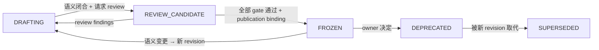

# Contract 生命周期管理（中文翻译）

> **状态：ADOPTED 项目流程规范。** 本文管理 `docs/contracts/` 下每个 Contract 及其在 `system-contracts/` 下机器表示的生命周期。它是与 `workflow-composition-model.md` 同级的项目流程规范；**不是**业务 Contract，自身不套用本文的状态机。本规范的修订遵循仓库普通文档 review 流程。
>
> **规范语言：英文。** 本文件是 [`contract-lifecycle.md`](contract-lifecycle.md) 的非规范跟踪翻译。每当英文章节变更，其中文对应章节从当前英文章节整体重译并整篇替换。

## 1. 目的与范围

workflow-self-recursive 中的每个 Contract —— Observation Catalog、OTel Observation Profile、Execution–Evidence Interaction Contract、Metric Catalog、Workflow Definition DSL 以及未来的 —— 都遵循同一生命周期，以保证：

- 每个 Contract 的状态仅凭文档头部即可读取；
- 从草案到发布的转换由证据把关，而不是由声明把关；
- 物理发布之前没有任何实现可以声称 conformance；
- 过时版本被隔离，绝不并存为活跃权威。

本规范适用于：

1. `docs/contracts/<contract>/` 下的语义规范文档；
2. `system-contracts/<contract>/` 下的机器表示（schemas、encoded registries、fixtures、validators、version policy）；
3. 引用某 Contract revision 的消费义务与下游 gap 跟踪。

它不适用于 Concept 或 System Design 文档（`docs/agent-architecture.md`、`docs/systems/*`，它们有自己的生命周期），也不适用于 `workflow-package/` 下的 Workflow Package（它们是 Contract 的消费方）。

## 2. Contract 构成

一个 Contract 以**成对的两个半区**发布；单独任何一半都不足以支撑 conformance 声明：

| 半区 | 位置 | 内容 |
| --- | --- | --- |
| 语义规范 | `docs/contracts/<contract>/<name>.md` | technology-neutral meaning、最终字段/语义、闭合词汇表、版本兼容、conformance 要求 |
| 机器表示 | `system-contracts/<contract>/` | 规范 schemas、encoded registries、fixtures（positive/negative/recovery）、validators、version policy、publication record |

权威方向：Contract 是上游（Concept、System Design、Workflow composition model）所拥有语义的 **representation 与 closure**。Contract 绝不成为唯一语义权威；上游语义变化时，Contract 必须被修订，而不是被静默重新解释。语义文档与机器表示必须保持同步：只改其一而不同步另一方，会使 Contract 保持未发布或使已发布状态失效。

## 3. 生命周期状态

每个 Contract 文档头部携带 `Lifecycle status`，取自此闭合枚举：

| 状态 | 含义 | 实现可否声称 conformance？ |
| --- | --- | --- |
| `DRAFTING` | 语义写作中；字段、词汇表与规则可随时更改。文档头部必须声明 draft revision 与 `DRAFTING` 状态。 | 否 |
| `REVIEW_CANDIDATE` | 语义作为候选冻结；Contract 正在独立 review、fresh-reader、翻译 parity 与确定性验证中。机器表示可作为候选材料存在但未发布。 | 否（仅 design evidence / spike） |
| `FROZEN` | 全部转换 gate 通过；publication binding 已记录；机器表示已发布。实现可对该精确 revision 声称 physical conformance。 | 是，仅对精确 revision |
| `DEPRECATED` | 对已绑定的 Delivery 仍有效，但不推荐新使用；存在或计划存在后继。 | 不新增声明；既有声明仍绑定其 revision |
| `SUPERSEDED` | 被更新的 revision 明确取代；legacy 隔离。引用 literal 标记为 `NON_RESOLVING_LEGACY_HISTORY_ONLY`；Git history 拥有 provenance；不保留并行的旧权威。 | 否 |

转换规则：

- **`DRAFTING` → `REVIEW_CANDIDATE`**：作者声明语义闭合（无未闭合字段含义、无伪规范），填写标准头部，并请求 review。
- **`REVIEW_CANDIDATE` → `DRAFTING`**：任何改变语义的 review finding 使 Contract 回到 drafting。
- **`REVIEW_CANDIDATE` → `FROZEN`**：§4 全部 gate 通过且 publication binding（§5）已记录。
- **`FROZEN` → `DRAFTING`**：语义变更需要新 revision（MAJOR，§6）并为该 revision 重启生命周期；旧 revision 变为 `SUPERSEDED`（转换期间为 `DEPRECATED`）。
- **`FROZEN` → `DEPRECATED`**：owner 决定；只有对该 Contract 拥有 authority 的 owner 可以弃用。
- **`DEPRECATED` → `SUPERSEDED`**：当替代 revision 达到 `FROZEN` 时。

## 4. 转换 Gate

### 4.1 `REVIEW_CANDIDATE` → `FROZEN` 的 gate 集

全部 gate 必须通过；失败使 Contract 回到 `DRAFTING`（若语义变化）或保持在 `REVIEW_CANDIDATE`（若仅缺证据）：

| Gate | 要求 | 证据 |
| --- | --- | --- |
| contract.gate.1 语义 review | 按 Contract 规模裁剪的独立对抗 review：小型 Contract = 一次独立 review + 一次 fresh reader；大型 Contract = 三 lens review（problem–solution、architecture、quality）。Findings 必须由其 source lens 关闭。 | 带 disposition 的 review 结果 |
| contract.gate.2 Fresh reader | 下游实现者（非作者）仅凭语义文档即可推导出机器表示与一致的 fixture 集。 | fresh-reader 结果 |
| contract.gate.3 确定性验证 | 文档检查通过：稳定 anchors/IDs、headings/tables/links parity、词汇闭合、无悬空引用。机器 fixtures（positive/negative/recovery）对机器表示全绿。 | 确定性检查报告；fixture 运行 |
| contract.gate.4 翻译 parity | `zh-CN` companion 从当前英文文档整体重译；anchors、headings、tables、IDs、fields、enums 与 links 保持成对。 | parity 检查 |
| contract.gate.5 机器表示发布 | schemas/registries/fixtures/validators/version policy 存在于 `system-contracts/<contract>/` 且 revision 与语义文档一致。 | 文件清单 + revision 匹配 |
| contract.gate.6 Publication binding | 精确 revision + SHA-256 digest 记录在 publication record；先前 revision literal 标记为 `NON_RESOLVING_LEGACY_HISTORY_ONLY`。 | publication record |

### 4.2 谁运行 gate；转换 authority

- **Contract 作者/owner** 准备候选与 gate 证据。
- **Reviewer、fresh reader 与翻译 parity**（contract.gate.1、contract.gate.2、contract.gate.4）独立于作者；作者绝不自我评估自己的 Contract（沿用 runner 对 Profile self-assessment 的禁止）。
- **确定性验证与 publication binding**（contract.gate.3、contract.gate.5、contract.gate.6）是机械步骤，可由作者运行，但任何验证者必须可复现。
- **转换 authority**：状态转换由 **Contract owner**（repository owner/team，经 team-config authority；每个 Contract 在头部或 obligation register 记录其 owner）批准。owner 基于 gate 证据批准转换；owner 的批准绝不替代独立 gate 证据。`DRAFTING → REVIEW_CANDIDATE` 是作者对语义闭合的自声明；`REVIEW_CANDIDATE → FROZEN` 需要 owner 批准加上 contract.gate.1–contract.gate.6 的独立证据。

### 4.3 无历史包袱 Contract 的快速路径

无历史包袱的新 Contract——没有已发布的兼容承诺、没有已绑定 revision 的下游——可以在独立 review 完成前先行验证：

1. 作者声明语义闭合并把 Contract 移到 `REVIEW_CANDIDATE`。
2. 经 owner 批准，candidate-based 下游工作在 `REVIEW_CANDIDATE` 下进行：下游迁移、实现 spike 与 fixture 编写。其产出是 design evidence，明确标注，绝不作为 conformance 声明。
3. 这些下游工作同时充当 gate 证据：下游实现者仅凭语义文档推导机器表示与 fixtures 正是 contract.gate.2（fresh reader），fixture 运行是 contract.gate.3 的一部分。
4. 独立 contract.gate.1 review 仍然要跑——可以小（一个独立 reviewer + 一个 fresh reader），可以在验证工作之后进行——owner 不能豁免它。
5. 当 contract.gate.1–contract.gate.6 全部通过时，Contract 一次性转换到 `FROZEN`，此后 conformance 声明才可准入。

快速路径改变的是证据的**顺序**，绝不是所需 gate 的**集合**。有已发布 revision 或已绑定下游 Delivery 的 Contract 必须走普通顺序（§10.2）。

## 5. 发布与 Legacy 隔离

- 发布是**成对的**：语义文档 revision 与机器表示 revision 以同一 revision identity 一起发布；只发布其一而不同步另一方，Contract 保持未发布。
- **publication record** 绑定精确字节流（SHA-256）与精确 revision；它随机器表示存放（或位于 Contract 头部指定的位置）。
- **Legacy 隔离**：revision 被取代时，其 literal 标记为 `NON_RESOLVING_LEGACY_HISTORY_ONLY`；它不可作为当前权威解析，也不保留并行的旧权威文档。Git history 拥有 provenance（沿用 Concept `concept.acceptance.014` 纪律）。
- 发布**不**创造第二个语义 owner：Contract 仍是上游语义的 representation。

## 6. 版本与兼容

- Contract revision：`name@MAJOR.MINOR.PATCH`（如 `agentops.workflow-dsl@1.0.0`）。
- `0.x` 是 pre-release：review 后语义仍可能调整；`1.0.0` 是第一个冻结 revision。
- 兼容类别：

| 变更 | Revision | 规则 |
| --- | --- | --- |
| 无语义影响的文本修正 | PATCH | 向后兼容 |
| 新增可选字段/资源、澄清含义 | MINOR | 向后兼容 |
| 改变字段语义、删除字段、改变闭合词汇表、改变 authority 顺序 | MAJOR | 需要新 revision，并为该 revision 完整重启生命周期 |

- **演进发生在英文。** 英文文档是迭代对象；`zh-CN` companion 从当前英文文档整篇替换（绝不 diff 编辑）。
- **无 in-flight drift**：实现绑定一个精确 revision；后续 revision 只适用于后续 Delivery；同 identity 不同内容 fail closed。

## 7. Conformance 声明

- 只有 `FROZEN` revision 允许 physical-conformance 声明，且仅针对该 revision 及其发布的机器表示。
- `DRAFTING` 与 `REVIEW_CANDIDATE` 期间，实现只能产出 design evidence 与 spike；必须如此标注，绝不能呈现为 conformance。
- conformance 声明要求：适用 schema/registry 校验通过 + 适用 fixture corpus（positive/negative/recovery）通过 + 不使用未发布字段 + 符合 version policy。

## 8. 义务与下游 Gap

- 发布 Contract 的机器表示是一个显式**义务**（`concept.obligation.001` 模式）：记录 owner、所需证据、return location 与 reopen condition。Contract 可以语义稳定（`REVIEW_CANDIDATE`）而机器表示义务仍开放。
- 下游消费方按 Contract revision 跟踪 gap（`runner.open-work.003.x` 模式）。下游 gap 仅在所引用 revision 达到 `FROZEN` 且适用 conformance corpus 通过时关闭；通过弱化 Contract 来关闭 gap 是禁止的。
- 当下游 gap 的 reopen condition 满足时，gap 重新打开，所拥有的 Contract 回到相应状态。

## 9. 文档元数据模板

每个 Contract 语义文档以此头部开头（可扩展 Contract 特有字段；成对的 `zh-CN` companion 镜像之）：

| 字段 | 值 |
| --- | --- |
| Contract revision | `name@MAJOR.MINOR.PATCH` |
| Lifecycle status | `DRAFTING \| REVIEW_CANDIDATE \| FROZEN \| DEPRECATED \| SUPERSEDED` |
| Normative language | English |
| Translation | [`<name>.zh-CN.md`](<name>.zh-CN.md) —— 非规范跟踪翻译；parity 义务见 §4.1 contract.gate.4 |
| Semantic authority | 上游 owner 文档 |
| Machine representation | `system-contracts/<contract>/` + revision |
| Publication binding | （FROZEN 后填写）revision + SHA-256 + record 位置 |
| Reopen condition | 使 Contract 回到更早状态的具体条件 |

既有 Contract 文档使用的状态值（如 `DRAFT_NOT_PUBLISHED`、`WORKING_REVIEW_CANDIDATE`、`PROFILE_DESIGN_READY_REBINDING_REQUIRED`）按如下映射到本枚举，并应随时间规范化：

| 既有状态值 | 规范化 |
| --- | --- |
| `DRAFT_NOT_PUBLISHED` | 语义稳定且仅缺机器发布时为 `REVIEW_CANDIDATE`；否则为 `DRAFTING` |
| `WORKING_REVIEW_CANDIDATE` | `REVIEW_CANDIDATE` |
| `PROFILE_DESIGN_READY_REBINDING_REQUIRED` | `REVIEW_CANDIDATE`（机器表示未证明） |
| `CONFIRMED`（Package 设计状态，非 Contract 状态） | 不是 Contract 状态 |

## 10. 编写与修订工作流

### 10.1 新建 Contract

1. 创建 `docs/contracts/<contract>/<name>.md`，使用头部模板（§9）；状态 `DRAFTING`。
2. 闭合每个字段/词汇表/规则的含义；不允许伪规范（§230 纪律）。
3. 声明语义闭合并请求 review → `REVIEW_CANDIDATE`。
4. 运行 gate contract.gate.1–contract.gate.6（§4）；通过后记录 publication binding（§5）→ `FROZEN`。
5. 创建 `zh-CN` companion，作为同 revision 的整篇翻译。

### 10.2 修订已冻结 Contract

1. 语义变更 → 新 MAJOR revision；旧 revision 先变 `DEPRECATED`，新 revision 冻结时变 `SUPERSEDED`。
2. 新 revision 从 `DRAFTING` 重启，并按 §10.1 步骤 2–5 进行。
3. 机器表示同步更新；两个半区 revision 不匹配则 Contract 保持未发布。

### 10.3 作者 checklist（请求 review 前）

- [ ] 头部模板完整且状态准确
- [ ] 每个字段含义闭合；无悬空引用
- [ ] 闭合词汇表已枚举；无自由形式逃生口
- [ ] 已陈述版本兼容类别
- [ ] 已陈述 conformance 要求（适用时三级）
- [ ] `zh-CN` companion 是当前整篇翻译（或明确 pending）
- [ ] 机器表示 revision 与语义 revision 一致（存在时）

## 11. 当前 Contract 清单

| Contract | 语义文档 | 机器表示 | Lifecycle status（规范化） | Revision | 未决义务 |
| --- | --- | --- | --- | --- | --- |
| Observation Catalog | [`observation/observation-catalog.md`](observation/observation-catalog.md) | [`system-contracts/observation/`](../../system-contracts/observation/)（`1.0.2`，已发布；wire Profile `1.0.0`） | `FROZEN` | `observation-contract@1.0.2`；`VALIDATOR_ONLY` | non-semantic exact-binding PATCH gate 与 Contract-owner approval；不可变的 `1.0.0`/`1.0.1` 仍可解析 |
| OTel Observation Profile | [`observation/otel-observation-profile.md`](observation/otel-observation-profile.md) | [`system-contracts/observation/`](../../system-contracts/observation/)（`1.0.1`，已发布；wire Profile `1.0.0`） | `FROZEN` | Contract `1.0.1`，profile `1.0.0`；`VALIDATOR_ONLY` | scoped PATCH gates、exact publication binding 与 Contract-owner approval；不可变的 `1.0.0` 仍可解析 |
| Execution–Evidence Interaction Contract | [`execution-evidence/interaction-contract.md`](execution-evidence/interaction-contract.md) | [`system-contracts/observation/schemas/otlp-interaction-1.0.0.schema.json`](../../system-contracts/observation/schemas/otlp-interaction-1.0.0.schema.json)（由 Contract `1.0.1` 发布） | `FROZEN` | Contract `1.0.1`，interaction schema `1.0.0`；`VALIDATOR_ONLY` | scoped PATCH gates、exact publication binding 与 Contract-owner approval；不可变的 `1.0.0` 仍可解析 |
| Metric Catalog | [`evaluation/metric-catalog.md`](evaluation/metric-catalog.md) | [`system-contracts/evaluation/`](../../system-contracts/evaluation/)（`1.0.0`，已发布） | `FROZEN` | `agentops.evaluation.metric-catalog@1.0.0`；`VALIDATOR_ONLY` | 已由 contract.gate.1–6、exact publication binding 与 Contract-owner approval 关闭 |
| Workflow Definition DSL | [`workflow/workflow-definition-dsl.md`](workflow/workflow-definition-dsl.md) | [`system-contracts/workflow-dsl/`](../../system-contracts/workflow-dsl/)（`1.0.0`，已发布） | `FROZEN` | `agentops.workflow-dsl@1.0.0`；`VALIDATOR_ONLY` | 已由 contract.gate.1–6、exact publication binding 与 Contract-owner approval 关闭 |

注：

- observation 系列文档在其头部声明各自的状态值；规范化列是管理映射，不覆盖它们的 authority。
- Workflow Definition DSL 是本规范下冻结的第一个 Contract；其 first-party Workflow 迁移在快速路径（§4.3）下提供了 contract.gate.2/contract.gate.3 证据，随后经 owner approval 与 exact publication binding 一次性转为 `FROZEN`。
