# Execution and DSH Intake release process

This adapter releases `wsr-execution` and `wsr-dsh-intake` in lockstep. A stable tag is an output of qualification and component-first repinning, never a qualification trigger. The common identity and recovery rules are in the [release automation guide](release-automation.md).

## Required order

```mermaid
flowchart LR
  A[Candidate on release/next] --> B[Acceptance and coordinate gates]
  B --> C[Build manifest-bound tgz pair and release notes]
  C --> D[Local clean-install DSH E2E plus manual evidence]
  D --> E[Create x.y.z-rc.N prerelease]
  E --> F[Redownload and verify exact assets]
  F --> G[Remote clean-install DSH E2E]
  G --> H[Attach qualification evidence]
  H --> I[Squash component to main and repin superproject]
  I --> J[Publish exact tgz: core then intake]
  J --> K[Registry digest, description, versions and latest smoke]
  K --> L[Create stable tag and Release last]
```



Changed bytes require a new `-rc.N`; an RC is never overwritten. Stable promotion targets the qualified RC commit and reuses its assets even though the component main branch has a squash commit.

## 1. Prepare and qualify locally

Keep all five coordinates equal: root version, intake version, intake dependency on `wsr-execution`, intake DSH compatibility coordinate, and dynamically derived workflow tgz names.

```sh
pnpm release:check-coordinates
pnpm release:artifacts <release-directory>
pnpm release:verify <release-directory>
pnpm release:publish-npm <release-directory> # dry recovery plan; does not publish
```

The builder alone may invoke `npm pack`; direct source packing or publishing fails closed. It generates two tgz files, publication records, `release-notes.md`, and `release-metadata.json`. Release notes take What's new from generated CHANGELOG content, copy compatibility from the manifest, include an upgrade guide, and are digest-bound by the manifest.

Follow the [local pre-release E2E guide](dsh-execution-local-e2e.md). Also run the credentialed DSH Web path: create a Workflow from chat text and attachments, observe it in the same conversation, exercise multi-turn input when offered, finish with `/wsr action finish`, and record the replayable evidence in a GitHub issue/comment. No tag or Release is created locally.

## 2. Publish and qualify an RC

Merge the exact component candidate to `release/next`, then dispatch from that ref:

```sh
gh workflow run ci.yml --repo firestige/execution-system --ref release/next \
  -f release_candidate=true \
  -f candidate_tag=0.1.3-rc.1 \
  -f authority_ref=<superproject-ref-pinning-this-candidate> \
  -f local_manual_e2e_evidence=<github-issue-or-comment-url>
```

The workflow verifies the superproject Execution pin equals the workflow commit, reruns all gates, builds and locally qualifies the tgz pair, creates the prerelease, redownloads the assets into a clean directory, verifies their digests and manifest, reruns remote-install DSH E2E, and attaches `release-qualification.json`. Candidate publication uses only the repository `GITHUB_TOKEN`; it never receives the release App key.

## 3. Merge and repin before promotion

After qualification, squash-merge the component candidate to `main`, update the superproject submodule to that component main commit, and merge the repin. Preserve the RC URL, candidate SHA, squash SHA, superproject repin SHA, and manifest digest. Do not move or rebuild the RC.

## 4. Promote exact qualified bytes

Configure npm trusted publishers for both packages to `firestige/execution-system` and `release-promote.yml`. Then dispatch promotion with the qualified RC and stable tag. The workflow revalidates the candidate commit, qualification evidence, manifest, release notes, and remote DSH install. With npm OIDC it publishes `wsr-execution` first and `wsr-dsh-intake` second, then verifies exact registry tarball digests, descriptions, version listings, and `latest`. Only after those checks does it mint the scoped GitHub App token and create the stable tag/Release as the final operation.

If core succeeds and intake fails, keep stable absent and rerun the same candidate. The publisher downloads the existing coordinate: it skips core only when its digest equals the immutable manifest, then publishes intake. A different digest is a permanent version collision and requires investigation, not overwrite or rebuild.
