# Execution and DSH Intake release process

This process applies to every new Execution System and DSH Intake plugin version. A stable release tag is an output of qualification, never its trigger.

## Required order

```mermaid
flowchart LR
  A[Versioned source candidate] --> B[Full tests, coverage, static and build gates]
  B --> C[Build tgz files from the current checkout]
  C --> D[Local clean-install DSH Web E2E]
  D --> E[Credentialed manual E2E evidence]
  E --> F[Create x.y.z-rc.N GitHub prerelease]
  F --> G[Redownload exact prerelease assets]
  G --> H[Remote clean-install DSH Web E2E]
  H --> I[Publish qualification evidence]
  I --> J[Reverify evidence, commit and artifact digest]
  J --> K[Create stable x.y.z tag and final Release]
```

The RC tag exists only to make the candidate remotely installable. It is marked as a GitHub prerelease and is not a stable release tag. If a gate after RC publication fails, do not promote it; fix the source and use the next `-rc.N` candidate.

## 1. Local qualification

Use the [DSH Execution pre-release E2E guide](dsh-execution-quickstart.md). It builds both tgz files from the current checkout. In addition to automated `/wsr list` transport qualification, perform the credentialed #57 path in DSH Web: create a Workflow from chat text and attachments, observe the result in the same conversation, exercise multi-turn input when offered, and finish that phase with `/wsr action finish`. Record the replayable result in the tracking issue.

No GitHub release or tag is created during this stage.

## 2. Publish and verify an RC

After the candidate commit is on the releasable branch, run the execution-system **Release candidate** workflow with an exact tag such as `0.1.1-rc.1` and the GitHub URL of the local manual E2E evidence. The workflow:

1. requires the source package version to be the matching stable base (`0.1.1`);
2. reruns component gates;
3. builds and verifies artifacts from that checkout;
4. runs local artifact-install DSH Web E2E;
5. only then creates the GitHub prerelease;
6. downloads the assets back from that prerelease into a clean directory;
7. verifies metadata/digests and runs the same install E2E against the downloaded bytes; and
8. attaches `release-qualification.json` to the prerelease.

Publishing an RC is not completion and does not authorize a stable tag.

## 3. Promote only qualified bytes

Run **Promote qualified release candidate** with the RC tag and its stable version. It checks that the RC is a prerelease, checks out its exact commit, verifies the downloaded artifacts and `release-qualification.json`, and reruns remote artifact-install E2E. The final workflow step creates the stable tag and final GitHub Release together. There is no supported path that creates a stable release tag before these gates.

If the source commit, stable package version, metadata digest, local E2E, or remote prerelease E2E differs from the evidence, promotion fails closed.
