# Execution core release process

This adapter releases only the host-neutral `wsr-execution` package. DSH
Execution, Studio, and suite bundles are independently versioned and released
from [`firestige/wsr-dsh`](https://github.com/firestige/wsr-dsh). A stable tag
is the output of qualification and component-first repinning, never a
qualification trigger. Common identity and recovery rules are in the
[release automation guide](release-automation.md).

## Required order

```mermaid
flowchart LR
  A[Candidate on release/next] --> B[Acceptance and coordinate gates]
  B --> C[Materialize one manifest-bound core tgz]
  C --> D[Create x.y.z-rc.N prerelease]
  D --> E[Redownload and verify exact assets]
  E --> F[Attach qualification evidence]
  F --> G[Squash component to main and repin superproject]
  G --> H[Publish exact wsr-execution tgz]
  H --> I[Verify registry digest and metadata]
  I --> J[Create stable tag and Release last]
```



Changed bytes require a new `-rc.N`; an RC is never overwritten. Stable
promotion targets the qualified RC commit and reuses its assets even when the
component main branch contains the squash commit.

## 1. Prepare and qualify locally

```sh
pnpm release:check-coordinates
pnpm release:artifacts <release-directory>
pnpm release:verify <release-directory>
pnpm release:publish-npm <release-directory> # dry recovery plan
```

The verified builder produces one `wsr-execution-<version>.tgz`, its
publication record, `release-notes.md`, and `release-metadata.json`. Direct
source publication remains fail-closed. DSH clean-profile, lifecycle, browser,
and bundle-composition qualification belongs to the `wsr-dsh` release flow.

## 2. Publish and qualify an RC

Create `release/next` from the exact component candidate and commit this
immutable request as `release/request.json`:

```json
{
  "candidate_tag": "0.1.5-rc.1",
  "authority_ref": "<superproject-ref-pinning-this-candidate>",
  "authority_manifest": "release/candidates/<candidate>.json"
}
```

The workflow verifies the superproject Execution pin, reruns the component
gates, materializes only the exact core artifact bound by the unified manifest,
creates or exactly resumes the prerelease, redownloads its assets into a clean
directory, verifies them, and attaches `release-qualification.json`. It never
rebuilds candidate bytes after qualification.

## 3. Merge and repin before promotion

Squash-merge the component candidate to `main`, update the superproject
submodule to that main commit, and merge the repin. Preserve the RC URL,
candidate SHA, squash SHA, superproject repin SHA, and manifest digest.

## 4. Promote exact qualified bytes

Configure the `wsr-execution` npm trusted publisher for
`firestige/wsr-execution` and `release-promote.yml`. Promotion verifies the
candidate commit, qualification record, manifest, and release notes; publishes
the one exact tgz through OIDC; verifies registry digest, description, versions,
and `latest`; then creates the stable GitHub tag and Release as the last
operation. An existing version is skipped only when its registry bytes match
the immutable manifest; a different digest is a permanent collision.
