# Execution 与 DSH Intake 发布流程

本流程适用于每个新的 Execution System 与 DSH Intake plugin 版本。stable release tag 是 qualification 的输出，不能作为启动 qualification 的输入。

## 强制顺序

```mermaid
flowchart LR
  A[带版本的 source candidate] --> B[完整 test、coverage、static 与 build gates]
  B --> C[从当前 checkout 构建 tgz]
  C --> D[本地 clean-install DSH Web E2E]
  D --> E[带真实 credential 的人工 E2E evidence]
  E --> F[创建 x.y.z-rc.N GitHub prerelease]
  F --> G[重新下载准确的 prerelease assets]
  G --> H[远程 clean-install DSH Web E2E]
  H --> I[发布 qualification evidence]
  I --> J[复核 evidence、commit 与 artifact digest]
  J --> K[创建 stable x.y.z tag 与 final Release]
```

RC tag 只用于让 candidate 可以被远程安装。它必须标记为 GitHub prerelease，不是 stable release tag。RC 发布后的门禁失败时不得晋级；修复 source 后使用下一个 `-rc.N` candidate。

## 1. 本地 qualification

按照 [DSH Execution 发布前 E2E 指南](dsh-execution-quickstart.zh-CN.md)从当前 checkout 构建两个 tgz。除了自动化 `/wsr list` transport qualification，还要在 DSH Web 中执行带真实 credential 的 #57 路径：用聊天正文和附件创建 Workflow，在同一 conversation 中看到结果；Workflow 提供多轮交互时完成输入，并用 `/wsr action finish` 结束该阶段。把可重放结果记录到 tracking issue。

本阶段不创建任何 GitHub Release 或 tag。

## 2. 发布并验证 RC

candidate commit 进入可发布分支后，运行 execution-system 的 **Release candidate** workflow，输入 `0.1.1-rc.1` 这样的准确 tag 和本地人工 E2E evidence 的 GitHub URL。workflow 会：

1. 要求 source package version 是匹配的 stable base（例如 `0.1.1`）；
2. 重跑 component gates；
3. 从该 checkout 构建并验证 artifacts；
4. 运行本地 artifact-install DSH Web E2E；
5. 通过后才创建 GitHub prerelease；
6. 把 assets 从 prerelease 重新下载到 clean directory；
7. 验证 metadata/digest，并对下载得到的 bytes 运行相同 install E2E；
8. 把 `release-qualification.json` 附加到 prerelease。

RC 发布不代表完成，也不授权创建 stable tag。

## 3. 只晋级已经验证的 bytes

运行 **Promote qualified release candidate**，输入 RC tag 和对应 stable version。它会确认 RC 是 prerelease，checkout 它的准确 commit，验证下载的 artifacts 与 `release-qualification.json`，并重跑 remote artifact-install E2E。workflow 的最后一步才同时创建 stable tag 与 final GitHub Release。不存在提前创建 stable release tag 的受支持路径。

source commit、stable package version、metadata digest、本地 E2E 或 remote prerelease E2E 任一项与 evidence 不一致时，promotion 都会 fail closed。
