# Execution 与 DSH Intake 发布流程

本 adapter 以 lockstep 方式发布 `wsr-execution` 与 `wsr-dsh-intake`。stable tag 是 qualification 与 component-first repin 的输出，不能作为 qualification 的触发器。通用身份与恢复规则见[发布自动化指南](release-automation.zh-CN.md)。

## 强制顺序

```mermaid
flowchart LR
  A[release/next 上的 candidate] --> B[acceptance 与坐标门禁]
  B --> C[构建 manifest 绑定的双 tgz 与 release notes]
  C --> D[本地 clean-install DSH E2E 与人工 evidence]
  D --> E[创建 x.y.z-rc.N prerelease]
  E --> F[重新下载并验证精确 assets]
  F --> G[远程 clean-install DSH E2E]
  G --> H[附加 qualification evidence]
  H --> I[组件 squash 到 main 并 repin superproject]
  I --> J[按 core→intake 发布精确 tgz]
  J --> K[registry digest/description/versions/latest smoke]
  K --> L[最后创建 stable tag 与 Release]
```



字节变化必须使用新的 `-rc.N`，不得覆盖 RC。即使组件 main 是 squash commit，stable 仍指向 qualified RC commit 并复用其 assets。

## 1. 本地准备与 qualification

五个坐标必须一致：根 version、intake version、intake 对 `wsr-execution` 的依赖、intake DSH compatibility 坐标，以及 workflow 动态推导的 tgz 文件名。

```sh
pnpm release:check-coordinates
pnpm release:artifacts <release目录>
pnpm release:verify <release目录>
pnpm release:publish-npm <release目录> # 仅生成恢复计划，不发布
```

只有 builder 可以调用 `npm pack`；直接从源码打包或发布会 fail closed。builder 生成两个 tgz、publication records、`release-notes.md` 和 `release-metadata.json`。release notes 的 What's new 来自自动生成的 CHANGELOG，compatibility 来自 manifest，并含 upgrade guide；manifest 会绑定 notes 与 changelog 段摘要。

按[本地发布前 E2E 指南](dsh-execution-local-e2e.zh-CN.md)验证，并执行带真实 credential 的 DSH Web 路径：从聊天正文与附件创建 Workflow，在同一 conversation 查看结果；有多轮输入时完成交互，最后 `/wsr action finish`，并把可重放 evidence 记到 GitHub issue/comment。本地阶段不创建 tag/Release。

## 2. 发布并验证 RC

从精确组件 candidate 创建 `release/next`，把下面的不可变请求保存为 `release/request.json` 后推送该 commit。push 是首次发布触发器，因为 workflow 进入默认分支前不能使用 `workflow_dispatch`。

```json
{
  "candidate_tag": "0.1.3-rc.1",
  "authority_ref": "<准确pin该candidate的superproject-ref>",
  "authority_manifest": "release/candidates/iter4-wave11.json",
  "local_manual_e2e_evidence": "<github-issue或comment-url>"
}
```

该 workflow 进入默认分支后，可以从 `release/next` 手动 recovery dispatch，并提供相同四个字段。workflow 会确认 superproject 的 Execution pin 等于 workflow commit，重跑全部门禁，并从 immutable unified manifest 物化已经受 Git 跟踪的双 tgz。它逐项核对绑定 digest、本地验证这些 exact bytes、创建或精确恢复 prerelease、把 assets 重新下载到 clean directory、再次核对 digest/manifest、重跑 remote-install DSH E2E，并附加或验证 `release-qualification.json`。Wave11 qualification 后绝不重新 pack source。candidate 阶段只用仓库 `GITHUB_TOKEN`，拿不到 release App key。

## 3. promotion 前先 merge 与 repin

qualification 后，把组件 candidate squash merge 到 `main`，再更新并合入 superproject 的组件 submodule pin。保留 RC URL、candidate SHA、squash SHA、superproject repin SHA 与 manifest digest；不得移动或重建 RC。

## 4. 只晋级 qualified 字节

先在 npm 为两个包配置 trusted publisher：`firestige/execution-system` + `release-promote.yml`。随后用 qualified RC 与 stable tag dispatch promotion。workflow 会重新验证 candidate commit、qualification evidence、manifest、release notes 与 remote DSH install；用 npm OIDC 先发 `wsr-execution`、再发 `wsr-dsh-intake`，然后核对 registry 的精确 tarball digest、description、versions 与 `latest`。全部通过后才生成 scoped GitHub App token，并把 stable tag/Release 作为最后一步创建。

若 core 成功而 intake 失败，保持 stable 不存在，并对同一 candidate 重跑。publisher 会下载已有坐标；只有其 digest 与 immutable manifest 一致时才跳过 core，再发布 intake。digest 不同是永久版本冲突，必须调查，不能覆盖或重建。
