# Execution Core 发布流程

本 adapter 只发布宿主无关的 `wsr-execution`。DSH Execution、Studio 与
suite bundle 由 [`firestige/wsr-dsh`](https://github.com/firestige/wsr-dsh)
独立版本、独立发布。stable tag 是 qualification 与 component-first repin
的输出，不能作为 qualification 触发器。通用身份与恢复规则见
[发布自动化指南](release-automation.zh-CN.md)。

## 强制顺序

```mermaid
flowchart LR
  A[release/next 上的 candidate] --> B[acceptance 与坐标门禁]
  B --> C[物化 manifest 绑定的单个 core tgz]
  C --> D[创建 x.y.z-rc.N prerelease]
  D --> E[重新下载并验证精确 assets]
  E --> F[附加 qualification evidence]
  F --> G[组件 squash 到 main 并 repin superproject]
  G --> H[发布精确 wsr-execution tgz]
  H --> I[核对 registry digest 与 metadata]
  I --> J[最后创建 stable tag 与 Release]
```



字节变化必须使用新的 `-rc.N`，不得覆盖 RC。即使组件 main 已是 squash
commit，stable promotion 仍指向 qualified RC commit 并复用其 assets。

## 1. 本地准备与 qualification

```sh
pnpm release:check-coordinates
pnpm release:artifacts <release目录>
pnpm release:verify <release目录>
pnpm release:publish-npm <release目录> # 只生成恢复计划
```

verified builder 只生成一个 `wsr-execution-<version>.tgz`、对应 publication
record、`release-notes.md` 与 `release-metadata.json`；源码直接发布继续
fail closed。DSH clean-profile、lifecycle、浏览器与 bundle 组合资格归
`wsr-dsh` 发布流程所有。

## 2. 发布并验证 RC

从精确组件 candidate 创建 `release/next`，并把以下不可变请求提交为
`release/request.json`：

```json
{
  "candidate_tag": "0.1.5-rc.1",
  "authority_ref": "<准确pin该candidate的superproject-ref>",
  "authority_manifest": "release/candidates/<candidate>.json"
}
```

workflow 会核对 superproject 的 Execution pin，重跑组件门禁，只物化
unified manifest 绑定的精确 core artifact，创建或精确恢复 prerelease，
重新下载到 clean directory 后验证，并附加 `release-qualification.json`。
qualification 后不重建 candidate 字节。

## 3. promotion 前先 merge 与 repin

把组件 candidate squash merge 到 `main`，更新并合入 superproject 的
submodule pin。保留 RC URL、candidate SHA、squash SHA、superproject repin
SHA 与 manifest digest。

## 4. 只晋级 qualified 字节

为 `wsr-execution` 配置 `firestige/wsr-execution` +
`release-promote.yml` 的 npm trusted publisher。promotion 会验证 candidate
commit、qualification record、manifest 与 release notes，通过 OIDC 发布唯一
精确 tgz，核对 registry digest、description、versions 与 `latest`，最后才
创建 stable GitHub tag/Release。只有 registry 字节与 immutable manifest
一致时才允许跳过已存在版本；digest 不同是永久冲突。
