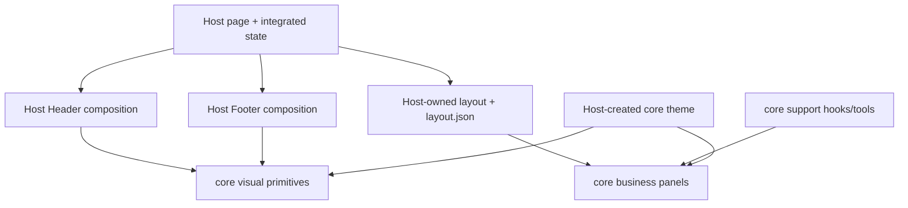

# BI Studio UI/UX — Iteration 6 embedding design

> **Status:** Issue #170 owner-reviewed design candidate, 2026-09-01. This English document is normative for the Iteration 6 Studio correction; [`bi-studio-ui-ux-design.zh-CN.md`](bi-studio-ui-ux-design.zh-CN.md) is its Chinese companion. It refines the host embedding and Trace rendering of [`bi-ui-design.md`](bi-ui-design.md) without changing Evidence, Evaluation, or Evolution authority.

## 1. Decision and scope

The Studio must present BI as an embedded product workspace, not as a list of raw `MetricPanel` receipts. The accepted page family has four coordinated views:

1. **Select** — a dedicated task-population page that enters the evaluation workspace without displacing a frozen Dashboard composition;
2. **Dashboard** — a bounded, user-adjustable composition of published Metric Results;
3. **Evidence** — the existing receipt and Fact verification path; and
4. **Recorded Trace** — one authoritative trace projection with Waterfall, Tree, and exact Statistics renderers.

The **Host-owned** first workspace row contains breadcrumbs, page title, evaluation context, local `Select / Dashboard / Evidence / Recorded Trace` navigation, and page actions. It is not a metric panel or a core component. Select places task discovery and the current selection in Main and has no Footer. Dashboard may add a Host-owned Trace-discovery Footer. Delivery remains a separate DSH product tab.

The workspace shown in the prototypes is a **Host composition**, not one reusable core component. `wsr-ui-core` is a collection of platform-neutral visual components, cohesive business components, and contract-related support hooks/tools. Every deployment package (`wsr-dsh`, `wsr-vscode`, and future `wsr-*` hosts) acts as an assembly factory plus a home for platform-specific product logic. It owns the page composition and must reuse core assets whenever an applicable public asset exists without breaking their encapsulation.

The design assets are:

| Asset | Decision represented |
|---|---|
| [`studio-page-family-impression.html`](assets/studio-page-family-impression.html) | accepted Select/Dashboard/Trace page-family composition and shared Host Header |
| [`studio-dashboard-layout-candidate.html`](assets/studio-dashboard-layout-candidate.html) | accepted responsive dashboard composition direction |
| [`studio-trace-waterfall-candidate.html`](assets/studio-trace-waterfall-candidate.html) | accepted default APM Waterfall direction |
| [`studio-trace-tree-candidate.html`](assets/studio-trace-tree-candidate.html) | accepted Trace Tree direction and interaction grammar |

These HTML files are semantic layout prototypes, not production source and not pixel-perfect visual baselines. Rejected experiments remain under `qualification/iter6/issue-170/studio-ui-ux/` as decision history and are not design authority.

## 2. Dashboard composition

The executable Iteration 6 registry remains deliberately bounded:

| Visualizer | Intended content | Default size |
|---|---|---|
| `numeric-card@1` | scalar, including an authoritative percentage/ratio display | SMALL |
| `badge@1` | closed status/category | SMALL |
| `ratio-bar@1` | bounded ratio with its authoritative domain | MEDIUM |
| `table@1` | lossless heterogeneous or series fallback | WIDE |

Unavailable results use a compact semantic state inside their assigned cell. They do not become full-width white receipts. Receipt and raw JSON are drill-down details rather than the dashboard's default visual language.

The layout grid is finite:

| Capacity | Columns | SMALL | MEDIUM | WIDE |
|---|---:|---:|---:|---:|
| Desktop | 12 | 3 | 6 | 12 |
| Tablet | 6 | 3 | 6 | 6 |
| Narrow | 1 | 1 | 1 | 1 |

Panel height is selected from bounded component variants; content must not establish arbitrary page height. The default overview favors compact scalar/status cards above medium comparisons and a wide table fallback. The dashboard must be adjustable: edit mode exposes add/remove, compatible visualizer choice, metric binding, finite resize, reorder, presets, reset, and save. Read mode remains flat at rest.

The deployment Host owns the concrete dashboard layout, its JSON, edit lifecycle, and persistence. It may implement the grid directly—for example with `react-grid-layout`—or consume a future generic core grid primitive. A core grid, if extracted, is an optional platform-neutral visual component: the Host still supplies layout data, panel instances, controls, and page state. The grid implementation is not part of Metric/Evidence authority and must not become a whole Dashboard page component.

Every placed panel remains a `wsr-ui-core` business component. Core owns its contract projection, compatible display rules, unavailable/partial semantics, internal interaction state, accessibility, and rendering. The Host supplies authoritative data, theme, placement, and typed action handlers; it does not reconstruct the panel model. Layout is local presentation state and never alters evaluation identity, receipt identity, or a Metric Result.

## 3. Recorded Trace model

Waterfall, Tree, and Statistics consume the same closed `wsr.trace-view@1` IR compiled from an authoritative Evidence Trace DTO. The compiler must preserve exact identifiers, parent edges, links, nanosecond timestamp strings, status, span kind, flags, trace state, and recorded fields. Duration calculations use lossless integer arithmetic; display rounding never mutates the underlying value.

The compiler validates rather than repairs. It may derive deterministic presentation values such as parent depth, relative start, duration, stable traversal order, and viewport geometry. It must not invent a parent, service boundary, critical path, event, causal explanation, or missing timestamp. Invalid or unsupported input produces an explicit state and retains the last valid preview while editing.

### 3.1 Waterfall

Waterfall is the default APM view. It combines a collapsible span outline with one shared horizontal time domain, duration bars, a minimap, exact focus, and a Span Passport. Parent-child nesting and independent `LINK` relationships remain distinguishable. Narrow screens open as a virtualizable span outline and reveal timeline/detail on demand.

### 3.2 Tree

Tree is a trace-following call tree, not an architecture or service topology diagram. The deterministic renderer lays out exact parent depth from left to right. Each node exposes span kind, status, start offset, duration, and a local micro-timeline. `PARENT_EDGE` is structural; `LINK` is visually independent and never changes depth.

Tree interactions are trace semantics rather than generic graph decoration: exact span focus, Span Passport, ancestors lens, descendants lens with an exact membership receipt, relationship pin, camera map, pan/zoom, and keyboard traversal. A narrow screen uses a semantic tree outline instead of shrinking an unreadable canvas.

### 3.3 Statistics and renderer extension

Statistics is a sibling Trace renderer, not a separate analysis product. It exposes only aggregates that are exactly derivable from the closed recorded IR, such as recorded span/link/error counts and maximum recorded duration. It must not claim a critical path, service map, inferred grouping, or causality.

The Host owns an ordered Trace-view registry and chooses the active renderer; each renderer remains a cohesive core business component. New renderers may be appended as peers without changing the page family or Trace identity. A future Flame Graph belongs after `Waterfall / Tree / Statistics` when authoritative span timing supports it, but it is not part of the Iteration 6 implementation.

## 4. Motion contract

Motion is finite and derived from recorded time. The Motion Governor may play, pause, restart, or scrub the trace interval; it highlights spans and edges according to exact recorded start/end values. Motion never means that a live request is executing and never assigns causality.

Playback has a bounded end state, preserves focus, and exposes equivalent static information. `prefers-reduced-motion` disables automatic spatial animation and provides direct state changes. Decorative infinite flow, simulated telemetry, and force-layout jitter are prohibited.

## 5. Reusable-asset and assembly boundary

### 5.1 Three kinds of `wsr-ui-core` assets

| Asset kind | Core responsibility | Examples |
|---|---|---|
| platform-neutral visual components | semantic structure and styling roles without interpreting a business status | `Surface`, `Section`, `Card`, disclosure, status-role rendering, theme provider |
| cohesive business components | one complete platform-independent business unit | `MetricPanel`, ratio/status panels, receipt/evidence content, `TraceWaterfall`, `TraceTree`, `TraceStatistics`, `SpanPassport` |
| support hooks/tools | contract validation/projection and reusable component logic | Metric Result → panel model, Evidence Trace → lossless IR, formatting, compatibility, finite motion and accessibility helpers |

Support hooks/tools are fetch-free, route-free, auth-free, and Host-free. They accept authoritative contract data and produce a deterministic model or bounded local component state. They may format or derive presentation values but never compute a Metric Result, invent Evidence, or repair missing Trace semantics.

Business components are internally cohesive. They accept authoritative contract data and normally invoke the relevant core hook/tool internally. They own business-state interpretation, rendering, accessibility, and local interactions. A Host must not construct or reproduce their internal view model before rendering them. A support hook may also be public when another reusable component or a Host control genuinely needs the same derived metadata, but it remains the sole implementation of that projection. Components expose public props, semantic variants, controlled values where cross-component coordination is required, and exact typed events. Visual primitives only render the semantic role chosen by a business component; they do not decide what a Metric or Trace state means.

### 5.2 The Host is the assembly factory

Each `wsr-*` platform owns:

- Header/Main/Footer regions, page title, contextual copy, button selection/order, navigation, control panels, and all page/application state;
- the concrete dashboard layout, panel placement/sizing/order, layout JSON, edit lifecycle, persistence, and platform-specific product behavior;
- gateway, network, auth, CSP, routing/deep links, loading/error recovery, drawer/inspector containers, and notification integration;
- creation of a core-compatible theme object from the platform's system light/dark state, then distribution through the core theme provider;
- composition of core visual primitives and business components through their public API.

Header and Footer may use core `Surface`, `Section`, `Card`, or other semantic visual primitives for a consistent language. Their content, actions, button layout, and lifecycle remain Host-defined. Likewise, a Host layout may use a core generic grid primitive, but the Host still owns what is placed in it and how the page behaves.



### 5.3 State ownership

| State layer | Owner | Examples |
|---|---|---|
| authoritative data | Evolution / Evidence | Metric Results, receipts, Facts, recorded Trace identities and timestamps |
| component-local state | `wsr-ui-core` component/hook | disclosure, hover, transient focus, table state, deterministic Trace camera/lens/playback |
| layout/integration state | each `wsr-*` Host | panel instances, positions/sizes, layout edit draft, cross-component coordination, theme object |
| page/application state | each `wsr-*` Host | title, active view, selection/compare, route/deep link, loading/error, drawer/inspector lifecycle |

When a component interaction affects integration or canonical page identity, core emits an exact typed event and the Host decides how to update its state. For example, core emits `onFocusSpan({ traceId, spanId })`; the Host updates or preserves the URL and passes controlled focus back when needed. Core never stores the route, task selection, compare side, or canonical span selection.

### 5.4 Encapsulation contract

A platform must reuse an applicable core asset and must not break its encapsulation. Specifically, it must not:

- deep-import private modules or rely on undocumented DOM/class names;
- copy core source, styles, contract projection, renderer geometry, or component-local state logic;
- use selector-based CSS penetration to restyle component internals;
- replace core semantic status/a11y behavior with a platform-local interpretation;
- make a core hook fetch data or depend on a platform gateway, route, auth object, or global singleton.

Customization crosses only documented props, slots, exact events, semantic variants, and the theme contract. If a valid platform need cannot be expressed through those ports, the remedy is a reviewed core extension or a Host wrapper around the public component—not a private fork.

## 6. Integration ports

The public boundary is reusable assets plus exact events—not a complete page:

```text
Evolution MetricResultSet
  -> DSH gateway/adapter
  -> wsr-ui-core business Panel receives authoritative data
  -> Panel invokes core contract hook/tool internally
  -> Host layout + Header/Footer/control composition
  -> exact event -> Host integration/page transition

Evidence Trace DTO
  -> DSH gateway/adapter
  -> wsr-ui-core compileTraceView
  -> Host chooses page view and Waterfall | Tree | Statistics renderer
  -> wsr-ui-core TraceWaterfall | TraceTree | TraceStatistics data surface
  -> onFocusSpan / onOpenEvidence / onNavigateTrace
  -> Host page/route transition
```

The Host supplies authoritative data, component props, container dimensions, and an explicit core-compatible theme. `wsr-ui-core` returns no URL and performs no external side effect; event payloads contain exact identities that the Host serializes using its route contract. The Host owns renderer choice when it changes page/control composition. Core owns transient camera, collapse, lens, and playback inside the selected renderer. None of those values is Evidence or evaluation identity.

## 7. Implementation sequence and gates

1. **Shared package RED:** tests prove required visual/business/support assets or lossless Trace projection are absent; boundary tests reject page title/control/layout policy/routes in core and reject Host dependencies, fetch, deep imports, global CSS, or undocumented singleton state.
2. **Shared package GREEN:** add cohesive Panels, Trace renderers, contract hooks/tools, exact events, semantic primitives/theme contract, responsive behavior, motion, accessibility, and public exports. Build and pack a local artifact.
3. **Host RED:** DSH tests reject JSON-first rendering, implicit theme, missing Host-owned adjustment controls/Trace entry, source-path or CSS penetration, duplicated contract projection, and accidental delegation of page/layout state to core.
4. **Host GREEN:** consume only the local packed artifact; create and distribute the Host theme; compose Host title/control/layout/navigation around core components; wire data/events/routes/persistence; and remove duplicate panel/Trace/data-processing implementations.
5. **Cross-runtime qualification:** `deployment/accept-current-branch.sh` builds and installs local package artifacts in its isolated environment, then verifies Desktop/Tablet/Narrow, light/dark, keyboard/reduced-motion, Select/Dashboard/Evidence/Trace navigation, Waterfall/Tree/Statistics, deep-link/reload, partial/outage, and absence of adjacent-source access.

`wsr-ui-core` gates include unit/property tests for codecs and geometry, component/browser tests, accessibility tests, responsive/theme screenshots, and bounded renderer benchmarks. `wsr-dsh` gates include adapter contract tests, package provenance, route/recovery tests, real-host browser tests, and local-artifact E2E. A remote prerelease can be published only after the same local artifact passes qualification.

## 8. Deferred work

Trace Flame Graph, service maps, critical-path analysis, inferred grouping, arbitrary chart plugins, remote dashboard persistence, collaboration, and alerting remain deferred. They require separate authority and cannot be inferred by the Iteration 6 renderer.
