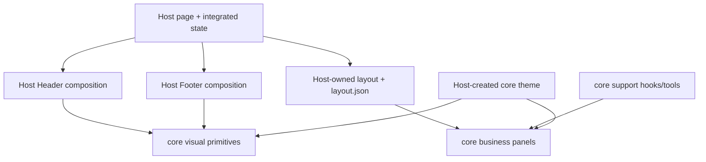

# BI Studio UI/UX — Iteration 6 嵌入设计（中文 companion）

> **状态：** Issue #170 owner 已评审的设计候选，2026-09-01。英文 [`bi-studio-ui-ux-design.md`](bi-studio-ui-ux-design.md) 是 Iteration 6 Studio 修正的规范文本，本文是中文 companion。它细化 [`bi-ui-design.md`](bi-ui-design.md) 的 Host 嵌入与 Trace 渲染，不改变 Evidence、Evaluation 或 Evolution authority。

## 1. 决策与范围

Studio 必须把 BI 呈现为一个嵌入式产品工作区，而不是一列原始 `MetricPanel` 回执。已认可页面族包含四个协同视图：

1. **Select**：独立的 Task population 选择页，选择后进入 evaluation workspace，不侵占已冻结的 Dashboard composition；
2. **Dashboard**：由 published Metric Results 组成、用户可有限调整的仪表盘；
3. **Evidence**：既有 receipt 与 Fact 核验路径；
4. **Recorded Trace**：同一权威 Trace projection 的 Waterfall、Tree 与 exact Statistics renderer。

**Host-owned** 的工作区第一 row 包含 breadcrumbs、页面标题、evaluation context、`Select / Dashboard / Evidence / Recorded Trace` 内部导航与页面 actions；它既不是 metric panel，也不是 core component。Select 只在 Main 中放 Task discovery 和 current selection，不设 Footer；Dashboard 可以增加 Host-owned Trace discovery Footer。Delivery 仍是独立的 DSH 产品页签。

样式图中的整个 workspace 是 **Host composition**，不是一个可复用 core component。`wsr-ui-core` 是平台无关视觉组件、内聚业务组件，以及契约相关 support hooks/tools 的集合。每个部署平台（`wsr-dsh`、`wsr-vscode` 及未来 `wsr-*`）都是 assembly factory 加 platform-specific product logic 的承载处；它拥有页面组合，并且只要 core 已有适用 public asset，就必须在不破坏封装的前提下复用。

| 资产 | 表达的决策 |
|---|---|
| [`studio-page-family-impression.html`](assets/studio-page-family-impression.html) | 已认可的 Select/Dashboard/Trace 页面族组合与统一 Host Header |
| [`studio-dashboard-layout-candidate.html`](assets/studio-dashboard-layout-candidate.html) | 已认可的响应式 Dashboard composition 方向 |
| [`studio-trace-waterfall-candidate.html`](assets/studio-trace-waterfall-candidate.html) | 已认可的默认 APM Waterfall 方向 |
| [`studio-trace-tree-candidate.html`](assets/studio-trace-tree-candidate.html) | 已认可的 Trace Tree 方向与交互语法 |

这些 HTML 是语义化布局原型，不是 production source，也不是 pixel-perfect visual baseline。被否决的探索稿保留在 `qualification/iter6/issue-170/studio-ui-ux/` 作为决策历史，不构成设计 authority。

## 2. Dashboard composition

Iteration 6 的可执行 registry 保持有界：

| Visualizer | 内容 | 默认尺寸 |
|---|---|---|
| `numeric-card@1` | scalar，包括权威 percentage/ratio 显示 | SMALL |
| `badge@1` | closed status/category | SMALL |
| `ratio-bar@1` | 带权威 domain 的 bounded ratio | MEDIUM |
| `table@1` | 异构结果或 series 的无损 fallback | WIDE |

UNAVAILABLE 在所属 cell 内紧凑表达语义状态，不再变成整行白色回执。Receipt 与 raw JSON 是下钻详情，不是 Dashboard 的默认视觉语言。

| Capacity | Columns | SMALL | MEDIUM | WIDE |
|---|---:|---:|---:|---:|
| Desktop | 12 | 3 | 6 | 12 |
| Tablet | 6 | 3 | 6 | 6 |
| Narrow | 1 | 1 | 1 | 1 |

Panel height 只能从有限 component variant 中选择，内容不得任意撑高页面。默认 overview 把紧凑 scalar/status cards 放在上部，其后是 medium comparison 与 wide table fallback。Dashboard 必须可调整：Edit mode 提供增删 panel、compatible visualizer、metric binding、有限 resize、reorder、preset、reset 与 save；read mode 保持 flat-at-rest。

具体 Dashboard layout、layout JSON、edit lifecycle 与 persistence 属于部署 Host。Host 可以直接使用例如 `react-grid-layout` 实现，也可以消费未来抽取出的通用 core grid primitive。即使 grid 被抽入 core，它也只是 optional platform-neutral visual component；Host 仍提供 layout data、panel instances、controls 与 page state。Grid implementation 不属于 Metric/Evidence authority，也不得膨胀成整张 Dashboard page component。

被放置的每一个 panel 始终是 `wsr-ui-core` business component。Core 拥有 contract projection、compatible display rules、unavailable/partial semantics、内部 interaction state、a11y 与 rendering；Host 只提供 authoritative data、theme、placement 与 typed action handlers，不重建 panel model。Layout 是本地 presentation state，不改变 evaluation identity、receipt identity 或 Metric Result。

## 3. Recorded Trace 模型

Waterfall、Tree 与 Statistics 消费同一个由权威 Evidence Trace DTO 编译的 closed `wsr.trace-view@1` IR。Compiler 必须保留 exact identifiers、parent edges、links、nanosecond timestamp strings、status、span kind、flags、trace state 与 recorded fields。Duration 使用无损整数运算；显示 rounding 不改变底层值。

Compiler 只校验、不修复。它可以确定性派生 parent depth、relative start、duration、stable traversal order 与 viewport geometry；不得虚构 parent、service boundary、critical path、event、causal explanation 或缺失 timestamp。Invalid/unsupported input 显式报错；编辑时保留 last valid preview。

### 3.1 Waterfall

Waterfall 是默认 APM view：可折叠 span outline 与共享 horizontal time domain、duration bars、minimap、exact focus 和 Span Passport 组成一体。Parent-child nesting 与独立 `LINK` 必须可区分。窄屏默认打开可虚拟化 outline，需要时再展开 timeline/detail。

### 3.2 Tree

Tree 是沿 Trace 跟踪的 call tree，不是 architecture/service topology diagram。确定性 renderer 按 exact parent depth 从左向右布局；node 展示 span kind、status、start offset、duration 与 local micro-timeline。`PARENT_EDGE` 决定结构，`LINK` 独立展示且绝不改变 depth。

Tree 的交互表达 Trace 语义：exact span focus、Span Passport、ancestors lens、带 exact membership receipt 的 descendants lens、relationship pin、camera map、pan/zoom 与 keyboard traversal。窄屏使用 semantic tree outline，不把不可读的 canvas 强行缩小。

### 3.3 Statistics 与 renderer 扩展

Statistics 是同级 Trace renderer，不是独立分析产品。它只展示能从 closed recorded IR 精确派生的聚合，例如 recorded span/link/error 数量和 maximum recorded duration；不得声称 critical path、service map、inferred grouping 或 causality。

Host 拥有有序 Trace-view registry 并选择 active renderer；每个 renderer 仍是内聚的 core business component。新 renderer 可以作为同级项追加，不改变页面族或 Trace identity。未来 Flame Graph 在权威 span timing 足够时位于 `Waterfall / Tree / Statistics` 之后，但不属于 Iteration 6 当前实现。

## 4. Motion contract

Motion 有限且由 recorded time 派生。Motion Governor 可以 play、pause、restart、scrub trace interval，并按 exact recorded start/end 高亮 span 与 edge。Motion 不表示 live request 正在执行，也不赋予因果关系。

Playback 必须有确定结束状态、保留 focus，并提供等价 static information。`prefers-reduced-motion` 关闭自动空间动画，使用直接状态变化。禁止 decorative infinite flow、simulated telemetry 与 force-layout jitter。

## 5. 可复用资产与装配边界

### 5.1 `wsr-ui-core` 的三类资产

| Asset kind | Core 职责 | 示例 |
|---|---|---|
| platform-neutral visual components | 不解释 business status 的 semantic structure 与 styling roles | `Surface`、`Section`、`Card`、disclosure、status-role rendering、theme provider |
| cohesive business components | 一个完整、平台无关的业务单元 | `MetricPanel`、ratio/status panels、receipt/evidence content、`TraceWaterfall`、`TraceTree`、`TraceStatistics`、`SpanPassport` |
| support hooks/tools | contract validation/projection 与可复用 component logic | Metric Result → panel model、Evidence Trace → lossless IR、formatting、compatibility、finite motion/a11y helpers |

Support hooks/tools 必须 fetch-free、route-free、auth-free、Host-free。它们接收 authoritative contract data，产生 deterministic model 或有界 component-local state；可以格式化或派生 presentation values，但不得计算 Metric Result、虚构 Evidence 或修复缺失 Trace semantics。

Business component 必须内部内聚，直接接收 authoritative contract data，并通常在内部调用对应 core hook/tool。它拥有 business-state interpretation、rendering、a11y 与 local interactions；Host 不得在 render 前构造或复制其内部 view model。如果其他 reusable component 或 Host control 确实需要相同 derived metadata，support hook 可以公开，但该 hook 仍是 projection 的唯一实现。Component 只通过 public props、semantic variants、必要的 controlled values 与 exact typed events 对外协作。Visual primitive 只渲染 business component 选定的 semantic role，不决定 Metric/Trace state 的业务含义。

### 5.2 Host 是 assembly factory

每个 `wsr-*` 平台负责：

- Header/Main/Footer regions、page title、contextual copy、按钮选择/顺序、navigation、control panels 与全部 page/application state；
- 具体 Dashboard layout、panel placement/sizing/order、layout JSON、edit lifecycle、persistence 与平台定制产品逻辑；
- gateway、network、auth、CSP、routing/deep links、loading/error recovery、drawer/inspector containers 与 notification integration；
- 从平台 system light/dark state 创建 core-compatible theme object，并通过 core theme provider 分发；
- 只经 public API 组合 core visual primitives 与 business components。

Header/Footer 可以使用 core `Surface`、`Section`、`Card` 等 semantic visual primitives 保持统一语言，但其中的 content、actions、button layout 与 lifecycle 仍由 Host 定义。同样，Host layout 可以使用 core generic grid primitive，但放什么、如何装配、页面怎样运行仍属于 Host。



### 5.3 State ownership

| State layer | Owner | 示例 |
|---|---|---|
| authoritative data | Evolution / Evidence | Metric Results、receipts、Facts、recorded Trace identities/timestamps |
| component-local state | `wsr-ui-core` component/hook | disclosure、hover、transient focus、table state、deterministic Trace camera/lens/playback |
| layout/integration state | 每个 `wsr-*` Host | panel instances、positions/sizes、layout edit draft、cross-component coordination、theme object |
| page/application state | 每个 `wsr-*` Host | title、active view、selection/compare、route/deep link、loading/error、drawer/inspector lifecycle |

当 component interaction 影响 integration 或 canonical page identity 时，core 发出 exact typed event，由 Host 决定如何更新。例如 core 发出 `onFocusSpan({ traceId, spanId })`；Host 更新或保留 URL，需要时再把 controlled focus 传回。Core 绝不存储 route、task selection、compare side 或 canonical span selection。

### 5.4 Encapsulation contract

平台必须复用适用 core asset，且不得破坏其封装。具体禁止：

- deep-import private module，或依赖 undocumented DOM/class name；
- 复制 core source、styles、contract projection、renderer geometry 或 component-local state logic；
- 使用 selector-based CSS penetration 修改 component internal；
- 用平台本地解释替换 core semantic status/a11y behavior；
- 让 core hook fetch 数据，或依赖 platform gateway、route、auth object、global singleton。

Customization 只能通过 documented props、slots、exact events、semantic variants 与 theme contract。若合理平台需求无法由这些 port 表达，应评审扩展 core，或在 public component 外包一层 Host wrapper，而不是建立 private fork。

## 6. Integration ports

Public boundary 是 reusable assets 与 exact events，不是完整页面：

```text
Evolution MetricResultSet
  -> DSH gateway/adapter
  -> wsr-ui-core business Panel 接收 authoritative data
  -> Panel 内部调用 core contract hook/tool
  -> Host layout + Header/Footer/control composition
  -> exact event -> Host integration/page transition

Evidence Trace DTO
  -> DSH gateway/adapter
  -> wsr-ui-core compileTraceView
  -> Host 选择 page view 与 Waterfall | Tree | Statistics renderer
  -> wsr-ui-core TraceWaterfall | TraceTree | TraceStatistics data surface
  -> onFocusSpan / onOpenEvidence / onNavigateTrace
  -> Host page/route transition
```

Host 提供 authoritative data、component props、container dimensions 与 explicit core-compatible theme。`wsr-ui-core` 不返回 URL、不执行 external side effect；event 携带 exact identity，由 Host 按自己的 route contract 序列化。Renderer choice 若改变 page/control composition 就属于 Host；core 拥有所选 renderer 内 transient camera、collapse、lens 与 playback。它们都不是 Evidence/evaluation identity。

## 7. 实现顺序与 gates

1. **Shared package RED**：证明所需 visual/business/support assets 或 lossless Trace projection 缺失；boundary tests 拒绝 core 拥有 page title/control/layout policy/routes，并拒绝 Host dependency、fetch、deep import、global CSS 或 undocumented singleton state。
2. **Shared package GREEN**：加入 cohesive Panels、Trace renderers、contract hooks/tools、exact events、semantic primitives/theme contract、responsive、motion、a11y 与 public exports，构建本地 artifact。
3. **Host RED**：拒绝 JSON-first、implicit theme、Host-owned 调整 controls/Trace 入口缺失、source-path/CSS penetration、duplicated contract projection，以及把 page/layout state 错放到 core。
4. **Host GREEN**：只消费本地 packed artifact；创建并分发 Host theme；在 core components 外组合 Host title/control/layout/navigation；连接 data/events/routes/persistence；删除重复 panel/Trace/data-processing implementation。
5. **Cross-runtime qualification**：`deployment/accept-current-branch.sh` 在隔离环境构建并安装本地产物，验证 Desktop/Tablet/Narrow、light/dark、keyboard/reduced-motion、Select/Dashboard/Evidence/Trace navigation、Waterfall/Tree/Statistics、deep-link/reload、partial/outage 与无 adjacent-source access。

`wsr-ui-core` gate 包括 codec/geometry unit/property、component/browser、a11y、responsive/theme screenshot 与 bounded renderer benchmark；`wsr-dsh` gate 包括 adapter contract、package provenance、route/recovery、real-host browser 与 local-artifact E2E。只有同一本地产物通过 qualification 后，才能发布 remote prerelease。

## 8. 延后范围

Trace Flame Graph、service map、critical-path analysis、inferred grouping、arbitrary chart plugin、remote dashboard persistence、collaboration 与 alerting 均延后。它们需要单独 authority，Iteration 6 renderer 不得推断实现。
