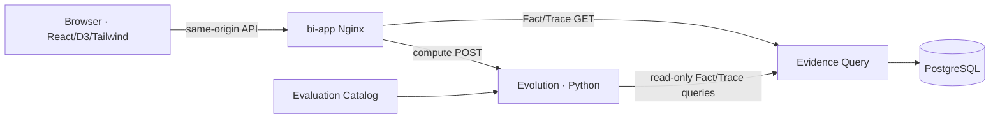

# BI System — Iteration 5 Candidate

> **Status:** Wave3 rebaseline candidate, 2026-08-28. English is normative for this candidate; Chinese tracking companion: [`bi-system.zh-CN.md`](bi-system.zh-CN.md). The former G1 browser evaluator, BI-local manifest, and fixed `/factual`/`/trace` design are superseded inputs and are not authority. This document does not authorize Wave4 implementation.

## 1. Purpose and authority

BI is the presentation surface for Evolution Metric Results and the read-only drill-down surface for Evidence Facts and recorded Traces.

| Concern | Authority |
|---|---|
| Facts and recorded Traces | Evidence |
| Metric concepts/formulas/readings | Evaluation Catalog |
| 12 candidate Metric Results, coverage, compatibility, compare Delta | Evolution |
| Selection, layout, visualization, interaction, accessibility | BI |

BI submits population-oriented `EvaluationSelection`; it does not select a metric implementation. For every successfully resolved side, Evolution returns a `ResolvedEvaluationContext` receipt and exactly 12 review-candidate `MetricResult` entries. BI may directly query Evidence for receipt/result-linked Fact and Trace detail, but it never calculates a metric, creates a Fact, writes a Result, accesses PostgreSQL, or reconstructs expired detail.

Detailed authority and API design: [`../evolution/evolution-system.md`](../evolution/evolution-system.md). Twelve-calculator candidate matrix: [`../evolution/metric-computability.md`](../evolution/metric-computability.md). Detailed UI contract: [`bi-ui-design.md`](bi-ui-design.md).

## 2. Runtime boundary

- The UI remains a Vite-built TypeScript/React SPA with D3.js and Tailwind semantic bindings.
- Nginx serves committed `dist` and same-origin proxies only approved Evolution compute and Evidence read routes. It contains no formula, state store, or database client.
- Evolution is the only Python metric runtime. The browser contains no TypeScript evaluator or BI-local evaluation-context manifest.
- Evidence and Evolution remain private upstreams in the deployment topology. Default host exposure remains `127.0.0.1`; public access controls are a user-owned deployment decision.
- No `workflow-builder`, AI attribution, Workflow mutation/calibration, revision application, or meta-recursive loop is present in Iter5.

## 3. Selection and Task discovery

An `EvaluationSelection` identifies a bounded set of exact `task_ids`; it is not a metric set, Delivery guess, display-name lookup, or Workflow selection. Users explicitly choose new versus reused Task at Delivery creation; new is default. Evidence exposes accepted Task declaration/membership plus a bounded Task-list query.

Task discovery returns stable `task_id` and optional human-readable `display_name`. BI shows the name when non-blank and otherwise falls back to ID. Names may duplicate or change, so requests, URL state, equality, receipts, and membership use only IDs; duplicate names display secondary IDs.

## 4. Query and stability model

Observation/Evidence provide eventual final stability. During reporting, re-running an unresolved selection may see additional accepted records. While no new Observation or Task membership is accepted and required data has not entered retention expiry, a settled selection remains stable. Each Evidence route traversal obeys its own published cursor/snapshot consistency; Evolution completes those traversals and binds the exact resolved read set in the response receipt. There is no cross-Fact/Trace transaction snapshot, prebuilt manifest, expected-context digest, or new stability Oracle.

Retention and expiry are explicit lifecycle changes. A settled active result remains repeatable until its required evidence expires; expiry then produces the applicable typed Result state rather than reconstructing old data.

## 5. Presentation boundary

BI may perform presentation-only layout, scale, explicit binning, ratio-to-percent display, rounding, and geometry. Any number that could be read as a metric fact or Delta must come from Evolution. Missing values remain gaps; incompatible unit/currency coordinates never combine; positive/negative does not imply good/bad.

The application uses the `/evaluate` route family, single by default and same-workspace compare on explicit left/right selections. Fact/Trace screens are drill-downs that preserve origin selection, side, metric, focus, and return path. URL selection is the restoration authority; LocalStorage holds convenience preferences/layout only.

## 6. Engineering baseline and superseded boundary

Reusable Wave2 foundations are React, D3.js, Tailwind CSS, TypeScript, Vite, semantic tokens, preview/unit/browser test harnesses, and Docker/Nginx source-build infrastructure.

Superseded and forbidden as current authority:

- browser-side metric formulas or TypeScript evaluator;
- BI-local `evaluation-context.json`/read-only manifest;
- fixed `/factual` and `/trace` top-level IA;
- a single Evidence-only upstream topology;
- old component names used without the responsibility split in `bi-ui-design.md`;
- old style frames that label the product or Metric Results as “WSR Evidence.”

No product code, published Contract, Issue, Project, or implementation plan is changed by this candidate.
