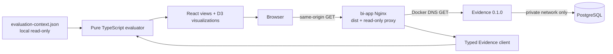
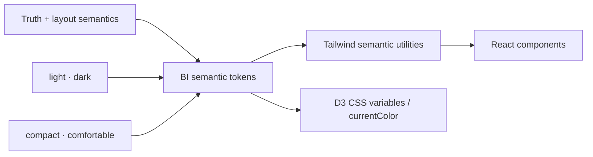
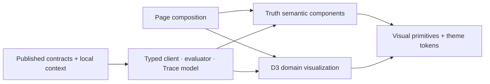

# BI System — Iteration 5 Consumer and UI Design

> **Status:** G1 review candidate, 2026-08-27. English is normative; the Chinese tracking companion is [`bi-system.zh-CN.md`](bi-system.zh-CN.md). This design consumes published contracts and does not amend them.

## 1. Authority and fixed coordinates

The BI system is a presentation consumer. It owns neither Observation facts nor Metric formulas.

| Coordinate | Exact input |
|---|---|
| Evaluation | `agentops.evaluation.metric-catalog@1.0.0`, semantic digest `sha256:6dbb4375507a3a2eebbe5e86bb6f0a40ebf811790f55ee841b15c6942e1f159d` |
| Evidence Query | `evidence.query@0.1.0`, read model `1.0.0`, Observation Profile `1.0.0` |
| Query publication | `sha256:feb0186da48661d2663b03d20e536f470b591ea22f21a34a4ca99bfcc33204e9` |
| Evaluation publication | `sha256:1967dd9625b572ff6411edc19533cd32144cdedf3e526cb8460f39f688cf5014` |
| Presentation stack | TypeScript throughout, React TSX SPA, Vite build, browser-only TypeScript evaluator, D3.js visualizations, Tailwind CSS styling |

Authority order is: owner-confirmed product intent; published Metric Catalog for formulas and readings; published Observation Catalog/Profile for fact meaning; Evidence Query for read representation, truth, expiry, compatibility and pagination; this document for BI-local input, presentation and bounded client behavior. An ambiguity is unavailable, never an invitation to infer.

## 2. System boundary



- `bi-app` runtime is Nginx plus committed `dist` and Nginx configuration. There is no Node or other business server.
- All BI application, domain, test and build-configuration source is TypeScript/TSX. Vite is the only application dev/build entry and produces `dist`; no parallel JavaScript product-source path or alternate bundler exists.
- The browser only calls same-origin `/v1/evidence/facts` and `/v1/evidence/traces` through Nginx.
- Nginx proxies only those GET paths. It computes no metric, holds no state and has no database client.
- PostgreSQL is reachable only by Evidence. Evidence is reachable only on the private Compose network. Only Nginx publishes a host port, bound by default to `127.0.0.1`.
- No application authentication or RBAC is invented for MVP. Remote/public access is a user-owned override with user-owned TLS, authentication, firewall and risk.
- `workflow-builder` and `intake-sidebar` have no package, route, component, image or job in Iter5.

## 3. Consumer contract

### 3.1 Requests

| Route | BI use | Filters and bounds |
|---|---|---|
| `GET /v1/evidence/facts` | factual inputs, provenance, compatibility and relationships | exact supported filters; initial `limit=100`; user may choose up to `200` |
| `GET /v1/evidence/traces` | one exact Trace or Delivery traversal | exactly one of `trace_id` or `delivery_id`; initial `limit=100`; Delivery traversal remains at most 32 Traces |

Requests send `Accept: application/json`, no body and no credential. Filter values are exact identities, never display aliases. The client does not call Raw, write, SQL or internal Projection routes.

### 3.2 Response acceptance

One decoder validates the entire closed response before exposing any item. It requires exactly:

- `contract={name:"evidence.query",revision:"0.1.0"}`;
- `observation_profile="1.0.0"` and `read_model_revision="1.0.0"`;
- all required fields, closed enums, scalar bounds and cross-field truth rules;
- no unknown field at any level;
- stable snapshot/cursor semantics and at most the requested item count.

An unknown field, later/unknown revision or invalid truth tuple rejects the whole response as typed `INCOMPATIBLE`. Raw rejected bytes are not retained and no partial item reaches React or D3.

### 3.3 Bounded transport

- Per-request timeout: 5 seconds.
- Maximum response body accepted by the browser client: 4 MiB; overflow becomes `RESPONSE_BOUND_EXCEEDED` and no partial body is decoded.
- No automatic page crawl. A user explicitly loads each next page.
- Maximum eight pages per traversal. At the bound, the UI asks for a narrower filter or a new traversal; it never labels a prefix complete.
- A continuation repeats the exact normalized filters and limit. Cursor mismatch/expiry never restarts at current state automatically.
- A successful empty Fact response is `ABSENT`; an absent Trace is the contract's `trace_state=ABSENT`. HTTP/query failures are never absence.

### 3.4 Error disposition

| Upstream result | BI result |
|---|---|
| `INVALID_FILTER`, `INVALID_CURSOR`, `CURSOR_MISMATCH` | typed request error with correction action |
| `CURSOR_EXPIRED` | mark traversal expired; offer explicit fresh traversal |
| `QUERY_BOUND_EXCEEDED` | bounded result unavailable; require narrower scope |
| `QUERY_UNAVAILABLE`, timeout, network refusal | `ERROR`; retain only visibly stale prior typed result, never substitute it as current |
| `QUERY_INTERNAL` or malformed body | `ERROR`; bounded diagnostic only |
| unknown revision/field/tuple | `INCOMPATIBLE`; render no response items |

## 4. BI-local evaluation context

Four catalog readings need Evaluation-owned membership or event-time assignment. The browser receives a local read-only manifest with media type `application/json` and schema identity `wsr.bi.evaluation-context@1.0.0`.

The closed manifest contains:

```text
schema, context_id, context_version, content_digest,
catalog_coordinate, catalog_semantic_digest, as_of,
tasks[] = { task_id, delivery_ids[], cohort_coordinates[],
            event_time_role_template? = {id, version, digest} }
```

Rules:

- `content_digest` is SHA-256 over RFC 8785 canonical JSON after removing only `content_digest`.
- Catalog coordinate and digest must equal §1. Unknown fields or duplicate task/Delivery identity fail closed.
- `as_of` is an exact UTC cutoff. Membership and assignment are immutable for that manifest version.
- Cohort coordinates are closed key/scalar pairs and compared by exact scalar type and value.
- The manifest declares membership and event-time assignment only. It does not copy an Observation fact or assert a terminal outcome.
- The evaluator derives the unique terminal-task outcome from exact member Delivery terminal facts at `as_of`, following Metric Catalog §6.2. Open, mixed or missing members produce the catalog exclusion reason.
- No alias, recency lookup, ambient discovery, later backfill or “latest template” fallback exists.
- Missing/invalid manifest makes only manifest-dependent metrics unavailable; it does not invalidate independent factual or Trace viewing.

This is a BI-local input contract owned by the BI deployment operator. It is not a cross-system contract and is never sent to or stored by Evidence.

## 5. Presentation semantics

### 5.1 State vocabulary

| UI state | Meaning | Value treatment |
|---|---|---|
| `LOADING` | current request has no accepted response yet | skeleton, never a previous value presented as current |
| `AVAILABLE` | compatible active value exists | show exact value and truth coordinates |
| `LOWER_BOUND` | owner recorded a lower bound | show `≥` and “not final total” |
| `NOT_APPLICABLE` | applicable owner explicitly reported N/A | show N/A and owner reason |
| `UNAVAILABLE` | required value/detail is unavailable | em dash plus missing-input reason, never zero |
| `EXPIRED` | identity/provenance retained, detail removed | show expired identity and unavailable detail |
| `INCOMPATIBLE` | tuple/revision/field cannot be consumed | reject whole response; show expected and received coordinates |
| `ERROR` | request/transport/service failed | show typed error and retry; do not recast as truth |

Explicit numeric zero uses the normal value typography plus an “explicit recorded zero” accessible label. Absence uses an em dash. Color is redundant: every state has text and an icon/shape.

Coverage always shows numerator, denominator, raw ratio, state and alert. Minimum-sample failure withholds only the metric value while keeping coverage visible. No total score, rank, recommendation, hidden weighting, implicit conversion or causal copy is permitted.

### 5.2 Factual semantic inventory

Priority order is: selected metric/revision; value state; exact coordinate/filter window; numerator/denominator and coverage; unit/source/cost basis; compatibility; provenance; uncertainty and forbidden reading; item table.

User operations are exact filter selection, metric selection, table/chart switch, inspect provenance, load next page, retry and start a fresh traversal. Charts and tables share one evaluator result; views contain no formula.

The chart encodes recorded value against the declared display window. It may connect comparable points for legibility but labels the series descriptive only, breaks at incompatible/unavailable points and never draws causal arrows. Tables remain the exact-value and keyboard fallback.

### 5.3 Trace semantic inventory

The Trace page accepts an exact Trace or Delivery identity, shows response and per-Trace states, recorded `NODE`, `PARENT_EDGE` and `LINK` items, item truth/expiry, recorded detail and provenance, pagination and refresh/error state.

- Only API item identity creates graph items.
- `PARENT_EDGE` is solid cyan; `LINK` is dashed amber. Their accessible names include the recorded kind.
- An endpoint absent from observed NODE items is a diamond “endpoint not observed,” not a fabricated NODE.
- Duplicate identity collapses only when the contract decoder accepts identical detail; conflict rejects the response.
- Layout uses kind plus a stable hash of exact item identity as a deterministic seed. Time, name, task grouping and list position never create or choose an edge.
- Time appears only in the detail panel. Visual proximity is explicitly non-causal.
- `PARTIAL` and `EXPIRED` show contract summaries and omit expired detail without reconstruction. `EXPIRED` is never rendered as `ABSENT`.

## 6. Visual direction and layout

The style direction is a calm, data-dense local observability console with equal dark and light themes. Dark uses a charcoal canvas, slate panels and off-white text. Light uses a cool off-white canvas, white panels and deep slate text. Both use cyan/teal for recorded/available state, amber for partial/lower-bound state and muted red for error/expired state. They avoid neon, glass effects, giant KPI tiles, traffic-light-only meaning and trading-dashboard language.

The initial theme follows `prefers-color-scheme`. A header control switches `light`, `dark` or `system`; the explicit choice is BI-local browser preference only and may be stored in `localStorage`. Theme changes alter tokens, never semantic state, data, geometry order or accessible labels. Both themes must independently meet WCAG 2.2 AA.

Tailwind is a semantic binding layer, not a palette pasted into components. BI defines CSS custom properties and maps Tailwind theme utilities to stable roles:

| Token family | Stable roles | Adjustable mapping |
|---|---|---|
| surface | `canvas`, `panel`, `raised`, `subtle`, `selected` | light/dark color values |
| content | `primary`, `secondary`, `muted`, `inverse`, `link` | theme contrast values |
| state | `available`, `partial`, `unavailable`, `expired`, `error`, `focus` | redundant color/icon/border treatment |
| border | `default`, `strong`, `focus` | theme contrast and width |
| space | `page`, `section`, `panel`, `control`, `cluster`, `grid-gap` | compact/comfortable rhythm |
| shape/type | panel/control radii; display/title/body/label/mono roles | global shape and typography rhythm |

React components use semantic bindings such as `bg-surface-panel`, `text-content-primary`, `text-state-partial`, `p-space-panel` and `gap-space-cluster`; raw palette numbers, arbitrary spacing and inline style values are forbidden outside token definitions and D3 geometry. `data-theme` and `data-density` select token maps. D3 uses CSS variables/current color from the same state tokens, so canvas and DOM never drift. A token-boundary lint/test permits raw values only in the theme source, proves every semantic token exists in both themes/densities and checks representative contrast. Layout changes adjust `space`/container mappings or page composition, not truth components.



Style frames:

- Factual dashboard: [dark](assets/style-frame-factual.svg) / [light](assets/style-frame-factual-light.svg)
- Recorded Trace: [dark](assets/style-frame-trace.svg) / [light](assets/style-frame-trace-light.svg)
- Unavailable and partial states: [dark](assets/style-frame-truth-states.svg) / [light](assets/style-frame-truth-states-light.svg)

Desktop uses a 12-column grid: shared header/filter context, primary chart/graph, right inspection rail and semantic table. Below 768 px, regions become a single ordered column: context, state/value, visualization, provenance/detail and table/actions. No content is hidden; charts horizontally scroll only after their tabular alternative.

Wireframes:

```mermaid
flowchart TB
    subgraph factual["Factual page"]
        f1["Header · routes · theme"] --> f2["Exact filters"]
        f2 --> f3["Value + D3 trend"]
        f2 --> f4["Reading + provenance"]
        f3 --> f5["Semantic table"]
        f4 --> f5
    end
    subgraph trace["Trace page"]
        t1["Header · routes · theme"] --> t2["Exact identity + snapshot"]
        t2 --> t3["Recorded D3 graph"]
        t2 --> t4["Item detail"]
        t3 --> t5["Trace summaries + pager"]
        t4 --> t5
    end
    subgraph empty["Empty / error / partial"]
        e1["Retained context"] --> e2["Typed state + reason"] --> e3["Next action"] --> e4["Last provenance · visibly stale when applicable"]
    end
```



## 7. Component map

| Layer | Components | Boundary |
|---|---|---|
| page composition | `BiShell`, `FactualPage`, `TracePage`, `InspectionRail` | route/layout only |
| visual primitives | `Panel`, `Stack`, `Inline`, `DataTable`, `IconButton`, tokens | no domain state |
| semantic components | `TruthBadge`, `CoverageReading`, `CompatibilityBlock`, `ProvenanceBlock`, `UnavailableValue`, `TypedError` | accepts typed domain values; no formula |
| domain visualization | `FactualTrend`, `RecordedTraceGraph` | D3 geometry only; receives precomputed nodes/series |
| domain modules | Evidence decoder/client, context decoder, evaluator, Trace graph model | no React import |



Components are BI-local. There is no shared product shell or future-deliverable API. Extraction requires demonstrated repetition inside BI.

TypeScript runs with `strict`, `noUncheckedIndexedAccess`, `exactOptionalPropertyTypes`, `noImplicitOverride` and `useUnknownInCatchVariables`. Vite configuration is typed. `tsc --noEmit` is a separate required gate from `vite build`; Vite transpilation never substitutes for type checking. Exact TypeScript, Vite and plugin versions are locked in Wave2.

## 8. Accessibility and deterministic review

- Full operation by keyboard with visible focus and logical DOM order.
- Charts expose metric name, state, points and units through an adjacent semantic table.
- Trace items are navigable as a list/tree view mirroring graph selection; edge kind and unresolved endpoint are spoken.
- Status never depends on color. Minimum contrast target is WCAG 2.2 AA.
- Reduced-motion disables animated transitions. Resize changes geometry, not data order or meaning.
- Browser tests assert semantics at 1440, 1024 and 390 CSS px. Screenshot goldens assist visual review but cannot replace DOM/accessibility assertions.

## 9. Independence qualification design

The Wave7 oracle compares this frozen canonical Execution-result projection across Observation disabled, no listener, refusal, timeout and ambiguous/tail-loss cases:

```text
result.kind
terminal.outcome
terminal.reason
result.knowledge
result.disposition
result.contentIdentity
publication.disposition
```

The canonical digest is SHA-256 of RFC 8785 canonical JSON for exactly those fields. The ignore list is closed to Delivery ID, correlation ID, checkpoint ID, Observation diagnostic identity and telemetry timestamp. It cannot grow after a failure.

A test-only mutant changes `terminal.outcome` when Observation fails and must make the oracle RED. The external producer uses only published OTLP fixture bytes and Evidence `0.1.0`; it imports no Execution code. Static/runtime checks reject shared DB, receipt, outbox, callback and Evidence-controlled Delivery transition edges.

## 10. Planned owned surfaces and critical path

Wave2 must mechanically freeze exact paths without changing these owners:

- `wsr-ui/packages/bi/**`: BI source, tests, fixtures, style tokens and browser qualification.
- `wsr-ui/packages/bi/Dockerfile` and BI-owned Nginx configuration/source-build check.
- superproject `qualification/iter5/independence/**`, full `pg + evidence + bi-app` Compose/E2E, `.gitmodules` and `wsr-ui` pin.

Strictly serial elapsed estimate for wave2–9 is 6.75 days: 0.75, 1.25, 1.0, 0.75, 1.0, 0.75, 0.6 and 0.65 days respectively. The estimate assumes no scope or contract change and no parallel lane. A failed dependency, contract gap or product choice returns to the owner rather than consuming hidden parallel capacity.

## 11. G1 decisions requested

G1 approves this exact consumer design: TypeScript/TSX throughout with a separate strict `tsc --noEmit` gate and Vite-only application build; SPA routes `/factual` and `/trace` under `/`; browser-only evaluator; §4 manifest schema and digest rule; five-second/4-MiB/eight-page bounds; §5 state vocabulary; recorded-only deterministic Trace model; paired light/dark style frames with system/light/dark theme behavior; Tailwind semantic token bindings for theme, density, color and spacing; Mermaid responsive wireframes and component boundaries; §9 independence projection/ignore list; and the 6.75-day serial estimate.

Approval does not authorize a new cross-system contract, backend, registry publication, remote listener, authentication promise, database path, future UI artifact or inferred metric/edge. Any such need blocks Wave2.
