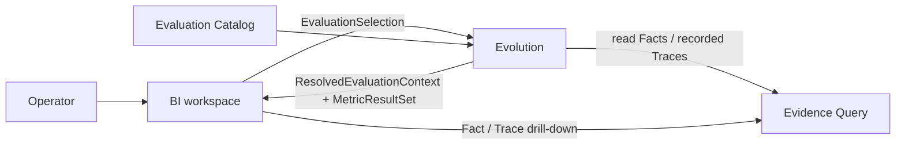
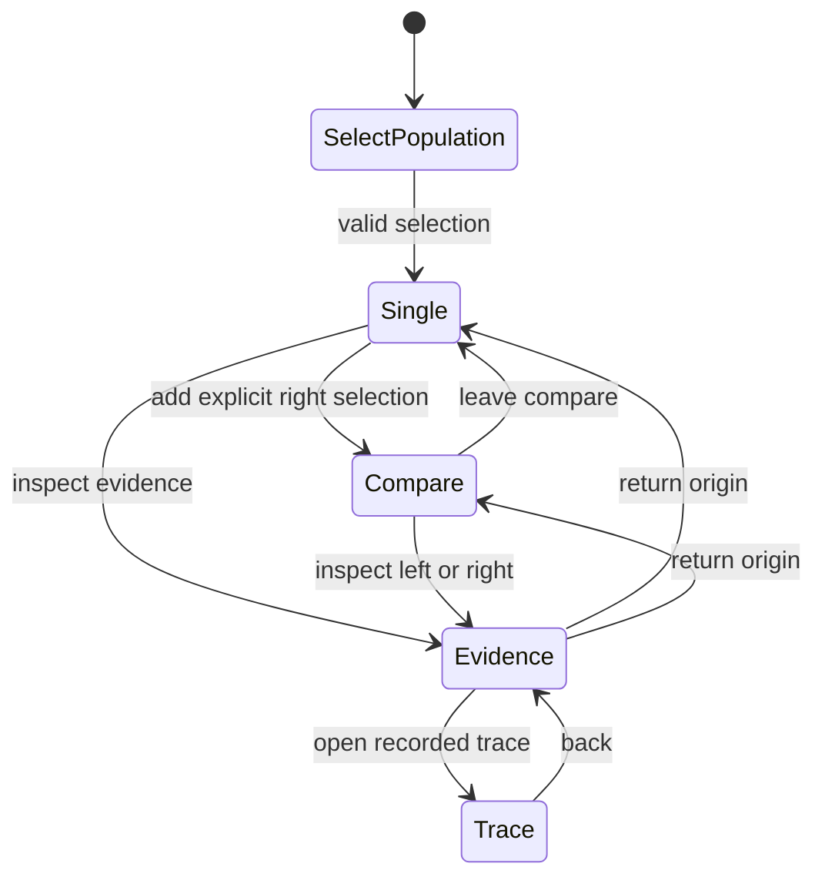
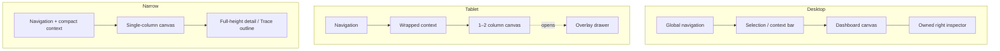
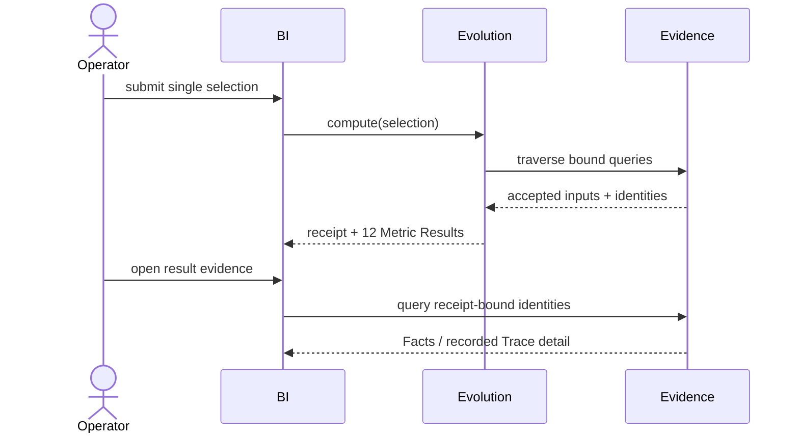
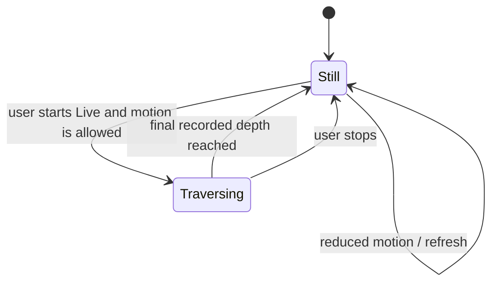

# BI UI — Iteration 5 Detailed Design Candidate

> **Status:** Owner-accepted Wave3 design candidate, 2026-08-28. English is the candidate normative text; the tracking Chinese companion is [`bi-ui-design.zh-CN.md`](bi-ui-design.zh-CN.md). This candidate supersedes the browser-evaluator, BI-local manifest, and fixed `/factual`/`/trace` G1 design, but does not itself publish a Contract, create a durable implementation baseline commit, or authorize Wave4.

## 1. Product intent and non-goals

The primary Iter5 user configures and operates agents and wants to understand the observed effect of agent configuration: which published metrics changed, what Skills and model/Role coordinates were present, how many tokens and directly reported costs were recorded, and where recorded workflow stages or calls consumed time. Iter5 reports those observations; it does not attribute cause, recommend an improvement, edit a Workflow, apply a revision, or close a meta-recursive loop.

The three primary entry tasks are:

1. select a Task-backed evaluation population and inspect its 12 candidate Metric Results;
2. compare two explicitly selected populations using Evolution-computed Before/Delta/After results; and
3. verify a result through its receipt, metric semantics, contributing Facts, and recorded Trace structure.

Single evaluation is the default. Compare is an explicit mode of the same workspace, not a separate product or an accident-first investigation surface.

## 2. Authority and runtime boundary

- Evidence is authoritative for accepted Facts and recorded Traces.
- Evaluation is authoritative for metric concepts and published reading rules.
- Evolution is authoritative for all 12 Metric Results in the owner-approved Catalog 2.0 review candidate, including result status, per-metric coverage, compatibility, and compare Delta. Published Catalog 1.0 remains historical until 2.0 publication.
- BI submits `EvaluationSelection`, presents Evolution responses, and queries Evidence directly for Fact/Trace drill-down.
- BI may perform only presentation transforms: layout, chart-domain selection, display rounding, percentage formatting from an authoritative ratio, and explicit visual binning. It must not calculate a metric, fill a missing value, convert currency/unit, infer causality, or persist a Metric Result.



## 3. User tasks, routes, and deep-link identity

Task selection separates machine identity from human recognition. `task_id` is the sole stable value used by selection requests, URL parameters, deep-link restoration, equality, and receipts. The Task query also returns an optional immutable `display_name`; selectors and context surfaces show that name when non-blank and fall back to `task_id` when it is absent or whitespace-only. `display_name` is not required to be unique: duplicate names must be disambiguated with secondary ID text, and Task search accepts either name or exact ID without merging identities. Where space permits, the UI may expose the ID as secondary copyable metadata. Iteration 5 has no Task rename mutation; a future published rename capability must preserve `task_id` and deep-link identity.

The stable route family is rooted at `/evaluate`. In the table, `{selection-query}` is exactly either `v=1&task=<task_id>...` for single or `v=1&mode=compare&left_task=<task_id>...&right_task=<task_id>...` for compare:

| Route/state | Responsibility |
|---|---|
| `/evaluate?v=1&task=<task_id>...` | single-result dashboard; repeated `task` parameters form the canonical sorted Task set |
| `/evaluate?v=1&mode=compare&left_task=<task_id>...&right_task=<task_id>...` | same workspace in compare mode; each side is independently sorted |
| `/evaluate?{selection-query}&metric=<metric_id@version>&side=<single|left|right>` | focus one exact Metric Result/side without discarding dashboard state |
| `/evaluate/evidence?{selection-query}&metric=<metric_id@version>&side=<single|left|right>&scope=<result|related|read-set>&fact=<fact_id>` | Evidence Console; `fact` is optional exact focus |
| `/evaluate/trace/<trace_id>?{selection-query}&span=<span_id>&side=<single|left|right>` | recorded Trace detail with an optional exact node focus |

Closed, versioned selection fields are serialized in the URL. Task parameters are repeated, never comma-parsed, and BI canonicalizes them by exact ID before submission. Each side accepts at most 24 Task IDs and the complete percent-encoded URL must not exceed 8 KiB; the selector rejects an over-budget selection before navigation and explains the bound. `v`, `mode`, Task sets, `metric`, `side`, `scope`, `fact`, and `span` are the only selection/drill-down identity fields; panel layout and display names are not identities. Unknown fields or revisions fail visibly; the UI never interprets an alias or ambient “latest.” Opening a URL re-submits the selection and receives a current receipt. It does not claim to reproduce expired data or an old receipt byte-for-byte. LocalStorage may retain the user's last selection and layout for convenience, but an explicit URL wins. A drill-down carries its origin URL, metric coordinate, and focus identity so Back returns to the same selection, compare side, metric, scroll/focus target, and open detail surface.



## 4. Responsive application shell and dashboard composition

The shell always contains global navigation, a selection/context bar, the dashboard canvas, and one owned detail surface. Area relationships are frozen; exact pixels belong to implementation tokens.

| Capacity | Area relationship and collapse order |
|---|---|
| Desktop | persistent global header; full selection/context bar; multi-column canvas; receipt/passport/evidence detail in a right-side inspector. Compare uses paired panels inside the canvas, not two applications. |
| Tablet | wrapped context bar; one or two canvas columns according to panel minimum width; inspector becomes an overlay drawer. Compare may retain paired columns only when both remain readable. |
| Narrow | single-column canvas; compact sticky context summary opens full selection controls; Before then After are stacked and Delta remains visually subordinate; detail is a full-height sheet/page; Trace opens as an outline first with an explicit graph toggle. |

Long metric names wrap without truncating the coordinate. Large numerator/denominator values use tabular numerals and may wrap as a unit. A panel never hides provenance or truth state merely to preserve a chart. A 200-row table uses a sticky header and bounded scrolling or pagination; it does not force the whole application sideways. A large but bounded Trace uses viewport pan/zoom on desktop and outline virtualization on narrow screens. Touch targets, drawers, and reordering remain operable without hover.



## 5. Layout and preset contract

BI provides a bounded dashboard composer, inspired by Grafana's separation of visualizer and layout but not by its query/plugin platform.

- The product ships one default layout plus curated presets. A preset binds published metric coordinates to compatible visualizer IDs and declares panel position/size.
- Users may enter explicit edit mode to add/remove a panel, choose a compatible visualizer, bind its declared metric channels, resize within finite sizes, and reorder panels.
- Custom layouts are local browser state. A closed, versioned JSON import/export shape is permitted; unknown versions, fields, metrics, visualizers, transforms, or sizes fail closed.
- Layout identity is not evaluation identity. Changing a layout never changes `EvaluationSelection`, receipt, or Metric Result.
- No arbitrary Evidence query, expression language, formula, plugin loading, script, remote dashboard persistence, collaboration, alert rule, or metric creation enters Iter5.

Read mode is flat at rest. Editing affordances appear only in edit mode. If a saved binding becomes incompatible after a revision change, the panel preserves its position and shows `INCOMPATIBLE` with a repair action; the dashboard and other panels continue rendering.

## 6. Visualization registry and presentation-only transforms

Each visualizer declares a stable ID, arity, named input channels, accepted value kinds/units, required authoritative domain, missing-data tolerance, compare support, table fallback, and allowed presentation transforms. The registry filters choices before binding; it does not accept a binding and improvise a semantic interpretation later.

The Wave7 executable registry is deliberately smaller than the design grammar: numeric card, boolean badge, bounded ratio bar, and lossless table. Gauge/pointer, categorical bar, line, and radar remain deferred grammar until Evolution publishes the authoritative domain, ordered dimension, or shared normalized domain they require. A deferred grammar entry is not a valid layout binding and must not appear in the composer.

| Visualizer | Eligible input | Required behavior |
|---|---|---|
| Numeric card | one scalar/category result | value, unit, truth state, sample/coverage, and provenance entry point remain visible |
| Badge | one closed category/state | text/icon/shape redundancy; never color alone |
| Progress bar / gauge / pointer | one bounded scalar with an authoritative domain | display the domain and direction label; never invent a target or clamp an out-of-range truth |
| Bar | categorical or discrete ordered series with compatible units | zero baseline for magnitude bars; missing categories remain explicit gaps/rows |
| Line | an authoritative ordered/time dimension | no inferred timestamps, interpolation, smoothing, or causal sequence; missing values break the line |
| Table | any result or series | mandatory semantic fallback and the default for heterogeneous/mixed coordinates |
| Radar | homogeneous channels with a shared authoritative normalized domain | no default Iter5 preset; incompatible unless the upstream Result supplies the common domain, so BI never normalizes unrelated metrics |

Allowed transforms are an explicit allowlist: display rounding, ratio-to-percent formatting, scale/layout, stable sorting by an authoritative dimension, and visible binning whose boundaries and counts are labeled as a display transform. Disallowed transforms include moving averages, imputation, score/rank creation, currency/unit conversion, hidden normalization, combining input/output tokens, or deriving a new denominator.

Panel missing tolerance is type-specific. A card/badge/gauge with no value renders its typed truth state rather than a substitute value. A line/bar may retain available points and show explicit gaps when its declared tolerance allows partial series. Compare may show one available side while Delta is withheld. One unavailable panel never fails the entire dashboard.

## 7. Information hierarchy, typography, numeric display, and density

The stable semantic type roles are `display`, `heading`, `body`, `label`, `code`, and `numeric`; Tailwind classes bind to those roles rather than page-local font values. Numeric content uses tabular figures. IDs, coordinates, digests, and exact units use `code` where scanning exact identity matters.

Within a result panel the reading order is: metric name and truth state; authoritative value and unit; numerator/denominator or contributing count; coverage/sample limitations; interpretation limits; then provenance/detail actions. `UNAVAILABLE`, `LOWER_BOUND`, `EXPIRED`, `INCOMPATIBLE`, and partial coverage must remain in the primary reading flow and may not be reduced to low-contrast footnotes.

Evolution supplies authoritative decimal strings and rounding metadata. BI preserves the exact value for accessible text and detail, while a panel may use declared display precision. Units are never inferred. Percent is a presentation of an authoritative ratio. Compare gives Before and After equal visual weight; Delta is smaller/subordinate and includes direction text. Positive/negative arithmetic does not mean good/bad.

Comfortable density is the default. Compact density may reduce whitespace and row height but not type below accessibility minima, touch target size, status labels, provenance access, or chart fallback. Density is a user presentation preference and does not enter the URL selection identity.

## 8. Semantic tokens, themes, print, and forced colors

Tailwind utilities consume semantic CSS-variable bindings. Page and component code must not contain raw palette, spacing, radius, shadow, z-index, focus, or motion values except inside the central token/theme mapping.

Required roles include:

- surfaces: `canvas`, `panel`, `raised`, `overlay`, `inset`;
- text/border: `primary`, `secondary`, `muted`, `inverse`, `border-default`, `border-strong`;
- interaction: `accent`, `selection`, `focus-ring`, `disabled`;
- truth/status: `available`, `attention`, `unavailable`, `expired`, `incompatible`, `error`;
- compare/data: `before`, `after`, `delta-neutral`, and ordered `series-*` roles;
- shape/layer/motion: panel/control radii, elevation levels, overlay levels, finite duration/easing, and still mode.

Every role has light and dark mappings with equivalent meaning. Contrast is checked per role in both themes. Status and compare encoding always pairs color with text, icon, shape, stroke pattern, or position. Arithmetic increase/decrease uses neutral directional encoding (`↑ increase`, `↓ decrease`); any improvement/worsening reading must come from explicit metric semantics, never fixed green/red.

Print removes interaction-only chrome, uses light surfaces, preserves labels/patterns, expands critical receipt context, and never relies on background color. Forced-colors mode uses system colors and outlines; charts retain textual/table alternatives. Focus indicators are not replaced by selection color.

Paired semantic style frames (SVG is the design authority; future screenshots are regression evidence):

- single dashboard: [light](assets/style-frame-bi-single-light.svg) / [dark](assets/style-frame-bi-single-dark.svg);
- compare: [light](assets/style-frame-bi-compare-light.svg) / [dark](assets/style-frame-bi-compare-dark.svg);
- recorded Trace: [light](assets/style-frame-bi-trace-light.svg) / [dark](assets/style-frame-bi-trace-dark.svg);
- truth/recovery states: [light](assets/style-frame-bi-states-light.svg) / [dark](assets/style-frame-bi-states-dark.svg).

## 9. Component responsibilities and state matrix

Names below describe responsibilities; UI labels use domain language such as “指标说明” and “评估回执,” not borrowed Archify product names.

| Responsibility | Trigger and owned state | Close/return and identity |
|---|---|---|
| Metric Result panel | dashboard binding; renders one authoritative result through a visualizer | selection follows metric coordinate; opens metric explanation or evidence |
| Before/Delta/After | compare binding; renders two results plus Evolution Delta | never computes Delta; side focus is explicit in URL state |
| Metric explanation (Semantic Passport capability) | “指标说明” action | drawer/sheet returns focus to trigger; keyed by exact metric coordinate/revision |
| Evaluation receipt (ReceiptPanel capability) | context-bar “评估回执” action | one owned inspector; keyed by resolved context returned for current side |
| Metric navigator (DeltaNavigator capability) | metric list/filter; compare variant exposes compatible Delta state | no cross-metric ranking; focus keyed by metric coordinate |
| Evidence Console | “查看证据” from a result/side | tabs separate exact result evidence, relevant non-lineage Facts, and full resolved read set |
| Trace view | exact Trace/Span link from Evidence | returns to Console origin; URL carries `trace_id` and optional `span_id` |
| Recorded-structure navigator | inside Trace view | depth/outline navigation only; not an independent “Recorded Reach” truth or metric |
| Motion control (MotionGovernor capability) | Trace “Live/Still” control | Still is default; user-started finite traversal owns its stop/reset state |

Only one modal/drawer/sheet owns focus at a time. Receipt and metric explanation may be switched within the same inspector; nested dialogs are forbidden.

| State | Required visible and accessible behavior |
|---|---|
| `loading` | skeleton/progress label; retain previous selection context; do not announce zero |
| `available` | value plus unit and truth label |
| `lower-bound` | value plus prominent “lower bound” limitation |
| `not-applicable` | reason and applicable population; no blank chart |
| `unavailable` | missing-input/reason category and evidence action when possible |
| `expired` | expired label, retained identity, and recovery path; no stale value presented as current |
| `incompatible` | mismatched coordinates and repair/change-selection action |
| `error` | scoped error, retry, preserved selection, and correlation detail |
| `selected` | non-color selection marker; not confused with focus |
| `focused` | visible semantic focus ring independent of selection |
| `disabled` | reason available to assistive technology; no focus unless explanation is interactive |
| `reduced-motion` | same final structure and information with no traversal animation |

## 10. Compare: Before, Delta, and After

Compare is activated by adding an explicit right selection to the current workspace. Left and right retain separate `EvaluationSelection` and `ResolvedEvaluationContext` receipts. The URL contains both selections and side-specific focused evidence identity.

Before and After are the primary facts and receive symmetric panels, labels, precision, coverage, and provenance. Delta is an Evolution result between them, displayed between/below the sides with a neutral increase/decrease/no-change label. BI never subtracts values. If kinds, units, Usage source/source_id, catalog coordinates, or required cohort coordinates are incompatible, both sides remain readable and Delta shows the typed incompatibility reason.

`PARTIAL_COMPARE` is not a metric-unavailable state. The successful side remains fully readable with its receipt and 12 results; the failed side is a scoped transport/resolution error surface with no receipt, retains its URL selection, owns the retry/focus action, and is announced once. All Delta coordinates show `SIDE_UNRESOLVED`; retry targets only the failed side. A full compare alone has two receipts.

The compare navigator filters/searches exact metric coordinates and reports whether Delta is available; it never ranks heterogeneous metrics or synthesizes an overall winner. On narrow screens, Before precedes After and the Delta summary follows both so screen-reader and visual order preserve the primacy of the two results.

```mermaid
sequenceDiagram
    actor U as Operator
    participant BI
    participant EV as Evolution
    participant ED as Evidence
    U->>BI: choose left and right populations
    BI->>EV: COMPARE(left, right)
    EV->>ED: resolve left read set
    ED-->>EV: Facts / recorded Trace inputs
    EV->>ED: resolve right read set
    ED-->>EV: Facts / recorded Trace inputs
    EV-->>BI: FULL compare · two receipts + Before/Delta/After
    BI-->>U: symmetric sides; Delta subordinate
```

## 11. Evidence drill-down and provenance language

Evidence Console is a read-only drill-down, not a second evaluator. It has three clearly labeled scopes:

1. **Result evidence** — exact provenance/input identities cited by the Metric Result;
2. **Related Facts** — Facts matching the current selection/metric context but not claimed as calculation lineage; and
3. **Resolved read set** — the complete bounded identity index recorded by the receipt; Fact rows are loaded from Evidence, while non-Fact resource detail remains explicitly unresolved until its own Evidence route is queried.

The UI must not describe Related Facts as contributors. Every row exposes Fact identity, class, relevant coordinates, accepted provenance, lifecycle state, and an exact Trace/Span link when present. Empty, partial, expired, and query-error states remain distinct. Facts come from Evidence; the Console never reconstructs them from Metric Results.

The receipt explains what Evolution resolved: canonical selections, Task/Delivery population, cutoff, catalog and contract coordinates, query/read-set/provenance identities, completeness, expiry, and compatibility. “Resolved read set” displays every exact identity recorded in that receipt. A Facts-only query may hydrate matching `FACT` rows, but it must retain `TRACE_NODE`, `TASK_MEMBERSHIP`, and unmatched provenance identities as visible unresolved references rather than claim an empty or complete fetched resource set. Re-running current filters may discover later ingestion and must not be presented as the old receipt's read set. The receipt is a response receipt, not a pre-created manifest and not proof of causation.



## 12. Recorded Trace layout and finite motion

Trace layout is derived only from recorded OTel parent structure. Timestamps and arrival order are excluded from layout, sibling order, and traversal order.

- Root/depth follows recorded parent links. All siblings at the same parent depth are revealed together.
- Sibling ordering uses one documented stable identity order so refresh of the same active data yields the same layout.
- LINK is rendered as a separate non-parent edge with distinct stroke/legend and never changes depth or traversal.
- Missing/orphan endpoints remain visible as typed placeholders in a separate orphan lane ordered by stable identity. They receive no inferred parent depth and are not inserted into parent-depth traversal; BI does not repair parentage.
- Partial and expired detail is labeled at the affected node/edge and in the text alternative.
- Desktop graph view is bounded and supports pan/zoom/focus; narrow screens default to a virtualized outline with an explicit graph toggle.
- `Still` is the default. `Live` starts only on user action, reveals the deterministic recorded structure in finite depth steps, then stops. It is a reading aid, not replay of wall-clock execution.
- `prefers-reduced-motion` forces Still behavior while preserving selection and final structure.

Removing every timestamp must leave layout and finite traversal deterministic. Refreshing the same settled Evidence must preserve node identity and order.



## 13. Accessibility, keyboard, focus, and recovery

The primary keyboard order is: skip link → global navigation → selection/context controls → dashboard toolbar → panels in layout order → the active inspector trigger. Edit-mode handles enter the order only in edit mode. Every chart has an accessible name, concise summary, and reachable table/text alternative.

Selection, adding/removing compare, choosing a metric, opening receipt/metric explanation, entering Evidence Console, opening Trace detail, returning, changing theme/density, and starting/stopping permitted motion must all work without a pointer. Drawers/sheets use a labeled dialog pattern, trap focus only while modal, close with Escape when safe, restore focus to the invoker, and never stack.

Async status changes are announced without repeatedly reading the dashboard. Compare incompatibility, expired deep links, and scoped errors receive assertive announcements only when user action requires attention. Decorative chart detail remains hidden from the accessibility tree; authoritative values and gaps remain present in structured text/table output.

On retry, the UI preserves valid selection/layout and retries only the failed scope. An invalid/expired deep link shows the exact failing coordinate, keeps recoverable fields, offers reselection, and never silently falls back to latest. Theme follows system by default with explicit light/dark overrides. Reduced motion follows the platform and can only be made stricter by the user.

## 14. Archify reference disposition

Archify v2.15.0 and local notes are design evidence, not project authority. Evidence keys below refer to local source audits: [O-2 route/reach/trace and O-3 compare](../../../tmp/20260827/archify-inspiration/obs-archify-capabilities.md), [O-5 visual/interaction discipline](../../../tmp/20260827/archify-inspiration/obs-archify-capabilities.md), and [O-16 boundary rejection](../../../tmp/20260827/archify-inspiration/obs-evolution-bi-mapping.md). The decisions and WSR boundaries are ours.

| Reference capability | Evidence | Decision | Iter5 boundary |
|---|---|---|---|
| Progressive disclosure | O-5 | `ADOPT` | flat dashboard at rest; details open on demand |
| Flat-at-rest information hierarchy | O-5 | `ADOPT` | one owned inspector; no permanent nested chrome |
| Evidence Console | O-5 | `ADAPT` | read-only result/related/read-set scopes using Evidence authority |
| Semantic Passport | O-5 | `ADAPT` | domain label “指标说明”; Catalog semantics, not Archify domain fields |
| Stable deep links | O-2 | `ADAPT` | serialize closed EvaluationSelection and exact evidence focus; re-resolve current receipt |
| Semantic color and theme parity | O-5 | `ADAPT` | Tailwind semantic bindings with light/dark, print, and forced-colors parity |
| Finite/reduced motion | O-2/O-5 | `ADAPT` | recorded parent-depth reading aid; no temporal replay |
| Before/Delta/After receipt discipline | O-3 | `ADAPT` | FULL compare supplies two receipts and Delta; partial compare keeps the successful side and typed side error |
| Authored reach | O-2/O-16 | `REJECT` | authored structure cannot be presented as runtime causality; no independent Recorded Reach component |
| AI attribution or Workflow mutation | O-16 | `REJECT` | outside Iter5 and unsupported by current authorities |
| Share/presentation cards | O-16 | `DEFER` | no collaboration/publishing requirement in Iter5 |
| Radar as a default comparative summary | O-16 | `DEFER` | unrelated metrics lack a common authoritative normalized domain |

No borrowed proper noun is retained merely for feature parity. The design adopts the useful interaction principle and rewrites it against WSR's own authority and truth vocabulary.

## 15. Verification checklist and baseline migration

Wave4+ implementation must prove this design through existing test layers; Wave3 does not add product code.

- route restoration: URL wins over LocalStorage and restores single/compare, metric, side, detail, and focus identity;
- authority: no BI formula, currency conversion, missing-value fill, or Delta calculation;
- registry: incompatible bindings fail before render; every visualization exposes a table/text fallback;
- state matrix: all listed truth, interaction, and motion states render in both themes without color-only meaning;
- responsive: long names, large numbers, two-sided compare, 200 rows, and bounded large Trace preserve operation at desktop/tablet/narrow capacities;
- accessibility: complete keyboard journey, dialog focus restoration, skip link, announcements, forced colors, and reduced motion;
- Trace: timestamp removal does not change layout/traversal; same settled data preserves identity/order; traversal terminates;
- Task: display name and ID stay separate, duplicate names disambiguate, no rename control is exposed, and missing name falls back to ID;
- layout: versioned presets/custom import fail closed and never change selection identity;
- multi-slice results: duplicate/noncanonical slice keys fail, mixed slice truth is not collapsed, and Delta aligns exact keys only;
- URL bounds: 24 Task IDs per side and the independent 8 KiB complete encoded-URL limit both fail visibly before navigation;
- partial compare: retain the successful side, retry/announce only the failed side, preserve URL selections, and withhold all Delta coordinates as `SIDE_UNRESOLVED`;
- themes: paired light/dark style frames and semantic-token screenshots express equivalent hierarchy.

Reusable baseline: React, D3.js, Tailwind CSS, TypeScript, Vite, layout-independent primitives, preview/test harnesses, Docker/Nginx scaffold, and existing semantic token machinery. Superseded: browser metric computation, BI-local read-only manifest, fixed `/factual`/`/trace` application IA, dark-only authority, old component boundaries, and any old style frame that labels BI as the Evidence authority.

The independent `Recorded Reach` name/component is rejected by this design. The published `delivery-stage-reach` Metric Result remains supported, while recorded-structure navigation belongs inside Trace view.
