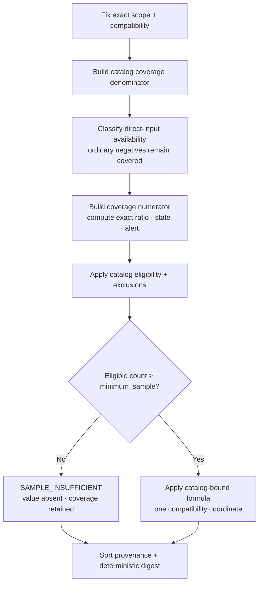

# BI Metric Computability Matrix — Superseded G1 Input

> **Status:** **SUPERSEDED** by the Wave3 authority split. This file is retained as historical G1 analysis only. Browser evaluation, the BI-local context manifest, and the snapshot/digest model below are not current authority. Evolution's candidate 14-calculator/input matrix is [`../evolution/metric-computability.md`](../evolution/metric-computability.md).

## 1. Binding and common rules

- Catalog coordinate: `agentops.evaluation.metric-catalog@1.0.0`.
- Catalog semantic digest: `sha256:6dbb4375507a3a2eebbe5e86bb6f0a40ebf811790f55ee841b15c6942e1f159d`.
- Publication record: `sha256:1967dd9625b572ff6411edc19533cd32144cdedf3e526cb8460f39f688cf5014`.
- Factual source: only typed `evidence.query@0.1.0` `/facts` and `/traces` results.
- Evaluation source: only a valid `wsr.bi.evaluation-context@1.0.0` manifest as defined by [`bi-system.md`](bi-system.md#4-bi-local-evaluation-context).
- Formula authority: the catalog's exact `calculation`, `eligibility`, `exclusions`, `minimum_sample`, `coverage` and `forbidden_inference` fields. The evaluator stores a binding table keyed by metric ID/version and exact catalog digest; React and D3 receive results only.

All metrics are **conditionally computable**, not universally available. “Computable” below means the published inputs can be obtained without a contract change; an actual result still fails closed when identity, compatibility, coverage, sample or direct input is missing.

Common result envelope:

```text
metric={id,version,catalog_coordinate,catalog_digest}
scope={as_of,window,cohort,dimensions,filters}
value={state,kind,unit,exact_value?,numerator?,denominator?,contributing_count?}
coverage={numerator,denominator,raw_ratio,state,alert}
truth={availability,expiry,compatibility,missing_inputs[],exclusions[]}
provenance={fact_ids[],accepted_digests[],snapshot,context_id?,context_digest?}
reading={uncertainty[],forbidden_inference[]}
result_digest
```

`result_digest` is SHA-256 of RFC 8785 canonical JSON for the result without `result_digest`. Fact IDs and accepted digests are sorted bytewise; inputs are pinned to one Evidence snapshot traversal and one context digest. Identical pinned inputs therefore produce identical results.

## 2. Per-metric disposition

| Metric | Required physical inputs | Consumer disposition and unavailable cases |
|---|---|---|
| `role-template-rework-rate@1.0.0` | Context task membership + event-time role template; exact terminal Delivery facts; recorded `FINDING_FIX`/repair relationships; compatibility | Compute only after deriving one unique terminal outcome for every declared member. Missing context/assignment, open or mixed task, unavailable repair input or sample `<20` withholds value. Known no repair is covered zero numerator. |
| `role-template-trajectory-partial-cost@1.0.0` | Same context/task reading; direct Usage facts with exact source, currency and cost basis; Delivery linkage | Sum only within one exact currency/source/basis coordinate. Mixed or unattributed cost is excluded; missing context or sample `<20` withholds value. Always label “partial attributable cost.” |
| `role-model-task-outcome-rate@1.0.0` | Context membership for catalog §6.2 task reading; terminal Delivery facts; `MODEL_ATTRIBUTION` exact provider/model/role/runtime tuple | Publish one numerator per recorded outcome over one eligible denominator. Missing context, open/mixed task, incomplete tuple, incompatible cohort or sample `<20` withholds value. Never claim model causality. |
| `packet-rework-rate@1.0.0` | Implementation-summary packet identity/governance fields exposed by typed Fact resources; recorded repair relationships; compatibility | Exact packet identity and supported revision are mandatory. A known no-repair packet remains covered and contributes zero; unavailable attribution is missing coverage. Minimum sample is 1. |
| `operational-latency-ms@1.0.0` | `MODEL_ATTRIBUTION` Fact plus matching recorded Trace `NODE` native start/end duration and exact provider/model/role/runtime tuple | Join only by exact Span identity. Invalid/absent duration or tuple excludes call. Never substitute Delivery C55, arrival time or zero. Minimum sample is 1. |
| `trajectory-partial-cost@1.0.0` | Exact Delivery linkage; direct reported Usage cost; source/currency/cost-basis compatibility | Sum only identical coordinates. Estimated, unattributed or mixed values are excluded. Sample `<20` withholds value; coverage remains visible. Never label total cost. |
| `task-cohort-comparison-eligibility@1.0.0` | Context defined-task snapshot; exact member terminal Delivery facts; compatibility | Denominator retains every defined task; numerator contains only §6.2 comparable terminal tasks. Publish every exclusion reason. Missing/invalid context or sample `<20` withholds value. |
| `delivery-stage-reach@1.0.0` | Terminal Delivery identity/outcome and direct C56 stage fact from typed `EVENT_CONTRIBUTION`; compatibility | One numerator per exact recorded stage over linked terminal Deliveries. Missing C56 is not reached. Never infer from Workflow order, text or time. Minimum sample is 1. |
| `delivery-terminal-outcome-rate@1.0.0` | Exact Delivery identity and explicit terminal outcome Fact; compatibility | One numerator per recorded terminal outcome. Open/unsupported outcomes are excluded. Never infer a task-level outcome. Minimum sample is 1. |
| `delivery-cycle-time-ms@1.0.0` | Exact terminal Delivery identity and direct C55 elapsed milliseconds; compatibility | Average exact C55 values and publish contributing count. Absent/invalid C55 excludes the Delivery. Never derive from timestamps or substitute model-call latency/zero. |
| `operational-token-usage@1.0.0` | Standard token Usage facts; complete `MODEL_ATTRIBUTION` tuple; compatibility | Sum reported input and output separately within identical coordinates. Missing/incompatible measurement excludes call. Never synthesize total tokens. |
| `operational-attributable-cost@1.0.0` | Direct reported cost; complete model-role tuple; exact source/unit/currency/basis compatibility | Sum only exact same coordinates. Estimated/unattributed/mixed inputs are excluded. Never estimate, convert or label total cost. |
| `operational-usage-availability@1.0.0` | Exact model-call identity; explicit usage-source classification; complete model-role tuple; compatibility | Numerator requires an applicable explicit source. Missing classification reduces coverage rather than becoming zero usage. Minimum sample is 1. |
| `direct-evidence-basis-rate@1.0.0` | Exact accepted Fact identity and readable accepted provenance classification | Direct host/provider basis is numerator; readable accepted nondirect basis remains covered zero numerator. Missing/unreadable provenance reduces coverage. No semantic-correctness inference. |

## 3. Input reachability

| Catalog input | Physical reading |
|---|---|
| `evaluation.defined-task-snapshot` | context `tasks[].task_id`, `delivery_ids`, cohort and `as_of` |
| `evaluation.event-time-role-template` | context task's exact `{id,version,digest}` assignment |
| `evaluation.unique-terminal-task-outcome` | evaluator's fail-closed §6.2 reading over context membership plus terminal Delivery facts; not a manifest assertion |
| `observation.delivery-identity` | typed Delivery Summary Fact fields/relationships |
| `observation.delivery-outcome` | typed direct Delivery terminal outcome field |
| `observation.delivery-elapsed-time-c55` | typed direct C55 field |
| `observation.delivery-stage-reached-c56` | typed direct C56 field |
| `observation.model-call-identity` | Trace NODE exact `(trace_id,span_id)` |
| `observation.model-call-span-duration` | matching active Trace NODE native start/end values |
| `observation.model-role-attribution-tuple` | `MODEL_ATTRIBUTION` compatibility/fields and exact Span identity |
| `observation.packet-identity` | typed implementation-summary Fact fields at exact supported governance revision |
| `observation.repair-link` | exact recorded repair relationship (`FINDING_FIX`), never name/order adjacency |
| `observation.reported-cost` | typed Usage fields: source, kind, unit/currency, basis and value |
| `observation.standard-token-usage` | typed standard input/output token measurements |
| `observation.usage-source` | typed explicit applicable usage-source field |
| `observation.fact-identity` | Fact `id`, kind, source and owner key |
| `observation.fact-provenance` | Fact accepted digest/profile/family/owner coordinates |
| `projection.compatibility-eligibility` | Fact `compatibility`, `truth`, dimensions and direct availability; evaluator cannot rewrite them |

Trace detail may expire before factual Projection. A metric needing native Span duration becomes unavailable for that unit when the matching Trace NODE is expired; retained model attribution cannot reconstruct duration. Factual expiry likewise retains identity/provenance but removes fields and relationships, so the required input is unavailable rather than zero.

## 4. Coverage, sample and truth algorithm

For each metric, the evaluator first fixes exact scope and compatibility coordinates, then follows the catalog in this order:



Coverage denominator zero produces `NO_POPULATION`; positive denominator with zero covered inputs produces `NO_COVERAGE`; a partial numerator produces `PARTIAL`; equality produces `FULL`. Coverage never changes completeness and low coverage does not independently hide an otherwise sample-sufficient metric value.

## 5. Forbidden outputs and source isolation

The evaluator and UI must never emit:

- a composite score, utility profile, rank, winner, recommendation or hidden weight;
- any of the six removed metrics or an alias for them;
- an inferred task outcome, template assignment, causal edge, stage, cost, duration, total token count or zero;
- aggregation across incompatible provider/runtime/role/cohort/unit/currency/source/cost-basis coordinates;
- raw payload, SQL/table/effect name, database identifier, credential or unknown response field;
- a React/D3 formula branch. A static boundary test scans view modules for catalog IDs and arithmetic over factual values; only domain evaluator modules may import the generated binding table.

Golden tests bind every table row above to the exact catalog revision/digest, required input set, formula branch, minimum sample, coverage basis and forbidden inference. Any missing or extra metric makes the catalog-bound evaluator incompatible rather than partially available.
