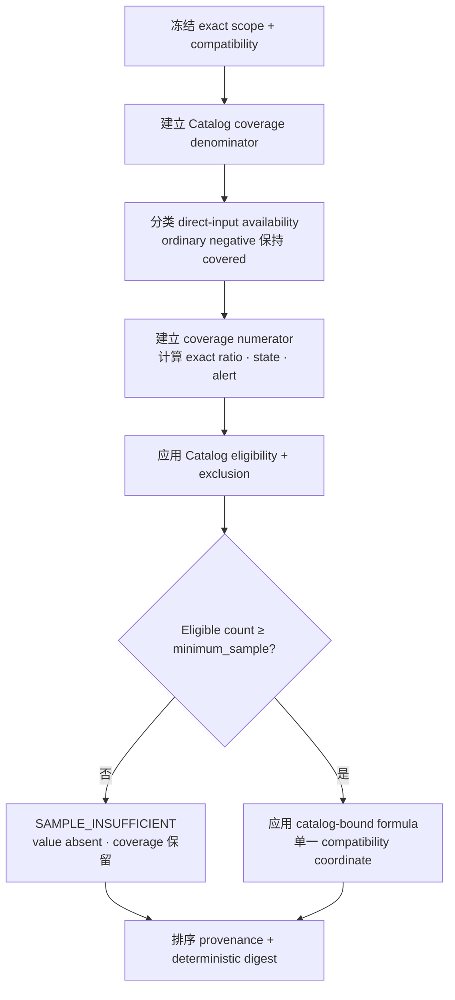

# BI Metric 可计算性矩阵——已 supersede 的 G1 输入

> **状态：****SUPERSEDED**。本文只保留为历史 G1 分析；下面的 browser evaluation、BI-local context manifest 与 snapshot/digest model 均不是当前 authority。Evolution 候选 14-calculator/input matrix 见 [`../evolution/metric-computability.zh-CN.md`](../evolution/metric-computability.zh-CN.md)。

## 1. Binding 与通用规则

- Catalog coordinate：`agentops.evaluation.metric-catalog@1.0.0`。
- Catalog semantic digest：`sha256:6dbb4375507a3a2eebbe5e86bb6f0a40ebf811790f55ee841b15c6942e1f159d`。
- Publication record：`sha256:1967dd9625b572ff6411edc19533cd32144cdedf3e526cb8460f39f688cf5014`。
- Factual source：只能是 typed `evidence.query@0.1.0` `/facts`、`/traces` result。
- Evaluation source：只能是 [`bi-system.md`](bi-system.md#4-bi-local-evaluation-context) 定义的有效 `wsr.bi.evaluation-context@1.0.0` manifest。
- Formula authority：Catalog 的精确 `calculation`、`eligibility`、`exclusions`、`minimum_sample`、`coverage`、`forbidden_inference`。Evaluator 持有以 metric ID/version 与 exact catalog digest 为 key 的 binding table；React/D3 只接收 result。

所有 metric 都是**有条件可计算**，不保证永远 available。“可计算”表示 published input 可在不改 contract 的情况下取得；实际 identity、compatibility、coverage、sample 或 direct input 缺失时仍需 fail closed。

通用 result envelope：

```text
metric={id,version,catalog_coordinate,catalog_digest}
scope={as_of,window,cohort,dimensions,filters}
value={state,kind,unit,exact_value?,numerator?,denominator?,contributing_count?}
coverage={numerator,denominator,raw_ratio,state,alert}
truth={availability,expiry,compatibility,missing_inputs[],exclusions[]}
provenance={fact_ids[],accepted_digests[],snapshot,context_id?,context_digest?}
reading={uncertainty[],forbidden_inference[]}
result_digest
```

`result_digest` 是删除自身后的 result 按 RFC 8785 canonical JSON 计算的 SHA-256。Fact ID/accepted digest 以 bytewise 排序；input 固定到一个 Evidence snapshot traversal 和一个 context digest，因此相同 pinned input 产生相同 result。

## 2. 逐项 disposition

| Metric | Required physical input | Consumer disposition 与 unavailable 情形 |
|---|---|---|
| `role-template-rework-rate@1.0.0` | Context task membership/event-time role template；精确 terminal Delivery fact；recorded `FINDING_FIX`/repair relationship；compatibility | 先为每个 declared member 按 §6.2 读出 unique terminal outcome。Context/assignment 缺失、open/mixed task、repair input unavailable 或 sample `<20` 时隐藏 value。Known no repair 是 covered zero numerator。 |
| `role-template-trajectory-partial-cost@1.0.0` | 同一 context/task reading；精确 source/currency/cost basis 的 direct Usage fact；Delivery link | 只在一个 exact currency/source/basis coordinate 内求和。Mixed/unattributed cost 排除；context 缺失或 sample `<20` 隐藏 value。始终标为“partial attributable cost”。 |
| `role-model-task-outcome-rate@1.0.0` | 用于 Catalog §6.2 的 context membership；terminal Delivery fact；`MODEL_ATTRIBUTION` provider/model/role/runtime tuple | 每个 recorded outcome 一个 numerator，共用 eligible denominator。Context 缺失、open/mixed task、tuple 不完整、cohort incompatible 或 sample `<20` 时隐藏 value；禁止 model causality。 |
| `packet-rework-rate@1.0.0` | Typed Fact 中的 implementation-summary packet identity/governance；recorded repair relationship；compatibility | 必须有 exact packet identity 和 supported revision。Known no-repair packet 保持 covered 并贡献 zero；attribution unavailable 属于 missing coverage。Minimum sample=1。 |
| `operational-latency-ms@1.0.0` | `MODEL_ATTRIBUTION` Fact；匹配 recorded Trace `NODE` native start/end；完整 model-role tuple | 只按 exact Span identity join。Duration/tuple 缺失或非法时排除 call。禁止用 Delivery C55、arrival time 或 zero 替代。 |
| `trajectory-partial-cost@1.0.0` | Exact Delivery link；direct Usage cost；source/currency/cost-basis compatibility | 只合计 identical coordinate。Estimated/unattributed/mixed value 排除；sample `<20` 隐藏 value，coverage 仍可见；禁止标 total cost。 |
| `task-cohort-comparison-eligibility@1.0.0` | Context defined-task snapshot；member terminal Delivery fact；compatibility | Denominator 保留每个 defined task，numerator 只含 §6.2 comparable terminal task；发布所有 exclusion。Context 非法/缺失或 sample `<20` 隐藏 value。 |
| `delivery-stage-reach@1.0.0` | Terminal Delivery identity/outcome；typed `EVENT_CONTRIBUTION` direct C56；compatibility | 每个 exact recorded stage 一个 numerator，以 linked terminal Delivery 为 denominator。C56 缺失不等于 reached；禁止从 Workflow order/text/time 推断。 |
| `delivery-terminal-outcome-rate@1.0.0` | Exact Delivery identity 与 explicit terminal outcome Fact；compatibility | 每个 recorded terminal outcome 一个 numerator。Open/unsupported outcome 排除；禁止推断 task outcome。 |
| `delivery-cycle-time-ms@1.0.0` | Exact terminal Delivery identity 与 direct C55 milliseconds；compatibility | 平均 exact C55 并发布 contributing count。C55 缺失/非法则排除；禁止从 timestamp 推导或用 model latency/zero 替代。 |
| `operational-token-usage@1.0.0` | Standard token Usage fact；完整 `MODEL_ATTRIBUTION` tuple；compatibility | 在 identical coordinate 内分别合计 input/output；missing/incompatible measurement 排除；禁止合成 total tokens。 |
| `operational-attributable-cost@1.0.0` | Direct reported cost；完整 model-role tuple；精确 source/unit/currency/basis | 只合计 exact same coordinate。Estimated/unattributed/mixed input 排除；禁止 estimate、conversion 或 total cost 标签。 |
| `operational-usage-availability@1.0.0` | Exact model-call identity；explicit usage-source；完整 model-role tuple；compatibility | Numerator 要求 applicable explicit source。Missing classification 降低 coverage，不得变成 zero usage。 |
| `direct-evidence-basis-rate@1.0.0` | Exact accepted Fact identity 与 readable accepted provenance classification | Direct host/provider basis 进 numerator；readable nondirect basis 保持 covered zero numerator。Missing/unreadable provenance 降低 coverage；禁止推出 semantic correctness。 |

## 3. Input reachability

| Catalog input | Physical reading |
|---|---|
| `evaluation.defined-task-snapshot` | context 的 `tasks[].task_id`、`delivery_ids`、cohort、`as_of` |
| `evaluation.event-time-role-template` | context task 的 exact `{id,version,digest}` assignment |
| `evaluation.unique-terminal-task-outcome` | evaluator 以 context membership + terminal Delivery fact 做 §6.2 fail-closed reading；不是 manifest assertion |
| `observation.delivery-identity` | typed Delivery Summary Fact field/relationship |
| `observation.delivery-outcome` | typed direct Delivery terminal outcome field |
| `observation.delivery-elapsed-time-c55` | typed direct C55 |
| `observation.delivery-stage-reached-c56` | typed direct C56 |
| `observation.model-call-identity` | Trace NODE exact `(trace_id,span_id)` |
| `observation.model-call-span-duration` | matching active Trace NODE native start/end |
| `observation.model-role-attribution-tuple` | `MODEL_ATTRIBUTION` compatibility/field + exact Span identity |
| `observation.packet-identity` | exact supported governance revision 下的 typed implementation-summary field |
| `observation.repair-link` | exact recorded `FINDING_FIX` relationship；禁止 name/order adjacency |
| `observation.reported-cost` | typed Usage 的 source/kind/unit/currency/basis/value |
| `observation.standard-token-usage` | typed standard input/output token measurement |
| `observation.usage-source` | typed explicit applicable usage-source |
| `observation.fact-identity` | Fact `id`、kind、source、owner key |
| `observation.fact-provenance` | Fact accepted digest/profile/family/owner coordinates |
| `projection.compatibility-eligibility` | Fact `compatibility`、`truth`、dimensions、direct availability；evaluator 不得改写 |

Trace detail 可能早于 factual Projection 过期。需要 native Span duration 的 metric 在匹配 NODE expired 时对该 unit unavailable；保留的 model attribution 不能重建 duration。Factual expiry 同样只保留 identity/provenance，fields/relationships 删除，required input 是 unavailable 而不是 zero。

## 4. Coverage、sample 与 truth 算法

Evaluator 先固定 exact scope/compatibility，再按 Catalog 顺序执行：



Coverage denominator=0 是 `NO_POPULATION`；denominator>0 且 numerator=0 是 `NO_COVERAGE`；部分为 `PARTIAL`；相等为 `FULL`。Coverage 不改变 completeness；low coverage 本身不隐藏 sample-sufficient value。

## 5. 禁止输出与 source isolation

Evaluator/UI 禁止输出：

- composite score、utility profile、rank、winner、recommendation、hidden weight；
- 六项 removed metric 或其 alias；
- 推断的 task outcome、template assignment、causal edge、stage、cost、duration、total token、zero；
- 跨 incompatible provider/runtime/role/cohort/unit/currency/source/cost-basis 聚合；
- raw payload、SQL/table/effect name、DB identifier、credential、unknown response field；
- React/D3 formula branch。Static boundary test 扫描 view module 中的 Catalog ID 和 factual arithmetic；只有 domain evaluator 能 import generated binding table。

Golden test 把以上每一行绑定到 exact catalog revision/digest、required input set、formula branch、minimum sample、coverage basis、forbidden inference。Metric 多一项或少一项都使 catalog-bound evaluator incompatible，不允许 partial available。
