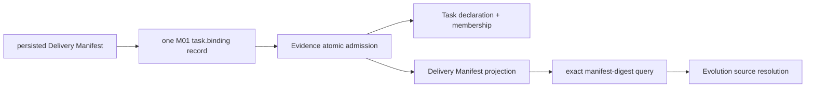

# Evidence Delivery Manifest Projection — 设计候选

> **状态：** Iteration 5 cross-system Contract 候选，2026-08-28。它扩展 Profile 2 Task-binding 与 Evidence Query 候选，不修改已发布 Profile 1.0 或 Evidence Query 0.1 Contract。英文跟踪正文见 [`delivery-manifest-projection.md`](delivery-manifest-projection.md)。

## 1. 目的与 authority chain

Evolution 需要 portable historical reading，以识别每个 Delivery 的 exact Workflow Package/Snapshot 与 admitted Role→model-selection bindings。Execution persisted Delivery Manifest 仍是 admission authority。Evidence 从声明 Task membership 的同一条 M01-owned `task.binding` record 保存其 evidence-safe projection。



Evidence 不读 Execution files 或 Workflow sources。Projection 不替代 full Manifest，不授权 recovery，也不证明 model call 已发生；model-call Spans 仍是 actual C30/C57 use 的 authority。

## 2. Carrier revision

Observation Profile `2.0.0` 对 `task.binding` carrier 作以下变更：

- OTLP LogRecord body 保持 empty；
- required closed attribute `agentops.delivery.manifest_projection` 携带 canonical JSON；
- required attribute `agentops.delivery.manifest_projection_digest` 是上述 exact UTF-8 canonical JSON bytes 的 lowercase SHA-256；
- C01 Delivery ID、C02 Task ID、C07 full Manifest digest 与 C09 Event ID required；optional C58 携带 Task display name；
- Profile 2 要求每个 supported Event/Span 直接携带 C01，admission 记录 internal record-to-Delivery membership，retention 不从 Trace correlation 或 timestamp 推断 ownership；
- record 只能由 already persisted Manifest 及其 exact Workflow Snapshot 产生；Workflow-ID prefix、event name、timestamp、source URL 与 ambient configuration 均不能选择或抑制该 projection。

`C09` deterministic 且 retry-stable：`task-binding-` 加 `SHA-256(UTF-8(delivery_id))` 的前 24 个 lowercase hex character。同一 persisted Delivery/Manifest 在 transport retry/recovery 后总是重发同一 Event identity/canonical content；C09 不随机，也不从 time 生成。

Canonical projection 最大 64 KiB UTF-8、最多 128 个 Role entries，与 candidate Package/admission bound 一致。超限在 Runner effect 前作为 admission/configuration failure，绝不 truncate。Unknown fields 与 duplicate JSON members 被拒绝。

## 3. Closed portable shape

```json
{
  "schema_version": "execution.delivery-manifest-projection@1.0.0",
  "delivery_id": "delivery-…",
  "task_id": "task-…",
  "manifest_digest": "<sha256>",
  "workflow": {
    "package_name": "workflow-package",
    "exact_package_version": "2.0.0",
    "package_digest": "<sha256>",
    "workflow_id": "workflow.system-design",
    "workflow_version": "2.0.0",
    "snapshot_id": "workflow.system-design@2.0.0:<sha256>",
    "snapshot_digest": "<sha256>"
  },
  "repository_model_bindings": {
    "document_state": "PRESENT",
    "document_digest": "<sha256>",
    "resolved_map_digest": "<sha256>"
  },
  "roles": [
    {
      "role_id": "role.architecture-reviewer",
      "role_prompt_identity": "prompt.role.architecture-reviewer",
      "role_prompt_digest": "<sha256>",
      "agent_provider_id": "provider.dsh",
      "model_provider_id": "deepseek-official",
      "model_id": "deepseek-reasoner",
      "resolution_source": "REPOSITORY"
    }
  ]
}
```

规则：

- `delivery_id`、`task_id`、`manifest_digest` exact 等于 C01、C02、C07；
- Package、Workflow、Snapshot、Role、prompt、Agent Provider、LLM provider-route 与 model 使用 exact admitted identity，而非 display label；
- `document_state` 只可为 `ABSENT` 或 `PRESENT`；仅 `ABSENT` 时没有 document digest；
- `resolution_source` 只可为 `REPOSITORY` 或 `EXECUTION_DEFAULT`；
- Role entries 按 `role_id` bytewise sorted 且 unique；该集合等于本 Workflow Snapshot admitted 的所有 Agent-action Roles；
- 禁止 credentials、credential references、endpoint、source URL、local path、Task prompt/attachments、tool content 与 Provider-native configuration；
- `manifest_digest` 识别 full persisted Manifest，`manifest_projection_digest` 识别 portable projection；二者不能互相替代。

每次读取 Manifest 时，Evolution 都无条件校验 closed Agent Provider/LLM-route/model entry shape，并只从 Manifest entries 重算 `resolved_map_digest`；失败属于 internal projection incompatibility。当 external Workflow content 可得时，Evolution 只比较 exact Role set 与 Role-prompt identity/digest，作为 enrichment-integrity check。该 external mismatch 记录为 bounded source diagnostic，不能改变 settled Metric Result。External content 不是此 immutable Evidence projection 的第二 authority。Projection 内部 shape/digest conflict 或 projection-to-membership identity conflict 会使 dependent reading `INCOMPATIBLE`。

## 4. Atomic Evidence projection

一条 accepted `task.binding` record 原子创建或验证五项 effect：

1. `TASK_DECLARATION(task_id)`；
2. `DELIVERY_TASK_MEMBERSHIP(task_id, delivery_id, manifest_digest)`；
3. `DELIVERY_TASK_GUARD(delivery_id -> task_id, manifest_digest)`；
4. optional `TASK_DISPLAY_NAME(task_id -> display_name)`；
5. `DELIVERY_MANIFEST(manifest_digest -> canonical projection, projection_digest)`。

任一 schema、identity、digest、duplicate 或 conflict failure 拒绝整条 record。Evidence 绝不能只暴露 membership 而没有 matching Manifest projection，反之亦然。Identical retry 是 duplicate；同一 Manifest digest 对应不同 projection bytes 是 conflict。Manifest、membership、Facts、Events 与 Traces 都由 Delivery 持有，并在该 Delivery 被物理删除时共同退出 query。

Iteration 5 的 Task display metadata immutable。`NEW_TASK` 可提供一个 non-empty display name；`REUSE_TASK` 必须省略。后续 absent name 是 no-op、相同 non-empty name 幂等、不同 non-empty name 属于 producer conflict 并拒绝该 malformed owner record。Iteration 5 不提供 rename mutation。Closed reuse request 本就不能携 display name，因此合法 reuse 不受影响。

Task declaration 与 optional display name 是 immutable Task-owned data。每条 active Delivery membership 都是对 declaration 的一个引用。Delivery deletion 在同一事务删除其 membership；Evidence 取得 Task lock 后，只在不存在任何 membership 时删除 declaration 与 display name。Membership relation 是引用 authority；Iteration 5 不存储 mutable reference-count column。Task discovery 因而只暴露至少含一个 active membership 的 declaration。

## 5. Task discovery 与 membership query

既有 `evidence.query@1.0.0` Task candidate 属于本链路：

- `GET /v1/evidence/tasks?limit=<1..200>&cursor=...` 按 bytewise Task-ID order 列出 Task ID、optional immutable display name 与 accepted provenance；
- `GET /v1/evidence/tasks?task_id=<exact>&as_of=<normalized-UTC-RFC3339>&limit=<1..200>&cursor=...` 返回 exact Delivery membership、`manifest_digest`、immutable `recorded_at` 与 accepted provenance；
- membership cutoff predicate 是 `recorded_at <= as_of`；arrival order 不携带 causality；
- 每次 traversal 有自己的 repeatable-read snapshot/cursor binding；later commit 不进入该 traversal，但不创建 Task/Fact/Trace global snapshot；
- 每条 returned membership 都有来自同一 accepted-record transaction 的 matching non-expiring Manifest projection。

BI 使用 list mode 供人选择；Evolution 使用 exact membership mode 与 side 的 logical `as_of`。它不从 list response 或 display name 计算 membership。

## 6. Exact Manifest query

Evidence Query `1.0.0` 增加：

```http
GET /v1/evidence/manifests?manifest_digest=<exact-lowercase-sha256>
```

Request 恰有一个 required parameter、无 body、无 pagination、无 fuzzy lookup、无 list mode、无 latest/version fallback。成功恰好返回一个 closed projection、accepted provenance（`accepted_digest`、exact profile version、source）与 projection digest。Missing 返回 typed `NOT_FOUND`；stored content 冲突属于 integrity error，绝不任意选 winner。

该 route 独立于 Fact/Trace traversal snapshots，且不新增 cross-route snapshot Oracle。Query 1.0 普通 routes 只暴露 active Delivery dataset；terminal Delivery TTL 到期后，Manifest、membership、Facts 与 Trace detail 原子退出 ordinary query，exact Manifest lookup 随后返回 `NOT_FOUND`。Physical-deletion 语义见 [`delivery-observation-lifecycle.zh-CN.md`](delivery-observation-lifecycle.zh-CN.md)。

## 7. Evolution 使用

Evolution 对每个 Task membership 查询 exact Manifest digest 并校验 Delivery/Task equality。它用 Package/Snapshot coordinates 从 ordered configured sources 解析 Workflow content，再按每个 observed C30 Role 选择 exact Role prompt；Manifest role map 表示 admitted configuration，C30/C57 Spans 表示 actual-use Facts。

Manifest projection 自身提供 immutable event-time Role-template cohort coordinate：Workflow Snapshot identity/digest 加 exact Role-prompt identity/digest。Metric calculation 不需要 external prompt bytes。Missing/invalid Manifest projection 只按 Metric Catalog 让 dependent evaluation units unavailable/incompatible；missing Workflow source content 只让 readable template detail/enrichment unavailable，不改变 settled Metric Result，也不抹掉无关 Fact/Trace metrics。

## 8. Required conformance

Fixtures 必须证明 atomic success/rejection、exact canonical digest、deterministic C09 retry/recovery、duplicate/conflict、C01/C02/C07 equality、每个 Profile 2 record 的 direct C01 association、absent/present repository state、Role sort/uniqueness/Snapshot cross-check、secret/path/endpoint rejection、oversize rejection、exporter byte-bound split 与 near-limit single-record acceptance、active-only exact Task/Manifest query、atomic Delivery deletion、Task display-name immutability/fallback，以及不做 Workflow-prefix/timestamp inference。
