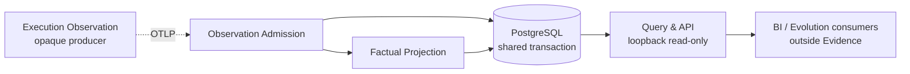
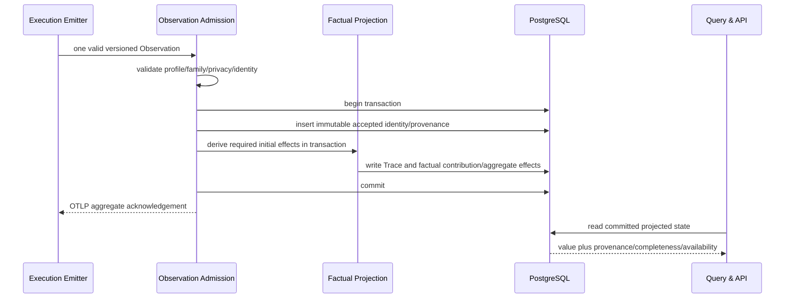

# Evidence System Design

## 1. Metadata and Authority

| Field | Value |
| --- | --- |
| Document identity | `evidence.identity.001` |
| Publication status | `WORKING_REVIEW_CANDIDATE`; prior reviewed overlay evidence applies to earlier bytes only. These changed bytes require fresh deterministic parity/publication binding and user or reader review before any exact publication claim |
| Normative language | English |
| Translation | [`evidence-system.zh-CN.md`](evidence-system.zh-CN.md), faithful and non-normative |
| Upstream authority | [Conceptual Architecture](../../agent-architecture.md) |
| Peer owner | [Execution System Design](../execution/project-execution-system.md) |
| Observation meaning companion | [Observation Catalog](../../contracts/observation/observation-catalog.md), explicitly not a published physical Contract |
| Wire-profile companion | [OTel Observation Profile](../../contracts/observation/otel-observation-profile.md), explicitly not a published physical Contract |
| Interaction companion | [Execution–Evidence Interaction Contract](../../contracts/execution-evidence/interaction-contract.md), explicitly not a published physical Contract |
| Metric companion | [Metric Catalog](../../contracts/evaluation/metric-catalog.md), human specification only and not a machine schema change |
| Confirmed direction | `EE-SKELETON`, SHA-256 `73b3481a099983b57ee9e1dd512c6ed23823f0d045085f9ef585db70be13949a` |
| Feasibility | SD-06 aggregate, SHA-256 `c70303892e2d68f95e83b12c84940d9f3e41dad6f7a1e269b376da69e4adbf6e` |

This document is the single semantic owner of Evidence durable landing, accepted state, factual projection, read-only query API, lifecycle, and local data-service deployment meanings. Execution binding, Runtime lifecycle, custody, and outbound emission are opaque producer concerns owned by the peer Design. Observation fact meaning is named by the Observation Catalog, exact wire mapping by the OTel Observation Profile, transport interaction by the Interaction Contract, and human metric reading by the Metric Catalog; this Design does not copy the 73-field registry, complete-shape rules, or metric schema.

## 2. Context, Problem, and Scope

Evidence is an optional loopback-only local data System for a technically sophisticated first-party user. It receives bounded OTLP observations from Execution, preserves truthful causal and factual state, and exposes one read-only query API for downstream BI and Evolution consumers. It hosts no user interface or presentation proxy.

The problem is not to build a universal observability or evaluation platform. It is to accept imperfect best-effort facts without corrupting accepted history, manufacture neither completeness nor causality, and keep the external query boundary read-only.

In scope:

- one loopback-only Evidence data service and one internally reachable PostgreSQL database;
- version/profile/family validation and content minimization;
- per-record partial admission, stable identity, and first-write-wins;
- atomic acceptance plus required initial Trace/factual projection;
- explicit final/lower-bound/unavailable/not-applicable semantics;
- compatible factual aggregation and recorded causal relationships;
- independent Raw, accepted identity, Trace, and factual projection lifecycles;
- a versioned, bounded, read-only query API for committed facts and recorded Trace relationships.

Non-goals are execution control, Runtime/worktree access, grading/ranking/recommendation, causality inference, arbitrary telemetry storage, an OTel Collector platform, accepted-only staging, queue/cursor/outbox, replay/recompute/correction, presentation-owned formulas, remote/multi-user tenancy, or historical migration.

## 3. Design Drivers and Fitness Thresholds

| Driver | Required outcome | Evidence mechanism |
| --- | --- | --- |
| Missing is not zero (`evidence.scenario.02`) | only applicable final summary proves final zero/total | completeness and population state on every contribution/query |
| Stable identity (`evidence.scenario.03`) | identical retry contributes once; conflict never overwrites | immutable content digest and first-write-wins |
| Atomic truth | no accepted identity without all required initial effects, or effect without accepted identity | one PostgreSQL transaction per valid record |
| Compatible units (`evidence.scenario.04`) | incompatible kind/unit-or-ISO-currency/source/source-ID/completeness/version never aggregate | Projection-owned compatibility key and eligibility |
| Factual inspection (`evidence.scenario.05`) | trends and recorded edges without grading/inference | read-only API and explicit provenance/completeness |
| Non-control (`evidence.scenario.01`) | Evidence outage never affects Runtime result | no callback/receipt dependency into Execution |
| Local preview | small trustworthy deployment | one loopback-only data service, internal PostgreSQL, no UI hosting |
| Privacy | prohibited bodies are rejected/not retained | profile validation, allow-list, bounded diagnostics/Raw |

concept.fixture.003 confirms the atomic/idempotent local PostgreSQL slice and read-only consumers in one pinned environment. concept.fixture.002 confirms the representative emitter/profile semantics; its rebuilt evidence validates the proposed local-Role/family-lineage pair under the user-corrected evidence threshold while remaining procedurally `INCONCLUSIVE` against its superseded old-evidence-rehash condition. Neither result proves production capacity, security, retention defaults, released physical Contract, or implementation conformance.

## 4. Problem Decomposition and Structure

Evidence separates three cohesive problems:

1. **Observation Admission** decides what may become accepted and coordinates the transaction.
2. **Factual Projection** derives owner-scoped causal/factual state and truth semantics.
3. **Query & API** exposes committed state through the sole external read boundary without becoming a fact writer.

Admission and Projection are separate semantic owners but collaborate inside one transaction; they are not separate network services. Query is read-only. Deleting a Module would spread identity/privacy into projectors, truth formulas into dashboards, or causal/factual semantics into transport handlers.

## 5. System Modules

### Observation Admission (`evidence.milestone.01`)

Admission validates the exact supported OTLP Resource, InstrumentationScope, profile and Workflow-family coordinates from the [OTel Observation Profile](../../contracts/observation/otel-observation-profile.md); enforces the closed carrier/EventName/attribute registry and content minimization defined there; resolves stable record identity; detects duplicate/conflict; isolates invalid siblings; coordinates Projection; and reports standard OTLP aggregate success or partial success as specified by the [Execution–Evidence Interaction Contract](../../contracts/execution-evidence/interaction-contract.md). The technology-neutral fact meanings and semantic owners are in the [Observation Catalog](../../contracts/observation/observation-catalog.md); this System Design owns Evidence validation and durable landing meaning, not a duplicate wire registry.

Admission's accepted/duplicate/conflict/rejected disposition is an internal per-record decision used to protect accepted state and projection. It is not serialized as an external ingest response payload.

It is the sole writer of immutable accepted identity/provenance and any bounded Raw-debug lifecycle. Event identity is `agentops.event.id`; Span identity is exactly `(trace_id, span_id)`, never either component alone. Admission binds either identity to a canonical accepted-content digest. For review-family records it validates the exact shape, closed C17/C27 applicability, `(C18,C51)` assertion invariants and C18→C51 binding, target-edge compatibility, status identity, and Fix/Recheck endpoints before coordinating Projection. It rejects unsupported pins/Scope/family, unlisted or wrong-family attributes, invalid types/enums, prohibited content, incomplete Role-lineage, or any `review.finding`/`review.summary` that fails those rules. Empty/over-limit/prohibited Finding summaries, unknown target kinds, invalid target-Artifact applicability and missing/equality-mismatched endpoints reject without partial assertion/edge/status/relationship projection. A `role.lineage` Event is valid only when both version-local `agentops.role.id` and family-scoped `agentops.role.lineage.id` are present; an unknown/not-applicable lineage is represented by absence of that Event, not a synthesized value. A record is accepted only after the accepted row and every required initial projection effect commit together. Admission does not reinterpret Runtime outcome or call Execution.

Admission decides C17 solely from the logical record. On ordinary/Recheck summary, present C17 must be a nonnegative integer and selects the counted form; absent C17 selects the valid no-observed-count-fact form. It cannot and does not reject absence as “producer reported but omitted.” C17 on a Finding shape, an invalid present value, or any other malformed shape rejects the record with zero accepted Review/count effects.

### Factual Projection (`evidence.milestone.02`)

Projection derives one normalized Trace node per accepted Span tuple and owns distinct durable landings for immutable Finding assertion/scope `(C18,C51)`, order-independent target edges, append-only status contributions `(C18,C51,C12)`, target-specific Fix relations, and target-specific Recheck relations. Compatible lifecycle records reuse an existing assertion/edge as no-op while appending the new status/Fix/Recheck contribution exactly once in Admission's transaction. Projection also owns recorded Trace edges, Artifact/Invocation/Role and local-Role-to-family-lineage relationships, completeness-bearing family contributions and compatible aggregates. It stores C50 verbatim and never generates, grades, rewrites or infers it. It exposes recorded statuses and provenance; it owns no mutable current-status winner.

For an accepted summary, present C17 lands one observed-count contribution with the exact value; `0` is factual zero. Absent C17 lands no count contribution and synthesizes neither zero nor `UNAVAILABLE`. The Review/Recheck effect set and any present count commit atomically.

Projection writes only its owner-scoped state inside Admission's transaction. It never edits accepted observations, infers unrecorded causality, grades work, or recomputes history under new formulas.

### Query & API (`evidence.milestone.03`)

Query returns committed factual series and recorded Trace relationships with provenance, completeness, availability, compatibility coordinates, and expiry state. It displays an observed zero only from an accepted C17=`0`; absence yields no observed-count fact, never a zero. It owns no domain facts. Its versioned API is the sole external read boundary; all BI and Evolution consumers use it. Consumer dashboards and UI logic cannot define Metric formulas, rewrite completeness, or infer causality.

The Evidence data service binds ingest and query endpoints to loopback only and hosts no user-facing listener, UI, Grafana, or same-origin presentation proxy. PostgreSQL has no externally reachable listener. Query endpoints are read-only by construction and expose neither raw accepted tables nor write operations.

## 6. Successful Admission and Projection

The branch-free core for one valid new Observation is:

No accepted state is visible before commit. Projection effects cannot exist without their accepted authority. The external response is an aggregate acknowledgement of Evidence ingest, never an execution outcome, never a per-record disposition label, and never a prerequisite for Execution progress.

## 7. Duplicate, Failure, and Retention Scenarios

### Batch sibling isolation (`evidence.path.04a`)

Each record is validated independently. A valid sibling may commit while an invalid sibling is rejected. The OTLP response reports only the standard aggregate success or partial-success result with bounded rejected counts/reasons; it does not create an all-or-nothing batch transaction and does not expose internal per-record disposition labels.

### Identical and conflicting retries (`evidence.path.04b`)

For an Event, identical `agentops.event.id` plus digest is internally duplicate/already accepted without mutation; conflicting content under that Event ID is internally rejected. For a Span, identical `(trace_id, span_id)` plus digest is a no-op and creates no second Trace node/effect; conflicting accepted content under that tuple is internally rejected without overwriting the first Trace node. Equal `span_id` values in different Traces do not collide. Neither retry contributes again, and the external response remains the standard OTLP aggregate result.

For a Finding, `(C18,C51)` is assertion identity and C18 first-binds C51; the exact OTel Profile invariant subset must match across targets and lifecycle facts. A changed C50/C20/invariant, or same C18 with changed C51, rejects before adding even a new target. `(C18,C51,C52,C53,C54-or-absent)` is target-edge identity. Compatible assertion/edge reuse is no-op; a distinct compatible target inserts once in either order. Status, target-specific Fix, and target-specific Recheck contributions use their separate OTel Profile §7.4 identities. A valid lifecycle record atomically appends its new contributions while reusing assertion/edge; any endpoint/conflict failure creates none.

### Ambiguous commit response (`evidence.path.04c`)

If PostgreSQL committed but the App or response path failed before acknowledgement, a later same-identity request converges internally to duplicate/already accepted. No queue, replay worker, or compensation is required, and the external response carries no per-record duplicate label.

### Statement/process/database failure (`evidence.path.04d`)

Failure before commit rolls back accepted identity and every initial effect. A later same-identity request is new. Readers see either no state or the complete slice; never a half-state.

### Sampling or emitter loss (`evidence.path.03`)

Absence of detail cannot be read as no activity. Independent sampling decisions and completeness state distinguish unavailable, lower-bound, and final data. Evidence does not reconstruct lost facts from dashboards or Runtime state.

### Retention (`evidence.path.05`)

Raw debug data may expire first. Accepted identity/provenance remains immutable. Trace detail may expire independently, after which query reports detail unavailable. Factual contributions/aggregates may remain for trends. Retention never converts lower-bound/unavailable into final and never recomputes old facts.

## 8. Data, State, Identity, and Ownership

| Data class | Unique writer | Meaning | Lifecycle |
| --- | --- | --- | --- |
| Raw debug payload | Admission | bounded diagnostic aid, never authoritative fact formula | finite/optional; independently deletable |
| Accepted identity/provenance | Admission | immutable first accepted Event ID or Span `(trace_id, span_id)` tuple, canonical digest, and profile/family provenance | retained as Evidence authority |
| Trace node/edge/link | Projection | recorded causal structure only | independently expirable |
| Finding assertion/scope | Projection | `(C18,C51)` plus immutable C13/C14/C15/C20/C49/C50; original C28/C29 and Invocation/Role remain source provenance; C18 first-binds C51 | first-write; compatible reuse no-op; no rewrite/inference |
| Finding target edge | Projection | `(C18,C51,C52,C53,C54-or-absent)` typed relation | append/first-write; order-independent; compatible reuse no-op |
| Finding status contribution | Projection | `(C18,C51,C12)` plus C19/current Invocation/Role provenance | append-only; no mutable-current winner or overwrite |
| Fix and Recheck relations | Projection | target-specific `(assertion,target,C21)` and `(assertion,target,C23)` contributions with exact endpoints | append-only; atomic with accepted lifecycle Event |
| Other factual contribution | Projection | versioned value/status with compatibility coordinates | append/first-write semantics; no rewrite |
| Compatible aggregate | Projection | merge of eligible compatible contributions | evolves only through accepted contributions of same semantics |
| Query representation/version | Query & API | read shape and compatibility coordinate, not fact authority | versioned without rewriting facts |

For C55, C56, and C57, Evidence owns only admission, storage, and factual projection of the exact owner-supplied value and provenance. It never computes elapsed time from timestamps, infers reached-stage order from observed events, converts model request/response aliases into a canonical model, or backfills an absent owner fact. Missing stays unavailable. C57 is admitted only on a model-call Span with its provider, local Role, C06 Runtime root binding, and Span identity tuple.

Stable Observation identity is distinct from Delivery, Trace, Span, task, Workflow, implementation, Runtime, Manifest, and Artifact identities. Accepted content carries the required relationships; none are inferred from display grouping.

Completeness values are:

| State | Meaning | Numeric interpretation |
| --- | --- | --- |
| `FINAL` | applicable final summary observed | zero is valid when explicitly reported |
| `LOWER_BOUND` | observed detail without complete applicable summary | value is a lower bound only |
| `NOT_APPLICABLE` | the family/metric does not apply | no numeric value |
| `UNAVAILABLE` | sampling/loss/missing summary prevents a claim | no numeric value |

Compatibility uses semantic identity/version, measurement kind, C43 unit (the ISO-4217 currency for money), source, source identity, and completeness. Incompatible groups remain separate.

The accepted carrier-to-state mapping is:

| Accepted carrier | Evidence-owned durable meaning |
| --- | --- |
| Resource and exact Scope/profile/family version | immutable producer/profile/scope/family provenance and validation coordinate |
| root/nested Span, parent and link | `(trace_id, span_id)` first-accepted identity plus canonical digest; one normalized Trace node/edge/link; identical duplicate no-op; conflict rejection; independently expirable detail |
| Event ID plus canonical content digest | separate first-accepted Event identity; identical duplicate no-op; conflicting duplicate rejection |
| Delivery/review/test/intervention/family Event | versioned factual contribution with explicit completeness/applicability |
| complete Review/Finding base+variant | atomically lands immutable Review/Finding/content/scope/target/Artifact/Fix/Recheck/Invocation graph only after all base and variant endpoints validate; no name/order/grouping inference |
| `role.lineage` local/lineage pair | immutable mapping from one version-local Role ID to one family-scoped lineage under profile/family semantic version; relationship endpoints remain local IDs |
| standard GenAI token fields | standard token contribution; missing is unavailable |
| native `usage` Event | contribution keyed by profile/family semantic version, kind, exact C43 unit (the currency for money), source, source ID and completeness; no conversion or catalog-derived money |
| `sampling.decision` with unsampled context | population/availability evidence; no synthesized Span or zero |
| Raw OTLP | optional bounded debug state, deleted after successful import by default; never formula authority |

Token and native usage remain separate semantic families. Compatible aggregation requires identical profile/family semantic-version/kind/C43-unit-or-currency/source/source-ID/completeness coordinates. Premium requests and other provider-native units remain distinct from ordinary requests and credits. `FINAL` may prove explicit zero; `LOWER_BOUND`, `NOT_APPLICABLE`, and `UNAVAILABLE` carry no interchangeable numeric meaning.

## 9. Interfaces, Seams, and Errors

| Interface | Input | Result/error | Invariants |
| --- | --- | --- | --- |
| `ingest` | bounded supported OTLP batch | standard OTLP success or partial-success aggregate with bounded rejected counts/reasons | no execution outcome; no per-record response vector; siblings independent |
| `admit-record` | validated version/profile/family/identity candidate | internal accepted, duplicate, conflict, or rejected disposition | acceptance plus required effects atomic |
| `project-in-transaction` | one validated observation and transaction authority | owner-scoped Trace/factual changes | no accepted mutation or external side effect |
| `query-facts` | bounded filters/pagination | values with provenance/completeness/compatibility | committed state only; no hidden formula |
| `query-trace` | Delivery/Trace filters | recorded nodes/edges or explicit expiry/unavailable | no causal inference |
| `expire` | owner-authorized data class and policy/version | class-specific removal result | accepted/factual authority not silently coupled |

PostgreSQL is a local-substitutable internal seam shared by Admission and Projection, not an external public Interface. `query-facts` and `query-trace` form the sole external read boundary; all BI and Evolution access goes through them. `expire` is owned by Query & API as the data-service operation over the four independently governed lifecycle classes. There is no reverse Interface to Execution.

## 10. Consistency, Failure, and Security Behavior

The transaction boundary is per valid record, not per batch. First accepted write wins. Ordinary retry is safe because identity and content digest decide duplicate versus conflict. `READ COMMITTED` is sufficient for the tested local design when uniqueness and transaction ownership enforce the invariant; a physical implementation must publish and verify its exact schema/constraints.

The data service contains protocol/validation errors and returns bounded reasons without storing prohibited bodies. Database refusal makes the record unaccepted; it does not affect Execution. The first local-only release has no application-level authentication on its loopback ingest or query endpoints. This trust choice never creates a consumer database path: PostgreSQL is internally reachable only and query exposes no write route. Internal read-only inspection and backup use a distinct least-privilege read-only database role; restore and migration use a separate, controlled write-capable operational role. A remote or public listener requires a reopened security design before exposure.

Backup/restore, TLS/auth for any expanded trust boundary, operational credentials, and production migrations remain downstream. Any remote/multi-user exposure is a scope change and reopens security/deployment design.

## 11. Quality Realization

| Quality | Mechanism | Trade-off / residual risk | Verification |
| --- | --- | --- | --- |
| Truthfulness | explicit completeness/applicability/provenance | queries are more verbose than bare totals | missing/final-zero/lower-bound fixtures |
| Consistency | one transaction, uniqueness, first-write-wins | synchronous projection adds admission work | crash/COMMIT ambiguity/concurrency fixtures |
| Reliability | idempotent retry, sibling isolation | sender may not receive final acknowledgement | fresh-process retry convergence |
| Privacy | supported profile allow-list and bounded Raw | useful debugging content intentionally absent | prohibited-marker scans and raw-access denial |
| Security | loopback-only data service, no external PostgreSQL, read-only API | trusted local preview only | listener/API-method/credential/negative reachability tests |
| Maintainability | three deep Modules and unique writers | transaction choreography concentrated in Admission | Interface-level tests and ownership scans |
| Operability | explicit partial success, drop/error, retention visibility | no guaranteed ingestion | bounded operational metrics/logs downstream |
| Resource efficiency | one data service/PostgreSQL, independent expiry | capacity/defaults unproven | workload and retention measurements downstream |

## 12. Risks and Trade-offs

| Risk | Impact | Treatment | Reopen condition |
| --- | --- | --- | --- |
| accepted/projection split | internally false Evidence | one transaction; no accepted-only stage | implementation requires async repair/replay |
| bad first accepted fact | immutable error remains | conflict rejection; new semantic identity/version | correction/recompute becomes product requirement |
| consumer formula drift | competing fact authority | Projection-owned eligibility; versioned read-only API | consumer must compute domain formulas |
| best-effort loss | incomplete trends/Trace | explicit missingness and population | product requires complete guaranteed telemetry |
| retention misread | expired detail mistaken for absent event | explicit availability/expiry state | lifecycle must reconstruct or rewrite history |
| local trust expansion | unauthorized raw/write access | loopback-only API, no database consumer path, split least-privilege roles | remote/multi-user exposure required |

## 13. Acceptance and Verification

| Scenario | Expected outcome | Mechanism | Evidence |
| --- | --- | --- | --- |
| valid record | accepted identity and required effects visible together | one transaction | concept.fixture.003 atomic slice |
| invalid sibling | valid sibling commits; invalid stores nothing | per-record admission | concept.fixture.003 partial sibling case |
| Event duplicate/conflict | no overwrite or double contribution under Event ID/digest | Event first-write identity | concept.fixture.003 duplicate/concurrency cases |
| Span duplicate/conflict | same `(trace_id, span_id)` plus digest is one node/effect; conflict rejects; equal Span IDs across different Traces remain distinct | Span tuple first-write identity and atomic Trace projection | deterministic new/identical/conflicting Span examples; implementation fixture downstream |
| COMMIT response loss | retry converges to one complete slice | first-write-wins idempotency | concept.fixture.003 ambiguity cases |
| final zero/lower-bound/unavailable | distinct query results | Projection-owned completeness | concept.fixture.003 truth fixtures |
| incompatible units/sources | separate groups | compatibility key | concept.fixture.003 grouping cases |
| Trace expiry | factual trend remains; detail explicitly unavailable | independent lifecycles | concept.fixture.003 retention case |
| read-only consumers | bounded API reads succeed; raw/database/write routes denied | read-only API plus least-privilege internal operations | concept.fixture.003 permission evidence; API negatives downstream |
| local access profile | loopback ingest and query work without app auth; no UI or database listener is exposed | fixed loopback data-service topology | downstream listener, method, route and negative reachability tests |
| exact profile admission | exact pins/Scope, ten EventNames and 57 common + applicable 10 or 6 family fields are accepted; sibling-family/unlisted/fixture-only fields reject | OTel Profile-linked closed validator | deterministic 57+10+6 count/unique/table-shape checks plus concept.fixture.002; machine validator/conformance downstream |
| complete Review/Finding composition | ordinary Finding, Fix, Recheck-on-Finding and Recheck-summary land only from their exact complete shape | OTel Profile §7.4 named bases/variants and record-level atomic projection | positive shapes plus missing-base/endpoint negative fixtures |
| C17 report presence | ordinary/Recheck summary C17=`0`, positive C17, and absent C17 land recorded zero, recorded positive, and no count respectively; invalid present value or C17 on Finding rejects with no partial Review/count state | field-presence selector visible to Admission; atomic Review/count projection | bilingual zero/positive/absence/retry positives and type/range/carrier/partial-state negatives |
| bounded Finding/target admission | source-lens summary is nonempty/bounded/privacy-safe; one typed target per record; multi-target set is order-independent and duplicate-safe | C50–C54 validation and target-edge identity | positive multi-target plus empty/over-limit/prohibited/unknown-target/duplicate/conflict fixtures |
| Finding lifecycle identity domains | compatible target/lifecycle records reuse assertion/edge as no-op and append status/Fix/Recheck exactly once; changed C50/C20/C51, target context, lifecycle endpoint, C17/C27 applicability, Event content, or partial landing rejects with zero effects | separate OTel Profile identities plus one Admission transaction | all OTel Profile §7.6 positive/negative sequences in both arrival orders and EN/ZH parity |
| native usage admission | credit/request/premium/provider-native/money examples remain separate unless every compatibility coordinate matches | exact kind/C43-unit-or-currency/source/source-ID/completeness key | incompatible-group examples and downstream fixtures |
| Role lineage admission | differing local IDs may share one lineage; same display names may retain distinct lineages; incomplete pair rejects | atomic admitted local/lineage pair and immutable mapping | concept.fixture.002 rebuilt protobuf/admission/duplicate/conflict evidence; `PROPOSED_VALIDATED_BY_SPIKE` |
| disposition exclusion | no `delivery.disposition` or `agentops.delivery.disposition` is admitted by the first profile | ten-EventName/73-total-field allow-list | registry and negative fixture scan |

Design acceptance requires this document to be implementable without reading Execution internals, while ingest semantics agree with the peer Design and frozen Contract. The local-access acceptance is categorical: application-level authentication is absent only on the loopback-only ingest/query preview; no UI, presentation proxy, database listener, raw route, or write route is exposed. Remote or multi-user exposure reopens the security design. Production schema, migration, security, capacity, and physical conformance evidence remain downstream.

## 14. Decisions and Downstream Obligations

The sole owner-complete downstream obligation register is [Concept §8](../../agent-architecture.md#ee-concept-8). The table below is a local non-owning view of `concept.obligation.001,004,006..008`; owner, current/required evidence, exact return and reopen fields in the Concept register govern.

Evidence applies `concept.decision.001`,`002`,`005`–`007`,`009`,`012`,`013`, and `020`. Rejected directions are a combined Execution/Evidence process, arbitrary telemetry lake, Collector-first topology, accepted-only staging/outbox, replay/recompute/correction, presentation formulas, coupled retention, grading/inference, direct Grafana/PostgreSQL exposure, and historical migration.

| Obligation ID | Local summary | Required evidence | Return/reopen condition |
| --- | --- | --- | --- |
| `concept.obligation.001` | physically publish the adopted Observation Catalog, OTel Profile, and Interaction proposal | machine schemas/package, encoded common/family registries, physical limits, complete-shape/multi-target/privacy/Span/usage fixtures, validators and version/partial-success rules | return if representation cannot preserve complete Review/Finding composition, bounded content/target edges, carrier, lineage, usage, Span identity, truth, privacy, or interaction semantics |
| `concept.obligation.004` | production Evidence data service (admission, projection, query API, retention) plus internal PostgreSQL | code, migrations, complete-shape rejection, Finding target dedup/conflict, ambiguity/idempotency/query/permission/backup fixtures | reopen on partial graph, mutable content/edge, duplicate target, inference, external exposure or topology change |
| `concept.obligation.006` | Evidence lifecycle validation | bounded workload, growth/query/expiry/retention/backup measurements | reopen only if lifecycle meaning, ownership, topology or Interface changes |
| `concept.obligation.007` | public Evidence repository/submodule | repository identity, exact commit, build/test/release and parent-link proof | reopen on duplicate authority, unpinned code or cross-repository transaction |
| `concept.obligation.008` | MIT vs Apache-2.0 decision | dependency/right/patent/NOTICE review and approval | reopen if neither permitted license is compatible |

No current prototype, legacy bundle, split draft companion, human metric specification, or Contract draft establishes physical conformance.

## 15. Module Deepening and Handoff

Detailed design order is Observation Admission, Factual Projection, then Query & API. Freeze validation/idempotency/transaction choreography first, then causal/factual ownership and eligibility, then read shapes and deployment access. The Module Interface is the test surface; database, decoder, clock, and retention scheduler remain internal seams.

Implementers must not reinterpret missing as zero, duplicate as overwrite, conflict as correction, `span_id` alone as global identity, Trace expiry as event absence or replacement, task grouping/order/name as causality or relationship, a Role name as lineage, relationship endpoints as lineage identities, incompatible native units as additive, Grafana SQL as Metric authority, a successful Evidence response as execution success, the Metric Catalog as a machine schema, or any split draft companion as a published physical Contract. Physical tables/indexes/limits/defaults and validator implementation remain downstream; admission identity, relationship graph, compatibility, and carrier-to-state mapping do not.
