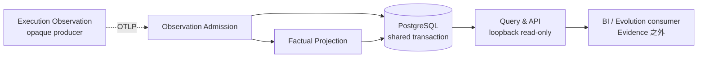
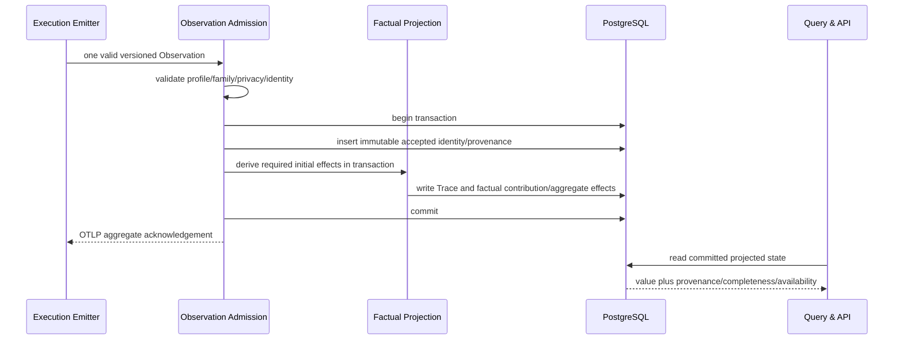

# Evidence System Design（中文翻译）

## 1. 元数据与权威性

| 字段 | 值 |
| --- | --- |
| 文档身份 | `evidence.identity.001` |
| 发布状态 | `WORKING_REVIEW_CANDIDATE`；先前已评审的 overlay 证据只适用于更早字节。这些已变更字节在作出任何精确发布 claim 前，需要新的确定性 parity/publication binding 以及用户或 reader review |
| 规范语言 | 英文 |
| 翻译 | 本文件是 [`evidence-system.md`](evidence-system.md) 的完整忠实非规范性翻译 |
| 上游权威 | [概念架构](../../agent-architecture.zh-CN.md) |
| 对等 owner | [Execution System Design](../execution/project-execution-system.zh-CN.md) |
| Observation meaning companion | [Observation Catalog](../../contracts/observation/observation-catalog.md)，明确不是已发布 physical Contract |
| Wire-profile companion | [OTel Observation Profile](../../contracts/observation/otel-observation-profile.md)，明确不是已发布 physical Contract |
| Interaction companion | [Execution–Evidence Interaction Contract](../../contracts/execution-evidence/interaction-contract.md)，明确不是已发布 physical Contract |
| Metric companion | [Metric Catalog](../../contracts/evaluation/metric-catalog.md)，仅是 human specification，不是 machine schema change |
| 已确认方向 | `EE-SKELETON`，SHA-256 `73b3481a099983b57ee9e1dd512c6ed23823f0d045085f9ef585db70be13949a` |
| 可行性 | SD-06 aggregate，SHA-256 `c70303892e2d68f95e83b12c84940d9f3e41dad6f7a1e269b376da69e4adbf6e` |

本文是 Evidence durable landing、accepted state、factual projection、read-only query API、lifecycle 与 local data-service deployment 含义的唯一语义 owner。Execution binding、Runtime lifecycle、custody 与 outbound emission 是 opaque producer concern，由对等 Design 拥有。Observation fact meaning 由 Observation Catalog 命名，exact wire mapping 由 OTel Observation Profile 拥有，transport interaction 由 Interaction Contract 拥有，human metric reading 由 Metric Catalog 拥有；本 Design 不复制 73-field registry、complete-shape rule 或 metric schema。

### Iteration 5 Task/Manifest projection 候选

2026-08-28 candidate 在不改变 Evidence truth/control boundary 的前提下扩展系统。一条 accepted Profile 2 `task.binding` owner record 原子创建 Task declaration、Delivery membership/guard、optional Task display name 与一个按 full Manifest digest keyed 的 immutable evidence-safe Delivery Manifest projection。Evidence 只通过 exact read-only Manifest-digest query 暴露该 projection；它绝不读取 Execution storage、repository configuration 或 Workflow sources，也不把 projection 当作 Metric Result 或 actual model use proof。

Projection 保留 Evolution 所需的 exact Workflow Package/Snapshot coordinates 与 admitted Role→Agent-Provider/LLM-route/model map，同时拒绝 credentials、endpoints、local/source paths、prompts、attachments 和 Provider-native configuration。它复用 accepted-record duplicate/conflict transaction 与 never-expire membership lifecycle。Evidence 保留已发布的 resource-granular Fact/Trace retention behavior；[`delivery-observation-lifecycle.zh-CN.md`](delivery-observation-lifecycle.zh-CN.md) 记录现有机制与独立的 Evolution-side expiry disposition，不新增 Delivery lifecycle API。Carrier、Task discovery/membership cutoff、Manifest shape/query 与 conformance rules 由 [`delivery-manifest-projection.zh-CN.md`](delivery-manifest-projection.zh-CN.md) 以及 `system-contracts/observation-task-binding`、`system-contracts/evidence-task-query` 下的 review candidates 共同闭合。这些在 Profile 2 与 Evidence Query 1.0 通过 lifecycle gates 前仍是 candidate bytes。Published Profile 1.0 与 Evidence Query 0.1 保持不变。

## 2. 上下文、问题与范围

Evidence 是面向技术成熟第一方用户的可选 loopback-only 本地数据 System。它接收 Execution 发出的 bounded OTLP observation，保存真实 causal/factual state，并向下游 BI 与 Evolution consumer 暴露唯一 read-only query API；它不托管 UI 或 presentation proxy。

目标不是建设通用 observability 或 evaluation platform，而是在接收 imperfect best-effort fact 时不破坏 accepted history、不制造 completeness 或 causality，并保持 external query boundary read-only。

范围包括：

- 一个 loopback-only Evidence data service 与一个仅内部可达的 PostgreSQL database；
- version/profile/family validation 与 content minimization；
- per-record partial admission、stable identity 与 first-write-wins；
- atomic acceptance 加 required initial Trace/factual projection；
- 显式 final/lower-bound/unavailable/not-applicable semantics；
- compatible factual aggregation 与 recorded causal relationship；
- 独立 Raw、accepted identity、Trace 与 factual projection lifecycle；
- 面向 committed fact 与 recorded Trace relationship 的 versioned、bounded、read-only query API。

非目标包括 execution control、Runtime/worktree access、grading/ranking/recommendation、causality inference、arbitrary telemetry storage、OTel Collector platform、accepted-only staging、queue/cursor/outbox、replay/recompute/correction、presentation-owned formula、remote/multi-user tenancy 或历史迁移。

## 3. 设计驱动与 Fitness Threshold

| 驱动 | 必需结果 | Evidence 机制 |
| --- | --- | --- |
| 缺失不等于零（`evidence.scenario.02`） | 只有 applicable final summary 证明 final zero/total | 每个 contribution/query 携带 completeness 与 population state |
| Stable identity（`evidence.scenario.03`） | identical retry 只贡献一次；conflict 不覆盖 | immutable content digest 与 first-write-wins |
| Atomic truth | 不得 accepted identity 缺 required initial effect，也不得 effect 缺 accepted identity | 每个 valid record 一个 PostgreSQL transaction |
| Compatible unit（`evidence.scenario.04`） | incompatible kind/unit-or-ISO-currency/source/source-ID/completeness/version 不聚合 | Projection-owned compatibility key 与 eligibility |
| Factual inspection（`evidence.scenario.05`） | trend 与 recorded edge，无 grading/inference | read-only API 与 explicit provenance/completeness |
| Non-control（`evidence.scenario.01`） | Evidence outage 不影响 Runtime result | 不向 Execution 提供 callback/receipt dependency |
| Local preview | 小型可信部署 | one loopback-only data service、internal PostgreSQL、无 UI hosting |
| Privacy | prohibited body 被拒绝/不保留 | profile validation、allow-list、bounded diagnostic/Raw |

concept.fixture.003 在一个 pinned environment 中确认 atomic/idempotent local PostgreSQL slice 与 read-only consumer。concept.fixture.002 确认 representative emitter/profile semantics；其 rebuilt evidence 在用户修正后的 evidence threshold 下验证 proposed local-Role/family-lineage pair，同时针对已被取代的 old-evidence-rehash condition 在程序上保持 `INCONCLUSIVE`。二者都不证明 production capacity、security、retention default、released physical Contract 或 implementation conformance。

## 4. 问题分解与结构

Evidence 分离三个内聚问题：

1. **Observation Admission** 决定什么可以 accepted，并协调 transaction。
2. **Factual Projection** 派生 owner-scoped causal/factual state 与 truth semantics。
3. **Query & API** 通过唯一 external read boundary 暴露 committed state，而不成为 fact writer。

Admission 与 Projection 是分离 semantic owner，但在同一 transaction 内协作；它们不是独立 network service。Query read-only。删除任一 Module 都会把 identity/privacy 分散到 projector、把 truth formula 分散到 dashboard，或把 causal/factual semantics 分散到 transport handler。

## 5. System Module

### Observation Admission（`evidence.milestone.01`）

Admission 校验 [OTel Observation Profile](../../contracts/observation/otel-observation-profile.md) 中的 exact supported OTLP Resource、InstrumentationScope、profile 与 Workflow-family coordinate；执行该 Profile 定义的 closed carrier/EventName/attribute registry 与 content minimization；解析 stable record identity；检测 duplicate/conflict；隔离 invalid sibling；协调 Projection；并按 [Execution–Evidence Interaction Contract](../../contracts/execution-evidence/interaction-contract.md) 报告 standard OTLP aggregate success 或 partial success。Technology-neutral fact meaning 与 semantic owner 位于 [Observation Catalog](../../contracts/observation/observation-catalog.md)；本 System Design 拥有 Evidence validation 与 durable landing meaning，不拥有 duplicate wire registry。

Admission 的 accepted/duplicate/conflict/rejected disposition 是 internal per-record decision，用于保护 accepted state 与 projection。它不会作为 external ingest response payload 序列化。

它是 immutable accepted identity/provenance 与任何 bounded Raw-debug lifecycle 的唯一 writer。Event identity 是 `agentops.event.id`；Span identity 精确为 `(trace_id, span_id)`，绝不是其中任一 component。Admission 把任一 identity 绑定到 canonical accepted-content digest。对 review-family record，它在协调 Projection 前校验 exact shape、closed C17/C27 applicability、`(C18,C51)` assertion invariant 与 C18→C51 binding、target-edge compatibility、status identity 和 Fix/Recheck endpoint。它拒绝 unsupported pin/Scope/family、unlisted 或 wrong-family attribute、invalid type/enum、prohibited content、incomplete Role-lineage，以及任何不满足这些规则的 `review.finding`/`review.summary`。Empty/over-limit/prohibited Finding summary、unknown target kind、invalid target-Artifact applicability 与 missing/equality-mismatched endpoint 都拒绝，且不 partial project assertion/edge/status/relationship。`role.lineage` Event 只有同时包含 version-local `agentops.role.id` 与 family-scoped `agentops.role.lineage.id` 才 valid；unknown/not-applicable lineage 由该 Event 缺席表示，不合成 value。只有 accepted row 和每个 required initial projection effect 一起 commit 后，record 才是 accepted。Admission 不重新解释 Runtime outcome，也不调用 Execution。

Admission 只从 logical record 决定 C17。ordinary/Recheck summary 上，present C17 必须是 nonnegative integer，并选择 counted form；absent C17 选择 valid no-observed-count-fact form。它不能也不会因“producer reported but omitted”而 reject absence。Finding shape 上的 C17、invalid present value 或其他 malformed shape 以 zero accepted Review/count effect reject。

### Factual Projection（`evidence.milestone.02`）

Projection 从每个 accepted Span tuple 派生一个 normalized Trace node，并拥有 distinct durable landing：immutable Finding assertion/scope `(C18,C51)`、order-independent target edge、append-only status contribution `(C18,C51,C12)`、target-specific Fix relation 与 target-specific Recheck relation。Compatible lifecycle record 对 existing assertion/edge 执行 no-op reuse，同时在 Admission transaction 中把 new status/Fix/Recheck contribution exactly once append。Projection 还拥有 recorded Trace edge、Artifact/Invocation/Role 与 local-Role-to-family-lineage relationship、completeness-bearing family contribution 与 compatible aggregate。它原样存储 C50，绝不 generate、grade、rewrite 或 infer；它暴露 recorded status 与 provenance，不拥有 mutable current-status winner。

对于 accepted summary，present C17 landing 一个 exact value 的 observed-count contribution；`0` 是 factual zero。Absent C17 不 landing count contribution，也不 synthesize zero 或 `UNAVAILABLE`。Review/Recheck effect set 与任何 present count 原子 commit。

Projection 只在 Admission transaction 内写 owner-scoped state。它绝不编辑 accepted observation、推断 unrecorded causality、给工作评分，或使用新公式 recompute history。

### Query & API（`evidence.milestone.03`）

Query 返回携带 provenance、completeness、availability、compatibility coordinate 与 expiry state 的 committed factual series 和 recorded Trace relationship。它只从 accepted C17=`0` 显示 observed zero；absence 表示无 observed-count fact，绝不表示 zero。它不拥有 domain fact。Versioned API 是唯一 external read boundary，全部 BI 与 Evolution consumer 经它访问。Consumer dashboard 与 UI logic 不得定义 Metric formula、重写 completeness 或推断 causality。

Evidence data service 只把 ingest/query endpoint 绑定到 loopback，且不托管 user-facing listener、UI、Grafana 或 same-origin presentation proxy。PostgreSQL 没有 externally reachable listener。Query endpoint 依构造保持 read-only，不暴露 raw accepted table 或 write operation。

## 6. 成功 Admission 与 Projection

一个 valid new Observation 的 branch-free core 是：

Commit 前不存在可见 accepted state。Projection effect 不得缺少其 accepted authority。External response 是 Evidence ingest 的 aggregate acknowledgement，绝不是 execution outcome，绝不是 per-record disposition label，也绝不是 Execution progress prerequisite。

## 7. Duplicate、Failure 与 Retention 场景

### Batch sibling isolation（`evidence.path.04a`）

每条 record 独立校验。Valid sibling 可以 commit，invalid sibling 被拒绝。OTLP response 只报告 standard aggregate success 或 partial-success result，带 bounded rejected count/reason；不会创建 all-or-nothing batch transaction，也不暴露 internal per-record disposition label。

### Identical 与 conflicting retry（`evidence.path.04b`）

对于 Event，相同 `agentops.event.id` 加 digest 在内部是 duplicate/already accepted 且不 mutation；该 Event ID 下 conflicting content 在内部被拒绝。对于 Span，相同 `(trace_id, span_id)` 加 digest 是 no-op，不产生第二个 Trace node/effect；该 tuple 下 conflicting accepted content 在内部被拒绝，且不覆盖第一个 Trace node。不同 Trace 中相同 `span_id` 不冲突。任何 retry 都不再次 contribution，external response 仍是 standard OTLP aggregate result。

对 Finding，`(C18,C51)` 是 assertion identity，且 C18 first-binds C51；target 与 lifecycle fact 必须匹配 exact OTel Profile invariant subset。Changed C50/C20/invariant，或 same C18 changed C51，在添加 even a new target 前就 reject。`(C18,C51,C52,C53,C54-or-absent)` 是 target-edge identity。Compatible assertion/edge reuse no-op；distinct compatible target 任意顺序 insert once。Status、target-specific Fix 与 target-specific Recheck contribution 使用各自 OTel Profile §7.4 identity。Valid lifecycle record 在复用 assertion/edge 的同时原子 append new contribution；任一 endpoint/conflict failure 全部不创建。

### Ambiguous commit response（`evidence.path.04c`）

若 PostgreSQL 已 commit，但 App 或 response path 在 acknowledgement 前失败，后续 same-identity request 在内部收敛到 duplicate/already accepted。不需要 queue、replay worker 或 compensation，external response 不携带 per-record duplicate label。

### Statement/process/database failure（`evidence.path.04d`）

Commit 前失败会 rollback accepted identity 与所有 initial effect。后续 same-identity request 是 new。Reader 只能看到无状态或 complete slice，绝不会看到 half-state。

### Sampling 或 emitter loss（`evidence.path.03`）

缺失 detail 不能被解释为无活动。Independent sampling decision 与 completeness state 区分 unavailable、lower-bound 与 final data。Evidence 不从 dashboard 或 Runtime state 重建丢失事实。

### Retention（`evidence.path.05`）

Raw debug data 可以最先 expire。Accepted identity/provenance 保持 immutable。Trace detail 可独立 expire，之后 query 显示 detail unavailable。Factual contribution/aggregate 可继续用于 trend。Retention 绝不把 lower-bound/unavailable 变成 final，也绝不 recompute old fact。

## 8. 数据、状态、身份与 Ownership

| 数据类别 | Unique writer | 含义 | Lifecycle |
| --- | --- | --- | --- |
| Raw debug payload | Admission | bounded diagnostic aid，绝非 authoritative fact formula | finite/optional；可独立删除 |
| Accepted identity/provenance | Admission | immutable first accepted Event ID 或 Span `(trace_id, span_id)` tuple、canonical digest 与 profile/family provenance | 作为 Evidence authority 保留 |
| Trace node/edge/link | Projection | 仅 recorded causal structure | 可独立 expire |
| Finding assertion/scope | Projection | `(C18,C51)` 加 immutable C13/C14/C15/C20/C49/C50；original C28/C29 与 Invocation/Role 保持 source provenance；C18 first-binds C51 | first-write；compatible reuse no-op；不 rewrite/infer |
| Finding target edge | Projection | `(C18,C51,C52,C53,C54-or-absent)` typed relation | append/first-write；order-independent；compatible reuse no-op |
| Finding status contribution | Projection | `(C18,C51,C12)` 加 C19/current Invocation/Role provenance | append-only；无 mutable-current winner 或 overwrite |
| Fix 与 Recheck relation | Projection | target-specific `(assertion,target,C21)` 与 `(assertion,target,C23)` contribution 及 exact endpoint | append-only；与 accepted lifecycle Event atomic |
| 其他 factual contribution | Projection | 携带 compatibility coordinate 的 versioned value/status | append/first-write semantics；不 rewrite |
| Compatible aggregate | Projection | eligible compatible contribution 的合并 | 仅随相同 semantic accepted contribution 演进 |
| Query representation/version | Query & API | read shape 与 compatibility coordinate，不是 fact authority | 可 version 且不 rewrite fact |

对于 C55、C56、C57，Evidence 只拥有 exact owner-supplied value 与 provenance 的 admission、storage 和 factual projection。它绝不从 timestamp 计算 elapsed time，不从 observed event 推断 reached-stage order，不把 model request/response alias 转成 canonical model，也不 backfill 缺失的 owner fact。Missing 保持 unavailable。C57 只在 model-call Span 上 admission，并同时具备 provider、local Role、C06 Runtime root binding 与 Span identity tuple。

Stable Observation identity 区别于 Delivery、Trace、Span、task、Workflow、implementation、Runtime、Manifest 与 Artifact identity。Accepted content 携带 required relationship；不得从 display grouping 推断。

Completeness value：

| State | 含义 | 数值解释 |
| --- | --- | --- |
| `FINAL` | 观察到 applicable final summary | 显式报告时零有效 |
| `LOWER_BOUND` | 有 observed detail，但无完整 applicable summary | 数值仅为 lower bound |
| `NOT_APPLICABLE` | family/metric 不适用 | 无数值 |
| `UNAVAILABLE` | sampling/loss/missing summary 阻止结论 | 无数值 |

Compatibility 使用 semantic identity/version、measurement kind、C43 unit（money 时即 ISO-4217 currency）、source、source identity 与 completeness。Incompatible group 保持分离。

Accepted carrier-to-state mapping：

| Accepted carrier | Evidence-owned durable meaning |
| --- | --- |
| Resource 与 exact Scope/profile/family version | immutable producer/profile/scope/family provenance 与 validation coordinate |
| root/nested Span、parent 与 link | `(trace_id, span_id)` first-accepted identity 加 canonical digest；一个 normalized Trace node/edge/link；identical duplicate no-op；conflict rejection；independently expirable detail |
| Event ID 加 canonical content digest | 独立的 first-accepted Event identity；identical duplicate no-op；conflicting duplicate rejection |
| Delivery/review/test/intervention/family Event | 携带 explicit completeness/applicability 的 versioned factual contribution |
| complete Review/Finding base+variant | 只在所有 base 与 variant endpoint 校验后，原子 landing immutable Review/Finding/content/scope/target/Artifact/Fix/Recheck/Invocation graph；不从 name/order/grouping 推断 |
| `role.lineage` local/lineage pair | 在 profile/family semantic version 下，从一个 version-local Role ID 到一个 family-scoped lineage 的 immutable mapping；relationship endpoint 继续是 local ID |
| standard GenAI token field | standard token contribution；missing 为 unavailable |
| native `usage` Event | 按 profile/family semantic version、kind、exact C43 unit（money 时即 currency）、source、source ID 与 completeness 建立 contribution；无 conversion 或 catalog-derived money |
| 携带 unsampled context 的 `sampling.decision` | population/availability evidence；不合成 Span 或 zero |
| Raw OTLP | optional bounded debug state，default 在 successful import 后删除；绝非 formula authority |

Token 与 native usage 保持为不同 semantic family。Compatible aggregation 要求 identical profile/family semantic-version/kind/C43-unit-or-currency/source/source-ID/completeness coordinate。Premium request 与其他 provider-native unit 和 ordinary request/credit 保持不同。`FINAL` 可以证明 explicit zero；`LOWER_BOUND`、`NOT_APPLICABLE` 与 `UNAVAILABLE` 不具有可互换 numeric meaning。

## 9. Interface、Seam 与 Error

| Interface | Input | Result/error | 不变量 |
| --- | --- | --- | --- |
| `ingest` | bounded supported OTLP batch | standard OTLP success 或 partial-success aggregate，带 bounded rejected count/reason | 不是 execution outcome；无 per-record response vector；sibling 独立 |
| `admit-record` | validated version/profile/family/identity candidate | internal accepted、duplicate、conflict 或 rejected disposition | acceptance 加 required effect 原子化 |
| `project-in-transaction` | 一个 validated observation 与 transaction authority | owner-scoped Trace/factual change | 不 accepted mutation 或 external side effect |
| `query-facts` | bounded filter/pagination | 携带 provenance/completeness/compatibility 的 value | 只读 committed state；无 hidden formula |
| `query-trace` | Delivery/Trace filter | recorded node/edge 或 explicit expiry/unavailable | 无 causal inference |
| `expire` | owner-authorized data class 与 policy/version | class-specific removal result | accepted/factual authority 不被静默耦合 |

PostgreSQL 是 Admission 与 Projection 共享的 local-substitutable internal seam，不是 external public Interface。`query-facts` 与 `query-trace` 构成唯一 external read boundary；全部 BI 与 Evolution access 经它们完成。`expire` 归 Query & API，作为 data-service operation 管理四类独立 lifecycle。不存在指回 Execution 的 Interface。

## 10. Consistency、Failure 与 Security Behavior

Transaction boundary 是 per valid record，不是 per batch。First accepted write wins。普通 retry 安全，因为 identity 与 content digest 决定 duplicate 还是 conflict。当 uniqueness 与 transaction ownership 执行不变量时，`READ COMMITTED` 足以支持已经测试的本地设计；physical implementation 必须发布并验证其 exact schema/constraint。

Data service containment protocol/validation error，返回 bounded reason 而不存 prohibited body。Database refusal 使 record unaccepted；不影响 Execution。首个 local-only release 的 loopback ingest/query endpoint 不使用 application-level authentication。此信任选择不产生 consumer database path：PostgreSQL 仅内部可达，query 无 write route。内部 read-only inspection 与 backup 使用独立 least-privilege read-only database role；restore 与 migration 使用另一个受控、可写的 operational role。任何 remote/public listener 必须先重开 security design。

Backup/restore、任何扩展 trust boundary 的 TLS/auth、operational credential 与 production migration 仍属于下游。任何 remote/multi-user exposure 都是 scope change，并重开 security/deployment design。

## 11. 质量实现

| 质量 | 机制 | 取舍/残余风险 | 验证 |
| --- | --- | --- | --- |
| Truthfulness | explicit completeness/applicability/provenance | query 比 bare total 更冗长 | missing/final-zero/lower-bound fixture |
| Consistency | one transaction、uniqueness、first-write-wins | synchronous projection 增加 admission work | crash/COMMIT ambiguity/concurrency fixture |
| Reliability | idempotent retry、sibling isolation | sender 可能收不到 final acknowledgement | fresh-process retry convergence |
| Privacy | supported profile allow-list 与 bounded Raw | 有意缺少有用 debugging content | prohibited-marker scan 与 raw-access denial |
| Security | loopback-only data service、无 external PostgreSQL、read-only API | 仅 trusted local preview | listener/API-method/credential/negative reachability test |
| Maintainability | 三个 deep Module 与 unique writer | transaction choreography 集中在 Admission | Interface-level test 与 ownership scan |
| Operability | explicit partial success、drop/error、retention visibility | 不保证 ingestion | bounded operational metric/log 下游完成 |
| Resource efficiency | one data service/PostgreSQL；现有 automatic、bounded、resource-class retention | capacity/default 未证明 | workload 与 retention measurement 下游完成 |

## 12. 风险与取舍

| 风险 | 影响 | 处理 | 重开条件 |
| --- | --- | --- | --- |
| accepted/projection split | Evidence 内部虚假 | one transaction；无 accepted-only stage | implementation 需要 async repair/replay |
| bad first accepted fact | immutable error 保留 | conflict rejection；新 semantic identity/version | correction/recompute 成为产品要求 |
| consumer formula drift | 竞争 fact authority | Projection-owned eligibility；versioned read-only API | consumer 必须计算 domain formula |
| best-effort loss | trend/Trace 不完整 | explicit missingness 与 population | 产品要求 complete guaranteed telemetry |
| retention misread | expired detail 被误认为 absent event | explicit availability/expiry state | lifecycle 必须重建或 rewrite history |
| local trust expansion | 未授权 raw/write access | loopback-only API、无 database consumer path、分离的 least-privilege role | 需要 remote/multi-user exposure |

## 13. 验收与验证

| 场景 | 预期结果 | 机制 | 证据 |
| --- | --- | --- | --- |
| valid record | accepted identity 与 required effect 同时可见 | one transaction | concept.fixture.003 atomic slice |
| invalid sibling | valid sibling commit；invalid 不存任何内容 | per-record admission | concept.fixture.003 partial sibling case |
| Event duplicate/conflict | Event ID/digest 下无 overwrite 或 double contribution | Event first-write identity | concept.fixture.003 duplicate/concurrency case |
| Span duplicate/conflict | 相同 `(trace_id, span_id)` 加 digest 只有一个 node/effect；conflict 拒绝；不同 Trace 的相同 Span ID 保持不同 | Span tuple first-write identity 与 atomic Trace projection | deterministic new/identical/conflicting Span example；implementation fixture 下游完成 |
| COMMIT response loss | retry 收敛到一个 complete slice | first-write-wins idempotency | concept.fixture.003 ambiguity case |
| final zero/lower-bound/unavailable | query result 分离 | Projection-owned completeness | concept.fixture.003 truth fixture |
| incompatible unit/source | 分离 group | compatibility key | concept.fixture.003 grouping case |
| Resource-class expiry | 保留 identity/provenance 与 explicit Fact/Trace expiry state；只剩部分 detail 时 Trace 可为 `PARTIAL` | 现有 bounded physical scrubbing；无 Delivery-atomic GC | published Query expiry/retention corpus 加 Evolution consumer-disposition fixtures |
| read-only consumer | bounded API read 成功；raw/database/write route denied | read-only API 加 least-privilege internal operations | concept.fixture.003 permission evidence；API negative 下游完成 |
| local access profile | loopback ingest/query 在无 app auth 下工作；不暴露 UI 或 database listener | 固定 loopback data-service topology | 下游 listener、method、route 与 negative reachability test |
| exact profile admission | 接纳 exact pin/Scope、十个 EventName 与 57 common 加 applicable 10 或 6 family field；拒绝 sibling-family/unlisted/fixture-only field | OTel Profile-linked closed validator | deterministic 57+10+6 count/unique/table-shape check 加 concept.fixture.002；machine validator/conformance 下游完成 |
| complete Review/Finding composition | ordinary Finding、Fix、Recheck-on-Finding 与 Recheck-summary 只从 exact complete shape landing | OTel Profile §7.4 named base/variant 与 record-level atomic projection | positive shape 加 missing-base/endpoint negative fixture |
| C17 report presence | ordinary/Recheck summary 的 C17=`0`、positive C17 与 absent C17 分别 landing recorded zero、recorded positive 与 no count；invalid present value 或 Finding 上 C17 以 no partial Review/count state reject | Admission 可见的 field-presence selector；atomic Review/count projection | bilingual zero/positive/absence/retry positive 与 type/range/carrier/partial-state negative |
| bounded Finding/target admission | source-lens summary nonempty/bounded/privacy-safe；每 record 一个 typed target；multi-target set order-independent 且 duplicate-safe | C50–C54 validation 与 target-edge identity | positive multi-target 加 empty/over-limit/prohibited/unknown-target/duplicate/conflict fixture |
| Finding lifecycle identity domain | compatible target/lifecycle record 对 assertion/edge no-op reuse，并把 status/Fix/Recheck exactly once append；changed C50/C20/C51、target context、lifecycle endpoint、C17/C27 applicability、Event content 或 partial landing 都以 zero effect reject | separate OTel Profile identity 加一个 Admission transaction | OTel Profile §7.6 全部 positive/negative sequence、两种 arrival order 与 EN/ZH parity |
| native usage admission | credit/request/premium/provider-native/money example 除非所有 compatibility coordinate 相同，否则保持 separate | exact kind/C43-unit-or-currency/source/source-ID/completeness key | incompatible-group example 与下游 fixture |
| Role lineage admission | 不同 local ID 可共享一个 lineage；相同 display name 可保留 distinct lineage；incomplete pair 拒绝 | atomic admitted local/lineage pair 与 immutable mapping | concept.fixture.002 rebuilt protobuf/admission/duplicate/conflict evidence；`PROPOSED_VALIDATED_BY_SPIKE` |
| disposition exclusion | 首个 profile 不接纳 `delivery.disposition` 或 `agentops.delivery.disposition` | ten-EventName/73-total-field allow-list | registry 与 negative fixture scan |

Design acceptance 要求无需读取 Execution internals 即可实现本文，同时 ingest semantics 与 peer Design/frozen Contract 一致。Local-access acceptance 是 categorical：application-level authentication 只在 loopback-only ingest/query preview 上缺席；不暴露 UI、presentation proxy、database listener、raw route 或 write route。Remote 或 multi-user exposure 将重开 security design。Production schema、migration、security、capacity 与 physical conformance evidence 仍属于下游。

## 14. 决策与下游义务

唯一 owner-complete downstream obligation register 是 [Concept §8](../../agent-architecture.zh-CN.md#ee-concept-8)。下表只是 `concept.obligation.001,004,006..008` 的 local non-owning view；Concept register 中的 owner、current/required evidence、exact return 与 reopen field 为准。

Evidence 应用 `concept.decision.001`,`002`,`005`–`007`,`009`,`012`,`013`,`020`。拒绝方向包括 combined Execution/Evidence process、arbitrary telemetry lake、Collector-first topology、accepted-only staging/outbox、replay/recompute/correction、presentation formula、coupled retention、grading/inference、direct Grafana/PostgreSQL exposure 与历史迁移。

| Obligation ID | Local summary | 所需证据 | Return/reopen condition |
| --- | --- | --- | --- |
| `concept.obligation.001` | physically publish 已采纳 Observation Catalog、OTel Profile 与 Interaction proposal | machine schema/package、encoded common/family registry、physical limit、complete-shape/multi-target/privacy/Span/usage fixture、validator 与 version/partial-success rule | representation 不能保留 complete Review/Finding composition、bounded content/target edge、carrier、lineage、usage、Span identity、truth、privacy 或 interaction semantics 时返回 |
| `concept.obligation.004` | production Evidence data service（admission/projection/query API/retention）加 internal PostgreSQL | code、migration、complete-shape rejection、Finding target dedup/conflict、ambiguity/idempotency/query/permission/backup fixture | partial graph、mutable content/edge、duplicate target、inference、external exposure 或 topology change 时重开 |
| `concept.obligation.006` | Evidence lifecycle validation | bounded workload、growth/query/expiry/retention/backup measurement | 只有 lifecycle meaning、ownership、topology 或 Interface 改变时重开 |
| `concept.obligation.007` | public Evidence repository/submodule | repository identity、exact commit、build/test/release 与 parent-link proof | duplicate authority、unpinned code 或 cross-repository transaction 时重开 |
| `concept.obligation.008` | MIT vs Apache-2.0 decision | dependency/right/patent/NOTICE review 与 approval | 两种允许 license 都不兼容时重开 |

任何当前 prototype、legacy bundle、split draft companion、human metric specification 或 Contract draft 都不能证明 physical conformance。

## 15. Module Deepening 与 Handoff

Detailed design 顺序是 Observation Admission、Factual Projection、Query & API。先冻结 validation/idempotency/transaction choreography，再冻结 causal/factual ownership 与 eligibility，最后冻结 read shape 与 deployment access。Module Interface 是 test surface；database、decoder、clock 与 retention scheduler 保持 internal seam。

Implementer 不得把 missing 解释为 zero、把 duplicate 当作 overwrite、把 conflict 当作 correction、把 `span_id` 单独当作 global identity、把 Trace expiry 当作 event absence 或 replacement、把 task grouping/order/name 当作 causality 或 relationship、把 Role name 当作 lineage、把 relationship endpoint 当作 lineage identity、把 incompatible native unit 当作 additive、把 Grafana SQL 当作 Metric authority、把 successful Evidence response 当作 execution success、把 Metric Catalog 当作 machine schema，或把任何 split draft companion 当作 published physical Contract。Physical table/index/limit/default 与 validator implementation 仍属于下游；admission identity、relationship graph、compatibility 与 carrier-to-state mapping 不属于下游重新选择。
