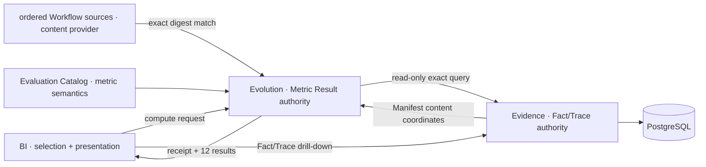

# Evolution System — Iteration 5 Detailed Design Candidate

> **Status:** Wave5 implementation design, 2026-08-28. English is the candidate normative text; the tracking Chinese companion is [`evolution-system.zh-CN.md`](evolution-system.zh-CN.md). The owner-approved [Metric Catalog 2.0 review candidate](../../contracts/evaluation/metric-catalog-2-candidate.md) is the active implementation target; it is not yet a published Contract.

## 1. Authority and purpose

Evolution is the sole Iter5 runtime authority for the 12 Metric Results in the `agentops.evaluation.metric-catalog@2.0.0` review candidate. Published 1.0.0 remains immutable history and is not silently rebound.

- Evidence owns accepted Facts, recorded Traces, Task membership, and evidence-safe Delivery Manifest projections. Evolution reads them through Evidence Query and never accesses PostgreSQL or Execution storage.
- Evaluation is the metric conceptual Contract. It is not a deployable runtime component.
- Evolution resolves a BI-supplied `EvaluationSelection`, computes every published metric in Python, and returns a `ResolvedEvaluationContext` receipt with a `MetricResultSet`.
- BI presents Metric Results and may query Evidence directly for Fact/Trace drill-down. BI does not compute a metric, create a Fact, or write a Metric Result.
- Evolution is stateless. A compute request creates no durable server resource and writes neither Evidence nor a database.



## 2. Confirmed cross-system semantics

### 2.1 Task identity, presentation, and membership authority

Task selection is a resolved product decision, not an open architecture blocker:

- The user explicitly chooses whether a Delivery starts a new Task or reuses an existing Task. New Task is the default; the system must not infer reuse.
- Execution creates or accepts the exact `task_id`, and Observation carries that binding through the telemetry contract.
- Evidence owns the accepted Task declaration and Delivery-to-Task admission/membership projection. It exposes exact Task filtering and a bounded Task-list query for BI.
- `task_id` is the stable, unique selection and deep-link identity. A separate optional `display_name` is human-readable presentation metadata. BI displays `display_name` when non-empty and falls back to `task_id` only when no name exists. Names never replace IDs in requests, receipts, membership, URLs, or equality checks.
- Evolution resolves the selected Task population from Evidence and binds the exact resolved membership in the response receipt.

For Catalog §6.2, Evolution materializes those accepted declarations and memberships at the side's declared logical `as_of` into one receipt-bound immutable defined-task reading. “Immutable” describes that resolved response input; it does not create a second manifest or transfer Task authority away from Evidence.

The current published contracts do not yet encode this complete path. Recording it in the applicable contract revisions is later authorized contract-alignment work (planned for Wave4), not a remaining owner decision or a reason to invent a second Task authority.

### 2.2 Final stability and resolved Evidence read sets

Observation and Evidence require eventual final stability, not transaction-wide simultaneity across Fact and Trace routes. During ingestion, a repeated unresolved selection may legitimately observe more accepted records. While no new Observation or Task membership is accepted and required data has not entered retention expiry, the same settled selection converges to stable query results.

- Each Evidence traversal retains its existing route-local cursor/snapshot consistency rules.
- Evolution must fully traverse each bound query without silently restarting a cursor or presenting a partial traversal as complete.
- `ResolvedEvaluationContext` binds the exact resolved Evidence read set used for that response: canonical query coordinates, resolved population and input/provenance identities, plus their completeness and expiry state. It does not claim one cross-signal database transaction snapshot.
- `delivery_id` groups records into a Delivery trajectory. Where a metric must associate values with one particular model call, the exact Span identity `(trace_id, span_id)` performs that join; Delivery identity alone is not sufficiently specific.
- No new cross-route snapshot mechanism or additional final-stability oracle is introduced. Existing identity, duplicate/conflict, pagination, completeness, retention, and expiry conformance rules apply to the extended projections.

Resolver safety bounds are runtime configuration, not new Contract maxima. Wave 5 defaults are 500 unique Deliveries per side, 20 pages per Task/Facts/Traces traversal (4,000 items at the 200-item page size), 100,000 combined Fact and Trace input records per side, and a 120-second side deadline. A repeated cursor or exceeded bound fails that side non-retryably as `RESOLUTION_BOUND_EXCEEDED`; COMPARE still preserves the successful side. Load tests may revise these configured defaults without changing metric semantics or silently truncating a result.

The Iter5 physical mapping reads native operational Span measurements from recorded Trace NODEs. A future contract may additionally project metric-readable Facts, but that is not required by this design and cannot silently replace the exact model-call or lifecycle semantics.

### 2.3 Manifest and Workflow content resolution

The Task binding and Workflow-template paths are also closed:

- the admission-time `task.binding` atomically supplies Task membership and an immutable evidence-safe Delivery Manifest projection;
- Evolution queries that projection by exact Manifest digest and verifies its Delivery/Task identities;
- the projection supplies exact Package and Workflow Snapshot content coordinates plus the admitted Role→Agent-Provider/LLM-route/model map;
- Evolution resolves Package/Snapshot bytes against a non-empty ordered list of user-configured public GitHub sources, accepting only the first candidate whose name, exact version, Package digest, Workflow identity/version, and Snapshot digest all match;
- source URL/order is provenance, not equality authority. `name@version`, latest, a local checkout, Execution's source, or current repository configuration cannot substitute for the expected digests;
- the Manifest's Snapshot/Role-prompt identities are sufficient for exact event-time Role-template cohort equality. Missing external Workflow bytes degrade only readable template enrichment; they do not change a settled Metric Result. Actual Role/model metrics continue to use recorded C30/C57 Span tuples.

Execution requires exactly one Workflow source to admit new Deliveries; Evolution requires several ordered sources because one selected Task population may include Deliveries created from different repositories or forks. The exact algorithm, bounds, failure reduction, and receipt diagnostics are owned by [`workflow-source-resolution.md`](workflow-source-resolution.md). The portable carrier/query is owned by [`delivery-manifest-projection.md`](../evidence/delivery-manifest-projection.md).

## 3. Public compute model

The public surface is a closed, versioned, side-effect-free `POST /api/evolution/v1/evaluations:compute`. POST is used because selections and receipts are structured and bounded, not because computation mutates server state. A retry with the same settled Evidence is idempotent in meaning.

- `api_version` must equal `1`; unknown fields and variants are rejected.
- `SINGLE` contains exactly one `selection`; `COMPARE` contains independently supplied `left` and `right` selections.
- Each `EvaluationSelection` contains `selection_version: 1` and 1–24 duplicate-free exact `task_ids`, sorted canonically by Evolution. This is the closed count cap; BI independently enforces an 8 KiB limit on the complete percent-encoded URL because legal 128-character IDs may expand during encoding. It may carry only later-published closed filter fields; `display_name`, aliases, metric IDs, layout, and visualizer state are forbidden.
- A selection describes a population query, not a set of metrics.
- Evolution always evaluates the exact 12-coordinate candidate catalog bound to the API revision.
- A receipt is returned with the response; no prebuilt read-only manifest exists.
- Repeating an unresolved selection may observe newly accepted Evidence. Once reporting has settled, active Evidence is finally stable; a later retention transition may intentionally produce `EXPIRED` or `UNAVAILABLE` instead of the former result.

The response uses a tagged side union: `side_result={receipt, metric_results[12]}` or `side_error={code,retryable,detail}`. `SINGLE` succeeds only with one `side_result`. A full `COMPARE` has two side results and one Delta entry for every exact metric/slice identity in the union of both sides. `PARTIAL_COMPARE` has one of each side tag and one `SIDE_UNRESOLVED` Delta entry for every slice known from the successful side; the failed side cannot supply slice keys. Twelve is the fixed Metric Result coordinate count, not a fixed Delta-entry count. A metric-level absence never removes an item from a successful side result.

```json
{"api_version":1,"mode":"SINGLE","selection":{"selection_version":1,"task_ids":["task-a","task-b"]}}
```

```json
{"api_version":1,"mode":"COMPARE","left":{"selection_version":1,"task_ids":["task-a"]},"right":{"selection_version":1,"task_ids":["task-b"]}}
```

## 4. Selection resolution

The intended fail-closed pipeline is:


No stage may use a display name as identity, an alias, ambient latest value, recency lookup, inferred Task membership, cursor restart, or partial traversal presented as complete.

At side-resolution start, Evolution declares one logical evaluation `as_of` cutoff and applies it to Task membership and terminal/cohort readings. It is the Catalog §6.2 cutoff, not an Evidence snapshot token. Each `/facts` or `/traces` traversal still obtains only its own route-local consistency coordinate; those tokens neither create nor approximate a shared cutoff/snapshot.

For each selected `task_id`, Evolution resolves the exact Task declaration, all accepted Delivery memberships, and each exact Manifest projection at that logical cutoff, then materializes that side's immutable defined-task reading. Missing identity/membership/Manifest is excluded or withheld with its typed metric-specific reason; external Workflow content is optional enrichment and never formula input. Any member Delivery without an explicit terminal Delivery Summary makes the Task open; conflicting terminal outcomes make it mixed. Trace closure, timestamps, and arrival order never establish Task termination. Later reuse of the same Task may add a Delivery to a later read set, but cannot rewrite an already returned receipt.

## 5. ResolvedEvaluationContext

The closed receipt shape contains:

| Field | Meaning |
|---|---|
| `context_version` | exact receipt schema revision |
| `selection` | canonical `EvaluationSelection`; exact IDs only |
| `as_of` | Evolution's declared logical Evaluation Catalog cutoff; applied to membership/terminal/cohort readings and distinct from every route snapshot token |
| `resolved_at` | response-resolution completion time for operator diagnostics only; it does not participate in membership, metric, ordering, or causality readings |
| `task_population` | sorted active Task identities, optional display metadata, exact active Delivery memberships, Manifest digests, and terminal readings; deleted Delivery membership is absent from ordinary Query 1.0 and never reconstructed |
| `catalog` | exact Catalog coordinate, semantic digest, and bound Observation dependency |
| `evidence_bindings` | Evidence Contract/profile/read-model coordinates and one entry per route traversal: route, canonical filter, route-local snapshot/cursor coordinate, completion state, and error/expiry state |
| `input_refs` | sorted exact Fact and Trace/Span identities read at or before `as_of`, with accepted provenance references; this audit read-set includes expired inputs retained in the receipt and does not imply every reference contributed to a calculator |
| `workflow_resolutions` | one entry per unique Manifest content coordinate: Evidence projection provenance, expected Package/Snapshot digests, resolution state, matched source provenance when available, and bounded failed-attempt reasons |
| `population_state` | complete/partial/open/mixed/expired classifications without collapsing their reasons |

The receipt is the audit record for one response. It is not an input manifest, durable server resource, anti-forgery credential, deep-link requirement, or claim of a cross-route transaction snapshot. BI may display/copy it, but re-opening a selection asks Evolution to resolve a current receipt.

Canonical ordering is bytewise over stable IDs and exact coordinates; array order from Evidence does not carry meaning. The receipt reuses published Evidence identities/digests where available and does not introduce a second global snapshot digest or a new Oracle.

## 6. MetricResultSet and compare

- Every successful side resolution contains exactly the 12 candidate metric coordinates; no missing or additional coordinate is accepted silently. Individual entries may be withheld without failing the other 11.
- Each result separates value truth, unit/compatibility coordinates, numerator/denominator or contributing count where published, coverage, exclusions, missing inputs, provenance references, uncertainty, and forbidden readings.
- Coverage remains visible when minimum sample withholds a value.
- Explicit zero, missing, lower bound, not applicable, incompatible, and transport/service error remain distinct. Evidence Query 1.0 resolves only active Delivery membership; terminal TTL deletion atomically removes the deleted Delivery's membership and inputs before Evolution can select a population. Evolution therefore applies no retention reconstruction or per-resource expiry gate. An active Delivery with missing/invalid required input remains a metric-specific coverage gap; a deleted Delivery enters neither numerator, denominator, coverage nor minimum-sample count. If no active Delivery remains, the result population is empty.
- Compare resolves both sides separately. Evolution returns Delta only for the same metric coordinate with compatible kind, unit, and required coordinates; otherwise it returns a typed withheld reason.
- Before and After are Metric Results. Delta is an Evolution-derived comparison result, never a BI calculation.

Each `MetricResult` has one closed multi-slice shape. Scalar metrics contain one slice with an empty canonical dimension map; multi-output metrics contain one slice per exact candidate outcome, stage, token direction, model/Role cohort, or Usage kind/unit/source/source_id key. No mixed truth is collapsed into a top-level scalar:

| Field | Rule |
|---|---|
| `metric` | exact ID/version/catalog coordinate; no alias |
| `slices[]` | canonically sorted by `slice_key`; duplicate keys invalid |
| `slices[].slice_key` | closed exact dimension map that identifies the published measure/cohort; empty only for a true scalar |
| `slices[].state` / `value` | closed truth state; value absent when withheld, otherwise exact kind/value/unit/precision/rounding |
| `slices[].measures` | named published measures only; never a BI-created total; integer/decimal values use canonical decimal strings on the JSON wire |
| `slices[].numerator` / `denominator` / `contributing_count` | present only where the Catalog publishes them; exact nonnegative integers serialized as canonical decimal strings |
| `slices[].coverage` | exact Catalog fields `numerator`, `denominator`, `raw_ratio`, `state`, and `alert`; always present; counts are canonical nonnegative decimal strings; `raw_ratio` and `alert` are explicit `null` when not applicable |
| `slices[].compatibility` | exact Usage kind/unit/source/source_id or provider/model/Role/Runtime and other required coordinates |
| `slices[].exclusions` / `missing_inputs` | typed reason counts/references allowed by the Contract |
| `slices[].provenance_refs` / `reading` | receipt input references, uncertainty, limitations, and forbidden claims |

`Delta` aligns each exact candidate measure/slice key inside the same metric coordinate—for example outcome, stage, token direction, or Usage kind/unit/source/source_id slice. For a compatible aligned slice, `delta = after - before` in the authoritative unit; `INCREASE`, `DECREASE`, or `NO_CHANGE` follows the sign. It does not publish percent change, rank, winner, or good/bad meaning. For ratio metrics, a UI may label the same Evolution-supplied difference in percentage points; it must not calculate another delta. An unpaired, valueless, or incompatible slice is withheld while every available Before/After slice remains present.

## 7. Exact numeric model

Calculators use Python exact integers, money minor units, `Decimal`, and exact rational arithmetic. At the JSON boundary, authoritative integer values, named integer/decimal measures, numerator/denominator/contributing counts, and coverage counts are canonical decimal strings; bounded protocol versions and source indexes remain JSON numbers. This prevents browser `JSON.parse` from rounding values above `2^53-1`. Binary floating point, implicit currency/unit conversion, and inferred precision are forbidden. Ratio values and coverage `raw_ratio` use a reduced canonical rational string (`0`, `1`, or a signed `numerator/denominator` with a positive denominator). `0/0` is not zero: coverage publishes string counts `"0"`, explicit `raw_ratio: null`, `state: NO_POPULATION`, and explicit `alert: null`. Coverage alert is either `LOW_COVERAGE` or `null` and is determined by the Catalog's exact integer cross-multiplication rule, never by a displayed rounded value.

BI may present an Evolution-supplied ratio as either a percentage or a decimal and rounds that presentation to two digits after the decimal point. This is a presentation-only transform: BI retains the exact numerator/denominator and rational value for receipt, tooltip, table fallback, and drill-down; the rounded display is neither a Fact nor a new Metric Result. Evolution does not persist or compare the two-decimal rendering.

## 8. Calculator isolation

Each exact metric coordinate maps to one pure Python calculator module. A calculator consumes an immutable normalized input slice and does not access HTTP, Evidence, a database, React, selection parsing, or another metric implementation. Compare/delta is outside individual calculators. Replacement is a source-level change inside one module, never a runtime engine selector or fallback.

The companion [`metric-computability.md`](metric-computability.md) is the 12-calculator input/conformance matrix. The initial physical mapping reads native model-call duration and standard input/output token measurements from recorded Trace NODEs and joins per call only by `(trace_id, span_id)`. Reported Usage remains a Fact input. If the current contracts cannot bind a Usage event to one exact model call, that candidate unit cannot supply call-attributed Usage input; the calculator applies the Catalog's exact exclusion and coverage behavior while other eligible units may still produce a value. Delivery identity, timestamps, or arrival order may not repair the join.

## 9. Compatibility, errors, and conformance

Errors are layered so one missing metric never masquerades as a failed request:

| Layer | Examples | Response behavior |
|---|---|---|
| Request | malformed JSON, unknown field/variant/version, empty/duplicate/over-limit Task set | bounded `400`; no result envelope; not retryable without correction |
| Resolution side | Evidence transport failure, invalid cursor, incomplete traversal, Contract/revision mismatch, configured safety bound | never converted to `UNAVAILABLE`; retryability explicit. SINGLE failure, or failure of both COMPARE sides, returns bounded `502`/`503`, or non-retryable `413 RESOLUTION_BOUND_EXCEEDED` for a safety bound. One failed COMPARE side returns `PARTIAL_COMPARE`: retain the successful `side_result`, return one typed `side_error`, and mark every slice known from the successful side `SIDE_UNRESOLVED`; failed-side slice keys remain unknown |
| Metric result | missing input, lower bound, N/A, expired input, insufficient sample, open/mixed Task, mixed unit/currency | HTTP success with the coordinate retained and a typed truth/withheld reason; other metrics continue |
| Compare Delta | side unavailable or compatibility mismatch | retain both side results; Delta entry withheld with exact reason |

Metric truth states are closed as `AVAILABLE`, `LOWER_BOUND`, `NOT_APPLICABLE`, `UNAVAILABLE`, `EXPIRED`, and `INCOMPATIBLE`; `SAMPLE_INSUFFICIENT` is a distinct value-withholding reason with coverage still present. Request/upstream `ERROR` is not a truth value. Explicit zero is an available value and is never encoded as absence.

Coverage is published independently for every metric/slice and never gates an otherwise eligible value. Minimum sample independently withholds the value. Mixed Usage kind/unit/source/source_id values remain separate or incompatible and are never converted. Contract/API additions are backward-incompatible unless introduced under a new exact revision; no SemVer range, alias, or runtime fallback selects an implementation.

Conformance must prove 12/12 candidate registry completeness and rejection of both removed coordinates, pure calculator boundaries, deterministic normalization of the same bound inputs, exact rational/integer preservation, zero/absence separation, per-metric coverage, full pagination, final stability subject to expiry, Task open/mixed handling, compare incompatibility, no direct DB access, and no frontend formula import. Existing Evidence identity, conflict, pagination, completeness, retention, and expiry fixtures are extended; no Task-specific or cross-route-snapshot Oracle concept is added.
