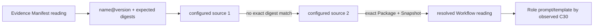

# Evolution Workflow Source Resolution — Design Candidate

> **Status:** Iteration 5 contract-change candidate, 2026-08-28. This document extends the Evolution detailed design after the owner confirmed ordered multi-source Workflow lookup. The Chinese tracking companion is [`workflow-source-resolution.zh-CN.md`](workflow-source-resolution.zh-CN.md).

## 1. Purpose and authority

Evolution uses the exact Workflow configuration of a historical Delivery for readable template/detail enrichment and Manifest-versus-Snapshot integrity checking. Evidence remains the authority for the recorded Delivery Manifest reading and its event-time Role-template cohort coordinate. Configured Workflow sources supply content addressed by that reading; they do not replace Manifest authority or become a continuing prerequisite for metric calculation.

Execution and Evolution intentionally have different source shapes:

- each Execution installation requires exactly one Workflow source because it selects and admits new Workflows;
- each Evolution deployment requires an ordered, non-empty list of Workflow sources because selected Tasks may contain Deliveries created from different repositories or forks.

Iteration 5 supports public GitHub repositories only. A Python alternate-adapter registry is not implied by Execution's TypeScript extension seam and is deferred.

## 2. Historical lookup key

An Evidence Manifest reading supplies:

- Package name;
- exact Package version;
- Package digest;
- Workflow identity and version;
- Workflow Snapshot identity and digest.

`name@version` locates a candidate. A source matches only when the validated Package and Snapshot match every expected content coordinate. Source order, repository URL, tag, release recency, and display name are provenance, not content authority.



No `latest`, SemVer range, alias, repository-name inference, current local checkout, or Execution filesystem path participates in historical lookup.

## 3. Configuration

Evolution's deployment configuration contains 1–8 sources in user-declared order. Each source has a stable configured identity and one public GitHub repository coordinate:

```json
{
  "workflow_sources": [
    {"source_id": "official", "repository": "firestige/workflow-package"},
    {"source_id": "team-fork", "repository": "example/workflow-package"}
  ]
}
```

`source_id` is unique presentation/provenance identity. It is not derived from a URL and never establishes Package equality. Repository coordinates are public configuration and contain no credential or token. GitHub authentication, if a user introduces it outside the Iteration 5 public-source boundary, is not owned by this design.

Resolution is bounded by the inherited per-source GitHub limits: at most ten pages of one hundred releases and an archive of at most 128 MiB. Evolution additionally applies an overall thirty-second Workflow-resolution deadline per evaluation side and a ten-second request timeout. Timeout configuration may lower but not raise those maxima. At most eight bounded attempt diagnostics are retained in a receipt.

## 4. Ordered exact-match algorithm

For each unique Manifest content coordinate:

1. request only the exact Package `name@version` from the next configured source;
2. on `NOT_FOUND`, record the attempt and continue;
3. on transport `UNAVAILABLE`, record the attempt and continue;
4. on malformed descriptor, checksum, archive, or Workflow DSL content, record the most specific closed diagnostic code and continue;
5. validate candidate name and exact version; mismatch records `INVALID_DESCRIPTOR` and continues;
6. validate the Package digest against the Manifest; mismatch records `PACKAGE_DIGEST_MISMATCH` and continues because it is a same-coordinate collision, not a match;
7. run the exact Workflow DSL validator and validate Workflow identity/version; either failure records `INVALID_WORKFLOW` and continues;
8. validate the canonical Workflow Snapshot identity and digest against the Manifest; mismatch records `SNAPSHOT_DIGEST_MISMATCH` and continues;
9. enumerate the Snapshot's exact Agent-action Roles and compare only the external candidate's Role set and Role-prompt identity/digest with the Manifest for enrichment-integrity diagnostics; mismatch records `ROLE_BINDING_MISMATCH` and continues. Agent Provider/LLM-route/model entries do not exist in Workflow source content and are never inferred from it;
10. return the first candidate passing every check.

The resolver may cache validated content, but the cache key includes Package name, exact version, Package digest, and Snapshot digest. Cache state is never authority and never relaxes validation.

## 5. Failure and partial availability

| Attempts after all sources | Resolution |
| --- | --- |
| one exact match | `AVAILABLE` |
| only `NOT_FOUND`, `PACKAGE_DIGEST_MISMATCH`, `SNAPSHOT_DIGEST_MISMATCH`, or `ROLE_BINDING_MISMATCH` | `NOT_FOUND`; no exact content match exists in the configured sources |
| any `SOURCE_UNAVAILABLE`, `INVALID_DESCRIPTOR`, `CHECKSUM_MISMATCH`, `INVALID_ARCHIVE`, or `INVALID_WORKFLOW`, no later exact match | `UNAVAILABLE` because absence cannot be proven |
| deadline or local bound reached | `UNAVAILABLE` with bounded reason |
| Evidence Manifest projection is internally malformed, digest-inconsistent, or conflicts with its Task membership | dependent reading is `INCOMPATIBLE` before external-source resolution |

A missing or mismatching Workflow source resolution does not withhold or change a Metric Result: the immutable Evidence Manifest Role-prompt coordinate is sufficient for event-time cohort equality. External bytes can provide readable Workflow/template enrichment and an integrity diagnostic, but are not a second authority over settled Evidence. A digest/Role mismatch therefore continues source search and, if unresolved, remains a source diagnostic rather than changing the Delivery reading to `INCOMPATIBLE`. Only the Evidence projection's own closed-shape/digest/membership inconsistency can make the dependent reading incompatible. No unavailable Manifest or source is converted to zero, a default Workflow, the current repository version, or a later compatible version.

## 6. Evidence Manifest query

Evolution queries Evidence by exact Manifest digest. Evidence returns an immutable, evidence-safe Manifest projection originating from the same accepted admission-time `task.binding` record as Task membership. Evidence never reads Execution files and never fetches GitHub content.

For every Task membership used by the response, Evolution verifies:

- requested and returned Manifest digests are identical;
- Manifest Delivery and Task identities equal the membership;
- Package/Snapshot fields are closed and digest-shaped;
- every Agent Provider/LLM-route/model entry has the closed Manifest shape, and `resolved_map_digest` recomputes from those Manifest entries alone;
- repeated Manifest reads cannot return conflicting content;
- the accepted provenance and Observation Profile coordinates are exact.

## 7. Receipt binding

`ResolvedEvaluationContext` adds one workflow-enrichment/integrity entry per unique Manifest coordinate:

- Manifest digest and Evidence provenance;
- expected Package and Snapshot coordinates;
- resolution state;
- matched `source_id`, configured index, and public repository when available;
- validated archive/Package/Snapshot digests;
- bounded failed-attempt reason list.

The eight-diagnostic cap applies to the total diagnostics of one Manifest resolution entry. Each source produces at most one terminal attempt diagnostic; a resolver-level deadline may add one more. If more than eight diagnostics would exist, retain the first seven in configured order and use the eighth `ATTEMPTS_TRUNCATED` item for the omitted count. Each diagnostic has only `source_id` when source-specific, configured index when source-specific, one closed code, optional public `message`, and optional `omitted_count`. `omitted_count` is required only for `ATTEMPTS_TRUNCATED`, prohibited otherwise, and is exactly `2`: truncation can occur only after all eight source-attempt diagnostics plus the one resolver-level deadline diagnostic exist, so retaining seven omits exactly two. Codes are `NOT_FOUND`, `SOURCE_UNAVAILABLE`, `INVALID_DESCRIPTOR`, `CHECKSUM_MISMATCH`, `INVALID_ARCHIVE`, `INVALID_WORKFLOW`, `PACKAGE_DIGEST_MISMATCH`, `SNAPSHOT_DIGEST_MISMATCH`, `ROLE_BINDING_MISMATCH`, `DEADLINE_EXCEEDED`, or `ATTEMPTS_TRUNCATED`. Descriptor parse/shape and candidate name/version failures map to `INVALID_DESCRIPTOR`; declared checksum disagreement maps to `CHECKSUM_MISMATCH`; archive framing/size failures map to `INVALID_ARCHIVE`; Workflow DSL or Workflow identity/version failures map to `INVALID_WORKFLOW`. An optional public message is at most 160 characters and generated by Evolution from the code. Response/header bodies, credentialed URLs, tokens, local/cache/temp paths, exception text/stacks, and ambient configuration are prohibited in receipts and `side_error.detail`.

The matched source is explanatory provenance. Package and Snapshot digests remain the equality authority. Source order is not included in Role-template cohort identity.

## 8. Forbidden paths

- Evolution or Evidence reading Execution's Manifest repository, worktree, Package Store, or host configuration;
- Evidence fetching Workflow content from GitHub;
- accepting the first matching `name@version` without digest validation;
- letting unavailable external template bytes change a settled Metric Result or fail all fourteen metrics;
- adding a cross-Fact/Trace snapshot Oracle;
- treating source URL, order, release time, or fork name as Workflow content identity.
