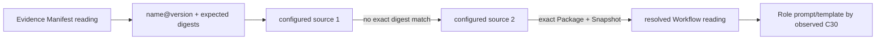

# Evolution Workflow Source Resolution — 设计候选

> **状态：** Iteration 5 contract-change 候选，2026-08-28。本文依据 owner 确认的 ordered multi-source Workflow lookup 扩展 Evolution 详细设计。英文 [`workflow-source-resolution.md`](workflow-source-resolution.md) 是规范候选，本文是中文 tracking companion。

## 1. 目的与 authority

Evolution 使用历史 Delivery 的 exact Workflow config 做 readable template/detail enrichment 与 Manifest-versus-Snapshot integrity check。Evidence 是 recorded Delivery Manifest reading 及其 event-time Role-template cohort coordinate 的 authority；configured Workflow sources 只提供被该 reading content-addressed 的内容，不能替代 Manifest authority，也不成为 metric calculation 的持续前提。

- 每个 Execution installation 必填且只有一个 Workflow source，因为它负责选择、准入新 Workflow；
- 每个 Evolution deployment 必填一个有序、非空 Workflow source list，因为 selected Tasks 可能包含来自不同 repo/fork 的 Delivery。

Iteration 5 只支持 public GitHub repository。Execution 的 TypeScript alternate-adapter seam 不自动产生 Python adapter registry；后者 defer。

## 2. 历史 lookup key

Evidence Manifest reading 提供 Package name、exact version、Package digest、Workflow identity/version，以及 Workflow Snapshot identity/digest。

`name@version` 只定位 candidate。只有 validated Package/Snapshot 与所有 expected content coordinate 一致时才命中。Source order、repository URL、tag、release recency 与 display name 只是 provenance，不是 content authority。



Historical lookup 禁止 `latest`、SemVer range、alias、repo-name inference、current local checkout 与 Execution filesystem path。

## 3. 配置

Evolution deployment config 按用户顺序声明 1–8 个 source。每个 source 有 stable `source_id` 与一个 public GitHub repository：

```json
{
  "workflow_sources": [
    {"source_id": "official", "repository": "firestige/workflow-package"},
    {"source_id": "team-fork", "repository": "example/workflow-package"}
  ]
}
```

`source_id` 是 presentation/provenance identity，不从 URL 推断，也不证明 Package equality。配置不含 credential/token。用户若在 Iteration 5 public-source 边界之外自行引入 GitHub auth，不属于本文所有。

每个 source 继承 GitHub bound：最多 10 页×100 releases，archive 最多 128 MiB。每个 evaluation side 的 Workflow resolution 总 deadline 为 30 秒，单 request timeout 为 10 秒；配置只能降低不能提高。Receipt 最多保留 8 条 bounded attempt diagnostics。

## 4. Ordered exact-match algorithm

对每个 unique Manifest content coordinate：

1. 向下一 source 只请求 exact `name@version`；
2. `NOT_FOUND`：记录并继续；
3. transport `UNAVAILABLE`：记录并继续；
4. descriptor/checksum/archive/DSL malformed：记录最具体的 closed diagnostic code 并继续；
5. 校验 candidate name/exact version；mismatch 记录 `INVALID_DESCRIPTOR` 并继续；
6. 校验 Package digest；mismatch 记录 `PACKAGE_DIGEST_MISMATCH` 并继续，因为它是 same-coordinate collision，不是 match；
7. 运行 exact Workflow DSL validator并校验 Workflow identity/version；任一失败记录 `INVALID_WORKFLOW` 并继续；
8. 校验 canonical Workflow Snapshot identity/digest；mismatch 记录 `SNAPSHOT_DIGEST_MISMATCH` 并继续；
9. 枚举 Snapshot 的 exact Agent-action Roles，只把 external candidate 的 Role set 与 Role-prompt identity/digest 和 Manifest 比较；mismatch 记录 `ROLE_BINDING_MISMATCH` 并继续。Workflow source content 不含 Agent Provider/LLM-route/model entry，绝不从中推断；
10. 第一个全部通过的 candidate 才返回。

Cache key 必须含 Package name/exact version/package digest/snapshot digest；cache 不成为 authority。

## 5. Failure 与 partial availability

| 全部 source 尝试 | Resolution |
| --- | --- |
| 一个 exact match | `AVAILABLE` |
| 只有 `NOT_FOUND`、`PACKAGE_DIGEST_MISMATCH`、`SNAPSHOT_DIGEST_MISMATCH` 或 `ROLE_BINDING_MISMATCH` | `NOT_FOUND`；configured sources 中不存在 exact content match |
| 存在 `SOURCE_UNAVAILABLE`、`INVALID_DESCRIPTOR`、`CHECKSUM_MISMATCH`、`INVALID_ARCHIVE` 或 `INVALID_WORKFLOW` 且没有 later exact match | `UNAVAILABLE`，因为不能证明 absence |
| deadline/local bound reached | `UNAVAILABLE` + bounded reason |
| Evidence Manifest projection 内部 malformed、digest-inconsistent 或与 Task membership 冲突 | external-source resolution 前，dependent reading 为 `INCOMPATIBLE` |

Workflow source unavailable 或 mismatch 都不 withhold、不改变 Metric Result：immutable Evidence Manifest Role-prompt coordinate 已足以判断 event-time cohort equality。External bytes 只能提供 readable Workflow/template enrichment 与 integrity diagnostic，不能成为 settled Evidence 的第二 authority。Digest/Role mismatch 因而继续搜索 source；最终未解析时也只保留 source diagnostic，不把 Delivery reading 改成 `INCOMPATIBLE`。只有 Evidence projection 自身 closed-shape/digest/membership 不一致才能令 dependent reading incompatible。禁止转为 zero、default/current Workflow 或 later compatible version。

## 6. Evidence Manifest query

Evolution 按 exact Manifest digest 查询 Evidence。Evidence 返回与 Task membership 来自同一 accepted admission-time `task.binding` 的 immutable evidence-safe Manifest projection；Evidence 不读 Execution files，也不 fetch GitHub。

Evolution 校验 request/response Manifest digest、Delivery/Task membership、closed Package/Snapshot shape、每个 Agent Provider/LLM-route/model entry 的 closed Manifest shape、只从这些 Manifest entries 重算的 `resolved_map_digest`、重复读取无冲突，以及 exact accepted provenance/Profile coordinate。

## 7. Receipt binding

每个 unique Manifest coordinate 记录 Manifest digest/Evidence provenance、expected Package/Snapshot、resolution state、matched source id/index/public repository、validated digests 与 bounded failed attempts。

八条上限是每个 Manifest resolution entry 的 diagnostic 总数。每个 source 最多产生一条 terminal attempt diagnostic，resolver-level deadline 可再产生一条。若本应超过八条，按 configured order 保留前七条，第八条用 `ATTEMPTS_TRUNCATED` 记录 omitted count。每条只含 source-specific 时的 `source_id`/configured index、一个 closed code、optional public `message` 与 optional `omitted_count`。`omitted_count` 只在 `ATTEMPTS_TRUNCATED` 时 required，其他 code 禁止，且恰为 `2`：truncation 只可能在八条 source-attempt diagnostic 加一条 resolver-level deadline diagnostic 全部存在时发生，保留七条后恰好遗漏两条。Codes 为 `NOT_FOUND`、`SOURCE_UNAVAILABLE`、`INVALID_DESCRIPTOR`、`CHECKSUM_MISMATCH`、`INVALID_ARCHIVE`、`INVALID_WORKFLOW`、`PACKAGE_DIGEST_MISMATCH`、`SNAPSHOT_DIGEST_MISMATCH`、`ROLE_BINDING_MISMATCH`、`DEADLINE_EXCEEDED` 或 `ATTEMPTS_TRUNCATED`。Descriptor parse/shape 与 candidate name/version failure 映射 `INVALID_DESCRIPTOR`；declared checksum disagreement 映射 `CHECKSUM_MISMATCH`；archive framing/size failure 映射 `INVALID_ARCHIVE`；Workflow DSL 或 Workflow identity/version failure 映射 `INVALID_WORKFLOW`。Optional public message 最多 160 chars，只由 Evolution 根据 code 生成。Receipt 与 `side_error.detail` 禁止 response/header body、credentialed URL、token、local/cache/temp path、exception text/stack 与 ambient config。

Matched source 只是 provenance；Package/Snapshot digest 是 equality authority。Source order 不进入 role-template cohort identity。

## 8. Forbidden paths

- Evolution/Evidence 读取 Execution Manifest repo、worktree、Package Store 或 host config；
- Evidence fetch GitHub Workflow；
- 不校验 digest 就接受首个同名同版本；
- unavailable external template bytes 改变 settled Metric Result 或拖垮全部 14 metrics；
- 新增 cross-Fact/Trace snapshot Oracle；
- 用 source URL/order/release time/fork name 充当 content identity。
