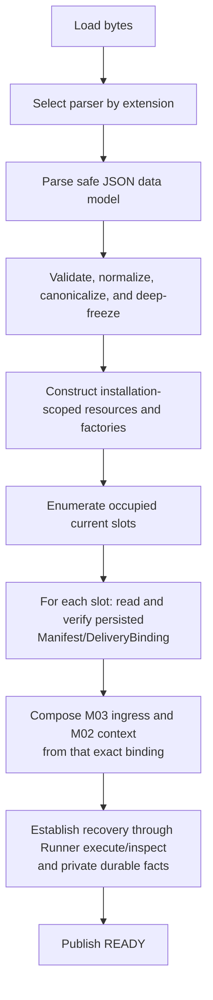

# Iteration 3 qualification matrix

Status: **COMPLETED EVIDENCE INDEX — 2026-08-25**
Authority: [Project Execution System Design](./project-execution-system.md)  
Scope: issues #45, #46, #57, #86 and the Execution-level configuration/factory/Bootstrap release support

This document is a durable evidence index, not an execution checklist. Completion evidence is recorded in the [Iteration 3 implementation result](./implementation-results/iteration-3.md). A row is satisfied only by the named observable oracle and replayable artifact; a later end-to-end test cannot erase a missing owner-level negative. The post-qualification #93 correction is recorded in that result and does not rewrite this matrix's owner-level obligations.

## Obligation matrix

| Obligation | Owner | Required RED fixture | Executable oracle | Target artifact |
| --- | --- | --- | --- | --- |
| #45 immediate admission | M01 Delivery | occupied canonical worktree with spies on selector, Source and Store | `CONTENDED` has zero Package work, wait, queue, Manifest or Runner effect | `src/delivery/**`; M01 admission tests |
| #45 recovery admission | M01 Delivery | occupied slot plus a conflicting new selector/turn | `RECOVERY` uses the persisted Manifest/binding; zero selector, prompt snapshot, attachment read/copy, Source, Store or rebinding work | current-slot/Manifest repository; recovery tests |
| #45 exact/sticky local resolution | M01 Delivery | READY exact and sticky-latest entries with a fail-on-call Source | returns the exact immutable resolved value with zero network call | Package Store and selector tests |
| #45 configured Source miss | M01 Delivery | empty Store with GitHub and contributed alternate fixtures | exactly one installation-selected Adapter is called; no request override or fallback | Source interface, GitHub Adapter and contributed conformance fixture |
| #45 staged validation/publication | M01 Delivery | corrupt inventory, relation, version, digest and DSH compatibility candidates | candidate is never addressable before full validation; failure preserves earlier READY/alias | Store transaction and Package validator tests |
| #45 persisted Delivery binding | M01 Delivery | Runner spy during a new activation with text and attachments | only `NEW` dereferences the Intake-neutral content port; exact Package, canonical worktree, TaskPrompt identity, immutable snapshot references/digests and Delivery config projection are persisted before Runner; incoming refs, bodies, raw config, Observation config and secret material are absent from Manifest | Manifest/binding/snapshot codec and ordering tests |
| #45 result/finalization | M01 Delivery | matching, mismatched, uncertain and authorized-abandonment Runner results | result is checked against the stored Manifest; slot clearing/retention follows owner truth | result-binding and slot lifecycle tests |
| #46 production mapping | M03 Delivery Observation | every M01/M02 fact variant, 10 EventNames, 73 field keys, Review/Finding variants and standard Span fixtures | exact Profile mapping; owner-supplied facts only; no Evidence read or lifecycle write | `src/observation/**`; registry/mapping tests |
| #46 standard emission | M03 Delivery Observation | OTLP protobuf trace/log round-trip collector | accepted records decode with exact event/resource/trace identity and bounded fields | OTLP exporter and byte-round-trip tests |
| #46 non-controlling outage | M03 Delivery Observation | disabled, reject, timeout, exporter throw, tail loss and ambiguous flush | identical Delivery result, settlement and current-slot truth; bounded close | outage corpus and lifecycle tests |
| #46 privacy | M03 Delivery Observation | prohibited secret, prompt/content and native-object markers at every producer boundary | markers never reach mapped records, encoded bytes, diagnostics or retry buffers | privacy corpus and redaction scan |
| #46 producer roles | Bootstrap composition | M01 and M02 owner-fact spies around a real Runner effect | M03 ingress is wired before the effect; M03 derives no owner fact and cannot call back | production composition and role-verification test |
| #57 host-neutral entry | Execution Core | TypeScript consumer importing only the package root | request/result and lifecycle surface contain no Cordis/DSH/provider-native type or private Module import | public exports and package type probe |
| #57 replaceable Intake | Execution Core | direct embedding Adapter and DSH command/tool Adapters with the same turn text/attachments | all create byte-equivalent semantic `ExecutionRequest`/`TaskPrompt`; only bounded presentation correlation may differ | `ExecutionApplication` and Adapter contract tests |
| #57 DSH distribution | DSH Intake | clean locked DSH built-in `web` profile installing the released packages | loader discovers the WSR row beside the official conversation/attachment/command UI; startup performs no activation | `packages/dsh-intake`; real-loader install and interactive Web-session tests |
| #57 command/skill convergence | DSH Intake | every `/wsr` command and explicit `/workflow-execution` invocation | both call one `WorkflowIntakeService`; skill calls `workflow_execution_intake` exactly once; create strips only its directive and preserves the host turn | command, tool, skill bundle and equivalence tests |
| #57 capability isolation | DSH Intake and Runner Provider Adapter | inspect Intake and admitted execution tool/service views | Intake tool is visible only in DSH-I and absent from Workflow capability, Runner catalog and DSH-E | dual-context isolation test |
| #57 Intake session binding | DSH Intake | multiple host sessions/worktrees, duplicate claims, detached recovery and restart | one session binds at most one Delivery; one active Delivery binds exactly one session; valid bindings restore; conflicts fail closed | Adapter-private binding repository and concurrency tests |
| #57 Action finish | DSH Intake and bounded Runner reopen | ordinary answers, target-free finish request, failed closure, restart and stale/duplicate delivery | current session is the only target; finish is not completion; same Episode/DSH-E resumes and only validated `workflow_complete` advances | RED seam fixture, interaction adapter and E2E tests |
| #57 install/update/remove lifecycle | DSH Intake and Release tooling | shutdown/restart/update/remove/reinstall with clear and occupied slot inventories | shutdown cascades into Execution; WSR does not admit DSH package operations; durable state remains outside the plugin directory; compatible restart/reinstall establishes slots/bindings from the last durable boundary before ready; later volatile interaction may be lost | plugin lifecycle, clean-profile and reinstall-recovery tests |
| #86 owner-fact port | M02 Runner composition | production Runner factory with an event-capturing M03 port | Runner emits only frozen owner facts over a one-way non-controlling port before/after the matching effect boundary | Runner composition adapter and integration test |
| Installation configuration | Execution support | YAML/JSON parity plus unknown, duplicate, YAML-only, invalid path/URL/version and secret-marker fixtures | one closed immutable canonical value and identity; all invalid input fails before external effect | `execution.config@1.0.0` schema, loader and default configs |
| Three-layer identity | Execution support and M01 | same semantic YAML/JSON, config-only changes, Package changes and restart drift | installation identity, Delivery config projection identity and Package-dependent Delivery binding identity change only on their defined inputs | canonical codec, projection/binding tests and Manifest fixture |
| Factory graph | Execution support | factories record create/wire/start/dispose calls and injected failure at each node | only the frozen scope/DAG is possible; no Delivery-scoped M02/M03 before persisted binding; rollback is reverse creation order | `ExecutionApplicationFactory`; graph oracle tests |
| Bootstrap lifecycle | Bootstrap | operation at every lifecycle state, multi-slot restart and injected partial-start failure | `CREATED → STARTING → RECOVERING → READY → CLOSING → CLOSED`; ready only after recovery establishment; close is idempotent | Bootstrap state machine and lifecycle tests |
| Release ownership | Release tooling | package inventories and an independent Workflow Package GitHub Release fixture | Execution assets contain no initial Package; each descriptor/digest/compatibility tuple has one owner and is fetchable | npm tarballs, defaults/schema, release manifests and digest inventory |
| Clean-install qualification | Release tooling and DSH Intake | empty temporary home/workspace with only published artifacts, plus compatible update/remove/reinstall over a persisted Delivery | install → configure → provision external credential → dump/help → activate → observe → close/restart succeeds without source checkout; update/remove does not delete external durable truth and compatible reinstall resumes the same Delivery binding | release qualification script, captured commands and implementation results |

## Frozen composition oracle

The installation-scoped objects are the canonical configuration snapshot and identities, diagnostic sink, clock/ID/hash/filesystem primitives, one Source Adapter, Package Store, current-slot/Manifest repository, Runner factory and durable stores, Observation exporter factory or disabled sentinel, M01 factory, M03 factory, concurrency controller, and Intake-neutral application factory. They may be constructed during `STARTING`, but may not perform Delivery work.

For each Delivery, M01 admission owns the ordinary holder. Only `NEW` may resolve and validate a Package. M01 then constructs and durably publishes the Manifest and `DeliveryBinding`. Only after that persistence boundary may Bootstrap compose binding-dependent M03 ingress and M02 execution context. The M01/M02 owner-fact ports are wired to M03 before the corresponding M02 effect. M03 has no reverse port and every send is best-effort and bounded.

The creation/effect oracle is:

Normal close first rejects new Intake, quiesces active application calls within the configured bound, preserves unresolved durable truth, performs a bounded M03 flush, closes Delivery-scoped Runner/DSH-E resources, closes M03 resources, then M01/Store/Source/state resources and installation diagnostics. Partial start disposes only successfully created resources in exact reverse order and never publishes `READY`. Repeated close is safe.

## Configuration field matrix

`__REQUIRED__:<field-path>` is the only required-value placeholder. API-key material is never a field. All paths below are absolute after normalization and all error diagnostics are value-redacted.

| Key | Type | Policy | Secret class | Consumer | Delivery binding | Reload | Redacted error |
| --- | --- | --- | --- | --- | --- | --- | --- |
| `schemaVersion` | literal `execution.config@1.0.0` | product default | public | loader | projection version input | next bootstrap | `CONFIG_SCHEMA_VERSION_UNSUPPORTED` |
| `paths.repositoryRoot` | absolute canonical path | user-required | path-sensitive | worktree derivation | projection input | next bootstrap | `CONFIG_PATH_INVALID` |
| `paths.workspaceRoot` | absolute canonical path | user-required | path-sensitive | workspace boundary | projection input | next bootstrap | `CONFIG_PATH_INVALID` |
| `paths.allowedWorktreeRoots` | non-empty unique absolute-path array | user-required | path-sensitive | M01 admission | projection input | next bootstrap | `CONFIG_PATH_OUT_OF_SCOPE` |
| `paths.stateRoot` | absolute writable path | user-required | path-sensitive | slot/Manifest and derived Runner roots | admitted relative resources only | next bootstrap | `CONFIG_PATH_INVALID` |
| `paths.packageStoreRoot` | absolute path | derived as `<stateRoot>/packages`; forbidden in input | path-sensitive | Package Store | excluded; exact Package digest binds separately | derived at bootstrap | `CONFIG_DERIVED_KEY_FORBIDDEN` |
| `paths.intakeBindingStoreRoot` | absolute path | derived as `<stateRoot>/intake-bindings`; forbidden in input | path-sensitive | DSH Intake Adapter-private binding repository | excluded | derived at plugin start | `CONFIG_DERIVED_KEY_FORBIDDEN` |
| `paths.credentialStorePath` | absolute readable file path | user-required | sensitive path | credential lease provider | excluded; reference binds separately | next bootstrap | `CONFIG_REQUIRED_VALUE` |
| `workflowSource.kind` | `github` or `adapter` | product default `github` | public | Source factory | no | next bootstrap | `CONFIG_SOURCE_INVALID` |
| `workflowSource.repository` | GitHub `owner/name` | default `firestige/workflow-package`; GitHub only | public | GitHub Adapter | no | next bootstrap | `CONFIG_SOURCE_INVALID` |
| `workflowSource.releasesBaseUrl` | HTTPS URL, no userinfo | product default GitHub API repository releases URL | public | GitHub Adapter | excluded | next bootstrap | `CONFIG_URL_INVALID` |
| `workflowSource.assetPattern` | fixed pattern | product default `workflow-package-{name}-{version}.tar.gz` | public | GitHub Adapter | no | next bootstrap | `CONFIG_SOURCE_INVALID` |
| `workflowSource.adapterKey` | registered key | user-required for adapter variant | public | alternate Source factory | no | next bootstrap | `CONFIG_SOURCE_ADAPTER_UNKNOWN` |
| `workflowSource.adapterConfigFile` | absolute path | user-required for adapter variant | sensitive path | selected Adapter config loader | excluded | next bootstrap | `CONFIG_SOURCE_INVALID` |
| `runner.implementationKey` | literal `runner.v1` | product default | public | Runner factory | projection input | new/recovered Delivery | `CONFIG_RUNNER_INVALID` |
| `runner.host.engine` | literal `langgraph` | product default | public | Runner factory | projection input | new/recovered Delivery | `CONFIG_RUNNER_INVALID` |
| `runner.provider.key` | literal `dsh` | product default | public | Provider factory | projection input | new/recovered Delivery | `CONFIG_PROVIDER_INVALID` |
| `runner.provider.route` | non-empty string | user-required | public | admitted Driver binding | projection input | new Delivery; persisted value on recovery | `CONFIG_REQUIRED_VALUE` |
| `runner.provider.modelId` | non-empty string | user-required | public | admitted model binding | projection input | new Delivery; persisted value on recovery | `CONFIG_REQUIRED_VALUE` |
| `runner.provider.baseUrl` | absolute HTTP(S), no userinfo | user-required | sensitive endpoint | Provider Adapter | projection input | new Delivery; persisted value on recovery | `CONFIG_URL_INVALID` |
| `runner.provider.credentialRef` | bounded non-empty string | user-required | sensitive identifier | action-scoped lease | reference only, never material | new/recovered Delivery | `CONFIG_REQUIRED_VALUE` |
| `runner.provider.maxParallelToolCalls` | integer `1..32` | product default `4` | public | Runner factory | projection input | new/recovered Delivery | `CONFIG_RANGE_INVALID` |
| `observation.enabled` | boolean | product default `false` | public | M03 factory | excluded | next bootstrap | `CONFIG_OBSERVATION_INVALID` |
| `observation.endpoint` | loopback HTTP(S) base URL | required only when enabled | sensitive endpoint | OTLP exporters | excluded | next bootstrap | `CONFIG_OBSERVATION_ENDPOINT_INVALID` |
| `observation.timeoutMs` | integer `100..10000` | product default `1000` | public | M03 exporter | excluded | next bootstrap | `CONFIG_RANGE_INVALID` |
| `observation.maxBatchRecords` | integer `1..512` | product default `512` | public | M03 batcher | excluded | next bootstrap | `CONFIG_RANGE_INVALID` |
| `observation.maxBatchBytes` | integer `1024..4194304` | product default `4194304` | public | M03 batcher | excluded | next bootstrap | `CONFIG_RANGE_INVALID` |
| `observation.flushIntervalMs` | integer `100..10000` | product default `1000` | public | M03 batcher | excluded | next bootstrap | `CONFIG_RANGE_INVALID` |
| `observation.shutdownFlushMs` | integer `100..10000` | product default `3000` | public | lifecycle manager | excluded | next bootstrap | `CONFIG_RANGE_INVALID` |
| `observation.serviceName` | non-empty string | product default | public | OTEL resource | excluded | next bootstrap | `CONFIG_OBSERVATION_INVALID` |
| `controls.startupTimeoutMs` | bounded integer | product default | public | Bootstrap | no | next bootstrap | `CONFIG_RANGE_INVALID` |
| `controls.executionTimeoutMs` | bounded integer | product default | public | application/Runner boundary | projection input | new/recovered Delivery | `CONFIG_RANGE_INVALID` |
| `controls.shutdownTimeoutMs` | bounded integer | product default | public | lifecycle manager | no | next bootstrap | `CONFIG_RANGE_INVALID` |
| `controls.maxConcurrentDeliveries` | bounded integer | product default | public | admission concurrency controller | projection input | new Delivery | `CONFIG_RANGE_INVALID` |
| `controls.allowExplicitRefresh` | boolean | product default `false` | public | M01 | projection input | new Delivery | `CONFIG_REFRESH_DISABLED` |
| `controls.diagnosticMaxBytes` | integer `256..16384` | product default `4096` | public | diagnostic sink | excluded | next bootstrap | `CONFIG_RANGE_INVALID` |
| `intake.maxCorrelationBytes` | integer `16..1024` | product default `256` | public | Intake contract | excluded | next plugin start | `CONFIG_RANGE_INVALID` |
| `intake.maxOutputBytes` | integer `256..65536` | product default `8192` | public | result renderer | excluded | next plugin start | `CONFIG_RANGE_INVALID` |

## DSH runtime ownership and recovery

| Concern | DSH-I Intake instance | DSH-E execution instance |
| --- | --- | --- |
| Owner/create point | DSH profile loader creates it; plugin calls public Bootstrap | Runner-owned DSH Provider Adapter creates `new Context()` after persisted binding |
| Configuration | absolute Execution config path only in profile patch | exact persisted Delivery projection plus Runner-private config |
| Services/tools | `/wsr` commands, Intake-only operation tool, skill provider and bounded renderer | admitted Workflow capability and Runner tool catalog; never the Intake tool |
| Persistence | Intake-private durable session/Delivery binding and bounded correlation under its own root | Runner journal/checkpoint/session/custody roots |
| Namespace | Intake channel/session namespace | distinct native execution session namespace |
| Dispose | first stop Intake, then cascade public application close | lifecycle manager invokes Runner/Provider disposer before installation resources close |
| Crash truth | no Workflow truth; preserves Adapter-owned binding intent without claiming Action outcome | Manifest/current slot and Runner durable facts remain authoritative |
| Restart/reinstall | joins durable session bindings to exact Delivery inventory; restores valid routes from the last durable boundary or marks Delivery detached; conflicts fail closed; later volatile interaction may be lost | reconstructed from persisted binding; Runner privately continues, restarts from savepoint or intervenes |

The existing prohibition on a public DSH resume API does not prohibit startup recovery. Bootstrap recovery establishment is an Execution lifecycle operation over M01 Manifest/current-slot truth and the existing Runner `execute`/`inspect` seam. User `/wsr recover` is the distinct act of binding an unbound Intake session to an exact detached Delivery or the current worktree's Delivery. Native-session continuation remains private to Runner/Provider code; the current installation config, selector alias, a new prompt or incoming attachments cannot rebind an existing Delivery.

The Action-finish requirement is an approved bounded reopen. A RED fixture must first show that the frozen schema-validated `ActionInputResponse` cannot express an independent finish request. The only authorized Runner semantic delta is the minimum internal distinction between an ordinary answer and `ACTION_FINISH_REQUESTED`; the public `execute`/`inspect`/`cancel` surface, exact request correlation, same-session resume, Action-owned closure and `workflow_complete` completion protocol remain unchanged. Initial Workflow Package content stays frozen unless separate RED evidence triggers a separately approved reopen.

## Frozen release and DSH coordinates

| Artifact | Exact coordinate / convention | Owner |
| --- | --- | --- |
| Host-neutral Execution package | `wsr-execution@0.1.0` | Execution Release |
| DSH Intake package | `wsr-dsh-intake@0.1.0` | Execution Release |
| DSH profile | built-in `web` (`dsh-base` + `dsh-web-app`) | user installation |
| Cordis row ID | `workflow-execution` | DSH Intake package |
| Execution config schema/defaults | `execution.config@1.0.0`; `config/defaults/execution.default.yaml` and `.json` | Execution Release |
| command surface | `/wsr list`; `/wsr create <selector>`; `/wsr recover [<delivery-id>]`; `/wsr status [<delivery-id>]`; `/wsr action finish`; `/wsr abandon <delivery-id>` | DSH Intake package |
| create prompt source | triggering chat turn remainder plus attachments; no prompt command parameter | DSH Intake package |
| Intake tool | `workflow_execution_intake`, closed operation union | DSH-I only |
| skill | explicit `/workflow-execution`; `skills/workflow-execution/SKILL.md` | DSH Intake package |
| Workflow Package assets | `workflow-package-{name}-{version}.tar.gz` | Workflow Package GitHub Release |
| initial assets | `workflow-package-implementation-1.1.0.tar.gz`; `workflow-package-system-design-1.1.0.tar.gz` | Workflow Package GitHub Release only |

The DSH profile patch contains only the plugin row and absolute Execution config/binding paths. The plugin bundle supplies no UI and must not be presented as interactive on a custom base-only profile; the first distribution uses locked DSH's built-in `web` profile. “DSH profile/plugin bundle” refers only to the DSH loading layer; it never means a Workflow Package source, embedded initial Package or fallback path.
