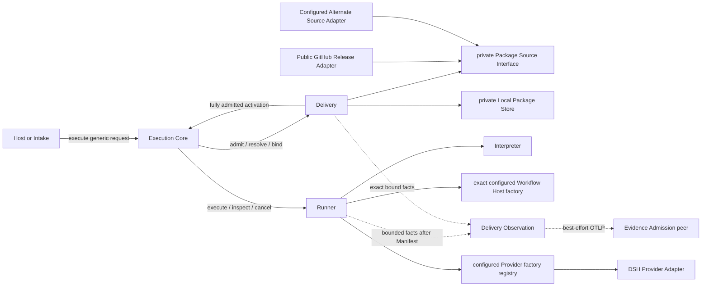
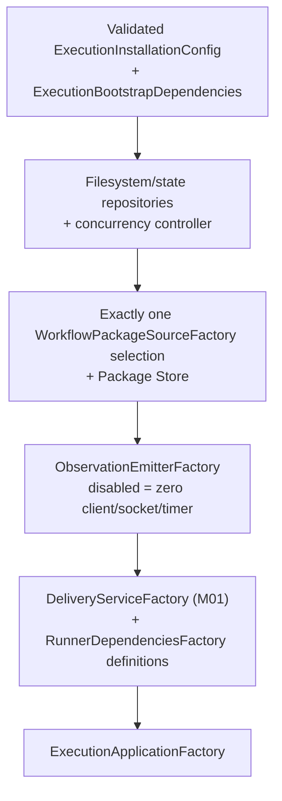
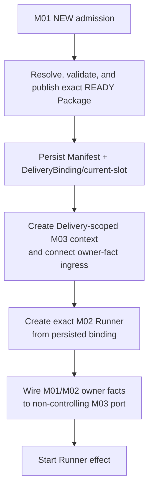
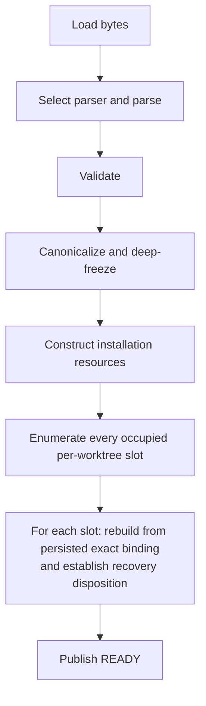
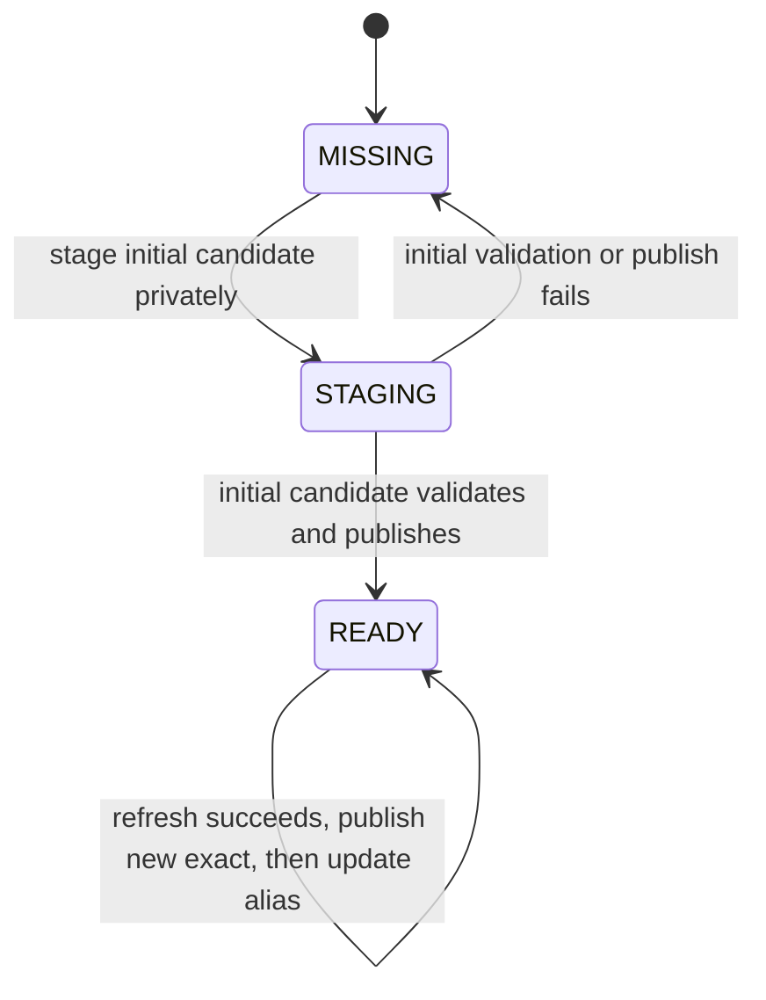
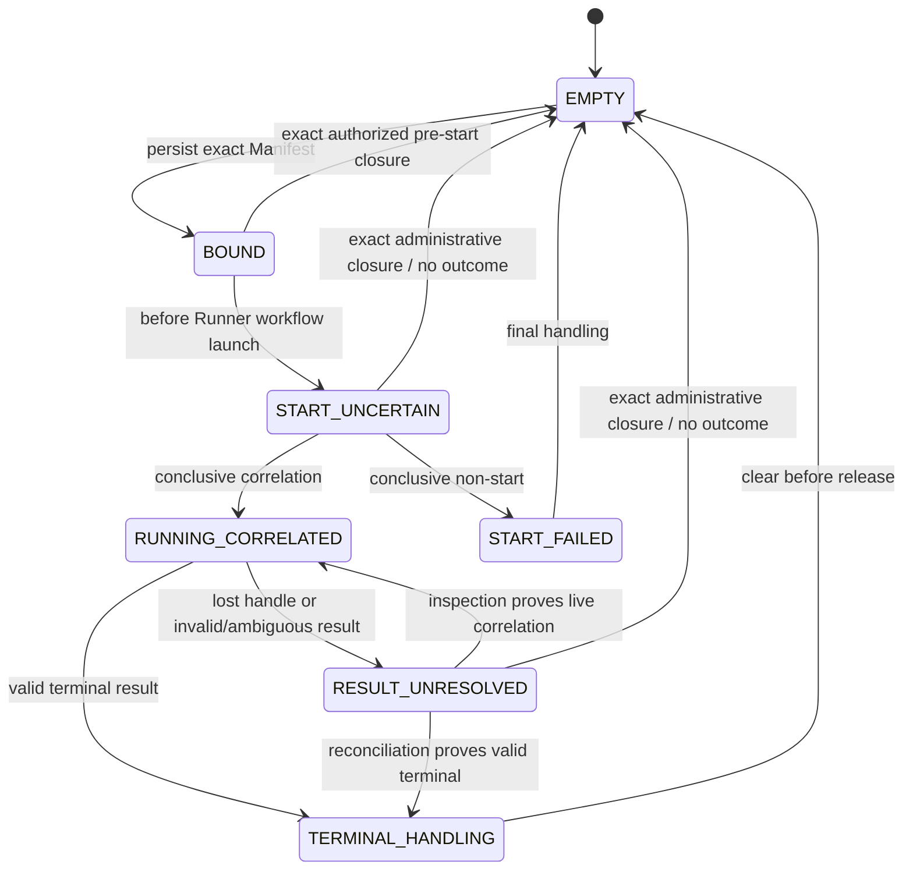
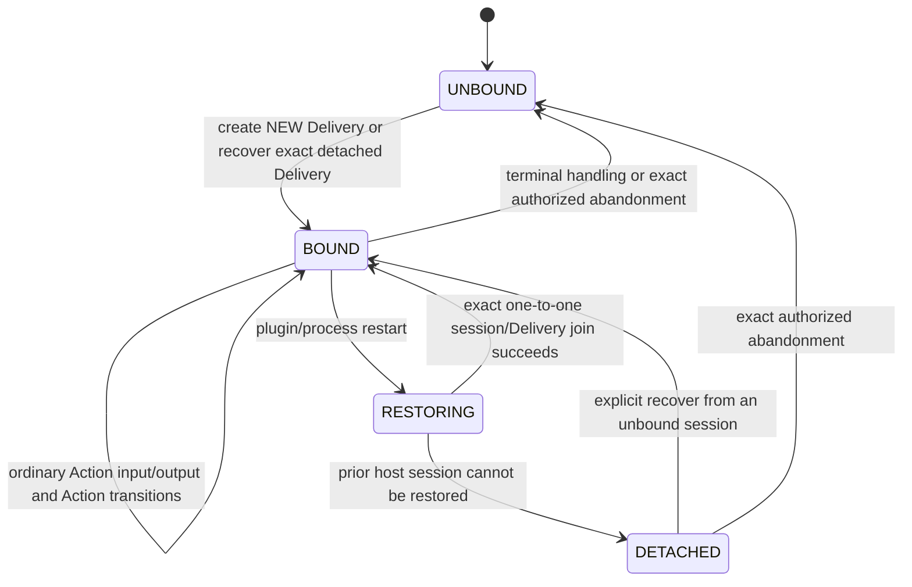

<a id="ee-execution"></a>
# Project Execution System Design

<a id="ee-execution-1"></a>
## 1. Metadata and Authority

| Field | Value |
| --- | --- |
| Document identity | `execution.identity.001` |
| Publication status | `WORKING_REVIEW_CANDIDATE`; prior bounded review, translation, and fresh-reader closure apply to earlier bytes only. The 2026-08-23 user review approved the Intake/TaskPrompt/Action-finish calibration. The 2026-08-24 corrective addendum and 2026-08-25 #93 closure passed deterministic Iteration 3 qualification; exact publication binding remains a separate requirement before promotion. |
| Exact publication binding | The external publication set/application record must bind this byte stream and the companion canonical Concept byte stream by SHA-256, record the applicable review, SD-12, fresh-reader, and deterministic-verification evidence, and prove exact installation. This document intentionally declares no self-digest or companion digest. |
| Authority after promotion | Sole versionless English Project Execution System Design authority |
| Current structure authority | GitHub issues [#45 execution.delivery](https://github.com/firestige/workflow-self-recursive/issues/45), [#46 execution.observation](https://github.com/firestige/workflow-self-recursive/issues/46), and [#47 execution.runner](https://github.com/firestige/workflow-self-recursive/issues/47); this candidate calibrates the document to those decisions |
| Normative language | English |
| Translation | [`project-execution-system.zh-CN.md`](project-execution-system.zh-CN.md) is a non-normative tracking translation. English is the sole semantic authority. Whenever an English section changes, its Chinese counterpart is retranslated from the current English section and replaced as a whole; Chinese maintenance does not preserve or incrementally evolve prior Chinese wording. |
| Source lineage | Repository history; this candidate makes no claim against an unresolvable external commit. |
| Concept authority | [`concept.identity.001`](../../agent-architecture.md#ee-concept), promoted atomically as the companion member |
| Prior canonical Execution baseline | `execution.identity.001`; repository history owns provenance |
| Composition authority | Exact-version dispatch: published Workflow DSL 1.x uses historical [`workflow-composition-model.md`](../../workflow-composition-model.md); Workflow DSL 2.0 uses [`workflow-composition-model-2.0.0-candidate.md`](../../workflow-composition-model-2.0.0-candidate.md) only after its publication gates pass |
| Confirmed intent | `EE-WORKFLOW-IMPORT-BRIEF`; SHA-256 `7c9b1064084cf5f256f27bc5efd021bed0374910e1430586eebeb695344d4c6d` |
| Confirmed direction | `EE-WORKFLOW-IMPORT-SKELETON`; SHA-256 `86a2a61a324d9bb7ca90108b433ded2f883bc91d9f60dadee87ac7d11feb8e46` |
| Historical direction review | `EE-WORKFLOW-IMPORT-SD05-ARCH-RECHECK`; SHA-256 `2c4fbaef0db617ccfc9ce20be8b5470a7251938744cc2d5d792f5ed9ed197c4a`; `PASS`; applies to the prior large Workflow-import direction |
| Feasibility | `EE-WORKFLOW-IMPORT-SD06-APPLICATION`; SHA-256 `c6714b9c850536273a00b929559f6d71b8ff2c8aeb1f2aaf8054c14c53ca5795`; `FEASIBILITY_CONFIRMED` |
| Targeted simplification authority | `EE-WORKFLOW-IMPORT-MVP-SIMPLIFICATION-RR`; removes mechanisms only, adds no feasibility question, and authorizes bounded affected review |
| Historical expansion inputs | `EE-WORKFLOW-IMPORT-SD07-CP01` SHA-256 `f4c3ef4a09867fc05e2782aefec7616f02b96132cb7ccddf158156ba526e1d85`; `CP02` SHA-256 `0d16e85e4f944720aa49a54ff7c60f2545f925d7a9576067128e860a2ae98d84`; `CP03` SHA-256 `e6f1f054bcf2252684f9e587e09a058e3f40f885bfbbc7011d99fc6d4732a4cd`; apply to the prior large Workflow-import expansion |
| Historical large-workflow review lineage | Problem–Solution, Architecture, and Quality review results from the larger Workflow-import design remain historical evidence for unchanged content only. |
| Historical large-workflow Finding accounting | `EE-WORKFLOW-IMPORT-SD10-AGGREGATION` is historical and is not the Finding account for this targeted simplification. |
| Historical design-parameter and handoff closure | `EE-WORKFLOW-IMPORT-SD12-CLOSURE-HANDOFF`; SHA-256 `60f24178d3a2f8991d6af2f974e4ed03d35aedc0064d9d253b3773e732e18ea7`; `SUCCEEDED` |
| Historical large-workflow Fresh Reader lineage | `EE-WORKFLOW-IMPORT-SD13-FRESH-READER-RESULT` applies to prior bytes and remains historical. |
| Historical controlled integration authority | `EE-WORKFLOW-IMPORT-SD14-REVISION-REQUEST`; SHA-256 `135ab9647fc6e30318735eff3cef858853cec75f47704e6eaaabd13ecbc59b2e`; deterministic report SHA-256 `1eda28b1c73a8b7d931ab58207d34796173a06bf20cdfae0e17accb2a3a3dc18`; applies to the prior large Workflow-import integration |
| Bounded affected reviews | Problem–Solution SHA-256 `807863cb6c7887eccdb2720df5ace0afd8e4833f763a029928f44ed1e30e92ae`; Architecture SHA-256 `b220e1114d166cc5a55e34635f847ac2c1af0cf1777bb9c6a6c08dbadf5cdf98`; Quality SHA-256 `b64927087758a987a1f5a4d461035c379970ad84af57133714462ea19ac22f77`; converged on two treatment groups |
| Unified bounded treatment | `EE-WORKFLOW-IMPORT-MVP-SIMPLIFICATION-SD10-TREATMENT`; SHA-256 `da22b3356aa34c3bcf6e3977a3277ef5b0d9c1e8beef35f4fe0db7dd5e72caf6` |
| Prior focused bounded recheck | `EE-WORKFLOW-IMPORT-MVP-SIMPLIFICATION-SD10-BOUNDED-RECHECK`; SHA-256 `1b5664afd796910beb8b505bbaadd889fbb7fb098b02c141abb27cdba4e74955`; `CLOSED_FIXED`; open Findings `0`; applies to earlier bytes only |
| Prior translation and fresh-reader closure | Whole-section translation parity SHA-256 `3c236a404392e1d496e33d4adcdd70000d0db2a2453dcbd7df40813612f77c20`; fresh-reader result SHA-256 `1062561d35422bfacfa7e430f381e5fb25a5a2a911fe8daa5e3499eac5fc2a75`; translation treatment SHA-256 `927a02c6d88eba3571e39c010681b8b47dc956e9a8bafea6812aa9cda91c5d14`; focused recheck SHA-256 `6777175a4e78e363d24ddc3f6bc657b66e9f5a6c2e9fd0042dd210705035c18e`; applies to earlier bytes only. Current bounded calibration was user-approved on 2026-08-23 and remains pending fresh deterministic parity/publication binding |

Authority order is: confirmed user intent; the current structure issues named above; normative Concept; this Execution candidate; Workflow composition model; and published Contracts within their declared scopes. Published Observation and interaction packages currently support validator-only claims; production and cross-implementation conformance remain unproven. The [Evidence System](../evidence/evidence-system.md) remains a peer owner. This document owns the placement of M01–M03, their Core contracts, and system-wide invariants. [Runner Module Detailed Design](modules/runner/runner.md) owns private M02 detail. This document does not own Workflow Package publication policy, Evidence internals, Observation fact meaning, the payload registry, metric schema, or physical storage schema.

The protected `system-design` and `implementation` Workflow Packages are initial verified distribution content and conformance fixtures, not redesign targets outside the R6 corrections authorized below. No disposable workspace artifact is required to interpret this document; the identities above are provenance only.

### Iteration 5 Role/model and Manifest rebaseline candidate

The 2026-08-28 owner decision changes only the target Contract and subsequent Deliveries; earlier publication evidence applies only to earlier bytes and `agentops.workflow-dsl@1.1.0` behavior. The candidate chain is:

- [`workflow-definition-dsl-2.0.0-candidate.md`](../../contracts/workflow/workflow-definition-dsl-2.0.0-candidate.md) removes generic Agent-definition and Workflow-owned model resources;
- [`repository-role-model-binding.md`](repository-role-model-binding.md) makes the canonical worktree repository the minimum model-policy scope and defines `repository[role] ?? execution.default_model_selection`;
- [`execution-configuration-2.0.0-candidate.md`](execution-configuration-2.0.0-candidate.md) removes Provider-native credentials/endpoints from WSR configuration and defines the new global default-model-selection input;
- [`delivery-manifest-2.0.0-candidate.md`](delivery-manifest-2.0.0-candidate.md) freezes exact Workflow Snapshot and resolved Role/Agent-Provider/LLM-route/model bindings while preserving historical 1.x recovery;
- [`delivery-manifest-projection.md`](../evidence/delivery-manifest-projection.md) defines the portable Manifest reading emitted in the same Task-binding owner record;
- each Execution installation still configures exactly one Workflow source. Delivery admission binds that exact source result; request/Workflow data cannot select another source or a source list.

For a new-Contract Delivery, M01 validates the exact Workflow Package/Snapshot, reads optional `<canonical-worktree>/.wsr/model-bindings.json`, resolves every distinct Role referenced by an Agent Action in the exact Snapshot independently of later Route/path selection, and persists a revised Manifest before Runner effect. The Manifest freezes exact Package/Snapshot identities, repository binding-document state/digest, and the complete resolved Role→Agent-Provider/LLM-route/model map. Recovery consumes the persisted Manifest and never rereads current repository/global configuration.

Agent identity is the admitted exact Role snapshot plus the installation's one Agent Provider identity and exact LLM provider-route/model identity. Route selection adds Action prompt, Skills, tools, Driver, access, and session policy but cannot change that selection. For 2.0, a DSH profile/composition boots an installation-scoped DSH-owned bridge/realm factory and supplies that factory to Execution. After Manifest persistence, Runner requests one isolated Delivery-scoped DSH-E realm; the DSH factory owns construction and Runner owns the Delivery lifecycle lease/disposal. Recovery repeats that request only through the same frozen Agent Provider identity. Execution does not load DSH profiles/settings/credentials, construct LLM adapters, or share DSH-I services. Provider-native authentication, credentials, endpoints, and session mechanics remain Provider-owned and are excluded from Workflow, repository binding, Manifest, and Observation content. Current DSH-owned configuration may provide connectivity/credentials for the frozen identities but is not binding authority and cannot rebind a Delivery. Historical Provider factory registry/key and per-Delivery construction paragraphs below describe only the 1.x path; their “Runner-owned DSH-E” wording means lifecycle ownership for 2.0 and does not grant configuration or construction authority back to Execution.

After Manifest/current-slot persistence and before Runner launch, M01 emits one `task.binding` owner Fact built directly from the persisted Manifest. The same record carries the evidence-safe Manifest projection; no Workflow-ID prefix, Event timestamp, arrival order, or ambient lookup may determine whether it is emitted. Observation delivery remains non-controlling, but absence of the accepted record makes Task/Manifest-dependent BI metrics unavailable rather than reconstructable.

These paragraphs are design authority for the Iteration 5 implementation candidate only after their corresponding machine revisions pass lifecycle gates. The current `agentops.delivery-admission@1.0.0` paragraph below accurately describes the historical implementation and must not be read as already implementing the rebaseline.

### Runner delivery-admission and Core projection

For Iteration 2 Runner, Execution owns `agentops.delivery-admission@1.0.0` at `system-contracts/delivery-admission/delivery-admission-contract.json`. Admission deterministically resolves `agentops.workflow-dsl@1.1.0` author intent into one deeply frozen `RunnerActivationContext`; this includes exact Agent, model, Driver, provider-model, resource, capability, workspace, and local path bindings. The deterministic activation compiler receives only that admitted value, never the eight documents, eight root schemas, or shared meta schema.

Execution also owns the current Core-to-Runner TypeScript projection at `execution-system/src/execution/runtime-adapter.ts`. Its operation set is exactly `execute`, `inspect`, and `cancel`. The historical type name `ExecutionRuntimeAdapter` is an implementation seam, not evidence that M02 is already a polymorphic Runner abstraction. The Runner Lifecycle Coordinator implements that surface. Resume, recovery, checkpoint, thread, and provider-session operations remain private to Runner.

Runner is M02. It receives a fully admitted activation from Core after M01 has completed worktree admission, Package resolution, current-slot/Manifest persistence, and exact binding projection. Runner's five submodules are Interpreter, Lifecycle Coordinator, Workflow Host, Managed Agent Invocation, and Custody; the Iteration 2 implementation exists under `execution-system/src`. There is no current selection among multiple Runner implementations. If that need appears later, M02 may be promoted into a Runner abstraction and every concrete implementation must receive a distinct name. See the [Runner Module Detailed Design](modules/runner/runner.md).
<a id="ee-execution-2"></a>
## 2. Design Context

workflow-self-recursive runs valuable logical Workflows through a small host-neutral execution seam and optionally emits factual Observation. Execution is embedded per repository/workspace. Runner is Execution module M02. It privately composes a replaceable Workflow Host and configured Provider Adapters; the current Host substrate is LangGraph and the only concrete Provider is DSH. Native sessions, checkpoints and private resume remain inside Runner and do not change Core semantics.

The protected Implementation and System Design Workflow Packages are independently hosted by the configured public Workflow Package GitHub repository/release. Contributors may publish other Packages conforming to the open Agent Ops Workflow composition model. An installation selects exactly one private Source Adapter: the default GitHub Adapter or one explicitly configured alternate Adapter. The Execution Release and DSH Intake plugin never bundle either initial Package.

This is a trusted local preview for an individual or small team. The configured GitHub repository is public, users control installation configuration, and concurrent Package management is not a product requirement. The design handles ordinary faults by validation and typed early return. It does not build authentication, authorization, signing, hostile-Package or prompt-injection defense, sandboxing, multi-user coordination, distributed locking, Package transactions, production recovery, HA, mirror failover, or automatic eviction.

Actors and ownership:

- **Host or Intake** translates host/chat syntax into a generic Workflow selector, canonicalizable worktree reference, optional permitted refresh, a host-neutral `TaskPrompt`, and bounded Intake correlation. `TaskPrompt` preserves the triggering turn's text and immutable attachment references; it is not a command-line `--intent` value. Host or Intake cannot select Source, Runner, Provider, Observation, or paths.
- **Execution Core** sequences canonical worktree/exclusive admission, Package preparation only for `NEW`, Manifest creation/persistence, Runtime lifecycle, result validation, and Observation.
- **Delivery (M01)** owns selector/Package resolution, Source/Store, canonical-worktree admission, current-slot and Manifest persistence, Delivery recovery/final handling, and projection of one fully admitted Runner activation.
- **Runner (M02)** owns execution of that admitted activation. Interpreter compiles it; Coordinator, Host, Invocation, and Custody own private execution state and effects.
- **GitHub or alternate Source Adapter** is selected once by canonical installation configuration and returns the same generic candidate shape; exactly one is constructed and no fallback exists.
- **Evidence** receives optional one-way Observation and never controls Execution.

<a id="ee-execution-3"></a>
## 3. Problem, Goals, and Scope

The existing Delivery Binding begins too late: it assumes the caller already has exact Workflow identities and never explains where a Workflow Package comes from. Moving download, cache lookup, validation, and current Runner/DSH compatibility into Host code would keep Delivery Binding shallow and make each host reproduce the same behavior.

The goal is an implementable local-preview path from a generic selector to DSH:

```text
WorkflowSelector
→ Delivery (M01): admission + exact Package + DeliveryManifest
→ Runner (M02): admitted activation execution
```

A successful call first obtains `NEW` admission, resolves one exact local Package, creates and persists a Delivery Manifest before any Runner Workflow/Host/Provider effect, projects the fully admitted activation, and validates the Runner result against that Manifest. `CONTENDED` and `RECOVERY` return before Package work. For `NEW`, a valid local hit does not contact the configured Source. A miss asks only the installation-selected GitHub or alternate Adapter, validates before publishing `READY`, and never falls back to another source/version. Any selector, fetch, Package, cache, compatibility, contention, or Manifest error returns at its own phase. Package preparation failure releases the ordinary holder, creates no Delivery, and is not a Delivery outcome.

In scope are a host-neutral Core entry, replaceable Intake, exact/sticky-latest selectors, local hit, configured public GitHub miss/refresh, one explicitly configured alternate Source Adapter, contributed conforming Packages, `MISSING/STAGING/READY` storage, ordinary format/required-resource/relationship/version/digest checks, DSH compatibility checks, immutable Manifest binding, multi-worktree current-slot recovery, DSH result validation, production Observation, canonical installation configuration, factories, Bootstrap, and bounded lifecycle management.

Out of scope are Package ranking/fallback, ambient completion, authentication/authorization/RBAC, credentials for the public source, signing, hostile input isolation, injection defense, sandboxing, concurrent Package correctness, queueing/fairness, distributed locks, Package transaction/proof/hold protocols, automated eviction, production download/recovery guarantees, registry/marketplace, HA/failover, physical Evidence schema, a second Runner implementation or Runner-selection abstraction, Evidence redesign, and changes to the protected Packages.

Success means an implementer can build the path through the three existing Modules with simple state and typed results, without inventing another lifecycle before the Delivery Manifest.

<a id="ee-execution-4"></a>
## 4. Design Drivers

| Driver | Required outcome | Structural consequence |
| --- | --- | --- |
| Delivery Binding depth | Hosts do not implement Package import choreography | M01 exposes one resolve/prepare operation and owns private Source/Store seams |
| Admit before request Package work | contender and stored recovery avoid needless selector/cache/download work | Core enters M01 admission first; only M01's `NEW` branch performs Package work |
| Prepare before Delivery | acquisition or validation failure is not a Delivery failure | under the ordinary `NEW` holder, M01 completes before Core creates Manifest content or invokes Runner |
| Exact binding | alias or Release movement cannot alter a created Delivery | resolved value contains exact version, digest, local path, and Workflow ID |
| Docker-like local-first | valid exact/latest hit avoids GitHub; bare name means latest | Store lookup precedes Source Adapter; sticky alias points to a `READY` exact Package |
| Ordinary fault containment | malformed/unavailable input stops early without a recovery subsystem | typed early-return results at selector, source, validation, cache, admission, and Manifest phases |
| Simple exclusivity | one current Runner Delivery per worktree | M01 attempts exclusive admission and immediately returns `CONTENDED` when unavailable |
| No fallback/default completion | failure never chooses another source/version/resource | exactly one installation-selected Source; request cannot override it; DSH validates before native effect |
| Open contribution | compatible third-party Package uses the common path | composition and DSH checks, no first-party allow-list |
| Preview restraint | complexity must match trusted local use | no security platform, concurrent Store protocol, automatic eviction, or production recovery |
| Observation non-control | telemetry failure cannot alter outcome | unchanged one-way M03 Interface |

Numeric latency, timeout, capacity, and retention settings remain implementation/operations choices unless measured facts later force a design change.

<a id="ee-execution-5"></a>
## 5. Problem Decomposition

1. **Create or recover a Delivery (`execution.module.001`, M01).** Canonicalize the worktree; return `CONTENDED` or stored `RECOVERY`, or under a `NEW` holder resolve/prepare one exact Package, persist the Manifest/current slot, and project a fully admitted activation.
2. **Execute the admitted activation (`execution.module.002`, M02).** Interpreter validates/compiles; Coordinator drives Host, Invocation, and Custody; Runner returns typed terminal, start-failed, or unknown truth through the Core seam.
3. **Finalize the Delivery (M01).** Validate the bounded Runner result against the Manifest, preserve exact lifecycle truth, and close or retain the current slot according to known state.
4. **Observe bounded facts (`execution.module.003`, M03).** After a Delivery exists, map actual facts to the existing best-effort Observation profile without controlling execution.

These map directly to Delivery (M01), Runner (M02), and Delivery Observation (M03). M01 owns Delivery acquisition/admission/binding/lifecycle; M02 owns admitted execution; M03 owns non-controlling emission. The deletion test justifies all three Modules. Runner's five submodules do not add top-level Execution modules.

<a id="ee-execution-6"></a>
## 6. System Structure



### Delivery (`execution.milestone.01`), deepened

M01 hides selector parsing, exact/sticky lookup, configured-Source acquisition, staging, Package validation, DSH compatibility checks, `READY` publication, alias update, resolved-value construction, Manifest content construction, and result-binding checks. Its main caller-facing operation is:

```text
resolveWorkflowPackage(selector, configuredSource, runnerConfigurationTarget, refresh?)
  -> ResolvedWorkflowPackage
  | WorkflowImportError
```

The result is a plain immutable value: `name`, `exactVersion`, `packageDigest`, `localPath`, and `workflowId`. It is not a capability, proof, hold, or lifecycle state. M01 additionally constructs Manifest content from a Delivery context plus that value and validates a bounded Runner result against the Manifest. Callers never coordinate Source or Store steps themselves.

### Runner (`execution.milestone.02`), issue-calibrated and bounded

M02 accepts only the fully admitted activation projected from M01's persisted Manifest. It owns activation validation/compilation, Workflow execution, Provider invocation, savepoints/custody, Runner inspection/cancellation, and typed terminal/start-failed/unknown truth. It does not derive or admit worktrees, resolve/download Packages, own Source/Store, write the Delivery current slot, or persist the Delivery Manifest.

M02 freezes the exact Runner configuration identity. `RunnerFactory` consumes that configuration to assemble submodule instances, but cannot use ambient discovery, prioritize factories, fall back to another Provider/Host, or substitute an in-flight Delivery. Provider-native and Host-native factories remain Runner-private. Selection among multiple Runner implementations is intentionally absent from the current design.

The preview does not add a second pre-Manifest lifecycle. Before a Manifest exists, failure releases the ordinary in-process/OS-backed exclusive holder and returns. A process death releases that holder. If death occurs after the Manifest becomes visible, the existing occupied-slot recovery reads that Manifest on the next call. No `ARMED`/commit-unknown/reconciliation state is introduced.

### Delivery Observation (`execution.milestone.03`)

M03 maps bounded actual Delivery facts to the adopted allow-listed standard-first Observation Profile, owns privacy/redaction and exporter isolation, and returns diagnostics only. It does not own source facts or control execution. Custody-only attempts and preparation rejection produce no Delivery Observation. The exact carrier/EventName/common/family registry and complete Review-family shapes are owned by the [OTel Observation Profile](../../contracts/observation/otel-observation-profile.md); technology-neutral fact meaning, identity, missingness, privacy, lineage, usage, and relationship semantics are owned by the [Observation Catalog](../../contracts/observation/observation-catalog.md); transport interaction is owned by the [Execution–Evidence Interaction Contract](../../contracts/execution-evidence/interaction-contract.md). M3 does not own the payload registry or Evidence durable storage semantics.

Specifically, the frozen and published profile `1.0.0` carries forward the adopted semantics and adds the owner-supplied C55–C57 mappings; `0.3.0` is non-resolving legacy history only. The current profile uses official OTLP/HTTP binary protobuf Trace and Log export, one sampled Delivery root with nested Workflow/Agent/model/tool Spans, ten EventNames, and the closed 57-common/10-Implementation/6-System-Design field registries. One family may use common plus its own fields, never its sibling's. Stock DSH Session JSON telemetry stays disabled. Every Event has stable `agentops.event.id`; every Span is identified by its native `(trace_id, span_id)` tuple. When an Event owner supplies exact Trace/Span correlation, M03 preserves it in the native OTLP LogRecord context; it never replaces that context with C01, timestamps, arrival order, or a name-based join. The production Delivery summary uses its recorded Delivery-root context. Standard token usage remains on model Spans, while other provider-native quantities use typed usage Events with exact kind/unit/source/source-ID/completeness; missing never means zero and no conversion or price is inferred.

Review summary, Finding, Fix, and Recheck still select one complete named base-plus-variant shape. Every Finding carries one bounded privacy-safe factual summary, a Finding-specific scope identity, and exactly one typed Artifact/section/component/requirement target; multi-target Findings repeat the complete assertion per target edge. Owner-known Role lineage carries both version-local Role ID and family-scoped lineage ID; unknown lineage is omitted, never inferred from name or position. M03 emits no prompt, message, tool argument/result, source/diff, credential, or raw-error body and never infers quality, causality, reviewer effectiveness, or relationship from names, order, counts, or grouping. Administrative unresolved/abandonment state remains M02 state and is not a first-profile Observation.

Implementation facts retain typed test summary and one implementation summary per coverage scope/tool/format/report Artifact. System Design retains common review relationships, Fresh Reader review summary, and deterministic-verification summary. Observed Agent/model/tool calls and durations stay on standard Spans; family summaries carry only owner-observed loop/intervention facts. Before emission M03 selects one whole shape and requires its entire base and variant additions—never a fragment or implicit inheritance.

For ordinary and Recheck summaries, owner input with a nonnegative observed count emits C17 exactly, including zero; absence of a count fact omits C17. Omission is the whole wire signal for no count fact. Invalid count type/range emits no malformed Observation. C17 remains prohibited on Finding shapes. C27 remains required only where the existing profile requires Recheck semantics. Assertion, target, status, Fix, and Recheck identities remain distinct; exact retry is a no-op and compatible later lifecycle facts append rather than rewrite the assertion. Every lifecycle record repeats the immutable assertion and exact typed target coordinates required by its selected shape.

### Execution-level configuration, factory, and Bootstrap support

Configuration, factories, and Bootstrap support the entire Execution System. They are not a fourth Module and do not belong to M01, M02, M03, or an Intake Adapter. `ExecutionBootstrap` is the sole production composition root. Every embedding, including the DSH Intake plugin, supplies one absolute configuration-file path to the same loader. Ordinary callers use the public `ExecutionApplicationFactory`/application surface. The DSH Intake adapter also receives a private Bootstrap control surface: after it validates the exact live Agent, canonical registered workspace, and session membership, the issue #93 transition may authorize only that exact workspace for one invocation. The public surface continues to enforce configured worktree roots. Issue #94 owns replacement of the provisional workspace-as-worktree value with Delivery-selected worktrees.

The release coordinate for the host-neutral package is `wsr-execution@0.1.0`; its public exports include the Core request/result contract, `ExecutionApplicationFactory`, Bootstrap, configuration schema/types, and the `start/execute/inspect/cancel/close/status` application surface. The first Intake distribution is `wsr-dsh-intake@0.1.0` under `execution-system/packages/dsh-intake`; it depends on the public host-neutral package and must not import private M01/M02/M03 source paths.

#### Scope and dependency graphs

| Scope | Constructed values/resources | Prohibited dependency |
| --- | --- | --- |
| bootstrap preflight | strict config parser, schema/semantic validator, canonical serializer and redacted diagnostics | network, DSH Context, worktree mutation, Runner, Source or OTLP effect before validation succeeds |
| installation | immutable config/environment, filesystem roots, current-slot/Manifest repository, Package Store, exactly one Source Adapter, concurrency controller, clock/ID services, disabled sink or OTLP exporter, M01 service and application lifecycle manager | no Delivery-bound Runner, Host, Provider, native DSH execution Context or Delivery-scoped M03 mapper |
| Delivery | persisted Manifest/`DeliveryBinding`, admitted activation, exact Runner instance, owner-fact ingress, Delivery-scoped M03 mapper/context and Runner-owned Provider/Host resources | no instance before the persisted M01 binding; no Intake Context/service/session |
| Intake presentation | `/wsr` commands, Intake-only operation tool, skill provider/root, renderer, Intake-neutral attachment-content port and Adapter-private durable binding/correlation | no Source/Store/Runner/Provider orchestration and no capability projection into admitted Workflow or DSH-E; attachment bytes are read only after M01 returns `NEW` |

The factory creation DAG is:



The Delivery composition DAG is:



No factory may create a Delivery-scoped M02/M03 instance or perform a Runner/Host/Provider/worktree effect before the persisted binding. The owner-fact ingress must be wired before the first related M02 effect. M03 mapping/export remains outside all M02 owner decisions.

The installation lifecycle oracle is:



Application state is the closed machine `CREATED → STARTING → RECOVERING → READY → CLOSING → CLOSED`. Only `READY` accepts a new `execute`. `inspect`, `status`, and bounded recovery presentation are available in `RECOVERING` and `READY`; `cancel` requires an exact known Delivery reference. `RECOVERING` establishes durable truth and presentation bindings; it does not select a new Package, fabricate a Workflow effect, or guess an installation-wide recovery target. Concurrent/repeated `start` or `close` is deterministic and idempotent; close during start first closes the intake gate, then rolls back created resources.

Construction/start failure preserves the first bounded redacted diagnostic and disposes only resources actually created, in exact reverse creation order. Normal close orders: close Intake gate; stop accepting new Deliveries; persist/quiesce M01 holders and current slots without fabricating terminal truth; bounded-flush M03; close Runner manager and every Runner-owned DSH-E/Host/Provider resource; close exporter; close installation repositories. Timeout retains durable unknown/recovery truth. Abrupt death relies only on durable Manifest/current-slot and Runner-owned facts; restart never resolves a new selector or current configuration for an old Delivery.

#### Canonical configuration and identities

The input schema coordinate is `execution.config@1.0.0`, JSON Schema draft 2020-12. The release ships `config/defaults/execution.default.yaml` and `.json`; both express the same input value. `.yaml`/`.yml` select `yaml@2.9.0`; `.json` selects strict `JSON.parse`. There is no content sniffing, fallback parser, multi-file merge, environment override, or arbitrary key/value extension. YAML accepts only the JSON data model and rejects duplicate keys, anchors, aliases, custom tags, merge keys, non-string map keys, implicit timestamp/binary/special-number values, and non-finite numbers.

After schema and semantic validation, defaults and derived paths are materialized into one JSON-compatible, recursively frozen `ExecutionInstallationConfig`. Canonical bytes are UTF-8 JSON with recursively lexicographically sorted object keys, array order preserved, no insignificant whitespace, and JSON string/number encoding; non-integer numeric fields are absent from this schema. Identities are lowercase `sha256:<64-hex>` over a coordinate prefix, one LF, and canonical bytes:

```text
installationConfigIdentity = sha256("execution.config@1.0.0\n" + canonicalConfig)
deliveryConfigProjectionIdentity = sha256("execution.delivery-config@1.0.0\n" + canonicalProjection)
deliveryBindingIdentity = sha256("agentops.delivery-binding@1.0.0\n" + canonicalBinding)
```

`DeliveryConfigProjection` contains only canonical worktree/resource paths relative to the admitted scope; Runner implementation/config, Host engine; Provider key/route, model ID, base URL and credential reference (never material); workspace/resource bindings; and Delivery-affecting execution/control bounds. It excludes installation identity, selector, Source configuration, Package, Store location, raw configuration, credential-store location/content, Intake presentation, and all Observation configuration. M01 builds `DeliveryBinding` by adding exact Package identity/content, canonical worktree, canonical `TaskPrompt` identity, Execution-owned attachment snapshot digests, Delivery ID and task ID to this projection. Recovery accepts only the persisted binding and snapshots and ignores current config, alias, selector movement, and a new triggering turn.

`TaskPrompt` is the closed host-neutral value `{ text, attachments }`. Each incoming attachment carries a bounded adapter-assigned identity, filename, media type, byte length, SHA-256 digest, and an opaque string `contentRef` understood only by an Intake-neutral attachment-content port; no DSH message, channel, session, or temporary upload handle crosses Core. After `NEW`, M01 alone dereferences that port, verifies bytes/digest, creates an Execution-owned immutable snapshot, and binds the snapshot reference/digest rather than the incoming reference. Text may be empty when at least one attachment exists. A request with neither text nor attachments fails before Delivery creation. Intake strips only the activation directive and does not summarize or rewrite the remaining turn. `CONTENDED` and `RECOVERY` do not call the attachment port or perform read, copy, persistence, Source, or Store work for the new turn. Prompt and attachment content never enter M03.

| Exact input key | Type/default policy | Consumer and binding/reload rule |
| --- | --- | --- |
| `schemaVersion` | const `execution.config@1.0.0` | loader only; canonical identity |
| `paths.repositoryRoot` | required absolute canonical path | worktree derivation; projection |
| `paths.workspaceRoot` | required absolute canonical path | allowed scope; projection |
| `paths.allowedWorktreeRoots` | required non-empty unique absolute-path array | admission; projection |
| `paths.stateRoot` | required absolute writable path outside Package content | derives `manifests/`, `current-slots/`, `runner/`; installation only except admitted relative resource projection |
| `paths.packageStoreRoot` | omitted input; derived as `<stateRoot>/packages` | Store only; never binding |
| `paths.credentialStorePath` | required absolute readable file path | credential lease provider; location excluded from Manifest |
| `workflowSource.kind` | closed `github` (default) or `adapter` | exact-key Source factory; bootstrap-only |
| `workflowSource.repository` | GitHub default `firestige/workflow-package`; forbidden for `adapter` | GitHub Adapter only; never request/binding |
| `workflowSource.releasesBaseUrl` | default `https://api.github.com/repos/firestige/workflow-package/releases`; HTTPS, no userinfo | GitHub Adapter only |
| `workflowSource.assetPattern` | default `workflow-package-{name}-{version}.tar.gz` | GitHub Adapter only |
| `workflowSource.adapterKey` | required exact key for `adapter`; forbidden for `github` | alternate factory selection |
| `workflowSource.adapterConfigFile` | required absolute path for `adapter`; forbidden for `github` | selected Adapter's closed config loader |
| `runner.implementationKey` | const/default `runner.v1` | projection; no runtime selection |
| `runner.host.engine` | const/default `langgraph` | Runner factory; projection |
| `runner.provider.key` | const/default `dsh` | Provider factory; projection |
| `runner.provider.route` | required non-empty external route | admitted Driver projection |
| `runner.provider.modelId` | required non-empty external model ID | admitted model binding; projection |
| `runner.provider.baseUrl` | required absolute HTTP(S) URL without userinfo | admitted Driver binding; projection |
| `runner.provider.credentialRef` | required bounded reference string | admitted lease reference; projection; material excluded |
| `runner.provider.maxParallelToolCalls` | integer `1..32`, default `4` | Runner factory; projection |
| `observation.enabled` | boolean, default `false` | emitter factory; installation reload only |
| `observation.endpoint` | required loopback HTTP(S) base only when enabled; omitted when disabled | exporter only; excluded from binding |
| `observation.timeoutMs` | integer `100..10000`, default `1000` | exporter only |
| `observation.maxBatchRecords` | integer `1..512`, default `512` | exporter only |
| `observation.maxBatchBytes` | integer `1024..4194304`, default `4194304` | exporter only |
| `observation.flushIntervalMs` | integer `100..10000`, default `1000` | exporter only |
| `observation.shutdownFlushMs` | integer `100..10000`, default `3000` | bootstrap close only |
| `observation.serviceName` | default `workflow-self-recursive-execution` | fixed Resource identity; excluded from binding |
| `controls.startupTimeoutMs` | integer `1000..120000`, default `30000` | bootstrap only |
| `controls.executionTimeoutMs` | integer `1000..86400000`, default `3600000` | Core/Runner; projection |
| `controls.shutdownTimeoutMs` | integer `1000..120000`, default `10000` | bootstrap only |
| `controls.maxConcurrentDeliveries` | integer `1..32`, default `4` | installation concurrency; new Delivery only |
| `controls.allowExplicitRefresh` | boolean, default `false` | Core/M01 request gate; projection |
| `controls.diagnosticMaxBytes` | integer `256..16384`, default `4096` | redacted diagnostics only |
| `intake.maxCorrelationBytes` | integer `16..1024`, default `256` | Intake contract; excluded from binding |
| `intake.maxOutputBytes` | integer `256..65536`, default `8192` | Adapter renderer; excluded from binding |

The only required user inputs in the shipped defaults are the four deployment path values, Provider route/model/base URL/credential reference, and the external credential provision. Product-owned source, Host/Provider kinds, Observation-disabled policy and all control bounds are complete defaults. Unreplaced markers use the exact JSON string form `__REQUIRED__:<field-path>` and fail as `CONFIG_REQUIRED_INPUT_MISSING` before any effect. `validate` and `dump-effective-config` redact credential references to their stable classification and never read or print API-key material.

#### Observation dependencies and release ownership

M03 pins official OpenTelemetry Node packages `@opentelemetry/api@1.9.1`, `@opentelemetry/sdk-trace-base@2.10.0`, `@opentelemetry/sdk-logs@0.221.0`, `@opentelemetry/exporter-trace-otlp-proto@0.221.0`, and `@opentelemetry/exporter-logs-otlp-proto@0.221.0`. Export timeout is `observation.timeoutMs`; homogeneous batches obey both 512 logical records and 4 MiB; shutdown performs one bounded flush within `shutdownFlushMs`. Disabled mode constructs no SDK provider, exporter, client, socket, worker, or timer. The frozen `agentops.observation@1.0.0` publication remains `VALIDATOR_ONLY`; producer-role validation of the production corpus is Iteration 3 evidence, not a change to that claim.

Execution Release owns only the host-neutral package, configuration schema/defaults, and DSH Intake plugin artifact. The independent Workflow Package GitHub release owns `workflow-package-implementation-1.1.0.tar.gz` and `workflow-package-system-design-1.1.0.tar.gz` plus descriptor/SHA-256 files. The GitHub Adapter discovers exactly `workflow-package-{name}-{version}.tar.gz`; `latest` is resolved to an exact tag/version before binding. Alternate Source qualification uses a contributed conforming fixture and never mirrors the two initial Packages.

#### DSH Intake distribution and instance boundary

The exact first-release values are:

| Item | Value |
| --- | --- |
| recommended profile | locked DSH built-in `web` profile; it composes `dsh-base` plus `dsh-web-app` |
| install/update/remove | `dsh plugin --profile web add|update|remove wsr-dsh-intake@0.1.0` |
| package bundle declaration | `dsh.bundle.patch = "./cordis.patch.yml"` |
| stable Cordis row ID/name | `workflow-execution` / `wsr-dsh-intake` |
| profile override | row `workflow-execution`, complete config `{ configFile: <absolute path>, bindingFile: <absolute path> }` |
| user command surface | `/wsr list`; `/wsr create <selector>`; `/wsr recover [<delivery-id>]`; `/wsr status [<delivery-id>]`; `/wsr action finish`; `/wsr abandon <delivery-id>` |
| create prompt | the triggering chat turn after the activation directive, plus its attachments; no `--intent` parameter |
| Intake-only capability | `workflow_execution_intake`, a closed operation union owned by the plugin; it carries host-neutral prompt/correlation values and is visible only in DSH-I |
| first-party skill | package path `skills/workflow-execution/SKILL.md`, name `/workflow-execution`; explicit invocation only in the first release |

The bundle registers the package skill root with locked `@deepseek-ai/dsh-skill-filesystem@0.1.1-rc.2`; `@deepseek-ai/dsh-tool-skill@0.1.1-rc.2` loads its instruction. The instruction selects one closed `/wsr` operation and invokes `workflow_execution_intake` exactly once. It imports no executable code and does not call Core/M01/Runner directly. The command Adapter and skill-mediated tool Adapter call one plugin-owned `WorkflowIntakeService`; create produces meaning-equivalent `ExecutionRequest` bytes, while list/status/recover/action-finish/abandon retain their distinct control meaning. Startup never creates a Workflow. The plugin bundle does not own a UI; the supported first distribution installs into DSH's built-in `web` profile so the official conversation, attachment, command-discovery, command-execution, and result-rendering surface supplies the Intake channel.

`DSH-I` is the Cordis `Context` supplied to the Intake plugin. It can host multiple Intake sessions. An Intake session is one host conversation and is the exclusive input/output channel for one active Delivery: one session binds at most one Delivery, and one active Delivery binds exactly one session. Different sessions may bind Deliveries for different worktrees concurrently within the installation bound. The binding lasts for the active Delivery lifecycle and is released only by terminal handling, exact authorized abandonment, or a durable detached/recoverable transition; it is not acquired only while an Action awaits input.

`DSH-E` is the distinct `new Context()` owned by the existing DSH Provider Adapter for a bound Runner Delivery. DSH-I and DSH-E share no object identity, registry, session namespace, persistence root, capability catalog, or credential material. Cordis `isolate` changes a service realm within one Context and is not accepted as instance isolation. `DSH-I → Execution lifecycle manager → Runner/DSH-E` is the ownership chain; plugin close cascades through the application close sequence. Plugin update and removal belong to the DSH package-management lifecycle and are not subject to WSR admission. Execution state, Manifest/current-slot, Runner facts, and Adapter-private bindings remain outside the plugin installation directory; a compatible reinstall resumes from the last durable boundary. Interaction state not persisted before process termination or package removal may be lost.

The Adapter persists its session-to-Delivery binding under its own bounded correlation root. Native session/channel objects and credentials never enter Core, Manifest, DeliveryBinding, or M03. Restart joins Adapter-private bindings to Core's exact Delivery inventory and Runner facts. A valid one-to-one record restores the same presentation route and any durably recorded pending Action prompt without creating a fresh DSH-E session or replaying a durably accepted response. An unavailable prior host session leaves the Delivery detached and recoverable. A binding conflict, one session naming multiple Deliveries, or one Delivery naming multiple sessions is `INTAKE_BINDING_INVARIANT_VIOLATION` and fails closed; it is never presented as a user choice.

### Private seams

- The **Package Source Interface** is real because the closed installation union selects GitHub or one alternate Adapter. It accepts an exact or latest candidate request and returns candidate bytes plus ordinary version/digest metadata, or a typed not-found/fetch failure. It does not construct resolved values or Manifests, and request data cannot select or override it.
- The **Local Package Store** is private M01 state. Lookup exposes only `MISSING` or `READY`; `STAGING` is never addressable. The implementation may use a temporary directory and rename to publish a complete Package, but the System Design does not require a transaction manager or concurrent-writer protocol.
- The **Core-to-Runner Interface** accepts the fully admitted immutable activation projected from the persisted exact Manifest binding. Runner implements exactly `execute`, `inspect`, and `cancel`; no native Host, Provider, resume, checkpoint or retirement type crosses Core.

Dependency direction is acyclic toward Core-owned meaning. Host does not orchestrate M01 internals; M02 never accesses Source/Store; source Adapters never construct Manifests; M01 does not depend on Evidence; DSH does not choose Package identity.

<a id="ee-execution-7"></a>
## 7. Collaboration and End-to-End Flows

### Branch-free successful Delivery

```mermaid
sequenceDiagram
    actor User
    participant Host as Host / Intake
    participant Core as Execution Core
    participant Delivery as Delivery (M01)
    participant Runner as Runner (M02)
    participant DB as Delivery Binding
    participant SS as Source and Store
    participant DO as Delivery Observation

    User->>Host: /wsr create selector + turn text/attachments
    Host->>Core: execute(host-neutral TaskPrompt request)
    Core->>Delivery: admit(canonical worktree)
    Delivery-->>Core: NEW exclusive holder
    Delivery->>DB: resolveWorkflowPackage(...)
    DB->>SS: lookup READY exact or sticky latest
    SS-->>DB: MISSING
    DB->>SS: fetch configured candidate into STAGING
    DB->>DB: validate format, closure, version, digest, DSH compatibility
    DB->>SS: publish exact Package READY, update requested latest alias
    SS-->>DB: local exact Package
    DB-->>Delivery: ResolvedWorkflowPackage
    Delivery->>DB: createManifest(delivery context, resolved Package)
    DB-->>Delivery: immutable Manifest content
    Delivery->>Delivery: persist Manifest/current slot
    Delivery-->>Core: fully admitted RunnerActivationContext
    Core->>Runner: run persisted Delivery
    Runner->>Runner: execute fully admitted activation
    Runner-->>Core: bounded Runner result
    Core->>Delivery: validate/finalize against Manifest
    Delivery->>Delivery: clear or retain slot; release holder when known
    Core->>DO: bounded actual Delivery facts
    Core-->>Host: final Delivery outcome
```

The successful ordering is admit `NEW`, resolve/prepare, construct Manifest, persist current Manifest and start uncertainty, project the admitted activation, complete the Section 16 pre-effect Runner-to-Delivery start-correlation acknowledgement, perform Runner effects, validate result, finalize, then observe. Package preparation occurs under the ordinary Delivery exclusivity holder but has no Delivery identity or Delivery Observation. This holder prevents another current Delivery; it is not a Package proof, hold, transaction, or concurrent Store protocol.

Every selector, source, Package, version, digest, cache, and DSH compatibility branch owned by M01 occurs only inside M01 after its admission phase returns `NEW`. Any such failure releases the ordinary holder and returns before Manifest persistence, Delivery creation, Runtime/Session/worktree effect, or Observation. Canonical worktree and request-shape checks belong to M01 admission. `CONTENDED` and `RECOVERY` perform no selector, prompt snapshot, attachment read/copy, Source, Store, or new-binding work.

### Intake commands and exclusive session binding

`/wsr list` renders the bounded Delivery inventory: full Delivery ID, canonical worktree, exact Workflow Package, lifecycle state, Intake-binding state, current Action/interaction state, and recover/abandon availability. It exposes no prompt or attachment content, credential, DSH native session identity, or Provider-native state. `/wsr status` without an ID addresses the current session's bound Delivery; an exact ID performs a read-only lookup.

`/wsr create <selector>` requires an unbound Intake session and uses the triggering turn remainder plus attachments as `TaskPrompt`. `/wsr recover <delivery-id>` requires an unbound session and targets only that exact detached/recoverable Delivery. Without an ID, recover addresses only the current canonical worktree's current Delivery; it never chooses the most recent Delivery across the installation or resolves a Delivery name/alias. Absence returns a typed not-found result. A Delivery already bound to another valid session returns `DELIVERY_INTAKE_BOUND`. `/wsr abandon <delivery-id>` uses exact M01 authority, clears the binding only as part of authorized current-slot handling, and creates no Runner outcome.

Ordinary turns in a bound session are correlated responses to that Delivery's current Action interaction; one answer never implies that the Action is complete. `/wsr action finish` has no Delivery, Action, or interaction argument because the session binding and current Action-input state provide the only valid target. Optional remaining text and attachments form final input. The command means `ACTION_FINISH_REQUESTED`, not `ACTION_COMPLETED`: Runner resumes the same Episode and DSH-E session, the Action runs its closure checks, and only a schema-valid `workflow_complete` result accepted by Workflow Host advances the Workflow. The Action may request more input or return `INCOMPLETE`. If the bound Delivery is not awaiting Action input, the Adapter returns `ACTION_NOT_AWAITING_INPUT`; multiple candidate interactions are an invariant violation and fail closed rather than becoming a chooser.

### Valid local exact or sticky-latest hit

M01 parses the selector and asks Store first. `name@exactVersion` resolves only the matching `READY` Package. Bare `name` and `name@latest` use the local sticky alias when it points to `READY`. Unless the caller explicitly requests refresh, M01 makes zero Source call. The returned exact fields are copied into the Manifest, so later alias movement affects only later calls.

### Configured GitHub miss or explicit refresh

On `MISSING`, or explicit refresh of latest, M01 asks only the installation-selected Source Adapter. For the default public GitHub Adapter, exact selection requests that exact Release and latest selection requests the repository's latest compatible Release. The Adapter selects one versioned Package asset and stages it privately. M01 validates before Store publication. For latest, Store updates the alias only after the exact Package is `READY`. Failure returns a typed error and leaves any previous `READY` Package/alias usable.

### Configured alternate Source

An alternate Adapter is constructed only when `workflowSource.kind` is `adapter`. It supplies the same generic candidate shape as GitHub; M01 runs the same validation, Store publication, resolved-value, and Manifest path. The request cannot select it, and it is not a fallback when GitHub fails. Qualification uses a contributed conforming Package rather than a copy of either initial GitHub-owned Package.

### Invalid selector

After `NEW`, unsupported or ambiguous selector syntax returns `INVALID_WORKFLOW_SELECTOR` before Source or Store mutation. Core releases the ordinary holder; no Manifest, Delivery, Runtime/Session/worktree effect, or Observation exists.

### Configured Source unavailable or Package not found

A required remote lookup that cannot reach/download returns `WORKFLOW_FETCH_FAILED`. A missing requested version/asset returns `WORKFLOW_NOT_FOUND`. Neither calls another Source Adapter nor tries another version. Core releases the ordinary `NEW` holder; no Manifest or Delivery exists.

### Invalid or incomplete Package

Malformed Package index, missing required owned/referenced resource, unresolved relationship, unsupported composition, or invalid identity returns `WORKFLOW_PACKAGE_INVALID`. The candidate remains non-addressable, Core releases the ordinary `NEW` holder, and no Manifest or Delivery exists.

### Version or digest mismatch

A candidate whose declared/resolved version disagrees with the request returns `WORKFLOW_VERSION_MISMATCH`. Digest disagreement returns `WORKFLOW_DIGEST_MISMATCH`. M01 does not publish `READY` or reinterpret the candidate as another version; Core releases the ordinary `NEW` holder.

### DSH incompatibility

After `NEW`, M01 checks that the selected Package contains the declared DSH implementation/routes and required configuration before returning the resolved value. Missing or unsupported DSH inputs return `WORKFLOW_DSH_INCOMPATIBLE`; Core releases the ordinary holder before Manifest persistence, Delivery creation, Session, provider/Driver, worktree effect, or Observation. This check returns an error; it does not create a persisted proof object.

### Cache publication failure

Failure to make a validated candidate `READY` returns `WORKFLOW_CACHE_PUBLISH_FAILED`, then Core releases the ordinary `NEW` holder. `STAGING` is ignored by future lookups and may be removed best effort. Initial-fill failure leaves lookup `MISSING`; refresh-candidate failure leaves the prior `READY` exact Package and sticky alias unchanged. The preview promises no crash/power-loss matrix or concurrent refresh correctness.

### Delivery contention

M01 attempts the existing per-worktree exclusive admission before request-specific Package work. A live/current holder returns `CONTENDED` immediately. Core does not wait, queue, steal, resolve/download a Package, access request-specific Store state, create a Manifest, invoke DSH, or emit Delivery Observation.

### Occupied-slot recovery

If admission finds an existing current Manifest, M01 returns recovery for that stored Delivery. Core ignores the new selector/TaskPrompt and performs no selector, attachment snapshot, Source, Store, or new-binding work. Bootstrap recovery establishment reconstructs the exact admitted activation from the persisted Manifest/binding and uses only the existing Runner `execute`/`inspect` seam; Runner privately selects `continue`, `restart-from-savepoint`, or `intervene` from durable Host/Invocation/Custody facts. It never rebinds, creates a fresh native-session fallback, blindly repeats an Action/tool effect, or exposes a public DSH resume operation. The `/wsr recover` command separately authorizes an unbound Intake session to claim a detached/recoverable Delivery; it does not authorize Package rebinding.

### Manifest creation or persistence failure

If M01 cannot construct a complete Manifest, Core releases the exclusive holder and returns `DELIVERY_BINDING_FAILED`. If M01 cannot persist the Manifest/current slot, it releases the holder and returns `DELIVERY_CREATE_FAILED`. Neither error is a Delivery outcome; neither starts Runner workflow execution nor emits through M03. A process death after the Manifest becomes visible is handled by ordinary occupied-slot recovery; no separate commit-resolution protocol exists.

### Runner activation, invalid result, and Observation loss

Delivery admission validates the persisted Manifest and projects one deeply frozen `RunnerActivationContext` before any Runner Workflow/Host/Provider effect. Runner does not scan ambient Package paths or replace resources. After invocation, existing `START_UNCERTAIN`, `START_FAILED`, `RESULT_UNRESOLVED`, terminal-result, final-handling, and exact authorized-abandonment rules remain. Disabled/refused/timed-out/tail-loss Observation changes no Runner result or slot handling.

### Runner private lifecycle

Runner satisfies the Core-owned lifecycle meaning while privately parking resumable state, checkpointing, releasing physical custody and reacquiring valid custody. Those mechanics do not become DSH or public Core requirements. Runner is an internal Execution module; its candidate detailed design is in the [Runner module design](modules/runner/runner.md), with IDs and implementation evidence kept in the [traceability companion](modules/runner/traceability.md).

<a id="ee-execution-8"></a>
## 8. Data, State, Identity, and Ownership

### Binding data

```text
WorkflowSelector
→ ResolvedWorkflowPackage
→ canonical TaskPrompt identity and immutable attachment snapshots
→ DeliveryManifest
→ Runner-private Workflow Host state plus Provider-native session
→ bounded result validated against Manifest
```

`ResolvedWorkflowPackage` contains `name`, `exactVersion`, `packageDigest`, `localPath`, and `workflowId`. The local path identifies the validated `READY` materialization for this installation; version and digest provide the stable content check used by Manifest construction and DSH activation. Source metadata may be retained as bounded diagnostics/provenance, but it is not an authorization identity or capability.

The Manifest binds exactly one Delivery/task relationship, canonical worktree and `TaskPrompt` identity, immutable attachment snapshot digests, the resolved exact Package fields, logical Workflow/implementation, and the complete non-secret `DeliveryConfigProjection`. It persists both projection and `DeliveryBinding` identities. Prompt/attachment bytes live in Execution-owned immutable snapshots referenced by the binding, not inline in the Manifest. The Manifest excludes installation identity, mutable aliases, Source/Store and Observation configuration, raw installation configuration, credential-store location/content and API-key material, Package/prompt/attachment/message/tool/source bodies, Runtime checkpoints, Evidence receipts, Intake binding records, and native custody/Session identifiers.

### Authoritative state

| State | Unique writer | Readers | Rule |
| --- | --- | --- | --- |
| selector/TaskPrompt/correlation | Host/Intake | Core/M01 | generic request; no Source/Runner/Observation/path override; only `NEW` snapshots prompt material |
| Intake session binding | DSH Intake Adapter | Adapter-private correlation store and Core inventory join | one session to at most one Delivery; one active Delivery to exactly one session; native values do not cross Core |
| canonical installation config and Source selection | Bootstrap | factories/Core/M01/M02/M03 | one immutable application value; exactly one Source Adapter |
| Delivery configuration projection | Bootstrap/M01 projection | Manifest, M02 factory | immutable non-secret config-only binding input |
| Store `STAGING`/`READY` and sticky alias | M01 through Store | M01; DSH materializer reads exact `READY` path | staging is private; alias points only to ready exact Package; no automatic eviction |
| resolved exact Package value | M01 | Core/M01/Runner | immutable value for one call; never re-resolved during Manifest/activation |
| canonical exclusivity/current slot | M01 Delivery | Core/M01 | admission precedes request-specific Package work; `CONTENDED`/`RECOVERY` do no new Package work; one current Delivery |
| Manifest content | M01 constructs; Runner persists | Core, Runner, M03 | persistence creates the current Delivery binding |
| native Session/Workflow State/result | Runner submodules | Core observes bounded projection | Runner-owned |
| Observation representation | M03 | exporter/Evidence | transient/best-effort and non-controlling |

There is no Prepared Binding store, proof identity, hold/reference count, liveness transfer, pre-Manifest authority, or Package-transaction state.

### Local Package Store



`MISSING` and `READY` are lookup outcomes. `STAGING` describes the private lifecycle of a new candidate, never a hit. For initial fill there is no prior value, so candidate failure leaves `MISSING`. During refresh, candidate staging exists beside the current `READY` Package and alias; it does not transition that visible lookup state. Failure discards or ignores only the candidate, while success publishes the new exact Package and then changes the alias. This is sequential local state handling, not a transaction or concurrent-writer protocol. Temporary residue may be removed best effort and has no semantic state. The preview does not evict `READY` Packages automatically and therefore needs no active-Delivery reference tracking.

### Current Delivery slot

The existing slot remains `EMPTY → BOUND → START_UNCERTAIN → RUNNING_CORRELATED → TERMINAL_HANDLING → EMPTY`, with conclusive `START_FAILED`, blocking `RESULT_UNRESOLVED`, and exact administrative closure branches. Package preparation occurs while M01 holds exclusive `NEW` admission but before any slot state is written. Process death before Manifest persistence leaves no Delivery; death after persistence leaves the occupied Manifest for existing recovery.



### Intake session binding



`BOUND` is exclusive in both directions. `RESTORING` publishes no new Workflow activation and replays no accepted interaction. Any one-to-many or many-to-one durable mapping fails as `INTAKE_BINDING_INVARIANT_VIOLATION`; it has no transition that silently selects a winner.

<a id="ee-execution-9"></a>
## 9. Interfaces, Dependencies, Seams, and Adapters

| Interface meaning | Caller-visible input | Result/error | Ordering/configuration |
| --- | --- | --- | --- |
| External Core operation | worktree, selector, `TaskPrompt`, optional permitted refresh and bounded Intake correlation | final Delivery outcome, `CONTENDED`, exact recovery, or typed pre-Delivery error | one host-neutral call; no native/config/Source fields; M01 admission first |
| M01 admit | canonicalizable worktree | `NEW` holder, `CONTENDED`, exact `RECOVERY`, or custody/identity error | first Delivery phase; immediate; non-`NEW` performs no Package work or Runner execution call |
| M01 resolve/prepare | `NEW` holder context, selector, factory-bound exact Source/Runner compatibility target, permitted refresh flag | `ResolvedWorkflowPackage` or phase-typed Package error | local-first; exactly one constructed Source Adapter; no request override/fallback |
| M01 bind/persist | resolved Package plus complete Delivery/task/worktree/Runner/TaskPrompt context | immutable Manifest and admitted activation, or `DELIVERY_BINDING_FAILED` / `DELIVERY_CREATE_FAILED` | no Runner submodule effect before persisted exact binding |
| Intake bind/recover | current host session plus exact or current-worktree Delivery target | exclusive binding, `DELIVERY_INTAKE_BOUND`, not-found, or invariant failure | Adapter-private durable mapping joined to Core truth; no native identity crosses Core |
| Action finish request | current session's unique bound Delivery and optional final `TaskPrompt` | same Action asks again, completes through `workflow_complete`, returns `INCOMPLETE`, or typed state error | request is not completion; exact Episode/input correlation remains internal |
| M02 execute/inspect/cancel | fully admitted activation or exact Delivery reference | bounded Runner terminal/start-failed/unknown result or typed seam error | no Source/Store/current-slot ownership; native state remains private |
| M01 validate/finalize | exact Manifest plus bounded Runner result | final lifecycle outcome/error | close or retain slot from known truth |
| M03 observe | bounded post-Delivery facts | local diagnostics only | existing profile/privacy; no control effect |

The Source Interface accepts one candidate request. The public GitHub Adapter obtains Release metadata and one versioned asset; an explicitly configured alternate Adapter returns the same candidate shape. Source-native fields remain private. Not-found and ordinary transport failures are distinct typed results. A request has no Source field.

The Store implementation performs lookup, private candidate staging, complete publication, exact conflict detection, and sticky-alias update after the new exact Package is `READY`. Initial failure leaves `MISSING`; refresh failure preserves the prior `READY` Package and alias. A local filesystem implementation may stage in a sibling temporary directory and rename into the final exact path. That is an implementation technique for avoiding partial hits, not a production transaction protocol. No caller sees Store choreography.

Runner accepts only the fully admitted immutable activation derived from the persisted Manifest and exact local `READY` Package. It validates exact correlation/bindings before child effect. The selected DSH Provider remains private. Iteration 3 production walking-skeleton, protected/contributed Package projection, no-ambient negatives and fault-corpus evidence are recorded in the [implementation result](implementation-results/iteration-3.md).

<a id="ee-execution-10"></a>
## 10. Failure, Recovery, and System-wide Behavior

| Failure domain | Containment |
| --- | --- |
| selector | after M01 `NEW`, `INVALID_WORKFLOW_SELECTOR` before Source/Store mutation; release holder; no Manifest/Delivery/Runner/Observation |
| local lookup | `STAGING` is ignored; invalid `READY` metadata is `WORKFLOW_PACKAGE_INVALID` |
| configured Source | not found is `WORKFLOW_NOT_FOUND`; unavailable/interrupted transfer is `WORKFLOW_FETCH_FAILED`; no fallback |
| Package validation | format/required-resource/relationship/identity failure is `WORKFLOW_PACKAGE_INVALID` |
| version/digest | explicit mismatch codes; do not publish `READY` |
| DSH compatibility | after `NEW`, `WORKFLOW_DSH_INCOMPATIBLE`; release holder before Manifest/Delivery/native effect/Observation |
| Store publication | `WORKFLOW_CACHE_PUBLISH_FAILED`; initial fill remains `MISSING`, refresh preserves prior `READY`+alias; release holder; temporary residue is best-effort cleanup |
| Delivery admission | M01 first; `CONTENDED` or `RECOVERY` has no Source/Store or Runner execution call; no wait/queue/steal/new Manifest |
| Manifest construction/persistence | `DELIVERY_BINDING_FAILED` or `DELIVERY_CREATE_FAILED`; release exclusive holder; no M02/M03 |
| Runner start/result | preserve `START_UNCERTAIN`, `START_FAILED`, `RESULT_UNRESOLVED`, conclusive inspection, final handling, and exact abandonment |
| process death | OS releases live holder; no persisted Manifest means no Delivery; persisted Manifest means existing occupied-slot recovery |
| Observation/export | diagnostics only; execution path is unchanged |

Pre-Delivery cancellation stops M01 work, performs best-effort staging cleanup, releases any live exclusive holder, and returns a pre-Delivery cancellation result. It is not Delivery `CANCELLED`. After M02 starts, Runner cancellation truth is represented through its typed seam and M01 retains Delivery lifecycle ownership. There is no background Package reconciler, durable queue, blind retry, automatic failover, or cleanup authority protocol.

All request-specific Package failure rows above assume M01 admission already returned `NEW`; they release that same ordinary holder. M01 may reject malformed canonical-worktree or admission request shape before interpreting the Workflow selector.

<a id="ee-execution-11"></a>
## 11. Quality Attribute Realization

| Quality | Context and threshold | Mechanism | Trade-off/residual risk | Verification |
| --- | --- | --- | --- | --- |
| Exactness | created Delivery cannot drift | exact resolved value copied into Manifest; DSH checks local digest/version | physical canonicalization downstream | binding/alias-movement fixtures |
| Fault containment | ordinary import failure creates no Delivery | typed early return before Manifest | no production recovery guarantee | Interface negative fixtures |
| Responsiveness | occupied/recovery returns before Package work; valid `NEW` local hit avoids network | M01-first admission, then local-first lookup | sticky latest may be stale | admission/M01/source spies |
| Maintainability | Hosts learn one import operation | deep M01 with private Source/Store seams | M01 has broad internal behavior | Interface tests and deletion test |
| Evolvability | new conforming Package/source Adapter need not change Core semantics | open composition model and real two-Adapter Source seam | publication governance downstream | contribution/paired-Adapter fixtures |
| Compatibility | complete Package is usable by selected DSH | ordinary M01 validation and Adapter-first activation | representative evidence is limited | protected/contributed/no-default fixtures |
| Privacy/operability | bounded phase-correct diagnostics and post-Delivery Observation | typed errors and unchanged M03 allow-list | best-effort loss accepted | telemetry/body-marker fixtures |
| Resource efficiency | no Core DB/history/outbox or automated eviction | one asset, local `READY` cache | disk use grows until manual cleanup | bounded resource observation |

Concurrency scalability, adversarial security, authentication/authorization, production HA/recovery, marketplace, registry federation, and automatic failover are `NOT_APPLICABLE` to the confirmed trusted local preview. They reopen design only when the deployment/trust/scale context changes.

<a id="ee-execution-12"></a>
## 12. Risks and Trade-offs

| Risk | Impact | Treatment/owner | Reopen condition |
| --- | --- | --- | --- |
| sticky latest is stale | user may not receive newest Release | explicit refresh; document Docker-like local-first behavior | product requires always-online freshness |
| public GitHub unavailable | cache miss cannot run | typed early return; existing `READY` Package remains usable | product requires availability/failover target |
| M01 owns broad import behavior | implementation may become hard to navigate | keep one small public operation and private cohesive helpers/seams | independent consumer/authority or measured Interface failure appears |
| local Store residue/disk growth | temporary or old Packages consume disk | best-effort staging cleanup and manual cache removal; no automatic eviction | measured use requires managed retention/eviction |
| DSH compatibility check is incomplete | failure could occur at activation | validate all declared required resources before effect; preserve honest Runtime errors | production Packages require new capability semantics |
| trusted-preview context changes | current validation becomes insufficient | explicit scope and reopen triggers | untrusted source/operator, remote shared service, credentials, hostile tenant, or stronger DSH security boundary |
| Observation/runner regression | unrelated authority could be disturbed | preserve M03 and Adapter-private runner semantics byte-for-meaning | control coupling, public resume, or runner code change |

<a id="ee-execution-13"></a>
## 13. Acceptance and Verification

### Design acceptance trace

| Scenario | Mechanism | Expected outcome | Verification state |
| --- | --- | --- | --- |
| generic intake (`execution.scenario.00`) | one generic Core operation bound to immutable application config | no host/DSH/source-native/config override field crosses Core | package-root type/static/contrast fixtures pass |
| exact local hit (`execution.scenario.01`) | Store lookup before Source | exact resolved value; zero Source call | Interface local-hit fixture passes |
| exact miss (`execution.scenario.02`) | one configured GitHub Release asset | validated exact Package becomes `READY` | Source/Store miss fixture passes |
| sticky latest (`execution.scenario.03`) | alias points to `READY` exact Package | zero Source call on hit; no active drift | alias hit/movement fixtures pass |
| explicit refresh (`execution.scenario.04`) | candidate staging beside prior `READY`; publish exact before alias update | success installs new exact then alias; failure discards candidate and preserves prior `READY`+alias | initial-fill/refresh Store corpus passes |
| contribution (`execution.scenario.05`) | shared composition/DSH validation | conforming third-party Package uses same path | contributed alternate-Source fixture passes the common validation/READY path |
| invalid/incompatible (`execution.scenario.06`) | M01 `NEW`, then ordinary Package validation and typed error | release ordinary holder; no Manifest, Delivery, DSH/Runtime/worktree effect, or Observation; non-`NEW` performs no M01/Source/Store work | admission/M01/Source/Store spy and negative matrix pass |
| preparation/Manifest failure (`execution.scenario.07`) | early return before/at Manifest persistence | no Delivery outcome or Observation | Core/M01 negative fixtures pass |
| configured alternate Source (`execution.scenario.08`) | alternate variant of the exact-key Source factory | same validation/resolution path; request cannot select it; no fallback | paired production Adapter corpus proves the same path and zero fallback |
| evolution (`execution.scenario.09`) | exact fields copied into Manifest | later alias/Release affects later Delivery only | binding movement matrix passes |
| no ambient (`execution.scenario.10`) | Adapter-first exact local validation | missing resource rejects before native effect | production no-default/native-leak negatives pass |
| host portability (`execution.scenario.11`) | generic Core, private Adapters | no native type/public resume | type/contrast and replacement-Intake fixtures pass |
| GitHub outage/not-found (`execution.scenario.12`) | typed Source result | local hit works; required remote call returns without Delivery/fallback | dead-network/not-found corpus passes |
| Delivery contention (`execution.scenario.13`) | M01 admission before Package work | `CONTENDED`; no wait, queue, Package work, or Manifest | admission/M01/Source/Store spy fixture passes |
| occupied recovery (`execution.scenario.14`) | M01 admission before Package work; stored Manifest authority | existing Delivery inspected; no new selector Package work or replacement | recovery plus M01/Source/Store spy fixture passes |
| DSH success/result | exact persisted Manifest | one native Session path and exact result validation | production M01→M02/DSH-E walking skeleton and clean-install path pass |
| Observation loss | unchanged one-way M03 | identical Delivery outcome and slot handling | disabled/reject/timeout/tail-loss/ambiguous corpus passes |

### Evidence fixture register

The sparse numbering preserves the migrated identity of the two active Workflow-import fixture references; absent numbers are not reassigned.

| ID | Evidence meaning | Current state |
| --- | --- | --- |
| `execution.fixture.001` | protected first-party Package projection through the exact admitted Runner/DSH path with no ambient completion | Iteration 3 production projection and negative qualification pass |
| `execution.fixture.004` | protected GitHub-hosted and contributed alternate-Source Packages use the same Source seam and validation path | paired production Adapter and contribution fixtures pass |

### Implementation acceptance evidence

Iteration 3 tests cross the host-neutral Core, M01 Delivery, M02 Core-to-Runner, M03 owner-fact, configuration, factory, Bootstrap and Intake Adapter interfaces and assert observable results. The [implementation result](implementation-results/iteration-3.md) binds the named local-hit/miss/configured-alternate/validation/cache/contention/Manifest/DSH/result/Observation/lifecycle branches to production code, tests, clean-install documentation and Release artifacts. Tests do not prescribe private helper functions, lock primitives, or GitHub client library. This evidence adds no production security, concurrent Store schedule, distributed transaction, eviction, or HA matrix.

### Preserved existing Execution acceptance

| Existing concern | Required unchanged outcome | Verification responsibility |
| --- | --- | --- |
| Start uncertainty | unknown start remains occupied/blocking; only conclusive non-start or exact authorized closure clears | crash/restart and conclusive-inspection fixtures |
| Lost handle or invalid/ambiguous result | `RESULT_UNRESOLVED` remains occupied; no fabricated result or blind replay | malformed/lost-handle/reconciliation fixtures |
| Authorized abandonment | exact current authority clears with no Runner outcome/history/same-Delivery retry | positive, stale, mismatched authorization fixtures |
| Observation failure/privacy | identical execution outcome; zero prohibited body markers | disable/refusal/timeout/tail-loss and privacy scans |
| Profile mapping | exact frozen and published `1.0.0` carrier, ten EventNames, 57+10+6 registries, family exclusion; `0.3.0` is non-resolving legacy history | OTel Profile deterministic registry/table/type checks and production conformance |
| Review composition and Finding scope | exactly one complete named shape; bounded assertion plus one typed target; complete repetition for multi-target edges | complete-shape, endpoint, multi-target, privacy, duplicate/conflict fixtures |
| Count presence semantics | C17 zero/positive/omission remain distinct; invalid values and Finding carriers cannot land malformed count state | ordinary/Recheck zero/positive/absence and negative fixtures |
| Role lineage and usage | local/lineage pair remains distinct; provider-native quantities remain exact kind/unit/source groups | lineage duplicate/conflict/privacy and usage compatibility fixtures |
| Span/Event identity | Event ID and `(trace_id, span_id)` retain exact dedup/conflict meaning | new/identical/conflicting identity fixtures |
| Runner private lifecycle | private resume remains available without public resume/native leakage | Runner Adapter lifecycle/type fixture |

<a id="ee-execution-14"></a>
## 14. Decisions, Downstream Work, and Rejected Alternatives

For the three MVP Evaluation/BI owner facts, Execution's boundary is exact: the Runner/Execution result owner supplies C55 only from a complete start-to-terminal elapsed measurement; the Workflow owner supplies C56 as its exact furthest reached stage at terminal outcome; and the Provider model owner supplies C57 as the bounded provider-scoped canonical model identity on a model-call Span. C57 attribution also carries the local Role identity and joins to C06 from the Delivery root binding. Delivery Observation copies these supplied scalars when available; it does not compute, infer, alias-normalize, backfill, schedule, or settle them.

### Decision register

| ID | Decision |
| --- | --- |
| `execution.decision.001` | Keep M01 deep across selector, Source/Store, validation, resolved Package, Manifest construction, and result validation; do not add a fourth Module. |
| `execution.decision.002` | M01 performs canonical worktree/exclusive admission first. `CONTENDED` and `RECOVERY` do no new-selector Package work; only M01 `NEW` performs request-specific Package work. M01 still completes preparation before Manifest persistence creates the current Delivery binding. |
| `execution.decision.003` | One canonical installation config selects exactly one private Adapter at the Package Source seam: default GitHub or one exact-key alternate. Requests cannot select/override it; no fallback exists. |
| `execution.decision.004` | Composition and selected DSH compatibility remain ordinary validation steps returning typed errors; no persisted proof identities exist. |
| `execution.decision.005` | M01 returns a plain immutable `ResolvedWorkflowPackage` and never an opaque Prepared Binding, hold, or caller-managed capability. |
| `execution.decision.006` | Pre-Delivery failures use phase-typed early return and ordinary holder/staging cleanup; they do not form a transaction, Delivery outcome, or Observation. |
| `execution.decision.007` | GitHub Source normalizes package-version records from bounded Release enumeration. New releases are one-Package and package-scoped; the immutable initial `0.3.0` cohort is normalized by the same path. Exact/latest resolution remains local-first and has no fallback. |
| `execution.decision.008` | Store lookup exposes `MISSING`/`READY`; `STAGING` is private and non-addressable; latest alias changes only after exact `READY`; no automatic eviction. |
| `execution.decision.009` | The preview adds no pre-Manifest lifecycle. Existing current-slot authority starts with persisted Manifest and preserves existing DSH uncertainty/recovery after that point. |
| `execution.decision.010` | No authentication, authorization, signing, injection defense, sandbox, concurrent Store protocol, distributed lock, HA, failover, or production recovery mechanism is designed until a stated trust/exposure/scale trigger changes. |
| `execution.decision.011` | Configuration/factories/Bootstrap are Execution-level support, not a Module. Bootstrap is the only production assembly root and obeys the frozen installation/Delivery DAG and reverse-disposal order. |
| `execution.decision.012` | `installationConfigIdentity`, config-only `DeliveryConfigProjection` identity, and Package-dependent `DeliveryBinding` identity are distinct. Restart recovery uses only the persisted binding. |
| `execution.decision.013` | The public Core contract is host-neutral. DSH Intake is one replaceable Adapter distribution; `DSH-I` and Runner-owned `DSH-E` are distinct Contexts under one cascade lifecycle. |
| `execution.decision.014` | Initial Workflow Package assets remain exclusively owned by the independent Workflow Package GitHub release; Execution and DSH Intake artifacts contain no Package content. |
| `execution.decision.015` | Intake exclusivity is session-scoped, not installation-scoped: one host conversation binds at most one Delivery, one active Delivery binds exactly one session, and different sessions may serve different worktrees concurrently. |
| `execution.decision.016` | Create consumes the triggering turn as `TaskPrompt`; no prompt command parameter exists. Only `NEW` snapshots prompt/attachments and binds their identities. |
| `execution.decision.017` | `/wsr action finish` is a target-free request resolved by the current session binding. The current Action remains completion owner and only validated `workflow_complete` advances the Workflow. |
| `execution.decision.018` | Bootstrap establishes durable recovery and restores valid Intake bindings; user recover binds an unbound session to an exact detached Delivery or the current worktree's Delivery. Neither path guesses by recency or alias. |

Existing Execution decisions remain in force: three deep Modules; Runner-owned Workflow outcome behind the Core-owned Runner seam; one-current-slot-per-worktree lifecycle with no Execution history; standard-first allow-listed best-effort Observation; canonical worktree revalidation; conclusive handling of persisted Runner uncertainty; and the adopted Observation semantics encoded by the frozen and published Profile `1.0.0`.

The approved Action-finish requirement triggers the bounded reopen rule. A RED fixture must first prove that the current schema-validated `ActionInputResponse` cannot carry an independent finish request. Its authorized Runner change is the minimum internal Action-interaction input distinction between an ordinary answer and `ACTION_FINISH_REQUESTED`; Section 16 separately authorizes only the pre-effect start-correlation acknowledgement. Both preserve the public `execute`/`inspect`/`cancel` operation set, exact Episode/request correlation, same-session resume, Action-owned closure, and `workflow_complete` as the sole completion protocol. Initial Workflow Package content remains frozen unless a later executable RED proves that this generic control cannot reach Action-owned closure; such a result requires a separate reopen and is not pre-authorized here.

Rejected for this preview: Host-owned Package import; Package import inside M02/DSH; a fourth Module; first-party Package allow-list; mutable alias in Manifest; request-selected Source; automatic GitHub-to-alternate fallback; source/version fallback; ambient completion; embedded initial Package content; parallel plugin composition; opaque Prepared Binding; proof/capability identity; Package hold/reference-count/liveness transfer; commit-resolution state machine; concurrent cache correctness; automated eviction; authentication/authorization/security platform; registry/marketplace; HA/failover; shared DSH Intake/Execution Context; public DSH resume; DSH-native Core types; any Runner change beyond the approved RED-bounded Action-finish distinction and Section 16 start-correlation acknowledgement.

### Execution implementation-evidence register

| ID | Current work and authority boundary |
| --- | --- |
| `execution.open-work.001` | `CLOSED_ITERATION_3`: protected/contributed Packages pass the published Workflow Contract checker/conformance and admitted projection corpus |
| `execution.open-work.002` | `CLOSED_ITERATION_3`: M01 persists the immutable Manifest/DeliveryBinding and passes the published Delivery Admission projection corpus before Runner effect |
| `execution.open-work.003` | `CLOSED_ITERATION_3`: package-root Core and current Core-to-Runner `execute` / `inspect` / `cancel` seam pass replacement-Intake and native-leak qualification; former runtime-profile SPI terminology remains historical only |
| `execution.open-work.004` | `IMPLEMENTED_ITERATION_3`: production semantic ingress/mapping, producer-role, OTLP round-trip, outage and privacy evidence pass; frozen Contract claim remains `VALIDATOR_ONLY`, so formal cross-implementation conformance is not claimed |

### Non-owning local view of Concept-owned downstream obligations

The Concept obligation register remains the owner-complete authority. The Execution-local view is limited to:

| Obligation | Execution meaning | Return trigger |
| --- | --- | --- |
| `concept.obligation.010` | represent exact resolved Package/Manifest fields and typed errors without adding proof/transaction semantics | physical form enables re-resolution, ambient completion, native leakage, or pre-Delivery outcome |
| `concept.obligation.011` | implement Core/M01/M02/M03 collaboration and named early-return branches | bypass, drift, wait/queue, new lifecycle/Module, Observation control, or runner change |
| `concept.obligation.012` | publish independent Workflow Package GitHub assets plus Execution/Core and DSH Intake release descriptors | mutable/ambiguous/incomplete asset, embedded Package content, allow-list, rewrite, bypass, or fallback |
| `concept.obligation.013` | implement `MISSING/STAGING/READY` Store and sticky alias-after-ready | partial hit, prior-ready loss, or a real requirement for concurrent writers/eviction |
| `concept.obligation.014` | qualify complete protected/contributed Package projection through DSH without ambient completion | rewrite, post-effect rejection, missing capability, or native leak |
| `concept.obligation.015` | choose ordinary fetch/cache resource settings within current simple semantics | measurements or context require different ownership/Interface/security/reliability semantics |

No machine schema modification is part of this revision. Published Observation and interaction Contracts own their declared meaning and wire scopes; their current machine-package claim is validator-only. Physical production representation remains separate and cannot reopen the explicit MVP non-goals through this System Design.

<a id="ee-execution-15"></a>
## 15. Module Deepening and Implementation Handoff

Recommended detailed-design order is:

1. **Delivery (M01)**, owning `CONTENDED/RECOVERY/NEW` admission, selector/Source/Store work, Manifest/current-slot persistence, Delivery recovery/finalization, and admitted-activation projection.
2. **Runner (M02)**, consuming that activation through Interpreter, Coordinator, Host, Invocation, and Custody; the DSH Provider proof must demonstrate no ambient completion.
3. **Delivery Observation (M03)**, mapping bounded facts without controlling M01 or M02.
4. **Execution-level support**, implementing the already-frozen configuration, factory, Bootstrap, replaceable Intake and release composition without becoming a fourth Module.

Module Detailed Design must explain executable control and data flow, not restate these decisions as a checklist. The M01 Interface is the primary import test surface; Source/Store test Adapters remain private. Implementation should prefer a temporary staging directory plus complete publish/rename, simple typed results, and ordinary cleanup. It must not add caller choreography, a Prepared handle, proof store, reference count, transaction manager, background reconciler, concurrent-writer schedule, credential flow, security scanner, automatic eviction, fallback, or ambient Package lookup.

Return for a new System Design version only if evidence requires a new Module or semantic writer, Package rewrite, mutable active binding, source/version fallback, concurrent/shared Store correctness, automated eviction, authentication/authorization, hostile-source isolation, remote multi-user operation, HA/failover, changed current-slot semantics beyond Section 16, public native type, Observation control dependency, or another Runner change.

### Document completion check

- [x] The trusted local/public-GitHub/individual-or-small-team preview context and explicit reopen triggers shape the design.
- [x] The three existing Modules remain, with implementable responsibilities, small Interfaces, private seams, and acyclic dependencies.
- [x] The successful flow is branch-free and all required local-hit/miss/configured-alternate/validation/cache/contention/Manifest/DSH branches are named with typed outcomes.
- [x] `ResolvedWorkflowPackage` and `MISSING/STAGING/READY` replace the former proof/Prepared-hold/transaction machinery.
- [x] M01 admission precedes Package work; only `NEW` prepares; M01 persists the Manifest and projects activation before any Runner submodule effect; pre-Delivery failure creates no Delivery outcome or Observation.
- [x] Exact/local-first/sticky-latest/no-fallback/no-ambient/open-contribution/DSH-first semantics remain.
- [x] Existing current-slot recovery, M03 Observation, Evidence relationship, and protected Packages remain unchanged; Runner change is limited to the two explicit bounded reopens.
- [x] One canonical configuration, distinct three-layer identities, installation/Delivery factory DAGs, Bootstrap state machine, multi-slot recovery, reverse shutdown, release ownership, exact DSH Intake values and `DSH-I`/`DSH-E` isolation are frozen without adding a fourth Module.
- [x] Acceptance is Interface-oriented and does not demand Spike, production security, concurrency schedule, transaction, response-loss, power-loss, eviction, or HA evidence.

Publication remains governed by the external exact-byte publication record and the Concept-owned obligation register. These candidate bytes contain no Workflow routing authority.

<a id="ee-execution-16"></a>
## 16. Iteration 3 Corrective Implementation Freeze

This bounded addendum supersedes only the earlier start-ordering sentence in Section 7, `execution.decision.007`, the Runner-unchanged clauses in `concept.obligation.011`/`concept.decision.025`, and the matching completion check. The public Runtime, terminal/retirement/settlement semantics, frozen Workflow Contract/DSL, initial Package bytes, and DSH source remain unchanged.

### Frozen ownership and landing map

| Capability | Semantic owner | Authorized implementation landing | Explicit exclusion |
| --- | --- | --- | --- |
| A1 presentation | Execution Core event contract; DSH Intake transport/view | Core presentation module and Intake presentation port/broker/service; `packages/dsh-intake` command result plus official `conversation.chat.commandview` and additive `sidebar.footer.action` client contributions | no DSH type in Core, DSH source edit, fabricated assistant turn, or replacement of workspace navigation |
| A2 start correlation | M01 owns Delivery state; M02 owns Runner start fact | Runner Coordinator/factory/composition, Delivery lifecycle/current-slot, Bootstrap wiring, focused recovery tests | no public Runtime, terminal, retirement, settlement, or unrelated Runner change |
| A3 route authority | M01 owns admitted projection; M02 Host/Custody enforce | Delivery admission projector plus DSH workspace-operation adapter and authority tests | no target-text path interpretation or Contract/DSL change |
| A4 browser oracle | DSH Intake qualification | interactive qualification driver, locked DSH web client, DOM/screenshot evidence | RPC/history is auxiliary only |
| B1 Source/release | Workflow Package release owns assets; M01 Source owns resolution | package release tooling/docs; GitHub Source enumeration/normalization and tests | no repository-wide latest coupling or fallback |
| B2 proof Package | Workflow Package owns behavior; Core owns generic prompt projection | new `hello-world-workflow@0.1.0`; generic `TaskPrompt`/attachment projection | no initial Package edit or Workflow-specific Core branch |

### A1: presentation envelope and view

The canonical envelope is `wsr.presentation@1.0.0` with correlation identity, one event kind, and kind-specific data. Its closed kinds are `command-accepted`, `delivery-running`, `delivery-list`, `delivery-status`, `action-output`, `action-input-request`, `terminal-result`, and `error`; an empty list is `delivery-list` with `items: []`. Core serializes the durable envelope into the DSH `command/done.text` result for command name `wsr`. For interactive operations, the adapter sends the exact command/attachments through the Agent inbox as a native user message. Its pre-step hook durably records and rejects that host-owned turn before a DSH-I model step, making the session non-blank without fabricating model output. The keyed command view hides every generic `wsr` lifecycle row; the chat projection renders validated envelopes with stable roots `data-wsr-presentation`, `data-wsr-version`, `data-wsr-kind`, and `data-wsr-chat-role="assistant"`. The assistant-style role is presentational only, not assistant/model authorship. List/status remain sidebar-only; `data-wsr-sidebar` subscribes only to the selected session. New Session therefore opens an isolated blank timeline, while selecting the prior conversation restores its Workflow history and binding. Neither projection replaces `sidebar.workspaces` or controls Execution. Malformed or unknown envelopes render a bounded WSR error.

Output and input requests remain distinct events in exact causal order. The adapter sends ordinary user messages and attachments back through the existing host-neutral Intake interaction seam. It must never create an assistant message to simulate output.

### A2: pre-effect start-correlation handshake

The successful start sequence is now:

1. M01 persists the current Manifest and `START_UNCERTAIN`, then invokes M02.
2. M02 durably saves an exact Delivery/Manifest/activation-correlated start-pending fact before `Host.start` or any Action effect.
3. M02 calls a private `RunnerStartCorrelationPort`; M01 validates exact identity and durably transitions to `RUNNING_CORRELATED`.
4. Exact duplicate correlation is idempotently acknowledged; mismatch fails closed. M02 durably records the acknowledgement before the first Host/Action effect.
5. A lost acknowledgement is recovered by replaying the same durable fact. Existing Host/Custody idempotency prevents duplicate Action effect.
6. M03 receives a non-controlling best-effort copy only after the owning fact exists; refusal or outage cannot change acknowledgement or execution.

The first RED oracle must reproduce terminal Runner output while the Delivery remains `START_UNCERTAIN`. GREEN requires the durable pre-effect ordering, exact replay, mismatch rejection, crash/restart recovery, no duplicate effect, and Observation-outage independence.

### A3: trusted-domain route-mode projection

Projection deduplicates admitted route modes: at least one `read` becomes `{ mode: "read", path: "**" }`, at least one `write` becomes `{ mode: "write", path: "**" }`, and `execute` produces no workspace rule. `**` means the canonical worktree root and descendants only. Workspace operations are `list`, `read`, and `write`; directory listing is deterministic and sorted. Absolute paths, `..`, realpath or symlink escape remain rejected. The signed authority digest is checked at managed invocation and Custody validates every attempt. Exact admitted Host operations remain the execute path.

The RED oracle is a contributed route whose human target is not a filesystem path and whose legitimate workspace access is denied by the current hard-coded projection. GREEN proves read/write/list, root containment, denial without the matching mode, symlink escape rejection, digest validation, and exact Host-operation behavior.

### A4: executable browser oracle

Automated qualification uses DSH `0.1.1-rc.2`, its built-in `web` contribution, a fresh temporary DSH home, the candidate artifact under test, and a real browser driver. Stable DOM roots and visible semantics are the primary assertions. It covers command acknowledgement, empty/list/status rendering, output and input-request order, ordinary-message/attachment continuation, terminal result, and malformed-envelope error. Credential-backed evidence additionally covers the model-backed hello flow and the existing system-design multi-turn/finish/recovery flow. Each run records URL, environment tuple, exact commits/artifact digests, and screenshots or DOM snapshots.

### B1: package-scoped Source and release records

Every newly published Package release contains one Package and uses tag `workflow-package/<name>/v<version>`, archive `workflow-package-<name>-<version>.tar.gz`, descriptor `workflow-package-<name>-<version>.json`, and its checksum. Source enumerates GitHub releases deterministically with `per_page=100&page=N` until a short/empty page, with a fixed maximum that fails unavailable rather than silently truncating. Draft releases are ignored.

The normalizer emits package-version records from exact asset names and descriptor entries. The immutable two-Package `0.3.0` initial release is normalized into two records by the same algorithm. Exact filters exact name and version. Bare/latest filters name, excludes GitHub prereleases and SemVer prerelease versions, and selects SemVer 2 precedence. Duplicate name/version records or ambiguous stable precedence fail closed. Exact prerelease selectors remain exact. Local `READY` and sticky alias hits still precede Source access; no alternate source, version, tag, or ambient fallback is permitted.

RED covers repository-wide `/releases/latest` choosing an unrelated Package. GREEN covers pagination boundaries, initial-cohort compatibility, exact/latest parity, prerelease policy, duplicates, malformed descriptors/assets, network failure, local-first behavior, and no fallback.

### B2: `hello-world-workflow@0.1.0`

The new non-initial Package contains one model-backed Action, declares no tools and no route authority, and returns structured success containing the model's greeting. Generic initial Action input carries immutable prompt text plus ordered attachment snapshots with identity, media type, and content; image attachments become model-consumable content without environment, secret, workspace, or Git access. The Package has no `--intent` substitute and uses ordinary Action closure.

RED first proves the current generic projection loses attachment content or cannot complete this minimal Source-to-model flow. GREEN proves schema/conformance, deterministic archive/descriptor/checksum, exact remote resolution, real Runner/model output, attachment visibility, structured completion, and zero unexpected operation attempts.

### Wave implementation rule and return gate

Each behavior change begins with the named failing test, preserves that RED evidence, then reaches focused GREEN and the risk-proportionate full gates. Stop for human ruling if any RED can be fixed only by crossing an explicit exclusion above. No later-wave implementation evidence may substitute for the browser, remote release, recovery, or publication evidence assigned to its own wave.
