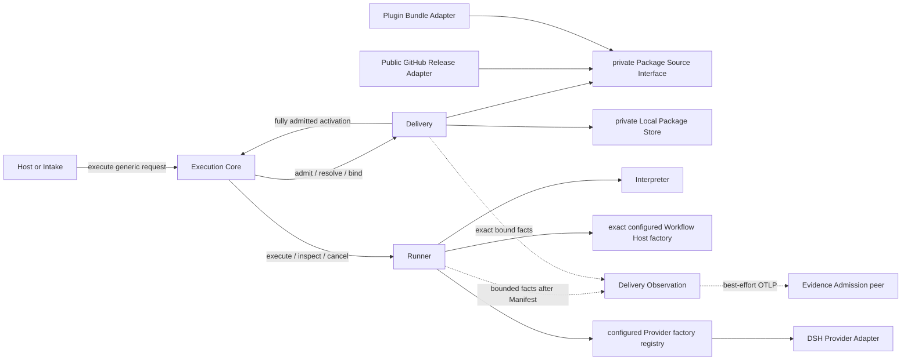
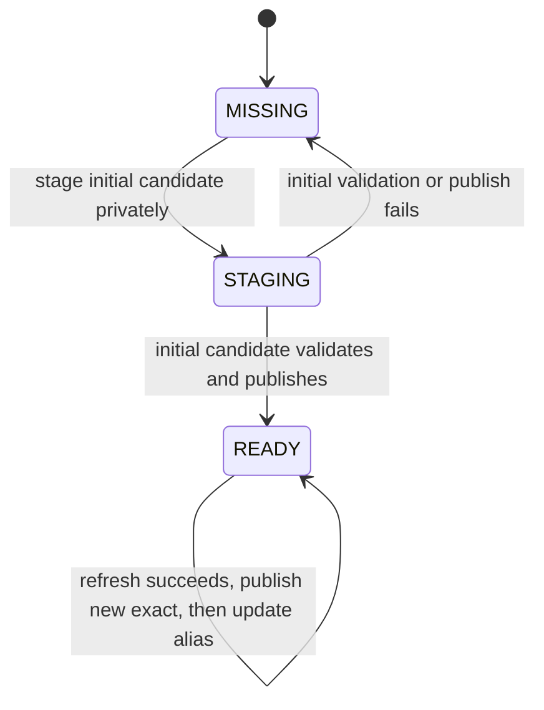
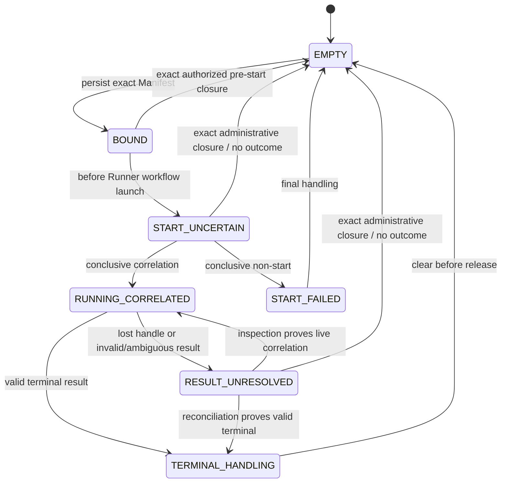

<a id="ee-execution"></a>
# Project Execution System Design

<a id="ee-execution-1"></a>
## 1. Metadata and Authority

| Field | Value |
| --- | --- |
| Document identity | `execution.identity.001` |
| Publication status | `WORKING_REVIEW_CANDIDATE`; prior bounded review, translation, and fresh-reader closure apply to earlier bytes only. These changed bytes require fresh deterministic parity/publication binding and user or reader review before exact publication. |
| Exact publication binding | The external publication set/application record must bind this byte stream and the companion canonical Concept byte stream by SHA-256, record the applicable review, SD-12, fresh-reader, and deterministic-verification evidence, and prove exact installation. This document intentionally declares no self-digest or companion digest. |
| Authority after promotion | Sole versionless English Project Execution System Design authority |
| Current structure authority | GitHub issues [#45 execution.delivery](https://github.com/firestige/workflow-self-recursive/issues/45), [#46 execution.observation](https://github.com/firestige/workflow-self-recursive/issues/46), and [#47 execution.runner](https://github.com/firestige/workflow-self-recursive/issues/47); this candidate calibrates the document to those decisions |
| Normative language | English |
| Translation | [`project-execution-system.zh-CN.md`](project-execution-system.zh-CN.md) is a non-normative tracking translation. English is the sole semantic authority. Whenever an English section changes, its Chinese counterpart is retranslated from the current English section and replaced as a whole; Chinese maintenance does not preserve or incrementally evolve prior Chinese wording. |
| Source lineage | Repository history; this candidate makes no claim against an unresolvable external commit. |
| Concept authority | [`concept.identity.001`](../../agent-architecture.md#ee-concept), promoted atomically as the companion member |
| Prior canonical Execution baseline | `execution.identity.001`; repository history owns provenance |
| Composition authority | [`docs/workflow-composition-model.md`](../../workflow-composition-model.md) |
| Confirmed intent | `EE-WORKFLOW-IMPORT-BRIEF`; SHA-256 `7c9b1064084cf5f256f27bc5efd021bed0374910e1430586eebeb695344d4c6d` |
| Confirmed direction | `EE-WORKFLOW-IMPORT-SKELETON`; SHA-256 `86a2a61a324d9bb7ca90108b433ded2f883bc91d9f60dadee87ac7d11feb8e46` |
| Historical direction review | `EE-WORKFLOW-IMPORT-SD05-ARCH-RECHECK`; SHA-256 `2c4fbaef0db617ccfc9ce20be8b5470a7251938744cc2d5d792f5ed9ed197c4a`; `PASS`; applies to the prior large Workflow-import direction |
| Feasibility | `EE-WORKFLOW-IMPORT-SD06-APPLICATION`; SHA-256 `c6714b9c850536273a00b929559f6d71b8ff2c8aeb1f2aaf8054c14c53ca5795`; `FEASIBILITY_CONFIRMED` |
| Targeted simplification authority | `EE-WORKFLOW-IMPORT-MVP-SIMPLIFICATION-RR`; removes mechanisms only, adds no feasibility question, and authorizes bounded affected review |
| Historical expansion inputs | `EE-WORKFLOW-IMPORT-SD07-CP01` SHA-256 `f4c3ef4a09867fc05e2782aefec7616f02b96132cb7ccddf158156ba526e1d85`; `CP02` SHA-256 `0d16e85e4f944720aa49a54ff7c60f2545f925d7a9576067128e860a2ae98d84`; `CP03` SHA-256 `e6f1f054bcf2252684f9e587e09a058e3f40f885bfbbc7011d99fc6d4732a4cd`; apply to the prior large Workflow-import expansion |
| Historical large-workflow review lineage | Problem–Solution, Architecture, and Quality review results from the larger Workflow-import design remain historical evidence for unchanged content only. |
| Historical large-workflow Finding accounting | `EE-WORKFLOW-IMPORT-SD10-AGGREGATION` is historical and is not the Finding account for this targeted simplification. |
| Historical design-parameter and handoff closure | `EE-WORKFLOW-IMPORT-SD12-CLOSURE-HANDOFF`; SHA-256 `60f24178d3a2f8991d6af2f974e4ed03d35aedc0064d9d253b3773e732e18ea7`; `SUCCEEDED` |
| Historical large-workflow Fresh Reader lineage | `EE-WORKFLOW-IMPORT-SD13-FRESH-READER-RESULT` applies to prior bytes and remains historical. |
| Historical controlled integration authority | `EE-WORKFLOW-IMPORT-SD14-REVISION-REQUEST`; SHA-256 `135ab9647fc6e30318735eff3cef858853cec75f47704e6eaaabd13ecbc59b2e`; deterministic report SHA-256 `1eda28b1c73a8b7d931ab58207d34796173a06bf20cdfae0e17accb2a3a3dc18`; applies to the prior large Workflow-import integration |
| Bounded affected reviews | Problem–Solution SHA-256 `807863cb6c7887eccdb2720df5ace0afd8e4833f763a029928f44ed1e30e92ae`; Architecture SHA-256 `b220e1114d166cc5a55e34635f847ac2c1af0cf1777bb9c6a6c08dbadf5cdf98`; Quality SHA-256 `b64927087758a987a1f5a4d461035c379970ad84af57133714462ea19ac22f77`; converged on two treatment groups |
| Unified bounded treatment | `EE-WORKFLOW-IMPORT-MVP-SIMPLIFICATION-SD10-TREATMENT`; SHA-256 `da22b3356aa34c3bcf6e3977a3277ef5b0d9c1e8beef35f4fe0db7dd5e72caf6` |
| Prior focused bounded recheck | `EE-WORKFLOW-IMPORT-MVP-SIMPLIFICATION-SD10-BOUNDED-RECHECK`; SHA-256 `1b5664afd796910beb8b505bbaadd889fbb7fb098b02c141abb27cdba4e74955`; `CLOSED_FIXED`; open Findings `0`; applies to earlier bytes only |
| Prior translation and fresh-reader closure | Whole-section translation parity SHA-256 `3c236a404392e1d496e33d4adcdd70000d0db2a2453dcbd7df40813612f77c20`; fresh-reader result SHA-256 `1062561d35422bfacfa7e430f381e5fb25a5a2a911fe8daa5e3499eac5fc2a75`; translation treatment SHA-256 `927a02c6d88eba3571e39c010681b8b47dc956e9a8bafea6812aa9cda91c5d14`; focused recheck SHA-256 `6777175a4e78e363d24ddc3f6bc657b66e9f5a6c2e9fd0042dd210705035c18e`; applies to earlier bytes only. Current changed bytes are pending fresh deterministic parity and user or reader review |

Authority order is: confirmed user intent; the current structure issues named above; normative Concept; this Execution candidate; Workflow composition model; and published Contracts within their declared scopes. Published Observation and interaction packages currently support validator-only claims; production and cross-implementation conformance remain unproven. The [Evidence System](../evidence/evidence-system.md) remains a peer owner. This document owns the placement of M01–M03, their Core contracts, and system-wide invariants. [Runner Module Detailed Design](modules/runner/runner.md) owns private M02 detail. This document does not own Workflow Package publication policy, Evidence internals, Observation fact meaning, the payload registry, metric schema, or physical storage schema.

The protected `system-design` and `implementation` Workflow Packages are initial verified distribution content and conformance fixtures, not redesign targets outside the R6 corrections authorized below. No disposable workspace artifact is required to interpret this document; the identities above are provenance only.

### Runner delivery-admission and Core projection

For Iteration 2 Runner, Execution owns `agentops.delivery-admission@1.0.0` at `system-contracts/delivery-admission/delivery-admission-contract.json`. Admission deterministically resolves `agentops.workflow-dsl@1.1.0` author intent into one deeply frozen `RunnerActivationContext`; this includes exact Agent, model, Driver, provider-model, resource, capability, workspace, and local path bindings. The deterministic activation compiler receives only that admitted value, never the eight documents, eight root schemas, or shared meta schema.

Execution also owns the current Core-to-Runner TypeScript projection at `execution-system/src/execution/runtime-adapter.ts`. Its operation set is exactly `execute`, `inspect`, and `cancel`. The historical type name `ExecutionRuntimeAdapter` is an implementation seam, not evidence that M02 is already a polymorphic Runner abstraction. The Runner Lifecycle Coordinator implements that surface. Resume, recovery, checkpoint, thread, and provider-session operations remain private to Runner.

Runner is M02. It receives a fully admitted activation from Core after M01 has completed worktree admission, Package resolution, current-slot/Manifest persistence, and exact binding projection. Runner's five submodules are Interpreter, Lifecycle Coordinator, Workflow Host, Managed Agent Invocation, and Custody; the Iteration 2 implementation exists under `execution-system/src`. There is no current selection among multiple Runner implementations. If that need appears later, M02 may be promoted into a Runner abstraction and every concrete implementation must receive a distinct name. See the [Runner Module Detailed Design](modules/runner/runner.md).
<a id="ee-execution-2"></a>
## 2. Design Context

workflow-self-recursive runs valuable logical Workflows through a small host-neutral execution seam and optionally emits factual Observation. Execution is embedded per repository/workspace. Runner is Execution module M02. It privately composes a replaceable Workflow Host and configured Provider Adapters; the current Host substrate is LangGraph and the only concrete Provider is DSH. Native sessions, checkpoints and private resume remain inside Runner and do not change Core semantics.

The first distribution contains the protected Implementation and System Design Workflow Packages. Contributors may publish other Packages conforming to the open Agent Ops Workflow composition model. GitHub is the first remote host, and the plugin may bundle the two initial Packages. GitHub and bundle are private Adapters at one Package Source seam.

This is a trusted local preview for an individual or small team. The configured GitHub repository is public, users control installation configuration, and concurrent Package management is not a product requirement. The design handles ordinary faults by validation and typed early return. It does not build authentication, authorization, signing, hostile-Package or prompt-injection defense, sandboxing, multi-user coordination, distributed locking, Package transactions, production recovery, HA, mirror failover, or automatic eviction.

Actors and ownership:

- **Host or Intake** translates host/chat syntax into a generic Workflow selector, task intent, worktree reference, configured source, and current Runner configuration context.
- **Execution Core** sequences canonical worktree/exclusive admission, Package preparation only for `NEW`, Manifest creation/persistence, Runtime lifecycle, result validation, and Observation.
- **Delivery (M01)** owns selector/Package resolution, Source/Store, canonical-worktree admission, current-slot and Manifest persistence, Delivery recovery/final handling, and projection of one fully admitted Runner activation.
- **Runner (M02)** owns execution of that admitted activation. Interpreter compiles it; Coordinator, Host, Invocation, and Custody own private execution state and effects.
- **GitHub and plugin-bundle Adapters** fetch explicitly selected Package content.
- **Evidence** receives optional one-way Observation and never controls Execution.

<a id="ee-execution-3"></a>
## 3. Problem, Goals, and Scope

The existing Delivery Binding begins too late: it assumes the caller already has exact Workflow identities and never explains where a Workflow Package comes from. Moving download, cache lookup, validation, and current Runner/DSH compatibility into Host code would keep Delivery Binding shallow and make each host reproduce the same behavior.

The goal is an implementable local-preview path from a generic selector to DSH:

```text
WorkflowSelector
→ Delivery (M01): admission + exact Package + DeliveryManifest
→ Runner (M02): admitted activation execution
```

A successful call first obtains `NEW` admission, resolves one exact local Package, creates and persists a Delivery Manifest before any Runner Workflow/Host/Provider effect, projects the fully admitted activation, and validates the Runner result against that Manifest. `CONTENDED` and `RECOVERY` return before Package work. For `NEW`, a valid local hit does not contact GitHub. A miss downloads from the configured public GitHub repository or accepts an explicitly selected bundle, validates before publishing `READY`, and never falls back to another source/version. Any selector, fetch, Package, cache, compatibility, contention, or Manifest error returns at its own phase. Package preparation failure releases the ordinary holder, creates no Delivery, and is not a Delivery outcome.

In scope are generic Intake, exact/sticky-latest selectors, local hit, public GitHub miss/refresh, explicit bundle input, contributed conforming Packages, `MISSING/STAGING/READY` storage, ordinary format/required-resource/relationship/version/digest checks, DSH compatibility checks, immutable Manifest binding, existing current-slot recovery, DSH result validation, and unchanged Observation.

Out of scope are Package ranking/fallback, ambient completion, authentication/authorization/RBAC, credentials for the public source, signing, hostile input isolation, injection defense, sandboxing, concurrent Package correctness, queueing/fairness, distributed locks, Package transaction/proof/hold protocols, automated eviction, production download/recovery guarantees, registry/marketplace, HA/failover, repository naming/layout, physical schema, a second Runner implementation or Runner-selection abstraction, Evidence redesign, and changes to the protected Packages.

Success means an implementer can build the path through the three existing Modules with simple state and typed results, without inventing another lifecycle before the Delivery Manifest.

<a id="ee-execution-4"></a>
## 4. Design Drivers

| Driver | Required outcome | Structural consequence |
| --- | --- | --- |
| Delivery Binding depth | Hosts do not implement Package import choreography | M01 exposes one resolve/prepare operation and owns private Source/Store seams |
| Admit before request Package work | contender and stored recovery avoid needless selector/cache/download work | Core enters M01 admission first; only M01's `NEW` branch performs Package work |
| Prepare before Delivery | acquisition or validation failure is not a Delivery failure | under the ordinary `NEW` holder, M01 completes before Core creates Manifest content or invokes Runner |
| Exact binding | alias or Release movement cannot alter a created Delivery | resolved value contains exact version, digest, local path, and Workflow ID |
| Docker-like local-first | valid exact/latest hit avoids GitHub; bare name means latest | Store lookup precedes Source Adapter; sticky alias points to a `READY` exact Package |
| Ordinary fault containment | malformed/unavailable input stops early without a recovery subsystem | typed early-return results at selector, source, validation, cache, admission, and Manifest phases |
| Simple exclusivity | one current Runner Delivery per worktree | M01 attempts exclusive admission and immediately returns `CONTENDED` when unavailable |
| No fallback/default completion | failure never chooses another source/version/resource | one configured source or explicit bundle; DSH validates before native effect |
| Open contribution | compatible third-party Package uses the common path | composition and DSH checks, no first-party allow-list |
| Preview restraint | complexity must match trusted local use | no security platform, concurrent Store protocol, automatic eviction, or production recovery |
| Observation non-control | telemetry failure cannot alter outcome | unchanged one-way M03 Interface |

Numeric latency, timeout, capacity, and retention settings remain implementation/operations choices unless measured facts later force a design change.

<a id="ee-execution-5"></a>
## 5. Problem Decomposition

1. **Create or recover a Delivery (`execution.module.001`, M01).** Canonicalize the worktree; return `CONTENDED` or stored `RECOVERY`, or under a `NEW` holder resolve/prepare one exact Package, persist the Manifest/current slot, and project a fully admitted activation.
2. **Execute the admitted activation (`execution.module.002`, M02).** Interpreter validates/compiles; Coordinator drives Host, Invocation, and Custody; Runner returns typed terminal, start-failed, or unknown truth through the Core seam.
3. **Finalize the Delivery (M01).** Validate the bounded Runner result against the Manifest, preserve exact lifecycle truth, and close or retain the current slot according to known state.
4. **Observe bounded facts (`execution.module.003`, M03).** After a Delivery exists, map actual facts to the existing best-effort Observation profile without controlling execution.

These map directly to Delivery (M01), Runner (M02), and Delivery Observation (M03). M01 owns Delivery acquisition/admission/binding/lifecycle; M02 owns admitted execution; M03 owns non-controlling emission. The deletion test justifies all three Modules. Runner's five submodules do not add top-level Execution modules.

<a id="ee-execution-6"></a>
## 6. System Structure



### Delivery (`execution.milestone.01`), deepened

M01 hides selector parsing, exact/sticky lookup, GitHub/bundle acquisition, staging, Package validation, DSH compatibility checks, `READY` publication, alias update, resolved-value construction, Manifest content construction, and result-binding checks. Its main caller-facing operation is:

```text
resolveWorkflowPackage(selector, configuredSource, runnerConfigurationTarget, refresh?)
  -> ResolvedWorkflowPackage
  | WorkflowImportError
```

The result is a plain immutable value: `name`, `exactVersion`, `packageDigest`, `localPath`, and `workflowId`. It is not a capability, proof, hold, or lifecycle state. M01 additionally constructs Manifest content from a Delivery context plus that value and validates a bounded Runner result against the Manifest. Callers never coordinate Source or Store steps themselves.

### Runner (`execution.milestone.02`), issue-calibrated and bounded

M02 accepts only the fully admitted activation projected from M01's persisted Manifest. It owns activation validation/compilation, Workflow execution, Provider invocation, savepoints/custody, Runner inspection/cancellation, and typed terminal/start-failed/unknown truth. It does not derive or admit worktrees, resolve/download Packages, own Source/Store, write the Delivery current slot, or persist the Delivery Manifest.

M02 freezes the exact Runner configuration identity. `RunnerFactory` consumes that configuration to assemble submodule instances, but cannot use ambient discovery, prioritize factories, fall back to another Provider/Host, or substitute an in-flight Delivery. Provider-native and Host-native factories remain Runner-private. Selection among multiple Runner implementations is intentionally absent from the current design.

The preview does not add a second pre-Manifest lifecycle. Before a Manifest exists, failure releases the ordinary in-process/OS-backed exclusive holder and returns. A process death releases that holder. If death occurs after the Manifest becomes visible, the existing occupied-slot recovery reads that Manifest on the next call. No `ARMED`/commit-unknown/reconciliation state is introduced.

### Delivery Observation (`execution.milestone.03`)

M03 maps bounded actual Delivery facts to the adopted allow-listed standard-first Observation Profile, owns privacy/redaction and exporter isolation, and returns diagnostics only. It does not own source facts or control execution. Custody-only attempts and preparation rejection produce no Delivery Observation. The exact carrier/EventName/common/family registry and complete Review-family shapes are owned by the [OTel Observation Profile](../../contracts/observation/otel-observation-profile.md); technology-neutral fact meaning, identity, missingness, privacy, lineage, usage, and relationship semantics are owned by the [Observation Catalog](../../contracts/observation/observation-catalog.md); transport interaction is owned by the [Execution–Evidence Interaction Contract](../../contracts/execution-evidence/interaction-contract.md). M3 does not own the payload registry or Evidence durable storage semantics.

Specifically, the frozen and published profile `1.0.0` carries forward the adopted semantics and adds the owner-supplied C55–C57 mappings; `0.3.0` is non-resolving legacy history only. The current profile uses official OTLP/HTTP binary protobuf Trace and Log export, one sampled Delivery root with nested Workflow/Agent/model/tool Spans, ten EventNames, and the closed 57-common/10-Implementation/6-System-Design field registries. One family may use common plus its own fields, never its sibling's. Stock DSH Session JSON telemetry stays disabled. Every Event has stable `agentops.event.id`; every Span is identified by its native `(trace_id, span_id)` tuple. Standard token usage remains on model Spans, while other provider-native quantities use typed usage Events with exact kind/unit/source/source-ID/completeness; missing never means zero and no conversion or price is inferred.

Review summary, Finding, Fix, and Recheck still select one complete named base-plus-variant shape. Every Finding carries one bounded privacy-safe factual summary, a Finding-specific scope identity, and exactly one typed Artifact/section/component/requirement target; multi-target Findings repeat the complete assertion per target edge. Owner-known Role lineage carries both version-local Role ID and family-scoped lineage ID; unknown lineage is omitted, never inferred from name or position. M03 emits no prompt, message, tool argument/result, source/diff, credential, or raw-error body and never infers quality, causality, reviewer effectiveness, or relationship from names, order, counts, or grouping. Administrative unresolved/abandonment state remains M02 state and is not a first-profile Observation.

Implementation facts retain typed test summary and one implementation summary per coverage scope/tool/format/report Artifact. System Design retains common review relationships, Fresh Reader review summary, and deterministic-verification summary. Observed Agent/model/tool calls and durations stay on standard Spans; family summaries carry only owner-observed loop/intervention facts. Before emission M03 selects one whole shape and requires its entire base and variant additions—never a fragment or implicit inheritance.

For ordinary and Recheck summaries, owner input with a nonnegative observed count emits C17 exactly, including zero; absence of a count fact omits C17. Omission is the whole wire signal for no count fact. Invalid count type/range emits no malformed Observation. C17 remains prohibited on Finding shapes. C27 remains required only where the existing profile requires Recheck semantics. Assertion, target, status, Fix, and Recheck identities remain distinct; exact retry is a no-op and compatible later lifecycle facts append rather than rewrite the assertion. Every lifecycle record repeats the immutable assertion and exact typed target coordinates required by its selected shape.

### Private seams

- The **Package Source Interface** is real because GitHub and bundle are two Adapters. It accepts an exact or latest candidate request and returns candidate bytes plus ordinary version/digest metadata, or a typed not-found/fetch failure. It does not construct resolved values or Manifests.
- The **Local Package Store** is private M01 state. Lookup exposes only `MISSING` or `READY`; `STAGING` is never addressable. The implementation may use a temporary directory and rename to publish a complete Package, but the System Design does not require a transaction manager or concurrent-writer protocol.
- The **Core-to-Runner Interface** accepts the fully admitted immutable activation projected from the persisted exact Manifest binding. Runner implements exactly `execute`, `inspect`, and `cancel`; no native Host, Provider, resume, checkpoint or retirement type crosses Core.

Dependency direction is acyclic toward Core-owned meaning. Host does not orchestrate M01 internals; M02 never accesses Source/Store; source Adapters never construct Manifests; M01 does not depend on Evidence; DSH does not choose Package identity.

<a id="ee-execution-7"></a>
## 7. Collaboration and End-to-End Flows

### Branch-free successful Delivery

```mermaid
sequenceDiagram
    actor User
    participant Host as Host / Intake
    participant Core as Execution Core
    participant Delivery as Delivery (M01)
    participant Runner as Runner (M02)
    participant DB as Delivery Binding
    participant SS as Source and Store
    participant DO as Delivery Observation

    User->>Host: run selector with task intent
    Host->>Core: execute(generic request)
    Core->>Delivery: admit(canonical worktree)
    Delivery-->>Core: NEW exclusive holder
    Delivery->>DB: resolveWorkflowPackage(...)
    DB->>SS: lookup READY exact or sticky latest
    SS-->>DB: MISSING
    DB->>SS: fetch configured candidate into STAGING
    DB->>DB: validate format, closure, version, digest, DSH compatibility
    DB->>SS: publish exact Package READY, update requested latest alias
    SS-->>DB: local exact Package
    DB-->>Delivery: ResolvedWorkflowPackage
    Delivery->>DB: createManifest(delivery context, resolved Package)
    DB-->>Delivery: immutable Manifest content
    Delivery->>Delivery: persist Manifest/current slot
    Delivery-->>Core: fully admitted RunnerActivationContext
    Core->>Runner: run persisted Delivery
    Runner->>Runner: execute fully admitted activation
    Runner-->>Core: bounded Runner result
    Core->>Delivery: validate/finalize against Manifest
    Delivery->>Delivery: clear or retain slot; release holder when known
    Core->>DO: bounded actual Delivery facts
    Core-->>Host: final Delivery outcome
```

The successful ordering is admit `NEW`, resolve/prepare, construct Manifest, persist current Manifest, project the admitted activation, mark start uncertainty, invoke Runner, validate result, finalize, then observe. Package preparation occurs under the ordinary Delivery exclusivity holder but has no Delivery identity or Delivery Observation. This holder prevents another current Delivery; it is not a Package proof, hold, transaction, or concurrent Store protocol.

Every selector, source, Package, version, digest, cache, and DSH compatibility branch owned by M01 occurs only inside M01 after its admission phase returns `NEW`. Any such failure releases the ordinary holder and returns before Manifest persistence, Delivery creation, Runtime/Session/worktree effect, or Observation. Canonical worktree and request-shape checks belong to M01 admission. `CONTENDED` and `RECOVERY` never call M01, Source, or Store.

### Valid local exact or sticky-latest hit

M01 parses the selector and asks Store first. `name@exactVersion` resolves only the matching `READY` Package. Bare `name` and `name@latest` use the local sticky alias when it points to `READY`. Unless the caller explicitly requests refresh, M01 makes zero Source call. The returned exact fields are copied into the Manifest, so later alias movement affects only later calls.

### Public GitHub miss or explicit refresh

On `MISSING`, or explicit refresh of latest, M01 asks only the configured public GitHub Adapter. Exact selection requests that exact Release; latest selection requests the source's latest Release. The Adapter selects one versioned Package asset and stages it privately. M01 validates before Store publication. For latest, Store updates the alias only after the exact Package is `READY`. Failure returns a typed error and leaves any previous `READY` Package/alias usable.

### Explicit plugin bundle

A bundle is used only when the caller/configuration explicitly selects it. The bundle Adapter supplies the same generic candidate shape as GitHub; M01 runs the same validation, Store publication, resolved-value, and Manifest path. Bundle is not a fallback when GitHub fails.

### Invalid selector

After `NEW`, unsupported or ambiguous selector syntax returns `INVALID_WORKFLOW_SELECTOR` before Source or Store mutation. Core releases the ordinary holder; no Manifest, Delivery, Runtime/Session/worktree effect, or Observation exists.

### GitHub unavailable or Package not found

A required remote lookup that cannot reach/download returns `WORKFLOW_FETCH_FAILED`. A missing requested Release/asset returns `WORKFLOW_NOT_FOUND`. Neither calls the bundle Adapter or tries another version. Core releases the ordinary `NEW` holder; no Manifest or Delivery exists.

### Invalid or incomplete Package

Malformed Package index, missing required owned/referenced resource, unresolved relationship, unsupported composition, or invalid identity returns `WORKFLOW_PACKAGE_INVALID`. The candidate remains non-addressable, Core releases the ordinary `NEW` holder, and no Manifest or Delivery exists.

### Version or digest mismatch

A candidate whose declared/resolved version disagrees with the request returns `WORKFLOW_VERSION_MISMATCH`. Digest disagreement returns `WORKFLOW_DIGEST_MISMATCH`. M01 does not publish `READY` or reinterpret the candidate as another version; Core releases the ordinary `NEW` holder.

### DSH incompatibility

After `NEW`, M01 checks that the selected Package contains the declared DSH implementation/routes and required configuration before returning the resolved value. Missing or unsupported DSH inputs return `WORKFLOW_DSH_INCOMPATIBLE`; Core releases the ordinary holder before Manifest persistence, Delivery creation, Session, provider/Driver, worktree effect, or Observation. This check returns an error; it does not create a persisted proof object.

### Cache publication failure

Failure to make a validated candidate `READY` returns `WORKFLOW_CACHE_PUBLISH_FAILED`, then Core releases the ordinary `NEW` holder. `STAGING` is ignored by future lookups and may be removed best effort. Initial-fill failure leaves lookup `MISSING`; refresh-candidate failure leaves the prior `READY` exact Package and sticky alias unchanged. The preview promises no crash/power-loss matrix or concurrent refresh correctness.

### Delivery contention

M01 attempts the existing per-worktree exclusive admission before request-specific Package work. A live/current holder returns `CONTENDED` immediately. Core does not wait, queue, steal, resolve/download a Package, access request-specific Store state, create a Manifest, invoke DSH, or emit Delivery Observation.

### Occupied-slot recovery

If admission finds an existing current Manifest, M01 returns recovery for that stored Delivery. Core ignores the new selector/task and does not call M01, Source, or Store. It follows the existing DSH inspection/result/authorized-abandonment rules and never starts, resumes, or replaces the stored DSH Delivery.

### Manifest creation or persistence failure

If M01 cannot construct a complete Manifest, Core releases the exclusive holder and returns `DELIVERY_BINDING_FAILED`. If M01 cannot persist the Manifest/current slot, it releases the holder and returns `DELIVERY_CREATE_FAILED`. Neither error is a Delivery outcome; neither starts Runner workflow execution nor emits through M03. A process death after the Manifest becomes visible is handled by ordinary occupied-slot recovery; no separate commit-resolution protocol exists.

### Runner activation, invalid result, and Observation loss

Delivery admission validates the persisted Manifest and projects one deeply frozen `RunnerActivationContext` before any Runner Workflow/Host/Provider effect. Runner does not scan ambient Package paths or replace resources. After invocation, existing `START_UNCERTAIN`, `START_FAILED`, `RESULT_UNRESOLVED`, terminal-result, final-handling, and exact authorized-abandonment rules remain. Disabled/refused/timed-out/tail-loss Observation changes no Runner result or slot handling.

### Runner private lifecycle

Runner satisfies the Core-owned lifecycle meaning while privately parking resumable state, checkpointing, releasing physical custody and reacquiring valid custody. Those mechanics do not become DSH or public Core requirements. Runner is an internal Execution module; its candidate detailed design is in the [Runner module design](modules/runner/runner.md), with IDs and implementation evidence kept in the [traceability companion](modules/runner/traceability.md).

<a id="ee-execution-8"></a>
## 8. Data, State, Identity, and Ownership

### Binding data

```text
WorkflowSelector
→ ResolvedWorkflowPackage
→ DeliveryManifest
→ Runner-private Workflow Host state plus Provider-native session
→ bounded result validated against Manifest
```

`ResolvedWorkflowPackage` contains `name`, `exactVersion`, `packageDigest`, `localPath`, and `workflowId`. The local path identifies the validated `READY` materialization for this installation; version and digest provide the stable content check used by Manifest construction and DSH activation. Source metadata may be retained as bounded diagnostics/provenance, but it is not an authorization identity or capability.

The Manifest binds exactly one Delivery/task relationship, the resolved exact Package fields, logical Workflow/implementation, Runtime/version/configuration, intent reference, and bounded source context. It excludes mutable aliases, raw Package/Prompt/message/tool/source/credential bodies, Runtime checkpoints, Evidence receipts, and native custody/Session identifiers. Physical fields remain downstream representation work.

### Authoritative state

| State | Unique writer | Readers | Rule |
| --- | --- | --- | --- |
| selector/configured source | Host/Intake | Core/M01 | generic input; source is trusted configuration |
| Store `STAGING`/`READY` and sticky alias | M01 through Store | M01; DSH materializer reads exact `READY` path | staging is private; alias points only to ready exact Package; no automatic eviction |
| resolved exact Package value | M01 | Core/M01/Runner | immutable value for one call; never re-resolved during Manifest/activation |
| canonical exclusivity/current slot | M01 Delivery | Core/M01 | admission precedes request-specific Package work; `CONTENDED`/`RECOVERY` do no new Package work; one current Delivery |
| Manifest content | M01 constructs; Runner persists | Core, Runner, M03 | persistence creates the current Delivery binding |
| native Session/Workflow State/result | Runner submodules | Core observes bounded projection | Runner-owned |
| Observation representation | M03 | exporter/Evidence | transient/best-effort and non-controlling |

There is no Prepared Binding store, proof identity, hold/reference count, liveness transfer, pre-Manifest authority, or Package-transaction state.

### Local Package Store



`MISSING` and `READY` are lookup outcomes. `STAGING` describes the private lifecycle of a new candidate, never a hit. For initial fill there is no prior value, so candidate failure leaves `MISSING`. During refresh, candidate staging exists beside the current `READY` Package and alias; it does not transition that visible lookup state. Failure discards or ignores only the candidate, while success publishes the new exact Package and then changes the alias. This is sequential local state handling, not a transaction or concurrent-writer protocol. Temporary residue may be removed best effort and has no semantic state. The preview does not evict `READY` Packages automatically and therefore needs no active-Delivery reference tracking.

### Current Delivery slot

The existing slot remains `EMPTY → BOUND → START_UNCERTAIN → RUNNING_CORRELATED → TERMINAL_HANDLING → EMPTY`, with conclusive `START_FAILED`, blocking `RESULT_UNRESOLVED`, and exact administrative closure branches. Package preparation occurs while M01 holds exclusive `NEW` admission but before any slot state is written. Process death before Manifest persistence leaves no Delivery; death after persistence leaves the occupied Manifest for existing recovery.



<a id="ee-execution-9"></a>
## 9. Interfaces, Dependencies, Seams, and Adapters

| Interface meaning | Caller-visible input | Result/error | Ordering/configuration |
| --- | --- | --- | --- |
| External Core operation | worktree, selector, task intent, configured source or explicit bundle, Runner configuration context, optional refresh | final Delivery outcome, `CONTENDED`, exact recovery, or typed pre-Delivery error | one host call; no native fields; M01 admission first |
| M01 admit | canonicalizable worktree | `NEW` holder, `CONTENDED`, exact `RECOVERY`, or custody/identity error | first Delivery phase; immediate; non-`NEW` performs no Package work or Runner execution call |
| M01 resolve/prepare | `NEW` holder context, selector, configured source, current Runner compatibility target, refresh flag | `ResolvedWorkflowPackage` or phase-typed Package error | local-first; at most one Source Adapter; no fallback |
| M01 bind/persist | resolved Package plus complete Delivery/task/worktree/Runner/intent context | immutable Manifest and admitted activation, or `DELIVERY_BINDING_FAILED` / `DELIVERY_CREATE_FAILED` | no Runner submodule effect before persisted exact binding |
| M02 execute/inspect/cancel | fully admitted activation or exact Delivery reference | bounded Runner terminal/start-failed/unknown result or typed seam error | no Source/Store/current-slot ownership; native state remains private |
| M01 validate/finalize | exact Manifest plus bounded Runner result | final lifecycle outcome/error | close or retain slot from known truth |
| M03 observe | bounded post-Delivery facts | local diagnostics only | existing profile/privacy; no control effect |

The Source Interface accepts one candidate request. The public GitHub Adapter obtains Release metadata and one versioned asset; the bundle Adapter reads one explicitly selected bundled Package. Source-native fields remain private. Not-found and ordinary transport failures are distinct typed results.

The Store implementation performs lookup, private candidate staging, complete publication, exact conflict detection, and sticky-alias update after the new exact Package is `READY`. Initial failure leaves `MISSING`; refresh failure preserves the prior `READY` Package and alias. A local filesystem implementation may stage in a sibling temporary directory and rename into the final exact path. That is an implementation technique for avoiding partial hits, not a production transaction protocol. No caller sees Store choreography.

Runner accepts only the fully admitted immutable activation derived from the persisted Manifest and exact local `READY` Package. It validates exact correlation/bindings before child effect. The selected DSH Provider remains private. Existing module tests prove bounded seams; Wave 4 walking-skeleton and fault-corpus evidence are still required for full production conformance.

<a id="ee-execution-10"></a>
## 10. Failure, Recovery, and System-wide Behavior

| Failure domain | Containment |
| --- | --- |
| selector | after M01 `NEW`, `INVALID_WORKFLOW_SELECTOR` before Source/Store mutation; release holder; no Manifest/Delivery/Runner/Observation |
| local lookup | `STAGING` is ignored; invalid `READY` metadata is `WORKFLOW_PACKAGE_INVALID` |
| GitHub/bundle source | not found is `WORKFLOW_NOT_FOUND`; unavailable/interrupted transfer is `WORKFLOW_FETCH_FAILED`; no fallback |
| Package validation | format/required-resource/relationship/identity failure is `WORKFLOW_PACKAGE_INVALID` |
| version/digest | explicit mismatch codes; do not publish `READY` |
| DSH compatibility | after `NEW`, `WORKFLOW_DSH_INCOMPATIBLE`; release holder before Manifest/Delivery/native effect/Observation |
| Store publication | `WORKFLOW_CACHE_PUBLISH_FAILED`; initial fill remains `MISSING`, refresh preserves prior `READY`+alias; release holder; temporary residue is best-effort cleanup |
| Delivery admission | M01 first; `CONTENDED` or `RECOVERY` has no Source/Store or Runner execution call; no wait/queue/steal/new Manifest |
| Manifest construction/persistence | `DELIVERY_BINDING_FAILED` or `DELIVERY_CREATE_FAILED`; release exclusive holder; no M02/M03 |
| Runner start/result | preserve `START_UNCERTAIN`, `START_FAILED`, `RESULT_UNRESOLVED`, conclusive inspection, final handling, and exact abandonment |
| process death | OS releases live holder; no persisted Manifest means no Delivery; persisted Manifest means existing occupied-slot recovery |
| Observation/export | diagnostics only; execution path is unchanged |

Pre-Delivery cancellation stops M01 work, performs best-effort staging cleanup, releases any live exclusive holder, and returns a pre-Delivery cancellation result. It is not Delivery `CANCELLED`. After M02 starts, Runner cancellation truth is represented through its typed seam and M01 retains Delivery lifecycle ownership. There is no background Package reconciler, durable queue, blind retry, automatic failover, or cleanup authority protocol.

All request-specific Package failure rows above assume M01 admission already returned `NEW`; they release that same ordinary holder. M01 may reject malformed canonical-worktree or admission request shape before interpreting the Workflow selector.

<a id="ee-execution-11"></a>
## 11. Quality Attribute Realization

| Quality | Context and threshold | Mechanism | Trade-off/residual risk | Verification |
| --- | --- | --- | --- | --- |
| Exactness | created Delivery cannot drift | exact resolved value copied into Manifest; DSH checks local digest/version | physical canonicalization downstream | binding/alias-movement fixtures |
| Fault containment | ordinary import failure creates no Delivery | typed early return before Manifest | no production recovery guarantee | Interface negative fixtures |
| Responsiveness | occupied/recovery returns before Package work; valid `NEW` local hit avoids network | M01-first admission, then local-first lookup | sticky latest may be stale | admission/M01/source spies |
| Maintainability | Hosts learn one import operation | deep M01 with private Source/Store seams | M01 has broad internal behavior | Interface tests and deletion test |
| Evolvability | new conforming Package/source Adapter need not change Core semantics | open composition model and real two-Adapter Source seam | publication governance downstream | contribution/paired-Adapter fixtures |
| Compatibility | complete Package is usable by selected DSH | ordinary M01 validation and Adapter-first activation | representative evidence is limited | protected/contributed/no-default fixtures |
| Privacy/operability | bounded phase-correct diagnostics and post-Delivery Observation | typed errors and unchanged M03 allow-list | best-effort loss accepted | telemetry/body-marker fixtures |
| Resource efficiency | no Core DB/history/outbox or automated eviction | one asset, local `READY` cache | disk use grows until manual cleanup | bounded resource observation |

Concurrency scalability, adversarial security, authentication/authorization, production HA/recovery, marketplace, registry federation, and automatic failover are `NOT_APPLICABLE` to the confirmed trusted local preview. They reopen design only when the deployment/trust/scale context changes.

<a id="ee-execution-12"></a>
## 12. Risks and Trade-offs

| Risk | Impact | Treatment/owner | Reopen condition |
| --- | --- | --- | --- |
| sticky latest is stale | user may not receive newest Release | explicit refresh; document Docker-like local-first behavior | product requires always-online freshness |
| public GitHub unavailable | cache miss cannot run | typed early return; existing `READY` Package remains usable | product requires availability/failover target |
| M01 owns broad import behavior | implementation may become hard to navigate | keep one small public operation and private cohesive helpers/seams | independent consumer/authority or measured Interface failure appears |
| local Store residue/disk growth | temporary or old Packages consume disk | best-effort staging cleanup and manual cache removal; no automatic eviction | measured use requires managed retention/eviction |
| DSH compatibility check is incomplete | failure could occur at activation | validate all declared required resources before effect; preserve honest Runtime errors | production Packages require new capability semantics |
| trusted-preview context changes | current validation becomes insufficient | explicit scope and reopen triggers | untrusted source/operator, remote shared service, credentials, hostile tenant, or stronger DSH security boundary |
| Observation/runner regression | unrelated authority could be disturbed | preserve M03 and Adapter-private runner semantics byte-for-meaning | control coupling, public resume, or runner code change |

<a id="ee-execution-13"></a>
## 13. Acceptance and Verification

### Design acceptance trace

| Scenario | Mechanism | Expected outcome | Verification state |
| --- | --- | --- | --- |
| generic intake (`execution.scenario.00`) | one generic Core operation | no host/DSH/source-native field crosses Core | implementation type scan planned |
| exact local hit (`execution.scenario.01`) | Store lookup before Source | exact resolved value; zero Source call | Interface fixture planned |
| exact miss (`execution.scenario.02`) | one configured GitHub Release asset | validated exact Package becomes `READY` | Source/Store fixture planned |
| sticky latest (`execution.scenario.03`) | alias points to `READY` exact Package | zero Source call on hit; no active drift | alias fixture planned |
| explicit refresh (`execution.scenario.04`) | candidate staging beside prior `READY`; publish exact before alias update | success installs new exact then alias; failure discards candidate and preserves prior `READY`+alias | initial-fill versus refresh Store fixture planned |
| contribution (`execution.scenario.05`) | shared composition/DSH validation | conforming third-party Package uses same path | production conformance planned |
| invalid/incompatible (`execution.scenario.06`) | M01 `NEW`, then ordinary Package validation and typed error | release ordinary holder; no Manifest, Delivery, DSH/Runtime/worktree effect, or Observation; non-`NEW` performs no M01/Source/Store work | admission/M01/Source/Store spy and negative matrix planned |
| preparation/Manifest failure (`execution.scenario.07`) | early return before/at Manifest persistence | no Delivery outcome or Observation | Core/M01 negative fixtures planned |
| explicit bundle (`execution.scenario.08`) | second private Source Adapter | same validation/resolution path; no fallback | paired Adapter evidence exists; production fixture planned |
| evolution (`execution.scenario.09`) | exact fields copied into Manifest | later alias/Release affects later Delivery only | movement fixture planned |
| no ambient (`execution.scenario.10`) | Adapter-first exact local validation | missing resource rejects before native effect | production no-default negatives planned |
| host portability (`execution.scenario.11`) | generic Core, private Adapters | no native type/public resume | type/contrast fixture planned |
| GitHub outage/not-found (`execution.scenario.12`) | typed Source result | local hit works; required remote call returns without Delivery/fallback | dead-network/not-found fixture planned |
| Delivery contention (`execution.scenario.13`) | M01 admission before Package work | `CONTENDED`; no wait, queue, Package work, or Manifest | admission/M01/Source/Store spy fixture planned |
| occupied recovery (`execution.scenario.14`) | M01 admission before Package work; stored Manifest authority | existing Delivery inspected; no new selector Package work or replacement | existing recovery plus M01/Source/Store spy fixture |
| DSH success/result | exact persisted Manifest | one native Session path and exact result validation | production end-to-end planned |
| Observation loss | unchanged one-way M03 | identical Delivery outcome and slot handling | existing loss fixtures planned |

### Evidence fixture register

The sparse numbering preserves the migrated identity of the two active Workflow-import fixture references; absent numbers are not reassigned.

| ID | Evidence meaning | Current state |
| --- | --- | --- |
| `execution.fixture.001` | protected first-party Package projection through the exact admitted Runner/DSH path with no ambient completion | representative design evidence; production negative qualification remains planned |
| `execution.fixture.004` | protected, contributed, and explicit-bundle Packages use the same Package Source and validation path | paired-Adapter feasibility evidence available; production contribution fixture remains planned |

### Implementation acceptance plan

Tests cross the M01 Delivery interface and M02 Core-to-Runner interface and assert observable results. Required coverage is the named local-hit/miss/bundle/validation/cache/contention/Manifest/DSH/result/Observation branches above. Tests do not prescribe private directory names, helper functions, lock primitives, or GitHub client library. This revision adds no Spike and no production security, concurrency schedule, response-loss, power-loss, transaction, hold, eviction, or HA matrix.

### Preserved existing Execution acceptance

| Existing concern | Required unchanged outcome | Verification responsibility |
| --- | --- | --- |
| Start uncertainty | unknown start remains occupied/blocking; only conclusive non-start or exact authorized closure clears | crash/restart and conclusive-inspection fixtures |
| Lost handle or invalid/ambiguous result | `RESULT_UNRESOLVED` remains occupied; no fabricated result or blind replay | malformed/lost-handle/reconciliation fixtures |
| Authorized abandonment | exact current authority clears with no Runner outcome/history/same-Delivery retry | positive, stale, mismatched authorization fixtures |
| Observation failure/privacy | identical execution outcome; zero prohibited body markers | disable/refusal/timeout/tail-loss and privacy scans |
| Profile mapping | exact frozen and published `1.0.0` carrier, ten EventNames, 57+10+6 registries, family exclusion; `0.3.0` is non-resolving legacy history | OTel Profile deterministic registry/table/type checks and production conformance |
| Review composition and Finding scope | exactly one complete named shape; bounded assertion plus one typed target; complete repetition for multi-target edges | complete-shape, endpoint, multi-target, privacy, duplicate/conflict fixtures |
| Count presence semantics | C17 zero/positive/omission remain distinct; invalid values and Finding carriers cannot land malformed count state | ordinary/Recheck zero/positive/absence and negative fixtures |
| Role lineage and usage | local/lineage pair remains distinct; provider-native quantities remain exact kind/unit/source groups | lineage duplicate/conflict/privacy and usage compatibility fixtures |
| Span/Event identity | Event ID and `(trace_id, span_id)` retain exact dedup/conflict meaning | new/identical/conflicting identity fixtures |
| Runner private lifecycle | private resume remains available without public resume/native leakage | Runner Adapter lifecycle/type fixture |

<a id="ee-execution-14"></a>
## 14. Decisions, Downstream Work, and Rejected Alternatives

For the three MVP Evaluation/BI owner facts, Execution's boundary is exact: the Runner/Execution result owner supplies C55 only from a complete start-to-terminal elapsed measurement; the Workflow owner supplies C56 as its exact furthest reached stage at terminal outcome; and the Provider model owner supplies C57 as the bounded provider-scoped canonical model identity on a model-call Span. C57 attribution also carries the local Role identity and joins to C06 from the Delivery root binding. Delivery Observation copies these supplied scalars when available; it does not compute, infer, alias-normalize, backfill, schedule, or settle them.

### Decision register

| ID | Decision |
| --- | --- |
| `execution.decision.001` | Keep M01 deep across selector, Source/Store, validation, resolved Package, Manifest construction, and result validation; do not add a fourth Module. |
| `execution.decision.002` | M01 performs canonical worktree/exclusive admission first. `CONTENDED` and `RECOVERY` do no new-selector Package work; only M01 `NEW` performs request-specific Package work. M01 still completes preparation before Manifest persistence creates the current Delivery binding. |
| `execution.decision.003` | GitHub and bundle are private Adapters at one Package Source seam. Source selection is trusted configuration, not an authority/capability protocol. |
| `execution.decision.004` | Composition and selected DSH compatibility remain ordinary validation steps returning typed errors; no persisted proof identities exist. |
| `execution.decision.005` | M01 returns a plain immutable `ResolvedWorkflowPackage` and never an opaque Prepared Binding, hold, or caller-managed capability. |
| `execution.decision.006` | Pre-Delivery failures use phase-typed early return and ordinary holder/staging cleanup; they do not form a transaction, Delivery outcome, or Observation. |
| `execution.decision.007` | The first GitHub mechanism uses one versioned Release asset; exact/latest resolution follows Docker-like local-first behavior. |
| `execution.decision.008` | Store lookup exposes `MISSING`/`READY`; `STAGING` is private and non-addressable; latest alias changes only after exact `READY`; no automatic eviction. |
| `execution.decision.009` | The preview adds no pre-Manifest lifecycle. Existing current-slot authority starts with persisted Manifest and preserves existing DSH uncertainty/recovery after that point. |
| `execution.decision.010` | No authentication, authorization, signing, injection defense, sandbox, concurrent Store protocol, distributed lock, HA, failover, or production recovery mechanism is designed until a stated trust/exposure/scale trigger changes. |

Existing Execution decisions remain in force: three deep Modules; Runner-owned Workflow outcome behind the Core-owned Runner seam; one-current-slot lifecycle with no Execution history; standard-first allow-listed best-effort Observation; canonical worktree revalidation; conclusive handling of persisted Runner uncertainty; and the adopted Observation semantics encoded by the frozen and published Profile `1.0.0`. This revision adds only the explicit C55–C57 owner mapping and changes no Runner, Evidence, or execution semantics.

Rejected for this preview: Host-owned Package import; Package import inside M02/DSH; a fourth Module; first-party Package allow-list; mutable alias in Manifest; automatic GitHub-to-bundle fallback; source/version fallback; ambient completion; opaque Prepared Binding; proof/capability identity; Package hold/reference-count/liveness transfer; commit-resolution state machine; concurrent cache correctness; automated eviction; authentication/authorization/security platform; registry/marketplace; HA/failover; DSH-native Core types; runner change.

### Execution open-work register

| ID | Current work and authority boundary |
| --- | --- |
| `execution.open-work.001` | prove implementation compatibility with the published Workflow Contract projection consumed at the admitted-activation boundary |
| `execution.open-work.002` | prove the published Delivery Admission contract and immutable Manifest binding in the M01 implementation |
| `execution.open-work.003` | prove the current Core-to-Runner `execute` / `inspect` / `cancel` seam; former runtime-profile SPI terminology is historical only |
| `execution.open-work.004` | prove production Observation semantic ingress, mapping, and cross-implementation conformance |

### Non-owning local view of Concept-owned downstream obligations

The Concept obligation register remains the owner-complete authority. The Execution-local view is limited to:

| Obligation | Execution meaning | Return trigger |
| --- | --- | --- |
| `concept.obligation.010` | represent exact resolved Package/Manifest fields and typed errors without adding proof/transaction semantics | physical form enables re-resolution, ambient completion, native leakage, or pre-Delivery outcome |
| `concept.obligation.011` | implement Core/M01/M02/M03 collaboration and named early-return branches | bypass, drift, wait/queue, new lifecycle/Module, Observation control, or runner change |
| `concept.obligation.012` | choose/publish the public repository Release asset and explicit bundle descriptors | mutable/ambiguous/incomplete asset, allow-list, rewrite, bypass, or fallback |
| `concept.obligation.013` | implement `MISSING/STAGING/READY` Store and sticky alias-after-ready | partial hit, prior-ready loss, or a real requirement for concurrent writers/eviction |
| `concept.obligation.014` | qualify complete protected/contributed Package projection through DSH without ambient completion | rewrite, post-effect rejection, missing capability, or native leak |
| `concept.obligation.015` | choose ordinary fetch/cache resource settings within current simple semantics | measurements or context require different ownership/Interface/security/reliability semantics |

No machine schema modification is part of this revision. Published Observation and interaction Contracts own their declared meaning and wire scopes; their current machine-package claim is validator-only. Physical production representation remains separate and cannot reopen the explicit MVP non-goals through this System Design.

<a id="ee-execution-15"></a>
## 15. Module Deepening and Implementation Handoff

Recommended detailed-design order is:

1. **Delivery (M01)**, owning `CONTENDED/RECOVERY/NEW` admission, selector/Source/Store work, Manifest/current-slot persistence, Delivery recovery/finalization, and admitted-activation projection.
2. **Runner (M02)**, consuming that activation through Interpreter, Coordinator, Host, Invocation, and Custody; the DSH Provider proof must demonstrate no ambient completion.
3. **Delivery Observation (M03)**, mapping bounded facts without controlling M01 or M02.

Module Detailed Design must explain executable control and data flow, not restate these decisions as a checklist. The M01 Interface is the primary import test surface; Source/Store test Adapters remain private. Implementation should prefer a temporary staging directory plus complete publish/rename, simple typed results, and ordinary cleanup. It must not add caller choreography, a Prepared handle, proof store, reference count, transaction manager, background reconciler, concurrent-writer schedule, credential flow, security scanner, automatic eviction, fallback, or ambient Package lookup.

Return for a new System Design version only if evidence requires a new Module or semantic writer, Package rewrite, mutable active binding, source/version fallback, concurrent/shared Store correctness, automated eviction, authentication/authorization, hostile-source isolation, remote multi-user operation, HA/failover, changed current-slot semantics, public native type, Observation control dependency, or runner change.

### Document completion check

- [x] The trusted local/public-GitHub/individual-or-small-team preview context and explicit reopen triggers shape the design.
- [x] The three existing Modules remain, with implementable responsibilities, small Interfaces, private seams, and acyclic dependencies.
- [x] The successful flow is branch-free and all required local-hit/miss/bundle/validation/cache/contention/Manifest/DSH branches are named with typed outcomes.
- [x] `ResolvedWorkflowPackage` and `MISSING/STAGING/READY` replace the former proof/Prepared-hold/transaction machinery.
- [x] M01 admission precedes Package work; only `NEW` prepares; M01 persists the Manifest and projects activation before any Runner submodule effect; pre-Delivery failure creates no Delivery outcome or Observation.
- [x] Exact/local-first/sticky-latest/no-fallback/no-ambient/open-contribution/DSH-first semantics remain.
- [x] Existing current-slot recovery, M03 Observation, Evidence relationship, protected Packages, and runner semantics remain unchanged.
- [x] Acceptance is Interface-oriented and does not demand Spike, production security, concurrency schedule, transaction, response-loss, power-loss, eviction, or HA evidence.

Publication remains governed by the external exact-byte publication record and the Concept-owned obligation register. These candidate bytes contain no Workflow routing authority.
