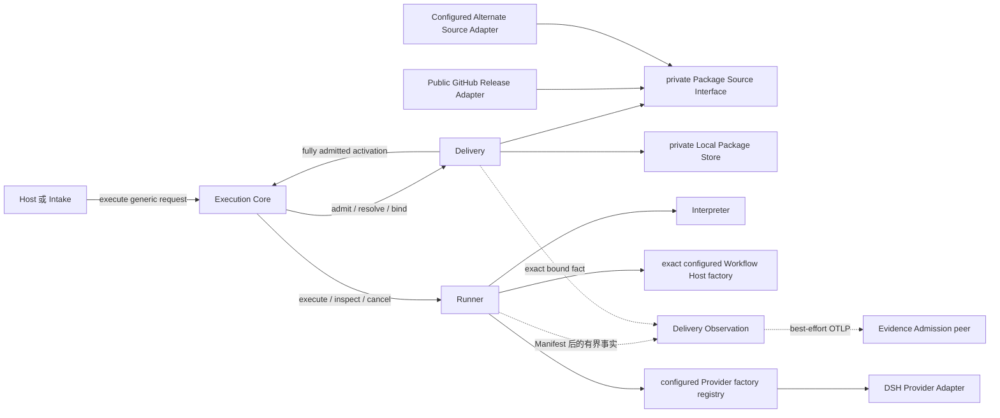
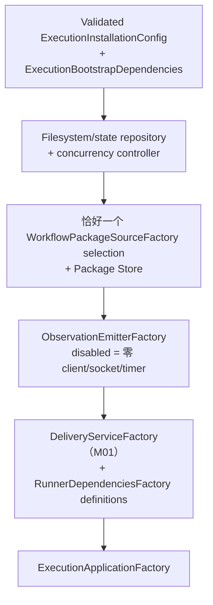
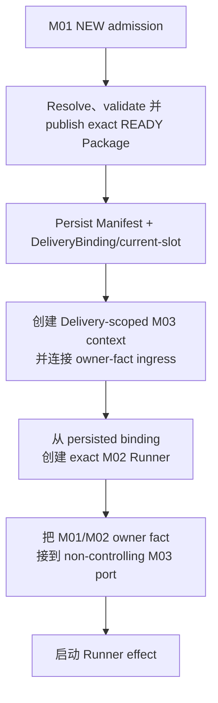
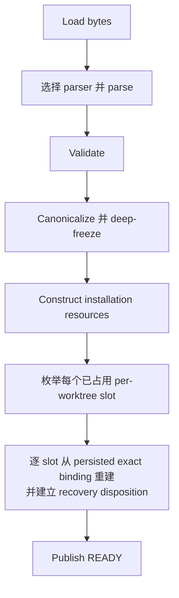
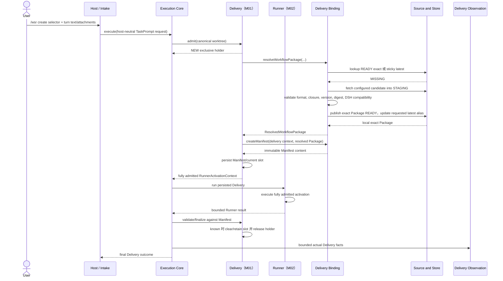
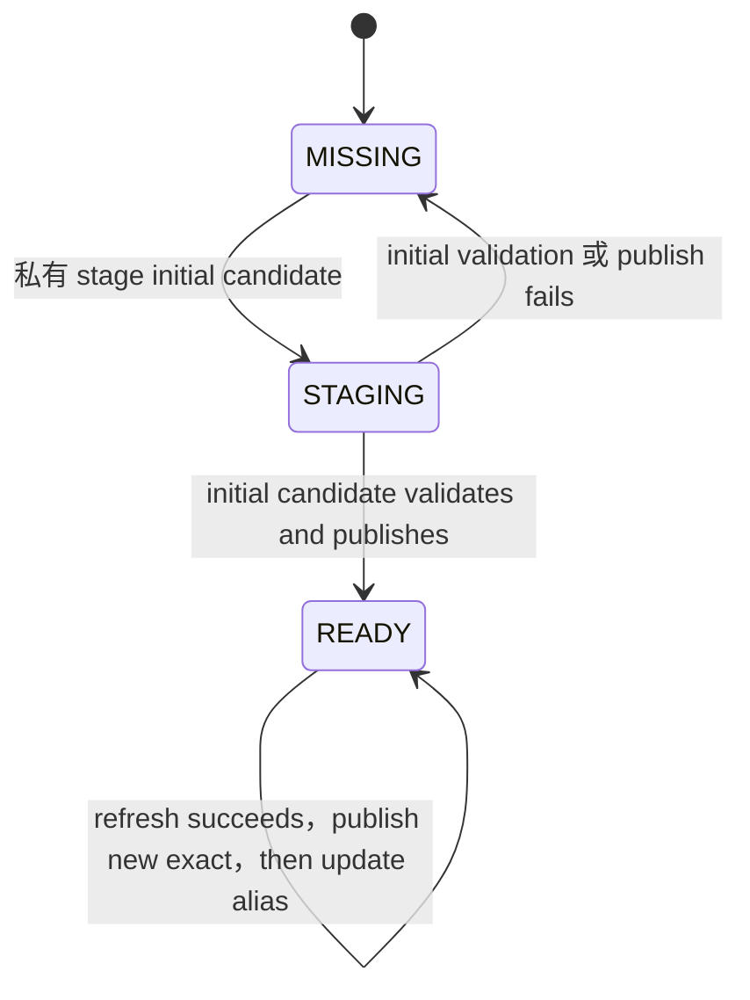
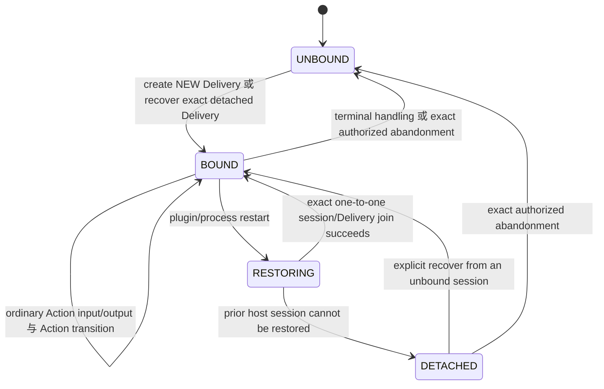

<a id="ee-execution"></a>
# Project Execution System Design

<a id="ee-execution-1"></a>
## 1. 元数据与权威

| 字段 | 值 |
| --- | --- |
| 文档身份 | `execution.identity.001` |
| 发布状态 | `WORKING_REVIEW_CANDIDATE`；先前的受限审查、翻译与 fresh-reader closure 只适用于更早字节。2026-08-23 用户审核已批准 Intake/TaskPrompt/Action-finish calibration。2026-08-24 corrective addendum 与 2026-08-25 #93 closure 已通过 deterministic Iteration 3 qualification；提升前仍需独立完成 exact publication binding。 |
| 精确发布绑定 | 外部 publication set/application record 必须用 SHA-256 绑定本字节流及配套 canonical Concept 字节流，记录适用的 review、SD-12、fresh-reader 与 deterministic-verification 证据，并证明精确安装。本文件有意不声明自身 digest 或配套文件 digest。 |
| 提升后的权威 | 唯一的无版本英文 Project Execution System Design authority |
| 当前结构权威 | GitHub issue [#45 execution.delivery](https://github.com/firestige/workflow-self-recursive/issues/45)、[#46 execution.observation](https://github.com/firestige/workflow-self-recursive/issues/46) 与 [#47 execution.runner](https://github.com/firestige/workflow-self-recursive/issues/47)；本 candidate 按这些决定校准文档 |
| 规范语言 | 英文 |
| 翻译 | [`project-execution-system.zh-CN.md`](project-execution-system.zh-CN.md) 是非规范跟踪翻译。英文是唯一语义权威。每当英文某一节变更，其中文对应章节都从当前英文重新翻译并整章替换；中文维护不保留、也不增量演进旧中文措辞。 |
| Source lineage | Repository history；本 candidate 不对无法解析的外部 commit 作权威声明。 |
| Concept authority | [`concept.identity.001`](../../agent-architecture.md#ee-concept)，作为配套 member 原子提升 |
| Prior canonical Execution baseline | `execution.identity.001`；repository history 拥有 provenance |
| Composition authority | Exact-version dispatch：published Workflow DSL 1.x 使用历史 [`workflow-composition-model.md`](../../workflow-composition-model.md)；Workflow DSL 2.0 仅在 publication gates 通过后使用 [`workflow-composition-model-2.0.0-candidate.zh-CN.md`](../../workflow-composition-model-2.0.0-candidate.zh-CN.md) |
| 已确认意图 | `EE-WORKFLOW-IMPORT-BRIEF`；SHA-256 `7c9b1064084cf5f256f27bc5efd021bed0374910e1430586eebeb695344d4c6d` |
| 已确认方向 | `EE-WORKFLOW-IMPORT-SKELETON`；SHA-256 `86a2a61a324d9bb7ca90108b433ded2f883bc91d9f60dadee87ac7d11feb8e46` |
| 历史方向审查 | `EE-WORKFLOW-IMPORT-SD05-ARCH-RECHECK`；SHA-256 `2c4fbaef0db617ccfc9ce20be8b5470a7251938744cc2d5d792f5ed9ed197c4a`；`PASS`；适用于先前的大型 Workflow-import 方向 |
| 可行性 | `EE-WORKFLOW-IMPORT-SD06-APPLICATION`；SHA-256 `c6714b9c850536273a00b929559f6d71b8ff2c8aeb1f2aaf8054c14c53ca5795`；`FEASIBILITY_CONFIRMED` |
| 定向简化权威 | `EE-WORKFLOW-IMPORT-MVP-SIMPLIFICATION-RR`；只删除机制，不增加可行性问题，并授权受影响范围的受限审查 |
| 历史 expansion inputs | `EE-WORKFLOW-IMPORT-SD07-CP01` SHA-256 `f4c3ef4a09867fc05e2782aefec7616f02b96132cb7ccddf158156ba526e1d85`；`CP02` SHA-256 `0d16e85e4f944720aa49a54ff7c60f2545f925d7a9576067128e860a2ae98d84`；`CP03` SHA-256 `e6f1f054bcf2252684f9e587e09a058e3f40f885bfbbc7011d99fc6d4732a4cd`；适用于先前的大型 Workflow-import expansion |
| 历史大型 Workflow 审查 lineage | 较大型 Workflow-import 设计的 Problem–Solution、Architecture 与 Quality 审查结果，仅作为未变内容的历史证据保留。 |
| 历史大型 Workflow Finding 统计 | `EE-WORKFLOW-IMPORT-SD10-AGGREGATION` 属于历史记录，不是本次定向简化的 Finding 统计。 |
| 历史设计参数与 handoff 关闭 | `EE-WORKFLOW-IMPORT-SD12-CLOSURE-HANDOFF`；SHA-256 `60f24178d3a2f8991d6af2f974e4ed03d35aedc0064d9d253b3773e732e18ea7`；`SUCCEEDED` |
| 历史大型 Workflow Fresh Reader lineage | `EE-WORKFLOW-IMPORT-SD13-FRESH-READER-RESULT` 适用于旧字节，保持为历史记录。 |
| 历史受控集成权威 | `EE-WORKFLOW-IMPORT-SD14-REVISION-REQUEST`；SHA-256 `135ab9647fc6e30318735eff3cef858853cec75f47704e6eaaabd13ecbc59b2e`；deterministic report SHA-256 `1eda28b1c73a8b7d931ab58207d34796173a06bf20cdfae0e17accb2a3a3dc18`；适用于先前的大型 Workflow-import 集成 |
| 受影响范围的受限审查 | Problem–Solution SHA-256 `807863cb6c7887eccdb2720df5ace0afd8e4833f763a029928f44ed1e30e92ae`；Architecture SHA-256 `b220e1114d166cc5a55e34635f847ac2c1af0cf1777bb9c6a6c08dbadf5cdf98`；Quality SHA-256 `b64927087758a987a1f5a4d461035c379970ad84af57133714462ea19ac22f77`；三者收敛为两个 treatment group |
| 统一受限处理 | `EE-WORKFLOW-IMPORT-MVP-SIMPLIFICATION-SD10-TREATMENT`；SHA-256 `da22b3356aa34c3bcf6e3977a3277ef5b0d9c1e8beef35f4fe0db7dd5e72caf6` |
| 先前聚焦受限复查 | `EE-WORKFLOW-IMPORT-MVP-SIMPLIFICATION-SD10-BOUNDED-RECHECK`；SHA-256 `1b5664afd796910beb8b505bbaadd889fbb7fb098b02c141abb27cdba4e74955`；`CLOSED_FIXED`；open Findings `0`；仅适用于更早字节 |
| 先前翻译与 fresh-reader closure | 整节翻译 parity SHA-256 `3c236a404392e1d496e33d4adcdd70000d0db2a2453dcbd7df40813612f77c20`；fresh-reader result SHA-256 `1062561d35422bfacfa7e430f381e5fb25a5a2a911fe8daa5e3499eac5fc2a75`；translation treatment SHA-256 `927a02c6d88eba3571e39c010681b8b47dc956e9a8bafea6812aa9cda91c5d14`；focused recheck SHA-256 `6777175a4e78e363d24ddc3f6bc657b66e9f5a6c2e9fd0042dd210705035c18e`；仅适用于更早字节。当前 bounded calibration 已于 2026-08-23 经用户审核，仍 pending fresh deterministic parity/publication binding |

Authority order 为：已确认用户意图；上列当前结构 issue；规范 Concept；本 Execution candidate；Workflow composition model；以及各自声明 scope 内的已发布 Contract。已发布 Observation/interaction package 当前只支持 validator-only claim；production 与 cross-implementation conformance 仍未证明。[Evidence System](../evidence/evidence-system.md) 仍是 peer owner。本文拥有 M01–M03 placement、Core contract 与 system-wide invariant；[Runner 模块详细设计](modules/runner/runner.zh-CN.md)拥有 private M02 detail。本文不拥有 Workflow Package publication policy、Evidence internals、Observation fact meaning、payload registry、metric schema 或 physical storage schema。

受保护的 `system-design` 与 `implementation` Workflow Package 是初始已验证分发内容和 conformance fixture；除下方已批准的 R6 correction 外，不是重新设计目标。理解本文不需要任何 disposable workspace artifact；以上 identity 只表示 provenance。

### Iteration 6 Role/Provider 与 Manifest rebaseline 候选

2026-08-29 owner 决策只改变 2.0 target Contract 与后续 Delivery；更早 publication evidence 只适用于更早字节与 `agentops.workflow-dsl@1.1.0` behavior。候选链为：

- [`workflow-definition-dsl-2.0.0-candidate.md`](../../contracts/workflow/workflow-definition-dsl-2.0.0-candidate.md) 删除 generic Agent-definition 与 Workflow-owned model resource；
- [`repository-role-model-binding.zh-CN.md`](repository-role-model-binding.zh-CN.md) 把 canonical worktree repository 定为最小 Provider/model-policy scope，并要求每个 Agent-action Role 绑定 exact Provider identity/version 与 Provider-owned model coordinate；
- [`execution-configuration-2.0.0-candidate.zh-CN.md`](execution-configuration-2.0.0-candidate.zh-CN.md) 从 WSR config 删除全部 Provider selection/default/credential/endpoint；installation composition 提供 closed owner-factory registry；
- [`delivery-manifest-2.0.0-candidate.zh-CN.md`](delivery-manifest-2.0.0-candidate.zh-CN.md) 冻结 exact Workflow Snapshot 与完整 Role/Provider-descriptor/model bindings，同时保留历史 1.x recovery；
- [`delivery-manifest-projection.zh-CN.md`](../evidence/delivery-manifest-projection.zh-CN.md) 定义由同一 Task-binding owner record 携带的 portable Manifest reading；
- 每个 Execution installation 仍只配置一个 Workflow source。Delivery admission 绑定该 exact source result；request/Workflow data 不得选择另一 source 或 source list。

对于 2.0 Delivery，M01 验证 exact Workflow Package/Snapshot 并读取 `<canonical-worktree>/.wsr/role-provider-bindings.json`；只要 Snapshot 有 Agent-action Role，该 document 就 required。每个 distinct Agent-action Role 显式命名 exact Agent Provider identity/version 与 Provider-owned model coordinate。M01 通过 installation-supplied closed `AgentProviderFactoryRegistry` 解析它，从 exact Snapshot 派生 Role required-capability union，并在 Manifest/Runner effect 前拒绝 missing、unknown、version-mismatched 或 capability-incompatible binding。不存在 installation Provider/model default、priority、fallback 或 runtime rebinding。

Manifest 与 Observation-safe projection 冻结 Role prompt identity/digest、Provider identity/version/adapter key/descriptor digest、sorted required capabilities、Provider-owned model coordinate 与 `resolutionSource=REPOSITORY`。Runtime dispatch、session create/resume 与 recovery 要求 exact persisted descriptor/model match。Current repository/registry 变化不能重绑 Delivery，mismatch 也绝不选择 alternative。Manifest persistence 后，Runner 只为该 Manifest 实际使用的 distinct Providers 启动 realm；各 owner factory 拥有 native construction 与 Provider config，Runner 拥有 bounded Delivery lease/disposal。Registered unused Provider 不启动。Credential/login state、endpoint 与 native session mechanics 保持 Provider-owned，不进入 Workflow、repository binding、WSR config、Manifest、Observation 或 WSR session SPI。

Manifest/current-slot persistence 之后、Runner launch 之前，M01 直接从 persisted Manifest 生成一条 `task.binding` owner Fact。同一 record 携带 evidence-safe Manifest projection；Workflow-ID prefix、Event timestamp、arrival order 或 ambient lookup 均不能决定是否发射。Observation delivery 仍不控制 Delivery outcome，但缺少 accepted record 时，Task/Manifest-dependent BI metrics 只能 unavailable，不能重建。

只有对应 machine revision 通过 lifecycle gates 后，这些段落才成为 Iteration 6 implementation candidate 的设计 authority。下方 `agentops.delivery-admission@1.0.0` 与 `execution.config@1.0.0` section 显式属于历史 1.x；其中单 Provider/config 陈述不得应用于 2.0。

### Runner delivery-admission 与 Core projection

对于 Iteration 2 Runner，Execution 在 `system-contracts/delivery-admission/delivery-admission-contract.json` 拥有 `agentops.delivery-admission@1.0.0`。Admission 确定性地把 `agentops.workflow-dsl@1.1.0` author intent 解析为一个 deeply frozen `RunnerActivationContext`；其中包括 exact Agent、model、Driver、provider-model、resource、capability、workspace 与 local path binding。确定性 activation compiler 只接收该 admitted value，绝不接收八份 document、八个 root schema 或 shared meta schema。

Execution 还拥有当前 Core-to-Runner TypeScript projection `execution-system/src/execution/runtime-adapter.ts`，operation set 严格为 `execute`、`inspect` 与 `cancel`。历史类型名 `ExecutionRuntimeAdapter` 是实现 seam，不表示 M02 已经是多态 Runner 抽象。Runner Lifecycle Coordinator 实现该 surface；resume、recovery、checkpoint、thread 与 provider-session operation 都保持 Runner-private。

Runner 就是 M02。M01 完成 worktree admission、Package resolution、current-slot/Manifest persistence 与 exact binding projection 后，Core 才向 Runner 交付 fully admitted activation。Runner 的五个 submodule 是 Interpreter、Lifecycle Coordinator、Workflow Host、Managed Agent Invocation 与 Custody；Iteration 2 实现位于 `execution-system/src`。当前不存在多个 Runner 实现之间的选择；未来若出现该需求，才可以把 M02 提升为 Runner 抽象，并且每个具体实现必须使用不同名称。详见 [Runner 模块详细设计](modules/runner/runner.zh-CN.md)。
<a id="ee-execution-2"></a>
## 2. 设计上下文

workflow-self-recursive 通过小型、host-neutral 的 execution seam 运行有价值的 logical Workflow，并可选发出 factual Observation。Execution 嵌入每个 repository/workspace。Runner 是 Execution module M02。它私有组合可替换 Workflow Host 与 configured Provider Adapter；当前 Host substrate 是 LangGraph，唯一 concrete Provider 是 DSH。native session、checkpoint 与 private resume 留在 Runner 内，不改变 Core 语义。

受保护的 Implementation 与 System Design Workflow Package 由 configured public Workflow Package GitHub repository/release 独立托管。贡献者可以发布其他符合开放 Agent Ops Workflow composition model 的 Package。Installation 恰好选择一个 private Source Adapter：默认 GitHub Adapter，或一个显式配置的 alternate Adapter。Execution Release 与 DSH Intake plugin 永不 bundle 任一 initial Package。

这是面向个人或小团队的 trusted local preview。Configured GitHub repository 是 public，用户控制 installation configuration，concurrent Package management 不是产品需求。设计通过 validation 与 typed early return 处理 ordinary fault；不建设 authentication、authorization、signing、hostile-Package 或 prompt-injection defense、sandboxing、multi-user coordination、distributed locking、Package transaction、production recovery、HA、mirror failover 或 automatic eviction。

Actor 与 ownership：

- **Host or Intake** 将 host/chat syntax 转换为 generic Workflow selector、可 canonicalize 的 worktree reference、可选且获准的 refresh、host-neutral `TaskPrompt` 与 bounded Intake correlation。`TaskPrompt` 保留触发 turn 的正文和 immutable attachment reference，不是 command-line `--intent` value。Host 或 Intake 不得选择 Source、Runner、Provider、Observation 或 path。
- **Execution Core** 按顺序执行 canonical worktree/exclusive admission、仅针对 `NEW` 的 Package preparation、Manifest creation/persistence、Runtime lifecycle、result validation 与 Observation。
- **Delivery（M01）** 拥有 selector/Package resolution、Source/Store、canonical-worktree admission、current-slot/Manifest persistence、Delivery recovery/final handling，以及 fully admitted Runner activation 的投影。
- **Runner（M02）** 拥有 admitted activation 的执行；Interpreter 编译，Coordinator、Host、Invocation 与 Custody 拥有 private execution state/effect。
- **GitHub 或 alternate Source Adapter** 由 canonical installation configuration 选择一次，并返回相同 generic candidate shape；恰好构造一个，且不存在 fallback。
- **Evidence** 接收可选、单向 Observation，绝不控制 Execution。

<a id="ee-execution-3"></a>
## 3. 问题、目标与范围

现有 Delivery Binding 起点过晚：它假设 caller 已拥有所有精确 Workflow identity，却没有说明 Workflow Package 从哪里获得。若把 download、cache lookup、validation 与 current Runner/DSH compatibility 移进 Host code，各 host 都会重复相同行为，且 Delivery Binding 仍然 shallow。

目标是提供从 generic selector 到 DSH 的可实现 local-preview 路径：

```text
WorkflowSelector
→ Delivery（M01）：admission + exact Package + DeliveryManifest
→ Runner（M02）：admitted activation execution
```

成功调用先获得 `NEW` admission，再解析一个 exact local Package，在任何 Runner Workflow/Host/Provider effect 前创建并持久化 Delivery Manifest、project fully admitted activation，并依据该 Manifest 校验 Runner result。`CONTENDED` 与 `RECOVERY` 在 Package work 前返回。对 `NEW`，有效 local hit 不访问 configured Source；miss 只调用 installation-selected GitHub 或 alternate Adapter，在 publish `READY` 前完成校验，且从不 fallback 到其他 source/version。Selector、fetch、Package、cache、compatibility、contention 或 Manifest error 都在所属 phase 返回。Package preparation failure 释放 ordinary holder，不创建 Delivery，也不是 Delivery outcome。

范围内包括 host-neutral Core entry、replaceable Intake、exact/sticky-latest selector、local hit、configured public GitHub miss/refresh、一个显式配置的 alternate Source Adapter、contributed conforming Package、`MISSING/STAGING/READY` storage、普通 format/required-resource/relationship/version/digest check、DSH compatibility check、immutable Manifest binding、multi-worktree current-slot recovery、DSH result validation、production Observation、canonical installation configuration、factory、Bootstrap 与 bounded lifecycle management。

范围外包括 Package ranking/fallback、ambient completion、authentication/authorization/RBAC、public source credential、signing、hostile input isolation、injection defense、sandboxing、concurrent Package correctness、queueing/fairness、distributed lock、Package transaction/proof/hold protocol、automated eviction、production download/recovery guarantee、registry/marketplace、HA/failover、physical Evidence schema、第二个 Runner implementation 或 Runner-selection abstraction、Evidence redesign，以及对受保护 Package 的修改。

成功表示 implementer 能通过三个既有 Module、simple state 与 typed result 构建该路径，而无需在 Delivery Manifest 前发明另一 lifecycle。

<a id="ee-execution-4"></a>
## 4. 设计驱动因素

| 驱动因素 | 要求结果 | 结构后果 |
| --- | --- | --- |
| Delivery Binding depth | Host 不实现 Package import choreography | M01 暴露一个 resolve/prepare operation，并拥有 private Source/Store seam |
| Request Package work 前 admission | contender 与 stored recovery 避免无意义的 selector/cache/download work | Core 先进入 M01 admission；只有 M01 的 `NEW` branch 执行 Package work |
| Delivery 前 preparation | acquisition 或 validation failure 不是 Delivery failure | ordinary `NEW` holder 下，M01 在 Core 创建 Manifest 内容或调用 DSH 前完成 |
| Exact binding | alias 或 Release movement 不改变已创建 Delivery | resolved value 包含 exact version、digest、local path 与 Workflow ID |
| Docker-like local-first | valid exact/latest hit 避免 GitHub；裸 name 表示 latest | Store lookup 先于 Source Adapter；sticky alias 指向 `READY` exact Package |
| Ordinary fault containment | malformed/unavailable input 尽早停止，不建设 recovery subsystem | selector、source、validation、cache、admission、Manifest phase 使用 typed early-return result |
| Simple exclusivity | 每个 worktree 一个 current Runner Delivery | M01 尝试 exclusive admission，不可用时立即返回 `CONTENDED` |
| No fallback/default completion | failure 不选择其他 source/version/resource | 恰好一个 installation-selected Source；request 不得覆盖；DSH 在 native effect 前校验 |
| Open contribution | compatible third-party Package 走共同路径 | composition 与 DSH check；无 first-party allow-list |
| Preview restraint | 复杂度匹配 trusted local use | 无 security platform、concurrent Store protocol、automatic eviction 或 production recovery |
| Observation non-control | telemetry failure 不改变 outcome | unchanged one-way M03 Interface |

Numeric latency、timeout、capacity 与 retention setting 属于 implementation/operations choice，除非 measured fact 后续迫使设计改变。

<a id="ee-execution-5"></a>
## 5. 问题分解

1. **创建或恢复 Delivery（`execution.module.001`，M01）。** Canonicalize worktree；返回 `CONTENDED` 或 stored `RECOVERY`，或在 `NEW` holder 下解析/准备一个 exact Package、持久化 Manifest/current slot，并投影 fully admitted activation。
2. **执行 admitted activation（`execution.module.002`，M02）。** Interpreter 校验/编译；Coordinator 驱动 Host、Invocation 与 Custody；Runner 通过 Core seam 返回 typed terminal、start-failed 或 unknown truth。
3. **完成 Delivery（M01）。** 依据 Manifest 校验 bounded Runner result，保留 exact lifecycle truth，并根据 known state 关闭或保留 current slot。
4. **观察有界事实（`execution.module.003`，M03）。** Delivery 存在后，把实际 fact 映射到既有 best-effort Observation profile，不控制 execution。

这些问题直接映射为 Delivery（M01）、Runner（M02）与 Delivery Observation（M03）。M01 拥有 Delivery acquisition/admission/binding/lifecycle；M02 拥有 admitted execution；M03 拥有 non-controlling emission。Deletion test 证明三个 Module 都有必要；Runner 的五个 submodule 不增加 Execution 顶层 module。

<a id="ee-execution-6"></a>
## 6. System 结构



### Delivery（`execution.milestone.01`），深化

M01 隐藏 selector parsing、exact/sticky lookup、configured-Source acquisition、staging、Package validation、DSH compatibility check、`READY` publication、alias update、resolved-value construction、Manifest content construction 与 result-binding check。其主要 caller-facing operation 是：

```text
resolveWorkflowPackage(selector, configuredSource, runnerConfigurationTarget, refresh?)
  -> ResolvedWorkflowPackage
  | WorkflowImportError
```

Result 是普通 immutable value：`name`、`exactVersion`、`packageDigest`、`localPath`、`workflowId`。它不是 capability、proof、hold 或 lifecycle state。M01 还根据 Delivery context 与该值构造 Manifest 内容，并依据 Manifest 校验 bounded Runner result。Caller 从不自行协调 Source 或 Store step。

### Runner（`execution.milestone.02`），按 issue 校准并限定

M02 只接受从 M01 persisted Manifest 投影出的 fully admitted activation。它拥有 activation validation/compilation、Workflow execution、Provider invocation、savepoint/custody、Runner inspection/cancellation，以及 typed terminal/start-failed/unknown truth。它不推导或准入 worktree、不解析/下载 Package、不拥有 Source/Store、不写 Delivery current slot，也不持久化 Delivery Manifest。

M02 冻结 exact Runner configuration identity。`RunnerFactory` 消费该 configuration 装配 submodule instance，但不能使用 ambient discovery、按 priority 选 factory、fallback 到其他 Provider/Host 或替换 in-flight Delivery。Provider-native/Host-native factory 保持 Runner-private。当前设计有意不包含多个 Runner 实现之间的选择。

Preview 不增加第二个 pre-Manifest lifecycle。Manifest 存在前，failure 释放 ordinary in-process/OS-backed exclusive holder 并返回。Process death 释放 holder。若 death 发生在 Manifest 可见后，下次调用通过既有 occupied-slot recovery 读取 Manifest。不引入 `ARMED`/commit-unknown/reconciliation state。

### Delivery Observation（`execution.milestone.03`）

M03 把有界的实际 Delivery fact 映射为 adopted allow-listed standard-first Observation Profile，拥有 privacy/redaction 与 exporter isolation，只返回 diagnostic。它不拥有 source fact，也不控制 execution。Custody-only attempt 与 preparation rejection 不产生 Delivery Observation。Exact carrier/EventName/common/family registry 与 complete Review-family shape 由 [OTel Observation Profile](../../contracts/observation/otel-observation-profile.md) 拥有；technology-neutral fact meaning、identity、missingness、privacy、lineage、usage 与 relationship semantics 由 [Observation Catalog](../../contracts/observation/observation-catalog.md) 拥有；transport interaction 由 [Execution–Evidence Interaction Contract](../../contracts/execution-evidence/interaction-contract.md) 拥有。M03 不拥有 payload registry 或 Evidence durable storage semantics。

具体而言，已冻结发布的 profile `1.0.0` 延续已采纳 semantics，并加入 owner-supplied C55–C57 mapping；`0.3.0` 仅为 non-resolving legacy history。Current profile 使用 official OTLP/HTTP binary protobuf Trace/Log export、一个 sampled Delivery root 及嵌套 Workflow/Agent/model/tool Span、10 个 EventName，以及 closed 57-common/10-Implementation/6-System-Design field registry。一个 family 可以使用 common 加自身 field，绝不使用 sibling field。Stock DSH Session JSON telemetry 保持 disabled。每个 Event 有稳定 `agentops.event.id`；每个 Span 以 native `(trace_id, span_id)` tuple 标识。Event owner 提供 exact Trace/Span correlation 时，M03 将其保留在 native OTLP LogRecord context 中；不用 C01、timestamp、arrival order 或 name-based join 替代。Production Delivery summary 使用已记录的 Delivery-root context。Standard token usage 留在 model Span，其他 provider-native quantity 使用 typed usage Event，并含 exact kind/unit/source/source-ID/completeness；missing 不表示 zero，也不推断 conversion 或 price。

Review summary、Finding、Fix 与 Recheck 仍选择一个完整 named base-plus-variant shape。每个 Finding 携带一个 bounded privacy-safe factual summary、Finding-specific scope identity 和恰好一个 typed Artifact/section/component/requirement target；multi-target Finding 对每个 target edge 重复完整 assertion。Owner-known Role lineage 同时携带 version-local Role ID 与 family-scoped lineage ID；unknown lineage 省略，绝不按 name 或 position 推断。M03 不发出 prompt、message、tool argument/result、source/diff、credential 或 raw-error body，也不从 name、order、count 或 grouping 推断 quality、causality、reviewer effectiveness 或 relationship。Administrative unresolved/abandonment state 仍是 M02 state，不是 first-profile Observation。

Implementation fact 保留 typed test summary，并按 coverage scope/tool/format/report Artifact 各有一个 implementation summary。System Design 保留 common review relationship、Fresh Reader review summary 与 deterministic-verification summary。Observed Agent/model/tool call 与 duration 留在 standard Span；family summary 只携带 owner-observed loop/intervention fact。Emission 前 M03 选择一个 whole shape，并要求完整 base 与 variant addition，绝不发 fragment 或 implicit inheritance。

对于 ordinary 与 Recheck summary，owner input 若有 nonnegative observed count，就精确发出 C17，包括 zero；没有 count fact 就省略 C17。Omission 是“无 count fact”的全部 wire signal。Invalid count type/range 不发出 malformed Observation。Finding shape 仍禁止 C17。只有既有 profile 要求 Recheck 语义时 C27 才 required。Assertion、target、status、Fix、Recheck identity 保持不同；exact retry 是 no-op，compatible later lifecycle fact append 而不是 rewrite assertion。每条 lifecycle record 都重复 selected shape 要求的 immutable assertion 与 exact typed target coordinate。

### Execution-level configuration、factory 与 Bootstrap support

Configuration、factory 与 Bootstrap 支撑整个 Execution System。它们不是第四个 Module，也不归属 M01、M02、M03 或某个 Intake Adapter。`ExecutionBootstrap` 是唯一 production composition root。包括 DSH Intake plugin 在内的每种 embedding 都只向同一个 loader 提供一个 absolute config-file path。普通 caller 使用 public `ExecutionApplicationFactory`/application surface。DSH Intake adapter 还会得到一个 private Bootstrap control surface：在校验精确 live Agent、canonical registered workspace 与 session membership 后，issue #93 的过渡实现只能为一次调用授权该精确 workspace。Public surface 继续执行 configured worktree roots 校验。Issue #94 负责把临时 workspace-as-worktree 值替换为 Delivery 选择的 worktree。

Host-neutral package 的 release coordinate 是 `wsr-execution@0.1.0`；public export 包含 Core request/result contract、`ExecutionApplicationFactory`、Bootstrap、configuration schema/type，以及 `start/execute/inspect/cancel/close/status` application surface。首个 Intake distribution 是 `execution-system/packages/dsh-intake` 下的 `wsr-dsh-intake@0.1.0`；它依赖 public host-neutral package，禁止 import private M01/M02/M03 source path。

#### Scope 与 dependency graph

| Scope | 构造的 value/resource | 禁止依赖 |
| --- | --- | --- |
| bootstrap preflight | strict config parser、schema/semantic validator、canonical serializer、redacted diagnostic | validation 成功前无 network、DSH Context、worktree mutation、Runner、Source 或 OTLP effect |
| installation | immutable config/environment、filesystem root、current-slot/Manifest repository、Package Store、恰好一个 Source Adapter、concurrency controller、clock/ID、disabled sink 或 OTLP exporter、M01 service 与 application lifecycle manager | 无 Delivery-bound Runner、Host、Provider、native DSH execution Context 或 Delivery-scoped M03 mapper |
| Delivery | persisted Manifest/`DeliveryBinding`、admitted activation、exact Runner instance、owner-fact ingress、Delivery-scoped M03 mapper/context 与 Runner-owned Provider/Host resource | persisted M01 binding 前不得创建；不得依赖 Intake Context/service/session |
| Intake presentation | `/wsr` command、Intake-only operation tool、skill provider/root、renderer、Intake-neutral attachment-content port、Adapter-private durable binding/correlation | 不编排 Source/Store/Runner/Provider，不投影 capability 到 admitted Workflow 或 DSH-E；attachment bytes 只在 M01 返回 `NEW` 后读取 |

Factory creation DAG：



Delivery composition DAG：



Persisted binding 前，任何 factory 都不得创建 Delivery-scoped M02/M03 instance 或执行 Runner/Host/Provider/worktree effect。相关 M02 effect 前必须先接好 owner-fact ingress；M03 mapping/export 留在所有 M02 owner decision 之外。

Installation lifecycle oracle：



Application state 是 closed machine `CREATED → STARTING → RECOVERING → READY → CLOSING → CLOSED`。只有 `READY` 接受新 `execute`。`inspect`、`status` 与 bounded recovery presentation 在 `RECOVERING`/`READY` 可用；`cancel` 需要 exact known Delivery reference。`RECOVERING` 建立 durable truth 与 presentation binding；它不选择新 Package、不 fabricated Workflow effect，也不猜测 installation-wide recovery target。Concurrent/repeated `start`/`close` 结果 deterministic 且 idempotent；start 中 close 先关闭 intake gate，再 rollback 已创建 resource。

Construction/start failure 保留首个 bounded redacted diagnostic，并按 exact reverse creation order dispose 已实际创建的 resource。正常 close 顺序：关闭 Intake gate；停止接受新 Delivery；persist/quiesce M01 holder 与 current slot，且不 fabricated terminal truth；bounded-flush M03；关闭 Runner manager 及所有 Runner-owned DSH-E/Host/Provider resource；关闭 exporter；关闭 installation repository。Timeout 保留 durable unknown/recovery truth。Abrupt death 只依赖 durable Manifest/current-slot 与 Runner-owned fact；restart 绝不使用新 selector 或当前 config 重绑旧 Delivery。

#### Canonical configuration 与 identity

Input schema coordinate 是 `execution.config@1.0.0`，使用 JSON Schema draft 2020-12。Release 发布 `config/defaults/execution.default.yaml` 与 `.json`，两者表达相同 input value。`.yaml`/`.yml` 只选择 `yaml@2.9.0`，`.json` 只选择 strict `JSON.parse`。禁止 content sniff、parser fallback、multi-file merge、environment override 与 arbitrary key/value extension。YAML 仅接受 JSON data model，并拒绝 duplicate key、anchor、alias、custom tag、merge key、non-string map key、implicit timestamp/binary/special-number value 与 non-finite number。

Schema/semantic validation 后，default 与 derived path 被 materialize 成一份 JSON-compatible、recursively frozen `ExecutionInstallationConfig`。Canonical bytes 是 UTF-8 JSON：object key 递归 lexicographic sort，array order 保留，无 insignificant whitespace，采用 JSON string/number encoding；本 schema 不含 non-integer numeric field。Identity 是对 coordinate prefix、一个 LF 与 canonical bytes 计算的小写 `sha256:<64-hex>`：

```text
installationConfigIdentity = sha256("execution.config@1.0.0\n" + canonicalConfig)
deliveryConfigProjectionIdentity = sha256("execution.delivery-config@1.0.0\n" + canonicalProjection)
deliveryBindingIdentity = sha256("agentops.delivery-binding@1.0.0\n" + canonicalBinding)
```

`DeliveryConfigProjection` 只包含 admitted scope 内的 canonical worktree/resource path；Runner implementation/config、Host engine；Provider key/route、model ID、base URL 与 credential reference（绝无 material）；workspace/resource binding；以及影响 Delivery 的 execution/control bound。它排除 installation identity、selector、Source config、Package、Store location、raw config、credential-store location/content、Intake presentation 与所有 Observation config。M01 加入 exact Package identity/content、canonical worktree、canonical `TaskPrompt` identity、Execution-owned attachment snapshot digest、Delivery ID 与 task ID，构成 `DeliveryBinding`。Recovery 只接受 persisted binding 与 snapshot，忽略当前 config、alias、selector movement 与新的 triggering turn。

`TaskPrompt` 是 closed host-neutral value `{ text, attachments }`。每个 incoming attachment 携带 bounded adapter-assigned identity、filename、media type、byte length、SHA-256 digest，以及仅由 Intake-neutral attachment-content port 理解的 opaque string `contentRef`；DSH message、channel、session 或 temporary upload handle 均不跨 Core。`NEW` 后只有 M01 dereference 该 port、校验 bytes/digest、创建 Execution-owned immutable snapshot，并绑定 snapshot reference/digest，而不是 incoming reference。存在至少一个 attachment 时 text 可以为空；正文和附件同时缺失则在 Delivery 创建前失败。Intake 只去除 activation directive，不总结或改写剩余 turn。`CONTENDED` 与 `RECOVERY` 不调用 attachment port，也不对新 turn 执行 read、copy、persistence、Source 或 Store work。Prompt 与 attachment content 不进入 M03。

| Exact input key | Type/default policy | Consumer 与 binding/reload rule |
| --- | --- | --- |
| `schemaVersion` | const `execution.config@1.0.0` | loader only；canonical identity |
| `paths.repositoryRoot` | required absolute canonical path | worktree derivation；projection |
| `paths.workspaceRoot` | required absolute canonical path | allowed scope；projection |
| `paths.allowedWorktreeRoots` | required non-empty unique absolute-path array | admission；projection |
| `paths.stateRoot` | required absolute writable path，且不在 Package content 内 | derives `manifests/`、`current-slots/`、`runner/`；installation only，除 admitted relative resource projection |
| `paths.packageStoreRoot` | input omitted；derived `<stateRoot>/packages` | Store only；不 binding |
| `paths.credentialStorePath` | required absolute readable file path | credential lease provider；Manifest 排除 location |
| `workflowSource.kind` | closed `github`（default）或 `adapter` | exact-key Source factory；bootstrap-only |
| `workflowSource.repository` | GitHub default `firestige/workflow-package`；`adapter` 禁止 | GitHub Adapter only；不进入 request/binding |
| `workflowSource.releasesBaseUrl` | default `https://api.github.com/repos/firestige/workflow-package/releases`；HTTPS、无 userinfo | GitHub Adapter only |
| `workflowSource.assetPattern` | default `workflow-package-{name}-{version}.tar.gz` | GitHub Adapter only |
| `workflowSource.adapterKey` | `adapter` required exact key；`github` 禁止 | alternate factory selection |
| `workflowSource.adapterConfigFile` | `adapter` required absolute path；`github` 禁止 | selected Adapter closed config loader |
| `runner.implementationKey` | const/default `runner.v1` | projection；无 runtime selection |
| `runner.host.engine` | const/default `langgraph` | Runner factory；projection |
| `runner.provider.key` | const/default `dsh` | Provider factory；projection |
| `runner.provider.route` | required non-empty external route | admitted Driver projection |
| `runner.provider.modelId` | required non-empty external model ID | admitted model binding；projection |
| `runner.provider.baseUrl` | required absolute HTTP(S) URL，无 userinfo | admitted Driver binding；projection |
| `runner.provider.credentialRef` | required bounded reference string | admitted lease reference；projection；排除 material |
| `runner.provider.maxParallelToolCalls` | integer `1..32`，default `4` | Runner factory；projection |
| `observation.enabled` | boolean，default `false` | emitter factory；installation reload only |
| `observation.endpoint` | enabled 时 required loopback HTTP(S) base；disabled 时 omitted | exporter only；不 binding |
| `observation.timeoutMs` | integer `100..10000`，default `1000` | exporter only |
| `observation.maxBatchRecords` | integer `1..512`，default `512` | exporter only |
| `observation.maxBatchBytes` | integer `1024..4194304`，default `4194304` | exporter only |
| `observation.flushIntervalMs` | integer `100..10000`，default `1000` | exporter only |
| `observation.shutdownFlushMs` | integer `100..10000`，default `3000` | bootstrap close only |
| `observation.serviceName` | default `workflow-self-recursive-execution` | fixed Resource identity；不 binding |
| `controls.startupTimeoutMs` | integer `1000..120000`，default `30000` | bootstrap only |
| `controls.executionTimeoutMs` | integer `1000..86400000`，default `3600000` | Core/Runner；projection |
| `controls.shutdownTimeoutMs` | integer `1000..120000`，default `10000` | bootstrap only |
| `controls.maxConcurrentDeliveries` | integer `1..32`，default `4` | installation concurrency；new Delivery only |
| `controls.allowExplicitRefresh` | boolean，default `false` | Core/M01 request gate；projection |
| `controls.diagnosticMaxBytes` | integer `256..16384`，default `4096` | redacted diagnostic only |
| `intake.maxCorrelationBytes` | integer `16..1024`，default `256` | Intake contract；不 binding |
| `intake.maxOutputBytes` | integer `256..65536`，default `8192` | Adapter renderer；不 binding |

Shipped default 中唯一 user-required input 是四个 deployment path、Provider route/model/base URL/credential reference 与 external credential provision。Product-owned source、Host/Provider kind、Observation-disabled policy 和所有 control bound 都有完整 default。未替换 marker 使用精确 JSON string `__REQUIRED__:<field-path>`，并在任何 effect 前返回 `CONFIG_REQUIRED_INPUT_MISSING`。`validate` 与 `dump-effective-config` 只显示 credential reference 的 stable classification，绝不读取或打印 API-key material。

#### Observation dependency 与 release ownership

M03 pin official OpenTelemetry Node package：`@opentelemetry/api@1.9.1`、`@opentelemetry/sdk-trace-base@2.10.0`、`@opentelemetry/sdk-logs@0.221.0`、`@opentelemetry/exporter-trace-otlp-proto@0.221.0`、`@opentelemetry/exporter-logs-otlp-proto@0.221.0`。Export timeout 是 `observation.timeoutMs`；homogeneous batch 同时满足 512 logical record 与 4 MiB；shutdown 在 `shutdownFlushMs` 内执行一次 bounded flush。Disabled mode 不构造 SDK provider、exporter、client、socket、worker 或 timer。Frozen `agentops.observation@1.0.0` publication 保持 `VALIDATOR_ONLY`；对 production corpus 的 producer-role validation 是 Iteration 3 evidence，不改变该 claim。

Execution Release 只拥有 host-neutral package、configuration schema/default 与 DSH Intake plugin artifact。独立 Workflow Package GitHub release 拥有 `workflow-package-implementation-1.1.0.tar.gz`、`workflow-package-system-design-1.1.0.tar.gz` 及 descriptor/SHA-256 file。GitHub Adapter 只发现 `workflow-package-{name}-{version}.tar.gz`；`latest` 在 binding 前解析为 exact tag/version。Alternate Source qualification 使用 contributed conforming fixture，绝不镜像两个 initial Package。

#### DSH Intake distribution 与 instance boundary

首发 exact value：

| Item | Value |
| --- | --- |
| recommended profile | locked DSH 内置 `web` profile；它组合 `dsh-base` 与 `dsh-web-app` |
| install/update/remove | `dsh plugin --profile web add|update|remove wsr-dsh-intake@0.1.0` |
| package bundle declaration | `dsh.bundle.patch = "./cordis.patch.yml"` |
| stable Cordis row ID/name | `workflow-execution` / `wsr-dsh-intake` |
| profile override | row `workflow-execution`，完整 config `{ configFile: <absolute path>, bindingFile: <absolute path> }` |
| user command surface | `/wsr list`；`/wsr create <selector>`；`/wsr recover [<delivery-id>]`；`/wsr status [<delivery-id>]`；`/wsr action finish`；`/wsr abandon <delivery-id>` |
| create prompt | activation directive 后的 triggering chat turn 及其 attachments；不存在 `--intent` parameter |
| Intake-only capability | `workflow_execution_intake`，plugin-owned closed operation union；只携带 host-neutral prompt/correlation value，且只在 DSH-I 可见 |
| first-party skill | package path `skills/workflow-execution/SKILL.md`，name `/workflow-execution`；首发只允许 explicit invocation |

Bundle 使用 locked `@deepseek-ai/dsh-skill-filesystem@0.1.1-rc.2` 注册 package skill root；`@deepseek-ai/dsh-tool-skill@0.1.1-rc.2` 加载 instruction。Instruction 选择一个 closed `/wsr` operation，并恰好一次调用 `workflow_execution_intake`；它不 import executable code，也不直接调用 Core/M01/Runner。Command Adapter 与 skill-mediated tool Adapter 共同调用一个 plugin-owned `WorkflowIntakeService`；create 产生 meaning-equivalent `ExecutionRequest` bytes，而 list/status/recover/action-finish/abandon 保留各自独立的 control meaning。Startup 从不创建 Workflow。Plugin bundle 不拥有 UI；首个受支持 distribution 安装到 DSH 内置 `web` profile，由官方 conversation、attachment、command discovery/execution 与 result rendering surface 提供 Intake channel。

`DSH-I` 是提供给 Intake plugin 的 Cordis `Context`，可承载多个 Intake session。一个 Intake session 对应一个 host conversation，是一个 active Delivery 的排他输入输出通道：一个 session 最多绑定一个 Delivery，一个 active Delivery 恰好绑定一个 session。不同 session 可以在 installation bound 内并行绑定不同 worktree 的 Delivery。Binding 持续覆盖 active Delivery lifecycle，只有 terminal handling、exact authorized abandonment 或 durable detached/recoverable transition 才释放；它不是仅在 Action 等待输入时才获取的临时占用。

`DSH-E` 是 existing DSH Provider Adapter 为 bound Runner Delivery 创建并拥有的另一个 `new Context()`。DSH-I 与 DSH-E 不共享 object identity、registry、session namespace、persistence root、capability catalog 或 credential material。Cordis `isolate` 只改变同一 Context 内 service realm，不能作为 instance isolation。Ownership chain 是 `DSH-I → Execution lifecycle manager → Runner/DSH-E`；plugin close 级联执行 application close sequence。Plugin update/remove 属于 DSH package-management lifecycle，不经过 WSR admission。Execution state、Manifest/current-slot、Runner fact 与 Adapter-private binding 保留在 plugin installation directory 外；重新安装兼容版本后从最后一个 durable boundary 恢复。进程终止或包移除前尚未持久化的交互状态允许丢失。

Adapter 在自己的 bounded correlation root 下持久化 session-to-Delivery binding。Native session/channel object 与 credential 不进入 Core、Manifest、DeliveryBinding 或 M03。Restart 将 Adapter-private binding 与 Core exact Delivery inventory、Runner fact 做 join。有效的一对一记录恢复相同 presentation route 与已持久化的 pending Action prompt，不创建 fresh DSH-E session，也不 replay 已持久化接受的 response。原 host session 无法使用时，Delivery 保持 detached/recoverable。Binding conflict、一个 session 指向多个 Delivery或一个 Delivery 指向多个 session 都返回 `INTAKE_BINDING_INVARIANT_VIOLATION` 并 fail closed，绝不成为用户选择题。

### Private seam

- **Package Source Interface** 是真实 seam，因为 closed installation union 选择 GitHub 或一个 alternate Adapter。它接收 exact/latest candidate request，返回 candidate bytes 与普通 version/digest metadata，或 typed not-found/fetch failure；不构造 resolved value 或 Manifest，request data 也不得选择或覆盖它。
- **Local Package Store** 是 private M01 state。Lookup 只暴露 `MISSING` 或 `READY`；`STAGING` 不可 address。Implementation 可以使用 temporary directory 与 rename 发布完整 Package，但 System Design 不要求 transaction manager 或 concurrent-writer protocol。
- **Core-to-Runner Interface** 接收由 persisted exact Manifest binding 投影出的 fully admitted immutable activation。Runner 严格实现 `execute`、`inspect`、`cancel`；native Host、Provider、resume、checkpoint、retirement type 不跨 Core。

依赖 acyclic，指向 Core-owned meaning。Host 不编排 M01 internals；M02 不访问 Source/Store；source Adapter 不构造 Manifest；M01 不依赖 Evidence；DSH 不选择 Package identity。

<a id="ee-execution-7"></a>
## 7. 协作与端到端流程

### 无分支的成功 Delivery



成功顺序是 admit `NEW`、resolve/prepare、construct Manifest、persist current Manifest 与 start uncertainty、project admitted activation、完成 Section 16 pre-effect Runner-to-Delivery start-correlation acknowledgement、执行 Runner effect、validate result、finalize、observe。Package preparation 在 ordinary Delivery exclusivity holder 下执行，但没有 Delivery identity 或 Delivery Observation。该 holder 防止另一 current Delivery；它不是 Package proof、hold、transaction 或 concurrent Store protocol。

M01 拥有的所有 selector、source、Package、version、digest、cache 与 DSH compatibility 分支只在 M01 admission phase 返回 `NEW` 后、于 M01 内发生。任何此类 failure 都释放 ordinary holder，并在 Manifest persistence、Delivery creation、Runtime/Session/worktree effect 或 Observation 之前返回。这些 canonical worktree 与 request-shape check 属于 M01 admission。`CONTENDED` 与 `RECOVERY` 不执行 selector、prompt snapshot、attachment read/copy、Source、Store 或 new-binding work。

### Intake command 与排他 session binding

`/wsr list` 渲染 bounded Delivery inventory：full Delivery ID、canonical worktree、exact Workflow Package、lifecycle state、Intake-binding state、current Action/interaction state，以及 recover/abandon availability。它不暴露 prompt/attachment content、credential、DSH native session identity 或 Provider-native state。`/wsr status` 省略 ID 时查看当前 session 绑定的 Delivery；提供 exact ID 时执行 read-only lookup。

`/wsr create <selector>` 要求当前 Intake session 处于 unbound，并把 triggering turn 剩余正文和 attachments 作为 `TaskPrompt`。`/wsr recover <delivery-id>` 要求 unbound session，并只定位该 exact detached/recoverable Delivery。省略 ID 时只定位当前 canonical worktree 的 current Delivery；绝不在 installation 范围按最近时间选择，也不解析 Delivery name/alias。找不到时返回 typed not-found。Delivery 已绑定另一有效 session 时返回 `DELIVERY_INTAKE_BOUND`。`/wsr abandon <delivery-id>` 使用 exact M01 authority，只在 authorized current-slot handling 中清除 binding，并且不产生 Runner outcome。

Bound session 的 ordinary turn 是对该 Delivery current Action interaction 的 correlated response；一次回答绝不隐含 Action 已结束。`/wsr action finish` 不含 Delivery、Action 或 interaction 参数，因为 session binding 与 current Action-input state 是唯一合法目标。命令后的可选正文和 attachments 构成 final input。该命令表示 `ACTION_FINISH_REQUESTED`，不是 `ACTION_COMPLETED`：Runner 恢复同一个 Episode 与 DSH-E session，Action 执行 closure check，只有通过 Workflow Host 校验的 schema-valid `workflow_complete` result 才推进 Workflow。Action 仍可继续请求输入或返回 `INCOMPLETE`。Bound Delivery 未等待 Action input 时，Adapter 返回 `ACTION_NOT_AWAITING_INPUT`；出现多个 candidate interaction 表示 invariant violation，必须 fail closed，不能变成用户选择器。

### 有效 local exact 或 sticky-latest hit

M01 解析 selector 并首先查询 Store。`name@exactVersion` 只解析 matching `READY` Package。裸 `name` 与 `name@latest` 在 local sticky alias 指向 `READY` 时使用它。除非 caller 显式请求 refresh，M01 的 Source call 为零。Returned exact field 被复制进 Manifest，后续 alias movement 只影响后续 call。

### Configured GitHub miss 或显式 refresh

遇到 `MISSING` 或 explicit latest refresh 时，M01 只调用 installation-selected Source Adapter。对于默认 public GitHub Adapter，exact selection 请求对应 Release，latest selection 请求 repository 的 latest compatible Release。Adapter 选择一个 versioned Package asset，并私有 staging。M01 在 Store publication 前校验。对于 latest，Store 仅在 exact Package 成为 `READY` 后更新 alias。Failure 返回 typed error，并保持所有既有 `READY` Package/alias 可用。

### Configured alternate Source

只有 `workflowSource.kind` 为 `adapter` 时才构造 alternate Adapter。它提供与 GitHub 相同的 generic candidate shape；M01 执行相同 validation、Store publication、resolved-value 与 Manifest path。Request 不得选择它，GitHub failure 时它也不是 fallback。Qualification 使用 contributed conforming Package，不复制任一 GitHub-owned initial Package。

### Invalid selector

在 `NEW` 后，unsupported 或 ambiguous selector syntax 返回 `INVALID_WORKFLOW_SELECTOR`，且发生在 Source 或 Store mutation 前。Core 释放 ordinary holder；不存在 Manifest、Delivery、Runtime/Session/worktree effect 或 Observation。

### Configured Source unavailable 或 Package not found

需要 remote lookup 时，无法访问/下载返回 `WORKFLOW_FETCH_FAILED`；requested version/asset 不存在返回 `WORKFLOW_NOT_FOUND`。两者都不调用另一 Source Adapter 或尝试其他版本。Core 释放 ordinary `NEW` holder；不存在 Manifest 或 Delivery。

### Invalid 或 incomplete Package

Malformed Package index、missing required owned/referenced resource、unresolved relationship、unsupported composition 或 invalid identity 返回 `WORKFLOW_PACKAGE_INVALID`。Candidate 保持 non-addressable，Core 释放 ordinary `NEW` holder，不存在 Manifest 或 Delivery。

### Version 或 digest mismatch

Candidate declared/resolved version 与 request 不一致时返回 `WORKFLOW_VERSION_MISMATCH`；digest 不一致返回 `WORKFLOW_DIGEST_MISMATCH`。M01 不 publish `READY`，也不把 candidate 重新解释成另一版本；Core 释放 ordinary `NEW` holder。

### DSH incompatibility

在 `NEW` 后，M01 在返回 resolved value 前检查 selected Package 是否包含 declared DSH implementation/routes 与 required configuration。Missing 或 unsupported DSH input 返回 `WORKFLOW_DSH_INCOMPATIBLE`；Core 在 Manifest persistence、Delivery creation、Session、provider/Driver、worktree effect 或 Observation 前释放 ordinary holder。该检查返回 error，不创建 persisted proof object。

### Cache publication failure

无法使 validated candidate 成为 `READY` 时返回 `WORKFLOW_CACHE_PUBLISH_FAILED`，Core 随后释放 ordinary `NEW` holder。未来 lookup 忽略 `STAGING`，并可 best-effort 删除。Initial-fill failure 使 lookup 保持 `MISSING`；refresh-candidate failure 保持 prior `READY` exact Package 与 sticky alias 不变。Preview 不承诺 crash/power-loss matrix 或 concurrent refresh correctness。

### Delivery contention

M01 在 request-specific Package work 前尝试既有 per-worktree exclusive admission。Live/current holder 使 `CONTENDED` 立即返回。Core 不 wait、queue、steal、resolve/download Package、访问 request-specific Store state、创建 Manifest、调用 DSH 或发出 Delivery Observation。

### Occupied-slot recovery

若 admission 找到 existing current Manifest，M01 为 stored Delivery 返回 recovery。Core 忽略新 selector/TaskPrompt，不执行 selector、attachment snapshot、Source、Store 或 new-binding work。Bootstrap recovery establishment 从 persisted Manifest/binding 重建 exact admitted activation，并只使用 existing Runner `execute`/`inspect` seam；Runner 根据 durable Host/Invocation/Custody fact 私有选择 `continue`、`restart-from-savepoint` 或 `intervene`。它绝不 rebind、创建 fresh native-session fallback、blindly repeat Action/tool effect，也不暴露 public DSH resume operation。`/wsr recover` 则单独授权一个 unbound Intake session 认领 detached/recoverable Delivery；它不授权 Package rebinding。

### Manifest creation 或 persistence failure

若 M01 无法构造 complete Manifest，Core 释放 exclusive holder 并返回 `DELIVERY_BINDING_FAILED`。若 M01 无法 persist Manifest/current slot，则释放 holder 并返回 `DELIVERY_CREATE_FAILED`。两种 error 都不是 Delivery outcome；既不启动 Runner workflow execution，也不通过 M03 发出观测。若 process death 发生在 Manifest 可见之后，由 ordinary occupied-slot recovery 处理；不存在独立 commit-resolution protocol。

### Runner activation、invalid result 与 Observation loss

Delivery admission 在任何 Runner Workflow/Host/Provider effect 前校验 persisted Manifest，并 project 一个 deeply frozen `RunnerActivationContext`。Runner 不扫描 ambient Package path，也不替换 resource。Invocation 后，既有 `START_UNCERTAIN`、`START_FAILED`、`RESULT_UNRESOLVED`、terminal-result、final-handling 与 exact authorized-abandonment rule 保持不变。Observation disabled/refused/timed-out/tail-loss 不改变 Runner result 或 slot handling。

### Runner private lifecycle

Runner 满足 Core-owned lifecycle meaning，同时私有 park resumable state、checkpoint、release physical custody 并 reacquire valid custody。这些 mechanic 不成为 DSH 或 public Core requirement。Runner 是 Execution 内部 module；candidate detailed design 见 [Runner 模块设计](modules/runner/runner.zh-CN.md)，ID 与实现证据见[追踪 companion](modules/runner/traceability.zh-CN.md)。

<a id="ee-execution-8"></a>
## 8. 数据、状态、身份与 Ownership

### Binding 数据

```text
WorkflowSelector
→ ResolvedWorkflowPackage
→ canonical TaskPrompt identity 与 immutable attachment snapshot
→ DeliveryManifest
→ Runner-private Workflow Host state 加 Provider-native session
→ bounded result validated against Manifest
```

`ResolvedWorkflowPackage` 包含 `name`、`exactVersion`、`packageDigest`、`localPath`、`workflowId`。Local path 标识本 installation 内已校验的 `READY` materialization；version 与 digest 提供 Manifest construction 与 DSH activation 使用的 stable content check。Source metadata 可作为 bounded diagnostics/provenance 保留，但不是 authorization identity 或 capability。

Manifest 恰好绑定一个 Delivery/task relationship、canonical worktree 与 `TaskPrompt` identity、immutable attachment snapshot digest、resolved exact Package field、logical Workflow/implementation 与完整 non-secret `DeliveryConfigProjection`，并持久化 projection 与 `DeliveryBinding` identity。Prompt/attachment bytes 位于 binding 引用的 Execution-owned immutable snapshot 中，不 inline 到 Manifest。Manifest 排除 installation identity、mutable alias、Source/Store/Observation config、raw installation config、credential-store location/content 与 API-key material、Package/prompt/attachment/message/tool/source body、Runtime checkpoint、Evidence receipt、Intake binding record 与 native custody/Session identifier。

### 权威状态

| 状态 | 唯一 writer | Reader | 规则 |
| --- | --- | --- | --- |
| selector/TaskPrompt/correlation | Host/Intake | Core/M01 | generic request；无 Source/Runner/Observation/path override；只有 `NEW` snapshot prompt material |
| Intake session binding | DSH Intake Adapter | Adapter-private correlation store 与 Core inventory join | 一个 session 最多绑定一个 Delivery；一个 active Delivery 恰好绑定一个 session；native value 不跨 Core |
| canonical installation config 与 Source selection | Bootstrap | factory/Core/M01/M02/M03 | 一个 immutable application value；恰好一个 Source Adapter |
| Delivery configuration projection | Bootstrap/M01 projection | Manifest、M02 factory | immutable non-secret config-only binding input |
| Store `STAGING`/`READY` 与 sticky alias | M01 through Store | M01；DSH materializer 读取 exact `READY` path | staging 私有；alias 只指向 ready exact Package；不 automatic eviction |
| resolved exact Package value | M01 | Core/M01/Runner | 一次 call 的 immutable value；Manifest/activation 期间不 re-resolve |
| canonical exclusivity/current slot | M01 Delivery | Core/M01 | admission 先于 request-specific Package work；`CONTENDED`/`RECOVERY` 不做新 Package work；一个 current Delivery |
| Manifest content | M01 构造；Runner persist | Core、Runner、M03 | persistence 创建 current Delivery binding |
| native Session/Workflow State/result | Runner submodule | Core 观察 bounded projection | Runner-owned |
| Observation representation | M03 | exporter/Evidence | transient/best-effort、non-controlling |

不存在 Prepared Binding store、proof identity、hold/reference count、liveness transfer、pre-Manifest authority 或 Package-transaction state。

### Local Package Store



`MISSING` 与 `READY` 是 lookup outcome。`STAGING` 描述新 candidate 的 private lifecycle，绝不是 hit。Initial fill 没有 prior value，因此 candidate failure 保持 `MISSING`。Refresh 时，candidate staging 与 current `READY` Package/alias 并存，不改变该 visible lookup state。Failure 只 discard/ignore candidate；success 先 publish 新 exact Package，再改变 alias。这是 sequential local state handling，不是 transaction 或 concurrent-writer protocol。Temporary residue 可 best-effort 删除，没有 semantic state。Preview 不自动 evict `READY` Package，因此不需要 active-Delivery reference tracking。

### Current Delivery slot

既有 slot 保持 `EMPTY → BOUND → START_UNCERTAIN → RUNNING_CORRELATED → TERMINAL_HANDLING → EMPTY`，并含 conclusive `START_FAILED`、blocking `RESULT_UNRESOLVED`、exact administrative closure branch。Package preparation 在 M01 持有 exclusive `NEW` admission 时执行，但在任何 slot state 写入前。Manifest persistence 前 process death 不留下 Delivery；persistence 后 death 留下 occupied Manifest，由既有 recovery 处理。


### Intake session binding



`BOUND` 在两个方向都排他。`RESTORING` 不发布新 Workflow activation，也不 replay 已接受 interaction。任何 one-to-many 或 many-to-one durable mapping 都返回 `INTAKE_BINDING_INVARIANT_VIOLATION`；不存在静默选择 winner 的 transition。

<a id="ee-execution-9"></a>
## 9. Interface、依赖、Seam 与 Adapter

| Interface 含义 | Caller-visible input | Result/error | Ordering/configuration |
| --- | --- | --- | --- |
| External Core operation | worktree、selector、`TaskPrompt`、optional permitted refresh 与 bounded Intake correlation | final Delivery outcome、`CONTENDED`、exact recovery 或 typed pre-Delivery error | 一个 host-neutral call；无 native/config/Source field；先 M01 admission |
| M01 admit | canonicalizable worktree | `NEW` holder、`CONTENDED`、exact `RECOVERY` 或 custody/identity error | Delivery 首个 phase；immediate；non-`NEW` 不做 Package work 或 Runner execution call |
| M01 resolve/prepare | `NEW` holder context、selector、factory-bound exact Source/Runner compatibility target、permitted refresh flag | `ResolvedWorkflowPackage` 或 phase-typed Package error | local-first；恰好一个 constructed Source Adapter；无 request override/fallback |
| M01 bind/persist | resolved Package 加 complete Delivery/task/worktree/Runner/TaskPrompt context | immutable Manifest/admitted activation，或 `DELIVERY_BINDING_FAILED` / `DELIVERY_CREATE_FAILED` | persisted exact binding 前无 Runner submodule effect |
| Intake bind/recover | current host session 加 exact 或 current-worktree Delivery target | exclusive binding、`DELIVERY_INTAKE_BOUND`、not-found 或 invariant failure | Adapter-private durable mapping 与 Core truth join；native identity 不跨 Core |
| Action finish request | current session 唯一 bound Delivery 加 optional final `TaskPrompt` | same Action 继续询问、经 `workflow_complete` 完成、返回 `INCOMPLETE` 或 typed state error | request 不是 completion；exact Episode/input correlation 保持 internal |
| M02 execute/inspect/cancel | fully admitted activation 或 exact Delivery reference | bounded Runner terminal/start-failed/unknown result 或 typed seam error | 不拥有 Source/Store/current-slot；native state 保持 private |
| M01 validate/finalize | exact Manifest 加 bounded Runner result | final lifecycle outcome/error | 根据 known truth close/retain slot |
| M03 observe | bounded post-Delivery fact | 仅 local diagnostic | existing profile/privacy；无 control effect |

Source Interface 接收一个 candidate request。Public GitHub Adapter 获取 Release metadata 与一个 versioned asset；explicitly configured alternate Adapter 返回相同 candidate shape。Source-native field 保持私有。Not-found 与 ordinary transport failure 是不同 typed result。Request 不含 Source field。

Store implementation 执行 lookup、private candidate staging、complete publication、exact conflict detection，并在新 exact Package `READY` 后更新 sticky alias。Initial failure 保持 `MISSING`；refresh failure 保持 prior `READY` Package 与 alias。Local filesystem implementation 可在 sibling temporary directory staging，再 rename 到 final exact path。这是避免 partial hit 的 implementation technique，不是 production transaction protocol。Caller 看不到 Store choreography。

Runner 只接收由 persisted Manifest 和 exact local `READY` Package 派生的 fully admitted immutable activation。它在 child effect 前校验 exact correlation/binding，所选 DSH Provider 保持 private。Iteration 3 production walking-skeleton、protected/contributed Package projection、no-ambient negative 与 fault-corpus evidence 见[实施结果](implementation-results/iteration-3.zh-CN.md)。

<a id="ee-execution-10"></a>
## 10. 故障、恢复与 System-wide 行为

| 故障域 | Containment |
| --- | --- |
| selector | M01 `NEW` 后，`INVALID_WORKFLOW_SELECTOR` 在 Source/Store mutation 前返回；释放 holder；无 Manifest/Delivery/Runner/Observation |
| local lookup | 忽略 `STAGING`；invalid `READY` metadata 返回 `WORKFLOW_PACKAGE_INVALID` |
| configured Source | not found 为 `WORKFLOW_NOT_FOUND`；unavailable/interrupted transfer 为 `WORKFLOW_FETCH_FAILED`；无 fallback |
| Package validation | format/required-resource/relationship/identity failure 为 `WORKFLOW_PACKAGE_INVALID` |
| version/digest | explicit mismatch code；不 publish `READY` |
| DSH compatibility | `NEW` 后返回 `WORKFLOW_DSH_INCOMPATIBLE`；在 Manifest/Delivery/native effect/Observation 前释放 holder |
| Store publication | `WORKFLOW_CACHE_PUBLISH_FAILED`；initial fill 保持 `MISSING`，refresh 保持 prior `READY`+alias；释放 holder；temporary residue best-effort cleanup |
| Delivery admission | M01 最先执行；`CONTENDED`/`RECOVERY` 无 Source/Store 或 Runner execution call；不 wait/queue/steal/new Manifest |
| Manifest construction/persistence | `DELIVERY_BINDING_FAILED` 或 `DELIVERY_CREATE_FAILED`；释放 exclusive holder；无 M02/M03 |
| Runner start/result | 保留 `START_UNCERTAIN`、`START_FAILED`、`RESULT_UNRESOLVED`、conclusive inspection、final handling 与 exact abandonment |
| process death | OS 释放 live holder；无 persisted Manifest 即无 Delivery；有 persisted Manifest 即 existing occupied-slot recovery |
| Observation/export | 仅 diagnostic；execution path 不变 |

Pre-Delivery cancellation 停止 M01 work，best-effort cleanup staging，释放所有 live exclusive holder，并返回 pre-Delivery cancellation result。它不是 Delivery `CANCELLED`。M02 start 后，Runner cancellation truth 通过 typed seam 表示，M01 保持 Delivery lifecycle ownership。不存在 background Package reconciler、durable queue、blind retry、automatic failover 或 cleanup authority protocol。

上表所有 request-specific Package failure row 都假设 M01 admission 已返回 `NEW`，并释放同一个 ordinary holder。M01 可以在解释 Workflow selector 前拒绝 malformed canonical-worktree 或 admission request shape。

<a id="ee-execution-11"></a>
## 11. 质量属性实现

| 质量 | 上下文与 threshold | 机制 | Trade-off/residual risk | 验证 |
| --- | --- | --- | --- | --- |
| Exactness | created Delivery 不漂移 | exact resolved value 复制进 Manifest；DSH 检查 local digest/version | physical canonicalization downstream | binding/alias-movement fixture |
| Fault containment | ordinary import failure 不创建 Delivery | Manifest 前 typed early return | 无 production recovery guarantee | Interface negative fixture |
| Responsiveness | occupied/recovery 在 Package work 前返回；valid `NEW` local hit 不访问 network | M01-first admission，再 local-first lookup | sticky latest 可能 stale | admission/M01/source spy |
| Maintainability | Host 只学习一个 import operation | deep M01 与 private Source/Store seam | M01 有较广 internal behavior | Interface test 与 deletion test |
| Evolvability | 新 conforming Package/source Adapter 无需改 Core semantics | open composition model 与真实 two-Adapter Source seam | publication governance downstream | contribution/paired-Adapter fixture |
| Compatibility | complete Package 可供 selected DSH 使用 | ordinary M01 validation 与 Adapter-first activation | representative evidence 有限 | protected/contributed/no-default fixture |
| Privacy/operability | bounded phase-correct diagnostic 与 post-Delivery Observation | typed error 与 unchanged M03 allow-list | 接受 best-effort loss | telemetry/body-marker fixture |
| Resource efficiency | 无 Core DB/history/outbox 或 automated eviction | 一个 asset、local `READY` cache | disk 使用增长至 manual cleanup | bounded resource observation |

Concurrency scalability、adversarial security、authentication/authorization、production HA/recovery、marketplace、registry federation 与 automatic failover 对 confirmed trusted local preview 为 `NOT_APPLICABLE`。只有 deployment/trust/scale context 变化时才重开设计。

<a id="ee-execution-12"></a>
## 12. 风险与权衡

| 风险 | 影响 | Treatment/owner | Reopen condition |
| --- | --- | --- | --- |
| sticky latest stale | 用户可能拿不到最新 Release | explicit refresh；记录 Docker-like local-first behavior | 产品要求 always-online freshness |
| public GitHub unavailable | cache miss 无法运行 | typed early return；existing `READY` Package 仍可用 | 产品要求 availability/failover target |
| M01 拥有广泛 import behavior | implementation 可能难以导航 | 保持一个 small public operation 与 private cohesive helper/seam | 出现 independent consumer/authority 或 measured Interface failure |
| Local Store residue/disk growth | temporary/old Package 占用磁盘 | best-effort staging cleanup 与 manual cache removal；无 automatic eviction | measured use 要求 managed retention/eviction |
| DSH compatibility check 不完整 | failure 可能到 activation 才出现 | native effect 前校验所有 declared required resource；保留 honest Runtime error | production Package 要求新 capability semantics |
| trusted-preview context 改变 | 当前 validation 不足 | explicit scope 与 reopen trigger | untrusted source/operator、remote shared service、credential、hostile tenant 或更强 DSH security boundary |
| Observation/runner regression | unrelated authority 受扰动 | byte-for-meaning 保留 M03 与 Adapter-private runner semantics | control coupling、public resume 或 runner code change |

<a id="ee-execution-13"></a>
## 13. 验收与验证

### 设计验收 trace

| 场景 | 机制 | 预期结果 | 验证状态 |
| --- | --- | --- | --- |
| generic intake（`execution.scenario.00`） | 一个绑定 immutable application config 的 generic Core operation | 无 host/DSH/source-native/config override field 跨 Core | package-root type/static/contrast fixture 通过 |
| exact local hit（`execution.scenario.01`） | Store lookup 先于 Source | exact resolved value；Source call 为零 | Interface local-hit fixture 通过 |
| exact miss（`execution.scenario.02`） | 一个 configured GitHub Release asset | validated exact Package 成为 `READY` | Source/Store miss fixture 通过 |
| sticky latest（`execution.scenario.03`） | alias 指向 `READY` exact Package | hit 时 Source call 为零；无 active drift | alias hit/movement fixture 通过 |
| explicit refresh（`execution.scenario.04`） | candidate staging 与 prior `READY` 并存；publish exact 后更新 alias | success 安装新 exact 再更新 alias；failure discard candidate 并保持 prior `READY`+alias | initial-fill/refresh Store corpus 通过 |
| contribution（`execution.scenario.05`） | shared composition/DSH validation | conforming third-party Package 走相同路径 | contributed alternate-Source fixture 通过 common validation/READY path |
| invalid/incompatible（`execution.scenario.06`） | M01 `NEW`，再 ordinary Package validation 与 typed error | 释放 ordinary holder；无 Manifest、Delivery、DSH/Runtime/worktree effect 或 Observation；non-`NEW` 无 M01/Source/Store work | admission/M01/Source/Store spy 与 negative matrix 通过 |
| preparation/Manifest failure（`execution.scenario.07`） | Manifest persistence 前/时 early return | 无 Delivery outcome 或 Observation | Core/M01 negative fixture 通过 |
| configured alternate Source（`execution.scenario.08`） | exact-key Source factory 的 alternate variant | 相同 validation/resolution path；request 不得选择；无 fallback | paired production Adapter corpus 证明 same path 与 zero fallback |
| evolution（`execution.scenario.09`） | exact field 复制进 Manifest | 后续 alias/Release 只影响后续 Delivery | binding movement matrix 通过 |
| no ambient（`execution.scenario.10`） | Adapter-first exact local validation | missing resource 在 native effect 前 reject | production no-default/native-leak negative 通过 |
| host portability（`execution.scenario.11`） | generic Core、private Adapter | 无 native type/public resume | type/contrast 与 replacement-Intake fixture 通过 |
| GitHub outage/not-found（`execution.scenario.12`） | typed Source result | local hit 可工作；required remote call 无 Delivery/fallback 地返回 | dead-network/not-found corpus 通过 |
| Delivery contention（`execution.scenario.13`） | M01 admission 先于 Package work | `CONTENDED`；无 wait、queue、Package work 或 Manifest | admission/M01/Source/Store spy fixture 通过 |
| occupied recovery（`execution.scenario.14`） | M01 admission 先于 Package work；stored Manifest authority | 检查 existing Delivery；无新 selector Package work 或 replacement | recovery 加 M01/Source/Store spy fixture 通过 |
| DSH success/result | exact persisted Manifest | 一个 native Session path 与 exact result validation | production M01→M02/DSH-E walking skeleton 与 clean-install path 通过 |
| Observation loss | unchanged one-way M03 | Delivery outcome 与 slot handling 相同 | disabled/reject/timeout/tail-loss/ambiguous corpus 通过 |

### Evidence fixture register

稀疏编号保留两个 active Workflow-import fixture reference 的迁移 identity；不重新分配缺失编号。

| ID | Evidence 含义 | 当前状态 |
| --- | --- | --- |
| `execution.fixture.001` | protected first-party Package 通过 exact admitted Runner/DSH path 投影，且无 ambient completion | Iteration 3 production projection 与 negative qualification 通过 |
| `execution.fixture.004` | protected 与 contributed Package 从 installation-selected GitHub/alternate Source 使用相同 Package Source/validation path | paired production Adapter 与 contribution fixture 通过 |

### Implementation 验收 evidence

Iteration 3 test 跨越 host-neutral Core、M01 Delivery、M02 Core-to-Runner、M03 owner-fact、configuration、factory、Bootstrap 与 Intake Adapter interface 并断言 observable result。[实施结果](implementation-results/iteration-3.zh-CN.md)把具名 local-hit/miss/configured-alternate/validation/cache/contention/Manifest/DSH/result/Observation/lifecycle branch 绑定到 production code、test、clean-install 文档与 Release artifact。Test 不规定 private helper function、lock primitive 或 GitHub client library；evidence 不增加 production security、concurrent Store schedule、distributed transaction、eviction 或 HA matrix。

### 保留的既有 Execution 验收

| 既有 concern | 要求保持不变的结果 | 验证责任 |
| --- | --- | --- |
| Start uncertainty | unknown start 保持 occupied/blocking；只有 conclusive non-start 或 exact authorized closure 才 clear | crash/restart 与 conclusive-inspection fixture |
| Lost handle 或 invalid/ambiguous result | `RESULT_UNRESOLVED` 保持 occupied；不 fabricated result 或 blind replay | malformed/lost-handle/reconciliation fixture |
| Authorized abandonment | exact current authority clear，且无 Runner outcome/history/same-Delivery retry | positive、stale、mismatched authorization fixture |
| Observation failure/privacy | execution outcome 相同；prohibited body marker 为零 | disable/refusal/timeout/tail-loss 与 privacy scan |
| Profile mapping | exact frozen and published `1.0.0` carrier、10 EventName、57+10+6 registry、family exclusion；`0.3.0` 为 non-resolving legacy history | OTel Profile deterministic registry/table/type check 与 production conformance |
| Review composition 与 Finding scope | 恰好一个完整 named shape；bounded assertion 加一个 typed target；multi-target edge 完整重复 | complete-shape、endpoint、multi-target、privacy、duplicate/conflict fixture |
| Count presence semantics | C17 zero/positive/omission 不同；invalid value 与 Finding carrier 不能落下 malformed count state | ordinary/Recheck zero/positive/absence 与 negative fixture |
| Role lineage 与 usage | local/lineage pair 不同；provider-native quantity 保持 exact kind/unit/source group | lineage duplicate/conflict/privacy 与 usage compatibility fixture |
| Span/Event identity | Event ID 与 `(trace_id, span_id)` 保持 exact dedup/conflict meaning | new/identical/conflicting identity fixture |
| Runner private lifecycle | private resume 保持可用，不 public resume/native leak | Runner Adapter lifecycle/type fixture |

<a id="ee-execution-14"></a>
## 14. 决策、下游工作与被拒方案

对于三个 MVP Evaluation/BI owner fact，Execution 边界是精确的：Runner/Execution result owner 只从完整 start-to-terminal elapsed measurement 提供 C55；Workflow owner 提供 terminal outcome 时最远 reached stage 的 exact identity 作为 C56；Provider model owner 在 model-call Span 上提供有界、provider-scoped 的 canonical model identity 作为 C57。C57 attribution 还携带 local Role identity，并通过 Delivery root binding join 到 C06。Delivery Observation 在这些 scalar 可用时原样复制；不计算、不推断、不做 alias normalization、不 backfill，也不调度或结算它们。

### 决策登记

| ID | 决策 |
| --- | --- |
| `execution.decision.001` | 保持 M01 deep，覆盖 selector、Source/Store、validation、resolved Package、Manifest construction 与 result validation；不增加第四个 Module |
| `execution.decision.002` | M01 先执行 canonical worktree/exclusive admission。`CONTENDED` 与 `RECOVERY` 不执行新 selector Package work；只有 M01 `NEW` 执行 request-specific Package work。M01 仍在 Manifest persistence 创建 current Delivery binding 前完成 preparation |
| `execution.decision.003` | 一份 canonical installation config 在 Package Source seam 恰好选择一个 private Adapter：默认 GitHub 或 exact-key alternate。Request 不得选择/覆盖；不存在 fallback |
| `execution.decision.004` | Composition 与 selected DSH compatibility 保持 ordinary validation step，返回 typed error；不存在 persisted proof identity |
| `execution.decision.005` | M01 返回普通 immutable `ResolvedWorkflowPackage`，绝不返回 opaque Prepared Binding、hold 或 caller-managed capability |
| `execution.decision.006` | Pre-Delivery failure 使用 phase-typed early return 与 ordinary holder/staging cleanup；不形成 transaction、Delivery outcome 或 Observation |
| `execution.decision.007` | GitHub Source 从 bounded Release enumeration 规范化 package-version record。新 Release 为单 Package、package-scoped；immutable initial `0.3.0` cohort 由同一路径规范化。Exact/latest resolution 保持 local-first 且无 fallback |
| `execution.decision.008` | Store lookup 暴露 `MISSING`/`READY`；`STAGING` private/non-addressable；latest alias 只在 exact `READY` 后改变；不 automatic eviction |
| `execution.decision.009` | Preview 不增加 pre-Manifest lifecycle。Existing current-slot authority 从 persisted Manifest 开始，并保留之后既有 DSH uncertainty/recovery |
| `execution.decision.010` | 在明确的 trust/exposure/scale trigger 变化前，不设计 authentication、authorization、signing、injection defense、sandbox、concurrent Store protocol、distributed lock、HA、failover 或 production recovery mechanism |
| `execution.decision.011` | Configuration/factory/Bootstrap 是 Execution-level support，不是 Module。Bootstrap 是唯一 production assembly root，并遵循 frozen installation/Delivery DAG 与 reverse-disposal order |
| `execution.decision.012` | `installationConfigIdentity`、config-only `DeliveryConfigProjection` identity 与 Package-dependent `DeliveryBinding` identity 互不合并。Restart recovery 只使用 persisted binding |
| `execution.decision.013` | Public Core contract 是 host-neutral。DSH Intake 是一个 replaceable Adapter distribution；`DSH-I` 与 Runner-owned `DSH-E` 是一个 cascade lifecycle 下的不同 Context |
| `execution.decision.014` | Initial Workflow Package asset 只由独立 Workflow Package GitHub release 拥有；Execution 与 DSH Intake artifact 不包含 Package content |
| `execution.decision.015` | Intake 排他是 session-scoped，不是 installation-scoped：一个 host conversation 最多绑定一个 Delivery，一个 active Delivery 恰好绑定一个 session，不同 session 可并行服务不同 worktree |
| `execution.decision.016` | Create 消费 triggering turn 作为 `TaskPrompt`；不存在 prompt command parameter。只有 `NEW` snapshot prompt/attachment 并绑定其 identity |
| `execution.decision.017` | `/wsr action finish` 是由 current session binding 定位、无需 target 参数的 request。Current Action 仍拥有 completion，只有 validated `workflow_complete` 才推进 Workflow |
| `execution.decision.018` | Bootstrap 建立 durable recovery 并恢复有效 Intake binding；user recover 把 unbound session 绑定到 exact detached Delivery 或 current worktree Delivery。两者都不按 recency 或 alias 猜测 |

既有 Execution decision 继续有效：三个 deep Module；Runner-owned Workflow outcome 位于 Core-owned Runner seam 后；每个 worktree 一个 current-slot lifecycle 且无 Execution history；standard-first allow-listed best-effort Observation；canonical worktree revalidation；对 persisted Runner uncertainty 的 conclusive handling；以及由已冻结发布的 Profile `1.0.0` 编码的 adopted Observation semantics。

已批准的 Action-finish requirement 触发 bounded reopen rule。必须先用 RED fixture 证明当前 schema-validated `ActionInputResponse` 无法携带独立 finish request。它授权的 Runner change 是最小化区分 ordinary answer 与 `ACTION_FINISH_REQUESTED` 的 internal Action-interaction input；Section 16 另行只授权 pre-effect start-correlation acknowledgement。两者都保持 public `execute`/`inspect`/`cancel` operation set、exact Episode/request correlation、same-session resume、Action-owned closure 与 `workflow_complete` 唯一 completion protocol。Initial Workflow Package content 继续冻结；只有后续 executable RED 证明 generic control 无法到达 Action-owned closure 时，才可另提 Package reopen，本次不预先授权。

本 preview 拒绝：Host-owned Package import；M02/DSH 内 Package import；第四 Module；first-party Package allow-list；Manifest 中 mutable alias；request-selected Source；automatic GitHub-to-alternate fallback；source/version fallback；ambient completion；embedded initial Package content；parallel plugin composition；opaque Prepared Binding；proof/capability identity；Package hold/reference-count/liveness transfer；commit-resolution state machine；concurrent cache correctness；automated eviction；authentication/authorization/security platform；registry/marketplace；HA/failover；shared DSH Intake/Execution Context；public DSH resume；DSH-native Core type；任何超出 approved RED-bounded Action-finish distinction 与 Section 16 start-correlation acknowledgement 的 Runner change。

### Execution implementation-evidence register

| ID | 当前工作与 authority boundary |
| --- | --- |
| `execution.open-work.001` | `CLOSED_ITERATION_3`：protected/contributed Package 通过 published Workflow Contract checker/conformance 与 admitted projection corpus |
| `execution.open-work.002` | `CLOSED_ITERATION_3`：M01 在 Runner effect 前持久化 immutable Manifest/DeliveryBinding，并通过 published Delivery Admission projection corpus |
| `execution.open-work.003` | `CLOSED_ITERATION_3`：package-root Core 与当前 Core-to-Runner `execute` / `inspect` / `cancel` seam 通过 replacement-Intake/native-leak qualification；旧 runtime-profile SPI 术语继续只属历史 |
| `execution.open-work.004` | `IMPLEMENTED_ITERATION_3`：production semantic ingress/mapping、producer-role、OTLP round-trip、outage 与 privacy evidence 通过；frozen Contract claim 保持 `VALIDATOR_ONLY`，不声明 formal cross-implementation conformance |

### Concept-owned 下游义务的非 owning 本地视图

Concept obligation register 仍是 owner-complete authority。Execution-local view 仅限：

| 义务 | Execution 含义 | Return trigger |
| --- | --- | --- |
| `concept.obligation.010` | 表示 exact resolved Package/Manifest field 与 typed error，不增加 proof/transaction semantics | physical form 允许 re-resolution、ambient completion、native leakage 或 pre-Delivery outcome |
| `concept.obligation.011` | 实现 Core/M01/M02/M03 collaboration 与具名 early-return branch | bypass、drift、wait/queue、新 lifecycle/Module、Observation control 或 runner change |
| `concept.obligation.012` | 发布 independent Workflow Package GitHub asset，以及 Execution/Core 与 DSH Intake release descriptor | mutable/ambiguous/incomplete asset、embedded Package content、allow-list、rewrite、bypass 或 fallback |
| `concept.obligation.013` | 实现 `MISSING/STAGING/READY` Store 与 sticky alias-after-ready | partial hit、prior-ready loss，或真实需要 concurrent writer/eviction |
| `concept.obligation.014` | 通过 DSH qualification complete protected/contributed Package projection，且无 ambient completion | rewrite、post-effect rejection、missing capability 或 native leak |
| `concept.obligation.015` | 在当前 simple semantics 内选择 ordinary fetch/cache resource setting | measurement/context 要求不同 ownership/Interface/security/reliability semantics |

本修订不包含 machine schema 修改。已发布 Observation/interaction Contract 拥有各自声明的 meaning 与 wire scope；当前 machine-package claim 仅为 validator-only。Physical production representation 仍单独处理，不能通过本 System Design 重开明确 MVP non-goal。

<a id="ee-execution-15"></a>
## 15. Module 深化与 Implementation Handoff

建议 detailed-design 顺序：

1. **Delivery（M01）**：拥有 `CONTENDED/RECOVERY/NEW` admission、selector/Source/Store work、Manifest/current-slot persistence、Delivery recovery/finalization 与 admitted-activation projection。
2. **Runner（M02）**：通过 Interpreter、Coordinator、Host、Invocation 与 Custody 消费该 activation；DSH Provider proof 必须证明无 ambient completion。
3. **Delivery Observation（M03）**：映射 bounded fact，不控制 M01 或 M02。
4. **Execution-level support**：实现已冻结的 configuration、factory、Bootstrap、replaceable Intake 与 release composition，但不成为第四个 Module。

Module Detailed Design 必须说明可执行 control/data flow，而不是把这些 decision 重述成 checklist。M01 Interface 是主要 import test surface；Source/Store test Adapter 保持 private。Implementation 应优先使用 temporary staging directory 加 complete publish/rename、simple typed result 与 ordinary cleanup。不得增加 caller choreography、Prepared handle、proof store、reference count、transaction manager、background reconciler、concurrent-writer schedule、credential flow、security scanner、automatic eviction、fallback 或 ambient Package lookup。

只有 evidence 要求新 Module/semantic writer、Package rewrite、mutable active binding、source/version fallback、concurrent/shared Store correctness、automated eviction、authentication/authorization、hostile-source isolation、remote multi-user operation、HA/failover、超出 Section 16 的 changed current-slot semantics、public native type、Observation control dependency 或其他 Runner change 时，才返回创建新 System Design version。

### 文档完成检查

- [x] Trusted local/public-GitHub/individual-or-small-team preview context 与 explicit reopen trigger 塑造设计。
- [x] 三个既有 Module 保留，具备可实现 responsibility、small Interface、private seam、acyclic dependency。
- [x] 成功流程无分支；所有要求的 local-hit/miss/configured-alternate/validation/cache/contention/Manifest/DSH branch 均具名并有 typed outcome。
- [x] `ResolvedWorkflowPackage` 与 `MISSING/STAGING/READY` 替代原 proof/Prepared-hold/transaction machinery。
- [x] M01 admission 先于 Package work；只有 `NEW` preparation；M01 在任何 Runner submodule effect 前持久化 Manifest 并投影 activation；pre-Delivery failure 不创建 Delivery outcome 或 Observation。
- [x] Exact/local-first/sticky-latest/no-fallback/no-ambient/open-contribution/DSH-first 语义保留。
- [x] Existing current-slot recovery、M03 Observation、Evidence relationship 与 protected Package 保持不变；Runner change 只限两个 explicit bounded reopen。
- [x] 已冻结一份 canonical configuration、互不合并的三层 identity、installation/Delivery factory DAG、Bootstrap state machine、multi-slot recovery、reverse shutdown、release ownership、exact DSH Intake value 与 `DSH-I`/`DSH-E` isolation，且未增加第四个 Module。
- [x] Acceptance 面向 Interface，不要求 Spike、production security、concurrency schedule、transaction、response-loss、power-loss、eviction 或 HA evidence。

Publication 仍受 external exact-byte publication record 与 Concept-owned obligation register 约束。这些候选字节不包含 Workflow routing authority。

<a id="ee-execution-16"></a>
## 16. Iteration 3 修正 Implementation Freeze

本 bounded addendum 只取代 Section 7 的 earlier start-ordering sentence、`execution.decision.007`、`concept.obligation.011`/`concept.decision.025` 的 Runner-unchanged clause，以及相应 completion check。Public Runtime、terminal/retirement/settlement semantics、frozen Workflow Contract/DSL、initial Package byte 与 DSH source 保持不变。

### 冻结的 ownership 与 landing map

| 能力 | Semantic owner | 授权 implementation landing | 明确排除 |
| --- | --- | --- | --- |
| A1 presentation | Execution Core event contract；DSH Intake transport/view | Core presentation module 与 Intake presentation port/broker/service；`packages/dsh-intake` command result 加官方 `conversation.chat.commandview` 与 additive `sidebar.footer.action` client contribution | 不允许 Core 中出现 DSH type、修改 DSH source、伪造 assistant turn 或替换 workspace navigation |
| A2 start correlation | M01 拥有 Delivery state；M02 拥有 Runner start fact | Runner Coordinator/factory/composition、Delivery lifecycle/current-slot、Bootstrap wiring、focused recovery test | 不修改 public Runtime、terminal、retirement、settlement 或无关 Runner 语义 |
| A3 route authority | M01 拥有 admitted projection；M02 Host/Custody enforce | Delivery admission projector、DSH workspace-operation adapter 与 authority test | 不解释 target text 为 path，不改 Contract/DSL |
| A4 browser oracle | DSH Intake qualification | interactive qualification driver、locked DSH web client、DOM/screenshot evidence | RPC/history 仅为辅助 |
| B1 Source/release | Workflow Package release 拥有 asset；M01 Source 拥有 resolution | package release tooling/docs；GitHub Source enumeration/normalization 与 test | 不耦合 repository-wide latest，不 fallback |
| B2 proof Package | Workflow Package 拥有 behavior；Core 拥有 generic prompt projection | 新 `hello-world-workflow@0.1.0`；generic `TaskPrompt`/attachment projection | 不修改 initial Package，不加 Workflow-specific Core branch |

### A1：presentation envelope 与 view

Canonical envelope 为 `wsr.presentation@1.0.0`，带 correlation identity、一个 event kind 与 kind-specific data。封闭 kind 是 `command-accepted`、`delivery-running`、`delivery-list`、`delivery-status`、`action-output`、`action-input-request`、`terminal-result` 和 `error`；empty list 是带 `items: []` 的 `delivery-list`。Core 把 durable envelope 序列化进 command name 为 `wsr` 的 DSH `command/done.text` result。对于 interactive operation，adapter 通过 Agent inbox 把准确 command/attachment 作为原生 user message 提交；pre-step hook 在 DSH-I model step 前 durable record 并 reject 这个 host-owned turn，使 session 成为 non-blank，但不伪造 model output。Keyed command view 隐藏所有 generic `wsr` lifecycle row；chat projection 以 stable root `data-wsr-presentation`、`data-wsr-version`、`data-wsr-kind` 和 `data-wsr-chat-role="assistant"` 渲染已校验 envelope。这里的 assistant-style role 只表示 presentation，不声明 assistant/model authorship。List/status 仍只在 sidebar；`data-wsr-sidebar` 只订阅当前选中 session。因此“新会话”打开隔离的 blank timeline，重新选择旧 conversation 才恢复其 Workflow history 与 binding。两种 projection 都不替换 `sidebar.workspaces`，也不控制 Execution。Malformed/unknown envelope 渲染 bounded WSR error。

Output 与 input request 在 exact causal order 中保持不同 event。Adapter 通过既有 host-neutral Intake interaction seam 把 ordinary user message 与 attachment 送回。不得创建 assistant message 模拟 output。

### A2：pre-effect start-correlation handshake

成功 start sequence 改为：

1. M01 persist current Manifest 与 `START_UNCERTAIN`，再调用 M02。
2. M02 在 `Host.start` 或任何 Action effect 前 durable save exact Delivery/Manifest/activation-correlated start-pending fact。
3. M02 调用 private `RunnerStartCorrelationPort`；M01 校验 exact identity，并 durable transition 到 `RUNNING_CORRELATED`。
4. Exact duplicate correlation 幂等 ACK；mismatch fail closed。M02 在首个 Host/Action effect 前 durable record acknowledgement。
5. Lost acknowledgement 通过 replay 同一 durable fact 恢复；既有 Host/Custody idempotency 防止 duplicate Action effect。
6. M03 只在 owning fact 存在后接收 non-controlling best-effort copy；refusal/outage 不得改变 ACK 或 execution。

首个 RED oracle 必须复现 Runner 已有 terminal output 而 Delivery 仍为 `START_UNCERTAIN`。GREEN 要求 durable pre-effect ordering、exact replay、mismatch rejection、crash/restart recovery、无 duplicate effect、Observation outage independence。

### A3：trusted-domain route-mode projection

Projection 对 admitted route mode 去重：至少一个 `read` 变为 `{ mode: "read", path: "**" }`，至少一个 `write` 变为 `{ mode: "write", path: "**" }`，`execute` 不产生 workspace rule。`**` 只表示 canonical worktree root 与 descendants。Workspace operation 为 `list`、`read`、`write`；directory listing deterministic/sorted。继续拒绝 absolute path、`..`、realpath/symlink escape。Managed invocation 检查 signed authority digest，Custody 验证每次 attempt。Exact admitted Host operation 继续承载 execute。

RED oracle 是 target 不是 filesystem path 的 contributed route，而其合法 workspace access 被当前 hard-coded projection 拒绝。GREEN 证明 read/write/list、root containment、无相应 mode 时拒绝、symlink escape rejection、digest validation 与 exact Host-operation behavior。

### A4：executable browser oracle

Automated qualification 使用 DSH `0.1.1-rc.2`、其 built-in `web` contribution、fresh temporary DSH home、被测 candidate artifact 与 real browser driver。Stable DOM root 与 visible semantics 是 primary assertion。覆盖 command acknowledgement、empty/list/status rendering、output/input-request order、ordinary-message/attachment continuation、terminal result 与 malformed-envelope error。Credential-backed evidence 还覆盖 model-backed hello flow 和既有 system-design multi-turn/finish/recovery flow。每次运行记录 URL、environment tuple、exact commit/artifact digest 与 screenshot 或 DOM snapshot。

### B1：package-scoped Source 与 release record

每个新发布 Package release 恰好包含一个 Package，并使用 tag `workflow-package/<name>/v<version>`、archive `workflow-package-<name>-<version>.tar.gz`、descriptor `workflow-package-<name>-<version>.json` 及其 checksum。Source 以 `per_page=100&page=N` deterministic 枚举 GitHub release，直到 short/empty page；固定最大页数，超出时 fail unavailable，而非静默截断。忽略 draft release。

Normalizer 从 exact asset name 与 descriptor entry 产生 package-version record。Immutable 双 Package `0.3.0` initial release 由同一算法规范化为两条 record。Exact 按 exact name/version filter。Bare/latest 按 name filter，排除 GitHub prerelease 与 SemVer prerelease version，并按 SemVer 2 precedence 选择。Duplicate name/version record 或 ambiguous stable precedence fail closed。Exact prerelease selector 保持 exact。Local `READY` 与 sticky alias hit 仍先于 Source access；不允许 alternate source、version、tag 或 ambient fallback。

RED 覆盖 repository-wide `/releases/latest` 选择 unrelated Package。GREEN 覆盖 pagination boundary、initial-cohort compatibility、exact/latest parity、prerelease policy、duplicate、malformed descriptor/asset、network failure、local-first 与 no fallback。

### B2：`hello-world-workflow@0.1.0`

新 non-initial Package 包含一个 model-backed Action，不声明 tool 与 route authority，并返回含 model greeting 的 structured success。Generic initial Action input 携带 immutable prompt text，以及有 identity、media type 与 content 的 ordered attachment snapshot；image attachment 成为 model-consumable content，且不访问 environment、secret、workspace 或 Git。Package 没有 `--intent` 替代，并使用 ordinary Action closure。

RED 先证明当前 generic projection 丢失 attachment content 或无法完成最小 Source-to-model flow。GREEN 证明 schema/conformance、deterministic archive/descriptor/checksum、exact remote resolution、真实 Runner/model output、attachment visibility、structured completion 与零 unexpected operation attempt。

### Wave implementation rule 与 return gate

每项 behavior change 从具名 failing test 开始，保留 RED evidence，再达到 focused GREEN 与风险相称的 full gate。若任一 RED 只能通过越过上表 explicit exclusion 修复，必须停止并返回人工裁决。不得用 later-wave implementation evidence 替代属于各自 wave 的 browser、remote release、recovery 或 publication evidence。
