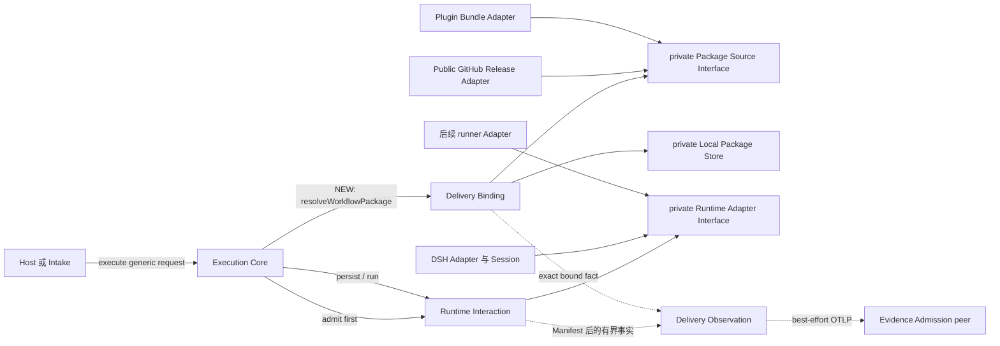
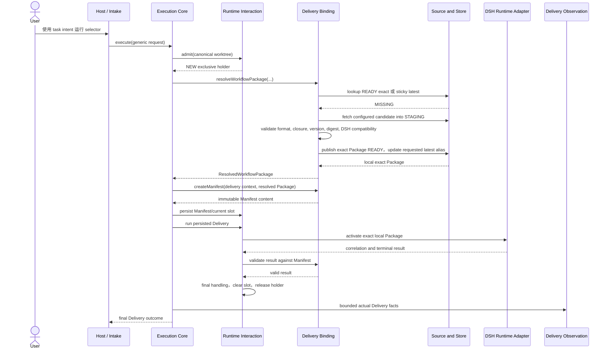
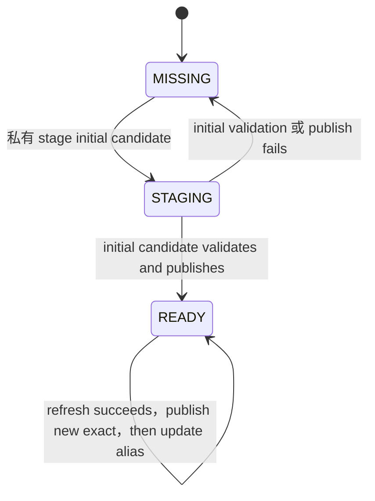
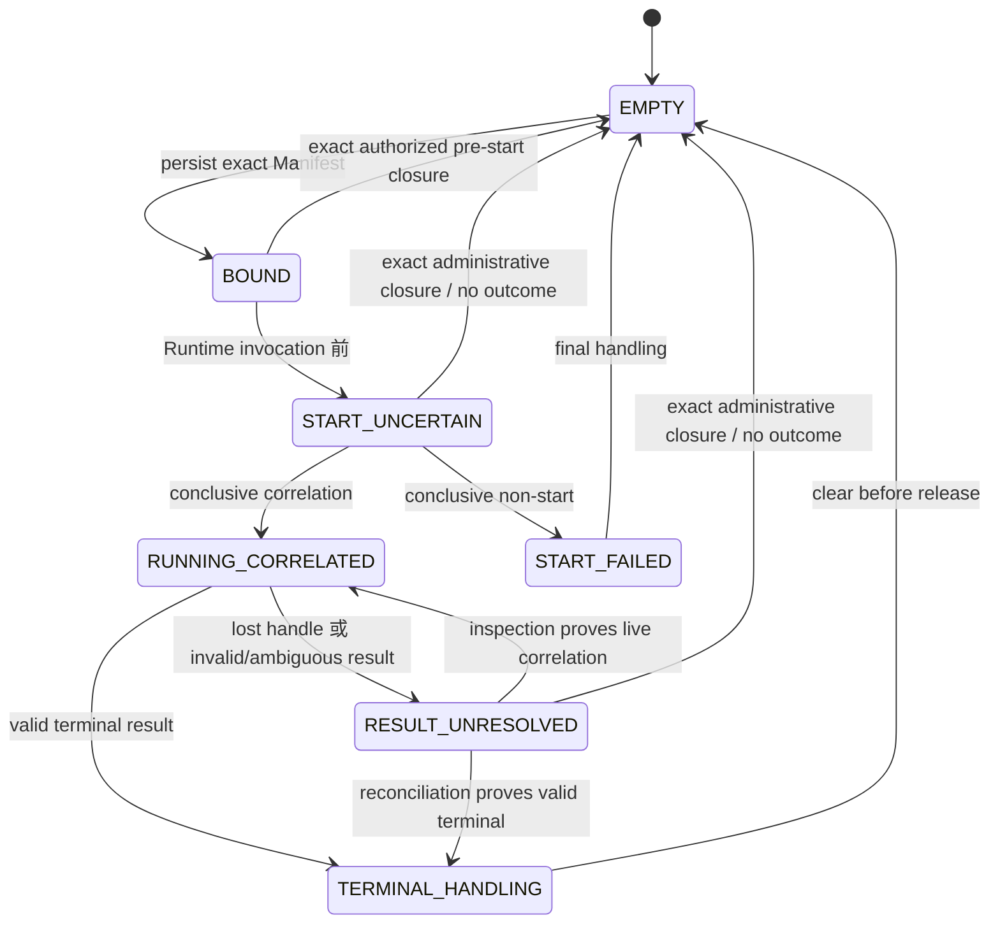

<a id="ee-execution"></a>
# Project Execution System Design

<a id="ee-execution-1"></a>
## 1. 元数据与权威

| 字段 | 值 |
| --- | --- |
| 文档身份 | `execution.identity.001` |
| 发布状态 | `WORKING_REVIEW_CANDIDATE`；先前的受限审查、翻译与 fresh-reader closure 只适用于更早字节。这些已变更字节在精确发布前需要新的确定性 parity/publication binding 以及用户或 reader review。 |
| 精确发布绑定 | 外部 publication set/application record 必须用 SHA-256 绑定本字节流及配套 canonical Concept 字节流，记录适用的 review、SD-12、fresh-reader 与 deterministic-verification 证据，并证明精确安装。本文件有意不声明自身 digest 或配套文件 digest。 |
| 提升后的权威 | 唯一的无版本英文 Project Execution System Design authority |
| 规范语言 | 英文 |
| 翻译 | [`project-execution-system.zh-CN.md`](project-execution-system.zh-CN.md) 是非规范跟踪翻译。英文是唯一语义权威。每当英文某一节变更，其中文对应章节都从当前英文重新翻译并整章替换；中文维护不保留、也不增量演进旧中文措辞。 |
| Source authority commit | `575f4c3217ef5ff2ef2f8655e03ee147b16ac07b` |
| Concept authority | [`concept.identity.001`](../../agent-architecture.md#ee-concept)，作为配套 member 原子提升 |
| Prior canonical Execution baseline | `execution.identity.001`；Git blob `7c9e13846141f95dc04dc3c44534767113b7d19e`；SHA-256 `4d459b2a15a7ca5591d0fa493e0fb82b62dfe6f502fc703e21eab566727e66bb` |
| Composition authority | [`docs/workflow-composition-model.md`](../../workflow-composition-model.md)；Git blob `b5412f5b9fc605f7d82d85fc3fc399f80b2fa25a`；SHA-256 `0df16622d8183eecaddc602cbe6800841a8be523de2d3b93b4c0540082092d03` |
| 已确认意图 | `EE-WORKFLOW-IMPORT-BRIEF`；SHA-256 `7c9b1064084cf5f256f27bc5efd021bed0374910e1430586eebeb695344d4c6d` |
| 已确认方向 | `EE-WORKFLOW-IMPORT-SKELETON`；SHA-256 `86a2a61a324d9bb7ca90108b433ded2f883bc91d9f60dadee87ac7d11feb8e46` |
| 历史方向审查 | `EE-WORKFLOW-IMPORT-SD05-ARCH-RECHECK`；SHA-256 `2c4fbaef0db617ccfc9ce20be8b5470a7251938744cc2d5d792f5ed9ed197c4a`；`PASS`；适用于先前的大型 Workflow-import 方向 |
| 可行性 | `EE-WORKFLOW-IMPORT-SD06-APPLICATION`；SHA-256 `c6714b9c850536273a00b929559f6d71b8ff2c8aeb1f2aaf8054c14c53ca5795`；`FEASIBILITY_CONFIRMED` |
| 定向简化权威 | `EE-WORKFLOW-IMPORT-MVP-SIMPLIFICATION-RR`；只删除机制，不增加可行性问题，并授权受影响范围的受限审查 |
| 历史 expansion inputs | `EE-WORKFLOW-IMPORT-SD07-CP01` SHA-256 `f4c3ef4a09867fc05e2782aefec7616f02b96132cb7ccddf158156ba526e1d85`；`CP02` SHA-256 `0d16e85e4f944720aa49a54ff7c60f2545f925d7a9576067128e860a2ae98d84`；`CP03` SHA-256 `e6f1f054bcf2252684f9e587e09a058e3f40f885bfbbc7011d99fc6d4732a4cd`；适用于先前的大型 Workflow-import expansion |
| 历史大型 Workflow 审查 lineage | 较大型 Workflow-import 设计的 Problem–Solution、Architecture 与 Quality 审查结果，仅作为未变内容的历史证据保留。 |
| 历史大型 Workflow Finding 统计 | `EE-WORKFLOW-IMPORT-SD10-AGGREGATION` 属于历史记录，不是本次定向简化的 Finding 统计。 |
| 历史设计参数与 handoff 关闭 | `EE-WORKFLOW-IMPORT-SD12-CLOSURE-HANDOFF`；SHA-256 `60f24178d3a2f8991d6af2f974e4ed03d35aedc0064d9d253b3773e732e18ea7`；`SUCCEEDED` |
| 历史大型 Workflow Fresh Reader lineage | `EE-WORKFLOW-IMPORT-SD13-FRESH-READER-RESULT` 适用于旧字节，保持为历史记录。 |
| 历史受控集成权威 | `EE-WORKFLOW-IMPORT-SD14-REVISION-REQUEST`；SHA-256 `135ab9647fc6e30318735eff3cef858853cec75f47704e6eaaabd13ecbc59b2e`；deterministic report SHA-256 `1eda28b1c73a8b7d931ab58207d34796173a06bf20cdfae0e17accb2a3a3dc18`；适用于先前的大型 Workflow-import 集成 |
| 受影响范围的受限审查 | Problem–Solution SHA-256 `807863cb6c7887eccdb2720df5ace0afd8e4833f763a029928f44ed1e30e92ae`；Architecture SHA-256 `b220e1114d166cc5a55e34635f847ac2c1af0cf1777bb9c6a6c08dbadf5cdf98`；Quality SHA-256 `b64927087758a987a1f5a4d461035c379970ad84af57133714462ea19ac22f77`；三者收敛为两个 treatment group |
| 统一受限处理 | `EE-WORKFLOW-IMPORT-MVP-SIMPLIFICATION-SD10-TREATMENT`；SHA-256 `da22b3356aa34c3bcf6e3977a3277ef5b0d9c1e8beef35f4fe0db7dd5e72caf6` |
| 先前聚焦受限复查 | `EE-WORKFLOW-IMPORT-MVP-SIMPLIFICATION-SD10-BOUNDED-RECHECK`；SHA-256 `1b5664afd796910beb8b505bbaadd889fbb7fb098b02c141abb27cdba4e74955`；`CLOSED_FIXED`；open Findings `0`；仅适用于更早字节 |
| 先前翻译与 fresh-reader closure | 整节翻译 parity SHA-256 `3c236a404392e1d496e33d4adcdd70000d0db2a2453dcbd7df40813612f77c20`；fresh-reader result SHA-256 `1062561d35422bfacfa7e430f381e5fb25a5a2a911fe8daa5e3499eac5fc2a75`；translation treatment SHA-256 `927a02c6d88eba3571e39c010681b8b47dc956e9a8bafea6812aa9cda91c5d14`；focused recheck SHA-256 `6777175a4e78e363d24ddc3f6bc657b66e9f5a6c2e9fd0042dd210705035c18e`；仅适用于更早字节。当前已变更字节 pending fresh deterministic parity 与用户或 reader review |

Authority order 为：已确认用户意图；规范 Concept；当前 Execution 语义；Workflow composition model；已审查方向与 feasibility evidence；[Observation Catalog](../../contracts/observation/observation-catalog.md)、[OTel Observation Profile](../../contracts/observation/otel-observation-profile.md)、[Execution–Evidence Interaction Contract](../../contracts/execution-evidence/interaction-contract.md) 与 [Metric Catalog](../../contracts/evaluation/metric-catalog.md) 仅在各自 split draft companion scope 内适用。[Evidence System](../evidence/evidence-system.md) 仍是 peer owner。本文拥有 Execution Module、Interface、Package-to-Delivery binding、custody/current-slot lifecycle、Runtime Adapter behavior 与 outbound Observation behavior。它不拥有 Package publication policy、Evidence internals、Observation fact meaning、payload registry、metric schema 或 physical storage schema。

受保护的 `system-design` 与 `implementation` Workflow Package 是初始已验证分发内容和 conformance fixture，不是重新设计目标。其现有语义与组织保持不变。既有 runner profile/code 不变。理解本文不需要任何 disposable workspace artifact；以上 identity 只表示 provenance。
<a id="ee-execution-2"></a>
## 2. 设计上下文

workflow-self-recursive 通过小型、host-neutral 的 execution seam 运行有价值的 logical Workflow，并可选发出 factual Observation。Execution 嵌入每个 repository/workspace。DSH rc.6 是第一个 Runtime Adapter；DSH 拥有 native Session 与 Workflow State，且不支持 resume。后续 runner Adapter 可私有保留更丰富的 pause/resume 行为，而不改变 Core 语义。

首个分发包含受保护的 Implementation 与 System Design Workflow Package。贡献者可以发布其他符合开放 Agent Ops Workflow composition model 的 Package。GitHub 是第一个 remote host，plugin 可以 bundle 两个初始 Package。GitHub 与 bundle 是一个 Package Source seam 上的 private Adapter。

这是面向个人或小团队的 trusted local preview。Configured GitHub repository 是 public，用户控制 installation configuration，concurrent Package management 不是产品需求。设计通过 validation 与 typed early return 处理 ordinary fault；不建设 authentication、authorization、signing、hostile-Package 或 prompt-injection defense、sandboxing、multi-user coordination、distributed locking、Package transaction、production recovery、HA、mirror failover 或 automatic eviction。

Actor 与 ownership：

- **Host or Intake** 将 host/chat syntax 转换为 generic Workflow selector、task intent、worktree reference、configured source 与 selected Runtime context。
- **Execution Core** 按顺序执行 canonical worktree/exclusive admission、仅针对 `NEW` 的 Package preparation、Manifest creation/persistence、Runtime lifecycle、result validation 与 Observation。
- **Delivery Binding** 解析并校验 Package，拥有 simple Local Package Store，返回一个 exact resolved Package，并构造 Manifest 内容。
- **Runtime Interaction** 拥有 canonical worktree exclusivity、current Delivery slot、Manifest persistence、Runtime invocation、recovery 与 final handling。
- **GitHub 与 plugin-bundle Adapter** 获取显式选择的 Package 内容。
- **DSH Runtime/Profile** 拥有 native Session/Workflow State 与 terminal truth。
- **Evidence** 接收可选、单向 Observation，绝不控制 Execution。

<a id="ee-execution-3"></a>
## 3. 问题、目标与范围

现有 Delivery Binding 起点过晚：它假设 caller 已拥有所有精确 Workflow identity，却没有说明 Workflow Package 从哪里获得。若把 download、cache lookup、validation 与 Runtime compatibility 移进 Host code，各 host 都会重复相同行为，且 Delivery Binding 仍然 shallow。

目标是提供从 generic selector 到 DSH 的可实现 local-preview 路径：

```text
WorkflowSelector
→ ResolvedWorkflowPackage(name, exactVersion, packageDigest, localPath, workflowId)
→ DeliveryManifest
→ DSH Runtime Adapter
```

成功调用先获得 `NEW` admission，再解析一个 exact local Package，在 DSH effect 前创建并持久化 Delivery Manifest，并依据该 Manifest 校验 Runtime result。`CONTENDED` 与 `RECOVERY` 在 Package work 前返回。对 `NEW`，有效 local hit 不访问 GitHub；miss 从 configured public GitHub repository 下载，或接收显式选择的 bundle，在 publish `READY` 前完成校验，且从不 fallback 到其他 source/version。Selector、fetch、Package、cache、compatibility、contention 或 Manifest error 都在所属 phase 返回。Package preparation failure 释放 ordinary holder，不创建 Delivery，也不是 Delivery outcome。

范围内包括 generic Intake、exact/sticky-latest selector、local hit、public GitHub miss/refresh、explicit bundle input、contributed conforming Package、`MISSING/STAGING/READY` storage、普通 format/required-resource/relationship/version/digest check、DSH compatibility check、immutable Manifest binding、existing current-slot recovery、DSH result validation 与 unchanged Observation。

范围外包括 Package ranking/fallback、ambient completion、authentication/authorization/RBAC、public source credential、signing、hostile input isolation、injection defense、sandboxing、concurrent Package correctness、queueing/fairness、distributed lock、Package transaction/proof/hold protocol、automated eviction、production download/recovery guarantee、registry/marketplace、HA/failover、repository naming/layout、physical schema、另一 Runtime implementation、Evidence redesign、runner revision，以及对受保护 Package 的修改。

成功表示 implementer 能通过三个既有 Module、simple state 与 typed result 构建该路径，而无需在 Delivery Manifest 前发明另一 lifecycle。

<a id="ee-execution-4"></a>
## 4. 设计驱动因素

| 驱动因素 | 要求结果 | 结构后果 |
| --- | --- | --- |
| Delivery Binding depth | Host 不实现 Package import choreography | M01 暴露一个 resolve/prepare operation，并拥有 private Source/Store seam |
| Request Package work 前 admission | contender 与 stored recovery 避免无意义的 selector/cache/download work | Core 先调用 M02；只有 `NEW` 调用 M01 |
| Delivery 前 preparation | acquisition 或 validation failure 不是 Delivery failure | ordinary `NEW` holder 下，M01 在 Core 创建 Manifest 内容或调用 DSH 前完成 |
| Exact binding | alias 或 Release movement 不改变已创建 Delivery | resolved value 包含 exact version、digest、local path 与 Workflow ID |
| Docker-like local-first | valid exact/latest hit 避免 GitHub；裸 name 表示 latest | Store lookup 先于 Source Adapter；sticky alias 指向 `READY` exact Package |
| Ordinary fault containment | malformed/unavailable input 尽早停止，不建设 recovery subsystem | selector、source、validation、cache、admission、Manifest phase 使用 typed early-return result |
| Simple exclusivity | 每个 worktree 一个 current DSH Delivery | M02 尝试 exclusive admission，不可用时立即返回 `CONTENDED` |
| No fallback/default completion | failure 不选择其他 source/version/resource | 一个 configured source 或 explicit bundle；DSH 在 native effect 前校验 |
| Open contribution | compatible third-party Package 走共同路径 | composition 与 DSH check；无 first-party allow-list |
| Preview restraint | 复杂度匹配 trusted local use | 无 security platform、concurrent Store protocol、automatic eviction 或 production recovery |
| Observation non-control | telemetry failure 不改变 outcome | unchanged one-way M03 Interface |

Numeric latency、timeout、capacity 与 retention setting 属于 implementation/operations choice，除非 measured fact 后续迫使设计改变。

<a id="ee-execution-5"></a>
## 5. 问题分解

1. **Admission 或 recovery。** Canonicalize worktree，并在解释新 Package selector 前返回 `CONTENDED`、stored `RECOVERY` 或 exclusive `NEW` holder。
2. **为 `NEW` 解析并准备 Package。** 优先使用有效 local exact/sticky alias；否则 fetch 一个 configured candidate，校验、publish `READY`，并返回一个 exact `ResolvedWorkflowPackage`。
3. **创建并运行一个 Delivery。** 在同一 ordinary holder 下，从 resolved Package 构造并持久化 Manifest，调用 DSH，校验 result，并维护既有 current-slot lifecycle。
4. **观察有界事实。** Delivery 存在后，把实际 fact 映射到既有 best-effort Observation profile，不控制 execution。

这些问题直接映射为 Delivery Binding（M01）、Runtime Interaction（M02）和 Delivery Observation（M03）。Package source/storage mechanic 留在 M01 内；native Runtime lifecycle 留在 M02 内。Deletion test 证明三个 Module 都有必要：删除任一 Module，其 policy 都会散落到 Host/Core/Adapter。没有理由增加第四个 Module。

<a id="ee-execution-6"></a>
## 6. System 结构



### Delivery Binding（`execution.milestone.01`），深化

M01 隐藏 selector parsing、exact/sticky lookup、GitHub/bundle acquisition、staging、Package validation、DSH compatibility check、`READY` publication、alias update、resolved-value construction、Manifest content construction 与 result-binding check。其主要 caller-facing operation 是：

```text
resolveWorkflowPackage(selector, configuredSource, runtimeTarget, refresh?)
  -> ResolvedWorkflowPackage
  | WorkflowImportError
```

Result 是普通 immutable value：`name`、`exactVersion`、`packageDigest`、`localPath`、`workflowId`。它不是 capability、proof、hold 或 lifecycle state。M01 还根据 Delivery context 与该值构造 Manifest 内容，并依据 Manifest 校验 bounded Runtime result。Caller 从不自行协调 Source 或 Store step。

### Runtime Interaction（`execution.milestone.02`），保留并限定

M02 隐藏 canonical worktree derivation、immediate exclusive admission、current-slot state、Manifest persistence、start uncertainty、Runtime invocation、inspection、recovery、final handling、authorized abandonment 与 private runner lifecycle mapping。它仍是 custody/current-slot state 的唯一 writer，也是 current Manifest 的 persister。它不解释 selector、不下载 Package、不写 Package Store state。

Preview 不增加第二个 pre-Manifest lifecycle。Manifest 存在前，failure 释放 ordinary in-process/OS-backed exclusive holder 并返回。Process death 释放 holder。若 death 发生在 Manifest 可见后，下次调用通过既有 occupied-slot recovery 读取 Manifest。不引入 `ARMED`/commit-unknown/reconciliation state。

### Delivery Observation（`execution.milestone.03`），不变

M03 把有界的实际 Delivery fact 映射为 adopted allow-listed standard-first Observation Profile，拥有 privacy/redaction 与 exporter isolation，只返回 diagnostic。它不拥有 source fact，也不控制 execution。Custody-only attempt 与 preparation rejection 不产生 Delivery Observation。Exact carrier/EventName/common/family registry 与 complete Review-family shape 由 [OTel Observation Profile](../../contracts/observation/otel-observation-profile.md) 拥有；technology-neutral fact meaning、identity、missingness、privacy、lineage、usage 与 relationship semantics 由 [Observation Catalog](../../contracts/observation/observation-catalog.md) 拥有；transport interaction 由 [Execution–Evidence Interaction Contract](../../contracts/execution-evidence/interaction-contract.md) 拥有。M03 不拥有 payload registry 或 Evidence durable storage semantics。

具体而言，profile `0.2.0` 保留 official OTLP/HTTP binary protobuf Trace/Log export、一个 sampled Delivery root 及嵌套 Workflow/Agent/model/tool Span、10 个 EventName，以及 closed 54-common/10-Implementation/6-System-Design field registry。一个 family 可以使用 common 加自身 field，绝不使用 sibling field。Stock DSH Session JSON telemetry 保持 disabled。每个 Event 有稳定 `agentops.event.id`；每个 Span 以 native `(trace_id, span_id)` tuple 标识。Standard token usage 留在 model Span，其他 provider-native quantity 使用 typed usage Event，并含 exact kind/unit/source/source-ID/completeness；missing 不表示 zero，也不推断 conversion 或 price。

Review summary、Finding、Fix 与 Recheck 仍选择一个完整 named base-plus-variant shape。每个 Finding 携带一个 bounded privacy-safe factual summary、Finding-specific scope identity 和恰好一个 typed Artifact/section/component/requirement target；multi-target Finding 对每个 target edge 重复完整 assertion。Owner-known Role lineage 同时携带 version-local Role ID 与 family-scoped lineage ID；unknown lineage 省略，绝不按 name 或 position 推断。M03 不发出 prompt、message、tool argument/result、source/diff、credential 或 raw-error body，也不从 name、order、count 或 grouping 推断 quality、causality、reviewer effectiveness 或 relationship。Administrative unresolved/abandonment state 仍是 M02 state，不是 first-profile Observation。

Implementation fact 保留 typed test summary，并按 coverage scope/tool/format/report Artifact 各有一个 implementation summary。System Design 保留 common review relationship、Fresh Reader review summary 与 deterministic-verification summary。Observed Agent/model/tool call 与 duration 留在 standard Span；family summary 只携带 owner-observed loop/intervention fact。Emission 前 M03 选择一个 whole shape，并要求完整 base 与 variant addition，绝不发 fragment 或 implicit inheritance。

对于 ordinary 与 Recheck summary，owner input 若有 nonnegative observed count，就精确发出 C17，包括 zero；没有 count fact 就省略 C17。Omission 是“无 count fact”的全部 wire signal。Invalid count type/range 不发出 malformed Observation。Finding shape 仍禁止 C17。只有既有 profile 要求 Recheck 语义时 C27 才 required。Assertion、target、status、Fix、Recheck identity 保持不同；exact retry 是 no-op，compatible later lifecycle fact append 而不是 rewrite assertion。每条 lifecycle record 都重复 selected shape 要求的 immutable assertion 与 exact typed target coordinate。

### Private seam

- **Package Source Interface** 是真实 seam，因为有 GitHub 与 bundle 两个 Adapter。它接收 exact/latest candidate request，返回 candidate bytes 与普通 version/digest metadata，或 typed not-found/fetch failure；不构造 resolved value 或 Manifest。
- **Local Package Store** 是 private M01 state。Lookup 只暴露 `MISSING` 或 `READY`；`STAGING` 不可 address。Implementation 可以使用 temporary directory 与 rename 发布完整 Package，但 System Design 不要求 transaction manager 或 concurrent-writer protocol。
- **Runtime Adapter Interface** 接收 persisted exact Manifest binding。DSH 与后续 runner 私有不同；native type 不跨 Core。

依赖 acyclic，指向 Core-owned meaning。Host 不编排 M01 internals；M02 不访问 Source/Store；source Adapter 不构造 Manifest；M01 不依赖 Evidence；DSH 不选择 Package identity。

<a id="ee-execution-7"></a>
## 7. 协作与端到端流程

### 无分支的成功 Delivery



成功顺序是 admit `NEW`、resolve/prepare、construct Manifest、persist current Manifest、mark start uncertainty、invoke DSH、validate result、finalize、observe。Package preparation 在 ordinary Delivery exclusivity holder 下执行，但没有 Delivery identity 或 Delivery Observation。该 holder 防止另一 current Delivery；它不是 Package proof、hold、transaction 或 concurrent Store protocol。

M01 拥有的所有 selector、source、Package、version、digest、cache 与 DSH compatibility 分支只在 M02 返回 `NEW` 后发生。任何此类 failure 都释放 ordinary holder，并在 Manifest persistence、Delivery creation、Runtime/Session/worktree effect 或 Observation 之前返回。M02 执行 admission 所需的 canonical worktree 与 request-shape check 仍可作为 M02 precondition。`CONTENDED` 与 `RECOVERY` 从不调用 M01、Source 或 Store。

### 有效 local exact 或 sticky-latest hit

M01 解析 selector 并首先查询 Store。`name@exactVersion` 只解析 matching `READY` Package。裸 `name` 与 `name@latest` 在 local sticky alias 指向 `READY` 时使用它。除非 caller 显式请求 refresh，M01 的 Source call 为零。Returned exact field 被复制进 Manifest，后续 alias movement 只影响后续 call。

### Public GitHub miss 或显式 refresh

遇到 `MISSING` 或 explicit latest refresh 时，M01 只调用 configured public GitHub Adapter。Exact selection 请求对应 Release；latest selection 请求 source 的 latest Release。Adapter 选择一个 versioned Package asset，并私有 staging。M01 在 Store publication 前校验。对于 latest，Store 仅在 exact Package 成为 `READY` 后更新 alias。Failure 返回 typed error，并保持所有既有 `READY` Package/alias 可用。

### 显式 plugin bundle

只有 caller/configuration 显式选择 bundle 时才使用。Bundle Adapter 提供与 GitHub 相同的 generic candidate shape；M01 执行相同 validation、Store publication、resolved-value 与 Manifest path。GitHub failure 时 bundle 不是 fallback。

### Invalid selector

在 `NEW` 后，unsupported 或 ambiguous selector syntax 返回 `INVALID_WORKFLOW_SELECTOR`，且发生在 Source 或 Store mutation 前。Core 释放 ordinary holder；不存在 Manifest、Delivery、Runtime/Session/worktree effect 或 Observation。

### GitHub unavailable 或 Package not found

需要 remote lookup 时，无法访问/下载返回 `WORKFLOW_FETCH_FAILED`；requested Release/asset 不存在返回 `WORKFLOW_NOT_FOUND`。两者都不调用 bundle Adapter 或尝试其他版本。Core 释放 ordinary `NEW` holder；不存在 Manifest 或 Delivery。

### Invalid 或 incomplete Package

Malformed Package index、missing required owned/referenced resource、unresolved relationship、unsupported composition 或 invalid identity 返回 `WORKFLOW_PACKAGE_INVALID`。Candidate 保持 non-addressable，Core 释放 ordinary `NEW` holder，不存在 Manifest 或 Delivery。

### Version 或 digest mismatch

Candidate declared/resolved version 与 request 不一致时返回 `WORKFLOW_VERSION_MISMATCH`；digest 不一致返回 `WORKFLOW_DIGEST_MISMATCH`。M01 不 publish `READY`，也不把 candidate 重新解释成另一版本；Core 释放 ordinary `NEW` holder。

### DSH incompatibility

在 `NEW` 后，M01 在返回 resolved value 前检查 selected Package 是否包含 declared DSH implementation/routes 与 required configuration。Missing 或 unsupported DSH input 返回 `WORKFLOW_DSH_INCOMPATIBLE`；Core 在 Manifest persistence、Delivery creation、Session、provider/Driver、worktree effect 或 Observation 前释放 ordinary holder。该检查返回 error，不创建 persisted proof object。

### Cache publication failure

无法使 validated candidate 成为 `READY` 时返回 `WORKFLOW_CACHE_PUBLISH_FAILED`，Core 随后释放 ordinary `NEW` holder。未来 lookup 忽略 `STAGING`，并可 best-effort 删除。Initial-fill failure 使 lookup 保持 `MISSING`；refresh-candidate failure 保持 prior `READY` exact Package 与 sticky alias 不变。Preview 不承诺 crash/power-loss matrix 或 concurrent refresh correctness。

### Delivery contention

Core 调用 M01 前，M02 尝试既有 per-worktree exclusive admission。Live/current holder 使 `CONTENDED` 立即返回。Core 不 wait、queue、steal、resolve/download Package、访问 request-specific Store state、创建 Manifest、调用 DSH 或发出 Delivery Observation。

### Occupied-slot recovery

若 admission 找到 existing current Manifest，M02 为 stored Delivery 返回 recovery。Core 忽略新 selector/task，且不调用 M01、Source 或 Store；它遵循既有 DSH inspection/result/authorized-abandonment rule，绝不 start、resume 或 replace stored DSH Delivery。

### Manifest creation 或 persistence failure

若 M01 无法构造 complete Manifest，Core 释放 exclusive holder 并返回 `DELIVERY_BINDING_FAILED`。若 M02 无法 persist Manifest/current slot，则释放 holder 并返回 `DELIVERY_CREATE_FAILED`。两种 error 都不是 Delivery outcome，也不调用 DSH 或 M03。若 process death 发生在 Manifest 可见之后，由 ordinary occupied-slot recovery 处理；不存在独立 commit-resolution protocol。

### DSH activation、invalid result 与 Observation loss

DSH Adapter 在 native invocation 前校验 persisted Manifest 指向 exact local `READY` Package。它不扫描 ambient path，也不替换 resource。Invocation 后，既有 `START_UNCERTAIN`、`START_FAILED`、`RESULT_UNRESOLVED`、terminal-result、final-handling 与 exact authorized-abandonment rule 保持不变。Observation disabled/refused/timed-out/tail-loss 不改变 Runtime result 或 slot handling。

### 后续 runner lifecycle

runner 满足同一 Core-owned lifecycle meaning，但可以私有 park resumable state、checkpoint、release physical custody，并 reacquire valid custody。这些 mechanic 不成为 DSH 或 public Core requirement，本修订不改变 runner profile/code。

<a id="ee-execution-8"></a>
## 8. 数据、状态、身份与 Ownership

### Binding 数据

```text
WorkflowSelector
→ ResolvedWorkflowPackage
→ DeliveryManifest
→ Adapter-private DSH Session/Workflow State
→ bounded result validated against Manifest
```

`ResolvedWorkflowPackage` 包含 `name`、`exactVersion`、`packageDigest`、`localPath`、`workflowId`。Local path 标识本 installation 内已校验的 `READY` materialization；version 与 digest 提供 Manifest construction 与 DSH activation 使用的 stable content check。Source metadata 可作为 bounded diagnostics/provenance 保留，但不是 authorization identity 或 capability。

Manifest 恰好绑定一个 Delivery/task relationship、resolved exact Package fields、logical Workflow/implementation、Runtime/version/configuration、intent reference 与 bounded source context。它排除 mutable alias、raw Package/Prompt/message/tool/source/credential body、Runtime checkpoint、Evidence receipt、native custody/Session identifier。Physical field 留给 downstream representation work。

### 权威状态

| 状态 | 唯一 writer | Reader | 规则 |
| --- | --- | --- | --- |
| selector/configured source | Host/Intake | Core/M01 | generic input；source 是 trusted configuration |
| Store `STAGING`/`READY` 与 sticky alias | M01 through Store | M01；DSH materializer 读取 exact `READY` path | staging 私有；alias 只指向 ready exact Package；不 automatic eviction |
| resolved exact Package value | M01 | Core/M01/M02/Runtime Adapter | 一次 call 的 immutable value；Manifest/activation 期间不 re-resolve |
| canonical exclusivity/current slot | M02 | Core/M02 | admission 先于 M01；`CONTENDED`/`RECOVERY` 不做新 Package work；一个 current Delivery |
| Manifest content | M01 构造；M02 persist | Core、Runtime Adapter、M03 | persistence 创建 current Delivery binding |
| native Session/Workflow State/result | Runtime | M02 观察 bounded projection | Runtime-owned |
| Observation representation | M03 | exporter/Evidence | transient/best-effort、non-controlling |

不存在 Prepared Binding store、proof identity、hold/reference count、liveness transfer、pre-Manifest authority 或 Package-transaction state。

### Local Package Store



`MISSING` 与 `READY` 是 lookup outcome。`STAGING` 描述新 candidate 的 private lifecycle，绝不是 hit。Initial fill 没有 prior value，因此 candidate failure 保持 `MISSING`。Refresh 时，candidate staging 与 current `READY` Package/alias 并存，不改变该 visible lookup state。Failure 只 discard/ignore candidate；success 先 publish 新 exact Package，再改变 alias。这是 sequential local state handling，不是 transaction 或 concurrent-writer protocol。Temporary residue 可 best-effort 删除，没有 semantic state。Preview 不自动 evict `READY` Package，因此不需要 active-Delivery reference tracking。

### Current Delivery slot

既有 slot 保持 `EMPTY → BOUND → START_UNCERTAIN → RUNNING_CORRELATED → TERMINAL_HANDLING → EMPTY`，并含 conclusive `START_FAILED`、blocking `RESULT_UNRESOLVED`、exact administrative closure branch。Package preparation 在 M02 持有 exclusive `NEW` admission 时执行，但在任何 slot state 写入前。Manifest persistence 前 process death 不留下 Delivery；persistence 后 death 留下 occupied Manifest，由既有 recovery 处理。



<a id="ee-execution-9"></a>
## 9. Interface、依赖、Seam 与 Adapter

| Interface 含义 | Caller-visible input | Result/error | Ordering/configuration |
| --- | --- | --- | --- |
| External Core operation | worktree、selector、task intent、configured source 或 explicit bundle、selected Runtime context、optional refresh | final Delivery outcome、`CONTENDED`、exact recovery 或 typed pre-Delivery error | 一个 host call；无 native field；先 M02 admission |
| M01 create Manifest | resolved Package 加 complete Delivery/task/worktree/Runtime/intent context | immutable Manifest 或 `DELIVERY_BINDING_FAILED` | 不 source/cache/alias lookup |
| M02 admit | canonicalizable worktree | `NEW` holder、`CONTENDED`、exact `RECOVERY` 或 custody/identity error | Core 第一个 call；immediate；不 wait/queue/preemption；non-`NEW` 不调用 M01 |
| M01 resolve/prepare | `NEW` holder context、selector、configured source、Runtime target、refresh flag | `ResolvedWorkflowPackage` 或 `INVALID_WORKFLOW_SELECTOR`、`WORKFLOW_NOT_FOUND`、`WORKFLOW_FETCH_FAILED`、`WORKFLOW_PACKAGE_INVALID`、`WORKFLOW_VERSION_MISMATCH`、`WORKFLOW_DIGEST_MISMATCH`、`WORKFLOW_DSH_INCOMPATIBLE`、`WORKFLOW_CACHE_PUBLISH_FAILED` | `NEW` 后；local-first；至多一个 Source Adapter；无 fallback；无 Delivery |
| M02 persist/run/finalize | exact holder 与 Manifest，再加 bounded Runtime result | existing occupied lifecycle outcome/error 或 `DELIVERY_CREATE_FAILED` | Runtime effect 前 Manifest；保留 existing start/result uncertainty |
| M01 validate result | exact Manifest 加 bounded Runtime result | valid result 或 typed mismatch | 不 reinterpret Package/source |
| M03 observe | bounded post-Delivery fact | 仅 local diagnostic | existing profile/privacy；无 control effect |

Source Interface 接收一个 candidate request。Public GitHub Adapter 获取 Release metadata 与一个 versioned asset；bundle Adapter 读取一个 explicitly selected bundled Package。Source-native field 保持私有。Not-found 与 ordinary transport failure 是不同 typed result。

Store implementation 执行 lookup、private candidate staging、complete publication、exact conflict detection，并在新 exact Package `READY` 后更新 sticky alias。Initial failure 保持 `MISSING`；refresh failure 保持 prior `READY` Package 与 alias。Local filesystem implementation 可在 sibling temporary directory staging，再 rename 到 final exact path。这是避免 partial hit 的 implementation technique，不是 production transaction protocol。Caller 看不到 Store choreography。

Runtime Adapter 只接收 persisted Manifest，并解析其 exact local `READY` path。DSH 在 native effect 前校验并私有 project。既有 representative rc.6 feasibility evidence 只证明 seam direction，不是 production conformance。

<a id="ee-execution-10"></a>
## 10. 故障、恢复与 System-wide 行为

| 故障域 | Containment |
| --- | --- |
| selector | `NEW` 后，`INVALID_WORKFLOW_SELECTOR` 在 Source/Store mutation 前返回；释放 holder；无 Manifest/Delivery/Runtime/Observation |
| local lookup | 忽略 `STAGING`；invalid `READY` metadata 返回 `WORKFLOW_PACKAGE_INVALID` |
| GitHub/bundle source | not found 为 `WORKFLOW_NOT_FOUND`；unavailable/interrupted transfer 为 `WORKFLOW_FETCH_FAILED`；无 fallback |
| Package validation | format/required-resource/relationship/identity failure 为 `WORKFLOW_PACKAGE_INVALID` |
| version/digest | explicit mismatch code；不 publish `READY` |
| DSH compatibility | `NEW` 后返回 `WORKFLOW_DSH_INCOMPATIBLE`；在 Manifest/Delivery/native effect/Observation 前释放 holder |
| Store publication | `WORKFLOW_CACHE_PUBLISH_FAILED`；initial fill 保持 `MISSING`，refresh 保持 prior `READY`+alias；释放 holder；temporary residue best-effort cleanup |
| Delivery admission | 最先执行；`CONTENDED`/`RECOVERY` 无 M01/Source/Store call；不 wait/queue/steal/new Manifest |
| Manifest construction/persistence | `DELIVERY_BINDING_FAILED` 或 `DELIVERY_CREATE_FAILED`；释放 exclusive holder；无 Runtime/M03 |
| Runtime start/result | 保留 existing `START_UNCERTAIN`、`START_FAILED`、`RESULT_UNRESOLVED`、conclusive inspection、final handling 与 exact abandonment |
| process death | OS 释放 live holder；无 persisted Manifest 即无 Delivery；有 persisted Manifest 即 existing occupied-slot recovery |
| Observation/export | 仅 diagnostic；execution path 不变 |

Pre-Delivery cancellation 停止当前 operation，best-effort cleanup staging，释放所有 live exclusive holder，并返回 pre-Delivery cancellation result。它不是 Delivery `CANCELLED`。Post-Manifest cancellation 在支持时仍由 Runtime 拥有，并忠实表示。不存在 background Package reconciler、durable queue、blind retry、automatic failover 或 cleanup authority protocol。

上表所有 M01 failure row 都假设 M02 已返回 `NEW`，并释放同一个 ordinary holder。M02 可以在返回 `NEW` 前拒绝 malformed canonical-worktree 或 admission request shape，因为这些检查属于 admission，不属于 Workflow selector/Package validation。

<a id="ee-execution-11"></a>
## 11. 质量属性实现

| 质量 | 上下文与 threshold | 机制 | Trade-off/residual risk | 验证 |
| --- | --- | --- | --- | --- |
| Exactness | created Delivery 不漂移 | exact resolved value 复制进 Manifest；DSH 检查 local digest/version | physical canonicalization downstream | binding/alias-movement fixture |
| Fault containment | ordinary import failure 不创建 Delivery | Manifest 前 typed early return | 无 production recovery guarantee | Interface negative fixture |
| Responsiveness | occupied/recovery 在 Package work 前返回；valid `NEW` local hit 不访问 network | M02-first admission，再 local-first lookup | sticky latest 可能 stale | admission/M01/source spy |
| Maintainability | Host 只学习一个 import operation | deep M01 与 private Source/Store seam | M01 有较广 internal behavior | Interface test 与 deletion test |
| Evolvability | 新 conforming Package/source Adapter 无需改 Core semantics | open composition model 与真实 two-Adapter Source seam | publication governance downstream | contribution/paired-Adapter fixture |
| Compatibility | complete Package 可供 selected DSH 使用 | ordinary M01 validation 与 Adapter-first activation | representative evidence 有限 | protected/contributed/no-default fixture |
| Privacy/operability | bounded phase-correct diagnostic 与 post-Delivery Observation | typed error 与 unchanged M03 allow-list | 接受 best-effort loss | telemetry/body-marker fixture |
| Resource efficiency | 无 Core DB/history/outbox 或 automated eviction | 一个 asset、local `READY` cache | disk 使用增长至 manual cleanup | bounded resource observation |

Concurrency scalability、adversarial security、authentication/authorization、production HA/recovery、marketplace、registry federation 与 automatic failover 对 confirmed trusted local preview 为 `NOT_APPLICABLE`。只有 deployment/trust/scale context 变化时才重开设计。

<a id="ee-execution-12"></a>
## 12. 风险与权衡

| 风险 | 影响 | Treatment/owner | Reopen condition |
| --- | --- | --- | --- |
| sticky latest stale | 用户可能拿不到最新 Release | explicit refresh；记录 Docker-like local-first behavior | 产品要求 always-online freshness |
| public GitHub unavailable | cache miss 无法运行 | typed early return；existing `READY` Package 仍可用 | 产品要求 availability/failover target |
| M01 拥有广泛 import behavior | implementation 可能难以导航 | 保持一个 small public operation 与 private cohesive helper/seam | 出现 independent consumer/authority 或 measured Interface failure |
| Local Store residue/disk growth | temporary/old Package 占用磁盘 | best-effort staging cleanup 与 manual cache removal；无 automatic eviction | measured use 要求 managed retention/eviction |
| DSH compatibility check 不完整 | failure 可能到 activation 才出现 | native effect 前校验所有 declared required resource；保留 honest Runtime error | production Package 要求新 capability semantics |
| trusted-preview context 改变 | 当前 validation 不足 | explicit scope 与 reopen trigger | untrusted source/operator、remote shared service、credential、hostile tenant 或更强 DSH security boundary |
| Observation/runner regression | unrelated authority 受扰动 | byte-for-meaning 保留 M03 与 Adapter-private runner semantics | control coupling、public resume 或 runner code change |

<a id="ee-execution-13"></a>
## 13. 验收与验证

### 设计验收 trace

| 场景 | 机制 | 预期结果 | 验证状态 |
| --- | --- | --- | --- |
| generic intake（`SC-WI-00`） | 一个 generic Core operation | 无 host/DSH/source-native field 跨 Core | planned implementation type scan |
| exact local hit（`SC-WI-01`） | Store lookup 先于 Source | exact resolved value；Source call 为零 | planned Interface fixture |
| exact miss（`SC-WI-02`） | 一个 configured GitHub Release asset | validated exact Package 成为 `READY` | planned Source/Store fixture |
| sticky latest（`SC-WI-03`） | alias 指向 `READY` exact Package | hit 时 Source call 为零；无 active drift | planned alias fixture |
| explicit refresh（`SC-WI-04`） | candidate staging 与 prior `READY` 并存；publish exact 后更新 alias | success 安装新 exact 再更新 alias；failure discard candidate 并保持 prior `READY`+alias | planned initial-fill vs refresh Store fixture |
| contribution（`SC-WI-05`） | shared composition/DSH validation | conforming third-party Package 走相同路径 | production conformance planned |
| invalid/incompatible（`SC-WI-06`） | M02 `NEW`，再 ordinary M01 validation 与 typed error | 释放 ordinary holder；无 Manifest、Delivery、DSH/Runtime/worktree effect 或 Observation；non-`NEW` 无 M01/Source/Store work | planned admission/M01/Source/Store spy 与 negative matrix |
| preparation/Manifest failure（`SC-WI-07`） | Manifest persistence 前/时 early return | 无 Delivery outcome 或 Observation | planned Core/M01 negative fixture |
| explicit bundle（`SC-WI-08`） | 第二个 private Source Adapter | 相同 validation/resolution path；无 fallback | paired Adapter evidence exists；production fixture planned |
| evolution（`SC-WI-09`） | exact field 复制进 Manifest | 后续 alias/Release 只影响后续 Delivery | planned movement fixture |
| no ambient（`SC-WI-10`） | Adapter-first exact local validation | missing resource 在 native effect 前 reject | production no-default negative planned |
| host portability（`SC-WI-11`） | generic Core、private Adapter | 无 native type/public resume | planned type/contrast fixture |
| GitHub outage/not-found（`SC-WI-12`） | typed Source result | local hit 可工作；required remote call 无 Delivery/fallback 地返回 | planned dead-network/not-found fixture |
| Delivery contention | M02 先于 M01 | `CONTENDED`；无 wait、queue、Package work 或 Manifest | planned admission/M01/Source/Store spy fixture |
| occupied recovery | M02 先于 M01；stored Manifest authority | 检查 existing Delivery；无新 selector Package work 或 replacement | existing recovery 加 M01/Source/Store spy fixture |
| DSH success/result | exact persisted Manifest | 一个 native Session path 与 exact result validation | production end-to-end planned |
| Observation loss | unchanged one-way M03 | Delivery outcome 与 slot handling 相同 | existing loss fixture planned |

### Implementation 验收计划

Test 跨越 M01、M02 与 Runtime Adapter Interface 并断言 observable result。Required coverage 是上方具名 local-hit/miss/bundle/validation/cache/contention/Manifest/DSH/result/Observation branch。Test 不规定 private directory name、helper function、lock primitive 或 GitHub client library。本修订不增加 Spike，也不增加 production security、concurrency schedule、response-loss、power-loss、transaction、hold、eviction 或 HA matrix。

### 保留的既有 Execution 验收

| 既有 concern | 要求保持不变的结果 | 验证责任 |
| --- | --- | --- |
| Start uncertainty | unknown start 保持 occupied/blocking；只有 conclusive non-start 或 exact authorized closure 才 clear | crash/restart 与 conclusive-inspection fixture |
| Lost handle 或 invalid/ambiguous result | `RESULT_UNRESOLVED` 保持 occupied；不 fabricated result 或 blind replay | malformed/lost-handle/reconciliation fixture |
| Authorized abandonment | exact current authority clear，且无 Runtime outcome/history/same-Delivery retry | positive、stale、mismatched authorization fixture |
| Observation failure/privacy | execution outcome 相同；prohibited body marker 为零 | disable/refusal/timeout/tail-loss 与 privacy scan |
| Profile mapping | 精确 `0.2.0` carrier、10 EventName、54+10+6 registry、family exclusion | OTel Profile deterministic registry/table/type check 与 production conformance |
| Review composition 与 Finding scope | 恰好一个完整 named shape；bounded assertion 加一个 typed target；multi-target edge 完整重复 | complete-shape、endpoint、multi-target、privacy、duplicate/conflict fixture |
| Count presence semantics | C17 zero/positive/omission 不同；invalid value 与 Finding carrier 不能落下 malformed count state | ordinary/Recheck zero/positive/absence 与 negative fixture |
| Role lineage 与 usage | local/lineage pair 不同；provider-native quantity 保持 exact kind/unit/source group | lineage duplicate/conflict/privacy 与 usage compatibility fixture |
| Span/Event identity | Event ID 与 `(trace_id, span_id)` 保持 exact dedup/conflict meaning | new/identical/conflicting identity fixture |
| 后续 runner | private resume 保持可用，不 public resume/native leak | contrasting DSH/runner lifecycle/type fixture |

<a id="ee-execution-14"></a>
## 14. 决策、下游工作与被拒方案

### 决策登记

| ID | 决策 |
| --- | --- |
| `DEC-WI-01` | 保持 M01 deep，覆盖 selector、Source/Store、validation、resolved Package、Manifest construction 与 result validation；不增加第四个 Module |
| `DEC-WI-02` | M02 先执行 canonical worktree/exclusive admission。`CONTENDED` 与 `RECOVERY` 不执行新 selector Package work；只有 `NEW` 调用 M01。M01 仍在 Manifest persistence 创建 current Delivery binding 前完成 preparation |
| `DEC-WI-03` | GitHub 与 bundle 是一个 Package Source seam 的 private Adapter。Source selection 是 trusted configuration，不是 authority/capability protocol |
| `DEC-WI-04` | Composition 与 selected DSH compatibility 保持 ordinary validation step，返回 typed error；不存在 persisted proof identity |
| `DEC-WI-05` | M01 返回普通 immutable `ResolvedWorkflowPackage`，绝不返回 opaque Prepared Binding、hold 或 caller-managed capability |
| `DEC-WI-06` | Pre-Delivery failure 使用 phase-typed early return 与 ordinary holder/staging cleanup；不形成 transaction、Delivery outcome 或 Observation |
| `DEC-WI-07` | 首个 GitHub mechanism 使用一个 versioned Release asset；exact/latest resolution 遵循 Docker-like local-first behavior |
| `DEC-WI-08` | Store lookup 暴露 `MISSING`/`READY`；`STAGING` private/non-addressable；latest alias 只在 exact `READY` 后改变；不 automatic eviction |
| `DEC-WI-09` | Preview 不增加 pre-Manifest lifecycle。Existing current-slot authority 从 persisted Manifest 开始，并保留之后既有 DSH uncertainty/recovery |
| `DEC-WI-10` | 在明确的 trust/exposure/scale trigger 变化前，不设计 authentication、authorization、signing、injection defense、sandbox、concurrent Store protocol、distributed lock、HA、failover 或 production recovery mechanism |

既有 Execution decision 继续有效：三个 deep Module；Runtime-owned Workflow outcome 位于 Core-owned Adapter seam 后；one-current-slot lifecycle 且无 Execution history；standard-first allow-listed best-effort Observation；canonical worktree revalidation；对 persisted Runtime uncertainty 的 conclusive handling；Observation Profile `0.2.0` 语义。本修订不改变 M03、Evidence 或 runner 语义。

本 preview 拒绝：Host-owned Package import；M02/DSH 内 Package import；第四 Module；first-party Package allow-list；Manifest 中 mutable alias；automatic GitHub-to-bundle fallback；source/version fallback；ambient completion；opaque Prepared Binding；proof/capability identity；Package hold/reference-count/liveness transfer；commit-resolution state machine；concurrent cache correctness；automated eviction；authentication/authorization/security platform；registry/marketplace；HA/failover；DSH-native Core type；runner change。

### Concept-owned 下游义务的非 owning 本地视图

Concept obligation register 仍是 owner-complete authority。Execution-local view 仅限：

| 义务 | Execution 含义 | Return trigger |
| --- | --- | --- |
| `concept.obligation.010` | 表示 exact resolved Package/Manifest field 与 typed error，不增加 proof/transaction semantics | physical form 允许 re-resolution、ambient completion、native leakage 或 pre-Delivery outcome |
| `concept.obligation.011` | 实现 Core/M01/M02/M03 collaboration 与具名 early-return branch | bypass、drift、wait/queue、新 lifecycle/Module、Observation control 或 runner change |
| `concept.obligation.012` | 选择/发布 public repository Release asset 与 explicit bundle descriptor | mutable/ambiguous/incomplete asset、allow-list、rewrite、bypass 或 fallback |
| `concept.obligation.013` | 实现 `MISSING/STAGING/READY` Store 与 sticky alias-after-ready | partial hit、prior-ready loss，或真实需要 concurrent writer/eviction |
| `concept.obligation.014` | 通过 DSH qualification complete protected/contributed Package projection，且无 ambient completion | rewrite、post-effect rejection、missing capability 或 native leak |
| `concept.obligation.015` | 在当前 simple semantics 内选择 ordinary fetch/cache resource setting | measurement/context 要求不同 ownership/Interface/security/reliability semantics |

本修订不包含 machine schema 修改。Observation meaning、wire profile、interaction flow 与 metric reading 由各自 split draft companion 处理；physical representation 另行处理，不能通过本 System Design 重开明确 MVP non-goal。

<a id="ee-execution-15"></a>
## 15. Module 深化与 Implementation Handoff

建议 detailed-design 顺序：

1. **Runtime Interaction**：冻结 M02-first `CONTENDED/RECOVERY/NEW` admission、ordinary holder、Manifest persistence 与既有 current-slot/DSH recovery，不增加 pre-Manifest state。
2. **Delivery Binding**：为 `NEW` 定义 `resolveWorkflowPackage`、selector rule、Source/Store internal、validation order、resolved-value construction、Manifest construction、result validation、typed error，以及 pre-Manifest return 时 holder release。
3. **DSH Runtime Adapter**：把 persisted Manifest project 到 exact local `READY` Package，并对两个 protected 与 contributed conforming Package 证明无 ambient completion。
4. **Delivery Observation**：仅当 exact Package field 需要新 scalar mapping 时深化；否则 existing profile 与 test 不变。

Module Detailed Design 必须说明可执行 control/data flow，而不是把这些 decision 重述成 checklist。M01 Interface 是主要 import test surface；Source/Store test Adapter 保持 private。Implementation 应优先使用 temporary staging directory 加 complete publish/rename、simple typed result 与 ordinary cleanup。不得增加 caller choreography、Prepared handle、proof store、reference count、transaction manager、background reconciler、concurrent-writer schedule、credential flow、security scanner、automatic eviction、fallback 或 ambient Package lookup。

只有 evidence 要求新 Module/semantic writer、Package rewrite、mutable active binding、source/version fallback、concurrent/shared Store correctness、automated eviction、authentication/authorization、hostile-source isolation、remote multi-user operation、HA/failover、changed current-slot semantics、public native type、Observation control dependency 或 runner change 时，才返回创建新 System Design version。

### 文档完成检查

- [x] Trusted local/public-GitHub/individual-or-small-team preview context 与 explicit reopen trigger 塑造设计。
- [x] 三个既有 Module 保留，具备可实现 responsibility、small Interface、private seam、acyclic dependency。
- [x] 成功流程无分支；所有要求的 local-hit/miss/bundle/validation/cache/contention/Manifest/DSH branch 均具名并有 typed outcome。
- [x] `ResolvedWorkflowPackage` 与 `MISSING/STAGING/READY` 替代原 proof/Prepared-hold/transaction machinery。
- [x] M02 admission 先于 Package work；只有 `NEW` preparation；preparation 先于 Delivery creation；Manifest persistence 先于 DSH effect；pre-Delivery failure 不创建 Delivery outcome 或 Observation。
- [x] Exact/local-first/sticky-latest/no-fallback/no-ambient/open-contribution/DSH-first 语义保留。
- [x] Existing current-slot recovery、M03 Observation、Evidence relationship、protected Package、runner 语义不变。
- [x] Acceptance 面向 Interface，不要求 Spike、production security、concurrency schedule、transaction、response-loss、power-loss、eviction 或 HA evidence。

Publication 仍受 external exact-byte publication record 与 Concept-owned obligation register 约束。这些候选字节不包含 Workflow routing authority。
