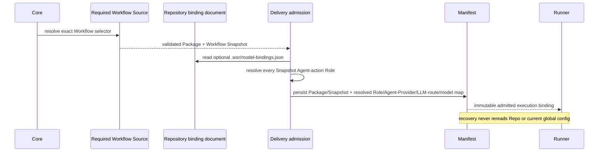

# Repository Role-to-Model Binding — Design Candidate

> **Status:** Iteration 5 contract-change candidate, 2026-08-28. This document supersedes the single-model portions of the Iteration 3 Execution design only after the corresponding Workflow DSL, Delivery Manifest, Observation, and Evidence Query revisions pass their own lifecycle gates. The Chinese tracking companion is [`repository-role-model-binding.zh-CN.md`](repository-role-model-binding.zh-CN.md).

## 1. Decision

The repository is the smallest model-policy scope. One Execution installation selects exactly one Agent Provider identity. A repository may bind Workflow Role identities to exact model selections understood by that Agent Provider. For DSH, one selection is the closed pair `{provider, model}`: the registered DSH LLM-route identity plus the route-scoped model identity. When the repository has no binding for a Role, Execution uses its installation-wide default model selection. Repository data never selects or changes the Agent Provider and never configures an LLM route.

```text
effective_model_selection(role) = repository.bindings[role] ?? execution.default_model_selection
```

The first release deliberately does not support Workflow-, Route-, Action-, Agent-definition-, branch-selector-, Task-, Delivery-, or user-specific overrides. Admission reads the policy file from the selected canonical worktree and freezes that content snapshot; different worktrees may contain different file bytes, but there is no branch matcher or post-admission rebinding mechanism. A Role receives the same physical model for every Route and Action admitted from that worktree policy.

## 2. Agent model

The Workflow model uses these distinct concepts:

- **Role** owns stable responsibility, authority, prohibitions, write custody, and the exact Role prompt.
- **Agent identity** is the admitted combination of the exact Role snapshot, Agent Provider identity, and exact LLM provider-route/model identity.
- **Agent execution binding** adds the selected Route's Action prompt, Skills, tools, Driver, access intent, and session policy.
- **Agent Provider** owns provider-native configuration, endpoint selection, authentication, credentials, and native session mechanics. Those values are not WSR configuration or Manifest fields.

An independently authored generic `agent-definition` resource is not part of this model. It previously duplicated Role and Route responsibilities while the production projector did not consume its bytes. Workflow DSL `1.1.0` remains historical; removing that required resource is a `2.0.0` Contract change.

`agent.md` is not a portable authority object produced by concatenating a model identifier into Markdown. When a Provider or Driver needs a native agent document, the Driver projects it from the admitted Role prompt and keeps the model binding as separate structured data.

## 3. Repository document

The conventional path is `<canonical-worktree>/.wsr/model-bindings.json`. Absence is valid and means every Role uses the Execution default. Presence is closed and versioned:

```json
{
  "schemaVersion": "execution.repository-model-bindings@1.0.0",
  "bindings": {
    "role.architecture-reviewer": {"provider": "deepseek-official", "model": "deepseek-reasoner"},
    "role.evidence-scout": {"provider": "deepseek-official", "model": "deepseek-chat"}
  }
}
```

Rules:

- the UTF-8 file is at most 64 KiB and `bindings` has at most 1,024 members, allowing one repository policy to cover several bounded Workflows;
- Role keys and both `provider`/`model` values match `^[A-Za-z][A-Za-z0-9._-]{0,127}$`; keys are exact Workflow Role identities, `provider` is an exact LLM route already registered by the one installed Agent Provider, and `model` is exact within that route;
- an empty map is valid and equivalent to all-default resolution;
- unknown fields, duplicate JSON members, malformed identities, symlinks escaping the canonical worktree, unreadable files, or unsupported revisions fail Delivery admission;
- bindings for Roles absent from the selected Workflow are retained in the repository document but do not enter the Delivery Manifest; this allows one repository policy to cover several Workflows;
- every binding value contains exactly `provider` and `model`; no field carries a secret, credential reference, endpoint, LLM-route configuration, Agent Provider selector, alias, or fallback chain.

Canonical JSON and `canonical_digest` use Workflow DSL 1.1 §3.1 exactly: parsed JSON, UTF-16 code-unit object-key ordering, ECMAScript `JSON.stringify` scalar serialization, no whitespace, then `"sha256:" + lowercase_hex(SHA-256(UTF-8(bytes)))`. The repository document digest is `canonical_digest(full_document)`, including `schemaVersion`; no extra coordinate framing is prepended. File absence is represented explicitly as `ABSENT`, not as the digest of an invented empty document.

The resolved binding array is bytewise sorted by `roleId`; every entry contains exactly `roleId`, `rolePromptIdentity`, `rolePromptDigest`, `agentProviderId`, `modelProviderId`, `modelId`, and `resolutionSource`. `resolvedMapDigest = canonical_digest(resolved_binding_array)` and therefore covers the Agent Provider, exact LLM route/model pair, and fallback source. The map contains every distinct Agent-action Role in the exact Workflow Snapshot and no Runtime-only deterministic Action.

## 4. Admission and recovery

Resolution occurs after one exact Workflow Package has been validated and before the Delivery Manifest is persisted:



For every distinct Agent-action Role in the exact Workflow Snapshot, admission freezes:

- exact Role identity and Role-prompt content identity;
- exact Agent Provider identity and exact LLM provider-route/model identity;
- resolution source: `REPOSITORY` or `EXECUTION_DEFAULT`;
- repository binding document state and content identity;
- the resolved Role/Agent-Provider/LLM-route/model map's canonical identity.

Changing the repository file or Execution default affects only subsequently admitted Deliveries. Recovery consumes the persisted Manifest for binding authority and cannot rebind an existing Delivery. Current DSH-owned profile/settings may supply credentials/connectivity for the frozen Agent Provider and LLM-route identities; missing or incompatible DSH-E capability causes explicit recovery failure, never fallback or rebinding. Execution never loads those Provider files.

## 5. Delivery Manifest

The next Delivery Manifest revision must bind:

- exact Workflow Package name, version, digest, and Workflow identity;
- exact Workflow Snapshot identity and digest;
- repository binding document state/digest;
- exact resolved Role/Agent-Provider/LLM-route/model entries for all Snapshot Agent-action Roles;
- the existing Task, Delivery, prompt snapshot, worktree, and non-model control bindings.

The Manifest excludes Provider credentials, credential references, endpoint configuration, mutable source configuration, and repository file paths other than the conventional relative binding-document identity. The Delivery binding digest covers every new field.

## 6. Observation and metric consequences

Observation continues to record actual calls:

- C30 is the exact Workflow Role;
- C57 is the provider-scoped canonical model identity;
- `gen_ai.provider.name` and C06 complete the operational attribution tuple.

No model-assignment Event is introduced. The Manifest supplies admitted configuration; model-call Spans supply actual use. Evolution's Role/Model metrics use actual C30/C57 tuples. Role-template metrics resolve the Role prompt and Route resources through the Manifest-bound Workflow Snapshot.

## 7. Failure semantics

| Condition | Result |
| --- | --- |
| repository file absent | use Execution default for every Role |
| Role absent from repository map | use Execution default for that Role |
| default model selection missing or malformed | configuration startup fails |
| repository document malformed/unsupported | Delivery admission fails before Manifest |
| model selection has malformed/empty coordinates | Delivery admission fails before Runner effect |
| configured capability has a different Agent Provider identity | Delivery admission fails before Runner effect |
| exact DSH LLM route/model cannot execute | Provider returns a typed runtime failure; admission never invents a local catalog or performs a network probe |
| repository file changes after Manifest | no effect on admitted Delivery |
| Manifest resolved map conflicts with Snapshot Roles | recovery/admission validation fails closed |

## 8. Superseded directions

- one global model applied unconditionally to every Role;
- per-Route or ordered matcher rules in the first release;
- a separate generic Agent-definition resource that duplicates Role/Route configuration;
- repository-owned Provider credentials, endpoint, or credential references;
- re-reading repository configuration during recovery;
- inferring admitted model assignment from Observation timestamps or arrival order.
