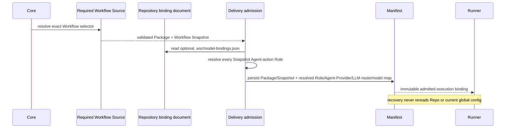

# Repository Role-to-Model Binding — 设计候选

> **状态：** Iteration 5 contract-change 候选，2026-08-28。只有对应的 Workflow DSL、Delivery Manifest、Observation 与 Evidence Query revision 分别通过 lifecycle gate 后，本文才 supersede Iteration 3 Execution 设计中的单模型部分。英文 [`repository-role-model-binding.md`](repository-role-model-binding.md) 是规范候选，本文是中文 tracking companion。

## 1. 决策

Repository 是 model policy 的最小 scope。一个 Execution installation 恰好选择一个 Agent Provider identity。Repository 可把 Workflow Role identity 绑定到该 Agent Provider 理解的 exact model selection。对于 DSH，一个 selection 是 closed pair `{provider, model}`：已注册 DSH LLM-route identity 与该 route 下的 model identity。某个 Role 没有 repo binding 时使用 Execution installation 的全局默认 model selection。Repository data 绝不选择或改变 Agent Provider，也不配置 LLM route：

```text
effective_model_selection(role) = repository.bindings[role] ?? execution.default_model_selection
```

首版明确不支持按 Workflow、Route、Action、Agent definition、branch selector、Task、Delivery 或 user override。Admission 从 selected canonical worktree 读取 policy file 并冻结该 content snapshot；不同 worktree 可含不同 bytes，但没有 branch matcher 或 post-admission rebinding。同一 admitted worktree policy 中，一个 Role 在所有 Route/Action 上使用同一个 physical model。

## 2. Agent 模型

- **Role** 拥有稳定职责、authority、prohibition、write custody 与 exact Role prompt。
- **Agent identity** 是 exact Role snapshot、Agent Provider identity 与 exact LLM provider-route/model identity 在 admission 后的组合。
- **Agent execution binding** 再加 selected Route 的 Action prompt、Skills、tools、Driver、access intent 与 session policy。
- **Agent Provider** 拥有 provider-native config、endpoint、authentication、credential 与 native session；这些不是 WSR config 或 Manifest 字段。

独立 authored generic `agent-definition` resource 不进入新模型。它重复了 Role/Route 的职责，而当前 production projector 也没有消费其 bytes。Workflow DSL `1.1.0` 保持历史 resolving；删除 required resource 必须走 `2.0.0` Contract lifecycle。

`agent.md` 不是把 model ID 拼进 Markdown 得到的 portable authority object。Provider/Driver 需要原生 agent document 时，由 Driver 从 admitted Role prompt 投影；model binding 保持独立结构化数据。

## 3. Repository document

约定路径是 `<canonical-worktree>/.wsr/model-bindings.json`。文件不存在是合法状态，表示所有 Role 使用 Execution default。文件存在时采用 closed versioned shape：

```json
{
  "schemaVersion": "execution.repository-model-bindings@1.0.0",
  "bindings": {
    "role.architecture-reviewer": {"provider": "deepseek-official", "model": "deepseek-reasoner"},
    "role.evidence-scout": {"provider": "deepseek-official", "model": "deepseek-chat"}
  }
}
```

- UTF-8 file 最大 64 KiB，`bindings` 最多 1,024 个 member，允许一个 repository policy 覆盖多个 bounded Workflow；
- Role key 以及 `provider`/`model` value 都匹配 `^[A-Za-z][A-Za-z0-9._-]{0,127}$`；key 是 exact Workflow Role identity，`provider` 是唯一 installed Agent Provider 已注册的 exact LLM route，`model` 在该 route 内 exact；
- empty map 合法，等价于全部 fallback；
- unknown field、duplicate JSON member、malformed identity、逃逸 canonical worktree 的 symlink、不可读文件或 unknown revision 使 Delivery admission fail；
- 当前 Workflow 不包含的 Role binding 可保留，但不进入该 Delivery Manifest，从而支持一个 repo policy 覆盖多个 Workflow；
- 每个 binding value 恰含 `provider` 与 `model`；不允许 secret、credential reference、endpoint、LLM-route config、Agent Provider selector、alias 或 fallback chain。

Canonical JSON/`canonical_digest` 严格使用 Workflow DSL 1.1 §3.1：parsed JSON、UTF-16 code-unit object-key order、ECMAScript `JSON.stringify` scalar serialization、无 whitespace，再计算 `"sha256:" + lowercase_hex(SHA-256(UTF-8(bytes)))`。Repository document digest 是包含 `schemaVersion` 的 `canonical_digest(full_document)`，不额外 prepend coordinate framing。文件 absence 显式记为 `ABSENT`，不能伪造 empty document digest。

Resolved binding array 按 `roleId` bytewise sort；每项恰含 `roleId`、`rolePromptIdentity`、`rolePromptDigest`、`agentProviderId`、`modelProviderId`、`modelId` 与 `resolutionSource`。`resolvedMapDigest = canonical_digest(resolved_binding_array)`，因此覆盖 Agent Provider、exact LLM route/model pair 与 fallback source。Map 包含 exact Workflow Snapshot 中全部 distinct Agent-action Role，不含 Runtime-only deterministic Action。

## 4. Admission 与 recovery

读取发生在 exact Workflow Package validation 之后、Delivery Manifest persist 之前：



对 exact Workflow Snapshot 中每个 distinct Agent-action Role，admission 冻结：Role identity、Role-prompt identity/content identity、Agent Provider identity、exact LLM provider-route/model identity、`REPOSITORY|EXECUTION_DEFAULT` 来源、repo document state/digest，以及 resolved map canonical identity。

repo 文件或 Execution default 的变化只影响后续 Delivery。Recovery 以 persisted Manifest 作为 binding authority，不能重新绑定既有 Delivery。Current DSH-owned profile/settings 可为 frozen Agent Provider 与 LLM-route identities 提供 credential/connectivity；DSH-E capability missing/incompatible 时显式 recovery fail，绝不 fallback/rebind。Execution 绝不加载这些 Provider files。

## 5. Delivery Manifest

下一版 Manifest 必须绑定 exact Workflow Package name/version/digest/Workflow identity、Workflow Snapshot identity/digest、repo document state/digest、全部 Snapshot Agent-action Roles 的 resolved Role/Agent-Provider/LLM-route/model entries，以及既有 Task/Delivery/prompt/worktree/control bindings。

Manifest 排除 Provider credential、credential reference、endpoint config、mutable source config，以及约定相对配置身份以外的 repo file path。Delivery binding digest 覆盖全部新字段。

## 6. Observation 与 metric

C30 继续记录 exact Role，C57 继续记录 provider-scoped canonical model；`gen_ai.provider.name` 与 C06 完成 operational tuple。不存在新的 model-assignment Event：Manifest 是 admitted config，model-call Span 是 actual use。

Role/Model metric 使用实际 C30/C57；role-template metric 通过 Manifest-bound Workflow Snapshot 解析 Role prompt 与 Route resources。

## 7. Failure semantics

| 条件 | 结果 |
| --- | --- |
| repo 文件不存在 | 全部 Role 使用 Execution default |
| repo map 没有某 Role | 该 Role 使用 Execution default |
| default model selection missing/malformed | configuration startup fail |
| repo document malformed/unsupported | Manifest 前 Delivery admission fail |
| model selection coordinate malformed/empty | Runner effect 前 admission fail |
| configured capability 的 Agent Provider identity 不同 | Runner effect 前 admission fail |
| exact DSH LLM route/model 无法执行 | Provider 在首次真实调用时返回 typed runtime failure；admission 不发明 local catalog，也不做 network probe |
| Manifest 后 repo 文件变化 | 不影响 admitted Delivery |
| Manifest map 与 Snapshot Role 冲突 | recovery/admission fail closed |

## 8. 被 supersede 的方向

- 一个 global model 无条件应用到全部 Role；
- 首版按 Route 或 ordered matcher override；
- 重复 Role/Route config 的 generic Agent-definition resource；
- repo 拥有 Provider credential/endpoint/credential reference；
- recovery 重读 repo config；
- 通过 timestamp/arrival order 推断 admitted model assignment。
