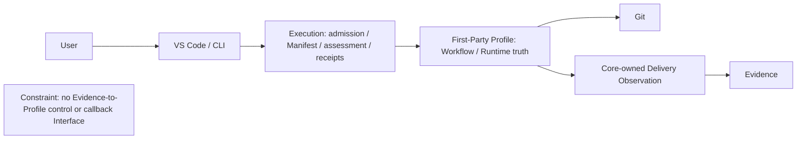
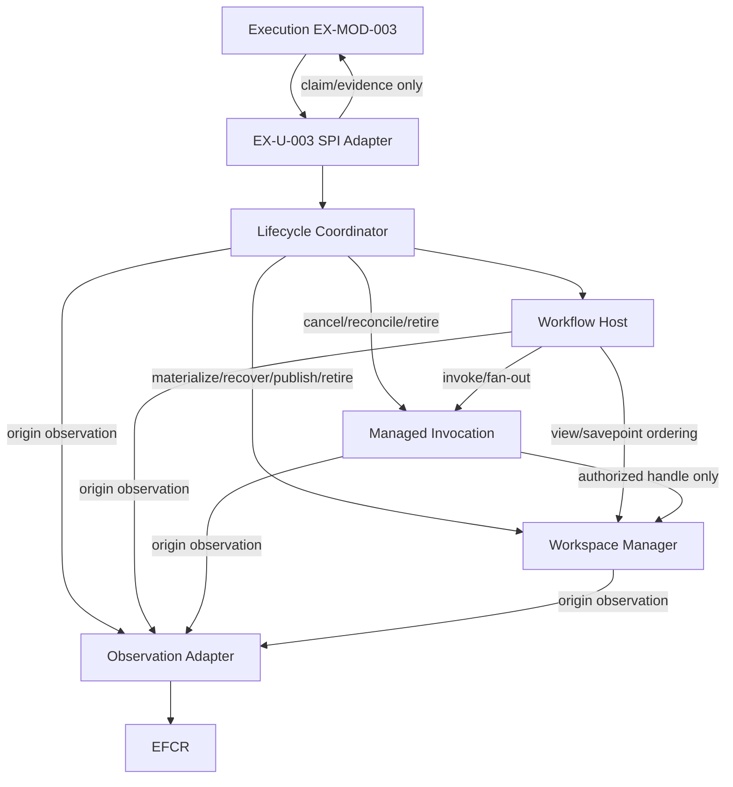
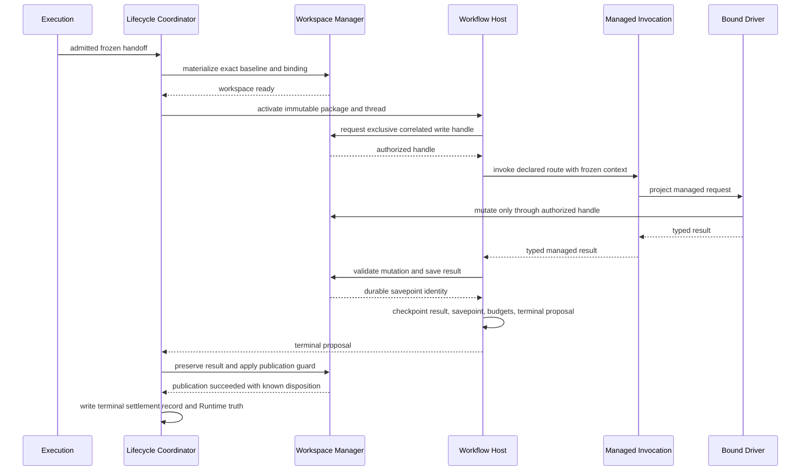
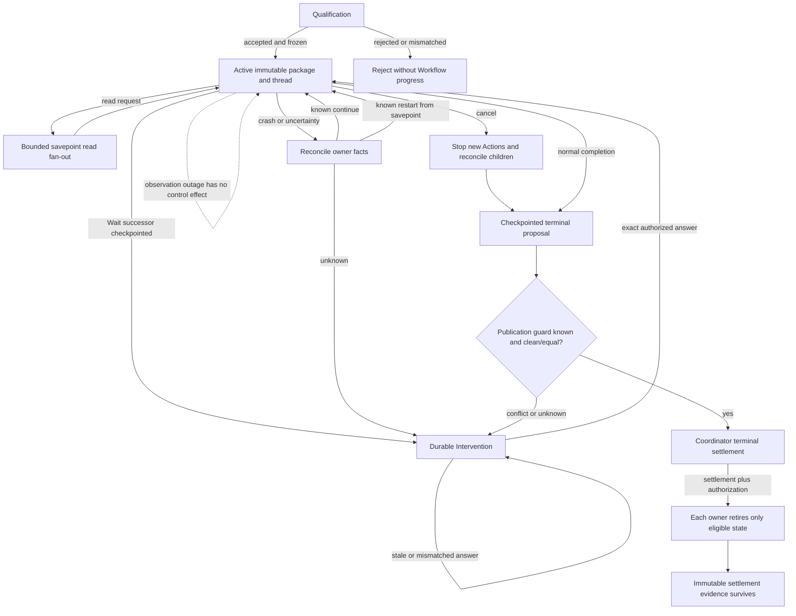

# First-Party LangGraph Runtime Profile System Design

> **Active support/navigation.** The target authorities are [Concept](../../agent-architecture.md), [Execution](../execution/project-execution-system.md), and [Evidence](../evidence/evidence-system.md); the Contract revision split — [Observation Catalog](../../contracts/observation/observation-catalog.md), [OTel Observation Profile](../../contracts/observation/otel-observation-profile.md), [Execution–Evidence Interaction Contract](../../contracts/execution-evidence/interaction-contract.md), and [Metric Catalog](../../contracts/evaluation/metric-catalog.md) — remains a draft and cannot prove physical conformance. If historical or operational prose below conflicts with those owners, the owners govern; legacy material is discoverable only as explicitly labeled legacy evidence.

## 1. Metadata and Authority

| Field | Value |
| --- | --- |
| Status | `PROFILE_DESIGN_READY_REBINDING_REQUIRED`; four legacy semantic Contract lines exist but are not active publications; both representation-binding Spikes remain feasibility evidence; physical and implementation conformance are unproven |
| Canonical language | English |
| Authority source snapshot | repository commit `a7684789958f556b4376e12f3b55f224804fabea`; exact authority paths are listed below |
| Workflow closure | confirmed problem/scenario Brief and Skeleton direction are incorporated; three-lens review, readability review, Fresh Reader, and deterministic document verification passed before session-artifact cleanup |
| Supersession lineage | replaces the prior content at this canonical path; repository history carries durable final-artifact lineage |
| Companion | [Chinese non-normative companion](first-party-langgraph-runtime-profile.zh-CN.md) |

### External-boundary rebinding (`runner.decision.013`)

This section is normative for this Profile's external boundary. The Concept and Execution/Evidence System Designs linked above govern product and System meaning. A product Host makes one Execution Core Delivery call; the Core invokes this Profile as an Adapter and owns Delivery lifecycle sequencing and outbound Delivery Observation. Coordinator→Host/Invocation/Workspace choreography shown below is private inside the runner Adapter, not a host-callable Core Interface. runner privately retains wait/resume, checkpoints, branch/workspace assignment and custody reacquisition; none becomes DSH or public Core resume semantics.

All EFCR/PCC, four-Contract, “published,” and `runner.open-work.003.*` statements below are frozen legacy profile evidence and downstream rebinding inputs only. They are not active authority, publication or conformance proof. The active target sends bounded facts through Core-owned Delivery Observation to Evidence; the Contract companion is still a draft. A implementation/conformance claim requires downstream schema, registry, fixtures and validation publication under `concept.obligation.001..004`.

Authority order is the [Concept](../../agent-architecture.md), then the [Execution System Design](../execution/project-execution-system.md) for the external/Core boundary, then this Profile for Adapter-private runner behavior. User-confirmed requirements are incorporated through those governing owners; deleted or legacy designs are historical evidence only and are not active authority. This document specifies intended private Profile behavior. Its only executed substrate evidence is the narrowly scoped, external spike evidence returned in §14; it makes no broader LangGraph, Codex, Copilot, SQLite, Git, performance, production, conformance, or fault-capability claim.

## 2. Design Context

Execution Core owns Delivery admission, Manifest/configuration identity, lifecycle sequencing, Adapter qualification, and outbound Observation. The Profile is an Adapter at the replaceable execution seam and owns its private Workflow execution and Runtime truth. Evidence owns admitted facts, factual projection, and presentation. Deployment is intended for trusted local dogfood, one active Execution instance per repository instance, short-lived workers, no daemon/port, serial writes, and bounded read fan-out. Workflow code is trusted; malicious-code isolation is not claimed.

## 3. Problem, Goals, and Scope

The design closes the previously delegated graph, checkpoint, Driver/session, workspace, publication, and recovery gap without restoring an Execution-owned universal Executor or leaking native identities. It requires exact qualification evidence, immutable package/thread activation, typed multi-Driver Actions, safe read/write concurrency, durable Intervention, semantic recovery/cancellation, guarded publication, non-controlling observations, owner-specific retirement, and no in-flight upgrade.

In scope are Profile evidence/preflight; package/graph/thread/checkpoint intent; managed invocation; workspace/savepoint/publication; lifecycle/recovery/retirement; observation mapping; ownership and future verification. Excluded are Execution/EFCR/Evidence authority, field Contracts, Installation & Update, Agent Server, proprietary engine, Builder/compiler, plugins, HA/distribution/multi-tenancy, parallel writes, exactly-once, cross-system transactions, unsafe Git automation, malicious isolation, and active migration. Infrastructure validation is external and non-blocking for this document workflow.

## 4. Design Drivers

| Driver | Consequence | Trace ID |
| --- | --- | --- |
| Independent qualification | Execution alone assesses; Profile supplies claims/evidence/native validation/preflight. | `runner.driver.001`; `runner.decision.011` |
| Immutable Delivery binding | One immutable package/private thread; injected checkpointer/SDK; no in-flight upgrade. | `runner.driver.002`; `runner.decision.002` |
| Typed static Drivers | Static Codex/Copilot Adapters return typed results without fallback. | `runner.driver.003`; `runner.decision.005` |
| Serialized workspace safety | Host orders workspace context; Workspace uniquely mutates; writes serialize and publication is guarded. | `runner.driver.004`; `runner.decision.006` |
| Durable control truth | Wait, cancellation, and terminal truth are durable Runtime state, never receipt/process/free text. | `runner.driver.005` |
| Semantic recovery | Recovery is `continue | restart-from-savepoint | intervene`; uncertainty is explicit. | `runner.driver.006`; `runner.decision.007` |
| Owner-scoped retirement | Each owner retires only its family after authorization. | `runner.driver.007`; `runner.decision.008` |
| Non-controlling observation | Bounded observations are one-way and non-controlling. | `runner.driver.008`; `runner.decision.009` |
| Local operational fit | Embedded/local/short-worker direction minimizes intended operations; values are deferred. | `runner.driver.009` |
| Minimal deep structure | Four deep Modules, private native IDs, unique writers/retirers, and acyclic callers. | `runner.driver.010` |

Categorical Fitness Thresholds are legal successors only, fail closed/no fallback, one modifier, mutation-invalidated reads, correlated resume, no blind replay, guarded publication, non-controlling EFCR, and authorized retirement. They are requirements, not executed evidence.

## 5. Problem Decomposition

Four distinct change/failure/state axes are sufficient: Delivery lifecycle/terminal arbitration; package/graph semantics; heterogeneous managed invocation; and workspace/publication. Observation, tools, credentials, checkpoint/Journal storage, cache, and each Driver remain internal seams/Adapters because separate top-level Modules would be shallow or speculative. Removing any selected Module redistributes substantial policy across callers; merging them combines unrelated graph, CLI, Git, and lifecycle failures.

## 6. System Structure

| Module | Responsibility | Unique writer/retirer | Trace IDs |
| --- | --- | --- | --- |
| Profile Lifecycle Coordinator | Profile evidence/preflight; activate/resume/cancel/reconcile/recover/settle/retire orchestration | lifecycle working state and the immutable terminal settlement record; retires only eligible working state | `runner.module.001`; `runner.interface.001`; `runner-TERMINAL-SETTLEMENT-RECORD-001` |
| LangGraph Workflow Host | exact package, injected graph compile/advance, closed transitions, Wait/checkpoint/proposal | package execution cache and Workflow/checkpoint/thread state | `runner.module.002`; `runner.interface.002` |
| Managed Agent Invocation | frozen route projection, static Drivers, sessions/tools/credentials, typed results, fan-out/control | session references and Invocation Journal | `runner.module.003`; `runner.interface.003` |
| Workspace and Publication Manager | baseline/views/writes/savepoints/restore/result/guarded publication | workspace, views, savepoints, result/publication | `runner.module.004`; `runner.interface.004` |

The Runtime-observation Adapter is thin and owns no domain truth (`runner.interface.005`).

The acyclic direction below constrains cross-Module invocation only: Coordinator invokes Host, Invocation, and Workspace; Host invokes Invocation and Workspace; Invocation invokes Workspace only through an authorized handle. A result or return shown with `←` in §7 completes its originating call and creates neither a reverse invocation nor a reverse dependency.

## 7. Collaboration and End-to-End Flows

Read this section like a protocol: first follow the successful path without exceptions, then consult the independent scenario sections for branch behavior. Solid arrows in the sequence diagram are invocations; dashed arrows are returns on the originating Interface and do not create reverse dependencies.

### Successful core flow

**1. Admit and activate.** Execution admits and freezes the Delivery. The Coordinator asks the Workspace Manager to materialize the exact baseline and binding, then asks the Workflow Host to activate one immutable package and one private correlated thread. The Coordinator owns lifecycle disposition, Workspace owns materialization state, and Host owns package/thread/checkpoint state.

**2. Invoke and mutate.** Host selects the declared route for the final state-changing Action, obtains one exclusive write handle correlated with the current checkpoint/savepoint, and calls Managed Invocation with frozen resources and admitted authority. Invocation journals dispatch and projects to the statically bound Driver. The Driver mutates through that handle, Workspace remains the sole source-state writer, and a typed managed result returns to Host.

**3. Make the terminal proposal durable.** Host asks Workspace to validate the mutation and write the Action-result savepoint. The durable savepoint identity returns first. Host then commits one Workflow checkpoint containing the result, savepoint identity, budgets, and selected terminal successor as a terminal proposal.

**4. Publish and settle.** The checkpointed terminal proposal returns to Coordinator. Coordinator validates terminal obligations and asks Workspace to preserve the result and apply the clean/equal-target publication guard. Workspace publishes successfully and returns the known disposition. Coordinator then writes the immutable terminal settlement record and Runtime terminal truth.

### State and exception routes

#### Qualification failure and in-flight version changes

The Profile supplies claims, evidence, native validation, and preflight; Execution alone writes CapabilityAssessment. Rejected or mismatched qualification creates no Workflow progress. An admitted Delivery keeps its exact package, implementation, Profile version, and private thread for its lifetime; a later version applies only to a later Delivery. Same identity with different content fails closed.

#### Action or durability failure

Workspace rejects a mismatched or non-exclusive handle. Invocation owns dispatch, attempt, and invalid or unknown result facts; unmanaged bypass and fallback stop advancement. Workspace owns mutation validation and savepoint failure. Host owns checkpoint, illegal-transition, and proposal failure. Coordinator owns lifecycle, obligation, and terminal unknown, while Workspace owns publication unknown. Every such failure fabricates neither another owner's state nor Workflow progress; uncertainty becomes Intervention when no safe declared successor applies.

#### Bounded read fan-out

Host requests one stable savepoint and a bounded read-view set. Invocation consumes only those handles, Workspace rejects mutation through read views, and Host aggregates deterministically. Any source mutation invalidates the affected read result; one modifier and serial writes remain mandatory.

#### Wait and resume

Host first checkpoints a legal Wait successor. The resulting return lets Coordinator persist the correlated Intervention and exit state. Resume enters through the SPI Adapter; Coordinator calls Host only after the exact authorized pending answer is validated. A stale or mismatched control has no effect, and Host resumes the same thread.

#### Crash recovery

Coordinator calls Host, Invocation, and Workspace to obtain their bounded authoritative facts. It chooses only known continuation, known restore/restart from savepoint, or Intervention for uncertainty; it never blindly replays. Each responding owner owns its fact or failure, while Coordinator owns the recovery classification and lifecycle decision.

#### Cancellation

Coordinator stops new Actions, asks Invocation to cancel children, retains unknown partial-attempt facts, then calls Host and Workspace to reconcile their state. Host checkpoints and applies only the declared cancellation successor. Coordinator alone arbitrates terminal truth; a receipt or process exit cannot do so.

#### Publication conflict

After a checkpointed terminal proposal, Coordinator validates obligations and calls Workspace. Workspace preserves the result before evaluating the target guard. A clean or equal target yields a known disposition; conflict or unknown publication becomes Intervention and never fabricates success.

#### Observation outage

Each origin Module emits a bounded, minimized, provenance-preserving observation through the thin Adapter. Delivery failure or EFCR outage returns only non-owning delivery status to the origin and cannot block, advance, cancel, recover, publish, or settle Workflow state.

#### Retirement

Only settlement plus explicit authorization starts durable retirement. Coordinator calls Host, Invocation, and Workspace; each owner retires only its eligible family and returns a disposition. Coordinator records and retries partial progress, then retires only eligible lifecycle working state. Authorization, the immutable terminal settlement record, result/publication references, per-owner dispositions, and audit correlation survive.

### Compact flow and view traceability

| Reader-facing concern | Scenario IDs | Main Flow ID | Step IDs | View / Action IDs | Interface IDs |
| --- | --- | --- | --- | --- | --- |
| Authority and qualification | `runner.scenario.01` | `runner.flow.001` | — | `runner.view.001` | `runner.interface.001` |
| Module dependency direction | — | — | — | `runner.view.002` | `runner.interface.001`, `runner.interface.002`, `runner.interface.003`, `runner.interface.004`, `runner.interface.005` |
| Activation and version binding | `runner.scenario.02`, `runner.scenario.12` | `runner.flow.002` | `runner.flow.002.1`, `runner.flow.002.2`, `runner.flow.002.3` | `runner.view.003` | `runner.interface.001`, `runner.interface.004`, `runner.interface.002` |
| Managed invocation, mutation, and durability | `runner.scenario.03`, `runner.scenario.04` | `runner.flow.003` | — | `runner.view.011`, `runner.view.004` | `runner.interface.004`, `runner.interface.003`, `runner.interface.002` |
| Read fan-out | `runner.scenario.05` | `runner.flow.004` | — | `runner.view.005` | `runner.interface.004`, `runner.interface.003` |
| Wait and Intervention | `runner.scenario.06` | `runner.flow.005` | `runner.flow.005.1`, `runner.flow.005.2`, `runner.flow.005.3` | `runner.view.006` | `runner.interface.001`, `runner.interface.002` |
| Crash recovery | `runner.scenario.07` | `runner.flow.006` | `runner.flow.006.1`, `runner.flow.006.2` | `runner.view.007` | `runner.interface.002`, `runner.interface.003`, `runner.interface.004` |
| Cancellation | `runner.scenario.08` | `runner.flow.007` | `runner.flow.007.1`, `runner.flow.007.2`, `runner.flow.007.3` | `runner.view.008` | `runner.interface.001`, `runner.interface.003`, `runner.interface.002`, `runner.interface.004` |
| Publication and settlement | `runner.scenario.09` | `runner.flow.008` | `runner.flow.008.1`, `runner.flow.008.2`, `runner.flow.008.3` | `runner.view.009` | `runner.interface.002`, `runner.interface.004` |
| Observation outage | `runner.scenario.10` | `runner.flow.009` | — | — | `runner.interface.005` |
| Retirement | `runner.scenario.11` | `runner.flow.010` | `runner.flow.010.1`, `runner.flow.010.2`, `runner.flow.010.3`, `runner.flow.010.4` | `runner.view.010` | `runner.interface.001`, `runner.interface.002`, `runner.interface.003`, `runner.interface.004` |

## 8. Data, State, Identity, and Ownership

Manifest/assessment/receipts are Execution-owned; Profile claims are evidence only. Host owns Workflow/checkpoint/thread/Wait/proposal; Coordinator owns lifecycle/Intervention/recovery working state and the immutable terminal settlement record; Invocation owns sessions/Journal; Workspace owns worktrees/views/savepoints/result/publication; Git owns commit/tree truth; EFCR/Evidence own downstream truth. SQLite may physically co-locate Host and Journal data but never merges writers or retirement.

Stable Delivery, Workflow/Contract, implementation, Profile/version, Snapshot, Action/Role/route, resource, Artifact, Intervention, and control IDs cross seams. LangGraph and Driver IDs remain private. Ordering is assessment → admission/freeze → handoff → workspace/package activation; the Workspace savepoint becomes durable before the Host checkpoint, and that checkpoint precedes durable Workflow progress and graph advancement; Host context precedes Invocation; proposal precedes publication; settlement/authorization precedes retirement. Same identity/different content fails closed. One modifier is allowed; reads are bounded and based on one savepoint.

Ephemeral cleanup is independent of durable retirement. Invocation promptly terminates child processes and releases action-scoped authentication at Action/worker end, failure, cancellation, or Intervention; Workspace promptly removes disposable read views. Each owner records bounded redacted cleanup failure for reconciliation. Host checkpoints, Invocation Journal/session recovery references, canonical workspace/savepoints/results, and Coordinator recovery/terminal records remain until settlement plus explicit authorization. Coordinator then retires its eligible lifecycle/worker/control/Intervention working details itself; immutable authorization, terminal settlement, retirement dispositions, result/publication references, and audit correlation survive.

Coordinator-retireable working state is limited to completed worker-attempt bookkeeping, reconciled transient control correlations, resolved Intervention working payloads, recovery scratch/classification state, and completed retirement retry scheduling. `runner-TERMINAL-SETTLEMENT-RECORD-001` is never deleted by this retirement. It remains the Runtime-authoritative evidence and minimally contains Delivery identity; Manifest, Profile/version, Workflow/Contract, implementation and Package Snapshot identities; terminal outcome and reason; terminal checkpoint and result/savepoint references; publication disposition/reference; retirement-authorization identity; per-owner retirement dispositions; and stable audit correlation. A later separately authorized product-retention policy may govern this immutable record, but `runner.flow.010` does not.

## 9. Interfaces, Dependencies, Seams, and Adapters

The Execution SPI-facing interface never assesses admission (`runner.interface.001`). The Workflow Host interface is called by Coordinator and hides package/thread/checkpoint semantics (`runner.interface.002`). The Managed Invocation interface is called by Host for invoke/fan-out and by Coordinator only for cancel/reconcile/retire; it never selects routes (`runner.interface.003`). The Workspace interface is called by Coordinator for lifecycle, Host for ordering, and Invocation only for authorized handle use; it hides Git state (`runner.interface.004`). The observation interface emits only bounded non-controlling observations (`runner.interface.005`).

These caller rules govern invocation and remain acyclic. Typed results, savepoint identities, proposals, and publication dispositions return on the originating Interface to its caller; such returns do not authorize the callee to invoke the caller or create a reverse dependency.

All reject mismatched identity/authority/state and expose explicit unknown rather than fabricate outcomes. Proposed current cross-owner fields/errors/version rules are tracked by the unpublished Contract draft and `concept.obligation.001`; historical four-Contract wording under `runner.open-work.003` remains quarantined legacy evidence only. The implementation workflow owns exact internal `runner.interface.002/003/004` shapes under `runner.open-work.012` and measured timeout/capacity defaults under `runner.open-work.011`. Driver and Execution/EFCR seams are real Adapter seams. Store, cache, tools and credentials remain internal seams unless actual variation justifies exposure.

Observation is caller-complete: Host, Invocation, Workspace, and Coordinator each call `runner.interface.005` with a bounded observation whose provenance identifies the originating Module and stable agent-ops correlation. The origin Module remains fact owner; the Adapter validates/minimizes/maps but never rewrites provenance, dereferences native content, or acquires control. Native identifiers and prohibited content remain behind the origin. Adapter delivery status returns only to the originating caller (and may be summarized by Coordinator as non-owning lifecycle visibility); EFCR never calls back. The cross-Runtime semantic ingress is `runner.open-work.003.4` / `EX-U-004`; the runner-specific fact-to-observation mapping and fixtures are implementation handoff item `runner.open-work.013`.

`runner.open-work.007` completes a representation-binding feasibility experiment for the quarantined legacy `.4` semantic line and informs the draft: required Canonical Evidence is eligible only for a dedicated unsampled/non-trace-based OTel Event or Log path; Trace, Span, and Metric carriers remain `DIAGNOSTIC_TELEMETRY` because sampling or aggregation may discard fact occurrences. This result neither publishes the Contract nor proves conformance; a implementation remains `CROSS_IMPLEMENTATION_CONFORMANCE_UNPROVEN` until the physical Contract is published and its OTLP/Collector-to-EFCR corpus passes.

## 10. Failure, Recovery, and System-wide Behavior

Graph failures cannot fabricate progress; Driver exit cannot fabricate a result; Git conflicts preserve result; stale controls have no effect; EFCR outage cannot control Runtime; partial retirement remains visible. Retry is allowed only when the owning semantic identity/content rule makes it safe. No generic rollback spans graph/process/filesystem/Git. Cancellation converges through child control, bounded reconciliation, Workflow successor and Coordinator terminal truth. Recovery uses owner facts and may safely choose Intervention. The implementation workflow must close the executable fault corpus in `runner.open-work.009` before claiming the affected acceptance outcomes.

Managed Agent Invocation owns credentials (`runner.module.003`): after route/authority validation it requests the least action/Driver-scoped credential from an internal provider and injects it only at the Driver Adapter seam. Secret material never enters checkpoint, Journal, observation/Evidence, workspace, or other durable content. Release/revocation runs on normal return, failure/crash reconciliation, cancellation, Intervention, and worker end without waiting for Delivery retirement. Cleanup uncertainty remains a bounded redacted Invocation fact. The external obligation vocabulary comes from `runner.open-work.003.1` and `runner.open-work.003.3`; executable proof and supported-substrate evidence are implementation items `runner.open-work.008` and `runner.open-work.010`.

Managed SDK use is a fail-closed qualification/conformance invariant. Package/conformance publishers declare it, Execution `EX-MOD-003` assesses it, and Host/Invocation enforce the admitted path. A package/route that bypasses or cannot prove exclusive managed projection is rejected; detected runtime bypass stops advancement and routes failure/Intervention, with managed recovery/cancellation/privacy/evidence guarantees unavailable. Owner acceptance is `runner.acceptance.003`, `runner.acceptance.007`, and `runner.acceptance.008`; its proposed Contract basis remains unpublished under `concept.obligation.001`, while executable evidence remains `IMPLEMENTATION_PLAN` under `runner.open-work.008` and `runner.open-work.009`.

## 11. Quality Attribute Realization

| Quality | Mechanism | Trade-off / evidence lifecycle |
| --- | --- | --- |
| Reliability/recovery | durable state, semantic recovery, Intervention, guarded settlement | may require human input; implementation evidence `runner.open-work.009` |
| Consistency/concurrency | immutable Snapshot, unique writers, serial writes, stable views, owner retirement | lower throughput; implementation evidence `runner.open-work.009` and tuning `runner.open-work.011` |
| Security/privacy | authority split, frozen resources, ephemeral credentials, private IDs, minimized observations | trusted-code residual risk; Contracts `runner.open-work.003.1`, `runner.open-work.003.3`, `runner.open-work.003.4`; evidence `runner.open-work.008`, `runner.open-work.009`, `runner.open-work.013` |
| Observability/operability | thin Adapter, non-controlling outage, and Canonical Evidence restricted to eligible Event/Log paths | less raw diagnosis; candidate SDK evidence `runner.open-work.007`; Contract `runner.open-work.003.4`; mapping/tuning `runner.open-work.011`, `runner.open-work.013` |
| Maintainability | four deep Modules and acyclic caller graph | disciplined Contracts required |
| Compatibility | exact binding and typed mismatch; no migration/fallback | Contracts `runner.open-work.003.1`, `runner.open-work.003.2`, `runner.open-work.003.3`; implementation evidence `runner.open-work.008`, `runner.open-work.010` |
| Performance/capacity/cost | intended short workers, local persistence, bounded fan-out | all numeric proof deferred to `runner.open-work.011` |

HA, distributed scale, multi-tenancy, and malicious isolation are not applicable to the confirmed local trusted MVP and require new authority.

## 12. Risks and Trade-offs

Driver incompatibility (`runner.open-work.008`, `runner.open-work.010`), local checkpoint/recovery failure (`runner.open-work.009`, `runner.open-work.010`), crash ambiguity (`runner.open-work.009`), trusted SDK bypass, SQLite writer conflation (`runner.open-work.009`, `runner.open-work.011`), Git mutation/publication conflict (`runner.open-work.009`, `runner.open-work.010`), native-ID/content leakage (`runner.open-work.003.2`, `runner.open-work.003.3`, `runner.open-work.003.4`, `runner.open-work.013`), OTel Logs-JS version instability, Metric-cardinality pressure, trace/span sampling loss (`runner.open-work.007`), and partial retirement (`runner.open-work.009`, `runner.open-work.011`) remain visible. Their owners must reopen the Brief/design if evidence disproves the managed-action seam, local recovery, writer separation, safe Git direction, evidence minimization, eligible Canonical Evidence carrier path, or owner retirement. Accepted trade-offs favor local over HA, semantic recovery over exactly-once, static integration over plugins, write safety over throughput, Intervention over unsafe automation, and recoverability over automatic cleanup.

## 13. Acceptance and Verification

`runner.decision.014` is the bilingual structure, stable-ID, diagram/prose parity, independent-review, Fresh Reader, and deterministic-document-check mechanism. `runner.decision.015` is the scope-qualified non-proof and exact routing mechanism that separates external Contract gaps from implementation-owned handoff work without losing either.

| Acceptance identity | problem_or_goal_ids | scenario_ids | drivers; decisions/mechanisms | Outcome / threshold | Method; evidence_state; evidence_reference | Owner; return / reopen |
| --- | --- | --- | --- | --- | --- | --- |
| `runner.acceptance.013` | `problem`, `acceptance` | `runner.scenario.01`, `runner.scenario.02`, `runner.scenario.03`, `runner.scenario.04`, `runner.scenario.05`, `runner.scenario.06`, `runner.scenario.07`, `runner.scenario.08`, `runner.scenario.09`, `runner.scenario.10`, `runner.scenario.11`, `runner.scenario.12` | `runner.driver.010`, `runner.decision.014` | coherent bilingual structure and stable-ID parity | independent reviews and final document checks; `DESIGN_EVIDENCE_AVAILABLE`; this Design §§1–15 and its companion | System Design workflow owner; return `runner.acceptance.013`; reopen on material ambiguity |
| `runner.acceptance.014` | `scope`, `open`, `acceptance` | `runner.scenario.01`, `runner.scenario.02`, `runner.scenario.03`, `runner.scenario.04`, `runner.scenario.05`, `runner.scenario.06`, `runner.scenario.07`, `runner.scenario.08`, `runner.scenario.09`, `runner.scenario.10`, `runner.scenario.11`, `runner.scenario.12` | `runner.decision.012`, `runner.decision.015` | no unsupported infrastructure proof claim and complete Contract/handoff routing | ledger audit; `DESIGN_EVIDENCE_AVAILABLE`; this Design §§1, 3, and 13–15, `runner.open-work.003.1`–`.4`, `runner.open-work.006/002`, and `runner.open-work.008`–`006` | System Designer; return `runner.acceptance.014`; reopen on missing or misclaimed evidence |
| `runner.acceptance.001` | `problem`, `constraints` | `runner.scenario.01` | `runner.driver.001`, `runner.decision.011`, `runner.flow.001` | Execution sole assessor; fail closed | authority review; `DESIGN_EVIDENCE_AVAILABLE`; authority sources and this Design §§1, 7, and 13 | Runtime conformance owner; return `runner.open-work.003.3`, `runner.interface.001`, `runner.acceptance.001`; reopen on self-assessment |
| `runner.acceptance.002` | `problem`, `constraints` | `runner.scenario.02` | `runner.driver.002`, `runner.decision.002`, `runner.flow.002` | exact package/thread; no fabricated progress | graph tests; `IMPLEMENTATION_PLAN`; `runner.open-work.003.1`, `runner.open-work.003.2`, `runner.open-work.009`, `runner.open-work.010`, `runner.open-work.012` | `runner.module.002` owner; return `runner.interface.002`, `runner.acceptance.002`, `runner.open-work.009`; reopen if premise fails |
| `runner.acceptance.003` | `problem`, `risks` | `runner.scenario.03` | `runner.driver.003`, `runner.decision.004`, `runner.decision.005`, `runner.flow.003` | typed managed result; bypass rejected | Driver tests; `IMPLEMENTATION_PLAN`; `runner.open-work.003.1`, `runner.open-work.003.3`, `runner.open-work.008`, `runner.open-work.012` | `runner.module.003` owner; return `runner.interface.003`, `runner.acceptance.003`, `runner.open-work.008`; reopen on seam failure |
| `runner.acceptance.004` | `problem`, `risks` | `runner.scenario.04` | `runner.driver.003`, `runner.decision.005` | both sources; no fallback | multi-Driver tests; `IMPLEMENTATION_PLAN`; `runner.open-work.008`, `runner.open-work.010`, `runner.open-work.012` | `runner.module.003` owner; return `runner.interface.003`, `runner.acceptance.004`, `runner.open-work.008`; reopen if required source fails |
| `runner.acceptance.005` | `problem`, `quality` | `runner.scenario.05` | `runner.driver.004`, `runner.decision.006`, `runner.flow.004` | bounded stable reads; mutation invalidates | real-Git tests; `IMPLEMENTATION_PLAN`; `runner.open-work.009`, `runner.open-work.011`, `runner.open-work.012` | `runner.module.004` owner; return `runner.interface.004`, `runner.acceptance.005`, `runner.open-work.009`; reopen on isolation failure |
| `runner.acceptance.006` | `problem`, `constraints` | `runner.scenario.06` | `runner.driver.005`, `runner.decision.004`, `runner.decision.008`, `runner.flow.005` | correlated resume; stale rejected | control tests; `IMPLEMENTATION_PLAN`; `runner.open-work.003.1`, `runner.open-work.003.3`, `runner.open-work.009`, `runner.open-work.012` | `runner.module.002` owner; return `runner.interface.002`, `runner.acceptance.006`, `runner.open-work.009`; reopen on unsafe resume |
| `runner.acceptance.007` | `problem`, `risks` | `runner.scenario.07` | `runner.driver.006`, `runner.decision.007`, `runner.flow.006` | continue, restart, or intervene; no blind replay | fault tests; `IMPLEMENTATION_PLAN`; `runner.open-work.003.1`, `runner.open-work.003.3`, `runner.open-work.008`, `runner.open-work.009`, `runner.open-work.012` | `runner.module.001` owner; return `runner.interface.001`, `runner.acceptance.007`, `runner.open-work.009`; reopen if ambiguity is uncontained |
| `runner.acceptance.008` | `problem`, `quality` | `runner.scenario.08` | `runner.driver.005`, `runner.decision.007`, `runner.decision.008`, `runner.flow.007` | cancellation converges; receipt not terminal | cancellation tests; `IMPLEMENTATION_PLAN`; `runner.open-work.003.1`, `runner.open-work.003.3`, `runner.open-work.008`, `runner.open-work.009`, `runner.open-work.012` | `runner.module.001` owner; return `runner.interface.001`, `runner.acceptance.008`, `runner.open-work.009`; reopen on fabricated outcome |
| `runner.acceptance.009` | `problem`, `constraints` | `runner.scenario.09` | `runner.driver.004`, `runner.driver.007`, `runner.decision.006`, `runner.flow.008` | result preserved; publication guarded | real-Git tests; `IMPLEMENTATION_PLAN`; `runner.open-work.003.2`, `runner.open-work.009`, `runner.open-work.010`, `runner.open-work.012` | `runner.module.004` owner; return `runner.interface.004`, `runner.acceptance.009`, `runner.open-work.009`; reopen on unsafe publication |
| `runner.acceptance.010` | `problem`, `quality` | `runner.scenario.10` | `runner.driver.008`, `runner.decision.009`, `runner.flow.009` | provenance preserved; outage non-controlling | carrier feasibility tests plus implementation mapping tests; `DESIGN_EVIDENCE_AVAILABLE`; `runner.open-work.007`, `runner.open-work.003.4`, `runner.open-work.011`, `runner.open-work.013`; physical conformance remains unproven | `runner.interface.005` owner; return `runner.interface.005`, `runner.acceptance.010`, `runner.open-work.013`; reopen on control, leakage, or no eligible Canonical Evidence route |
| `runner.acceptance.011` | `problem`, `acceptance` | `runner.scenario.11` | `runner.driver.007`, `runner.decision.008`, `runner.flow.010` | prompt cleanup; authorized retirement; settlement evidence survives | lifecycle tests; `IMPLEMENTATION_PLAN`; `runner.open-work.009`, `runner.open-work.011`, `runner.open-work.012` | `runner.module.001` owner; return `runner.interface.001`, `runner.acceptance.011`, `runner.open-work.009`; reopen on premature loss |
| `runner.acceptance.012` | `problem`, `constraints` | `runner.scenario.12` | `runner.driver.002`, `runner.decision.002` | later Deliveries only | compatibility tests; `IMPLEMENTATION_PLAN`; `runner.open-work.003.1`, `runner.open-work.003.2`, `runner.open-work.003.3`, `runner.open-work.010` | Runtime conformance owner; return `runner.acceptance.012`, `runner.open-work.010`; reopen on in-flight substitution |

Scope-qualified `PROFILE_DESIGN_READY_REBINDING_REQUIRED` means the reviewed documents are ready to guide implementation. The two representation-binding spikes prove only the §14 candidate mechanisms on their recorded environments; they do not select the runner production substrate or establish cross-implementation conformance.

## 14. Decisions, Open Work, and Rejected Alternatives

### Decision register

| Decision | Exact decision statement | Trace ID |
| --- | --- | --- |
| Embedded local runtime | Use intended embedded LangGraph JS in short-lived workers; do not introduce Agent Server, a daemon, or a port. | `runner.decision.001` |
| Immutable Delivery binding | Bind one immutable package and one private correlated thread per Delivery; inject Profile-owned checkpointer/SDK dependencies; never upgrade in flight. | `runner.decision.002` |
| Four-module structure | Use exactly four deep Modules with the acyclic invocation direction in §6. | `runner.decision.003` |
| Workflow policy ownership | Workflow Host alone owns legal route, budget, successor, Wait, and terminal-proposal semantics. | `runner.decision.004` |
| Static managed Drivers | Use static Codex and Copilot Driver Adapters behind typed managed invocation; reject fallback and unmanaged bypass. | `runner.decision.005` |
| Serialized workspace mutation | Host orders workspace context, Workspace alone mutates Git, Invocation only consumes authorized handles, writes serialize, and publication is guarded. | `runner.decision.006` |
| Semantic recovery only | Recover only by known continue, known restart from savepoint, or explicit uncertainty leading to Intervention; claim neither blind replay nor exactly-once. | `runner.decision.007` |
| Owner-scoped retirement | Each Module retires only its eligible family; Coordinator retires its working lifecycle family, reconciles partial retirement, and preserves `runner-TERMINAL-SETTLEMENT-RECORD-001`. | `runner.decision.008` |
| Non-controlling observation | Each origin Module emits provenance-preserving bounded observations through the thin observation interface; EFCR never controls Runtime. | `runner.decision.009`; `runner.interface.005` |
| Logical writer separation | SQLite may physically co-locate checkpoint and Journal data while logical writers, state families, and retirement remain separate. | `runner.decision.010` |
| Execution-owned qualification | Execution exclusively assesses qualification; Profile supplies claims/evidence/native validation/preflight only. | `runner.decision.011`; `EX-MOD-003` |
| Readiness is not substrate proof | Scope-qualified document readiness is independent of infrastructure proof and never asserts a supported substrate/version. | `runner.decision.012` |

### External Contract gaps

`runner.open-work.003` retains four stable rebinding slots for Contract artifacts owned outside the runner implementation workflow. The current companions for the evidence semantic ingress — the [Observation Catalog](../../contracts/observation/observation-catalog.md), [OTel Observation Profile](../../contracts/observation/otel-observation-profile.md), and [Execution–Evidence Interaction Contract](../../contracts/execution-evidence/interaction-contract.md) — are a single proposal split into three documents: they are `DRAFT`, not physically published, carry no exact active version, and prove no conformance. Historical exact-version literals remain only inside the quarantined legacy A+B bundle and Git history; they are deliberately non-resolving and non-authoritative. The table distinguishes those historical literals from the current evidence still required under `concept.obligation.001`.

| Gap | Upstream authority / accountable owner | Scenario and runner consumer | Required completion evidence; state | Reopen |
| --- | --- | --- | --- | --- |
| `runner.open-work.003.1` | `EX-U-001`; Workflow Contract owner | `runner.scenario.02/03/06/07/08/12`; Host consumes closed transitions — including conditional-edge judgment (state predicates and Planner-Action judgment, `judge.kind: state|planner`), parallel branches with barrier/join and session isolation, runtime-authority actions, budget evaluator registration points, planner selectors — plus package/resource relationships, Wait/recovery/terminal semantics, merge-algorithm R1–R3 route resolution, and compatibility; the executable capability list is `agentops.workflow-dsl` §12.4 | historical literal `agent-ops.workflow-package@1.0.0`: `NON_RESOLVING_LEGACY_HISTORY_ONLY`; `runner.open-work.006` is feasibility evidence; schema/registry/fixtures/publication remain `RUNTIME_HANDOFF` under `concept.obligation.001` | Workflow autonomy, package composition, compatibility semantics, canonical binding changes, or a DSL-declared capability the Host cannot honor (fails closed) |
| `runner.open-work.003.2` | `EX-U-002`; `EX-MOD-001/002` Contract owners | `runner.scenario.02/09/12`; Coordinator, Host, and Workspace consume immutable Manifest, Snapshot, baseline, identity, and relationship bindings | historical literal `agent-ops.configuration-manifest@1.0.0`: `NON_RESOLVING_LEGACY_HISTORY_ONLY`; `runner.open-work.006` is feasibility evidence; schema/registry/fixtures/publication remain `RUNTIME_HANDOFF` under `concept.obligation.001` | identity authority, binding, canonicalization, or selected tag profile changes |
| `runner.open-work.003.3` | `EX-U-003`; Runtime conformance owner | `runner.scenario.01/02/06/07/08/12`; Execution `EX-MOD-003` and `runner.interface.001` consume qualification, native validation, immutable activation, control acknowledgement, stable correlation, and receipt reconciliation | historical literal `agent-ops.runtime-profile-spi@1.0.0`: `NON_RESOLVING_LEGACY_HISTORY_ONLY`; current operations/rules/fixtures/publication and implementation proof remain `RUNTIME_HANDOFF` under `concept.obligation.001` | SPI authority, acknowledgement semantics, Profile substitution rules, or imported binding changes |
| `runner.open-work.003.4` | `EX-U-004`; EFCR + Evidence Contract owners | `runner.scenario.10`; `runner.interface.005` and EFCR consume the minimal Runtime-to-EFCR semantic ingress for identity, provenance, quality, correction/correlation, and schema version | historical literal `agent-ops.evidence-semantic-ingress@1.0.0`: `NON_RESOLVING_LEGACY_HISTORY_ONLY`; `runner.open-work.007` is feasibility evidence; current OTLP/Collector/schema/registry/fixture publication remains `RUNTIME_HANDOFF` under `concept.obligation.001` | Runtime/EFCR ownership, ingress semantics, Logs SDK stability, field binding, or payload projection changes |

`runner.interface.002`, `runner.interface.003`, and `runner.interface.004` are deliberately absent from this gap table. They remain implementation-neutral System Design boundaries, but their exact internal operation/type/error shapes are implementation handoff work, not published Contracts. `runner.interface.005` depends only on the cross-owner semantics in `.4`; its runner-native mapping remains implementation-owned.

### Representation-binding spike returns

Both experiments were created, executed, and committed only on branch `spike/fplg-representation-bindings`; immutable evidence commit `dff9a52` contains no production path. The legacy branch receives conclusions only.

| Evidence ID | Spike and executed result | Design return | Remaining conformance evidence |
| --- | --- | --- | --- |
| `runner.open-work.006` | `EX-CANONICAL-IDENTITY-SPIKE-001`; two final runs passed 7/7; independent Node and Python encoders reproduced deterministic CBOR bytes and SHA-256 domain-separated identity | Selected experimental binding `agent-ops.deterministic-cbor@1.0.0`; NFC text; ordered lists/unordered tagged sets; distinct ABSENT/null; safe integers; unsupported values fail closed | production implementations adopt the exact decoding profile and pass the applicable per-Contract golden corpus; a tag/profile change reopens the binding decision |
| `runner.open-work.007` | `EX-OTEL-SEMANTIC-CARRIER-SPIKE-001`; two final runs passed 10/10 using pinned real OTel JS in-memory SDK exporters for all five carrier kinds | one bounded base64url envelope in `agent_ops.evidence.semantic_carrier`; Event sets `eventName=agent_ops.evidence.fact`; Canonical Evidence only on dedicated Event/Log, Trace/Span/Metric diagnostic-only | validate the selected binding through OTLP protobuf/exporter, Collector, and EFCR ingress round trip; rerun on Logs-JS version change |

The two completed spikes preserve useful feasibility facts without publishing the Contract. The revision remains a proposal until downstream schema, registry, fixture, validation, version and publication evidence exists; every affected implementation therefore reports `CROSS_IMPLEMENTATION_CONFORMANCE_UNPROVEN`. No spike source is an implementation dependency or may be copied into a production package.

### Implementation and operational handoff backlog

The former `runner.open-work.001`, `runner.open-work.002`, `runner.open-work.004`, and `runner.open-work.005` are not deleted. They are superseded by the exact backlog identities below so the implementation workflow must accept, plan, close, and return evidence for them. Future result paths are reserved resolvable locations, not existing evidence.

| Item | Supersedes / implementation responsibility | Owner; required completion evidence; state | Concrete future result record and acceptance updates | Reopen |
| --- | --- | --- | --- | --- |
| `runner.open-work.008` | `runner.open-work.001`; implement and prove managed Codex/Copilot Driver projection, no fallback/bypass, least credential lifecycle, typed results, child cancellation, and unknown attempt handling | Managed Invocation implementation owner; positive/negative Driver and credential fixtures; `IMPLEMENTATION_PLAN` | `docs/systems/runtime/implementation-results/first-party-langgraph-runtime-profile/runner.open-work.008.result.md`; update `runner.acceptance.003`, `runner.acceptance.004`, `runner.acceptance.007`, `runner.acceptance.008` | required source or managed-action seam fails |
| `runner.open-work.009` | `runner.open-work.002`; implement the graph/checkpoint/process/SQLite/Git/retirement fault corpus and demonstrate semantic recovery, cancellation reconciliation, guarded publication, and owner-scoped retirement | Runtime fault implementation owner; executable crash/replay/conflict/partial-retirement corpus; `IMPLEMENTATION_PLAN` | `docs/systems/runtime/implementation-results/first-party-langgraph-runtime-profile/runner.open-work.009.result.md`; update `runner.acceptance.002`, `runner.acceptance.005`, `runner.acceptance.006`, `runner.acceptance.007`, `runner.acceptance.008`, `runner.acceptance.009`, `runner.acceptance.011` | local recovery, safety, or writer separation fails |
| `runner.open-work.010` | `runner.open-work.004`; select, lock, record, and test supported LangGraph/checkpointer/SQLite/Node/Driver/Git compatibility without in-flight substitution | framework/Driver implementation owner; exact version matrix, lock evidence, compatibility tests; `UNSELECTED` | `docs/systems/runtime/implementation-results/first-party-langgraph-runtime-profile/runner.open-work.010.result.md`; update `runner.acceptance.002`, `runner.acceptance.004`, `runner.acceptance.009`, `runner.acceptance.012` | required version or compatibility premise fails |
| `runner.open-work.011` | `runner.open-work.005`; expose bounded configuration and measure timeout, budget, fan-out, cache, cost, disk, cleanup, and retention defaults; operator finalization follows measured evidence | Runtime implementation owner with operator participation; benchmark corpus and recommended defaults; `UNMEASURED` | `docs/systems/runtime/implementation-results/first-party-langgraph-runtime-profile/runner.open-work.011.result.md`; update `runner.acceptance.005`, `runner.acceptance.010`, `runner.acceptance.011` | local/one-writer assumptions or safe operating bounds fail |
| `runner.open-work.012` | former internal portion of `runner.open-work.003`; realize and test exact internal `runner.interface.002/003/004` operations, types, errors, identity/content conflict rules, ordering, retry, and retirement behavior without promoting them to published Contracts | owning Module implementations; Interface tests through allowed callers; `IMPLEMENTATION_PLAN` | `docs/systems/runtime/implementation-results/first-party-langgraph-runtime-profile/runner.open-work.012.result.md`; update every affected acceptance row in §13 | an internal boundary becomes cross-release/cross-process or loses owner/caller separation |
| `runner.open-work.013` | former observation-mapping portion of `runner.open-work.003`; map runner owner facts to `runner.open-work.003.4`, minimize prohibited content, preserve provenance, and prove outage remains non-controlling | Observation Adapter implementation owner; mapping matrix and conformance/outage fixtures; `IMPLEMENTATION_PLAN` | `docs/systems/runtime/implementation-results/first-party-langgraph-runtime-profile/runner.open-work.013.result.md`; update `runner.acceptance.010` and affected privacy evidence | semantic-ingress Contract, fact availability, or minimization premise fails |

Former `runner-FQ-001` and `runner-FQ-002` remain retired. The two representation-binding spikes are complete as feasibility evidence; the current `EX-U-001`–`004` physical Contract-artifact requests remain open under `concept.obligation.001`. Implementation results update the acceptance evidence references named above; a disproved premise reopens the Brief/design rather than being normalized as an implementation deviation.

Rejected: server/daemon, proprietary engine/universal Executor, Profile self-assessment, catch-all Core, speculative Driver/store/plugin Modules, fallback/registry, parallel writes/implicit merge, exactly-once/cross-system transactions, unsafe Git automation, Coordinator deletion, synchronous Evidence control, HA/distribution/migration machinery.

## 15. Module Deepening and Implementation Handoff

Deepen in dependency order: Workspace and Publication Manager invariants and handles (`runner.module.004`); Managed Agent Invocation and its typed Driver seam (`runner.module.003`); Workflow Host package/thread/checkpoint semantics (`runner.module.002`); then Lifecycle Coordinator composition (`runner.module.001`). The implementation workflow must explicitly import `runner.open-work.008`–`006` into its plan and may claim an affected integration only after the applicable physical Contract is published and its proof gate passes. Test through each Module Interface and preserve unique writers/retirers, caller direction, no fallback, private IDs, minimization and publication guards. No handoff item is satisfied merely by removing it from the System Design gap ledger.

Prohibited reinterpretations include Execution-owned Workflow state, Profile self-assessment, receipt/process/telemetry terminal truth, native-ID leakage, Invocation route/workspace policy, Coordinator foreign-state deletion, parallel writes, controlling Evidence, exactly-once claims, or reading this scope-qualified ready design as infrastructure proof.

### Document Completion Check

- [x] Confirmed intent, Skeleton direction, review outcomes, and readability corrections are incorporated; repository history carries final-artifact lineage without session files.
- [x] Context, problem, scope, decomposition, four Modules and caller-complete Interfaces are explicit.
- [x] Traceability is retained for all twelve scenario identities and for every Driver, Module, Interface, Flow, View, Decision, external Contract gap, implementation handoff item, and Acceptance identity defined by this document.
- [x] Ownership, ordering, failure/recovery, quality, risk, acceptance and handoff are internally consistent.
- [x] No placeholder, legacy self-assessment chapter, or unsupported infrastructure-validation claim remains; narrow spike evidence and its residual gates are explicit.
- [x] Readability review, Fresh Reader, and deterministic recheck pass; the workflow may issue a superseding scope-qualified freeze.
