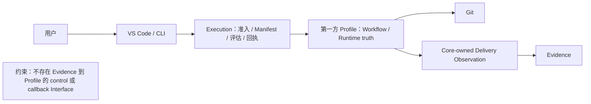
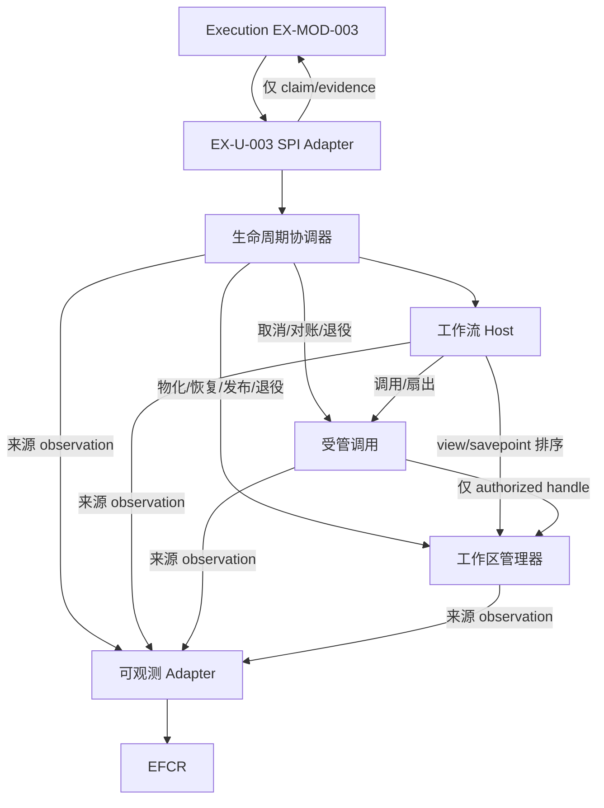
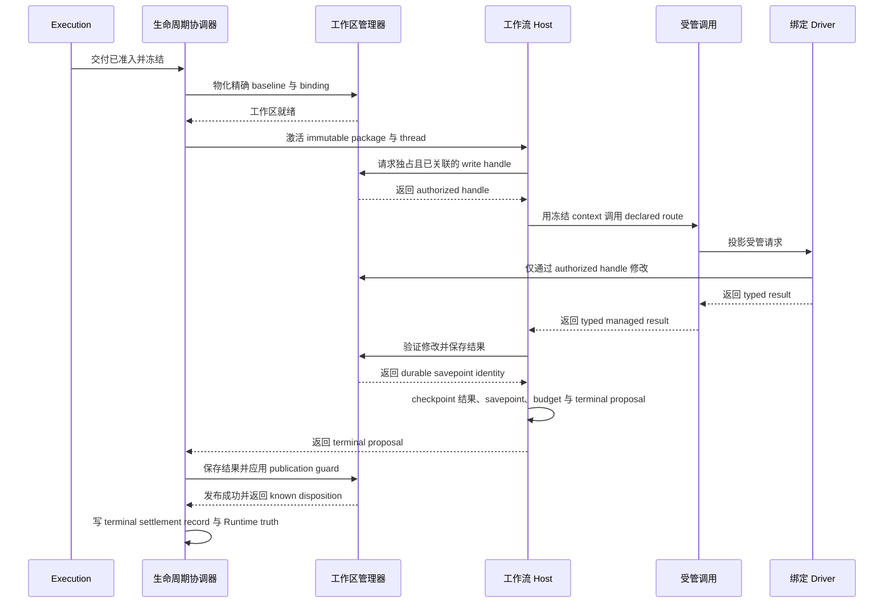
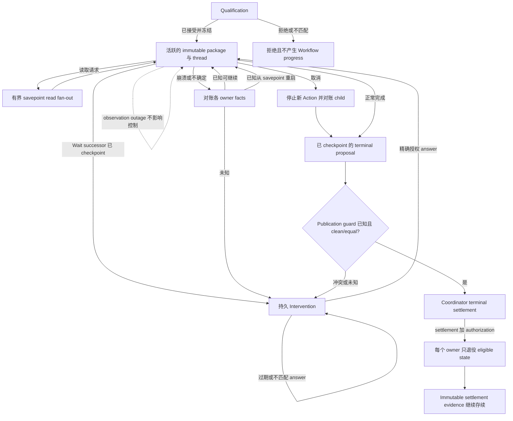

# 第一方 LangGraph Runtime Profile 系统设计

> **Active support/navigation.** Target authority 是 [Concept](../../agent-architecture.md)、[Execution](../execution/project-execution-system.md) 与 [Evidence](../evidence/evidence-system.md)；Contract revision split —— [Observation Catalog](../../contracts/observation/observation-catalog.zh-CN.md)、[OTel Observation Profile](../../contracts/observation/otel-observation-profile.zh-CN.md)、[Execution–Evidence Interaction Contract](../../contracts/execution-evidence/interaction-contract.zh-CN.md) 与 [Metric Catalog](../../contracts/evaluation/metric-catalog.zh-CN.md) —— 仍为 draft，不能证明 physical conformance。若本文其余历史/操作说明与这些 owner 冲突，以 owner 为准；legacy material 只能作为明确标记的 legacy evidence 被发现。

## 1. 元数据与权威

| 字段 | 值 |
| --- | --- |
| 状态 | `PROFILE_DESIGN_READY_REBINDING_REQUIRED`；四条 legacy semantic Contract line 存在但不是 publication；两个 representation-binding Spike 仍是 feasibility evidence；physical 与 implementation conformance 尚未证明 |
| Canonical language | English |
| Authority source snapshot | repository commit `a7684789958f556b4376e12f3b55f224804fabea`；精确 authority path 见下文 |
| Workflow closure | confirmed problem/scenario Brief 与 Skeleton direction 已吸收；三镜头审查、readability review、Fresh Reader 与 deterministic document verification 在清理 session artifact 前通过 |
| Supersession lineage | 替换本 canonical path 的先前内容；repository history 承载持久 final-artifact lineage |
| Companion | [规范英文原文](first-party-langgraph-runtime-profile.md)；本中文文档为派生的 non-normative companion |

### External-boundary rebinding（`runner.decision.013`）

本节对该 Profile 的 external boundary 具有规范性。上方链接的 Concept 与 Execution/Evidence System Design 拥有 product/System meaning。Product Host 只发起一次 Execution Core Delivery call；Core 把此 Profile 作为 Adapter 调用，并拥有 Delivery lifecycle sequencing 与 outbound Delivery Observation。下方 Coordinator→Host/Invocation/Workspace choreography 是 runner Adapter 内部私有编排，不是 host-callable Core Interface。runner 私下保留 wait/resume、checkpoint、branch/workspace assignment 与 custody reacquisition；这些能力都不会变成 DSH 或 public Core resume semantic。

下文所有 EFCR/PCC、four-Contract、“published”与 `runner.open-work.003.*` statement 都只是 frozen legacy profile evidence 与 downstream rebinding input。它们不是 active authority、publication 或 conformance proof。Active target 经 Core-owned Delivery Observation 把 bounded fact 发送给 Evidence；Contract companion 仍是 draft。任何 implementation/conformance claim 都需要在 `concept.obligation.001..004` 下游发布 schema、registry、fixture 与 validation。

权威顺序为 [Concept](../../agent-architecture.zh-CN.md)，其次是拥有 external/Core boundary 的 [Execution System Design](../execution/project-execution-system.zh-CN.md)，最后是拥有 Adapter-private runner behavior 的本 Profile。用户确认需求通过这些 governing owner 被吸收；已删除或 legacy design 仅是 historical evidence，不是 active authority。本文描述预期的私有 Profile behavior；唯一已执行的 substrate evidence 是 §14 返回的窄范围外部 spike 证据，不据此声称更广泛的 LangGraph、Codex、Copilot、SQLite、Git、性能、生产、conformance 或 fault 能力。

## 2. 设计上下文

Execution Core 拥有 Delivery admission、Manifest/configuration identity、lifecycle sequencing、Adapter qualification 与 outbound Observation。Profile 是可替换 execution seam 的 Adapter，拥有其私有 Workflow execution 与 Runtime truth。Evidence 拥有 admitted fact、factual projection 与 presentation。目标上下文是可信本地 dogfood、每 repository instance 一个活跃 Execution、短生命周期 worker、无 daemon/port、串行写和有界只读 fan-out；不声称隔离恶意 Workflow code。

## 3. 问题、目标与范围

本设计关闭 此前委派的 graph、checkpoint、Driver/session、workspace、publication 与 recovery 缺口，同时避免恢复 Execution-owned universal Executor 或泄漏 native identity。它要求准确 qualification evidence、不可变 package/thread activation、typed multi-Driver Action、安全读写并发、持久 Intervention、语义 recovery/cancellation、guarded publication、非控制 observation、owner-specific retirement 与无 in-flight upgrade。

范围包括 Profile evidence/preflight、package/graph/thread/checkpoint 意图、managed invocation、workspace/savepoint/publication、lifecycle/recovery/retirement、observation mapping、ownership 与未来 verification。非目标包括 Execution/EFCR/Evidence 权威、字段级 Contract、Installation & Update、Agent Server、专有引擎、Builder/compiler、plugin、HA/分布式/多租户、并行写、exactly-once、跨系统事务、不安全 Git 自动化、恶意代码隔离与活跃迁移。基础设施验证外部化，且不阻塞本文档 workflow。

## 4. 设计驱动

| Driver | 架构后果 | Trace ID |
| --- | --- | --- |
| 独立 qualification | Execution 独占 assessment；Profile 只给 claim/evidence/native validation/preflight。 | `runner.driver.001`；`runner.decision.011` |
| Immutable Delivery binding | 每 Delivery 一个 immutable package/private thread，注入 checkpointer/SDK，无 in-flight upgrade。 | `runner.driver.002`；`runner.decision.002` |
| Typed static Drivers | 静态 Codex/Copilot Adapter 返回 typed result，无 fallback。 | `runner.driver.003`；`runner.decision.005` |
| 串行 workspace safety | Host 排序 workspace context；Workspace 独占 mutation；写串行且 guarded publication。 | `runner.driver.004`；`runner.decision.006` |
| Durable control truth | Wait、cancellation 与 terminal truth 是持久 Runtime state，不来自 receipt/process/free text。 | `runner.driver.005` |
| Semantic recovery | Recovery 为 `continue | restart-from-savepoint | intervene`；不确定性显式化。 | `runner.driver.006`；`runner.decision.007` |
| Owner-scoped retirement | 授权后每个 owner 只 retire 自己的 state family。 | `runner.driver.007`；`runner.decision.008` |
| 非控制 observation | 有界 observation 单向且非控制。 | `runner.driver.008`；`runner.decision.009` |
| 本地运维适配 | embedded/local/short-worker 降低预期运维；数值外部化。 | `runner.driver.009` |
| 最小 deep structure | 四个 deep Module、private native ID、唯一 writer/retirer、无环 caller。 | `runner.driver.010` |

分类 Fitness Threshold 与英文一致：只有合法 successor、fail closed/no fallback、一个 modifier、read mutation 使结果无效、correlated resume、无 blind replay、guarded publication、EFCR 非控制、授权后 retirement。这些是要求，不是执行证据。

## 5. 问题分解

四个独立 change/failure/state 轴足够：Delivery lifecycle/terminal arbitration；package/graph semantics；heterogeneous managed invocation；workspace/publication。Observation、tool、credential、checkpoint/Journal storage、cache 与各 Driver 保持 internal seam/Adapter；拆成顶层 Module 会浅薄或投机。删除任何选中 Module 都会把大量策略扩散给多个 caller；合并则混合 graph、CLI、Git 与 lifecycle failure。

## 6. 系统结构

| Module | 职责 | 唯一 writer/retirer | Trace IDs |
| --- | --- | --- | --- |
| Profile Lifecycle Coordinator | Profile evidence/preflight；activate/resume/cancel/reconcile/recover/settle/retire 编排 | lifecycle working state 与 immutable terminal settlement record；只 retire eligible working state | `runner.module.001`；`runner.interface.001`；`runner-TERMINAL-SETTLEMENT-RECORD-001` |
| LangGraph Workflow Host | exact package、注入式 graph compile/advance、closed transition、Wait/checkpoint/proposal | package execution cache、Workflow/checkpoint/thread state | `runner.module.002`；`runner.interface.002` |
| Managed Agent Invocation | frozen route projection、静态 Driver、session/tool/credential、typed result、fan-out/control | session reference 与 Invocation Journal | `runner.module.003`；`runner.interface.003` |
| Workspace and Publication Manager | baseline/view/write/savepoint/restore/result/guarded publication | workspace、view、savepoint、result/publication | `runner.module.004`；`runner.interface.004` |

Runtime-observation Adapter 是 thin Adapter，不拥有 domain truth（`runner.interface.005`）。

下图的无环方向只约束跨 Module invocation：Coordinator invoke Host、Invocation 与 Workspace；Host invoke Invocation 与 Workspace；Invocation 仅经 authorized handle invoke Workspace。§7 中以 `←` 表示的 result/return 只完成原调用，不形成 reverse invocation 或 reverse dependency。

## 7. 协作与端到端流程

本节按协议文档阅读：先沿无异常的成功路径理解主协议，再到各独立场景查看分支行为。sequence diagram 的实线箭头表示 invocation，虚线箭头表示沿原 Interface 返回；return 不形成反向依赖。

### 成功核心流程

**1. Admission 与 activation。** Execution 准入并冻结 Delivery。Coordinator 先请 Workspace Manager materialize exact baseline/binding，再请 Workflow Host activate 一个 immutable package 与一个 private correlated thread。Coordinator 拥有 lifecycle disposition，Workspace 拥有 materialization state，Host 拥有 package/thread/checkpoint state。

**2. Invocation 与 mutation。** Host 为最终 state-changing Action 选择 declared route，取得与当前 checkpoint/savepoint 相关的唯一 write handle，并以 frozen resources 与 admitted authority 调用 Managed Invocation。Invocation 写 dispatch Journal 并投影到静态绑定 Driver。Driver 经该 handle mutation，Workspace 始终是 source-state 唯一 writer，typed managed result 返回 Host。

**3. 使 terminal proposal durable。** Host 请 Workspace validate mutation 并写 Action-result savepoint。durable savepoint identity 先返回。随后 Host commit 一个 Workflow checkpoint，其中包含 result、savepoint identity、budget 与作为 terminal proposal 的所选 terminal successor。

**4. Publication 与 settlement。** checkpointed terminal proposal 返回 Coordinator。Coordinator validate terminal obligation，并请 Workspace 保存 result、应用 clean/equal-target publication guard。Workspace 成功发布并返回 known disposition。随后 Coordinator 写 immutable terminal settlement record 与 Runtime terminal truth。

### 状态与异常路线

#### Qualification failure 与 in-flight version change

Profile 提供 claim、evidence、native validation 与 preflight；Execution 独占 CapabilityAssessment writing。qualification rejected 或 mismatched 时不产生 Workflow progress。admitted Delivery 在整个生命周期固定 exact package、implementation、Profile version 与 private thread；后续版本只用于后续 Delivery。same identity/different content fail closed。

#### Action 或 durability failure

Workspace 拒绝 mismatched 或非独占 handle。Invocation 拥有 dispatch、attempt、invalid/unknown result facts；unmanaged bypass 与 fallback 停止 advancement。Workspace 拥有 mutation validation 与 savepoint failure。Host 拥有 checkpoint、illegal-transition 与 proposal failure。Coordinator 拥有 lifecycle、obligation 与 terminal unknown，Workspace 拥有 publication unknown。所有此类 failure 都不伪造其他 owner 的 state 或 Workflow progress；无 safe declared successor 时，uncertainty 进入 Intervention。

#### Bounded read fan-out

Host 请求一个 stable savepoint 与有界 read-view set。Invocation 只消费这些 handle，Workspace 拒绝通过 read view mutation，Host 确定性 aggregate。任何 source mutation 都使相关 read result 失效；始终只允许一个 modifier 并保持 serial write。

#### Wait 与 resume

Host 先 checkpoint legal Wait successor。该 return 使 Coordinator 可持久化 correlated Intervention 与 exit state。resume 经 SPI Adapter 进入；只有 exact authorized pending answer 验证通过后，Coordinator 才调用 Host。stale 或 mismatched control 无 effect，Host 恢复同一 thread。

#### Crash recovery

Coordinator 调用 Host、Invocation 与 Workspace，取得各自有界 authoritative facts。它只选择 known continuation、known restore/restart from savepoint，或在 uncertainty 时进入 Intervention；绝不 blind replay。各 responding owner 拥有自己的 fact/failure；Coordinator 拥有 recovery classification 与 lifecycle decision。

#### Cancellation

Coordinator 停止新 Action，请 Invocation cancel child，保留 unknown partial-attempt facts，再调用 Host 与 Workspace 对账各自 state。Host 只 checkpoint 并应用 declared cancellation successor。Coordinator 独占 terminal truth arbitration；receipt 或 process exit 不能替代。

#### Publication conflict

checkpointed terminal proposal 后，Coordinator validate obligation 并调用 Workspace。Workspace 在评估 target guard 前先保存 result。clean/equal target 产生 known disposition；conflict 或 unknown publication 进入 Intervention，绝不伪造 success。

#### Observation outage

每个 origin Module 经 thin Adapter 发有界、最小化、保留 provenance 的 observation。delivery failure 或 EFCR outage 只向 origin 返回非 owning delivery status，不能阻塞、推进、取消、恢复、发布或 settle Workflow state。

#### Retirement

只有 settlement 加显式 authorization 才启动 durable retirement。Coordinator 调用 Host、Invocation 与 Workspace；每个 owner 只 retire 自己 eligible family 并返回 disposition。Coordinator 记录并重试 partial progress，再只 retire eligible lifecycle working state。authorization、immutable terminal settlement record、result/publication reference、per-owner disposition 与 audit correlation 继续存续。

### 紧凑 Flow/View Traceability

| 面向读者的关注点 | Scenario IDs | Main Flow ID | Step IDs | View / Action IDs | Interface IDs |
| --- | --- | --- | --- | --- | --- |
| Authority 与 qualification | `runner.scenario.01` | `runner.flow.001` | — | `runner.view.001` | `runner.interface.001` |
| Module dependency direction | — | — | — | `runner.view.002` | `runner.interface.001`、`runner.interface.002`、`runner.interface.003`、`runner.interface.004`、`runner.interface.005` |
| Activation 与 version binding | `runner.scenario.02`、`runner.scenario.12` | `runner.flow.002` | `runner.flow.002.1`、`runner.flow.002.2`、`runner.flow.002.3` | `runner.view.003` | `runner.interface.001`、`runner.interface.004`、`runner.interface.002` |
| Managed invocation、mutation 与 durability | `runner.scenario.03`、`runner.scenario.04` | `runner.flow.003` | — | `runner.view.011`、`runner.view.004` | `runner.interface.004`、`runner.interface.003`、`runner.interface.002` |
| Read fan-out | `runner.scenario.05` | `runner.flow.004` | — | `runner.view.005` | `runner.interface.004`、`runner.interface.003` |
| Wait 与 Intervention | `runner.scenario.06` | `runner.flow.005` | `runner.flow.005.1`、`runner.flow.005.2`、`runner.flow.005.3` | `runner.view.006` | `runner.interface.001`、`runner.interface.002` |
| Crash recovery | `runner.scenario.07` | `runner.flow.006` | `runner.flow.006.1`、`runner.flow.006.2` | `runner.view.007` | `runner.interface.002`、`runner.interface.003`、`runner.interface.004` |
| Cancellation | `runner.scenario.08` | `runner.flow.007` | `runner.flow.007.1`、`runner.flow.007.2`、`runner.flow.007.3` | `runner.view.008` | `runner.interface.001`、`runner.interface.003`、`runner.interface.002`、`runner.interface.004` |
| Publication 与 settlement | `runner.scenario.09` | `runner.flow.008` | `runner.flow.008.1`、`runner.flow.008.2`、`runner.flow.008.3` | `runner.view.009` | `runner.interface.002`、`runner.interface.004` |
| Observation outage | `runner.scenario.10` | `runner.flow.009` | — | — | `runner.interface.005` |
| Retirement | `runner.scenario.11` | `runner.flow.010` | `runner.flow.010.1`、`runner.flow.010.2`、`runner.flow.010.3`、`runner.flow.010.4` | `runner.view.010` | `runner.interface.001`、`runner.interface.002`、`runner.interface.003`、`runner.interface.004` |

## 8. 数据、状态、身份与所有权

Manifest/assessment/receipt 属于 Execution；Profile claim 只是 evidence。Host 拥有 Workflow/checkpoint/thread/Wait/proposal；Coordinator 拥有 lifecycle/Intervention/recovery working state 与 immutable terminal settlement record；Invocation 拥有 session/Journal；Workspace 拥有 worktree/view/savepoint/result/publication；Git 与 EFCR/Evidence 保持各自 truth。

跨 seam 使用稳定 Delivery、Workflow/Contract、implementation、Profile/version、Snapshot、Action/Role/route、resource、Artifact、Intervention/control ID；LangGraph/Driver ID 私有。顺序为 assessment→admission/freeze→handoff→workspace/package activation；Workspace savepoint 先 durable，随后 Host checkpoint，而该 checkpoint 先于 durable Workflow progress 与 graph advancement；Invocation 前有 Host context；publication 前有 proposal；retirement 前有 settlement/authorization。same identity/different content fail closed。一个 modifier；read 有界且来自同一 savepoint。

Ephemeral cleanup 独立于 durable retirement：Invocation 在 Action/worker 结束、failure、cancellation 或 Intervention 时及时终止 child process 并释放 action-scoped authentication；Workspace 及时删除 disposable read view。各 owner 记录有界、脱敏的 cleanup failure 供 reconciliation。Host checkpoint、Invocation Journal/session recovery reference、canonical workspace/savepoint/result 与 Coordinator recovery/terminal record 保留至 settlement 加显式授权。之后 Coordinator 自行 retire 可清理的 lifecycle/worker/control/Intervention working details；immutable authorization、terminal settlement、retirement disposition、result/publication reference 与 audit correlation 继续存续。

Coordinator 可 retire 的 working state 仅包括完成的 worker-attempt bookkeeping、已对账 transient control correlation、已解决 Intervention working payload、recovery scratch/classification 与完成的 retirement retry scheduling。`runner-TERMINAL-SETTLEMENT-RECORD-001` 不被本 retirement 删除，并继续作为 Runtime-authoritative evidence；最少包含 Delivery；Manifest、Profile/version、Workflow/Contract、implementation、Package Snapshot identities；terminal outcome/reason；terminal checkpoint、result/savepoint references；publication disposition/reference；retirement authorization identity；per-owner dispositions；stable audit correlation。仅未来另行授权的 product-retention policy 可处理该 immutable record，但 `runner.flow.010` 不处理它。

## 9. Interface、依赖、Seam 与 Adapter

Execution SPI-facing interface 不做 admission assessment（`runner.interface.001`）。Workflow Host interface 由 Coordinator 调用并隐藏 package/thread/checkpoint semantics（`runner.interface.002`）。Managed Invocation interface 由 Host 调 invoke/fan-out，Coordinator 仅调 cancel/reconcile/retire；它不选 route（`runner.interface.003`）。Workspace interface 由 Coordinator 做 lifecycle、Host 做 ordering、Invocation 仅用 authorized handle；它隐藏 Git state（`runner.interface.004`）。observation interface 只发有界非控制 observation（`runner.interface.005`）。

这些 caller rule 只约束 invocation，并保持无环。typed result、savepoint identity、proposal 与 publication disposition 经原 Interface 返回其 caller；return 不授权 callee invoke caller，也不建立 reverse dependency。

所有 Interface 对 identity/authority/state mismatch fail closed，并保留 explicit unknown。Proposed current cross-owner field/error/version rule 由 unpublished Contract draft 与 `concept.obligation.001` 跟踪；`runner.open-work.003` 下历史 four-Contract wording 只保留为 quarantined legacy evidence。implementation workflow 通过 `runner.open-work.012` 确定 `runner.interface.002/003/004` 的内部 shape，并通过 `runner.open-work.011` 给出实测 timeout/capacity 默认值。Driver 与 Execution/EFCR 是真实 Adapter seam；store/cache/tool/credential 保持 internal seam。

Observation caller 完整：Host、Invocation、Workspace、Coordinator 各自调用 `runner.interface.005`，携带 originating Module provenance 与 stable correlation。origin Module 仍是 fact owner；Adapter 只 validate/minimize/map，不改 provenance、不读取 native content、不获得 control。delivery status 只返回 origin caller（Coordinator 可获得非 owner 的 lifecycle summary）；EFCR 无回调。跨 Runtime semantic ingress 属于 `runner.open-work.003.4` / `EX-U-004`；runner-specific fact-to-observation mapping 与 fixture 属于 implementation handoff item `runner.open-work.013`。

`runner.open-work.007` 完成了 quarantined legacy `.4` semantic line 的 representation-binding feasibility experiment，并为 draft 提供信息：required Canonical Evidence 只允许使用 dedicated unsampled/non-trace-based OTel Event 或 Log 路径；Trace、Span 与 Metric carrier 因 sampling 或 aggregation 可能丢失 fact occurrence，只能是 `DIAGNOSTIC_TELEMETRY`。该结果既不发布 Contract，也不证明 conformance；implementation 在 physical Contract 发布且自身 OTLP/Collector-to-EFCR corpus 通过前保持 `CROSS_IMPLEMENTATION_CONFORMANCE_UNPROVEN`。

## 10. Failure、Recovery 与系统级行为

Graph failure 不伪造 progress；Driver exit 不伪造 result；Git conflict 保存 result；stale control 无 effect；EFCR outage 不控制 Runtime；partial retirement 可见。只有 owner 的 identity/content rule 证明安全时才 retry。没有跨 graph/process/filesystem/Git 的通用 rollback。Cancellation 经 child control、bounded reconciliation、Workflow successor、Coordinator terminal 收敛。Recovery 使用 owner facts，并可安全选择 Intervention。implementation workflow 必须关闭 `runner.open-work.009` 的 executable fault corpus，才能声称相关 acceptance outcome。

Managed Agent Invocation 拥有 credential lifecycle（`runner.module.003`）：route/authority validation 后才从 internal provider 请求最小 action/Driver-scoped credential，仅在 Driver Adapter seam 注入。secret 不进入 checkpoint、Journal、observation/Evidence、workspace 或任何 durable content。normal return、failure/crash reconciliation、cancellation、Intervention 与 worker end 均触发独立 release/revocation；cleanup uncertainty 保持为有界脱敏 Invocation fact。外部 obligation vocabulary 来自 `runner.open-work.003.1` 与 `runner.open-work.003.3`；executable proof 与 supported-substrate evidence 属于 `runner.open-work.008` 与 `runner.open-work.010`。

Managed SDK 是 fail-closed qualification/conformance invariant：publisher 声明，Execution `EX-MOD-003` assessment，Host/Invocation enforce。无法证明 exclusive managed projection 的 package/route 被拒绝；运行时发现 bypass 则停止 advancement 并进入 failure/Intervention，managed recovery/cancellation/privacy/evidence guarantee 标为 unavailable。涉及 `runner.acceptance.003`、`runner.acceptance.007` 与 `runner.acceptance.008`；proposed Contract basis 在 `concept.obligation.001` 下仍未发布，executable evidence 仍是 `runner.open-work.008` 与 `runner.open-work.009` 下的 `IMPLEMENTATION_PLAN`。

## 11. Quality Attribute 实现

| Quality | Mechanism | Trade-off / lifecycle |
| --- | --- | --- |
| Reliability/recovery | durable state、semantic recovery、Intervention、guarded settlement | 可能需要人；implementation evidence `runner.open-work.009` |
| Consistency/concurrency | immutable Snapshot、唯一 writer、serial write、stable view、owner retirement | 吞吐较低；implementation evidence `runner.open-work.009` 与 tuning `runner.open-work.011` |
| Security/privacy | authority split、frozen resources、ephemeral credential、private ID、minimization | trusted-code risk；Contracts `runner.open-work.003.1`、`runner.open-work.003.3`、`runner.open-work.003.4`；evidence `runner.open-work.008`、`runner.open-work.009`、`runner.open-work.013` |
| Observability | thin Adapter、outage non-controlling、Canonical Evidence 仅走 eligible Event/Log path | 原始诊断更少；候选 SDK evidence `runner.open-work.007`；Contract `runner.open-work.003.4`；mapping/tuning `runner.open-work.011`、`runner.open-work.013` |
| Maintainability | 四个 deep Module 与无环 caller graph | 需要严格 Contract |
| Compatibility | exact binding、typed mismatch、无 migration/fallback | Contracts `runner.open-work.003.1`、`runner.open-work.003.2`、`runner.open-work.003.3`；implementation evidence `runner.open-work.008`、`runner.open-work.010` |
| Performance/capacity/cost | short worker、local persistence、bounded fan-out | 数值证明全部属于 `runner.open-work.011` |

HA、分布式、多租户、恶意隔离不适用于确认的可信本地 MVP；引入它们需要新 authority。

## 12. 风险与权衡

Driver incompatibility (`runner.open-work.008`、`runner.open-work.010`)、local recovery failure (`runner.open-work.009`、`runner.open-work.010`)、crash ambiguity (`runner.open-work.009`)、trusted SDK bypass、SQLite writer conflation (`runner.open-work.009`、`runner.open-work.011`)、Git conflict (`runner.open-work.009`、`runner.open-work.010`)、native ID/content leakage (`runner.open-work.003.2`、`runner.open-work.003.3`、`runner.open-work.003.4`、`runner.open-work.013`)、OTel Logs-JS version instability、Metric-cardinality pressure、trace/span sampling loss（`runner.open-work.007`）与 partial retirement (`runner.open-work.009`、`runner.open-work.011`) 保持可见。若证据否定 managed-action seam、local recovery、writer separation、安全 Git、minimization、eligible Canonical Evidence carrier path 或 owner retirement，则 owner 必须 reopen Brief/design。接受 local 胜于 HA、semantic recovery 胜于 exactly-once、static integration 胜于 plugin、write safety 胜于 throughput、Intervention 胜于不安全自动化、recoverability 胜于自动 cleanup。

## 13. Acceptance 与 Verification

`runner.decision.014` 是双语结构、stable-ID、diagram/prose parity、独立 review、Fresh Reader 与 deterministic document check mechanism。`runner.decision.015` 是 scope-qualified non-proof 与精确 routing mechanism：分离 external Contract gap 和 implementation-owned handoff work，同时不丢失任何一类事项。

| Acceptance identity | problem_or_goal_ids | scenario_ids | drivers；decisions/mechanisms | Outcome / threshold | Method；evidence_state；reference | Owner；return / reopen |
| --- | --- | --- | --- | --- | --- | --- |
| `runner.acceptance.013` | `problem`, `acceptance` | `runner.scenario.01`, `runner.scenario.02`, `runner.scenario.03`, `runner.scenario.04`, `runner.scenario.05`, `runner.scenario.06`, `runner.scenario.07`, `runner.scenario.08`, `runner.scenario.09`, `runner.scenario.10`, `runner.scenario.11`, `runner.scenario.12` | `runner.driver.010`, `runner.decision.014` | coherent bilingual structure and ID parity | independent reviews 与 final document checks；`DESIGN_EVIDENCE_AVAILABLE`；本文 §§1–15 与英文 companion | workflow owner；return `runner.acceptance.013`；ambiguity 时 reopen |
| `runner.acceptance.014` | `scope`, `open`, `acceptance` | `runner.scenario.01`, `runner.scenario.02`, `runner.scenario.03`, `runner.scenario.04`, `runner.scenario.05`, `runner.scenario.06`, `runner.scenario.07`, `runner.scenario.08`, `runner.scenario.09`, `runner.scenario.10`, `runner.scenario.11`, `runner.scenario.12` | `runner.decision.012`, `runner.decision.015` | no unsupported infra proof claim；Contract/handoff routing complete | ledger audit；`DESIGN_EVIDENCE_AVAILABLE`；本文 §§1、3、13–15、`runner.open-work.003.1`–`.4`、`runner.open-work.006/002` 及 `runner.open-work.008`–`006` | System Designer；return `runner.acceptance.014`；misclaim 时 reopen |
| `runner.acceptance.001` | `problem`, `constraints` | `runner.scenario.01` | `runner.driver.001`, `runner.decision.011`, `runner.flow.001` | Execution sole assessor；fail closed | authority review；`DESIGN_EVIDENCE_AVAILABLE`；authority sources 与本文 §§1、7、13 | Runtime conformance owner；return `runner.open-work.003.3`, `runner.interface.001`, `runner.acceptance.001`；self-assessment 时 reopen |
| `runner.acceptance.002` | `problem`, `constraints` | `runner.scenario.02` | `runner.driver.002`, `runner.decision.002`, `runner.flow.002` | exact package/thread | graph tests；`IMPLEMENTATION_PLAN`；`runner.open-work.003.1`, `runner.open-work.003.2`, `runner.open-work.009`, `runner.open-work.010`, `runner.open-work.012` | `runner.module.002` owner；return `runner.interface.002`, `runner.acceptance.002`, `runner.open-work.009`；premise fail 时 reopen |
| `runner.acceptance.003` | `problem`, `risks` | `runner.scenario.03` | `runner.driver.003`, `runner.decision.004`, `runner.decision.005`, `runner.flow.003` | typed result；bypass rejected | Driver tests；`IMPLEMENTATION_PLAN`；`runner.open-work.003.1`, `runner.open-work.003.3`, `runner.open-work.008`, `runner.open-work.012` | `runner.module.003` owner；return `runner.interface.003`, `runner.acceptance.003`, `runner.open-work.008`；seam fail 时 reopen |
| `runner.acceptance.004` | `problem`, `risks` | `runner.scenario.04` | `runner.driver.003`, `runner.decision.005` | both sources；no fallback | Driver tests；`IMPLEMENTATION_PLAN`；`runner.open-work.008`, `runner.open-work.010`, `runner.open-work.012` | `runner.module.003` owner；return `runner.interface.003`, `runner.acceptance.004`, `runner.open-work.008`；source fail 时 reopen |
| `runner.acceptance.005` | `problem`, `quality` | `runner.scenario.05` | `runner.driver.004`, `runner.decision.006`, `runner.flow.004` | stable reads；mutation invalidates | Git tests；`IMPLEMENTATION_PLAN`；`runner.open-work.009`, `runner.open-work.011`, `runner.open-work.012` | `runner.module.004` owner；return `runner.interface.004`, `runner.acceptance.005`, `runner.open-work.009`；isolation fail 时 reopen |
| `runner.acceptance.006` | `problem`, `constraints` | `runner.scenario.06` | `runner.driver.005`, `runner.decision.004`, `runner.decision.008`, `runner.flow.005` | correlated resume；stale rejected | control tests；`IMPLEMENTATION_PLAN`；`runner.open-work.003.1`, `runner.open-work.003.3`, `runner.open-work.009`, `runner.open-work.012` | `runner.module.002` owner；return `runner.interface.002`, `runner.acceptance.006`, `runner.open-work.009`；unsafe resume 时 reopen |
| `runner.acceptance.007` | `problem`, `risks` | `runner.scenario.07` | `runner.driver.006`, `runner.decision.007`, `runner.flow.006` | 3 outcomes；no blind replay | fault tests；`IMPLEMENTATION_PLAN`；`runner.open-work.003.1`, `runner.open-work.003.3`, `runner.open-work.008`, `runner.open-work.009`, `runner.open-work.012` | `runner.module.001` owner；return `runner.interface.001`, `runner.acceptance.007`, `runner.open-work.009`；ambiguity uncontained 时 reopen |
| `runner.acceptance.008` | `problem`, `quality` | `runner.scenario.08` | `runner.driver.005`, `runner.decision.007`, `runner.decision.008`, `runner.flow.007` | cancellation converges；receipt non-terminal | cancel tests；`IMPLEMENTATION_PLAN`；`runner.open-work.003.1`, `runner.open-work.003.3`, `runner.open-work.008`, `runner.open-work.009`, `runner.open-work.012` | `runner.module.001` owner；return `runner.interface.001`, `runner.acceptance.008`, `runner.open-work.009`；fabricated outcome 时 reopen |
| `runner.acceptance.009` | `problem`, `constraints` | `runner.scenario.09` | `runner.driver.004`, `runner.driver.007`, `runner.decision.006`, `runner.flow.008` | result preserved；guard | Git tests；`IMPLEMENTATION_PLAN`；`runner.open-work.003.2`, `runner.open-work.009`, `runner.open-work.010`, `runner.open-work.012` | `runner.module.004` owner；return `runner.interface.004`, `runner.acceptance.009`, `runner.open-work.009`；unsafe publish 时 reopen |
| `runner.acceptance.010` | `problem`, `quality` | `runner.scenario.10` | `runner.driver.008`, `runner.decision.009`, `runner.flow.009` | provenance；non-controlling | carrier feasibility test 加 implementation mapping test；`DESIGN_EVIDENCE_AVAILABLE`；`runner.open-work.007`, `runner.open-work.003.4`, `runner.open-work.011`, `runner.open-work.013`；physical conformance 仍未证明 | `runner.interface.005` owner；return `runner.interface.005`, `runner.acceptance.010`, `runner.open-work.013`；control/leakage 或无 eligible Canonical Evidence route 时 reopen |
| `runner.acceptance.011` | `problem`, `acceptance` | `runner.scenario.11` | `runner.driver.007`, `runner.decision.008`, `runner.flow.010` | cleanup；authorized retirement；evidence survives | lifecycle tests；`IMPLEMENTATION_PLAN`；`runner.open-work.009`, `runner.open-work.011`, `runner.open-work.012` | `runner.module.001` owner；return `runner.interface.001`, `runner.acceptance.011`, `runner.open-work.009`；premature loss 时 reopen |
| `runner.acceptance.012` | `problem`, `constraints` | `runner.scenario.12` | `runner.driver.002`, `runner.decision.002` | later Deliveries only | compatibility；`IMPLEMENTATION_PLAN`；`runner.open-work.003.1`, `runner.open-work.003.2`, `runner.open-work.003.3`, `runner.open-work.010` | Runtime conformance owner；return `runner.acceptance.012`, `runner.open-work.010`；substitution 时 reopen |

Scope-qualified `PROFILE_DESIGN_READY_REBINDING_REQUIRED` 只表示经审查的文档可指导实现。两个 representation-binding spike 仅证明 §14 候选 mechanism 在所记录环境中成立；它们不选择 runner production substrate，也不建立 cross-implementation conformance。

## 14. 决策、开放工作与拒绝方案

### Decision register

| Decision | 精确决策陈述 | Trace ID |
| --- | --- | --- |
| Embedded local runtime | 使用 embedded LangGraph JS 与 short-lived worker；不引入 Agent Server、daemon 或 port。 | `runner.decision.001` |
| Immutable Delivery binding | 每 Delivery 绑定一个 immutable package/private correlated thread，注入 Profile-owned checkpointer/SDK，绝不 in-flight upgrade。 | `runner.decision.002` |
| 四 Module structure | 使用 §6 的四个 deep Module 与 acyclic invocation direction。 | `runner.decision.003` |
| Workflow policy ownership | Workflow Host 独占 legal route、budget、successor、Wait 与 terminal-proposal semantics。 | `runner.decision.004` |
| Static managed Drivers | static Codex/Copilot Adapter 位于 typed managed invocation 后；拒绝 fallback 与 unmanaged bypass。 | `runner.decision.005` |
| 串行 workspace mutation | Host 排序 workspace context，Workspace 独写 Git，Invocation 只消费 authorized handle，写串行且 publication guarded。 | `runner.decision.006` |
| 仅 semantic recovery | 只允许 known continue、known restart-from-savepoint、或 uncertainty→Intervention；不声称 blind replay/exactly-once。 | `runner.decision.007` |
| Owner-scoped retirement | 每 Module 只 retire 自己 eligible family；Coordinator retire working lifecycle family、对账 partial retirement，并保留 `runner-TERMINAL-SETTLEMENT-RECORD-001`。 | `runner.decision.008` |
| 非控制 observation | 每个 origin Module 经 thin observation interface 发 provenance-preserving bounded observation；EFCR 不控制 Runtime。 | `runner.decision.009`；`runner.interface.005` |
| Logical writer separation | SQLite 可物理共置 checkpoint/Journal，但 logical writer、state family、retirement 分离。 | `runner.decision.010` |
| Execution-owned qualification | Execution 独占 qualification assessment；Profile 只提供 claim/evidence/native validation/preflight。 | `runner.decision.011`；`EX-MOD-003` |
| Readiness 不是 substrate proof | Scope-qualified document readiness 与 infrastructure proof 独立，不声称 supported substrate/version。 | `runner.decision.012` |

### External Contract gaps

`runner.open-work.003` 为 runner implementation workflow 之外的 Contract artifact 保留四个 stable rebinding slot。evidence semantic ingress 的 current companion —— [Observation Catalog](../../contracts/observation/observation-catalog.zh-CN.md)、[OTel Observation Profile](../../contracts/observation/otel-observation-profile.zh-CN.md) 与 [Execution–Evidence Interaction Contract](../../contracts/execution-evidence/interaction-contract.zh-CN.md) —— 是同一 proposal 拆成的三份文档：它们是 `DRAFT`，未 physical publish，不携带 active exact version，也不证明 conformance。历史 exact-version literal 只存在于 quarantined legacy A+B bundle 与 Git history；它们对 current 刻意 non-resolving 且 non-authoritative。下表区分这些历史 literal 与 `concept.obligation.001` 下仍需补齐的 current evidence。

| Gap | Upstream authority / accountable owner | Scenario 与 runner consumer | Required completion evidence；state | Reopen |
| --- | --- | --- | --- | --- |
| `runner.open-work.003.1` | `EX-U-001`；Workflow Contract owner | `runner.scenario.02/03/06/07/08/12`；Host 消费 closed transition——含条件边判断（state 谓词与 Planner Action 判断，`judge.kind: state|planner`）、并行分支（barrier/join 与 session 隔离）、runtime-authority action、budget evaluator 注册点、planner selector——以及 package/resource relationship、Wait/recovery/terminal semantics、合并算法 R1–R3 的 route 解析与 compatibility；可执行能力清单见 `agentops.workflow-dsl` §12.4 | 历史 literal `agent-ops.workflow-package@1.0.0`：`NON_RESOLVING_LEGACY_HISTORY_ONLY`；`runner.open-work.006` 是 feasibility evidence；schema/registry/fixture/publication 在 `concept.obligation.001` 下仍为 `RUNTIME_HANDOFF` | Workflow autonomy、package composition、compatibility semantics、canonical binding 改变，或 Host 无法兑现的 DSL 声明能力（fail closed） |
| `runner.open-work.003.2` | `EX-U-002`；`EX-MOD-001/002` Contract owners | `runner.scenario.02/09/12`；Coordinator、Host、Workspace 消费 immutable Manifest、Snapshot、baseline、identity 与 relationship binding | 历史 literal `agent-ops.configuration-manifest@1.0.0`：`NON_RESOLVING_LEGACY_HISTORY_ONLY`；`runner.open-work.006` 是 feasibility evidence；schema/registry/fixture/publication 在 `concept.obligation.001` 下仍为 `RUNTIME_HANDOFF` | identity authority、binding、canonicalization 或 selected tag profile 改变 |
| `runner.open-work.003.3` | `EX-U-003`；Runtime conformance owner | `runner.scenario.01/02/06/07/08/12`；Execution `EX-MOD-003` 与 `runner.interface.001` 消费 qualification、native validation、immutable activation、control acknowledgement、stable correlation 与 receipt reconciliation | 历史 literal `agent-ops.runtime-profile-spi@1.0.0`：`NON_RESOLVING_LEGACY_HISTORY_ONLY`；current operation/rule/fixture/publication 与 implementation proof 在 `concept.obligation.001` 下仍为 `RUNTIME_HANDOFF` | SPI authority、acknowledgement semantics、Profile substitution rule 或 imported binding 改变 |
| `runner.open-work.003.4` | `EX-U-004`；EFCR + Evidence Contract owners | `runner.scenario.10`；`runner.interface.005` 与 EFCR 消费最小 Runtime-to-EFCR semantic ingress，包括 identity、provenance、quality、correction/correlation 与 schema version | 历史 literal `agent-ops.evidence-semantic-ingress@1.0.0`：`NON_RESOLVING_LEGACY_HISTORY_ONLY`；`runner.open-work.007` 是 feasibility evidence；current OTLP/Collector/schema/registry/fixture publication 在 `concept.obligation.001` 下仍为 `RUNTIME_HANDOFF` | Runtime/EFCR ownership、ingress semantics、Logs SDK stability、field binding 或 payload projection 改变 |

`runner.interface.002`、`runner.interface.003` 与 `runner.interface.004` 被有意排除在本 gap 表之外。它们仍是 implementation-neutral System Design boundary，但精确 internal operation/type/error shape 属于 implementation handoff work，不是 published Contract。`runner.interface.005` 只依赖 `.4` 中的 cross-owner semantics；runner-native mapping 仍归 implementation。

### Representation-binding spike 返回

两个实验只在分支 `spike/fplg-representation-bindings` 上创建、执行和提交；immutable evidence commit `dff9a52` 不包含任何生产路径。legacy 分支只接收结论。

| Evidence ID | Spike 与执行结果 | Design return | Remaining conformance evidence |
| --- | --- | --- | --- |
| `runner.open-work.006` | `EX-CANONICAL-IDENTITY-SPIKE-001`；两次 final run 均通过 7/7；独立 Node/Python encoder 复现 deterministic CBOR bytes 与 SHA-256 domain-separated identity | 已选定 experimental binding `agent-ops.deterministic-cbor@1.0.0`；NFC text；ordered list/unordered tagged set；ABSENT/null 有别；safe integer；unsupported value fail closed | production implementation 采用精确 decoding profile，并通过适用的 per-Contract golden corpus；tag/profile 改变会 reopen binding decision |
| `runner.open-work.007` | `EX-OTEL-SEMANTIC-CARRIER-SPIKE-001`；两次 final run 均通过 10/10；五种 carrier 使用固定版本真实 OTel JS in-memory SDK exporter | 一个 bounded base64url envelope 位于 `agent_ops.evidence.semantic_carrier`；Event 设置 `eventName=agent_ops.evidence.fact`；Canonical Evidence 只走 dedicated Event/Log，Trace/Span/Metric 仅诊断 | 通过 OTLP protobuf/exporter、Collector 与 EFCR ingress round trip 验证 selected binding；Logs-JS 版本变化时重跑 |

两个已完成 spike 保留有用 feasibility fact，但不发布 Contract。revision 在 downstream schema、registry、fixture、validation、version 与 publication evidence 存在前仍是 proposal；因此每个受影响 implementation 都报告 `CROSS_IMPLEMENTATION_CONFORMANCE_UNPROVEN`。spike source 不是 implementation dependency，也不得复制进 production package。

### Implementation 与 operational handoff backlog

原 `runner.open-work.001`、`runner.open-work.002`、`runner.open-work.004` 与 `runner.open-work.005` 没有被删除。它们由下列精确 backlog identity supersede，implementation workflow 必须接收、规划、关闭并回传 evidence。future result path 是保留的可解析位置，不是现有 evidence。

| Item | Supersedes / implementation responsibility | Owner；required completion evidence；state | Concrete future result record / acceptance updates | Reopen |
| --- | --- | --- | --- | --- |
| `runner.open-work.008` | `runner.open-work.001`；实现并证明 managed Codex/Copilot Driver projection、无 fallback/bypass、最小 credential lifecycle、typed result、child cancellation 与 unknown attempt handling | Managed Invocation implementation owner；positive/negative Driver 与 credential fixtures；`IMPLEMENTATION_PLAN` | `docs/systems/runtime/implementation-results/first-party-langgraph-runtime-profile/runner.open-work.008.result.md`；更新 `runner.acceptance.003`、`runner.acceptance.004`、`runner.acceptance.007`、`runner.acceptance.008` | required source 或 managed-action seam 失败 |
| `runner.open-work.009` | `runner.open-work.002`；实现 graph/checkpoint/process/SQLite/Git/retirement fault corpus，并证明 semantic recovery、cancellation reconciliation、guarded publication 与 owner-scoped retirement | Runtime fault implementation owner；executable crash/replay/conflict/partial-retirement corpus；`IMPLEMENTATION_PLAN` | `docs/systems/runtime/implementation-results/first-party-langgraph-runtime-profile/runner.open-work.009.result.md`；更新 `runner.acceptance.002`、`runner.acceptance.005`、`runner.acceptance.006`、`runner.acceptance.007`、`runner.acceptance.008`、`runner.acceptance.009`、`runner.acceptance.011` | local recovery、safety 或 writer separation 失败 |
| `runner.open-work.010` | `runner.open-work.004`；选择、锁定、记录并测试 supported LangGraph/checkpointer/SQLite/Node/Driver/Git compatibility，且不允许 in-flight substitution | framework/Driver implementation owner；exact version matrix、lock evidence、compatibility tests；`UNSELECTED` | `docs/systems/runtime/implementation-results/first-party-langgraph-runtime-profile/runner.open-work.010.result.md`；更新 `runner.acceptance.002`、`runner.acceptance.004`、`runner.acceptance.009`、`runner.acceptance.012` | required version 或 compatibility premise 失败 |
| `runner.open-work.011` | `runner.open-work.005`；暴露 bounded configuration 并测量 timeout、budget、fan-out、cache、cost、disk、cleanup 与 retention default；operator 根据实测 evidence 最终确认 | Runtime implementation owner 与 operator 共同参与；benchmark corpus 与 recommended defaults；`UNMEASURED` | `docs/systems/runtime/implementation-results/first-party-langgraph-runtime-profile/runner.open-work.011.result.md`；更新 `runner.acceptance.005`、`runner.acceptance.010`、`runner.acceptance.011` | local/one-writer assumption 或 safe operating bounds 失败 |
| `runner.open-work.012` | 原 `runner.open-work.003` internal portion；实现并测试 `runner.interface.002/003/004` 的精确 internal operation、type、error、identity/content conflict、ordering、retry 与 retirement behavior，且不提升为 published Contract | owning Module implementations；通过 allowed caller 执行 Interface tests；`IMPLEMENTATION_PLAN` | `docs/systems/runtime/implementation-results/first-party-langgraph-runtime-profile/runner.open-work.012.result.md`；更新 §13 所有 affected acceptance row | internal boundary 变成 cross-release/cross-process，或失去 owner/caller separation |
| `runner.open-work.013` | 原 `runner.open-work.003` observation-mapping portion；将 runner owner fact 映射到 `runner.open-work.003.4`、最小化 prohibited content、保留 provenance，并证明 outage non-controlling | Observation Adapter implementation owner；mapping matrix 与 conformance/outage fixtures；`IMPLEMENTATION_PLAN` | `docs/systems/runtime/implementation-results/first-party-langgraph-runtime-profile/runner.open-work.013.result.md`；更新 `runner.acceptance.010` 与 affected privacy evidence | semantic-ingress Contract、fact availability 或 minimization premise 失败 |

旧 `runner-FQ-001` 与 `runner-FQ-002` 保持 retired。两个 representation-binding spike 已作为 feasibility evidence 完成；current `EX-U-001`–`004` physical Contract-artifact request 在 `concept.obligation.001` 下仍开放。Implementation result 更新上表指定的 acceptance evidence reference；若 premise 被否定，应 reopen Brief/design，而不是把它归一化为 implementation deviation。

拒绝 server/daemon、proprietary engine/universal Executor、Profile self-assessment、catch-all Core、投机 Module/plugin/fallback、parallel write/implicit merge、exactly-once/cross-system transaction、不安全 Git 自动化、Coordinator 删除他人 state、同步 Evidence control、HA/distribution/migration machinery。

## 15. Module Deepening 与 Implementation Handoff

按依赖顺序深化：Workspace and Publication Manager invariant/handle（`runner.module.004`）；Managed Agent Invocation 与 typed Driver seam（`runner.module.003`）；Workflow Host package/thread/checkpoint semantics（`runner.module.002`）；最后是 Lifecycle Coordinator composition（`runner.module.001`）。implementation workflow 必须把 `runner.open-work.008`–`006` 显式导入其 plan，且只有适用的 physical Contract 已发布并通过 proof gate 后，才能声称相应 integration。测试应穿过 Module Interface，并保持唯一 writer/retirer、caller direction、no fallback、private ID、minimization 与 publication guard。任何 handoff item 都不会仅因从 System Design gap ledger 移出而自动满足。

禁止重新解释为 Execution-owned Workflow state、Profile self-assessment、receipt/process/telemetry terminal truth、native-ID leakage、Invocation route/workspace policy、Coordinator foreign-state deletion、parallel write、controlling Evidence、exactly-once claim，或把本 scope-qualified ready design 当作 infra proof。

### Document Completion Check

- [x] Confirmed intent、Skeleton direction、review outcome 与 readability correction 已吸收；repository history 承载不含 session file 的 final-artifact lineage。
- [x] Context、problem、scope、decomposition、四 Module 与 caller-complete Interface 明确。
- [x] 保留全部十二个 scenario identity，以及本文定义的每个 Driver、Module、Interface、Flow、View、Decision、external Contract gap、implementation handoff item 与 Acceptance identity 的 traceability。
- [x] Ownership、ordering、failure/recovery、quality、risk、acceptance 与 handoff 内部一致。
- [x] 无 placeholder、旧式 self-assessment 章节或 unsupported infrastructure-validation 声称；窄范围 spike evidence 及 residual gate 已明确。
- [x] readability review、Fresh Reader 与 deterministic recheck 均通过；workflow 可发布 superseding scope-qualified freeze。
