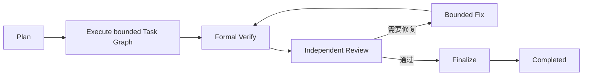

# MVP Agent 团队运行模型

> **Active support/navigation.** Target authority 是 [Concept](agent-architecture.md)、[Execution](systems/execution/project-execution-system.md) 与 [Evidence](systems/evidence/evidence-system.md)；Contract revision split —— [Observation Catalog](contracts/observation/observation-catalog.zh-CN.md)、[OTel Observation Profile](contracts/observation/otel-observation-profile.zh-CN.md)、[Execution–Evidence Interaction Contract](contracts/execution-evidence/interaction-contract.zh-CN.md) 与 [Metric Catalog](contracts/evaluation/metric-catalog.zh-CN.md) —— 仍为 draft，不能证明 physical conformance。若本文其余历史/操作说明与这些 owner 冲突，以 owner 为准；legacy material 只能作为明确标记的 legacy evidence 被发现。

- 状态：概念设计已确认
- 上层依据：[`agent-architecture.md`](agent-architecture.md)
- 执行系统：[`systems/execution/project-execution-system.md`](systems/execution/project-execution-system.md)
- 范围：正式 Role、权力边界、Expert 分层、用户边界和固定交付骨架

## 1. 运行原则

团队遵守：

- 多视角生成，单点裁定；
- Core 管内部一致性，Agent 完成语义任务；
- 用户任务非必要不限制；
- 用户不为普通 continuation 负责；
- 一条用户语义指令对应一个 Delivery，后续语义指令创建新的关联 Delivery；
- 一个正式 Action 只有一个最终 Role Result；
- 新 Action 使用新 session；
- 需要延续的信息必须进入结构化 State、Finding、Decision 或 Artifact。

## 2. 正式 Role

| Role | 职责 | 不拥有的权力 |
|---|---|---|
| Planner | 形成 Task Graph、验收条件、Route Request、Replan 和模糊 Expert 激活判断 | 物理 Binding、治理提交和用户保留决定 |
| Engineer | 完成实现及用户任务，产生候选 Artifact | 审查自己的交付 |
| Reviewer | 独立审查明确 Artifact，产生结构化 Finding | 直接修改被审 Artifact |
| Scout | 只读检索和取证 | 技术裁定、实现和 Review |
| Domain Expert | 按领域提供分析、方案、证据和反证 | 治理裁定 |
| Technical Arbiter | 对边界明确的技术争议作出唯一裁定 | 用户保留的产品、权限和不可逆风险 |

入口不是正式 Role。VS Code Copilot custom agent、Codex skill 或 CLI 只负责生成
`StartDeliveryRequest` 并渲染 Agent Ops Output Channel。有效请求产生前的聊天不
进入 Delivery Trace。

Verify 是确定性系统工作，不是语义 Role。

## 3. Expert 激活与唯一裁定

Role 不能直接召集 Expert，只能提交结构化 Expert Activation Request。Core 使用
确定性三级门：

- 明确拒绝：重复、越权、字段不完整、超预算或递归召集；
- 明确同意：固定 Policy 已声明的争议或耗尽条件；
- 模糊：创建有界 Planner Triage Action。

Planner 只提出是否创建 Expert Task，Core 仍校验预算和不变量。Domain Expert 可以
有多个，结论不投票。出现需要统一技术决定的争议时，只能有一个 Technical Arbiter
Result 进入 Core。

Arbiter 必须使用独立 Action、execution、session 和 Agent Definition，只读取各方
结构化主张、Finding、证据和 Artifact。默认优先使用不同 `model_lineage`，但是否
作为硬约束由 Project Policy 和 Core 的独立性关系决定；Configuration Manager 只校验
当前唯一 Binding 是否满足 Core 给出的闭合约束。

## 4. 固定交付骨架

MVP Policy 由代码内置和版本化，只定义：

Planner 可以在 Task Graph 中规划用户指令明确要求的代码、Git、PR、部署、文档或
其他内容。任务语义由 Agent 解析；Core 不为每种任务建设专用状态机，不跟踪或自动
撤销远端业务副作用。

Task Graph、Replan、Fix 和 Expert 都有代码可判断的次数、规模或资源上限。额度耗尽
后进入等待或终态，不形成无限循环。

默认只强制最终集成 Snapshot 的 Formal Verify 和 Independent Review。高风险 Task
可以显式增加中间检查，但每个 Task 不默认产生 Review 门。

## 5. Review 与 Finding

Reviewer 使用独立 Action、execution、session、Prompt 和 Agent Definition，不继承
Engineer 隐藏对话。底层 Model 可以相同；Team Config 默认推荐非同源模型交叉审查，
深度用户可以通过 Project Policy 对特定 Role-scoped logical route 设置跨谱系要求；Core
负责跨 Action 比较，Configuration Manager 只机械校验当前 Binding。

Finding 必须结构化表达类别、严重度、Artifact、位置、是否要求修复和处置状态：

- Blocking：必须修复或由 Arbiter 判定 Finding 不成立；
- Major：必须修复或由 Arbiter 接受风险；用户保留风险升级给用户；
- Minor：不阻断 Finalize，但必须展示；
- 所有 Finding 都必须有终态。

Artifact 改变后形成新 Snapshot，旧 Verification 和 Review 不自动继承。

## 6. 用户边界

Agent 不能直接展示语义问题并停止循环，只能返回结构化 User Boundary Request。
Core 允许真实需求缺口、用户保留产品决定和不可逆风险；拒绝“是否继续”“下一步做
什么”等普通 continuation。

Runtime 原生、结构化的工具授权提示可以直接展示。Adapter 将结果转为 Native Tool
Grant。
受管 worktree 和系统分配临时目录内的普通文件 CRUD 默认可以自动批准；外部目录、
网络、凭据和未预授权副作用按 Tool Policy 与 Runtime 原生权限处理。

Agent Ops 不保存完整用户对话，只持久化当前 pending User Boundary Request 及回答。IDE adapter
断开后可以重新查询并渲染。

用户对 pending User Boundary Request 的回答恢复当前 Delivery。除此之外，用户发出
的修改、回退、发布或其他语义指令都创建新的关联 Delivery，不扩展或回退原 Delivery。
中途打断先把当前 Delivery 取消到安全本地边界，下一条指令仍属于新的 Delivery。
Review 通过且确定性 Finalize 完成后，Delivery 自动进入 Completed；这与成熟的对话式
Agent 一致，表示该条指令执行结束，不表示用户作出额外验收承诺。

Finalize 只做本地系统收尾。它若改变 Git tree，旧 Verification 和 Review 失效并
重新执行。push、PR、merge、部署和远端回退若属于用户指令，只是普通 Role Action。

## 7. Runtime 内部 Agent

Runtime 可以在一个正式 Action 内组织 subagent、对抗 Agent和辅助计算。内部活动
可以写入受管 worktree，但仍属于外层 execution 的唯一 lease，并汇总为一个最终
Role Result。

Binding 可以配置内部写入和 managed-child containment 要求；字段缺省时采用宽松
模式。无法确认内部活动已停止时返回 execution unknown，不能封存正常 Artifact。
