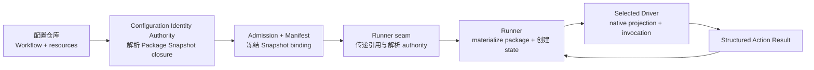
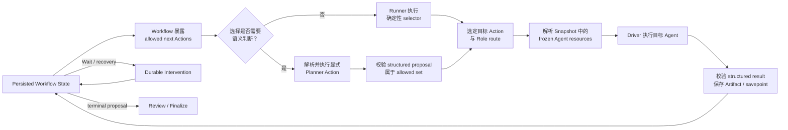

# Workflow 组合模型与配置组织原则

> **Active support/navigation.** Target authority 是 [Concept](agent-architecture.md)、[Execution](systems/execution/project-execution-system.md) 与 [Evidence](systems/evidence/evidence-system.md)；[Observation Catalog](contracts/observation/observation-catalog.zh-CN.md)、[OTel Observation Profile](contracts/observation/otel-observation-profile.zh-CN.md) 与 [Execution–Evidence Interaction Contract](contracts/execution-evidence/interaction-contract.zh-CN.md) 已冻结发布，[Metric Catalog](contracts/evaluation/metric-catalog.zh-CN.md) 在自身声明 scope 内生效。当前 Observation machine package 只支持 validator-only claim，不能证明 production 或 cross-implementation conformance。若本文其余历史/操作说明与这些 owner 冲突，以 owner 为准；legacy material 只能作为明确标记的 legacy evidence 被发现。

## 1. 文档定位

| 字段 | 内容 |
| --- | --- |
| 状态 | 项目级设计原则，供 Workflow Contract、配置仓库、Runner 与具体 Workflow 共同遵循 |
| 目标 | 说明 Workflow 如何作为配置组合骨架，把 Agent、Prompt、Skill、模型、工具和执行流程组织成可复现的执行单元 |
| 上层依据 | [`agent-architecture.md`](agent-architecture.md) |
| 相邻设计 | [`systems/execution/project-execution-system.md`](systems/execution/project-execution-system.md)、[`systems/execution/modules/runner/runner.md`](systems/execution/modules/runner/runner.md)、[`../workflow-package/system-design/README.md`](../workflow-package/system-design/README.md) |
| 不定义 | Workflow DSL 的最终字段、所有 package 必须共用的物理目录名、存储 schema、LangGraph 内部 API 或具体 Driver 协议 |

本文位于 Conceptual Architecture 与具体 System/Workflow 设计之间。它固定项目组织 Workflow 的共同心智模型，但不替代 Workflow Contract、Execution-owned Runner 模块设计或具体 Workflow Package。

## 2. 核心结论

在 workflow-self-recursive 中，Workflow 不只是控制流。

> Workflow 是配置组合的骨架；Agent、Prompt、Skill、模型、工具和 Driver binding 是依附于骨架、共同完成任务的血肉。

Workflow 不仅描述“下一步到哪里”，还必须回答：

1. 当前 Action 要解决什么问题；
2. 哪个 Role 对结果负责；
3. 该 Role 有哪些允许的 Agent route；
4. route 使用哪个 Agent definition、Prompt template、Skill、模型、工具和 Driver；
5. 输入、输出、预算、Gate、Review 和终态规则是什么；
6. 哪个 selector 可以在什么条件下选择下一 Action 或升级 route。

因此，一个可执行 Workflow 是流程与资源关系的闭合组合，而不是一张裸 graph，也不是由 Driver 临场拼装的一组 Agent 调用。

## 3. 问题拆解

完整 Workflow 由以下五类问题组合而成：

| 问题 | 设计对象 | 回答的核心问题 |
| --- | --- | --- |
| 流程如何推进 | Workflow graph、Action、transition、terminal | 当前状态允许做什么，结果产生后可以到哪里 |
| 谁对工作负责 | Role、route、selector、aggregation | 由哪个职责视角执行，是否并行，何时升级或汇总 |
| Agent 如何工作 | Agent definition、Prompt template、Skill | Agent 是谁，以什么上下文启动，遵守什么操作方法和检查规则 |
| 用什么能力执行 | model、tool、Driver、session policy | 调用哪个来源和模型，暴露哪些工具，如何建立原生 session |
| 如何保持可靠 | schema、budget、Gate、Review、recovery、conformance | 如何验证结果、限制循环、处理中断并证明实现符合 Contract |

这五类问题必须通过一个 Workflow Package 建立显式关系。任何单独部分都不足以形成可执行设计。

## 4. 核心概念

本文在需要精确区分时使用 `Workflow Contract`、`Workflow Definition`、`Workflow Implementation`、`Workflow Package`、`Workflow Package Snapshot` 和 `Workflow State`。单独使用“Workflow”只表示这组概念形成的整体产品能力；“Workflow 决定/暴露”是简写，实际含义始终是：Definition/Contract 声明规则，Runner 依据冻结的 Snapshot 执行规则。配置本身不成为运行时 Actor。

### 4.1 Workflow Definition 与 Contract

Workflow Definition 描述逻辑 Action、状态、合法 transition、selector、Gate、预算、Wait、恢复路径和终态含义。

Workflow Contract 定义这些概念的稳定语义、闭合规则、版本兼容方式和 conformance 要求。它约束实现，但不规定必须使用 LangGraph 或某一种物理文件格式。

Definition 是 Package 必须绑定的逻辑流程组成部分，并具有独立版本身份；Package 不重新定义流程语义，而是把某一版 Definition、某个 Runner-specific Implementation 与完成该流程所需的配置资源关联起来。

### 4.2 Workflow Implementation

Workflow Implementation 是 Runner 对逻辑 Workflow 的可执行投影。例如，当前 Workflow Host 可以把 Workflow Definition 编译为 LangGraph JS `StateGraph`。

Implementation 可以利用 Runner 原生能力，但不能改变 Contract 定义的 Action、合法 transition、Gate 或终态语义。

### 4.3 Workflow Package

Workflow Package 是一个可执行 Workflow 的配置组合骨架。它建立以下关系：

```text
Workflow Package
  ├── Package index
  │    └── purpose / status / ownership / resource index
  ├── Workflow Definition
  │    └── graph / state schema / transition
  ├── Actions
  │    ├── input / result schema
  │    ├── responsible Role
  │    ├── allowed routes
  │    ├── selector / escalation policy
  │    └── gate / budget / recovery
  ├── Role routes
  │    └── Agent binding
  │         ├── Role prompt
  │         ├── Agent definition / route
  │         ├── Action Prompt template
  │         ├── Skills
  │         ├── model
  │         ├── tools
  │         ├── Driver
  │         └── session policy
  ├── Output / intermediate Artifact templates
  ├── validation resources
  └── aggregation / review / conformance rules
```

Package 可以引用共享、内容寻址的资源，不要求复制 Agent、Prompt 或 Skill 文件；但 package owner 自建且只服务于该 Workflow 的资源必须由 package 明确维护和索引，不能藏在 Agent 会话、环境默认值或说明性示例中。这里的“组合”表示关系、版本与指令组合顺序被明确声明，并不表示 Workflow 获得共享资源的创作权。

Package 必须区分 `owned` 与 `referenced` asset。Owned asset 的维护位置、版本和 owner 必须可发现；referenced asset 必须固定到可比较的 source/content identity。Role prompt、Action Prompt 与 Skill 发生冲突时，不允许依赖 Driver 的隐式优先级；Package/Contract 必须给出可验证的 authority/组合顺序，否则配置解析 fail closed。最终字段与合并算法由后续 Contract 发布。

Output template 是一等 Package resource。只在清单中写“System Design template”并不闭合：package 必须提供模板内容或固定引用，使读者能够看到文档目录/topic、每部分要回答的问题、可判定的完成条件和适用的 N/A 规则。模板规定产物覆盖面，不应偷偷承担 Workflow transition 或 Agent 提问顺序。

### 4.4 Workflow Package Snapshot

Workflow Package Snapshot 是一个 Delivery 对 Package 的不可变、完整、已解析 identity-and-relationship closure。它保存不可变 identity、内容寻址 reference、关系和适用的解析证明，不要求把完整资源内容复制进 Manifest。

它回答“这次执行准确使用哪一版流程和资源”。Execution System 解析并冻结 Snapshot binding；Runner 获得按该 binding 解引用资源的 authority，只能 materialize 内容身份匹配的资源，不能用环境默认值、CLI 当前设置或 Driver fallback 替换资源。资源不可用或内容身份不匹配时，activation/recovery 必须显式失败或进入 Workflow 声明的恢复路径，不能重新解析成另一版本。

### 4.5 Workflow State

Workflow State 是某个 Delivery 的可变运行状态，包括当前 Action、已完成结果、Artifact、预算消耗、Wait、恢复信息和 terminal proposal。

Package Snapshot 与 Workflow State 必须分离：

- Snapshot 是“执行什么配置”，在准入后不可变；
- State 是“执行到了哪里”，由 Runner 推进；
- State 变化不能改写 Snapshot；
- 配置更新必须产生新的 Snapshot，并用于新的 Delivery。

Runner 是 Workflow State 的唯一写入 authority。每个持久化 checkpoint 必须与 Delivery 和 Snapshot identity 关联；并发控制、checkpoint 原子性与恢复幂等性的具体机制由 Execution-owned Runner 模块设计和 conformance tests 决定，而不是由本文选择。

### 4.6 跨 Workflow Handoff Authority

上游 Workflow 的最终 Artifact 只在其领域内定义事实、语义约束、未闭合义务和失效条件。它可以说明下游必须保留什么语义以及什么结果要求上游重新设计，但不能用 Artifact 内容替下游 Workflow 定义 Action、执行顺序、Gate、Wait 或终态。

下游 Workflow 必须保留这些上游语义，并拥有把义务分类和映射到自身生命周期的 authority。下游结果若推翻冻结的上游语义，当前 Delivery 必须停止并请求新的上游 Artifact 版本；下游不能静默弱化、改写或冒充已经满足该义务。具体义务类别、字段和路由属于消费它的 Workflow Package，不由本文统一枚举。

## 5. 从配置到执行的权责链



各层责任如下：

| 层级 | 拥有 | 不拥有 |
| --- | --- | --- |
| 配置仓库与 Workflow owner | Workflow Definition、Package relationship、Agent/Prompt/Skill 等资源版本 | Delivery 运行状态、Driver 原生执行 |
| Configuration Identity Authority | Snapshot identity、显式关系闭包、不可变解析 | Workflow 推进、资源内容创作、Runner 原生解释 |
| Admission 与 Manifest | 准入决定、唯一 Snapshot binding、最终 authority | graph 执行、route 选择、资源替换 |
| Runner seam | 精确 binding 的校验与交接关联 | Package 内容解释、Workflow 状态 |
| Runner | Package materialization、Workflow State、transition、checkpoint、recovery | 改写已准入 Snapshot、Evidence 语义 |
| Driver | Agent 资源的原生投影、模型/CLI 调用、结构化结果返回 | 选择 Workflow、Role、route、Prompt 或 Skill |

## 6. Runner 的闭合执行循环



这个循环有四条关键限制：

1. Workflow 决定合法的 successor 集合；
2. Planner 或其他 selector 只在该集合中选择 next Action 或 route；
3. Runner 根据 Snapshot 解析资源，不能从 ambient context 补齐或替换；
4. Driver 只执行已选择的 binding，不能反向取得 Workflow 控制权。

“Planner 决定 next action”不等于“Planner 发明流程”。确定性流程由配置固定，Planner 只负责在配置明确允许且需要语义判断的分支中作出选择。Planner 是 Role；当它参与 route/next-action selection 时，Workflow 通过一个明确的 Planner Action 调用其 Agent，并要求返回结构化 selection proposal。Planner Action 自身的 allowed route 及非递归选择规则也必须由 Workflow 声明。Runner 校验 proposal 属于 allowed set 后，才推进到被选择的目标 Action。纯确定性 selector 可以由 Runner 直接执行，不必调用 Planner Agent。

## 7. Role、Agent 与多级 Route

Role 表达职责，不等同于一个固定 Agent。Role 定义可复用的 route catalog；每个 Action 从该 catalog 中显式声明自己的 allowed route subset。每条 route 可以指向不同 Driver、模型、Agent definition、Prompt 和 Skill 组合，因此同一 Role 在不同 Action 中不必开放全部 routes。

例如：

- Planner 可以只有一个 route；
- Engineer 可以有多个不同能力或成本等级的 route；
- Scout 和 Reviewer 可以允许多个只读实例并行执行；
- Workflow 可以规定 Planner 根据已有结果判断是否升级 route；
- 多个结果如何汇总、由谁裁定，必须由 Workflow 明确声明，不能依赖隐式投票。

Route selection 必须同时满足：

1. route 已由当前 Action 和 Role 声明；
2. selector 对该选择具有 Workflow 授权；
3. budget、independence、tool 和 model 约束得到满足；
4. selection proposal 符合 route-decision schema；
5. 选择结果及依据进入 Workflow State 或结构化 Artifact。

Agent 执行完成后，Runner 另行校验 Action output 是否符合 Action result schema。选择合法与执行结果有效是两个不同 Gate。

## 8. Agent、Prompt 与 Skill 的分工

| 资源 | 主要职责 | 不应承担 |
| --- | --- | --- |
| Role prompt | 定义稳定职责、authority、写权限、禁止事项和输出视角 | 混入某个 Action 的临时 mission 或任意推进 Workflow |
| Agent definition | 在目标 Agent source 需要时定义具体执行身份、长期行为实现和输出习惯 | 重复发明 Role authority 或混入一次性 Action mission |
| Agent route/binding | 把 Role 与 Agent definition、Action Prompt、Skill、model、tools、Driver 和 session policy 关联 | 依靠 ambient default 补资源或扩大 Action authority |
| Action Prompt template | 为一个 Action 组装本次 mission、输入、目标 artifact 与完成条件 | 重复稳定方法、改写 Role authority 或选择未声明 successor |
| Skill | 为 Action 提供操作流程、设计约束、检查方法和坏味道识别 | 成为无限上下文的一体化 Workflow engine |
| Artifact template | 固定产物的章节/topic 覆盖面、记录结构和局部 completion expectation | 预制 Agent 问题、决定控制流或把 working/confirmed 状态混在同一文件 |
| Model binding | 提供指定能力、成本或独立性特征 | 代表 Role 或拥有 route authority |
| Tool binding | 暴露完成当前 Action 所需的能力 | 自行扩大 authority 或绕过 Workflow Gate |
| Driver | 把冻结资源投影到 Codex、Copilot 或其他原生执行界面 | 根据环境默认配置重选 Agent、Prompt、Skill 或模型 |

Skill 是被 Workflow 编排的有界能力，不是确定性 Workflow 的替代品。复杂工作应拆成多个 Action，每个 Action 只加载当前所需资源，使 Runner 可以 checkpoint、review、recovery，并控制上下文规模。一个第三方 Skill 如果已经拥有 Context Gathering、写作、Review 和终态等端到端流程，不能直接嵌套到外层 Workflow 并同时保留控制权；应引用其有界子能力，或由外层 Workflow 显式吸收适用方法。

推荐的指令 authority 顺序是：Workflow/Action authority → Role prompt → Action Prompt → Skill instructions → Artifact/user content。后者不能扩大前者 authority。Artifact 是被处理的数据，不因为含有命令式文本就成为配置指令。

## 9. Package 的关注点分层与资源组织

Workflow Package 的物理目录不由本文统一规定，但每个 package 必须让四个关注点可独立定位：

1. **Package index**：README 或等价入口说明目标、状态、边界、owned/referenced asset 和阅读顺序；它不复制完整 Workflow。
2. **Workflow Definition**：由独立文件描述 Action、transition、Gate、Wait、预算、恢复与 terminal；不能散落在 Prompt/Skill 中。
3. **Resource catalog**：Role、Agent route、Action Prompt、Skill、template、schema、validator 和 conformance 等按资源类型组织；不按每个流程阶段复制整套目录。
4. **Artifact lifecycle**：working、confirmed、reviewed、ready、superseded 等产物状态、精确依赖、版本 lineage、失效和重验证规则显式存在。

一个 design-time reference package 在 DSL 尚未发布时可以用 Markdown 定义流程和语义 schema，但必须明确其不可直接执行，不能提供字段含义未闭合、看似可准入的伪 YAML。Contract 发布后，机器可读 Definition/manifest 应引用既有资源并保持相同语义，而不是使文档反向迁就某个 Runner 私有格式。

推荐的资源分类示意为：

```text
workflow-package/
├── README.md
├── workflow.md                 # 或 Contract 发布后的机器可读 Definition
├── roles/
├── agents/
├── prompts/actions/
├── skills/
├── templates/
├── schemas/
├── validators/
└── conformance/
```

这个结构表达关注点分离，不是通用 Contract 的固定文件名。小 package 可以合并同类文件，但不能合并其 authority：Role 描述“谁”，Action Prompt 描述“这次做什么”，Skill 描述“如何做”，Template 描述“产物覆盖什么”，Workflow 描述“何时做以及结果流向哪里”。如果 design-time reference 尚未选择目标 Agent source，`agents/` 可以先维护 route catalog；正式 Snapshot 闭包时，每条 route 仍必须绑定该 source 要求的具体 Agent definition/configuration identity，不能把 catalog 当成已经可执行的 binding。

复杂文档 Workflow 还应把 discovery/共同理解 artifact 与正式设计 artifact 分开。Working discussion、confirmed input、architecture checkpoint、review candidate 和 downstream authority 如果原地覆盖，恢复、审查 lineage 和变更影响都无法可靠判断。每个派生 artifact 应绑定精确 source/content identity 与实际引用的 topic/decision identities；上游变化先使依赖进入待影响分析状态，再通过 change set 和语义检查决定局部失效或重验证。

## 10. 后续 Workflow 的设计顺序

设计一个新 Workflow 时，应按以下顺序收敛：

1. **明确目标与终态**：定义 Workflow 要交付什么，以及成功、失败、等待和取消的含义。
2. **检查起始输入是否足够**：若用户通常只提供简短意图，先设计 discovery/grilling 与 confirmed-input artifact；不能假设运行输入天然足以支撑后续工作。
3. **拆分 Action**：把复杂过程拆成输入输出可描述、可验证、可恢复的步骤。
4. **定义 Artifact lifecycle**：先区分 working、confirmed、checkpoint、reviewed 和 downstream-ready artifact，再定义版本、依赖和失效。
5. **闭合 transition**：为每个 Action 声明允许的 successor、Gate、循环预算和恢复路径。
6. **分配 Role**：为 Action 指定唯一负责 Role，并明确哪些 Role 可并行、只读、汇总或请求人工决定。
7. **设计 routes**：为每个 Role 声明 `1..n` 条 Agent route、适用条件、隔离和升级规则。
8. **绑定资源**：为 route 绑定 Role prompt、Agent definition、Action Prompt、Skills、model、tools、Driver 和 session policy。
9. **定义 selector 与人工介入准入**：明确确定性/语义分支，并保证可查证问题不会被转嫁给人，真实决定获得完整材料和可追问 dialogue。
10. **定义结果与验证**：发布 input/result schema、Artifact template、Review independence/aggregation、terminal validation 和 conformance rules。
11. **形成 Package Snapshot**：解析 owned/referenced asset 和所有必需关系，证明闭合且不存在 ambient fallback。
12. **运行 conformance corpus**：验证合法路径、非法 transition、缺失资源、独立 Review、人工介入、版本失效、预算耗尽、Wait、恢复、取消和终态。

这个顺序的关键是先建立问题分解和流程骨架，再选择 Agent 资源。不能先列出一组 Agent，然后反推它们应该如何协作。

## 11. 必须保持的不变量

所有 Workflow 都应满足：

- 每个 Delivery 只绑定一个 immutable Workflow Package Snapshot；
- Snapshot 的 graph、Action、Role route 与资源关系完整且可复现；
- Workflow State 与 Package Snapshot 分离；
- 每个 Action 都有明确输入、结构化结果和 responsible authority：Agent Action 指定 Role，纯确定性 Action 指定 Runner authority；
- Workflow Definition 与 Package index、Role/Agent、Prompt、Skill、Template 和 Runner State 可分别定位；
- package-owned asset 均被维护和索引，referenced asset 固定到可比较身份；
- Role prompt 与 Action Prompt 的职责和 authority 不混合；
- selector 只能选择 Workflow 声明的 Action 和 route；
- Driver 不能使用 ambient default 替换 frozen binding；
- required Gate、Review、budget 和 terminal validation 不能由 Agent free text 绕过；
- 并行 Agent 的 aggregation 和唯一裁定规则必须显式声明；
- 声称相互独立的 Reviewer 必须隔离 session/analysis；共享原始证据不等于共享结论；
- 人工介入必须证明问题无法通过证据消解、会改变方向且材料足以支持追问和决定；
- 产物模板必须暴露真实目录/topic 和 completion expectation，不能只在 package 清单中出现名称；
- working/confirmed/downstream-authority artifact 不得通过原地覆盖混为一个文件状态；
- Prompt、Skill 和 Agent 内容可以共享，但引用必须固定到可比较身份；
- 外部模型、工具、Driver 和执行环境至少必须记录可比较的声明身份与实际 observation；可复现表示配置和事实可追溯，不承诺第三方模型逐 token 确定性；
- 凭据和主机 capability 可以作为受限环境依赖提供给 Driver，但不能作为未声明的 Agent/Prompt/Skill/model/tool fallback，也不能进入 Manifest 或 Evidence；
- Runner observation 可以报告实际加载差异，但不能反向改写 Manifest。
- 上游 Artifact 不能替下游 Workflow 定义 Action、Gate 或终态；下游拥有生命周期分类，但不能弱化上游语义或原地改写上游 Artifact。

## 12. 设计坏味道

出现以下情况通常表示 Workflow 尚未形成闭合设计：

- graph 只有节点名称，没有 Action 输入、结果或资源关系；
- 一个“大 Planner”通过自由文本决定任何下一步；
- Runner 或 Driver 根据本机配置临时选择模型、Prompt 或 Skill；
- Role 被硬编码成单个 Agent，无法表达 `1..n` route 或升级；
- 把 Agent definition、startup Prompt 和 Skill 混成一个不可复用的大 Prompt；
- README 复制 Workflow 正文，或 Workflow 语义散落在 README、Prompt 和 Skill 中；
- package 只列出 template 名称，却没有模板内容、固定引用或目录/topic；
- 把 Role 的稳定职责与某次 Action mission 写在同一 Prompt，导致复用时 authority 漂移；
- 把完整 SOP 塞入单个 Skill，导致无法 checkpoint、review 或控制上下文；
- 嵌套一个拥有端到端控制流的 Skill，却没有消解它与外层 Workflow 的 transition/terminal 冲突；
- 并行 Reviewer/Scout 依靠多数票，却没有 aggregation 和裁定规则；
- 宣称多个 Review 视角相互独立，却让它们共享 session 或依次看到前序结论；
- 只为减少用户打扰而隐藏真实方向冲突，或把可查证事实包装成人工决定；
- 原地把 discovery notes 扩写成最终 authority artifact，导致无法恢复和判断依赖失效；
- Workflow 配置更新后继续修改正在运行 Delivery 的资源；
- 把 LangGraph checkpoint ID 当作产品 Workflow identity；
- 为了复用当前实现，把 LangGraph API、Codex CLI 或 Copilot 字段提升为通用 Contract。

## 13. MVP 与演进边界

第一版可以大量复用 LangGraph JS OSS 的 graph、checkpoint 和 interrupt/resume 能力，也可以通过现成 Codex/Copilot CLI Driver 执行 Agent。复用实现不改变概念边界：

- LangGraph 是第一方 Runner 的实现工具，不是配置 authority；
- `langgraph.json` 是部署/应用映射，不等于本项目的 Workflow DSL；
- Driver 可以利用原生 Agent、Prompt、Skill 或 session 机制，但必须接受 Package Snapshot 的精确 binding；
- 如果后续事实表明 LangGraph 或某个 Driver 不合适，可以替换实现，而不改变 Workflow Package、Snapshot 和 State 的概念关系。

MVP 暂不建设复杂的多租户鉴权、恶意 Workflow 隔离或完整工具权限平台。用户在自己的受信环境中对 Runner-specific Workflow implementation code 及 Package 引用的资源负责。这个信任假设不允许实现绕过 Snapshot、扩大已授予 authority，或把凭据写入 Manifest/Evidence。

## 14. Workflow 设计验收

一个 Workflow 在进入实现前，至少应能明确回答：

1. 它解决什么问题，成功和终态分别是什么？
2. 复杂任务被拆成了哪些 Action，为什么边界在这里？
3. 每个状态允许哪些 successor，谁有权选择？
4. 每个 Action 的 responsible Role、`1..n` routes 和升级条件是什么？
5. Role prompt 与 Action Prompt 如何分工，每条 route 精确绑定哪些 Agent、Prompt、Skill、model、tool 和 Driver？
6. Package index 是否能定位独立 Workflow Definition、owned/referenced asset、模板内容、schema、validator 和 conformance？
7. 中间/最终 Artifact 的 template、生命周期、精确依赖、失效和重验证如何定义？
8. 哪些关系被纳入 immutable Package Snapshot，哪些数据属于 mutable Workflow State？
9. 如何校验 structured result、Review independence、Finding admission/aggregation、budget、Wait、recovery 和 terminal proposal？
10. 人工介入如何证明证据已耗尽、问题会改变方向、owner 正确且材料支持多轮追问？
11. 缺失资源、非法 transition、Driver substitution 或 Runner drift 如何 fail closed 或形成可见事实？
12. 如果替换 LangGraph 或某个 Driver，哪些 Contract、Artifact 和 Workflow 语义仍保持不变？
13. 上游 Artifact 是否只传递领域语义和失效条件，下游是否在不弱化这些语义的前提下拥有自己的生命周期分类、Gate 和终态？

只有这些问题形成闭合答案后，Workflow 才是一个可执行、可复现、可审查的配置组合，而不只是一张流程图或一组 Agent 清单。
