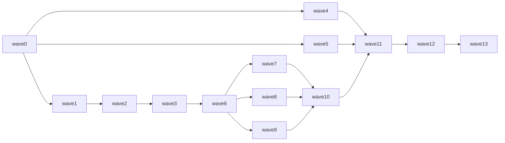

# Iteration 4 实施计划 — 执行计划 (Execution Plan)

> **来源**: iter4 范围卡 #48/#49/#50/#51/#52/#92/#94/#97/#102 · 范围裁决: tmp/20260825/iter4-issues/issues.md · 冲突分析: tmp/20260825/iter4-issues/evidence-conflicts.md · 计划评审: 2026-08-25 DAG/退出条件/并行边界评审 · 2026-08-26 #102 范围/发布窗口重校准
> **当前 wave**: wave12 · **上次执行**: Contract RC `evidence-query-0.1.0-rc.1` 已由 Actions run `32986502152` 发布并独立下载验证，tag target `dc8a50e92eebfc35bd706579ff2bf5e9beb57782`，gate.1–6 PASS；Execution/Evidence exact candidates 均不失效 · **下一步**: 等待 A2 owner approval 后原子应用预生成 FROZEN/register/publication-record transition；尚未 merge、stable、npm 或 GHCR stable
> 执行模式：Iter4 全程使用同一 `iter4/implementation` feature branch，按 wave 提交并推送检查点；全部产品实施与 RC 资格验证完成后，在 Wave12 执行唯一一次 component-first squash merge/repin，再作 stable promotion，Wave13 只负责最终复验与关闭。Wave5/Wave10/Wave11 前置均已 PASS；当前剩余路径为 wave12→wave13。原发布 Wave11 因插入 #102 顺延为 Wave12。

<!-- 「当前 wave」指针指向编号最小的、尚未集成且可执行的 wave；其他并行 wave 的状态由 checkbox 与独立 wave report 表达。plan.md/指针/checkbox 只由主协调者更新。 -->

## 1. 目标与完成判定 (Goal & Completion)

完成 Iteration 4：交付 Evidence 数据仓库首版（#48–52）及其已发布的 `evidence.query` 契约，恢复 #92 WSR 全组件自动发布能力，完成 #94 设计与 #102 Session/Delivery/Worktree 产品实施，并完成 #97 Evidence 设计修订。

完成判定（以下条件全部满足，不表达彼此先后）：

- #48–52 的逐项验收、集成回归与部署/恢复 oracle 全部通过；
- `evidence.query` 语义文档与机器表示按 Contract Lifecycle contract.gate.1–6 成对达到 `FROZEN`，publication binding 可复验；
- Evidence 首版与 Execution 双包通过 #92 流水线完成 RC → qualification → component-first squash/repin → stable，stable assets/digests 与已验收 RC 完全一致；
- #92 的通用流水线在四个独立发布组件上完成配置/预发布 oracle，并以 Wave12 的 system-contracts、Execution 双包与 Evidence 统一发布证明真实闭环；
- #94 设计权威保持不变；#102 全部实现级验收通过，`wsr-execution@0.1.3` / `wsr-dsh-intake@0.1.3` 锁步发布且不会拆成两个连续版本；
- wave13 对账确认 #48–52/#92/#94/#97/#102 全部关闭，所有组件 commit、super repo 子模块指针、release/tag 与 evidence report 一致。

## 2. 动因与证据 (Motivation & Evidence)

- iter4 的范围为 Evidence 五卡 + #92 + #94 + #97 + #102。#94 是已关闭的设计权威；2026-08-26 Owner 明确批准 #102 在统一发布 wave 前进入 Iter4，以避免 Execution 因同一变更窗口连续发布两个版本。
- Evidence 设计仍是旧目标态；#97 先完成 C1–C7 修订。`evidence.query` 是 #50 的契约产物，但不因“不另立卡”而省略 Contract Lifecycle 的语义/机器/发布门。
- Admission 与 Projection 共享一条 PostgreSQL 事务，合并为同一实现 wave；API、Retention、机器契约只有在共同的 query/expiry 边界冻结后才允许并行。
- #92 在发布准备 wave 只达到 implementation-ready；其真实发布验收及关闭必须等 Wave12 的统一发布，避免验收死锁。
- 证据: tmp/20260825/iter4-issues/issues.md · tmp/20260825/iter4-issues/evidence-conflicts.md · docs/contracts/contract-lifecycle.md · 卡片 #48–52/#92/#94/#97/#102 正文

## 3. 范围与拆分方案 (Scope & Decomposition)

### 子目标 (Sub-goals)

- **子目标 1（设计与权威对齐）**: 按 C1–C7 修订 Evidence/Concept 设计并关闭 #97；同步清理“查询契约是否另立三卡”的来源冲突。方案：契约工作仍由 #50 跟踪，不另建 definition/schema/publish issue，但语义文档、机器表示、独立评审和发布绑定一个不少。
- **子目标 2（Evidence 实现基线）**: Evidence 仓库当前只有设计 README，实施前先裁决 runtime、依赖、项目布局、PostgreSQL access/migration、测试和部署工具链。方案：wave2 形成经用户批准的 immutable implementation baseline，后续 subagent 不得自行换栈或新增未批准依赖。
- **子目标 3（Evidence 核心）**: #48 Admission 与 #49 Projection 合并在 wave3 内实现。方案：由同一 subagent/branch 拥有事务边界、accepted identity、初始投影、schema/migrations 与原子回滚 oracle，消除“最小 Projection stub”交接歧义。
- **子目标 4（查询契约与并行分叉）**: wave6 先产出 `evidence.query` 语义契约候选、query/expiry truth table、read-model 接口和 retention defaults；其后 API、Retention、机器契约三个 wave 才可并行。
- **子目标 5（发布自动化）**: wave4 交付与实现语言无关的 release lifecycle core、按实际生态选择的 publisher adapter 及预发布 oracle；Execution 使用 npm/DSH adapter，Evidence 使用 Python/deployment adapter，system-contracts/workflow-package 使用各自既有资产模型，Evolution 只预留参数化能力。wave12 用 system-contracts、Execution 双包与 Evidence 的真实统一发布完成 #92 验收。
- **子目标 6（Execution 设计与实施）**: wave5 已完成 #94 的 authority、绑定模型、状态机、恢复 oracle 和实现级验收细化；Wave11 按该设计实施 #102、完成全量资格验证，并生成锁步 `0.1.3` immutable candidate，外部发布留给 Wave12。

### 并行执行与交付协议 (Parallel Execution & Handoff)

- **启动语义**：DAG 边是唯一前置事实源；“启动批次”不形成额外 barrier。依赖完成并由协调者集成后，下游即可启动，不必等待无路径的并行 wave。
- **单点协调**：主协调者独占 `plan.md`、头部指针、checkbox、全部 GitHub issue 正文/状态/关闭动作、integration branch 与 super repo 子模块指针。subagent 只能提交 issue 正文 patch 建议，不得直接写外部状态。
- **worktree/分支**：整个 Iter4 在各相关仓库沿同一 `iter4/implementation` feature line 顺序推进；每个 wave 至少一个 commit 并推送保存。Wave12 仅在全部产品实施、contract gate.1–4、RC/prepublish qualification 均 PASS 后，按 component-first 顺序执行本 Iter4 唯一一次 squash merge/repin；不得逐 wave squash 或另建独立 wave feature。
- **component-first 集成**：wave checkpoint 只提交到 Iter4 feature line 并精确 repin；不得提前 squash 入主干。Wave12 的最终合并按 component candidate → component main → super repo repin/main 顺序执行，stable promotion 必须在对应 squash/main 与 repin 复验后，Wave13 不再引入产品提交。
- **路径所有权**：每个 wave 只能修改下表 owned surface；发现必须跨入 forbidden/shared surface 时触发退出条件，不得通过“顺手重构”扩大范围。
- **wave report**：subagent 返回结构化 report payload；主协调者是唯一 report writer，将其核验并写入 `tmp/20260825/iter4-implementation-plan/evidence/waveN.md`。报告至少记录 `inputs`（repo+SHA+契约 revision/input-manifest digest）、`outputs`（repo+branch+commit）、`executor`、`oracle reviewer`、`report owner`、`merge owner`、修改路径、执行命令/exit code、fixture/oracle 结果、artifact digest、外部 URL、未决事项。协调者核验后才合并和勾选完成。

| wave | owned surface | 明确禁止/共享边界 | 核心交付 |
|---|---|---|---|
| wave0 | `super:tmp/.../evidence/wave0.md`（协调者写）；其余只读 | 不改产品/契约/issue | baseline manifest（仓库 SHA、卡状态、权限与环境前提） |
| wave1 | `super:docs/systems/evidence/**`、`super:docs/agent-architecture*`、`super:tmp/.../issues*.md`；#50/#55/#97 只产出正文 patch 建议 | 不改 FROZEN 契约、子模块代码或直接写 issue | 批准后的设计 commit + 权威一致性记录 |
| wave2 | `evidence-system:<baseline 指定的 root build/scaffold/test/migration-tool paths>`；`super:docs/systems/evidence/<implementation-baseline>` | 不实现 #48–52 业务语义；不得修改 wave0 保留的任何 release CLI/template/config/workflow path | 经批准的技术栈、精确 `repo:path` 映射、依赖锁定、命令清单 |
| wave3 | `evidence-system:<wave2 映射的 admission/projection/core-storage/schema/migration/test paths>` | 不改 query/retention/release paths | #48+#49 原子核心及稳定 read-model 输入 |
| wave4 | wave0 baseline manifest 为 execution-system/evidence-system/system-contracts/workflow-package 逐仓库保留的精确 `.github/workflows/release*`、release core/adapter CLI/template/config paths；`super:docs/guides/<release docs>` | 不改产品 `src/**`、Evidence schema/migrations、plan/子模块指针或 wave2 scaffold paths；不得把 npm/DSH 约束强加给非 Node/DSH 组件 | release-ready core + ecosystem adapters + 无秘密的 App/npm 身份 attestation |
| wave5 | `super:docs/systems/execution/<#94-design>`；#94 只产出正文 patch 建议 | 不改 execution-system 产品代码或 `docs/agent-architecture*`（需要时在 report 提案） | 用户批准的设计与后续实施边界 |
| wave6 | `super:docs/contracts/evidence-query/**`、`evidence-system:<wave2 预留 shared query/read-model interface paths>` | 不实现 API/retention；不写 system-contracts | REVIEW_CANDIDATE 语义、状态表、接口、defaults、版本 |
| wave7 | `evidence-system:<wave2 预留 API paths + API tests>` | 不改 wave6 契约、retention、core schema | #50 API implementation candidate |
| wave8 | `evidence-system:<wave2 预留 retention paths + retention tests>` | 不改 wave6 契约、API、core schema | #51 retention implementation candidate |
| wave9 | `system-contracts:evidence-query/**` | 不改语义文档、Evidence 产品代码 | 独立推导的 schemas/fixtures/validators/version policy |
| wave10 | `evidence-system:<wave2 预留 deployment/config/backup/restore/integration-test paths>`；基点为协调者合并 wave7/8/9 后下发的精确 SHA 集 | 不改变 wave6 接口/契约语义；subagent 不执行合并/repin | 集成 candidate、#52 oracle、immutable release manifest |
| wave11 | `execution-system:packages/dsh-intake/src/{binding-repository.js,index.d.ts,plugin.js}`、`src/bootstrap/{contracts.ts,production.ts}`、`src/core/{request.ts,execution-core.ts}`；必要时仅触及 `src/delivery/{manifest.ts,admission.ts,current-slot.ts}`；相关 tests、双语 docs、版本/changelog/release candidate metadata | 不改 FROZEN contracts、Runner 五模块、Evidence、public `execute`/`inspect`/`cancel` 语义；不新增第三份 durable truth/cross-store transaction；不得产生外部发布状态 | #102 实现、全量资格验证、锁步 `0.1.3` immutable candidate 与统一 manifest |
| wave12 | 协调者专属：system-contracts、Execution 双包、Evidence 的 release/tag/Actions/npm/DSH 外部状态；`super:docs/contracts/evidence-query/*` 状态元数据、`super:docs/contracts/README*` register、`system-contracts:evidence-query/publication/**` | 不改已批准语义/产品代码；失败后不得重建 RC assets | 契约 FROZEN、Execution `0.1.3` 双包 stable、Evidence stable、#92 真实验收 |
| wave13 | 协调者专属：plan 状态、issue 关闭、最终报告；component main 与 super repo pins 仅只读核验 | 不新增功能、不改产品、不再 repin | Iter4 closure report 与全卡关闭 |

### 非目标 (Non-goals)

- 不重做或修改 iter1 FROZEN 契约底座（observation 三件套 / evaluation / workflow）。
- 不新建独立 `evidence.query.definition/schema/publish` issue；但必须在 #50 下完成完整 Contract Lifecycle，不能推迟机器表示或 publication binding 到 Iter5。
- 不扩大 #102 已批准的设计与 owned paths。`wsr-execution@0.1.2` / `wsr-dsh-intake@0.1.2` 是不可变外部基线，不重发、不覆盖；本轮只生成并发布一个新的锁步坐标 `0.1.3`。
- #87 真实领域 Validator、#93 新工作、#84/#85 Provider Adapter 不进入本计划；#93 仅作为 #102 必须替换的 provisional 基线。
- Iter5/6 的 bi/evolution/#56 实现不进入本计划；唯一例外是按 C7 对 #55 做既定文字澄清，不新增其验收义务。
- Evidence 侧 UI 托管/Grafana 代理、应用层认证、指标公式、因果推断、内容取证不进入本计划。
- `wsr-evidence@0.0.1` / `wsr-evolution@0.0.1` 仅为 npm `NAME_RESERVATION_ONLY`，不决定 Evidence/Evolution 的实现语言、功能版本或发布生态。Evidence 当前语言方向为 Python，其最终发布形态由 wave2 冻结；Evolution 不做实际发布，#92 只预留其参数化能力。BI 若后续采用 React/Node，可在其实施迭代复用 npm adapter，本轮不实现。

### 授权 (Authority)

- **已预授权**：按 wave1 已批准语义创建 `evidence.query` 语义文档和机器表示；按 wave2 经用户批准的依赖/工具链实施；按 2026-08-26 Owner 决策在 Wave11 实施 #102 并把 Execution/Intake 锁步升级到 `0.1.3`；wave12 在 gate.1–4 与发布前检查通过后发布指定 system-contracts revision、完成 gate.5–6/owner approval/FROZEN 后统一发布 Execution 双包与 Evidence；按 C7 澄清 #55 文字。
- **外部管理动作**：GitHub App 创建/安装、Actions variables/secrets、npm trusted-publisher/token 配置或 rotation 不由本计划默认授权。wave0 记录 GitHub App 的精确仓库边界与命名授权；npm CI 发布身份在 wave4 以无秘密 attestation 单独裁决。只有主协调者/用户可执行外部配置，subagent 只提供脚本、文档和不含秘密的验证结果。
- **必须请示**（触发即停，列选项等待人工）：
  1. 改动任何 FROZEN 契约、已批准 query 语义、wave2 技术基线或共享接口；
  2. 新增 wave2 未批准的 runtime/package/service 依赖，或改变存储/部署/发布拓扑；DAG 依赖调整也必须修订本计划；
  3. 超出 #102 已批准范围的 Execution 产品改动，改变 `0.1.3` 锁步坐标，或把 Execution 拆成多个发布版本；
  4. 触碰非目标，或评审结论要求扩大边界/违背既有权威；
  5. 上游 commit、契约 revision、schema、接口或 oracle 被下游证伪；
  6. wave12 的发布对象/revision/asset manifest 与已批准输入不一致，或需要 break-glass/PAT。

## 4. 影响与依赖 (Impact & Dependencies)

### 4.1 依赖 DAG（文本边列表为事实源；无路径关系的 wave 并行）

- wave0 -> wave1
- wave0 -> wave4
- wave0 -> wave5
- wave1 -> wave2
- wave2 -> wave3
- wave3 -> wave6
- wave6 -> wave7
- wave6 -> wave8
- wave6 -> wave9
- wave7 -> wave10
- wave8 -> wave10
- wave9 -> wave10
- wave4 -> wave11
- wave5 -> wave11
- wave10 -> wave11
- wave11 -> wave12
- wave12 -> wave13

### 4.2 影响（结论表，只写结论）

| 受影响对象 | 契约影响 | 传播路径 | 风险（概率×严重度 1–3） | 验证方式 |
|---|---|---|---|---|
| component:evidence | contract-change | wave1→2→3→6→7/8→10→11→12→13 | 2×3 | 设计门 + 原子核心 oracle + API/retention 集成 + 发布 E2E |
| component:contracts | contract-change | wave1→6→9→10→11→12→13 | 2×3 | contract.gate.1–6 + revision/digest/publication binding |
| component:execution | check | wave4/5/10→11→12→13 | 3×3 | #102 TDD + binding/restart/crash/concurrency oracles + full test/type/build/coverage + npm/DSH release E2E |
| component:workflow-package | none | wave4→11→12→13 | 1×2 | 参数矩阵 + dry-run/fail-closed oracle；本轮不实际发布 |
| component:bi | check | wave1→6→9→10→11→12（Iter5 消费前置） | 1×2 | fresh-reader 从契约独立推导机器表示与消费示例 |

## 5. 执行计划 (Execution Plan, wave0..N)

### wave0 — baseline manifest 与前置状态门

- [x] 以 `git submodule status`/各仓库 `git rev-parse HEAD` 记录 super repo、execution-system、evidence-system、system-contracts、workflow-package 精确 SHA；所有必需仓库存在且可读写。
- [x] 在 baseline manifest 中为 execution-system/evidence-system/system-contracts/workflow-package 逐仓库保留精确 release workflow、CLI、template、config、docs 路径；wave2 scaffold 明确排除这些路径，wave4 不得再等待或引用 wave2 路径裁决。
- [x] 以 `gh issue view`/Project #9 核对 #48–52/#92/#94/#97 均 OPEN、ready、Iter4；核对 #93 已闭环且不进入本计划。
- [x] 核对 observation/evaluation/workflow/interaction FROZEN revision、publication record 与现有 conformance 命令；发现的 Observation 1.0.0 原地改写已按 owner 决策修复为不可变 1.0.0 + PATCH Contract 1.0.1，Evaluation exact binding 恢复可复验。
- [x] 核对 GitHub App 创建/安装责任人、Actions secrets/variables 可配置性与发布权限；用户 `firestige` 已授权 App 的仓库边界为 superproject 与全部五个 submodule（六仓库 allowlist），并批准最小权限及 `WSR_RELEASE_APP_ID` / `WSR_RELEASE_APP_PRIVATE_KEY` 名称；实际安装按各 wave 所需仓库渐进执行，report 只记录非秘密 attestation。
- [x] 记录当前 worktree 未提交修改及 owner，确认各 wave 不覆盖用户已有改动。
- [x] 历史首次冻结时，`evidence/wave0.md` 已包含命令、时间戳、URL、repo SHA、issue 状态、权限前提和 PASS；当前因增量重冻而重新打开，须以本节剩余项关闭后的新 PASS 取代历史结论。
- 退出条件（任一触发即停，等人工）:
  - #93 未闭环、任一必需仓库缺失/不可写、卡片不在预期状态、FROZEN binding 不可复验；不得推迟到发布 wave；
  - 已有未提交修改与计划 owned surface 重叠且无法通过独立 worktree/基点隔离；
  - GitHub App/Actions 管理责任、用户外部变更授权或可用权限缺失，导致 #92 不具备实施前提；
  - 来源权威除“查询契约是否另立卡”这一已知待同步项外出现新冲突。

> 历史注记: 2026-08-25 首次 wave0 曾 PASS。Observation binding 通过 `observation-contract@1.0.1` PATCH 修复：原始 1.0.0 byte-identical 且继续解析，wire Profile 保持 1.0.0，Observation/Evaluation conformance 全部 PASS。该 PASS 后因 npm 命名/版本和绑定文档发生变化而按下节增量重开；不得再据此历史注记启动 wave1/wave4/wave5。

#### wave0 增量重冻（npm 命名与发布准备 delta）

- [x] 重新确认仓库名、remote 与 submodule path 均未变化；npm 名称不是仓库迁移。
- [x] 记录 clean baseline：superproject `3a60c46cf24f74b64d7da945d711bd9dfa9486bd`、execution-system `f095503bd5222af5f966fb7bfdcdb7928fdbb476`、evidence-system `981ba59814553ed27deb28fd8a0ac769c73464c7`、evolution-system `e17eb83ce66caec54275855c7970725be59b8598`、system-contracts `0468996bdf5f5a2d0a0e95d6dde00911e051522c`、workflow-package `760c8fc6b9d547e21fd020cedaafa38b68880b9d`。
- [x] 冻结 npm 外部状态：`wsr-execution@0.1.2` / `wsr-dsh-intake@0.1.2` 为已发布手工迁移基线且 lockstep；`wsr-evidence@0.0.1` / `wsr-evolution@0.0.1` 为 `NAME_RESERVATION_ONLY`，不作为功能 release 或生态选择证据。
- [x] 将 `dsh-plugin-listing/checklist.md` 限定为 `wsr-dsh-intake` DSH 合规及 Execution Node/npm 配套；7 个迁移项恢复为 wave4 未完成，并把 `release-operations-handbook.md` 定位为 Execution npm/DSH adapter 输入。
- [x] GitHub App 仓库授权按“superproject 与全部 submodules”解释为六仓库 allowlist：`workflow-self-recursive`、`execution-system`、`evidence-system`、`evolution-system`、`system-contracts`、`workflow-package`；Evolution 本轮不实际安装/发布也不扩大权限。
- [x] 关闭 Observation 1.0.1 semantic binding 对 `project-execution-system.md` 的单文件 digest drift；未改写 1.0.1，已按批准发布非语义 Contract `1.0.2`，wire Profile 保持 `1.0.0`，Evaluation/CI exact resolution 恢复。
- [x] 重跑 Observation/Evaluation/Workflow/Delivery Contract、root CI、plan lint 与 exact registry/release-state oracle；增量输入、首次 CI timeout/同 SHA 恢复和最终 PASS 已写回 `evidence/wave0.md`。

> 当前结论：Wave0 增量重冻 PASS。最终 superproject `d45ba72309e826a54ca577500ab5eb6c64f06ae7`、system-contracts `9e6ba782b742f49f3d2392c9af37ebd4ff328bc8`；Observation `1.0.0`/`1.0.1` publication 保持不可变，`1.0.2` exact binding 与 main CI `32859941938` PASS。wave1/wave4/wave5 按 DAG 解锁。

### wave1 — Evidence 设计修订、权威同步与 #97 关闭

- [x] 修订 `evidence-system.md` §2/§4/§5/§9/§10/§11：数据仓库目标态、M03=Query & API、`expire` 归属、loopback-only 数据服务、纯 API 拓扑、无 UI 托管。
- [x] 修订 `agent-architecture.md` §5/§8：架构图、obligation.004、acceptance.010/013 owner；保留无公式/无推断/只读/provenance/expiry 约束。
- [x] 英文权威完成后同步 zh-CN 同伴，并通过文档确定性/parity 检查。
- [x] 在设计中关闭 query 语义输入：有界过滤、稳定排序与分页、四态 completeness、availability/expiry、兼容坐标、应用层无认证与内部运维只读/恢复写角色分层。
- [x] 同步 `issues.md`、`evidence-conflicts.md` 与 #97：不另立三卡，#50 完成语义+机器、wave12 完成 publish binding，消除来源自相矛盾。
- [x] 按 C4/C7 将 #50/#55 既定文字写入 issue；#55 仅文字澄清，不改变 Iter5 范围。
- [x] 用户批准 commit；独立 fresh-reader 首轮 B1–B5 修正后复核 PASS；#97 evidence 齐全并关闭。
- [x] `evidence/wave1.md` 记录批准 commit、全部文件/issue URL、review disposition 与验证命令。
- 退出条件（任一触发即停，等人工）:
  - 出现 C1–C7 之外的新语义冲突，或既定裁决无法在不修改 FROZEN 契约的前提下表达；
  - 评审要求 UI 托管、应用层认证、公式/推断、外部 DB listener 或其他非目标；
  - 英文/中文同伴、设计/issue/账本无法形成同一权威结论。

### wave2 — Evidence implementation baseline 与仓库 scaffold

- [x] 以已确认的 Python 语言方向形成 implementation baseline：精确 Python runtime、HTTP/OTLP stack、PostgreSQL access layer、migration 工具、test runner、package/build、container/local deployment、版本策略与支持平台；不得因 npm 名称占位引入 Node/npm runtime。
- [x] 列出所有新增依赖、版本、用途、license/维护风险和替代方案；用户批准后锁定，后续不得自行新增或更换。
- [x] 在 `evidence-system` 建立可构建/可测试的 repository scaffold，并为 admission/projection/query/retention/storage/deployment 划定互不重叠路径。
- [x] 固定统一命令：format/lint/unit/integration/migration/deployment/release-asset build；CI 可在无生产秘密时运行。
- [x] 固定 PostgreSQL transaction owner、migration owner、clock/DB seam、错误模型与模块依赖方向；query/retention 不得反向改 core schema。
- [x] 用户批准 implementation baseline；协调者记录 component commit 并 repin 后才解锁 wave3。
- [x] `evidence/wave2.md` 记录依赖清单、路径映射、命令、批准证据和输出 SHA。
- 退出条件（任一触发即停，等人工）:
  - 候选技术栈不能满足单事务原子性、标准 OTLP、PostgreSQL、loopback-only 或自动发布要求；
  - 需要未批准的外部服务、远程控制面、应用层认证或非目标能力；
  - 路径/transaction/migration ownership 无法在进入业务实现前冻结。

### wave3 — #48 Admission + #49 Projection 原子核心

- [x] 精确 Resource/Scope/profile/family 校验、closed 注册表、内容最小化、稳定 Event ID/Span tuple identity 全部实现。
- [x] accepted identity 与全部必需初始 Projection effects 在一个 PostgreSQL transaction 提交；任一 effect 失败整条记录回滚。
- [x] same-identity/same-digest no-op；conflict 不覆盖首写；内部 disposition 不外露；OTLP 聚合应答、partial success、sibling isolation 正确。
- [x] 每 accepted Span tuple 一 Trace 节点；target 边顺序无关；(C18,C51,C12)、Fix/Recheck、C50 逐字、append-only、无 mutable winner、缺失≠零、不推断因果全部实现。
- [x] Projection-owned compatibility key/eligibility 实现；无 evaluation 公式。
- [x] 输出稳定 core schema/migrations、read-model 输入接口、golden fixtures、并发/idempotency/crash-recovery/atomic-rollback oracle；#48/#49 验收逐项映射到测试。
- [x] `evidence/wave3.md` 记录 component SHA、migration revision、接口版本、测试命令和 #48/#49 implementation evidence；#48/#49 保持 OPEN，统一到 wave12 通过集成/部署/发布门后关闭。
- 退出条件（任一触发即停，等人工）:
  - FROZEN profile/interaction 语义与单事务实现不可兼容；不得修改契约绕行；
  - Admission/Projection 必须拆成跨仓库或跨事务才能实现，或需要 queue/replay/correction/outbox；
  - 下游所需稳定 read model 无法在不引入公式/推断的前提下提供。

### wave4 — #92 通用发布流水线 implementation-ready

> 2026-08-26 最终结论：Wave4 PASS / `#92 implementation-ready`。四组件 adapter、通用配置/状态 oracle、Execution B-1–B-9 与双语运维文档已提交推送；GitHub App 六仓库安装/权限/短期 token、四仓库 Actions 名称和两个 npm package Trusted Publisher owner attestation 均 PASS。#92 保持 OPEN，真实发布验收留到 Wave12；详见 `evidence/wave4.md`。

- [x] 定义与实现语言无关的 versioned reusable-workflow/CLI lifecycle contract：acceptance、build、immutable manifest、RC、qualification、component-first repin、stable、partial-failure recovery；定义 repo、release/trigger branch、asset mode、acceptance gates、publisher adapter、remote-install/deploy mode 与 stable policy 参数。
- [x] 建立 capability/publisher 矩阵：Execution=`npm-pair+dsh+github-release`；Evidence=wave2 冻结的 Python/deployment adapter；system-contracts=`contract-publication+github-release`；workflow-package=`workflow-assets+github-release`；Evolution 仅验证参数可表达、不实际发布；BI 不进入本轮。
- [x] 两种入口可用：精确的一行命令，以及向指定分支 merge + `workflow_dispatch`；命令名和分支名写入文档与 report。
- [x] 实现 acceptance → build → RC → qualification → component-first squash/repin → stable 的状态转换与可执行流水线；Wave4 只以静态/模拟/无副作用 oracle 验证 stable 转换，真实 tag/Release/publish 留在 Wave12。stable 必须复用 RC exact assets/digests并指向 candidate commit。
- [x] GitHub App 最小权限、短期 installation token 仅限 final publish；secrets/private key 不进入仓库、日志、artifact、report。
- [x] 在 wave0 已记录的六仓库 allowlist 内，由主协调者/用户完成 execution-system 首个 App 安装与 Actions 配置；实际四个独立发布组件完成各自 adapter 的静态/模拟/无副作用 oracle，覆盖 token provenance、candidate/main workflow divergence、tag collision、digest mismatch、permission denial 与 fail-closed。
- [x] 完成 `release-operations-handbook.md` B-1–B-9：Execution 双包联动、去硬编码、prepublish verifier、core→intake 顺序、npm 发布身份、registry/dist-tag smoke、release notes 与 npm partial-failure recovery；完整 qualification 必须先于 publish，postpublish registry smoke 不得冒充发布前 CI。
- [x] 文档覆盖 bootstrap/rotation/revocation/least-privilege/break-glass/partial-failure recovery；输出无秘密的 installation/repo/permission attestation。
- [x] wave4 只声明“#92 implementation-ready”，不得勾完 #92 的真实发布验收、不得关闭 #92。
- [x] `evidence/wave4.md` 记录四组件 commits、配置矩阵、oracle run/URL 与剩余真实发布验收项。
- 退出条件（任一触发即停，等人工）:
  - GitHub App 创建/安装/权限或 Actions secret 管理受阻，或常规流程需要 host `gh`/个人 PAT；
  - 必须改变 artifact 格式、candidate identity、component-first 顺序、stable-as-last-operation；
  - 任一组件无法由共享 lifecycle contract + 明确生态 adapter 表达，或需要把 npm/DSH 约束强加给 Python/contract/workflow-asset 组件，或需要实际发布 evolution-system。

### wave5 — #94 Session/Delivery/Worktree 设计与实现级验收细化

- [x] 定义排他绑定：Session 至多一个 active Delivery、Delivery 至多一个 canonical worktree、worktree 至多被一个 active Delivery 占用，冲突 fail closed。
- [x] 分别定义 Session/Delivery/Worktree 生命周期、状态转换、建立/解除时机、owner、持久化位置和 crash/restart recovery。
- [x] 裁决 worktree authority 归属及 conversation workspace 输入；保持 `allowedWorktreeRoots` fail-closed，禁止 `process.cwd()` 充当业务 workspace。
- [x] 明确与 Intake binding repository、Manifest/current-slot、Bootstrap recovery、`DSH_INTAKE_WORKSPACE_UNAUTHORIZED` 和 #93 provisional 过渡的边界。
- [x] 为多 conversation 并发、Session 切换、重启/恢复、crash、绑定冲突形成实现级 oracle 和后续代码 owned paths。
- [x] 用户批准设计与“本轮只设计、不实施”的边界；若要求实施，先修订计划/范围/DAG/Execution 发布决定，不在本 wave 直接编码。
- [x] 向协调者提交 #94 正文/验收 patch；用户批准且全部设计 evidence 齐全后由协调者写入并关闭；`evidence/wave5.md` 记录批准文档 commit、decision、oracle 与后续卡结论。
- 退出条件（任一触发即停，等人工）:
  - authority/状态机结论需要修改 FROZEN 契约、Runner 五组件或 public execute/inspect/cancel 语义；
  - #93 修复不足以作为设计基线，需要重开 #93；
  - 用户要求进入生产实现，或范围扩大到 #56/#87/其他多会话产品语义。

### wave6 — `evidence.query` 语义候选与共享 query/expiry 边界

- [x] 在 `docs/contracts/evidence-query/` 创建英文权威与 zh-CN 整篇翻译，头部含 contract name/revision、owner、semantic authority、machine path、status=`REVIEW_CANDIDATE`、reopen condition。
- [x] 冻结 endpoint/resource shape、字段/closed enums、稳定排序、bounded filters、cursor/pagination、错误响应、只读负例和兼容/version 坐标。
- [x] 冻结 provenance/completeness/availability/expiry truth table：FINAL/LOWER_BOUND/NOT_APPLICABLE/UNAVAILABLE、detail expired≠event absent、explicit C17=0 才是 observed zero。
- [x] 冻结 API 与 Retention 共享的 read-model/expiry interface、transaction visibility、clock seam、四类生命周期 defaults/config source；不得把默认策略留给 wave8 自行决定。
- [x] 语义 review 与用户批准通过；语义变化关闭后声明 REVIEW_CANDIDATE。实现仅可作为 fast-path candidate，不得声称 FROZEN conformance。
- [x] 生成唯一 `wave6-input-manifest`（contract revision、批准 commit、共享接口 SHA、truth-table digest、defaults digest）；`evidence/wave6.md` 记录其 digest，wave7/8/9 必须引用同一 digest。
- [x] Wave9 fresh-reader 触发的 machine-semantics reopen 已补齐 Projection/Trace/relationship shape、mixed expiry、lifecycle base/policy restart、canonical batch、HTTP lexical/precedence、exact expiry owner/tombstone/summary port 与 pinned upstream machine inputs；第三位独立 reader 仅凭批准输入返回 PASS。
- 退出条件（任一触发即停，等人工）:
  - 语义不能从 wave1 设计及 FROZEN 上游契约推导，或需要非事实数据/公式/因果推断/认证；
  - API 与 Retention 无法共享一个不泄漏内部 DB 的稳定 expiry/read-model 边界；
  - lifecycle defaults、错误模型或 pagination stability 仍有开放选择。

### wave7 — #50 evidence.api implementation candidate

- [x] 仅按 wave6 revision 实现事实序列与因果 Trace 查询、稳定过滤/排序/分页、错误响应与兼容坐标。
- [x] provenance/completeness/availability/expiry truth table 全量 contract tests 通过；absence 不产生零，expiry 不伪装不存在。
- [x] 只暴露只读端点；写方法/未知 filter/非法 cursor/version mismatch fail closed；无公式、无推断、无应用层认证。
- [x] API schema validation、golden examples、分页稳定性、并发提交可见性、只读负例和 loopback listener oracle 可重复执行。
- [x] #50 issue 验收逐项映射到测试；在契约 FROZEN 前只记录 candidate implementation，不关闭 #50。
- [x] `evidence/wave7.md` 记录输入 revision/SHA、component commit、测试命令/结果与任何 contract gap。
- 退出条件（任一触发即停，等人工）:
  - 实现必须修改 wave6 契约、wave3 read model/core schema 或引入新依赖；
  - 查询必须读取未提交/非事实/禁止内容，或出现远程/公网认证需求；
  - 相同 cursor/revision 对相同 committed snapshot 无法保证确定性结果。

### wave8 — #51 evidence.retention implementation candidate

- [x] 按 wave6 defaults/config 与 shared interface 实现 raw/accepted-identity/trace/factual 四类独立生命周期；accepted identity/provenance 不可变。
- [x] fake-clock truth table 证明四类可独立 expiry；detail expiry 显式 unavailable；不把 lower-bound/unavailable 转 final，不按新公式重算历史。
- [x] expiry 操作与 admission/projection 并发、crash/restart、重复调度、备份恢复后的 identity/provenance oracle 通过。
- [x] 不改变 wave3 core schema 与 wave6 public semantics；需要 migration 时仅使用 wave2 分配的 retention migration namespace。
- [x] #51 验收逐项映射到测试；`evidence/wave8.md` 记录输入 revision/SHA、component commit、测试结果和任何 contract gap。
- 退出条件（任一触发即停，等人工）:
  - 四类生命周期无法独立，或需要耦合删除、重建历史、公式重算、修改不可变 identity；
  - 实现必须修改 wave6 query/expiry semantics、wave3 core schema 或新增依赖；
  - fake-clock、crash/recovery 或并发 oracle 暴露无法由已批准状态机解释的状态。

### wave9 — `evidence.query` 机器表示与 fresh-reader gate

- [x] 由未参与 wave6 语义写作的 subagent 仅凭语义文档推导 `system-contracts/evidence-query/` schemas、registries/examples、positive/negative/recovery fixtures、validators 与 VERSION_POLICY。
- [x] revision 与 wave6 完全一致；closed enums、filter/cursor/error/completeness/expiry/compatibility 全部有正反 fixtures。
- [x] deterministic conformance 命令可在干净环境运行，输出 publication-record 候选所需的文件 inventory 与 digests。
- [x] fresh reader 回报语义文档是否足以无猜测地产生机器表示；发现语义缺口则退回 wave6，不得在 schema 中自行发明规则。
- [x] `evidence/wave9.md` 记录独立性、输入 revision/SHA、system-contracts commit、fixtures、命令/结果和缺口 disposition。
- 退出条件（任一触发即停，等人工）:
  - 语义文档存在歧义，无法唯一编码字段、enum、cursor、errors 或状态 truth table；
  - 机器表示需要添加语义、与 revision 不匹配或无法提供 recovery/negative fixtures；
  - system-contracts 现有发布结构无法容纳该契约且需要改变通用契约生命周期。

### wave10 — #52 集成、部署与 immutable release candidate

- [x] 协调者先合并 wave7/8 Evidence component commits，并固定 wave9 system-contracts commit；再把精确 Evidence/system-contracts/super repo SHA 集下发给 wave10 executor，executor 不自行合并或 repin。
- [x] 在该 pinned SHA 集运行 wave3 core + wave7 API + wave8 retention 全量回归及 wave9 contract candidate fixtures。
- [x] 本地部署可重复：Evidence loopback-only，PostgreSQL 无外部可达 listener，无 Grafana/UI；端口与负向可达性检查有精确命令。
- [x] 运维/备份只读凭据最小权限；备份/恢复后 identity、provenance、query truth table 与 retention 状态一致。
- [x] #50/#51/#52 验收与契约 candidate fixtures 在同一 pinned 环境全部通过；#50/#51 仍待 wave12 FROZEN 后关闭。
- [x] 生成 immutable release manifest：Evidence version、各 repo SHA、super repo pins、contract revision、migration revision、asset list/digest、部署目标与验收报告。
- [x] `evidence/wave10.md` 记录集成 commit、环境、所有命令/结果、release manifest digest；协调者完成 component merge/repin。
- 退出条件（任一触发即停，等人工）:
  - 合并后出现 shared-path 冲突或契约/API/retention 行为漂移，无法仅在各自 owned surface 修复；
  - 部署需要外部 listener、应用层认证、UI 托管或未批准服务；
  - backup/restore、negative reachability 或 pinned-environment fixtures 失败；
  - release manifest 无法唯一绑定待发布 bits、migration 与 contract revision。

### wave11 — #102 Execution 排他绑定实施与统一发布 candidate

> 2026-08-26 Owner 范围决策：#102 必须在统一发布 wave 前完成，`wsr-execution` / `wsr-dsh-intake` 从外部不可变 `0.1.2` 基线锁步升级到 `0.1.3`。为满足连续整数 wave 门禁，本 wave 占用 Wave11，原发布 Wave11 顺延为 Wave12。本 wave 只实现、验证并固化 candidate，不产生 tag、GitHub Release、npm publish 或 DSH listing 等外部状态。

- [x] 固定输入：Execution `3179eb13514aaaef733c20cf55b03effd98fbf4e`（含 Wave4 release adapter/oracle）、#94 批准设计、#93 provisional 基线、Wave10 super pin `7d93175dc150a1a4a876c27a30e2625296ff56c8` 与 Evidence/system-contracts immutable manifests；记录 clean worktree 与既有 `0.1.2` registry baseline。
- [x] 按 TDD 用 private、typed、invocation-only conversation-workspace authorization 替换 raw workspace-as-worktree；Execution 只接受 exact live Session/workspace proof，自行 canonicalize 并持久化 worktree，public `allowedWorktreeRoots` 保持 fail closed。
- [x] 把 Intake binding schema 从 `execution.intake-bindings@1.0.0` 升到 `execution.intake-bindings@2.0.0`，加入 immutable `deliveryBindingIdentity`；旧记录必须在 Bootstrap-ready inventory 上 exact join 后迁移，unmatched/duplicate/corrupt/ambiguous/identity drift 均 startup fail closed。
- [x] 实现 Session↔Delivery 双向排他与 canonical worktree↔current Delivery 排他；实现 `BOUND`/`RESTORING`/`DETACHED`、explicit recover、terminal/abandonment cleanup，保持 current-slot 状态语义和 authority 不变。
- [x] 实现并验证 `SESSION_INTAKE_BOUND`、`DELIVERY_INTAKE_BOUND`、`DSH_INTAKE_WORKSPACE_UNAUTHORIZED`、`CONTENDED`/exact `RECOVERY` 的顺序与零副作用语义；覆盖 #102 全部 crash/restart/concurrency/UI switch/cross-workspace/stale-binding oracles，并显式证明 Session loss、process crash、elapsed time 与新请求均不会把 occupied/uncertain worktree 释放为 free。
- [x] 运行完整 Execution unit/type/build/coverage、DSH distribution、fresh-install、restart/product qualification 与 release workflow policy oracle；任何 flaky、skipped 或依赖本机残留状态的结果均不算 PASS。
- [x] 同步 Execution/Intake README、configuration reference、agent architecture 双语文字与 changelog；只描述 #102 已实现语义，不改变 FROZEN contracts、Runner 五模块或 public application methods。
- [x] 把 `wsr-execution` 与 `wsr-dsh-intake` package metadata 锁步更新为 `0.1.3`，构建一次性 RC exact assets/digests；验证 core→intake 顺序、prepublish verifier、registry collision fail-closed，但不向 registry 发布。
- [x] 生成新的统一 immutable release manifest，绑定 contract candidate、Execution/Intake `0.1.3` exact assets、Evidence candidate、各组件/super repo SHA 与全部资格报告；旧 Wave10 Evidence manifest 保留为输入证据，不原地改写。
- [x] 生成 `evidence/wave11.md`，提交并推送 Execution component checkpoint，再由 super repo 精确 repin 并提交/推送本 wave checkpoint；#102 保持 OPEN，待 Wave12 exact-asset stable 发布后关闭。
- 退出条件（任一触发即停，等人工）:
  - 实现需要修改 FROZEN contract、Runner 五模块、public `execute`/`inspect`/`cancel` 语义，或引入 Provider-native Session；
  - 需要第三份 durable truth、Prepared Binding store、persistent capability identity、cross-store transaction、新 runtime dependency 或 current-slot 状态语义重写；
  - 任何 Session loss、crash、elapsed time 或新请求会触发 timeout/implicit worktree release；
  - 旧 binding 无法 exact、无损且 fail-closed 地迁移，或设计 oracle 互相矛盾；
  - 任一全量资格验证失败、版本无法保持锁步、candidate assets 无法唯一绑定，或必须提前产生外部发布状态。

### wave12 — 契约 FROZEN、Execution/Evidence 统一发布与 #92 真实验收

- [x] 在产生任何 tag/release/外部发布状态前完成并批准 partial-failure state matrix，覆盖 `contract candidate/RC publication → binding/FROZEN → Execution pair RC/prepublish qualification → Evidence RC/qualification → 唯一 component-first squash/repin → system-contracts stable → core stable publish/smoke → intake stable publish/smoke → DSH listing/postpublish smoke → Evidence stable`；逐阶段定义必须保留的 URL/tag/digest、不可变对象、恢复入口 SHA/manifest、npm 双包部分失败恢复、允许重试动作、oracle 与人工批准点。
- [x] contract.gate.1 semantic review、gate.2 fresh reader、gate.3 deterministic candidate verification、gate.4 translation parity 与全部发布前检查先通过；预生成最终 FROZEN 语义字节、register patch 和 publication-binding candidate，但不提前作 FROZEN 声明；gate.5/6 此时保持 pending。
- [x] 协调者把 wave4 的 system-contracts release automation commit、wave9 机器表示与 publication-binding candidate 合并到批准基线；使用自动化流程按 immutable manifest 创建指定 system-contracts revision 的 candidate/RC machine publication，不做 main repin 或 stable promotion，不得使用 host `gh`/个人凭证。
- [ ] 真实 machine release 后验证 gate.5，并在干净 checkout 复验已发布 publication record 对最终语义字节/机器表示的 exact revision+SHA-256 binding 以通过 gate.6；取得 Contract owner approval后原子合并预生成的状态元数据/register patch，将 `evidence.query` 转为 `FROZEN`，不得改变语义。
- [ ] 只有 contract.gate.1–6 全部 PASS 且 `FROZEN` 后，Evidence 才可作 conformance claim并进入产品发布。
- [ ] 以 Wave11 的统一 immutable candidate manifest 为唯一 bits 输入且永不改写：创建 Execution 双包 RC 并完成 download/digest/restart/product/prepublish qualification；本步骤不执行 npm publish、DSH listing、main repin 或 stable promotion。
- [ ] 协调者把 wave4 的 Evidence release automation commit 合并到 wave10 candidate；合并树重新通过 release workflow oracle。Wave12 另建 append-only publication-state/binding record，引用 Wave11 candidate manifest digest、最终 contract publication binding 与所有外部 URL/digest，不回写或替换 Wave10/Wave11 immutable manifests。
- [ ] 使用同一流程创建 Evidence RC，完成 download/digest/policy/remote-install/deploy/backup-restore E2E；qualification 后保持 candidate 不变，等待唯一 final squash/repin。
- [ ] 每个 stable tag 均指向对应已验收 candidate commit；stable Release 逐字节复用 RC assets/digests，不重建、不 retag candidate、不转向 squash-main。Execution 双包必须共享 `0.1.3` version/release window，`0.1.2` 保持不可变。
- [ ] 仅在全部 RC/prepublish qualification PASS 后，执行本 Iter4 唯一一次 component-first squash merge：各 component candidate squash 入 main，super repo 精确 repin 后 squash 入 main；复验 candidate/main workflow tree 与 asset digest，再依次执行 system-contracts stable promotion → `wsr-execution@0.1.3` publish/smoke → `wsr-dsh-intake@0.1.3` publish/smoke → DSH listing/postpublish smoke → Evidence stable promotion。全部 stable 状态逐字节复用已验收 RC assets；任何部分失败按矩阵停机恢复，不追加 `0.1.4`、不重建资产。
- [ ] 主协调者生成 `evidence/wave12.md` pre-close PASS：记录 system-contracts、Execution 双包、DSH、Evidence 的 Actions/Release/registry URL、candidate/main/stable SHA、asset digests、publication record、repin SHA、全部 oracle 与“issue closure pending”；#48–52/#92/#102 仍保持 OPEN。
- 退出条件（任一触发即停，等人工）:
  - partial-failure state matrix/oracle/必要批准未 PASS；不得产生任何 tag/release/外部发布状态；
  - 任一 contract gate、owner approval、#92 pre-release oracle、#102 qualification 或统一 immutable manifest 不满足；
  - RC/tag 已存在但 identity/assets 不匹配，或 qualification/digest/remote-install/backup-restore 失败；不得覆盖 tag、重建 RC 或继续 stable；
  - component-first merge/repin 后 candidate/main workflow tree 产生未覆盖差异，或 stable promotion 出现部分失败；立即记录全部已产生的 URL/tag/digest/remote state，按 state matrix 停在唯一恢复点，未经矩阵允许/人工批准不得继续；
  - 需要 break-glass、PAT、改变 release bits/revision/topology，或发现秘密泄露风险。

### wave13 — Iter4 最终汇合与关闭

- [ ] wave5 与 wave11 report 均为 PASS，wave12 pre-close report 为 PASS；唯一 final squash/component-first repin 已完成，所有 component main、super repo main pins 与 release/publication records 一致。
- [ ] 仅当前述 contract FROZEN、Execution 双包 `0.1.3` stable、Evidence stable、exact-asset reuse、E2E、repin、partial-failure oracle 与 pre-close report 全部 PASS 时，协调者关闭 #48–52/#92/#102；#94/#97 保持既有 CLOSED。
- [ ] 把全部 issue closure URL 回填 `evidence/wave12.md`，复验后将 Wave12 report 定稿为 PASS；确认 #48–52/#92/#94/#97/#102 全部 CLOSED 且 Project #9 状态一致。
- [ ] 最终回归、文档 links/parity、contract register、release links、版本/tag、asset digest、部署/恢复结果全部复验。
- [ ] 确认未修改 FROZEN iter1 契约、#102 实施未超出 #94 已批准设计与 owned paths、未进入 #53–56/#58–60/#84/#85/#87 等非目标。
- [ ] 生成 `evidence/wave13.md` Iter4 closure report，列出全部输入/输出 SHA、issue/PR/release URL、遗留项及 Iter5 handoff；头部指针和所有 checkbox 由协调者最终更新。
- 退出条件（任一触发即停，等人工）:
  - 任一范围卡未关闭、report/evidence 不完整、repo pin/release/tag/digest 不一致；
  - 出现未归属修改、未决契约 gap、未记录的人工特例或非目标改动；
  - 最终复验不能从干净 checkout 重现。

<!-- 进度 = checkbox（人看）；位置 = 头部当前 wave（agent 读）；并行 wave 状态 = checkbox + evidence/waveN.md。触发退出条件时在对应 wave 下添加 `> 注记: <证据与等待裁决>`。 -->

## 权威来源与上下文索引 (Sources & Context Index)

- 来源卡: https://github.com/firestige/workflow-self-recursive/issues/48 · #49 · #50 · #51 · #52 · #92 · #94 · #97 · #102
- 范围裁决: tmp/20260825/iter4-issues/issues.md（wave1 必须同步其中查询契约的历史冲突）
- 冲突分析: tmp/20260825/iter4-issues/evidence-conflicts.md（C1–C7 裁决；C8 跟踪方式由本计划定为并入 #50）
- spec / 设计: docs/systems/evidence/evidence-system.md · docs/agent-architecture.md §5/§8 · docs/contracts/observation/*（FROZEN）· docs/contracts/execution-evidence/interaction-contract.md（FROZEN）
- 契约协议: docs/contracts/contract-lifecycle.md · docs/contracts/README.md · system-contracts/README.md
- 实施仓库: evidence-system/ · execution-system/ · system-contracts/ · workflow-package/ · .gitmodules
- 证据与工件: tmp/20260825/iter4-implementation-plan/evidence/waveN.md · tmp/20260825/iter4-issues/
- 计划协议: tmp/20260825/iter4-issues/tools/project-ops/assets/plans/plan-rules.md · plan-template.md
