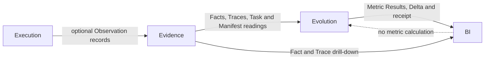

# Iteration 5 closure summary

## Outcome

Iteration 5 delivers a local BI presentation surface over a stateless Evolution metric service and the
Evidence read service while preserving Execution independence. The final technical authority is
superproject `4bac3fa25ccf45ef567d1fe70e13fa4c6ac59d4a` with exact component pins recorded in
`wave12.md`.

The implementation provides:

- a 12-coordinate Catalog 2.0 review-candidate calculation surface in Python Evolution;
- single and compare evaluation over exact Task selections with receipt-bound resolved read sets;
- bounded BI layout/presets and a closed visualizer registry without browser metric formulas;
- Evidence Fact drill-down and recorded-only Trace navigation with deterministic finite motion;
- semantic light/dark themes, truth states, keyboard access and responsive behavior;
- local Compose with source-built Nginx BI, Evolution and Evidence images, digest-pinned PostgreSQL and
  a loopback-only browser entry;
- executable proof that downstream observation, storage, evaluation and BI do not control Execution.

## Authority chain

- Fact and recorded Trace authority: Evidence.
- Metric meaning: Evaluation contracts.
- Metric Result and compare Delta authority: Evolution.
- Presentation-only aggregation and navigation: BI.
- Delivery result and progress authority: Execution; no downstream control edge exists.

## Final verification

- Isolated recursive checkout: all component gates, PostgreSQL integration, source-built full Compose,
  degraded paths, browser tests and independence qualification passed.
- Final main rerun: independence, full Compose normal/degraded smoke and 15 Playwright tests passed.
- Final root CI `33222686110`: `SUCCESS`.
- Final Execution exact-authority CI `33222722931`: `SUCCESS`.
- Independent final review: `PASS`, P0=0, P1=0, P2=1.

The one P2 is the disclosed main-first/feature-sync chronology of the final changelog robustness repair.
The initial squash candidate and root CI failure remain part of the evidence as the RED that revealed the
defect; the final authority and both replacement CIs are green.

## Delivered decisions

- Task identity is exact `task_id`; the selector uses `display_name` when present and falls back to ID.
- A Delivery defaults to NEW Task and may explicitly REUSE an exact Task ID without querying Evidence at
  Execution admission.
- Reporting is allowed to change while accepted Observation data arrives and is required to settle after
  reporting stops; no cross-Fact/Trace global snapshot was added.
- Delivery is the physical retention atom. Deleted Deliveries disappear from ordinary Task, metric and
  Trace consumption; active `PARTIAL` means an actual recorded-data hole, not retention expiry.
- Usage compares only compatible kind/unit/source coordinates. No provider price estimation was added.
- `packet-rework-rate` and `direct-evidence-basis-rate` were removed from the candidate because their
  eligible populations were not well-defined; coverage remains explicit for the 12 retained metrics.
- Workflow source resolution is digest-exact and ordered; repo-scoped Role-to-model binding falls back to
  the Execution global model selection and is frozen into the Delivery Manifest.
- Still is the Trace default; Live reads recorded parent depth, treats same-depth siblings together and
  stops. LINK remains independent, and reduced motion forces Still.

## Explicit exclusions

Iteration 5 does not deliver or imply:

- workflow-builder or intake-sidebar implementation;
- AI attribution, causal diagnosis or improvement recommendations;
- Workflow editing, calibration, revision application or meta-recursive mutation;
- Grafana, a query/formula/plugin platform or an open visualizer marketplace;
- a BI backend, database path, application credential system or public-network security promise;
- registry, package, image or GitHub Release publication.

## Residual work outside Iteration 5

No P0/P1 Iter5 blocker remains. Future work may expand visualizer grammar only after Evolution publishes
the required domains/dimensions, add logical-delete retention only through a separate product decision,
or implement attribution/improvement through later Evolution scope. Those are not deferred acceptance
criteria for #53–56.

The remaining closure operation is tracking-only: use `wave12.md` to update and close Issues #53–56 and
set their Project #9 items to `Done`, then mark the plan complete. No automatic product release follows.
