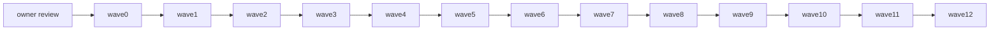

# Iteration 5 实施计划 — BI 可视化与双系统独立验证

> **计划状态**：`WAVE5_IN_PROGRESS`；G0、G2a、G2b、Wave3 与 Wave4 已 PASS。Owner 于 2026-08-28 明确允许在没有真实阻塞或产品裁决时持续向下执行。Wave4 的四组件实现、独立 exit audit、durable commits 与 submodule pin 已闭合；published/FROZEN 原件仍不得静默修改。
>
> **排期权威**：[GitHub Project #9](https://github.com/users/firestige/projects/9) 的 Iter5（`Iter 5 bi 可视化 + 独立验证`，2026-09-21 起、7 天）。Issue 是需求、验收与决策事实源；`.project` 生命周期门仍适用。`plan.md` 只拥有已批准范围内的执行顺序、路径和门禁；issue 或 Project 发生变化时必须停止、同步计划并重新批准，不存在两个并列事实源。
>
> **Committed baseline**：[#53](https://github.com/firestige/workflow-self-recursive/issues/53)、[#54](https://github.com/firestige/workflow-self-recursive/issues/54)、[#55](https://github.com/firestige/workflow-self-recursive/issues/55)、[#56](https://github.com/firestige/workflow-self-recursive/issues/56)。四卡当前均为 OPEN / `ready` / Project `Todo`。
>
> **明确排除**：[#95](https://github.com/firestige/workflow-self-recursive/issues/95)（含 `intake-sidebar`）属于 DSH display plugin 工作；它与 BI 放在 `wsr-ui` 仅是 repository 管理共址，不构成共享 UI framework/layout/release contract。它不进入 Iter5 的 refinement、实现、分发、容量或完成判定。`workflow-builder` 当前仍是 idea，同样不进入 MVP。
>
> **当前 wave**：`WAVE5_IN_PROGRESS / CONTRACT_REBASELINE_FIRST`；Wave4 authority 为 `system-contracts@fa42134e`、`execution-system@06fe7102`、`evidence-system@6631f501`、`evolution-system@e6ff5a5` 与 superproject current component pointer。Wave5 先按 2026-08-28 owner 裁决完成 Workflow DSL 2.0、repository Role→Model、Delivery Manifest projection、Evidence exact Manifest query 与 Evolution ordered Workflow sources 的 durable design/machine-contract alignment；通过 cross-system review 后才继续 calculator/product implementation。

## 1. 目标与完成判定

Iter5 在现有 `evolution-system` 中补齐 Evaluation 的最小可执行实现，并在独立 `wsr-ui` 组件仓库中交付其 BI presentation surface。Evidence 只负责原始上报数据的汇总、整理、存储与查询，并提供 Facts/Traces；Fact 是输入 `x`。Evaluation 只规定 metric 语义；Evolution 对 Fact 执行计算（包括恒等计算 `f(x)=x`）并返回 Metric Result。BI 不拥有 Evaluation、不计算 metric、不创造 Fact 或 Metric Result，只消费 Evolution 的 Metric Results，并按需直接查询 Evidence 做 Fact/Trace drill-down；图表百分比、分桶和像素布局等展示聚合不得被发布或回写为事实。

运行时由用户从源码构建 Vite/TypeScript 生成的 `nginx + dist` BI 镜像，并新增一个无状态 Python Evolution 服务。BI 经同源路径访问 Evolution 的无副作用 compute API，并只读访问 Evidence 的 Task/Fact/Trace 查询；PostgreSQL 仍只对 Evidence 可达。Evolution 解析 BI 提交的 `EvaluationSelection`，声明逻辑 `as_of`，完整遍历各自使用 route-local snapshot/cursor 的 Evidence queries，按 exact Manifest digest 取得 evidence-safe Manifest projection，再从用户配置的 ordered Workflow sources 解析 digest-matched Package/Snapshot content，绑定本次 response 实际使用的 exact resolved read set，计算全部 14 项 Metric Result，并返回 `ResolvedEvaluationContext` receipt。不存在跨 Fact/Trace transaction snapshot 或新增 stability Oracle。

完成判定要求全部满足：

- #53：Evolution 实现 14 项 published Metric Catalog（#79 对 #43 历史 15 项范围的最终修订）并返回权威 Metric Results；BI 完成 single/compare 可视化。不可计算项显式说明缺失输入/coverage，绝不以零或估计值替代；selection、resolved context、provenance、completeness、availability、expiry 和 compatibility 对用户可见。
- #54：Trace 的 `NODE`、`PARENT_EDGE`、`LINK` 只按已记录关系呈现；orphan endpoint、分页、`AVAILABLE/PARTIAL/EXPIRED/ABSENT` 与 detail expiry 均忠实展示，不从时间、名称、顺序或分组推断边。
- #55：`bi-app` 的 Nginx 提供用户监听者、静态资源、同源 Evolution compute 反代与 Evidence Task/Fact/Trace 只读反代；`bi-app`、Evolution、Evidence、PostgreSQL 经 Docker 内网互联，默认无应用权限层。BI 无业务 backend，浏览器、BI 与 Evolution 均无 PostgreSQL 路径/凭据，Evidence 不托管 UI。默认只暴露本机访问；公网/跨机访问由用户自行配置外部反代，或显式把 host bind 改成 `0.0.0.0`，不属于 MVP 安全承诺。
- #56：Execution 无 Evidence 时完整运行；Evidence 接受非 Execution 的 conforming producer；禁用、拒绝、超时、歧义/tail-loss 不改变 Execution result；无 receipt、outbox、反向控制或共享数据库依赖。
- 全部实现先有失败测试/fixture，再实现最小行为；unit、contract、browser、deployment、negative-network 与 cross-product qualification 在 clean checkout 可重复 PASS。
- `workflow-builder`、`bi`、`intake-sidebar` 是三个独立交付物；共置 `wsr-ui` 只为管理便利。Iter5 只建立 BI 源码、BI 视觉 tokens/components 与 `bi-app` Docker build；不得为另两个交付物预设 framework、layout、component API、package、占位镜像或完成声明。
- 每张卡的验收标准都映射到具名 oracle 与 durable artifact；四卡关闭、BI 可从 clean source checkout 构建镜像并在 clean Docker network 复验且 Project #9 状态为 Done 后，才能声明 Iter5 完成。

## 2. 当前基线、动因与已发现缺口

### 2.1 计划编写时基线（执行时由 wave0 重新冻结）

| repository / object | 当前坐标 |
|---|---|
| superproject | `82fc7375092443e44ba17ad5c2552ebfd1633d71` (`main`) |
| evidence-system | `624aad2f57c72964ac1b9f82509d9310cc56a781` (`main`)，stable `0.1.0` |
| execution-system | `c19c811c32cdadb61e0f54cc01bbe770b984c91d` (`main`)，stable `0.1.3` |
| system-contracts | `b50525f5b1db2c017d71ed307ed25bb1c3a7c783` (`main`) |
| workflow-package | `00cc5832e0d7507e7bdd7ce20869a1360a142861` (`main`) |
| evolution-system | `e17eb83ce66caec54275855c7970725be59b8598` (`main`)；Iter5 新增 Evaluation 最小实现与 Metric Result API |
| Evidence Query | `evidence.query@0.1.0`，只读 `/v1/evidence/facts` 与 `/v1/evidence/traces` |
| Evaluation Catalog | `agentops.evaluation.metric-catalog@1.0.0`，14 项 published metric；#79 为 #43 历史 15 项清单的最终发布修订 |

### 2.2 动因

- Evidence 已按 #48–52 收敛为 loopback-only 数据服务；它明确不托管 Grafana、UI 或 presentation proxy。
- Evidence 是 Facts/Traces 的权威来源；Evaluation 是 metric 概念契约；Evolution 是 Evaluation 的实现者与 Metric Result 权威来源；BI 是 Evolution 的展示层，并仅为 Fact/Trace drill-down 直接消费 Evidence。
- #53/#54/#55 是 MVP 的用户可见消费面；#56 是 Execution/Evidence “可独立采用”这一产品承诺的最后验证卡。
- Iter4 的发布 capability matrix 仍残留 `firestige/bi` 的 `not-in-iter4` 预留坐标；owner 已否决该组件方向。当前 GitHub 无 `firestige/wsr-ui`、superproject 无 `wsr-ui` submodule，也没有 UI workspace/release baseline。

### 2.3 编码前必须关闭的缺口

1. **组件仓库待创建**：owner 已冻结并通过 G2a 授权独立 `firestige/wsr-ui` repository + `wsr-ui/` submodule；两者尚不存在，必须等 wave0/wave1/G1 PASS 后在 wave2 执行。把 BI 放进 Evidence/Execution/Evolution 或建立 `firestige/bi` 均不允许。
2. **展示技术方向已由 owner 冻结，版本基线待定**：不采用 Grafana；UI 使用 D3.js + React + Tailwind CSS。精确版本、构建工具、SSR/SPA 形态和依赖锁仍由 wave1/wave2 验证并冻结。
3. **Evolution 的 Evaluation 实现尚未物化**：Evidence API 只返回 Facts/Traces，Evaluation Catalog 只定义 metric 语义，当前没有权威 Metric Result API。Iter5 必须在 `evolution-system` 增加无状态 Python 服务、selection resolver、14 个隔离 calculator 与 result/receipt contract；不得把公式留在 BI。
4. **evaluation context 已在 Wave3 冻结**：compare 的左右两侧由 BI 提交独立 `EvaluationSelection`。Evolution 声明逻辑 `as_of`，把 Task membership/cohort materialize 为 receipt-bound immutable reading，并绑定各 Fact/Trace traversal 的 route-local coordinates、exact input/provenance identities 与 Catalog revision。Receipt 是 response audit record，不是预制 manifest、跨 route snapshot 或 deep-link digest；禁止 alias、ambient latest 与环境发现。
5. **BI 本地分发终点待精确化**：不向 npm、GitHub Release、Docker Hub 或其他 registry 发布 BI 制品。`wsr-ui` 管理自己的 lockfile、multi-stage Dockerfile、Nginx config 与 source-build check；superproject 管理 `pg + evidence + bi-app` 完整 Compose 和 E2E。用户负责取得源码、配置可访问的公共源/私源、本地 image tag 与部署 override。G2b 只冻结项目内的 build command、Docker/Nginx 边界和 superproject E2E entrypoint。
6. **共址边界需防止过度抽象**：`workflow-builder` 是 idea，`intake-sidebar` 属于 #95；它们与 BI 是独立交付物。Iter5 只按 BI 的真实重复需求提取视觉 tokens/components，不验证未来兼容性，不建立共享 framework/product shell，也不创建未来目录、package、image 或 job。

上述任一缺口未在 wave1 经 G1 批准，或未在 wave2 按已授予的 G2a/G2b 完成 durable baseline 并通过 conformity checks 时，不进入产品编码。

## 3. 范围、方案与人工裁决

### 3.1 committed scope

- **#53 factual**：Evolution Metric Result contract、14 项 metric implementation、selection/compare resolver；BI 的 Metric Result、Before/Delta/After、truth/provenance/coverage 展示与无数据/过期/不兼容状态。
- **#54 trace**：Trace 查询与 recorded graph UI、节点/边/link detail、partial/expired/absent 状态与 orphan endpoint。
- **#55 serving**：`bi-app` Nginx 静态托管、same-origin Evidence Query read-only reverse proxy、Docker 内网 Compose、本地监听配置与运维说明；无业务 backend/auth。
- **#56 independent**：跨组件 independence qualification corpus 和可重复报告。
- **必要的设计与实现基线**：仅用于消除上述四卡的实现选择；不借机重开产品 System 划分或冻结契约。

### 3.2 已确认 UI 方向与待冻结实现基线

建立独立 `firestige/wsr-ui` repository，并以 `wsr-ui/` submodule 接入 superproject。repository 可管理多个独立 UI 交付物，但不预设它们共享 framework、layout 或发布生命周期。Iter5 只创建、实现、测试 BI 及其 source-build Docker 路径，不为另两类交付物创建占位 package/image。BI 固定使用 React 组织页面/状态、D3.js 实现事实趋势与 Trace 图、Tailwind CSS 完成一致的视觉系统。

当前 runtime assembly 明确分成三条互不替代的路径：

- **交互执行**：DSH → `wsr-dsh-intake` → Execution。Iter5 不改变 Execution 嵌入 DSH 的方式，也不把 BI 嵌入该链路。
- **指标查看**：Browser → `bi-app` Nginx → Docker 内网 Evolution → Evidence Query → Docker 内网 PostgreSQL。Evolution 返回 Metric Results；BI 不从 Facts 重算 metric。
- **证据下钻**：Browser → `bi-app` Nginx → Docker 内网 Evidence → Docker 内网 PostgreSQL。BI 只读取 Fact/Trace 详情，不把展示聚合升级为事实。

BI **没有业务 backend**：React/D3 通过 typed TypeScript clients 访问 Nginx 暴露的 Evolution Metric Result 与 Evidence Fact/Trace 只读路径。`bi-app` 使用 Vite multi-stage build 生成 `dist`，runtime stage 只有 Nginx、静态文件和最小反代配置。Evolution 是独立 Python 业务服务：无状态、无数据库、负责 Evaluation 的 selection resolution 与 metric calculation；Nginx 不承载指标、状态、数据库访问、认证或业务 API。

原因：

- 用一个 UI repository 统一代码管理入口；每个交付物仍自有 entry、build、test 与分发边界；
- BI 只为自身需求形成视觉 token 与组件；未来交付物可按当时需求选择性复用，不形成前置兼容义务；
- 公式实现只位于 Evolution 的独立 Python calculator module，不落进 React/D3 view、Evidence 或 Nginx；
- 浏览器经同源 Nginx 反代访问 Docker 内网 Evidence，不需要 PostgreSQL datasource/plugin；
- D3.js 可直接消费 typed evaluator/Trace model，不需要为 Evidence Query API 再维护 Grafana datasource/plugin 适配层；
- Tailwind CSS 适合本轮快速搭建 factual/trace/serving 的统一状态、布局和响应式表现；
- 将来 workflow-builder/intake-sidebar 可独立设计；如果 BI 已有视觉元素适用，可以复用，否则允许采用自己的领域组件和 layout。

具体 package manager、workspace/build 工具、React/D3.js/Tailwind CSS、browser-test、Dockerfile 中声明的 builder/Nginx base reference、Nginx config、Compose 命令及依赖，必须由 wave2 以普通源码/lockfile baseline 冻结。本计划不引入 BI 业务 backend runtime，不要求 base-image digest、跨平台矩阵或字节级可重复构建。

明确排除：

- **Grafana**：不进入 spike 或备选。它先前的主要收益建立在直接访问 PostgreSQL 上；当前 BI 只能经 Evidence Query API 取数，仍需 datasource/plugin 适配，但失去直接数据库查询收益，成本收益不成立。
- **独立 `firestige/bi` repository/submodule**：owner 已明确否决；旧 capability matrix 预留坐标不是继续采用它的依据。
- **workflow-builder/intake-sidebar 的 framework/layout/component API、实现或分发**：不属于 Iter5/MVP；不得为未来复用而预建抽象、占位包或空 release。

#### 2026-08-27 — BI UI 技术方向

- 结论：不采用 Grafana；使用 D3.js + React + Tailwind CSS 快速搭建 UI。
- 理由：Grafana 原先的优势依赖直接读取 PostgreSQL；BI 现在只能通过 Evidence Query API 中转，Grafana 的直接查询收益消失，但 datasource/plugin、部署和定制代价仍在。
- 落地：D2 的技术选择不再开放；wave1 只验证该组合能覆盖 factual/Trace/truth/same-origin 需求，wave2 冻结 exact versions、build tool、lockfile、license inventory 和测试基线。

#### 2026-08-27 — UI repository、runtime 与分发边界

- 结论：使用独立 `firestige/wsr-ui` + `wsr-ui/` submodule；不建立 `firestige/bi` 或 `bi/` submodule。
- 结论：BI 无业务 backend；`bi-app` runtime 是 Vite 构建的 Nginx + dist，并由 Nginx 在 Docker 内网分别反代 Evolution Metric Result 与 Evidence Fact/Trace 只读 API。Evolution 使用 Python，实现 Evaluation 的 14 项 metric。
- 结论：`workflow-builder`、`bi`、`intake-sidebar` 只是 repository 共址的独立交付物。Iter5 只交付 BI；视觉元素优先组件化，未来两个交付物仅按当时需求选择性复用。
- contract stop rule：已确认的 Task binding/query 与 Evolution Metric Result/selection/receipt 需要在后续获准 lifecycle 中物化为 exact revision，这是正常 contract alignment，不是架构 blocker。只有实现要求超出这些已确认语义、修改其他 FROZEN 语义或新增未裁决的跨系统 authority 时，当前 wave 才立即 BLOCK 并返回 owner。
- 2026-08-28 contract rebaseline：Repository 是 Role→model-selection policy 的最小 scope；missing repository file/Role mapping 使用 Execution global default `{provider, model}` selection。Agent identity 是 exact Role snapshot + Agent Provider + LLM route/model；Route 不再拥有 generic Agent-definition/model。DSH profile/composition 拥有 settings/credential/endpoint/adapter，并向 Execution 提供 installation-scoped realm factory；Manifest 后每个 Delivery 获得独立 DSH-E realm，Runner 只拥有 lifecycle lease/disposal。Execution 恰配置一个 Workflow source；Evolution 配置 ordered non-empty Workflow source list，并以 Package/Snapshot digests 精确匹配。Manifest 冻结 Snapshot 与 resolved Role→Agent-Provider/LLM-route/model map；同一 `task.binding` 原子投影 membership 与 evidence-safe Manifest reading。实现必须先更新 durable design/machine contracts，再按 TDD 修改产品代码。

### 3.3 两阶段人工门

避免把“批准调查方向”和“批准最终技术基线”混为一谈：

- **G0 — 计划方向门（现在）**：owner 只批准 committed scope、推荐方向和 wave0/wave1 的只读核验/设计工作。G0 不是创建仓库、改 issue/Project、建产品分支或增加依赖的授权。
- **G1 — 历史 consumer/UI design 门（wave1 后）**：原 G1 的 repository、Vite/TypeScript UI stack、source-build 与设计原则仍有效；browser evaluator、只读 manifest 与单上游拓扑已被 owner 后续决策取代。Wave3 必须补齐 Evolution/BI detailed redesign 和新的 exact contracts，形成 rebaseline PASS 后才能恢复实现。
- **G2a — scaffold 授权（OWNER_GRANTED）**：owner 已预先授权 D1 的 repo/submodule 创建和 `iter5/implementation` scaffold branch；授权只在 wave0/wave1/G1 PASS 后于 wave2 生效，不允许提前执行。
- **G2b — implementation baseline 授权（OWNER_GRANTED_WITH_STOP_RULES）**：owner 已授权实施方在 wave2 按已确认方向自行冻结 routine dependency/path/command/Docker/Nginx/Compose/E2E 参数，并在 durable baseline 与 conformity checks PASS 后直接进入 wave3，不再逐项返回审批。若出现 cross-system contract gap、既有规范冲突或实质产品选择，授权失效并立即返回 owner。

方向表如下；D1–D7 的概念方向均已由 owner 关闭，不再选型。G1/G2a/G2b 只冻结实现参数：D2–D4 的 exact schema/version/tool，D7 的具体风格/layout/component map，D1 的 repo 动作，以及 D5 的 exact repo:path、build/E2E commands、base references、ports/DNS/health 与 merge/repin 参数：

| ID | 裁决 | 推荐值 | 不批准时 |
|---|---|---|---|
| D1 | UI component 落点 | **OWNER_CONFIRMED + G2a GRANTED**：独立 `firestige/wsr-ui` + `wsr-ui/` submodule；只在 wave2 ENTRY 满足后实际创建 | ENTRY 不满足则等待；不得提前创建或回退到 BI submodule |
| D2 | presentation stack | **OWNER_CONFIRMED**：D3.js + React + Tailwind CSS；不采用 Grafana。G1/G2b 只冻结应用结构、build tool 与 exact versions | 若组合无法满足已批准 oracle，停止返回 owner；不得回退 Grafana |
| D3（决策编号，非 D3.js） | metric computation | **OWNER_REBASELINED**：Evaluation 是概念契约；Evolution 以 Python 实现全部 14 项 metric 并提供 Metric Results；BI 不计算 metric | 任一 metric 落入 BI/Evidence，或同一 metric 出现运行时多引擎/多算法选择时停止 |
| D4 | evaluation-level inputs | **OWNER_CONFIRMED / WAVE3 DETAILED**：BI 提交 1–24 exact Task IDs/side 的 `EvaluationSelection`；Evolution 声明逻辑 `as_of`、解析 exact resolved Evidence read set 并返回 `ResolvedEvaluationContext` receipt；各 traversal 自有 snapshot/cursor，不存在跨 route snapshot、只读 manifest 或 deep-link digest | selection 需要 ambient latest/alias、receipt 不能绑定实际 read set，或实现要求跨 route transaction snapshot 时停止 |
| D8 | Task selection 与展示 | **OWNER_CONFIRMED / CONTRACT_ALIGNMENT REQUIRED**：Delivery 默认 NEW Task，用户可显式 REUSE exact `task_id`；Execution 固定绑定并沿 Observation 传递；Evidence 接收 declaration/membership 并提供 bounded Task query；BI 以 optional `display_name` 展示、缺名回退 ID，identity/URL/receipt 一律使用 ID | 不得按名称、时间、Workflow 或相邻 Delivery 推断 reuse/membership；published Contract revision 只在后续获准 lifecycle 中落地 |
| D9 | Role/model 与 Workflow source authority | **OWNER_CONFIRMED / CONTRACT REBASELINE REQUIRED**：repo 配置 exact Role→model；缺项回退 Execution default；删除新 DSL 的 generic Agent-definition/model resource；Execution 一 source、Evolution ordered multi-source；Manifest/Evidence 提供 exact Package/Snapshot 与 resolved binding reading | 不得按 Route/Action/Task/Delivery 覆盖 model，不得让 Evolution 读 Execution filesystem/current checkout，不得只按 `name@version` 或 source URL 匹配 |
| D5 | BI source-to-image 分发闭环 | **OWNER_CONFIRMED**：`wsr-ui` 自管 Dockerfile/Nginx/source-build check；superproject 自管完整 Compose/E2E；用户自管源码搬运、源配置、local tag 与 override；无远端制品发布 | committed source 无法 native build 或完整 Compose E2E 不成立则不关闭 Iter5；不得增加平台矩阵、reproducible-build contract 或远端 publisher |
| D6 | 非 MVP UI 与共址边界 | **OWNER_CONFIRMED**：workflow-builder 仍为 idea；intake-sidebar 属于 #95；均不进入 Iter5。三者是独立交付物，共址不等于共享 framework；BI 只组件化自身需要的视觉元素 | 只能另走 refinement/schedule；不得借未来复用扩大 BI scaffold |
| D7 | BI UI/UX 与组件化原则 | **OWNER_REBASELINED**：语义先行、浅色/深色等价、布局可换、组件复用、逐层收敛；Tailwind semantic binding 承载配色、间距、排版、形状、层级、focus 与 motion；设计图表统一使用 Mermaid | detailed UI decisions、light/dark parity 或可执行 semantic token binding 任一缺失时停止 |

### 3.4 D5 术语、裁决内容与已确认值

D5 不决定页面是 SPA 还是 MPA。**SPA/MPA 是 application topology**，属于 G1：SPA 是一个 HTML shell 配合 client-side routing；MPA 是多个独立 HTML entry。当前 BI 推荐 SPA，因为 factual/Trace 共享 React shell、typed state 与筛选上下文；G1 冻结 route、entry、base path 和 Nginx fallback。

D5 的“发布”是 **source-to-image distribution**，不是把预构建制品推到远端 registry：

| D5 项 | 它解决的问题 | OWNER_CONFIRMED 值 | G2b / wave11 / wave12 分工 |
|---|---|---|---|
| artifact type | 用户最终运行什么 | 用户从源码执行 multi-stage Docker build：builder 生成 React `dist`，runtime 形成只含 Nginx + dist + Nginx config 的 `bi-app` image。无独立 Node/server runtime | `wsr-ui` 冻结 Dockerfile、Nginx config 和 build check；superproject E2E 实际 build |
| registry namespace | 镜像是否推到远端、从哪里 pull | **不适用**：不推 Docker Hub、GHCR 或私有 registry，也不发布 npm/GitHub Release artifact | 不配置 publisher credential/job；local tag 由 Compose 提供便利默认值，用户可覆盖，不是产品 identity |
| source boundary | 哪个项目负责什么 | `wsr-ui` 管 BI source、Dockerfile、Nginx 和自身 build test；superproject 管 `wsr-ui` pin、完整 `pg + evidence + bi-app` Compose 与 E2E | wave2 冻结 exact repo:path 和命令；不得把完整系统 Compose 塞回 `wsr-ui` |
| dependency/source access | 公共源不可达由谁处理 | 用户负责配置 Docker/npm 等公共源或自己的私源；项目不提供镜像同步、离线包、vendor bundle 或私源适配 | 文档只列正常构建前提；源连通性失败不是产品 fallback 设计 |
| platform | 是否做 amd64/arm64 构建矩阵 | 不做。Docker native build 使用当前构建目标平台，并从支持多平台的 base image 选择对应变体；不设置交叉编译矩阵，不发布 multi-arch manifest | 项目只运行 native source-build smoke；某环境/base/dependency不支持时由该用户调整构建环境或源码 |
| runtime topology | 四个容器如何连接 | `pg`、`evidence`、`evolution`、`bi-app` 在隔离 Docker network 内互联；PostgreSQL 只对 Evidence；Evolution 经 Evidence Query 取 Fact/Trace/Task/Manifest reading，并按配置访问 public Workflow sources；Nginx 仅允许已批准的 Evolution Metric Result 与浏览器所需 Evidence Task/Fact/Trace 路径，浏览器只访问 Nginx | components 验证自身 image；superproject 冻结 service/DNS/port/health/readiness、Evolution source config 并执行完整 E2E |
| listener / auth | 默认谁能访问、是否鉴权 | 默认不做 application auth/RBAC；`bi-app` host port 默认 bind `127.0.0.1`。用户要跨机/公网访问时，自行配置外部反代，或显式改为 `0.0.0.0` 并自行承担访问控制 | wave9 验证默认配置；文档明确 override 是 user-owned deployment choice，不把它误报为安全默认 |
| build qualification | 如何证明 committed source 没漏文件且可以构建 | fresh checkout/submodule init → 正常 dependency install → `docker compose build` → isolated Compose up → factual/Trace/health/network smoke；这是普通 build/E2E 验收，不承诺跨机器字节相同或 image digest 相同 | `wsr-ui` 保存自身 build test；superproject 保存完整 E2E command/result |
| local customization | tag、源、监听和源码修改能否由用户决定 | 可以。默认 Compose 值只为开箱使用；用户可换 local tag、源、反代、host bind 或修改源码，修改后的系统不再是项目验收过的 exact checkout | 文档说明默认值和责任边界，不把用户 override 纳入版本/兼容契约 |

这套模式只保证“项目提交的源码按文档可以 native build，并通过 superproject 完整 E2E”。它不保证离线构建、跨平台交叉构建、镜像 digest 可复现，也不限制用户修改源码、tag、源或部署配置。若未来接入 Docker Hub/私有 registry，必须新开发布设计。

### 3.5 BI 视觉设计与组件化策略（OWNER_CONFIRMED / D7）

UI detailed design 已由 owner 确认并冻结为 `docs/systems/bi/bi-ui-design*.md`；以下规则是 Wave6–8 的实现 authority，不能再推迟到 component 实现期选择：

> **原则**：语义先行、主题等价、布局可换、组件复用、逐层收敛。Tailwind class 不直接绑定零散颜色与距离，而绑定语义 token；替换配色方案、密度或 spacing scale 时，应主要修改 token/theme mapping，不应逐页搜索替换。

1. **语义骨架**：先从 #53/#54 和 truth vocabulary 形成页面内容、状态、操作与优先级 inventory，不讨论像素细节。
2. **信息架构与 layout**：冻结 routes、desktop/tablet/narrow 三档区域关系、导航、selection/compare、详情面板、空态与降级顺序；所有设计稿中的结构、流程、状态和组件关系图统一用 Mermaid。
3. **视觉语义**：冻结 typography hierarchy、semantic color、light/dark parity、contrast、spacing/density、shape、elevation、focus 与 motion tokens；为浅色和深色分别提供成对 style frame，不把深色稿当唯一 authority。
4. **组件与状态**：形成 page composition、visual primitive、truth semantic component 与 D3 visualization 的 component map；逐组件覆盖 loading/available/lower-bound/not-applicable/unavailable/expired/incompatible/error/selected/focused/disabled/reduced-motion 状态。
5. **可视化与交互语法**：按 metric kind/value shape 冻结 visualizer registry、named channels、scale、zero、unit、coverage、panel missing tolerance、compare 与 Before/Delta/After 规则；指标说明、评估回执、compare metric navigator、Evidence Console、Trace recorded-structure navigator、Live/Still、stable deep link、keyboard、responsive 和 accessibility 均有明确职责。独立 Recorded Reach 被拒绝；published `delivery-stage-reach` metric 不受影响。
6. **Archify 证据矩阵**：以 `tmp/20260827/archify-inspiration/**` 和官方 v2.15.0 资料形成 adopt/defer/reject 矩阵；采用 Evidence Console、progressive disclosure、Semantic Passport、stable deep links、finite/reduced motion、Before/Delta/After receipt discipline；明确拒绝把 authored reach 当 runtime causality。
7. **真实 vertical slice**：先用真实 Metric Result fixture 实现一个 factual slice，验证 D3 resize、主题切换、响应式、keyboard/accessibility、truth states 和 screenshot regression，再继续完整 factual 与 Trace。

复用遵循“先有重复、再抽象”：不得因 workflow-builder/intake-sidebar 未来可能复用而提前设计通用 API。影像图和 screenshot regression 只辅助视觉核对；语义断言、响应式、交互与 accessibility 仍由可执行测试负责。

D7 detailed design 已完成 owner review 与 fresh-reader PASS。后续实现必须逐项映射 IA/layout、双主题、排版/tokens、全状态矩阵、visualization grammar、interaction、accessibility、responsive 与 Archify disposition；不得以实现便利重新打开已冻结语义。

### 3.6 非目标

- 不为 UI 便利静默修改或重解释 Observation、Evaluation Catalog、Evidence Query 或 Workflow 的 FROZEN/PUBLISHED 语义；已确认的 Task binding/query 与 Evolution Metric Result/selection/receipt 只可在后续获准 contract lifecycle 中以 exact revision 对齐。
- 不让 BI 直连 PostgreSQL、读取 Raw/accepted internal tables、持有 DB credential 或调用 Evidence 写接口。
- 不在 Evidence 内托管 UI/Grafana/proxy，不让 Execution 读取 Evidence 决定 progress/outcome。
- 不定义新指标、复合分数、排名、推荐、隐藏权重、因果推断、currency/unit conversion 或缺失值补零。
- 不实现 Evolution 的 AI 归因解释、Workflow 改进/编辑/校准、revision application、meta-recursive loop 等 #58–60 后续能力；Iter5 只实现 Evaluation 所规定的 Metric Results。
- 不实现或发布 workflow-builder；不实现或发布 #95/intake-sidebar；不把 DSH display plugin 与 #53/#54 的 Evidence BI 视图混成同一工作线。
- 不为 repository 内未来交付物建设共享 product shell、通用 layout engine 或完整 design system；BI 视觉组件只由本轮真实需求驱动。
- 不做公网、多租户、RBAC 或应用层认证；默认 bind 为 `127.0.0.1`。用户自行反代或显式改为 `0.0.0.0` 属于部署 override，不改变本项目无权限层的事实，也不构成公网安全保证。
- 不向 Docker Hub、GHCR、npm、GitHub Release 或其他 registry 发布 BI 制品，不配置 publisher credential；任何情况下都不构建/发布 workflow-builder/intake-sidebar。

## 4. 串行执行、所有权与证据协议

### 4.1 工作方式

- **严格串行**：任一时刻只有一个 active wave，顺序固定为 #53 → #54 → #55 → #56 → integration → publication；不得并行实现、交叉放行或让下游提前开工。主协调者独占 `plan.md`、GitHub issue 生命周期、Project #9 字段、integration branch、submodule pin 与最终关闭动作。同一 wave 内互不写入的资料读取、oracle audit 与 fresh-reader review 可以并发且不得自审；实现写入、PASS ownership 与下游放行仍串行。若串行估算超出 7 天，必须返回 Project 排期裁决，不得以跨 wave 并行承诺消化差额。
- **分支**：Iter5 的全部代码与 durable 文档只进入各 repository 的 `iter5/implementation` 特性分支；不得直接提交主干。每个 wave 只要产生可提交资源就至少提交一次；单次提交的文本新增+删除不得超过 500 行，超过时按可独立评审的语义切片拆分。全部 wave PASS 后，各组件特性分支 squash merge 回各自主干，再由 superproject 特性分支 repin，最后 squash merge 回 superproject 主干。
- **TDD**：每项行为先落 RED fixture/test，再实现最小行为，最后 refactor；只有看到目标 test 在实现前因预期原因失败，才能作为有效 RED evidence。
- **路径所有权**：wave2 输出精确 `repo:path` 表；在此之前不得写产品路径。跨入 shared/forbidden surface 必须停下修订计划。
- **依赖语义**：第 5 节文本边列表是严格串行 DAG 事实源；每个 wave 必须等待唯一直接上游被协调者核验并集成，不因路径或文件互不重叠而并行。
- **外部动作**：G0 已授权 wave0/wave1；G2a 已预授权 wave2 的 GitHub repository/submodule/scaffold 动作；G2b 已授权符合 baseline 的依赖与产品实现。所有动作仍受串行 ENTRY 门约束，不得因预授权提前执行。Iter5 不安装发布 App、不配置 registry secret/variable、不 push BI image/package/release。关闭 issue 只在 wave12 clean-checkout build/E2E 与最终 squash merge PASS 后由主协调者执行。

### 4.2 wave report

每个 wave 完成后，由主协调者核验并写入 `tmp/20260827/iter5-implementation-plan/evidence/waveN.md`，至少包含：

- inputs：repo+SHA、issue body revision/URL、contract revision/publication digest、implementation baseline revision；
- outputs：repo、branch、commit、submodule pin、artifact path/digest；
- executor、oracle reviewer、report owner、merge owner；
- RED test 与 GREEN test 的命令、exit code、关键输出；
- 修改路径和未修改的 forbidden paths；
- fixture/browser screenshot/accessibility/deployment/network oracle；
- 外部 URL 和状态（若获授权）；
- 未决项、退出条件 disposition 与最终 `PASS`/`FAIL`。

报告不是完成事实的替代物。`tmp` 只保存执行中的汇总，关闭后会清理；所有 RED/GREEN tests、fixtures、截图 golden、design/baseline、qualification harness、component source-build checks 与 superproject full-Compose E2E 必须提交到对应仓库。CI run URL 与 exact commit SHA 回填 issue。D5 不创建 release candidate/publication manifest；wave11 持久化 component squash merge/superproject repin 的 integration qualification，wave12 持久化 clean-checkout build/E2E 与 superproject squash merge 结果。tmp 报告不得成为唯一证据。

### 4.3 通用 wave 门

每个 wave 都使用三种明确状态：

- **ENTRY**：DAG 上游的 `PASS` report、exact input commit/digest 和 required approval 全部存在；否则不得启动。
- **PASS**：本 wave checklist 全部完成，命令可重放，独立 oracle reviewer 核验，主协调者写入 report 并放行下游。wave1–9 的 durable output 必须提交到仓库；wave0 是唯一例外，只生成执行期间使用的临时 baseline token。最终实施坐标由 component main commit 与 superproject submodule pin 持久化，build/E2E 结果由对应 qualification artifact 持久化。
- **BLOCK/FAIL**：本 wave 所列阻断条件任一成立；停止下游，记录证据并返回相应 G0/G1/G2a/G2b 或 issue owner。不得用部分 PASS 放行。

每个 wave 的 required input/output 在下表冻结；wave2 只把草案路径替换为 exact path，不得改变语义：

| wave | ENTRY input | PASS output（wave0 为临时 token；其余必须 durable） |
|---|---|---|
| wave0 | G0 批准 + clean/readable checkout | 临时 wave0 baseline token/report digest；不是 durable artifact，无产品 commit |
| wave1 | wave0 PASS digest + published contract coordinates | `docs/systems/bi/{bi-system,metric-computability}.md`（含 G1 decision record） |
| wave2 | G1 design commit + already-granted G2a authority | `wsr-ui` scaffold commit + `wsr-ui/docs/implementation-baseline.md` + exact owned-path/oracle map + G2b conformity PASS |
| wave3 | wave2 PASS baseline + owner rebaseline + Archify v2.15.0/local materials | Evolution/BI detailed design、Mermaid diagrams、双主题 UI specification、revised oracle/owned-path map |
| wave4 | wave3 PASS design/contract decision | Evolution Python scaffold + Metric Result/Selection/Resolved Context contract + isolated calculator interfaces |
| wave5 | wave4 PASS interfaces | Evidence client/selection-read-set resolver + 14 calculator modules + compare/delta + metric golden tests |
| wave6 | wave5 PASS Metric Result API + wave3 UI specification | BI typed Evolution/Evidence clients + semantic Tailwind tokens/components + receipt/recorded-structure/motion foundations |
| wave7 | wave6 PASS component foundations | #53 Metric Result single/compare UI + Before/Delta/After + #53 oracle artifacts |
| wave8 | wave7 PASS commit/report | #54 Trace recorded-structure navigator/Live-Still UI + #54 oracle artifacts |
| wave9 | wave8 PASS integrated commit + revised deployment baseline | Evolution/Evidence/BI serving/deployment commit + #55 oracle artifacts |
| wave10 | wave9 PASS + revised independence design | superproject durable qualification harness + #56 oracle artifacts |
| wave11 | wave10 PASS + 全部上游 card evidence | component feature branches squash-merged to main + superproject final repins + durable integration qualification |
| wave12 | wave11 final component/superproject commits | clean-checkout build/full-Compose E2E PASS + superproject feature branch squash merge + issue evidence comments |

### 4.4 owned surface 草案

| wave | owned surface | 禁止/共享边界 | 核心交付 |
|---|---|---|---|
| wave0 | 本 tmp 目录的 baseline report；其余只读 | 不改产品、issue、Project 或外部状态 | 精确 authority/SHA/environment baseline |
| wave1 | `docs/systems/bi/**` 候选设计；本 tmp 的矩阵/report | 不改 FROZEN contracts、产品代码 | consumer contract、metric feasibility、truth/UI、topology 冻结候选 |
| wave2 | 符合已授予 G2a/G2b 的 `wsr-ui` workspace/scaffold/build/test/deployment baseline paths；superproject `.gitmodules`/pin 仅协调者 | 不实现业务 UI；不创建 workflow-builder/intake-sidebar package；不碰 Evidence internals | repo/workspace/stack/dependency/path/distribution baseline + conformity PASS |
| wave3 | `docs/systems/evolution/**`、`docs/systems/bi/**`、Mermaid 与 design evidence | 不写产品代码；不修改 FROZEN contract | Evolution/BI detailed redesign + UI decision closure |
| wave4 | `evolution-system` contract/API/scaffold/calculator interface 与 tests | 不实现具体 metric；不改 Evidence/BI | Python service + Metric Result contract baseline |
| wave5 | `evolution-system` Evidence client/resolver/14 calculators/compare 与 tests | 不在 BI/Evidence 算 metric；无数据库 | 权威 Metric Result implementation |
| wave6 | `wsr-ui` typed clients、semantic tokens/components 与 tests | 不复制 metric formula；不改 Evolution calculator | BI presentation foundation |
| wave7 | BI metric/compare views 与 browser fixtures | 不改 calculator formula、Trace view | #53 candidate |
| wave8 | BI Trace recorded-structure/Motion views 与 browser fixtures | 不用时间戳/arrival order 推断顺序或因果 | #54 candidate |
| wave9 | Evolution + Evidence + BI host integration/config/deployment/operations | BI 无业务 backend；Evolution 无 DB | #55 candidate |
| wave10 | `super:qualification/iter5/independence/**` + component public test entrypoints | 不把验证 hook 变成产品控制依赖 | #56 candidate |
| wave11 | 协调者的 integration qualification、component squash merge 与 superproject repin | 不新增功能、语义或未来组件 | 最终 component main commits + candidate superproject pin |
| wave12 | clean checkout、full Compose/E2E、superproject squash merge 与 issue closure | 不 push 远端制品；不构建未来组件 | source build + full-system proof 与 Iter5 closure |

## 5. 依赖 DAG

文本边列表为事实源：

- owner-review -> wave0
- wave0 -> wave1
- wave1 -> wave2
- wave2 -> wave3
- wave3 -> wave4
- wave4 -> wave5
- wave5 -> wave6
- wave6 -> wave7
- wave7 -> wave8
- wave8 -> wave9
- wave9 -> wave10
- wave10 -> wave11
- wave11 -> wave12

wave 的 ENTRY、实现写入、PASS ownership 与下游放行严格串行，形成 `owner-review → wave0 → … → wave12` 的单链；同一 wave 内互不写入的资料读取、审计和 fresh-reader review 可以并发，但不改变 critical path 或产生多个 PASS owner。workflow-builder 与 #95/intake-sidebar 均不在本 DAG；本轮不得为其创建实现或发布边。

### 5.1 Wave3 后串行 critical-path 估算

以下为本地设计基线上的工程估算，不替代 Project #9 排期；单位为工作日，且不假设跨 wave 并行：

| wave | 估算 | 主要不确定性 |
|---|---:|---|
| wave4 | 0.75–1.25 | Task/Selection/Metric Result 的 contract alignment 与 Python scaffold |
| wave5 | 1.5–2.5 | 14 calculators、route-local traversal、partial compare 与 golden corpus |
| wave6 | 1.0–1.5 | 双上游 typed clients、semantic tokens 与状态组件 |
| wave7 | 0.75–1.25 | bounded dashboard、multi-slice single/compare 与 deep-link |
| wave8 | 0.75–1.0 | recorded Trace、有界 graph、Still/Live 与 accessibility |
| wave9 | 0.75–1.25 | Evolution/Evidence/Nginx/Compose 集成与 degraded paths |
| wave10 | 0.75–1.0 | independence qualification 与 mutant sensitivity |
| wave11 | 0.5 | component merge、repin 与 integration qualification |
| wave12 | 0.5 | clean-checkout closure、外部 evidence 同步与关闭 |

合计 `7.25–10.75` 工作日。现有 7 天 Project 窗口低于本估算下界；在获准修改 Project 前只记录该偏差，不通过隐形并行、删减验收或提前启动下游来伪装可达。

## 6. 执行计划

### owner-review / G0 — 计划方向批准

> 状态：`PASS`。后续 owner architecture rebaseline 已融合进 Wave3，不撤销 G0 曾完成的事实。

- [x] 确认 D1–D7 的**概念方向**已按 owner 决策关闭：`wsr-ui` submodule、D3.js/React/Tailwind、BI 无业务 backend、contract gap 即停止、source-build-only 分发、非 MVP UI 排除，以及“语义先行、风格早定、布局可换、组件复用、逐层收敛”；不得据此跳过 G1 exact design/UI artifacts。repo 动作留给 G2a，implementation baseline 与 D5 exact path/command/port/base-reference/merge-repin 参数留给 G2b。
- [x] owner 已否决并行；采用严格串行 wave。wave1 必须重估端到端工期；若 #53–56 与 BI source-build 分发闭环无法落入 7 天，返回 Project #9 调整日期/范围，不得拆出隐形并行 lane。
- [x] 确认 workflow-builder 与 #95/intake-sidebar 均不进入 Iter5/MVP 的 refinement、实现或发布。
- [x] G0 已授权 wave0 只读核验与 wave1 设计候选；G2a/G2b 虽已预授权，仍不得越过 wave0/wave1/G1 ENTRY 提前创建 repo/submodule、增加依赖或修改产品。

PASS：G0 方向、baseline scope、非 MVP UI 排除与严格串行模型有书面结论。BLOCK：G0 权限边界不明确；或串行工期超出排期但未取得 Project 调整。

### wave0 — authority、状态与环境基线

> 状态：`PASS`。依据：`evidence/wave0.md`；本 wave 是无产品 commit 的 baseline-token 例外。

- [x] 用 `gh issue view` 与 Project #9 GraphQL 核对 #53–56 的 OPEN/ready/priority/effort/Iter5/Todo；记录 workflow-builder 与 #95/intake-sidebar 不在 Iter5 的排除证据。
- [x] 按 `.project` lifecycle 检查卡片自足性；#53–56 验收仍有无法执行的歧义时，本 wave 立即 BLOCK，由主协调者另行取得 issue-edit 授权并把 owner 决策写回 issue；写回后重新执行 wave0，不在 tmp 独占事实。
- [x] 记录 superproject 与所有 submodule 的 clean/dirty 状态、branch、HEAD、remote；保留用户已有修改并检查 owned-path 冲突。
- [x] 绑定 published Observation Profile、Evaluation Catalog、Evidence Query revision、publication record/digest 与 stable Execution/Evidence release assets。
- [x] 运行现有 system-contracts/evaluation、system-contracts/evidence-query、Evidence query API 和 Execution observation/independence 相关门禁，证明输入基线可复验。
- [x] 核对 `firestige/wsr-ui` repo/submodule 尚不存在；确认 capability matrix 的 `firestige/bi` 仅为旧预留，并形成迁移为 `firestige/wsr-ui` source-build-only Docker distribution entry 的 exact diff 候选。
- [x] 生成 `evidence/wave0.md`，只在全部检查可重放时标记 PASS。

BLOCK/FAIL：卡片或 Project 排期不一致；published contract/asset binding 不可复验；必需 repo 不可读；用户修改与 owned surface 无法隔离；#53–56 需要未批准的 contract change。

### wave1 — BI consumer design 与可计算性门

> 历史状态：`PASS / PARTIALLY_SUPERSEDED`。依据：`evidence/wave1.md` 与 design commit `7de892a7`。下列事项在当时均已执行，因此保持勾选；其中“browser evaluator + BI-local read-only manifest”结论已被 owner supersede，repository/UI stack、source-build、truth vocabulary、设计原则和部署约束仍可继承。冲突项由 Wave3 新设计取代，不再作为当前 authority。

- [x] 形成无业务 backend BI boundary：Browser → `bi-app` Nginx（dist + read-only same-origin reverse proxy）→ Docker private network → Evidence Query API；PostgreSQL 只对 Evidence 可达。Nginx 不计算指标、不持久化状态、不访问数据库、不提供 write route。若该拓扑牵涉新增/重解释 cross-system contract，立即 BLOCK。
- [x] 为 `/facts` 和 `/traces` 建立 consumer contract matrix：request/filter/cursor/snapshot/version/error、所有 truth/expiry state、unknown fields/revision 的 fail-closed disposition。
- [x] 对 14 项 published Metric Catalog 建立逐项 computability matrix：formula authority、所需 Observation/Projection/evaluation input、Evidence Query 可达字段、coverage/minimum sample、缺失/不兼容输出与 oracle。
- [x] 设计 BI-local `evaluation-context` input：它只表达 Evaluation-owned defined-task membership、event-time assignment 与相应 exact identity/version/digest，不复制 Observation fact、不进入 Evidence、不成为 cross-system truth。冻结 owner、schema、version、lifecycle、只读注入和缺失 disposition；禁止 alias/recency/backfill/ambient discovery。若这一步需要新增、扩展或重解释 cross-system contract，立即 BLOCK 返回 owner。
- [x] 冻结 presentation vocabulary：loading/available/lower-bound/not-applicable/unavailable/expired/incompatible/error；explicit zero 与 absence 必须视觉和测试上可区分。
- [x] 冻结 Trace view：node/parent/link、orphan endpoint、pagination、partial/expired/absent、不可推断项与稳定 layout identity。
- [x] 先完成 BI semantic UI inventory：factual/Trace 的内容、操作、truth states、信息优先级、代表性数据密度与窄屏最低要求；它是 style frame 的输入，禁止从空白美术稿反推语义。
- [x] 基于 semantic inventory 产出少量 style-frame 影像图并取得 G1 风格确认；至少覆盖普通 factual、Trace 和 unavailable/partial 状态。影像图只冻结视觉语言，不冻结像素坐标。
- [x] 产出 factual/Trace/empty-error 的粗 layout/wireframe 与 component map；分开 page composition、visual primitives、truth semantic components 和 D3 domain visualization，明确哪些布局允许后续替换。
- [x] 冻结 #55 trust topology：`pg`、`evidence`、`bi-app` 加入同一隔离 Docker network；PG 不发布 host port，Evidence 不发布 host port，只有 `bi-app` Nginx 默认以 `127.0.0.1:<host-port>:80` 提供本机访问。MVP 无 application auth/RBAC。用户自行外置反代或把 host bind 显式改为 `0.0.0.0` 是 documented override，由用户承担访问控制；项目默认配置和验收仍保持本机绑定。
- [x] 冻结 unknown field/revision 行为：`evidence.query@0.1.0` closed response 出现未知字段或不支持 revision 时整份 response 拒绝为 typed `INCOMPATIBLE`，不保存 raw、不局部渲染。
- [x] 冻结 contract 原有 bound（facts/traces `limit<=200`、Delivery traversal 最多 32 traces 等）和 UI pagination：首版不得无界自动遍历；timeout/页数/交互续页的 exact 值写入设计。
- [x] 验证 D3.js + React + Tailwind CSS 对 factual chart、Trace graph、truth state、same-origin shell、keyboard/accessibility 和 bounded pagination 的覆盖；本 wave 不再比较或试验 Grafana。
- [x] 冻结 `wsr-ui` 共址边界：本轮源码、Docker build 与 Compose service 只能实例化 BI；不得出现 workflow-builder/intake-sidebar 占位物、共享 product shell、未来 component API 或 publisher job。
- [x] 以严格串行前提重新估算 wave2–9 的 elapsed time/critical path；若超过 Iter5 7 天窗口，先返回 Project 排期裁决，不得批准一个依赖并行才能成立的 G1 baseline。
- [x] 完成 D2–D4 exact design、英文权威/中文 tracking companion 和 fresh-reader review；取得 G1 批准并生成 `evidence/wave1.md`。

BLOCK/FAIL：任一指标只能通过新公式/推断/隐藏 backfill 计算；任一设计需要新增、扩展或重解释 cross-system contract；Trace 必须推断缺失边；需要 BI 业务 backend、浏览器直连 Evidence/DB，或默认拓扑必须暴露 PG/Evidence host port；G1 未批准。

### wave2 / G2a→G2b — repository、技术栈与实现基线

> 历史状态：`PASS / BASELINE_REUSABLE`。依据：`evidence/wave2.md`、组件 commit `4aa2a0a` 与 superproject pin `b332633c`。`wsr-ui`、Vite/TypeScript、React/D3/Tailwind、测试/构建与 Docker/Nginx scaffold 可继承；涉及 browser evaluator、单一 Evidence upstream 或旧 component map 的部分须在 Wave3 rebaseline 后修订。

- [x] 核对已授予的 G2a authority 与 wave0/wave1/G1 PASS；随后创建/接入 `firestige/wsr-ui` + `wsr-ui/`。记录 repo visibility、license、default branch、branch protection、App 边界和 superproject submodule pin；ENTRY 未满足不得提前执行。
- [x] 用 bounded spike 证明 D3.js + React + Tailwind CSS 能完成 factual chart、Trace graph、truth states、keyboard/accessibility 与 deterministic browser test；这里只验证已选组合，不重新选型。
- [x] 锁定 package manager、workspace/build tool、React、D3.js、Tailwind CSS、Dockerfile 中的 builder/Nginx base reference、Docker/Compose、build/test/browser 依赖和 lockfile；生成 dependency/license inventory，证明 runtime image 除 Nginx/静态文件/配置外无 BI 业务 server。不设置 `platforms`/交叉构建矩阵，也不要求 base-image digest。
- [x] 建立最小 `wsr-ui` scaffold、format/lint/type/unit/build/browser/docker-build/compose-smoke 命令和 CI；此 wave 不实现 #53–55 业务语义，不创建 workflow-builder/intake-sidebar package/image。
- [x] 按 G1 component map 建立 BI-only visual token、primitive、semantic component skeleton 与轻量 component preview/test route；只为已确认的 BI 重复元素建抽象，不引入面向未来交付物的通用 UI framework。
- [x] 冻结目录与 owned paths：`wsr-ui` 拥有 `packages/bi/**`、Dockerfile、Nginx config、自身 Docker build test；superproject 拥有完整 `pg + evidence + bi-app` Compose、E2E harness 和 submodule pin。exact paths 由 baseline 冻结；不得把完整 Compose 放进 `wsr-ui`，也不得把 BI Dockerfile/Nginx config 放进 superproject。
- [x] 以 system-contracts positive/negative/recovery corpus 派生 BI mock fixture，不复制或改写语义；fixture 记录 upstream digest。
- [x] 冻结 D5：绑定 `wsr-ui` Docker build command、Nginx boundary、wsr-ui-owned source-build check、superproject-owned Compose/E2E command 与 component-first merge/repin；明确公共源/私源、local tag、平台选择和用户 override 均不成为产品契约，且无 registry/publisher credential/job。
- [x] 生成 `evidence/wave2.md`，逐项证明 baseline 符合已授予的 G2b 与全部 stop rules；conformity PASS 后直接启动 wave3，不再请求 routine 参数批准。wave7 仍须等待 wave3–6 依次 PASS。

BLOCK/FAIL：wave0/wave1/G1 ENTRY 未满足；实际动作超出 G2a/G2b 已授权范围；需要 registry secret/远端 publisher；dependency license 不可接受；stack 无法满足 Nginx same-origin/Trace/browser/Docker oracle；出现 BI 业务 backend；scaffold 需要改变 Evidence/cross-system contract；出现既有规范冲突或新的实质产品选择。

### wave3 — Evolution + BI 详细重设计与 UI 决策闭合

> 状态：`PASS`。owner 已确认当前文档候选；本地设计、baseline、evidence、review、durable commits、component-first push、submodule pin 与 Issue #53–56/Project #9 同步均已闭合。Wave4 仍等待独立的 Project 容量裁决，不因 Wave3 PASS 自动启动。

- [x] 明确身份与边界：Evidence=`Fact/Trace`，Evaluation=`metric conceptual contract`，Evolution=`Metric Result authority`，BI=`presentation`；Mermaid 覆盖 single、compare、Fact/Trace drill-down 的组件与序列。
- [x] 设计 `EvaluationSelection → ResolvedEvaluationContext → MetricResultSet`：selection 由 BI 提交；Evolution 声明 logical Catalog `as_of`，完整读取 Evidence 各自 route-local snapshot/cursor，并将实际 exact resolved read set、Catalog revision 与 provenance 绑定到 receipt。无跨 Fact/Trace transaction snapshot、预制 manifest、ambient latest 或 deep-link digest。
- [x] 设计无状态 Python Evolution API；计算为无副作用 compute POST。冻结 error/truth/coverage/expiry/compatibility、Decimal serialization、multi-slice、partial compare、delta 与版本策略。
- [x] 冻结 calculator isolation：每个 metric coordinate 恰有一个纯 calculator module；无运行时多引擎、selector、fallback 或多算法。首版用 Python exact `int`、Catalog 要求的显式 numerator/denominator、money minor unit、Decimal 与明确 rounding；NumPy/Pandas 暂不引入。
- [x] 细化 UI：IA/routes，desktop/tablet/narrow layout，typography，semantic colors 与浅/深主题 parity，contrast，spacing/density/shape/elevation/focus/motion tokens，全状态矩阵，bounded visualizer grammar、selection/compare/deep-link/keyboard/accessibility/responsive。
- [x] 冻结 Metric Result、Before/Delta/After、metric explanation（原 Semantic Passport）、Receipt、compare metric navigator、Evidence Console、Trace recorded-structure navigator、Still/Live motion 的可组合职责；拒绝独立 Recorded Reach 组件；Tailwind 只消费 semantic bindings。
- [x] 以 `tmp/20260827/archify-inspiration/**` 与一手资料为证据形成 `ADOPT/ADAPT/DEFER/REJECT` 矩阵；结构/流程/状态/组件设计图使用 Mermaid，并提供四组成对浅色/深色 style frames。
- [x] 本地修订 implementation baseline、owned paths、oracles、DAG 工期与 `evidence/wave3.md`；owner 已接受设计候选。
- [x] Durable artifacts 已按 `<500` 文本变更拆分提交并 push；`wsr-ui` baseline=`201268e`，superproject pin=`2a1c056e`。Issue #53–56 已同步；#53 为 `ready`/`In Progress`/6 天，Project Iter5 仍为 7 天并显式保留容量偏差。

BLOCK/FAIL：任何 metric 仍由 BI/Evidence 计算；selection/read set 依赖跨 route transaction snapshot；UI 决策被推迟到组件实现；只有深色稿；设计图表不是 Mermaid；Archify 被当作 authority 或机械照搬。

### wave4 — Metric Result contract 与 Evolution Python scaffold

> 状态：`PASS`。四组件 durable heads 已由 superproject `b9601802` 固定；完整门禁与独立 exit audit 均无 P0/P1。

- [x] 先写 RED schema/API tests，覆盖 selection、resolved receipt、single/compare result、truth/coverage、Decimal、unknown revision/field、idempotency 与 upstream failure。
- [x] 在获准的 contract lifecycle 中对齐 Task contract：Delivery 默认 NEW、用户显式 REUSE exact `task_id`、Execution/Observation 逐级传递、Evidence declaration/membership 与 bounded Task query；`display_name` optional 且不参与 identity。此项是已确认方向的正常物化，不是待重开的架构 blocker。
- [x] 建立 Python service、typed models、路由、依赖注入与 14 个 calculator interface/module slot；此 wave 不实现公式。
- [x] 建立 calculator boundary tests，证明 UI、API resolver 与其他 calculator 不 import 具体算法；算法替换只影响目标 calculator focused UT。
- [x] 固定每个 metric 只有一个 active implementation；依赖清单不含 NumPy/Pandas，除非新证据触发独立设计裁决。
- [x] 生成 `evidence/wave4.md`。

BLOCK/FAIL：contract 把 Fact 与 Metric Result 混为同一身份；Evolution 需要 DB；一个 metric 可在运行时选择多个引擎；算法细节泄漏到 API/UI。

### wave5 — Evolution Evaluation 实现与 14 项 Metric Results

> 状态：`IN_PROGRESS / CONTRACT_REBASELINE_FIRST`。Wave4 PASS 与 exact component pins 已满足 ENTRY；owner 已授权无阻塞时持续执行，并明确要求本次新增跨系统语义先改文档再写实现。

- [ ] 先闭合 durable design：Workflow DSL 2.0 Role/Route/Agent identity、Execution repository Role→Model/default 与单 source、Delivery Manifest revision、Observation Profile 2 Manifest carrier、Evidence atomic projection/exact query、Evolution ordered multi-source resolution及中英文 companion；历史 published bytes 不原地改写。
- [ ] 进行 cross-system/fresh-reader review，证明 authority chain、bounds、failure/partial semantics、recovery、secret exclusion 与 old-version compatibility 无矛盾；在此 PASS 前不修改产品代码。
- [ ] 按 TDD 物化 machine contracts 与 fixtures：先 RED，再实现 Workflow DSL 2.0/checker/first-party Packages、Execution admission/Manifest/activation、Observation carrier、Evidence projection/query；所有 component 按依赖串行提交。
- [ ] 先写 Evolution Evidence/Workflow-source client 与 selection-read-set resolver RED tests：exact Manifest query、ordered exact Package/Snapshot digest match、source failure continuation、template-only unavailability、route-local cursor drift/expiry、partial traversal、timeout、unknown revision、selection ambiguity、receipt binding 与有界读取；不得增加跨 Facts/Traces global-snapshot Oracle。
- [ ] 逐 metric 先写 RED golden/edge tests，再在独立 calculator module 实现 14 项 Catalog 公式；覆盖 explicit zero、missing/incompatible、minimum sample、coverage、mixed unit/currency、open/mixed task。
- [ ] 对 count/ratio/money 使用 exact integer 与 Decimal pipeline，显式记录 numerator、denominator、unit、rounding 和 provenance；禁止 float 成为权威结果。
- [ ] 实现 single 与 left/right compare；delta 由 Evolution 基于两个 Metric Results 计算，BI 只展示 Before/Delta/After。
- [ ] 证明 calculator 局部替换只需其 focused UT 与固定 contract tests，不要求无关 metric/UI 全量测试作为算法正确性的前置证明。
- [ ] 生成 `evidence/wave5.md`。

BLOCK/FAIL：先写产品代码后补契约；静默重解释 published Workflow 1.1/Profile 1/Evidence Query 0.1；BI 创建 Metric Result；Evidence 存储 derived metric；Evidence 读取 Workflow source；Evolution 读取 Execution filesystem；Workflow source 只按 name/version/URL 匹配；同一 coordinate 多算法并存；结果依赖 JS number、时间戳顺序或未绑定的 resolved read set。

### wave6 — BI clients、语义化样式与展示组件

> 状态：`NOT_STARTED`。ENTRY 依赖 Wave5 PASS，当前未满足。

- [ ] 先写 TypeScript client RED tests；实现 Evolution Metric Result/receipt 与 Evidence Fact/Trace drill-down clients，均由 Vite 构建并 fail closed。
- [ ] 落地 Tailwind semantic tokens/bindings，覆盖 light/dark、type、space、density、shape、surface、border、status、focus、motion；禁止页面散落 raw palette/spacing magic values。
- [ ] 按 Wave3 map 实现 Metric Result、metric explanation、Receipt、compare metric navigator、Evidence Console、Trace recorded-structure navigator 与 Still/Live motion 的全状态 preview/tests；组件名不是必须保留的 API。
- [ ] BI 只允许图形分桶、百分比显示、scale/layout 等 presentation aggregation；禁止输出、缓存或回写新的 Fact/Metric Result。
- [ ] 生成 `evidence/wave6.md`。

BLOCK/FAIL：前端出现 Catalog 公式或 calculator；主题切换需要逐组件改色；浅/深主题语义不等价；组件缺失完整状态与 accessibility oracle。

### wave7 — #53 Metric Result 与 compare 视图

> 状态：`NOT_STARTED`。ENTRY 依赖 Wave6 PASS，当前未满足。

- [ ] 先写 single/compare vertical slice RED browser tests，覆盖 zero/absence/lower-bound/unavailable/expired/incompatible/sample/coverage/API error、responsive、theme parity 与 keyboard。
- [ ] 实现 selection → resolved receipt → Metric Result 展示；compare 由 BI 提交左右 selection，展示 Evolution 返回的 Before/Delta/After。
- [ ] 所有值均显示 Catalog coordinate、unit、Catalog 实际发布的 numerator/denominator（若有）、coverage、provenance、receipt 与 metric explanation；stable deep link 可重建 selection。
- [ ] D3 只做展示聚合与布局；不得跨 incompatible coordinate 聚合或做 currency/unit conversion。
- [ ] 逐条映射 #53，生成 `evidence/wave7.md`；保持 #53 OPEN 至 wave12。

BLOCK/FAIL：BI 公式、无来源值、隐式事实、compare 使用浏览器重算 metric；truth states、主题或窄屏不可区分。

### wave8 — #54 Trace recorded structure 与有限动效

> 状态：`NOT_STARTED`。ENTRY 依赖 Wave7 PASS，当前未满足。

- [ ] 先写 NODE/PARENT_EDGE/LINK、orphan、pagination、PARTIAL/EXPIRED/ABSENT、Live/Still、reduced-motion 与 keyboard RED tests。
- [ ] 只按 OTel 已记录 parent structure 建图和遍历；同 depth sibling 同时展示，LINK 独立表现。时间戳只显示，不参与因果、排序或播放顺序。
- [ ] MotionGovernor 使用有限、可终止的 recorded traversal；支持 Live/Still 与 `prefers-reduced-motion`，不依赖高精度时钟或 arrival order。
- [ ] Trace recorded-structure navigator 只表达已记录 parent structure、LINK 与 orphan；不得把 authored reach、名称、task 分组或布局暗示为 runtime causality。独立 Recorded Reach 组件不实现。
- [ ] 逐条映射 #54，生成 `evidence/wave8.md`；保持 #54 OPEN 至 wave12。

BLOCK/FAIL：任何边/顺序从 timestamp、arrival order、名称或分组推断；无限动效；partial/expired 被当 complete/absent。

### wave9 — #55 Evolution/Evidence/BI serving 与部署

> 状态：`NOT_STARTED`。ENTRY 依赖 Wave8 PASS，当前未满足。

- [ ] 先写 Nginx、Evolution、Evidence、network/health/degraded RED integration tests；unknown/write routes fail closed。
- [ ] Vite multi-stage build 只产出 Nginx + dist；Nginx 同源反代 approved Evolution 与 Evidence 只读/无副作用 API。Nginx 不计算指标。
- [ ] Compose 加入无状态 Evolution；PG 仅供 Evidence，Evolution 只经 Evidence Query 读取 Facts、recorded Traces 与 Manifest projections，并按配置只读访问 public Workflow sources；BI 无 DB path；PG/Evidence/Evolution 均无 host port，BI 默认 bind `127.0.0.1`。
- [ ] 完成 local source build、operations、health/readiness 与 upstream degraded behavior；无 registry/publisher secret。
- [ ] 逐条映射 #55，生成 `evidence/wave9.md`；保持 #55 OPEN 至 wave12。

BLOCK/FAIL：Evolution/BI 直连数据库；Evidence 承载 metric/UI；Nginx 实现业务；默认暴露内部服务或需要远端 publisher。

### wave10 — #56 Execution/Evidence 独立性 qualification

> 状态：`NOT_STARTED`。ENTRY 依赖 Wave9 PASS，当前未满足。

- [ ] 保留原 oracle sensitivity、canonical Execution result、external conforming producer、无 receipt/outbox/control edge、crash/restart/shutdown 场景。
- [ ] 增加 Evolution 不参与 Execution progress/outcome 的静态与网络证明；Evolution/Evidence/BI 全部不可用时 Execution canonical result 不变。
- [ ] 把 #56 验收逐一映射命令、fixture、digest 与结果；生成 `evidence/wave10.md`，保持 #56 OPEN 至 wave12。

BLOCK/FAIL：Observation/Evidence/Evolution/BI 状态改变 canonical Execution result；Evidence 只接受本项目 producer；harness 无法检出 deliberately-coupled mutant。

### wave11 — 最终集成、component squash merge 与 superproject repin

> 状态：`NOT_STARTED`。ENTRY 依赖 Wave10 PASS，当前未满足。

- [ ] 在所有特性分支运行 format/lint/type/unit/build/browser/docker/compose/contract/independence suite；逐提交核对文本变更不超过 500 行且每个有产物 wave 至少一提交。
- [ ] 分别将 `evolution-system`、`wsr-ui` 等 Iter5 component 特性分支 squash merge 回各自主干；禁止保留未经验证的 browser evaluator/manifest 实现。
- [ ] superproject 特性分支 repin 最终 component main commits，并提交 durable integration qualification；不关闭 Issue。
- [ ] 生成 `evidence/wave11.md`。

BLOCK/FAIL：组件未 squash merge；主干含旧 evaluator/manifest；final SHA 无法绑定测试；任一提交超过 500 文本行。

### wave12 — clean-checkout 完整 E2E、superproject squash merge 与关闭

> 状态：`NOT_STARTED`。ENTRY 依赖 Wave11 PASS，当前未满足。

- [ ] 从 clean checkout 初始化 submodules，正常安装依赖并从源码构建 Evolution 与 Vite BI images；不依赖未提交文件或预建 dist/image。
- [ ] 在隔离 network 启动 `pg + evidence + evolution + bi-app`，运行 single/compare/Trace/theme/health/degraded/network/browser E2E 与 #56 independence suite。
- [ ] 检查 images/config/network 无 credential、DB client 泄漏、未来组件 artifact 或远端 push step。
- [ ] 将 superproject `iter5/implementation` squash merge 回主干，在最终 main/pins 上重跑 closure suite。
- [ ] criterion-level PASS 后回填并关闭 #53–56、更新 Project Done；生成 `evidence/wave12.md` 与 Iter5 closure summary。

BLOCK/FAIL：clean source 无法 build；完整拓扑/E2E 不成立；superproject 未 squash merge；Issue/Project 状态与证据不一致。

## 7. 验收追踪矩阵

下面的 criterion ID 与 logical oracle name 在本计划批准后固定；wave2 必须把每个 logical name 映射到一个 exact test file/command，并写入 `wsr-ui/docs/implementation-baseline.md`，不得合并或遗漏。

| ID | Issue 原验收义务 | 主要 wave | 固定 logical oracle | durable evidence |
|---|---|---|---|---|
| 53-A1 | 只读/无副作用 | 4,7,9 | `bi.factual.read-only` | Evolution idempotent API + BI/Nginx negative tests |
| 53-A2 | dashboard/UI 不定义公式或改写 completeness | 3,5,7 | `bi.factual.formula-authority` | 14 isolated calculators + forbidden frontend import/scan |
| 53-A3 | observed zero 只来自显式零 | 5,7 | `bi.factual.explicit-zero` | Evolution zero/absent/lower-bound golden fixture |
| 53-A4 | 不推断因果 | 3,7 | `bi.factual.no-inference` | forbidden-copy/model test + UI review fixture |
| 53-A5 | 按 Evaluation Catalog 渲染 | 3,5,7 | `bi.factual.catalog-binding` | exact catalog revision/digest + 14 Metric Result tests |
| 53-A6 | selection/receipt/provenance/completeness/availability/expiry/compatibility 可见 | 4,7 | `bi.factual.truth-visible` | result/receipt contract + semantic browser assertions |
| 54-A1 | 只显示 recorded causal edge | 6,8 | `bi.trace.recorded-only` | graph model fixture |
| 54-A2 | 时间戳/task 分组/顺序/命名不产生边或播放顺序 | 3,8 | `bi.trace.no-derived-edge` | adversarial graph/motion fixture |
| 54-A3 | NODE/PARENT_EDGE/LINK 忠实呈现 | 6,8 | `bi.trace.shape-complete` | published query corpus + browser assertions |
| 54-A4 | detail 过期显式 unavailable | 6,8 | `bi.trace.expiry-visible` | AVAILABLE/PARTIAL/EXPIRED/ABSENT fixture |
| 54-P1 | 未 observed target 保持 orphan endpoint，不制造 node | 6,8 | `bi.trace.orphan-preserved` | orphan target graph/browser fixture |
| 54-P2 | snapshot/cursor pagination 忠实且有界 | 5,8 | `bi.trace.pagination-stable` | multi-page/cursor drift/continuation fixture |
| 55-A1 | Evolution/Evidence 同源代理可用 | 4,9 | `bi.serving.same-origin` | Nginx dist + dual-upstream clean Compose E2E |
| 55-A2 | read-only/无副作用 Viewer 生效 | 3,9 | `bi.serving.viewer-read-only` | allow-list + write/unknown reject |
| 55-A3 | 独立 API 配置且不虚构 credential | 3,9 | `bi.serving.api-config` | Nginx/Compose schema + secret scan |
| 55-A4 | BI/Evolution 无 PostgreSQL 直连/凭据 | 3,9 | `bi.serving.no-database-path` | dependency/config scan + network negative |
| 55-A5 | UI/同源转发不由 Evidence 托管 | 3,9,11 | `bi.serving.presentation-owner` | image inventory + Compose topology |
| 56-A1 | Execution 无 Evidence/Evolution/BI 可完整运行 | 10 | `product.independent.execution-alone` | canonical-result outage matrix |
| 56-A2 | Evidence 接受任意 conforming producer | 10 | `product.independent.producer-neutral` | standalone producer + published fixture digest |
| 56-A3 | 无 receipt/outbox/control dependency | 10 | `product.independent.no-control-edge` | static dependency + runtime callback/network scan |
| 56-A4 | disable/refuse/timeout/tail-loss 不改变 Execution result | 10 | `product.independent.outage-invariant` | mutant sensitivity proof + canonical equivalence digest |

## 8. 风险与缓解

| 风险 | 概率×严重度 | 缓解/门 |
|---|---:|---|
| `EvaluationSelection` 无法确定性绑定实际 resolved read set | 3×3 | wave3 冻结 logical `as_of`、route-local traversal 与 receipt；禁止 ambient latest、alias 与未回显输入 |
| 14 项 metric 所需 Fact/input 或 readable Workflow template 不可稳定取得 | 3×3 | wave3/5 逐项 input matrix 与 golden；Manifest projection 冻结公式所需 event-time Role-prompt identity/digest，ordered digest-exact Workflow resolver 只做可读内容 enrichment/integrity check；外部 source 不可用不得改变 settled Metric Result |
| 严格串行的 Evolution + `wsr-ui` + #53–56 超出 7 天容量 | 3×3 | wave3 重估 critical path；仅增加 Evaluation 最小实现；超期即返回 Project 调整日期/范围，不启用并行 |
| Python 数值实现或性能后续需要优化 | 2×3 | 每 metric 单一纯 calculator；exact int/minor-unit/Decimal 起步，未来只在目标 module 内经 focused UT/benchmark 替换；无运行时多引擎 |
| D3.js/React/Tailwind 首版组合无法在 7 天内同时闭合图形、状态与 accessibility | 2×3 | wave1 验证边界，wave2 bounded spike；不回退 Grafana，必要时缩减非验收型视觉装饰 |
| 缺少既有 layout/UX 导致实现期反复返工 | 3×3 | wave3 一次冻结 IA/layout/type/双主题/tokens/state/visualization/interaction/accessibility；page composition 与 semantic components 解耦 |
| 深色稿被误当唯一主题规范 | 2×3 | 每个 style frame 成对提供 light/dark；semantic token parity、contrast 与 screenshot oracle 同时验收 |
| 为未来 builder/sidebar 过早抽象共享 UI framework | 2×3 | repository 共址不等于 framework 共享；只抽取 BI 中已出现的重复视觉元素，未来按需复用 |
| Docker topology 误暴露 PG/Evidence 或浏览器绕过 Nginx | 2×3 | PG/Evidence 无 host mapping、Nginx allow-list、network negative、Compose E2E |
| UI 把 missing/expired/partial 显示成 0/absent/complete | 3×3 | typed truth model、RED fixtures、语义级 browser assertions |
| Trace 图通过布局/动效暗示未记录因果或依赖高精度时钟 | 2×3 | 只沿 recorded parent structure；同 depth sibling 同显、LINK 独立、timestamp/arrival-order negative、finite/reduced motion |
| #56 变成只读审计而非可证伪验证 | 2×3 | outage/external-producer runtime harness；要求 RED negative |
| 实现者擅自增加 registry/GitHub/npm 发布 | 2×2 | D5 source-build-only；配置/secret/push step negative scan；wave12 仅 clean-checkout local build/E2E |
| 用户把 `bi-app` 改成 `0.0.0.0` 后误认为项目提供公网安全 | 2×3 | 默认 bind `127.0.0.1`；override 文档明确 user-owned TLS/auth/firewall/risk |
| workflow-builder/#95 被借 workspace scaffold 带入 | 3×2 | 禁止占位 package/job/image；component build 与 superproject E2E 均做 negative assertion |

## 9. 评审清单

请 owner 重点确认：

- [x] G0/D1/G2a：owner 已确认并授权独立 `firestige/wsr-ui` + `wsr-ui/` submodule；不接受 BI submodule；授权只在 wave2 ENTRY 满足后执行。
- [x] D2：owner 已确认不采用 Grafana，UI 使用 D3.js + React + Tailwind CSS；G1/G2b 只冻结应用结构、build tool 与 exact versions。
- [x] D3 rebaseline：Evaluation 是概念契约；Evidence 提供 Facts/Traces；Evolution 用 Python 实现全部 14 项 Metric Results；BI 不计算 metric，只做展示聚合。
- [x] D4 rebaseline：BI 提交 `EvaluationSelection`；Evolution 声明 logical `as_of`、绑定实际 exact resolved read set 并返回 `ResolvedEvaluationContext` receipt；不采用跨 Facts/Traces snapshot 或预制只读 manifest。
- [x] calculator boundary：每个 metric coordinate 只有一个隔离纯 calculator；首版 exact int/minor-unit/Decimal，不做运行时多引擎，NumPy/Pandas 不作为初始依赖。
- [x] D5 方向：owner 已确认 source-build-only 的 `nginx + dist` Docker image；不向 Docker Hub/GHCR/npm/GitHub Release 发布，用户从源码本地构建。
- [x] G2b：owner 已授权实施方自行冻结 `wsr-ui` Dockerfile/Nginx/build command 与 superproject Compose/E2E command、ports/DNS/health、默认 `127.0.0.1` bind；无需逐项复批。若涉及 contract gap、规范冲突或实质产品选择则停止返回。
- [x] D6：workflow-builder 为 idea，#95/intake-sidebar 为非 MVP DSH display plugin 工作；均不进入 Iter5 实现或发布。
- [x] D7：owner 已确认语义化 Tailwind binding、layout 可换、组件复用；Wave3 必须补齐 IA/layout/排版/双主题/tokens/state/visualization/interaction/accessibility/responsive，并用 Mermaid 表达设计图表。
- [x] Archify：v2.15.0 与 `tmp/20260827/archify-inspiration/**` 纳入 Wave3，形成 adopt/defer/reject 矩阵；AI 归因与 Workflow 改进/编辑不进入 Iter5。
- [x] owner 已明确不接受跨 wave 并行；wave ENTRY/写入/PASS 为单链串行，同一 wave 内独立只读分析可并发。当前估算 7.25–10.75 工作日，超出 7 天则返回 Project 排期裁决。
- [x] owner 已确认 Task/Evolution 已裁决语义走后续获准 contract lifecycle 正常对齐；任何超出这些语义的 FROZEN/cross-system contract gap 都立即返回，不在 Iter5 里顺手修改或重解释。

Wave0–Wave3 的可继承 baseline 已存在；Wave3 durable PASS 已绑定 `wsr-ui@201268e`、superproject `2a1c056e` 与 Issue #53–56。Owner 已明确接受当前排期偏差并放行 Wave4；Project duration 不再是 Wave4 blocker。Issue/Project 后续发生实质范围变化时必须同步本计划；本 tmp 计划不能代替持久决策。
